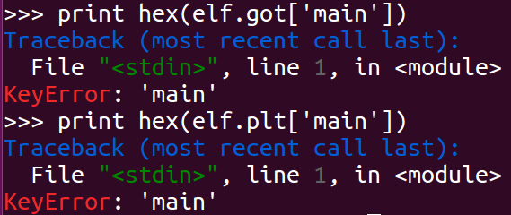
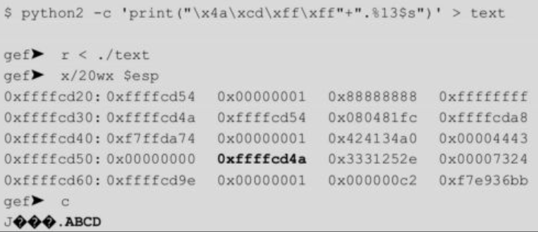
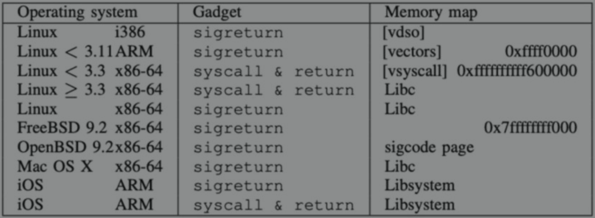
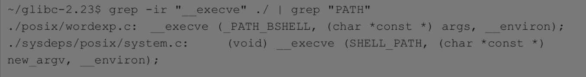
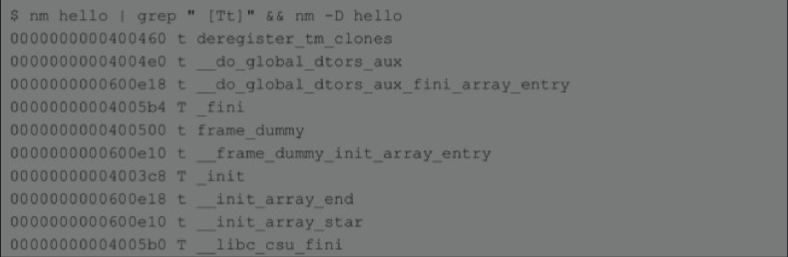

# 查看程序虚拟内存中的结构（包括被加载到内存中的so文件）：
- cat /proc/进程号/maps
# gdb调试时获得的内存地址与程序运行时不同，不能运用于pwn过程 
- gdb调试的时候栈地址和程序运行时不同所以我们需要开启core dump或者attach到运行的程序上来看程序运行时的栈地址。(见4.3.3节示例)，注意在通过core dump查看程序运行内存地址的过程中，如果操作系统进行过重启或其他操作，则需要重新触发crash创建新的和核心转储文件，从而重新确定程序运行过程中的内存地址
# pwn过程中system函数与/bin/sh字符串可以来源于libc
- libc库中自带system()函数和"/bin/sh"字符串，所以只要有libc库，就有执行system("/bin/sh")从而获得shell的基础(见4.3.3节示例)
# 程序未开启ASLR时，可以通过调试，确定系统中system函数以及'/bin/sh'字符串地址，从而将以上信息硬编码到shellcode中，以此获得shell
- gef中获取指定函数地址可以使用 p 指令，p system即打印system函数地址
  - 
- gef中获取指定字符串地址可以使用search-pattern 或 grep，从而在进程空间中搜索字符串
  - 
# 完全开启aslr，关闭pie时进行PWN的思路
- 在完全开启aslr，关闭pie时，程序本身加载基址不会变化，即程序中的plt，got等结构的地址不会发生变化，如果此时程序中使用了相关外部函数，例如libc中的write、system等，则此时，write@plt，system@plt等plt表项不会变化，仍然可以通过程序加载基址+固定偏移获得此类函数对应plt表项地址，从而进一步调用write，sysytem等函数，例如通过write@plt输出write@got，即可获得write函数的实际地址，该函数位于libc内，通过计算固定偏移，可以确定libc加载基址，进而确定libc内其他函数内存地址。整个过程中由于完全开启aslr，libc加载机制被随机化，但仅仅会影响对write函数对应got表项中的内容，不会影响write函数对应plt表项和got表项的内存地址，所以此时write@got，write@plt均能获得。（见4.4.4节示例）
# 定位libc中的函数于字符串（有libc文件\无libc文件）
- 不同版本libc内函数间固定偏移不同，如果能获得题目对应libc库文件，可以通过解析该库文件确定偏移，如果没有对应库文件，可以使用DynELF工具，该工具可以根据库文件中一个函数的内存地址解析出其他函数内存地址
# 延迟绑定后，通过读取.got.plt表，获取函数地址（实际执行时较为困难，因为pwntools无法很好定位虚拟内存空间中的可执行文件的elf结构，一般仅仅使用ELF模块单独读取未链接的可执行文件以及so文件）
- 当程序开启了aslr，将共享库的加载基址随机化，此时若想定位libc中的关键函数A的位置，若关键函数A在可执行程序中已经执行过，则其函数地址会被保存在对应的.got.plt表项中，可以通过读取对应表项获得函数A的地址，不过一般很难保证关键函数A在需要取得其函数地址前就已经被可执行程序调用
# 使用libc库中的__libc_start_main函数确定libc库加载基址
- 由于libc库中__libc_start_main函数会较早执行，所以其对应的got表项中会存储该函数的实际地址，可以通过输出函数（类似write等）泄露函数的实际地址，结合libc.symbols['__libc_start_main']，计算libc加载基址，即
  - libc加载基址=__libc_start_main - libc.symbols['__libc_start_main']
# ASLR与PIE两种机制的关系
- 关键资料
  - https://www.cnblogs.com/rec0rd/p/7646857.html
  - 资料收集文件夹下：ASLR与PIE的关系.md
- ASLR的是操作系统的功能选项，作用于executable（ELF）装入内存运行时，因而只能随机化stack、heap、libraries的基址
- PIE（Position Independent Executables）是编译器（gcc）功能选项（-fPIE），作用于excutable编译过程，可将其理解为特殊的PIC（so专用，Position Independent Code），加了PIE选项编译出来的ELF用file命令查看会显示其为so
- ASLR早于PIE出现，所以有return-to-plt、got hijack、stack-pivot(bypass stack ransomize)等绕过ASLR的技术；而在ASLR+PIE之后，这些bypass技术就都失效了，只能借助其他的信息泄露漏洞泄露基址（常用libc基址）。
- PIE只是在编译的过程中赋予了ELF加载到内存时其加载基址随机化的功能，也就是说PIE编译出来的ELF如果在ASLR=0的情况下，ELF的加载基址也是不会变的。
- ASLR 的三个级别实际为：
  - 0：不开启任何随机化；
  - 1：开启stack、libraries的随机化且如果可执行文件使用了pie编译，则可执行文件加载基址也随机化，此时由于可执行文件加载基址随机化，也会带来可执行文件内stack基址的随机化，即使此时ASLR级别仅为1；
  - 2：在1的基础上增加heap随机化。
- ***注意PIE编译出来的executable，如果ASLR=0的话，基址也是不会变的（有能力但没使用），如果ASLR=1的话，即使按照ASLR定义这个级别似乎不会对heap基址随机化，但是由于executable的基址已经随机化了，所以heap的基址自然也就被随机化了***
- ***总结：aslr是系统提供的机制,pie是编译器提供的机制，后者在编译阶段将elf文件（包括可执行文件或so文件）中的代码编译为可以在任意地址加载的情况，即使用编译选项-fPIE。其中pie机制仅能保证elf能够加载到任意地址，若想实际完成elf在任意内存的加载，aslr机制必须起作用。当elf文件的pie选项开启，但系统aslr关闭时，该elf文件无法在任意地址加载***
- ***此外，可以将pie机制理解为另一种PIC技术（Position Independent Code），即位置无关代码，PIC技术专门针对so文件，所有so文件编译器必须开启PIC,即编译生成so文件的gcc命令为：gcc -shared -fpic -o func.so func.c***
# ubuntu下libc库文件存储位置
- ubuntu中libc库一般位于/lib相关目录下，且关键文件libc.so.6实际上为链接文件，故操作libc库时不能将libc.so.6单独拷贝出来，最好使用绝对路径访问（例如：/lib/x86_64-linux-gnu/libc.so.6）
  - 
- 同一系统下，不同目标程序所依赖的libc库可能不同，例如ubuntu64位系统下32位程序与64位程序所依赖的libc库不同，在pwn时需要引用对应的libc库，使用ldd命令确定可执行文件所依赖的so库
  - 
# pwntools中输出字符串到标准输出
- raw_input("attach me")函数可以在pwntools中使用，从而将字符串输出到标准输出中
# pwntools中打印被调试程序pid
- pwntools中使用以下两命令，可以打印出当前被调试程序的pid，从而为之后gdb附加调试奠定基础
  - io=process('./a.out')  
  - print "pid"+str(proc.pidof(io))
# pwntools中实现目标程序gdb调试
- 想要在pwntools中实现对目标程序的调试，可以使用pwnlib.gdb模块
  - 其主要提供gdb.attach()和gdb.debug()两个函数
  - 相关资料1：CTF竞赛权威指南
  - 相关资料2:官方手册（可以根据其中的示例使用gdb.debug函数）：https://docs.pwntools.com/en/stable/gdb.html?highlight=debug#pwnlib.gdb.debug
  - 大致用法（进入python环境，逐行输入pwntools代码）
```bash
>>> from pwn import *
>>> io=gdb.debug('bash',''')
... break _start  
... continue  
... 
... break malloc
... break free
... continue
... ''')
#上面debug函数第二个参数时gdb命令，用于在对应函数处下断点以及继续执行，但实际测试发现断点并不会被设置，所以直接使用如下指令开始调试
>>> io=gdb.debug('bash')
#根据官方手册，被调试程序会断在开始动态链接so文件位置，此时进行断点的设置才是有效的（但无法针对so库中的函数下断，因为此时so库还未链接完成），注意因为是远程调试，此时的gdb中不支持单步步过等指令，具体能用的指令输入help查看
#该指令执行后跳出gdb调试窗口，即可正常进行调试，此时与gdb中输入continue，让程序继续运行，程序会等待输入
#此时与被调试进程交互可以使用返回的io，如下，可以相当于在bash中输入echo命令，然后得到返回
>>> io.sendline("echo ll")
>>> io.recvline()
'll\n'
#为了直接与被调试程序交互，可以使用以下命令，从交互中返回使用ctrl+c
>>> io.interactive()
[*] Switching to interactive mode
echo shell
shell
^C[*] Interrupted
#停止交互使用，此时gdb的调试同样停止
>>> io.close()
[*] Stopped process '/bin/bash' (pid 77450)
>>> 
```
# pwntools读/写/反汇编目标程序虚拟内存
- pwntools中elf模块的read函数可以实现从虚拟内存中读取指定长度数据，write函数实现向指定虚拟内存地址写入指定长度数据，disasm函数实现对指定内存的数据进行反汇编
  - elf.read(address,count)
  - elf.write(address,count)
  - elf.disasm(address,n_byte)
# 对于elf，使用pwntools查看其got表项、plt表项、符号表等结构
- 对于可执行文件
```bash
>>> elf=ELF('./a.out')
[*] '/home/lilin/Desktop/4.4.4/a.out'
    Arch:     i386-32-little
    RELRO:    Partial RELRO
    Stack:    No canary found
    NX:       NX enabled
    PIE:      No PIE (0x8048000)
>>> print hex(elf.sym['write'])#查看sym表项中的信息，即对应plt表项的首地址
0x8048320
>>> print hex(elf.plt['write'])#查看对应plt表项的地址
0x8048320
>>> print hex(elf.got['write'])#查看对应got表项的地址
0x804a014
>>> print hex(u32(elf.read(0x804a014,4)))#输出对应got表项中保存的内容
0x8048326
>>> print elf.disasm(0x8048320,16)#输出plt表项内容，证明got表项指向plt项第二条指令，说明此时延迟绑定还未发生
 8048320:       ff 25 14 a0 04 08       jmp    DWORD PTR ds:0x804a014
 8048326:       68 10 00 00 00          push   0x10
 804832b:       e9 c0 ff ff ff          jmp    0x80482f0
```
- 对于so文件
```bash
>>> libc=ELF('/lib32/libc.so.6')
>>> print hex(next(libc.search('/bin/sh'))) #在libc文件中查找/bin/sh字符串返回一个偏移
0x15912b
>>> print hex(libc.sym['system'])#在libc文件查找system函数地址，返回一个偏移
0x3a950
```
- 为证明so文件的符号表中保存的是指定函数在文件内的偏移，进行以下步骤
```bash
#调试目标程序，打印内存中system函数地址0xf7e40950
gef➤  p system
$1 = {<text variable, no debug info>} 0xf7e40950 <system>
#查看system函数起始汇编指令
gef➤  disassemble 0xf7e40950
Dump of assembler code for function system:
   0xf7e40950 <+0>:	sub    esp,0xc
   0xf7e40953 <+3>:	mov    eax,DWORD PTR [esp+0x10]
   0xf7e40957 <+7>:	call   0xf7f2338d
   0xf7e4095c <+12>:	add    edx,0x1756a4
   ....
End of assembler dump.
#查看system函数起始位置的内存数据，方便一会与文件中的数据匹配
gef➤  x/50bx 0xf7e40950
0xf7e40950 <system>:	0x83	0xec	0x0c	0x8b	0x44	0x24	0x10	0xe8
0xf7e40958 <system+8>:	0x31	0x2a	0x0e	0x00	0x81	0xc2	0xa4	0x56
0xf7e40960 <system+16>:	0x17	0x00	0x85	0xc0	0x74	0x0a	0x83	0xc4
0xf7e40968 <system+24>:	0x0c	0xe9	0xd2	0xfa	0xff	0xff	0x66	0x90
0xf7e40970 <system+32>:	0x8d	0x82	0x33	0x91	0xfa	0xff	0xe8	0xc5
0xf7e40978 <system+40>:	0xfa	0xff	0xff	0x85	0xc0	0x0f	0x94	0xc0
```
- 之前pwntools显示libc.sym['system']为0x3a950，定位libc文件对应偏移处，发现其文件内容与system函数起始数据一致，说明此处即为system函数的代码，而so文件的符号表中存储的是对应函数在文件中相对文件首地址偏移
  - 
- 同理，在文件中搜索字符串'/bin/sh'，证明pwntools中print hex(next(libc.search('/bin/sh')))返回了字符串在文件中的偏移
  - 
# elf文件中可执行文件与so文件内部的符号表、GOT、PLT表在存储程序内部函数及外部函数时具有不同的策略
- 对于可执行文件(a.out)
```cpp
#include<stdio.h>
#include<unistd.h>
void vuln_func(){
        char buf[128];
        read(STDIN_FILENO,buf,256);
}
int main(int argc,char *argv[]){
        vuln_func();
        write(STDOUT_FILENO,"HELLO WORLD\n",13);
}
```

- 1.1
  - pwntools输出虚拟内存地址
    - 
  - readelf -s a.out查看符号表内容，其保存函数虚拟内存地址
    - 
- 1.2
  - pwntools中输出对应函数plt表项首地址，其结果和elf.plt[]一致，即func@plt，可以用于调用该函数
    - 
  - readelf -s a.out查看符号表内容，外部函数符号值为0
    - 
- 1.3
  - pwntools输出内部函数的plt got表项，显示错误
    - 
  - objdump -R a.out查看程序got表项，got表项中仅有外部函数，不存在内部函数
    - 
  - objdump -d -j .plt a.out查看程序plt表项，plt表项中仅有外部函数，不存在内部函数 
    - 
- 1.4
  - pwntools输出外部函数的plt、got表项，得到对应表项的内存首地址
    - 
  - objdump -R a.out查看程序got表项，其对应表项内存首地址与pwntools中得到的结果相同
    - 
  - objdump -d -j .plt a.out查看程序plt表项，其对应表项内存首地址与pwntools中得到的结果相同
    - 
- 对于so文件(libhello.so)
```cpp
#include <stdio.h>
#include <stdlib.h>
void hello();
void hello()
{
    printf("this is in hello...\n");
}
```

- 2.1
  - pwntools输出对应函数相对文件加载基址的偏移（上面内容已经验证过），可以通过计算 函数在内存中的实际地址-对应偏移，得到so文件内存加载基址，从而结合so库中其他函数的偏移，得到so库中其他函数的内存中实际地址
    - 
  - readelf -s libhello.so查看符号表内容，其保存函数相对文件加载基址的偏移，与pwntools的输出一致
    - 
- 2.2
  - pwntools中输出对应函数plt表项相对文件加载基址的偏移，其结果和lib.plt[]一致
    - 
  -  readelf -s a.out查看符号表内容，外部函数符号值为0
     - 
- 2.3
  - pwntools输出内部函数的plt got表项，显示错误
    - 
  - objdump -R libhello.so查看程序got表项，got表项中仅有外部函数，不存在内部函数
    - 
  - objdump -d -j .plt libhello.so查看程序plt表项，plt表项中仅有外部函数，不存在内部函数 
    - 
- 2.4
  - pwntools输出外部函数的plt、got表项，得到对应表项的相对文件加载基址的偏移
    - 
  - objdump -R a.out查看程序got表项，其对应表项内存首地址与pwntools中得到的结果相同
    - 
  - objdump -d -j .plt a.out查看程序plt表项，其对应表项内存首地址与pwntools中得到的结果相同
    - 
  - 未验证pwntools中得到的的确是相关got表项和plt表项相对文件加载基址的偏移，验证so文件指定偏移处的内容为plt表
    - objdump -d -j .plt 命令得到的plt表项偏移以及内存内容
      - 
    - 对应偏移处文件实际内容，发现完全一致，从而验证了偏移的正确性
      - 
# 在pwntools中搜索elf文件中字符串
## 对于可执行文件
```bash
#加载可执行文件
>>> elf=ELF('./a.out')
[*] '/home/lilin/Desktop/a.out'
    Arch:     i386-32-little
    RELRO:    Partial RELRO
    Stack:    No canary found
    NX:       NX enabled
    PIE:      No PIE (0x8048000)
#此时输出elf文件的加载基址，即0x8048000
>>> print hex(elf.address)
0x8048000
#elf文件前四个字节为\x7fELF，所以从elf中第二个字节开始，存在一个"ELF"三个字符，下面的字符串搜索证明了这一点
#使用elf.search方法搜索到了elf文件中的字符串
#注意此时返回的地址为虚拟地址，而不是偏移，区别于在so文件中使用该方法
>>> print hex(next(elf.search(b'ELF')))
0x8048001
#官方文档中被搜索的字符串使用(b'ELF')形式，经过测试使用('ELF')也可以
>>> print hex(next(elf.search('ELF')))
0x8048001
```
## 对于so库文件
```bash
#加载so库文件
>>> libc=ELF('/lib/x86_64-linux-gnu/libc.so.6')
[*] '/lib/x86_64-linux-gnu/libc.so.6'
    Arch:     amd64-64-little
    RELRO:    Partial RELRO
    Stack:    Canary found
    NX:       NX enabled
    PIE:      PIE enabled
#使用相同的方法，发现so文件中.search方法返回的是字符串相对于文件起始起始的偏移
>>> print hex(next(libc.search(b'ELF')))
0x1
#常在libc库中搜索'/bin/sh'字符串（被搜索的字符串前可以加b，可以不加b）
>>> print hex(next(libc.search('/bin/sh')))
0x18ce57
```
- 使用010editor验证.search方法输出正确
  -   
- 根据以上内容可以推测4.4.4项目中,通过泄露write函数地址，可以进一步确定lib加载基址，进而确定system函数地址以及“/bin/sh”字符串的地址
```bash
#以下两指令用于确定system函数地址以及/bin/sh字符串地址，通过证明next(libc.search('/bin/sh'))的值为字符串相对so库文件起始地址的偏移，侧面正面了write_addr-libc.sym['write']=so库的内存加载基址
system_addr=write_addr-libc.sym['write']+libc.sym['system']
binsh_addr=write_addr-libc.sym['write']+next(libc.search('/bin/sh'))
```
# 关于next(libc.search(b'ELF'))中的next()
- next()函数是pyton提供的，用于返回迭代器的下一个项目。
- next() 函数要和生成迭代器的 iter() 函数一起使用。
- 示例代码
```python
#!/usr/bin/python
# -*- coding: UTF-8 -*-
 
# 首先获得Iterator对象:
it = iter([1, 2, 3, 4, 5])
# 循环:
while True:
    try:
        # 获得下一个值:
        x = next(it)
        print(x)
    except StopIteration:
        # 遇到StopIteration就退出循环
        break
```
- 输出为
```bash
1
2
3
4
5
```
***以上情况说明libc.search(b'ELF')会返回一个迭代器，可以通过next函数输出多个搜索结果***
# 关于libc.address的问题
- 若libc=ELF("libc.so.6")
- 则0=libc.address 
- 即so文件通过.address方法，得到其加载基址为0
# call指令的作用细节
- 对于e8这种call指令，其实际跳转到的内存地址=e8指令后偏移+该call指令后下一条指令的地址
  - 例如：0x6c4 = 0x6c8 + 0xfffffffc
    - 
  - 例如：0xf7dff670 = 0x5656d6c8 + 0xa1891fa8
# 查看文件的plt got表项内容
- 可以通过objdump readelf等工具查看elf文件的符号表，plt表项，got表项地址（无法查看got表项具体内容）
- 通过gdb调试，在不运行可执行文件的情况下，通过x等指令，通过指定got plt表项的地址，可以查看其具体内容
# pwntools中elf.sym相关用法
- 对于开启了"-fpic"(针对so文件) "-pie -fpie" "-pie -fno-pie"(针对开启了pie机制的可执行文件)，在使用pwntools中的elf模块，（elf=ELF('file')）时，
  - elf.sym['内部函数']返回该函数在文件内部的偏移，可利用此类返回值，结合对应函数实际内存地址（通过内存泄露漏洞），计算出so文件或开启pie机制的可执行文件的内存加载基址，并进一步用加载机制+elf.sym['内部函数']的基址得到so文件或开启pie机制的可执行文件内其他函数的地址
  - elf.sym['外部函数']返回该函数对应plt表项在文件内部的偏移（其值与elf.plt['外部函数']相等），在此基础上加上文件加载基址，可以得到plt表项的实际地址
- 对于未开启pie机制的可执行文件，
  - elf.sym['内部函数']返回该函数对应plt表项的虚拟内存地址（例如书中4.3.3一节），可以通过调用该地址，直接调用对应函数
  - elf.sym['外部函数']返回该函数对应plt表项的虚拟内存地址（其值与elf.plt['外部函数']相等），可以通过调用该地址，直接调用对应函数
# pwntools中接收程序泄露的内存地址
- 假如可执行文件中存在函数print("%p\n",&main),此时该程序可以泄露main函数的内存地址
- 此时pwntools中可以用main_addr=int(io.recvline(),16)接收程序输出16进制的内存地址
  - int()函数为python提供，用于将字符串或数字转为整型，第一个参数为字符串或数字，第二个参数为数字的进制，此时为16进制
  - io.recvline()用于接收一个字符串（该函数可以选择是否保存字符串结尾的"\n"）
# linux和windows中的程序默认加载基址
- 可执行文件可以确定自己的默认加载基址 linux中为0x08048000 winows中为0x400000
# 启用延迟绑定与关闭延迟绑定的区别
- 启用延迟绑定时，第一次执行call指令会跳转到printf@plt，然后jmp到对应的.got.plt项，再跳回来进行符号绑定，完成后.got.plt项才被修改为真正的函数地址。
  - 
- 关闭延迟绑定时（当使用Full RELRO时，延迟绑定自动关闭），所有的解析工作在程序加载时完成，执行call指令跳到对应的.plt.got项，然后jmp到对应的.got项，这里已经保存了解析好的函数地址
  - 
# 关于linux中二进制文件解释器
- file命令输出的文件解释器
  - 
- 解释器在程序加载时对共享库进行动态链接，ld-linux.so即为elf动态链接器，程序若要正确执行，需要libc与ld版本相匹配
- 一个elf的解释器路径程序编译时被写入程序头（PT_INTERP），可以通过修改elf程序头中的该字段从而改变elf二进制解释器（详见第五章：分析环境搭建.md）
# 使用gdb调试时，ASLR会自动关闭，所以每次看到的栈地址均不变
# 使用ldd分析可执行文件的依赖库时，该可执行文件会被执行，需注意可执行文件是否可信
# 使用string命令也可以在so库中查找是否存在指定字符串

# 生成shellcode
- msf找对应模块生成
- pwntools中的pwnlib.shellcraft可生成shellcode
- 去shell-storm网站找一些shellcode的学习案例
- 从调试器中扣shellcode（x64dbg）
# 向可执行文件中直接传递十六进制数据作为输入（将十六进制数据保存到文本文件，使用流将文件内容传到可执行文件中）
- 
# 输入输出的截断字符
“\x07”、“\x08”、“\x20”、“\x0c”、“\x0a”、“\x0b”
# gadget的地址中存在截断字符时的思路
- 需要使用输入输出函数将gadget写入到内存中，但gadget地址中存在截断字符，实现思路如下
- “leave;retn”的地址0x0000000000400adf存在截断字符“0x0a”，导致不能通过正常方式写入缓冲区，虽然这也是可以解决的（比如先将“0x0a”换成非截断字符，之后再通过寄存器将“0x0a”替换进去，这是解决缓冲区存在截断字符的通用方法）
# 关闭ASLR保护，这可以保证栈在gdb环境中和直接运行保持一致，虽然这两个栈地址不一定相同；其次，因为在gdb环境中的栈地址和直接运行是不一样的，所以需要结合格式化字符串漏洞读取内存，可以先泄露一个地址，再根据该地址计算实际地址。
# 不同操作系统中syscall sigreturn int 0x80等常见gadget的位置
- 64位程序中，使用程序中的syscall&ret gadget，需要将rax设置对应系统调用的调用号（例如sigreturn的系统调用号0xf），syscall&ret gadget的地址在一些较老的系统上是没有随机化的，通常可以在vsyscall中找到，地址为0xffffffffff600000
- 32位程序中，使用程序中的int 0x80&ret gadget，通常可以在vDSO中找到，但这个地址可能是随机的
- 常见sigreturn以及syscall gadget位置
# 64位系统中，syscall系统调用根据rax的调用不同的系统调用，为了设置rax的值，可以通过调用read等函数，此类函数执行完毕后会自动对rax赋值（例如read函数执行完毕后将读取的字节数赋给rax）详见10.4.1
# plt表位于elf代码段，got表位于elf程序数据段的起始位置
# linux中常见系统调用号
- sigreturn：0xf
- execve：59
- read：0
- write：1
# 动态链接器加载动态链接库的顺序
1. 编译目标代码时指定的动态库搜索路径；
2. 环境变量LD_LIBRARY_PATH指定的动态库搜索路径；
3. 配置文件/etc/ld.so.conf中指定的动态库搜索路径；
4. 默认的动态库搜索路径/lib；
5. 默认的动态库搜索路径/usr/lib。
# 注意当相关堆漏洞利用技巧设计利用堆块释放时的相邻空闲堆块合并机制时，相关堆块不能为fast chunk，因为fast chunk不存在空闲堆块合并机制
# small chunk与large chunk被释放后首先会被链入unsorted bin中，以此提高内存分配效率，之后对应chunk才会从unsorted bin中分配回small bin或large bin中
# 堆块释放时由于合并操作生成的堆块会先链入到unsorted bin中，之后再根据其大小返回到small bin或large bin中
# 堆块申请时的堆块分割操作所产生的剩余部分堆块会链入unsorted bin中，该堆块在unsorted bin中作为last_remainder存在，用于提高堆内存分配连续性
# 被释放的chunk合并以及重新申请的部分细节
- 当非fast chunk的chunk被释放时，首先会尝试检测当前chunk的上一个chunk(即内存低地址处)是否被释放，之后尝试检测当前chunk的下一个chunk(即内存高地址处)是否被释放，如果相邻的chunk处于释放状态，则两个free chunk就会合并为一个大的free chunk
- 合并形成的free chunk首先会被链入unsorted bin中，此时程序申请堆内存，如果合并形成的free chunk的大小恰好等于所申请的堆内存的大小+2*SIZE_SZ，该chunk直接从unsorted bin中断链并分配给用户使用
- 如果此时程序申请的堆空间小于该chunk所能提供堆空间，则此时unsorted bin中由于堆块合并所形成的free chunk会根据其自身大小返回到small bin或large bin中，然后在small bin或large bin中对对应chunk进行切分，将满足大小要求的chunk返回给用户，剩余部分作为last_remainder链入unsoretd bin中，等待下一次堆内存申请时使用
# fastchun中由于只有fd指针，故其断链相关操作不涉及unlink检查，故大量漏洞技巧涉及fastbin时，利用难度相对较低，详见fast chunk扩展已分配块示例程序（向前合并）
# 堆块分配的部分过程
- 堆块分配的过程，当请求的大小在fastbins和smallbins中无法得到满足时，就会进入一个for循环，按照先进先出的方式遍历unsorted bin，此时如果请求是一个small chunk，且满足要求，则直接返回；如果不是，则将chunk取出并整理回对应的bins中，然后进行下一轮循环。
# 注意在遍历unsorted bin寻找对应大小的chunk时，如果刚好遇到大小合适的chunk，就会将其取出，返回给用户，在此之前的unsorted bin中其他大小不匹配的chunk均会根据其chunk大小放回small bin或large bin中，这也是chunk被链入small bin以及large bin中的唯一机会
# 当漏洞利用过程中存在Tcache机制时，为避免TCache相关机制（即TCache bin中chunk的申请与释放）影响正常漏洞利用（例如通过unsorted bin中相关chunk进行漏洞利用），需要通过内存申请和释放操作将tcache bin填满或清空，从而为排除tcache机制对漏洞利用过程的干扰，具体示例见unsorted bin into stack示例程序部分。
# 修改全局变量global_max_fast，可以使更大的chunk被视为fastbin，从而做一些fastbin attack，设计的漏洞利用技巧为unsorted bin attack
# 使用grep命令查找指定函数调用位于glibc源码的哪个文件中:grep -ir "函数名" ./ | grep "PATH"
- 
# 显示可执行文件中所有的函数： nm 文件名 | grep " [Tt]" && nm -D 文件名
- 
- 