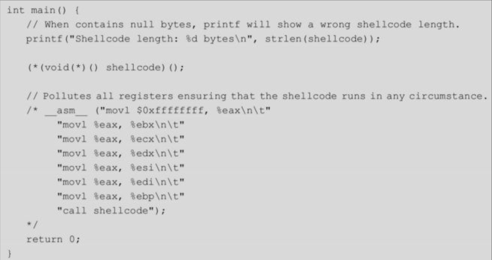

# shellcode基本原理
- shellcode使用机器语言编写，利用软件漏洞执行
- shellcode分类 
  - 本地shellcode通常用于提权，攻击者利用高权限程序中的漏洞（例如缓冲区溢出），获得与目标进程相同的权限。
  - 远程shellcode则用于攻击网络上的另一台机器，通过TCP/IP套接字为攻击者提供shell访问。根据连接的方式不同，可分为
    - 反向shell（由shellcode建立与攻击者机器的连接）
    - 绑定shell（shellcode绑定到端口，由攻击者发起连接）
    - 套接字重用shell（重用exploit所建立的连接，从而绕过防火墙）。
- shellcode分阶段执行
  - 有时，攻击者注入目标进程中的字节数是被限制的，因此可以将shellcode分阶段执行，由前一阶段比较简短的shellcode将后一阶段复杂的shellcode（或者可执行文件）下载并执行，这是恶意程序常见的一种操作。
  - 但有时攻击者并不能确切地知道后一阶段的shellcode被加载到内存的哪个位置，因此就出现了egghunt shellcode，这段代码会在内存里进行搜索，直到找到后一阶段的shellcode（所谓的egg）并执行。
- 使用函数指针或内联汇编从而调用shellcode
  - 
  - 
- 编写简单的shellcode
  - 去shell-storm网站找一些shellcode的学习案例
  - linux32位shellcode，实现了execve("/bin/sh")
    - 
    - 首先使用NASM对这段汇编代码进行编译，然后使用ld进行链接，运行后获得shell。
    - 
    - 
    - 提取可执行文件中的shellcode
    - 
    - 将提取出来的字符串放到C程序中，赋值给shellcode[]。需要注意的是，shellcode作为全局初始化变量，是存放在.data段的，而编译时默认开启的NX保护机制，会将数据所在的内存页标识为不可执行，当程序转入shellcode执行时抛出异常。因此，我们需要关闭NX。
    - 
  - linux64位shellcode
    - 
- shellcode变形
  - 被注入进程的shellcode会被限制使用某些字符，例如不能有NULL、只能用字母和数字等可见字符、ASCII和Unicode编码转换等，因此需要做一些特殊处理。
  - Null-free shellcode不能包含NULL字符，因为NULL会将字符串操作函数截断，这样注入或者执行的shellcode就只剩下NULL前面的那一段。为了避免NULL字符的出现，可以用其他相似功能的指令替代
  - 对于限制了只能使用可见字符字母，也就是字母和数字组合（alphanumeric）的情况，参考Phrack的文章Writing ia32alphanumeric shellcodes，可以采用自修改（self-modifying）代码的方法，将原始shellcode的字符进行编码，使其符合限制条件。相应地，需要在shellcode中加入解码器，在代码执行前将原始shellcode还原出来。
  - 渗透测试框架Metasploit中就集成了许多shellcode的编码器，可以选用
  - 获得的仅有可见字符组成的shellcode，将可见字符转化为shellcode形式
    - 
# pwntools
- 7.2节
# zio
- 7.3节