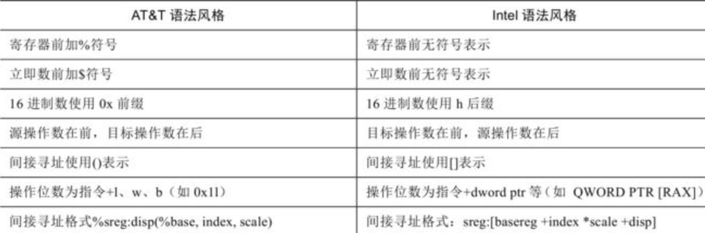
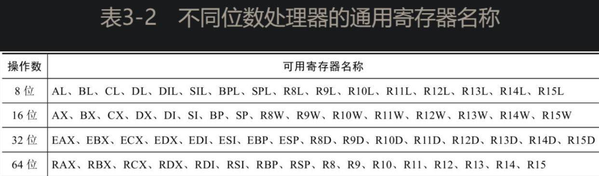

# cpu架构与指令集
## 指令集架构
- 通常可分为CISC（复杂指令集）和RISC两大阵营
- 复杂指令集
  - 在Linux发行版中，将x86-64称为amd64，而x86则称为i386。
  - 指令长度不定长，有利于通过错位获得gadget
- 精简指令集
  - 旨在通过减少指令的数量和简化指令的格式来优化和提高CPU的指令执行效率
  - 指令长度固定，有利于反汇编
  - 2011年推出的ARMv8将指令集扩展到64位，称为AArch64，继承自ARMv7的指令集则称为AArch32。
  - 在Linux发行版中，将AArch64称为aarch64，AArch32则称为arm。
# x86/x64汇编基础
## cpu操作模式
- 对于x86处理器而言，有三个最主要的操作模式：保护模式、实地址模式和系统管理模式，此外还有一个保护模式的子模式，称为虚拟8086模式。
- 系统管理模式为操作系统提供了诸如电源管理或安全保护等特性机制。
- 对于x86-64处理器而言，除上述模式外，还引入了一种名为IA-32e的操作模式。该模式包含两个子模式，分别为兼容模式和64位模式，在兼容模式下现有的32位和16位程序无须重新编译；在64位模式下，处理器将在64位的地址空间下运行程序。
## 语法风格
- x86汇编语言主要的语法风格有两种：AT&T风格和Intel风格。
- 
## 寄存器与数据类型
- 
## 数据传送与访问
- mov:不允许在两个内存间传递数据
- xchg：不允许内存间的数据交换
## 算术运算与逻辑运算
- inc
- dec
- add
- sub
- neg：把操作数转换为二进制补码，并将操作数的符号位取反。
## 跳转指令与循环指令
- jmp
- loop，使用ecx寄存器计数，
  - 实地址模式中略有不同，CX寄存器是LOOP指令与LOOPW指令的默认循环计数器，ECX寄存器为LOOPD指令的循环计数器，64位的x86汇编语言LOOP指令使用RCX为默认循环计数器
- LOOP指令执行分为两步，第一步是ECX值减1；第二步将ECX与0进行比较，如果ECX不为0，则跳转到标号地址处；如果ECX为0，则不发生跳转，执行LOOP指令的下一条指令
## 栈与函数调用
- 在Linux上，可以使用命令“ulimit -a”查看或更改当前系统默认的栈大小
- pushfd与popfd
  - 由于MOV指令不允许将标志位寄存器的值复制到一个变量，因此使用PUSHFD指令就是保存标志位寄存器中标志位的最佳途径。PUSHFD指令把32位EFLAGS寄存器的内容压入栈中，POPFD指令则把栈顶部数据弹出至EFLAGS寄存器中。