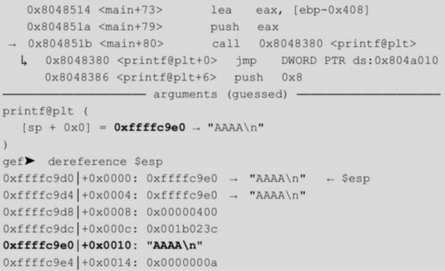

# 格式化输出函数
- printf()就是一个变参函数，它有一个强制参数，即格式化字符串。
- 格式化字符串中的转换指示符决定了可选参数的数量和类型。
- 变参函数要获取可选参数时，必须通过一个类型为va_list的对象，也称为参数指针（argument pointer），它包含了栈中至少一个参数的位置。使用这个参数指针可以从一个可选参数移动到下一个可选参数，从而获取所有的可选参数。va_list类型被定义在头文件stdarg.h中。
- c语言中的格式化输出函数（参考“man 3 printf”）
  - 
  - fprintf()：按照格式字符串将输出写入流中。三个参数分别是流、格式字符串和变参列表。
  - printf()：等同于fprintf()，但是它的输出流为stdout。
  - sprintf()：等同于fprintf()，但是它的输出不是写入流而是写入数组。在写入的字符串末尾必须添加一个空字符。
  - snprintf()：等同于sprintf()，但是它指定了可写入字符的最大值size。超过第size-1的部分会被舍弃，并且会在写入数组的字符串末尾添加一个空字符。
  - dprintf()：等同于fprintf()，但是它的输出不是写入流而是一个文件描述符fd。
  - vfprintf()、vprintf()、vsprintf()、vsnprintf()、vdprintf()：分别与上面的函数对应，但是它们将变参列表换成了va_list类型的参数。
- 格式化字符串结构
  - 格式字符串是由普通字符（ordinary character）（包括“%”）和转换规则（conversion specification）构成的字符序列。普通字符被原封不动地复制到输出流中。
  - 转换规则根据与实参对应的转换指示符对其进行转换，然后将结果写入输出流中。一个转换规则由必选部分和可选部分组成。
  - 转换指示符（type）是必选部分，用来表示转换类型。
  - 可选部分parameter比较特殊，它是一个POSIX扩展，不属于C99，用于指定某个参数，例如%2$d，表示输出后面的第2个参数。
  - 标志（flags）用来调整输出和打印的符号、空白、小数点等。
  - 宽度（width）用来指定输出字符的最小个数。
  - 精度（.precision）用来指示打印符号个数、小数位数或者有效数字个数。
  - 长度（length）用来指定参数的大小。
    - 
  - 常见的转换指示符和长度如下。
    - 
  - 相关实例，注释部分是每条语句的输出结果。
    - 
- glibc还允许用户为printf()的模板字符串（template strings）定义自己的转换函数，具体可以参考12.5节SSP Leak。另外，某些编译器（如GCC，使用编译参数-Wall或-Wformat）会对printf类函数的格式化参数进行静态检查，并把问题报告给用户。
# 格式化输出函数参数解析过程
- 进入printf()之后，函数首先获取第一个参数（即格式化字符串），一次读取一个字符。如果字符不是“%”，那么字符被直接复制到输出。否则，读取下一个非空字符，获取相应的参数并解析输出。
# 格式化字符串漏洞原理
- 基本原理见9.2.1节
- 桌面端较为少见，物联网设备中仍存在
- 核心原理：格式字符串要求的参数和实际提供的参数不匹配。
- 关键要素：
  - %n的转换指示符
  - %s的转换指示符
  - %1$s中的parameter部分，即1$可以在格式化字符串中指定特定参数
  - %16d中的width部分，用以指定输出字符的最小个数
  - %.16d中的.precision部分，与width类似，用于指定输出的字节数
  - 长度修饰符可以与width和.precision，从而一次性覆盖单字节、双字节、四字节、八字节等
  - 以上结合可以实现泄露指定内存数据或向指定内存写入数据
- 可能导致漏洞的情况
  - 格式化字符串由外界输入指定
# 格式化字符串漏洞利用
- 可能的利用效果
  - 使程序崩溃、栈数据泄露、任意地址内存泄露、栈数据覆盖、任意地址内存覆盖。
- 示例程序源码
  - 
## 使程序崩溃
- 原理基于程序对无效指针进行解引用操作
- 使用类似下面的格式字符串即可触发崩溃。原因有3点：（1）对于每一个“%s”，printf()都要从栈中获取一个数字，将其视为一个地址，然后打印出地址指向的内存，直到出现一个空字符；（2）获取的某个数字可能并不是一个地址；（3）获得的数字确实是一个地址，但该地址是受保护的。
  - 
## 栈数据泄露
- 通过%n$x可以指定格式化输出函数的第n个参数，从而泄露任意位置的栈数据
- 输入“%08x.%08x.%08x.%08x.%08x”作为格式字符串，要求printf()从栈中取出5个参数并将它们以8位十六进制数的形式打印（也可以换成“%p.%p.%p.%p.%p”）。
  - 
- 那么如果想直接泄露指定的某个数据，则可以使用与下面类似的格式字符串，这里的“n”表示位于格式字符串后的第n个数据。
  - 
## 任意地址内存泄露（常用于泄露.got.plt表项内容，从而泄露函数实际地址）
- 攻击者使用类似“%s”的格式规范就可以泄露出参数（指针）所指向内存的数据，程序会将它作为一个ASCII字符串处理，直到遇到一个空字符。所以，如果攻击者能够操纵这个参数的值，那么就可以泄露任意地址的内容。
- 为了泄露任意内存地址处的数据，需要使用%s对栈中数据进行解引用，与此同时，需要将被泄露内存的内存地址写入到栈中，从而被%s所解析，可以将目标内存地址设置在格式字符串的首位，当程序中将格式化字符串作为局部变量使用时，会将格式化字符串保存在栈中，从而通过%n$s来解析格式化字符串首位的内存地址(n为格式化字符串在栈中所在位置相当于格式化输出函数的第n个参数)
- 当使用该方法泄露.got.plt表项中的内容，从而获得指定函数地址时，可能会遇到两个问题
  - 该方法需要将.got.plt表项的地址写入到内存中，以此被%n$s解析，但是当.got.plt表项地址中存在\x0c等数据时，会导致输出截断，从而无法正常将该内存地址写入栈中，此时需要选择内存地址中不包括截断字符的.got.plt表项。
  - 由于.got.plt表项保存的内存地址不一定是可打印，所以%n$s可能无法正常输出，此时需要使用pwntools获得正确内存地址
- 仍以上面的程序为例，我们输入“%4$s”，此时输出的arg4就变成了字符串“ABCD”而不再是地址“0xffffcd4a”。
  - 
- 尝试获取任意内存的数据，此时需要手动将地址写入栈中。我们输入类似“AAAA.%p”的格式字符串。
  - 
- 可以看到，“0x41414141”是打印的第13个字符，所以只要使用“%13$s”即可读出0x41414141所指向的内存。当然，这里是一个不合法的地址。下面我们将其换成合法地址，比如字符串“ABCD”的地址0xffffcd4a。
  - 
- 于是就打印出了字符串“ABCD”。在漏洞利用中，我们可以利用这种方法，把某函数的GOT地址传进去，从而获得所对应函数的虚拟地址。然后根据函数在libc中的相对位置，就可以计算出任意函数地址，例如system()。
- 通过格式化字符串漏洞泄露函数地址
  - 先看一下重定向表。
    - 
  - 理论上选择任意一个都可以，但是在实践中也可能会出现一些问题。下面分别是使用printf、__libc_start_main、putchar和__isoc99_scanf的结果。
    - 
  - 细心一点的读者会发现第一个printf的结果有问题。我们输入了“\x0c\xa0\x04\x08（0x0804a00c）”，可是13号位置却是“0x2e0804a0”，那么“\x0c”去哪儿了呢，查一下ASCII表，发现这是一个不可见字符，因此被程序省略了。同样会被省略的字符还有不少，如“\x07”、“\x08”、“\x20”等。
  - 选用了最后一个函数__isoc99_scanf：
    - 
  - 由于0x804a018处的数据仍然是一个指针，使用“%13$s”打印并不成功。下面我们会介绍怎样借助pwntools获得正确格式的虚拟地址，并进行利用。当然，并非总能通过4字节的跳转（如“AAAA”）来步进参数指针去引用格式字符串的起始部分，有时还需要在格式字符串之前加一个、两个或三个字符的前缀来实现一系列的4字节跳转。
## 栈数据覆盖
- “%n”转换指示符将当前已经成功写入流或缓冲区中的字符个数存储到由参数指定的整数中。
  - 
- 使用具体的宽度（width）或精度（.precision）转换规范来控制写入的字符个数，即在格式字符串中加上一个十进制整数来表示输出的最小位数，如果实际位数大于定义的宽度，则按实际位数输出，反之则以空格或0补齐（0补齐时在宽度前加点“.”或“0”）
  - 
- 尝试把地址“0x8048000”写入内存
  - 
- 在示例程序中，我们尝试将arg2的值更改为任意值（例如0x00000020，十进制32），于是构造格式字符串“\x28\xcd\xff\xff%08x%08x%012d%13$n”，
  - “\x28\xcd\xff\xff”是arg2的地址，占4字节，
  - “%08x%08x”表示两个8字符宽的十六进制数，占16字节，
  - “%012d”占12字节，
  - 三个部分加起来共占4+16+12=32字节，也就是把arg2赋值为0x00000020。
  - 格式字符串最后一部分“%13$n”是最重要的一部分，表示格式字符串的第13个参数，即写入0xffffcd28的地方（0xffffcd58），printf()通过该地址找到被覆盖数据。
    - 
## 任意地址内存覆盖。
- 将指定内存数据覆盖为小于4的值（通过将目标内存地址放置在格式化字符串后部）
  - 通过整数溢出，但该思路现实中很难实现
  - 如果将目标内存地址置于格式化字符串头部，则格式化输出函数至少会输出4字节内容，则写入栈内存地址的值至少为4，通过将目标地址放置在格式化字符串后部，结合%n$n指定具体参数，将栈中数据覆盖为小于4的值
    - 使用格式字符串“AA%15$nA"+"\x38\xd5\xff\xff”，开头的“AA”占2个字节，即将地址赋值为2，中间“%15$n”占5个字节（这里不是%13$n，因为地址被放在了后面），是第15个参数，后面跟上一个“A”占用1个字节。于是前半部分总共占用2+5+1=8个字节，刚好是两个参数的宽度，这里的8字节对齐十分重要。最后，输入我们要覆盖的地址“\x38\xd5\xff\xff”，如下所示。
      - 
- 将指定内存数据覆盖为较大值（通过格式化字符串的长度修饰符，实现一次性覆盖多字节的内存内容）
  - 就将内存覆盖为小于4时使用的方法而言，如果要将一个内存地址（例如0x12345678）覆盖到指定内存上，则需要格式化输出函数输出0x12345678个字符，这样做占用的内存空间太大，往往会覆盖其他重要的地址而出错。因此，我们尝试通过长度修饰符来更改值的大小。（即一次性修改多个字节的内存数据）
  - 格式化字符串的长度修饰符
    - 
    - 
  - 将指定内存地址处的数据修改为0x12345678（通过hhn的长度修饰符，每次写入1字节数据，将0x12345678分四次写入目标地址）
    - 尝试写入“0x12345678”到地址0xffffcd28，首先使用“AAAABBBBCCCCDDDD”作为输入。
      - 
    - 由于我们想要逐字节覆盖，就需要4个用于跳转的地址，4个写入地址和4个值，对应关系如下（小端序）。
      - 
    - 因此，我们把“AAAA”、“BBBB”、“CCCC”、“DDDD”占据的地址分别替换成括号里的值，再适当使用填充字节使8字节对齐。构造输入：
      - 
    - 其中，前四个部分是4个写入地址，占4 x 4=16字节，后面四个部分分别用于写入十六进制数，由于使用了“hh”，所以只会保留一个字节：0x78（16+104=120 -> 0x78）、0x56（120+222=342 -> 0x0156-> 0x56）、0x34（342+222=564 -> 0x0234 -> 0x34）、0x12（564+222=786 -> 0x312 -> 0x12）。执行结果如下所示。
      - 
- ***强调两点：首先，需要关闭ASLR保护，这可以保证栈在gdb环境中和直接运行保持一致，虽然这两个栈地址不一定相同；其次，因为在gdb环境中的栈地址和直接运行是不一样的，所以需要结合格式化字符串漏洞读取内存，可以先泄露一个地址，再根据该地址计算实际地址。***
# x86-64中的格式化字符串漏洞
- 在x86-64体系中，多数调用惯例都是通过寄存器传递参数的。在Linux上，前六个参数分别通过RDI、RSI、RDX、RCX、R8和R9进行传递；而在Windows中，前四个参数通过RCX、RDX、R8和R9来传递。
- 还是上面的程序，把它编译成64位。
  - 
- 运行后传入字符串“AAAAAAAA%p.%p.%p.%p.%p.%p.%p.%p.%p.%p.”，并运行到printf()函数处。
  - 
  - 
- 可以看到，前五个输出分别来自寄存器RSI、RDX、RCX、R8和R9，后面的输出才取自栈，其中“0x4141414141414141”在“%8$p”的位置。这里有个问题，为什么前面说Linux有6个寄存器用于传递参数，可是这里只输出了5个呢？原因是有一个寄存器RDI被用于传递格式字符串（现在你可以回到上面x86的部分，可以看到格式字符串通过栈传递，但是同样的也不会被打印出来）。其他的操作和x86没有什么大的区别，只是这时我们就不能修改arg2的值了，因为它被存入了寄存器。
# fmtstr模块
- pwntools pwnlib.fmtstr模块提供了一些字符串漏洞利用的工具。该模块中定义了一个类FmtStr和一个函数fmtstr_payload。
- FmtStr提供了自动化的字符串漏洞利用。
  - 
  - execute_fmt (function)：与漏洞进程进行交互的函数；
  - offset (int)：你控制的第一个格式化程序的偏移量；
  - padlen (int)：在paylod之前添加的pad的大小；
  - numbwritten (int)：已经写入的字节数。
- fmtstr_payload则用于自动生成格式化字符串payload。
  - 
  - offset (int)：你控制的第一个格式化程序的偏移量；
  - writes (dict)：格式为{addr: value, addr2: value2}，用于往addr里写入value的值（常用：{printf_got}）；
  - numbwritten (int)：已经由printf函数写入的字节数；
  - write_size (str)：必须是byte、short或int。指定要逐byte写、逐short写还是逐int写（hhn、hn或n）。
- 模块使用实例
  - 任意地址内存读写，关闭ASLR，关闭PIE，使程序的内存地址固定。
  - 程序源码
  - 思路是将printf()函数的地址改成system()函数的地址，这样当再次输入“/bin/sh”时，就可以获得shell了。
  - 第一步先计算偏移，虽然pwntools可以很方便地构造出exp，但这里还是先演示手工方法怎么做，最后再用pwntools的方法。在main处下断点并运行程序，这时libc已经加载进来了，我们输入“AAAA”试一下。
    - 
  - 可以看到，printf()的变量0xffffc9e0在栈的第5行，除去第一个格式化字符串，即偏移量为4。接下来分别获取printf()的GOT地址、虚拟地址以及system()的虚拟地址。
    - 
  - 最后，我们使用pwntools构造完整的漏洞利用代码。
    - 
# 例题
- 9.2.4　HITCON CMT 2017：pwn200
  - ，利用方式就是格式化字符串泄露Canary值，并在栈溢出时填充上去，从而覆盖返回地址，跳转到canary_protect_me()函数获得shell。
- 9.2.5　NJCTF 2017：pingme
  - 只提供了IP和端口，没有给二进制文件，是一道blind fmt。要求我们在没有二进制文件和libc.so的情况下进行漏洞利用，好在保护机制只开启了NX
  - 对于这类题目，通常有两种方法可以解决，一种是利用信息泄露把程序从内存中dump下来，另一种是使用pwntools的DynELF模块。

