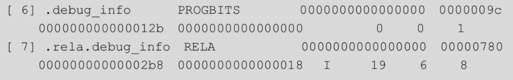

# 编译原理
1. 词法分析（Lexical analysis）：读入源程序的字符流，输出为有意义的词素（Lexeme）；
2. 语法分析（Syntax analysis）：根据各个词法单元的第一个分量来创建树型的中间表示形式，通常是语法树（Syntaxtree）；
3. 语义分析（Semantic analysis）：使用语法树和符号表中的信息，检测源程序是否满足语言定义的语义约束，同时收集类型信息，用于代码生成、类型检查和类型转换；
4. 中间代码生成和优化：根据语义分析输出，生成类机器语言的中间表示，如三地址码。然后对生成的中间代码进行分析和优化；
5. 代码生成和优化：把中间表示形式映射到目标机器语言。

# gcc编译过程
- 预处理：处理源代码中所有#开头的命令，将其转换后直接插入程序文本中，删除注释，添加行号和文件名标识
  - 使用工具cc1
  - gcc -E hello.c -o hello.i
- 编译：将源码转为汇编代码，源码通过词法分析、语法分析、语义分析以及优化，最终生成汇编代码，汇编代码中变量符号的地址为0，函数调用指向call指令下一条指令的位置，说明此时还未完成代码的符号解析与重定位，留待链接阶段完成。
  - 使用工具cc1
  - 处理对象可以是.c或.i文件
  - 
  - GCC默认使用AT&T格式的汇编语言，添加编译选项“-masm=intel”可以将其指定为我们熟悉的intel格式。编译选项“-fno-asynchronous-unwind-tables”则用于生成没有cfi宏的汇编指令，以提高可读性
- 汇编：将汇编代码转为机器码，生成可重定位文件（.o）
  - 使用工具as
  - 处理对象可以是.c或.s
  - 
- 链接：将多个中间文件机器码拼接为一个可执行文件，同时将动态链接库链接到可执行文件，分三种、编译时链接、加载时链接、运行时链接,主要步骤包括地址和空间分配（Address andStorage Allocation）、符号绑定（Symbol Binding）和重定位（Relocation）等操作
  - 默认是动态链接，通过指定-static可以静态链接
  - 相关工具collect2（是对ld命令的封装）
  - 链接器ld.so完成相关操作
  - 
- 生成so文件（关键参数-shared -fpic）
 
# gcc相关参数
- 官方手册：https://gcc.gnu.org/onlinedocs/
- -save-temps编译选项，用于将编译过程中生成的中间文件保存下来
- --verbose编译选项，用于查看GCC编译的详细工作流程
- GCC默认使用AT&T格式的汇编语言，添加编译选项“-masm=intel”可以将其指定为我们熟悉的intel格式。
- 编译选项“-fno-asynchronous-unwind-tables”则用于生成没有cfi宏的汇编指令，以提高可读性
- -shared ：生成共享库
- -fpic：生成位置无关代码
- -static：添加编译选项“-static”即可指定使用静态链接
- -g：增加调试信息，GCC会在目标文件中添加许多调试信息，采用DWARF格式的形式保存在下面这些段中，如果不再需要调试信息，使用strip命令即可将其去除。
  - 
- -fno-stack-protector：关闭栈安全cookie保护机制
  - 
# elf文件
- Linux系统上所运行的就是ELF格式的文件，相关定义在“/usr/include/elf.h”文件里。
- 分三类、可执行文件（.exe .exec）、可重定位文件（.o .rel）、共享目标文件（动态链接库.so .dyn）、核心转储文件(进程意外终止时进程地址空间的转储)
- 链接视图：有节表，分section，例如.text(可执行机器指令) .data(已初始化的全局变量和局部静态变量) .bss（保存未初始化的全局变量和局部静态变量），没有节表不影响程序执行
- bss节在文件中实际上并不存在，只是为变量预留了位置而已，因此该节的sh_offset域也就没有意义了。
- 装载视图：有段表，分segment， 多个属性相似（读写执行）的section在程序运行时会被作为一个segment装载入内存，从而提高内存使用效率
- 
- 魔数 7f 45 4c 46 即字符串“\177ELF”
- elf头:魔数，section表的偏移和长度、segment表的偏移和长度
  - 64位elf文件头结构
  - 
- 节表：sction表，是一个结构体数组，数组每个元素表示一个section，section表非运行必要,可以通过去除节表增加反编译难度。
  - 常见节
  - 字符串表（strtab节）
    - 包含null结尾的字符串，使用表中偏移引用字符串，表中第一个字符与最后一个字符均为null
  - 符号表
    - 符号：符号代表源代码中的函数和变量等，符号名即为函数名或变量名等，符号值（symbol value）即为函数或变量在内存中的地址
    - 动态链接符号表：dynsym，包含引用自外部的符号，只在运行时被解析，是symtab的子集
    - 符号表：symtab 保存所有符号，包括外部符号以及本地符号，用于调试与链接
    - 符号表中使用符号索引值使用符号，索引值从0开始，索引值为0的表项不对应任何符号，表示未定义的符号
  - 重定位表
    - 重定位：创建符号定义与符号引用之间的关系，将代码中对符号的引用替换为符号在进程空间中的虚拟地址，从而保证代码正常执行，重定位表项中记录了代码中需要被重定义的位置、被重定位的方式、使用哪个符号的地址进行重定位，是重定位行为的依据
    - 详细分析见：资料收集/重定位操作深入理解.md
  - 调试信息相关表
    - 使用gcc的-g编译选项即可将调试信息以section的形式保存在文件中，使用strip命令可以去除
    - 
- 段表：程序被加载到内存中后以segment进行组织， 多个属性相似（读写执行）的section在程序运行时会被作为一个segment装载入内存，从而提高内存使用效率
- elf文件内存装载：运行可执行文件时将可执行文件与动态链接库装载到进程空间中，形成进程镜像，每个进程均有独立的虚拟地址空间，地址空间布局由段表中的程序头决定
- 段的装载地址和空间以页为单位对齐
- 常见段的类型
  - PT_LOAD段:用于描述可装载的节,可执行文件至少有一个该段，动态链接的可执行文件至少包含两个该段，用于将.data和.text分开存放
  - PT_DYNAMIC段：包含动态链接器所必须的信息，如共享库列表、GOT表和重定位表等
  - PT_NOTE段：保存了系统相关的附加信息，虽然程序运行并不需要这些
  - PT_INTERP段：将位置和大小信息存放在一个字符串中，是对程序解释器位置的描述。
  - PT_PHDR段保存了程序头表本身的位置和大小。程序头表是一个数组,数组中的每一个元素就称为一个 程序头 (Program Header),每一个程序头描述一个内存段 (Segment)或者一块用于准备执行程序的信息;内存中的一个elf文件中的段包含一个或多个节（程序头表与段表应该是同一样东西） 
- 除此以上段之外还需要栈、堆vDSO等空间才能保证程序运行
# 程序静态链接
- 链接：将不同的目标文件组合为可执行文件，该过程由链接器（linker）完成，根据发生的时间不同，可分为编译时链接（compiletime）、加载时链接（load time）和运行时链接（runtime）。
- 静态链接方案：按序叠加、相似节合并（被当前大多数linker所使用）

- 相似节合并具体步骤
  1. 对各个节的长度、属性和偏移进行分析
  2. 将输入目标文件中符号表的符号定义与符号引用统一生成全局符号表
  3. 读取输入文件的各类信息对符号进行解析（即将符号引用的位置替换为符号具体地址）、重定位（相似节的合并发生在重定位过程中）等操作
  - 以上步骤完成后程序中每条指令和全局变量均可获得唯一运行时内存地址
- 静态链接关键步骤：符号解析、重定位
  - 符号解析：符号解析是将每个符号（函数、全局变量、静态变量）的引用与其定义进行关联
  - 重定位：重定位则是将每个符号的定义与一个内存地址进行关联，然后修改这些符号的引用，使其指向这个内存地址。
    - 链接器使用重定位表中的信息修改节中的内容，每一个重定位表对应一个需要被重定位的节，例如名为.rel.text的节用于保存.text节的重定位表。
    - 重定位时可以使用符号的绝对地址（一般用于变量符号），也可以使用pc寄存器值+偏移定位符号（一般用于函数符号的重定位）
- 对于未静态链接的.o文件，其各个section的VMA(虚拟地址)和LMA(加载地址)均为0（VMA和LMA一般相等）对于已经静态链接的可执行文件，其各个section的VMA、LMA已经被设置，说明通过静态链接的符号解析和重定位，可执行文件中已经完成了虚拟地址的分配，且相似节完成合并。

- 对于未静态链接的.o文件，其text段各个汇编代码未被设置地址，进行函数调用时未使用目标函数的真实地址，对于已经静态链接的可执行文件，各汇编指令地址以及函数调用目标地址确定

- 静态链接库
  - 一个静态链接库可以视为一组目标文件（.o）经过压缩打包后形成的集合
  - ar工具将这些目标文件进行了压缩、编号和索引，就形成了libc.a。
    - 
# 程序动态链接
- 动态链接 不同于静态链接在程序编译阶段将程序各.o文件链接为可执行文件，动态链接通过动态链接器（ld-linux.so）在程序运行或加载时在内存中完成链接的过程，用于动态链接的系统库称为共享库，或者共享对象
- 程序运行时，系统将程序本身以及所依赖的共享库文件加载入内存，在内存中完成动态链接，完成后系统将控制权交给程序入口点，程序开始执行；当依赖相同共享库的程序开始执行时，因为对应共享库已经被加载到内存中，故直接动态链接，无需重新加载
- 关于动态链接器（ld-linux.so）的一些信息
  - 动态链接器（ld-linux.so）也称解释器
  - elf文件中存在名为INTERP的特殊ELF程序头（即segment），它的p_type为PT_INTERP。 此程序头指定解释器(interpreter)的路径，可以使用readelf -l查看。
  - 可以使用ldd命令查看可执行文件所依赖的动态链接库，包括动态链接器自身
  - 动态链接器(ld-linux.so.2)是链接器(linker)（即ld）的运行时组件
- 动态链接的elf文件加载运行的大致步骤
  1. linux内核加载可执行文件以及ld-linux.so，并将控制权交给动态链接器ld-linux.so
  2. ld-linux.so加载可执行文件所依赖的其他共享库文件，并执行其他共享库及符号解析及重定位
  3. 动态链接器ld-linux.so完成符号解析及重定位后，将控制权交给可执行文件，开始执行主程序代码
- 更多关于elf文件加载以及动态链接的信息见：./资料收集/linux中elf文件加载执行.md
## 位置无关代码
- 可以在任意内存地址加载而无须重定位的代码称为位置无关代码
- 是共享库必须的属性，从而一个共享库可以被无限进程共享
- 相关gcc falg：-fpic
- 位置无关代码是通过程序中数据段与程序段偏移相对固定的原理，从而定位程序中的变量与符号
- 为保存偏移信息，在***数据段开头位置***设置全局偏移量表（GOT），用于保存全局变量和库函数的引用，每个条目占8个字节，在程序加载时会进行重定位并填入符号的绝对地址。
- 由于RELRO保护机制的存在，GOT被拆分为.got节和.got.plt节两个部分，不需要延迟绑定的前者用于保存全局变量引用，加载到内存后被标记为只读；需要延迟绑定的后者则用于保存函数引用，具有读写权限
- 注意got表中保存的是全局变量的引用以及函数的引用，即全局变量值保存的地址以及函数所在的内存地址，而非全局变量的值
- 编译器还为GOT中每个表目生成一个重定位记录。在加载时，动态链接器（ld-linux.so）会重定位GOT中的每个表目，使得它包含正确的绝对地址。
- 实际代码中，位置无关代码通过rip+偏移得到got表项的地址，然后从got表项中取出变量的实际地址
  - 
- got表与重定位表联动
  - 
## 延迟绑定
- 动态链接如果在程序加载时发生，则加载过程中程序需要对所有的符号进行符号解析和重定位，从而延缓程序加载速度，故动态链接过程中使用延迟绑定技术解决该问题。
- 延迟绑定：程序在加载过程中执行动态链接时，并不直接对所有函数进行符号解析与重定位，而是当函数第一次被调用时，动态链接器(ld-linux.so)才进行符号解析、重定位等操作，如果未被调用则不进行绑定。
- elf文件通过PLT表配置GOT表实现延迟绑定，每个被调用的库函数都有一组对应的PLT和GOT。
- 位于代码段.plt节的PLT表是一个数组，每个条目占16个字节。
  - 其中PLT[0]用于跳转到动态链接器，具体汇编指令如下
      - push .got.plt[1]  
      - jmp .got.plt[2] #跳转执行_dl_runtime_resolve函数
  - PLT[1]用于调用系统启动函数__libc_start_main()，我们熟悉的main()函数就是在这里面调用的
  - PLT[2]开始就是被调用的各个函数条目
  - PLT[i] 当i>=1时，其内存储的指令如下
    - jmp *(.got.plt[i+2]) #跳转到对应.got.plt项目所指向的内存
    - push i-1 #当延迟绑定未发生时，对应.got.plt项中保存该指令地址，则继续进行动态链接
    - jmp plt[0]# 跳转回plt[0]，调用_dl_runtiem_resolve函数解析函数地址
- 数据段.got节也是一个数组，每个条目占8字节，got表中根据保存内容的不同一般分为两部分，.got部分用于保存变量实际地址，.got.plt部分保存函数地址
  - .got.plt[0]存储.dynamic动态链接段的装载地址，动态链接器解析函数地址所必须 .dynamic段包含了动态链接器用来绑定过程地址的信息，比如符号的位置和重定位信息;
  - .got.plt[1]存储relor条目地址（即对应本ELF的link_map数据结构描述符地址，根据这个地址可以找到动态库的符号表），动态链接器解析函数地址所必须
  - .got.plt[2]_dl_runtime_resolve函数地址，该函数由动态链接器实现，用于解析指定函数的内存地址，即动态链接器ld-linux.so的入口点，
  - .got.plt[3]存放启动函数__libc_start_main的地址
  - .got.plt[4]及其之后的每项对应某一个函数，该函数第一次被调用前，对应项存放对应plt项第二条指令的地址，对应项在该函数被第一次调用后，存放对应函数的地址
- 调试过程中查看plt表即got.plt表结构

# 运行时链接
- 即程序在运行过程中通过特定API动态加载共享库,从而形成的链接过程
- 传统的动态链接会生成一个GOT表，记录着可能用到的所有符号，并且这些符号在链接时都是可以找到的。运行时链接则需要在运行时定位这些符号。
- 加载so文件相关api：dlopen() dlclose()

# 工具使用  
## objdump
- 使用objdump查看elf文件（可重定位文件 .o）内容
- 读取section信息
- 查看各section，可以用于查看.got等数据结构
- 查看指定section的反汇编内容
- 查看重定位信息
## readelf
- 查看指定elf的文件头信息
- 查看指定efl的节表信息
- 查看指定section（查看字符串表）
- 查看符号表
- 查看重定位表
- 查看段表,同时可以看到段与节的对应关系