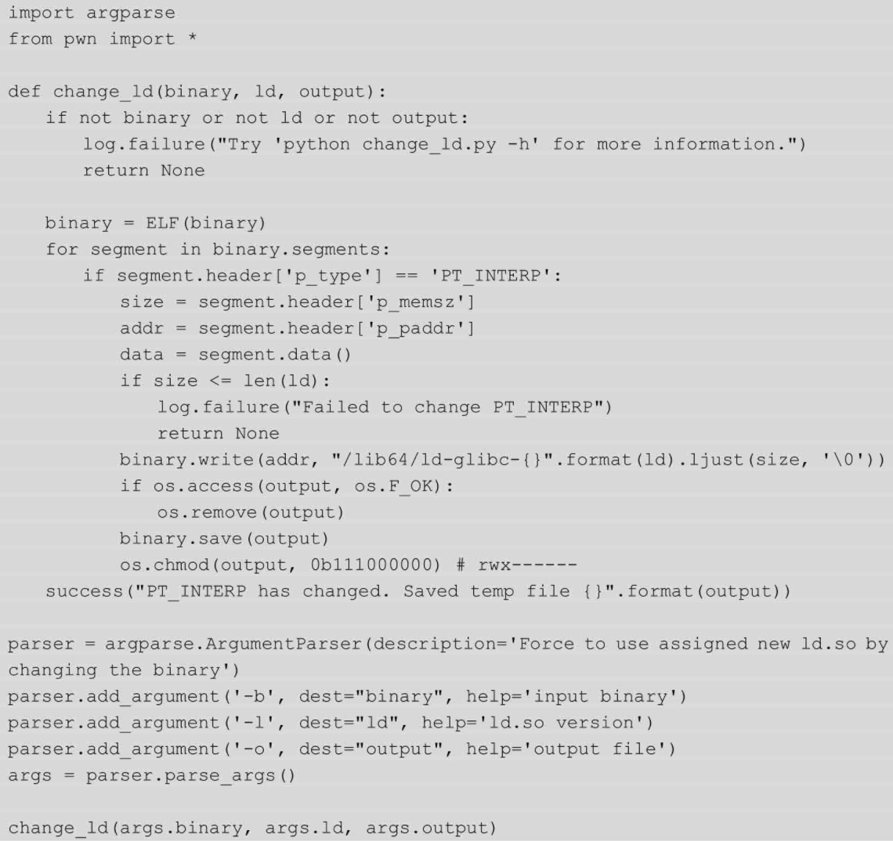

# 虚拟化环境
- 虚拟化技术分类
  - 操作系统层虚拟化（OS-level Virtualization）：应用于服务器操作系统中的轻量级虚拟化技术，不能模拟硬件设备，但可以创建多个虚拟的操作系统实例，如Docker。
  - 硬件辅助虚拟化（Hardware-assisted Virtualization）：由硬件平台对特殊指令进行截获和重定向，交由虚拟机管理程序进行处理，这需要CPU、主板、BIOS和软件的支持。2005年Intel公司提出了Intel-VT，该技术包括处理器虚拟化技术Intel VT-x、芯片组虚拟化技术Intel VT-d和网络虚拟化技术Intel VT-c。同时，AMD公司也提出了自己的虚拟化技术AMD-V，如VMware、VirtualBox。
  - 半虚拟化（Para-Virtualization）：通过修改开源操作系统，在其中加入与虚拟机管理程序协同的代码，但不需要进行拦截和模拟，理论上性能更高，如Hyper-V、Xen。
  - 全虚拟化（Full Virtualization）：不需要对操作系统进行改动，提供了完整的包括处理器、内存和外设的虚拟化平台，对虚拟机中运行的高权限指令进行拦截和模拟，保证相关操作被隔离在当前虚拟机中。通常情况下，全虚拟化对虚拟机操作系统的适配更加简便，如VMware、VirtualBox、QEMU。
- 虚拟机环境：ubuntu16.04 amd64 vmware
  - 32位依赖库与ctf环境安装
  - 
# 编译dubug版本的glibc
- glibc即GNU C Library，是GNU操作系统的C标准库，主要由两部分组成：
  - 一部分是头文件，位于/usr/include；
  - 另一部分是库的二进制文件，主要是C标准库，分为动态（libc.so.6）和静态（libc.a）两个版本。
- 通常系统中的共享库均为release版本，去除了符号表等调试信息。但有时为了方便调试，我们就需要准备一份debug版本的glibc。
- 编译指定版本的glibc
  - 从服务器中下载glibc源码，并切换到所需的分支，这里以2.26版本为例。
    - 
  - 这样debug版本的glibc就被安装到了/usr/local/glibc-2.26路径下
- 使用指定版本的glibc编译程序
  - 如果想要使用该libc编译源代码，那么只需要通过--rpath指定共享库路径，-I指定动态链接器（ld-linux.so）就可以了，如下所示。
    - 
- 使用指定版本的libc运行其他已编译的程序
  - 一种方法是直接使用该libc的动态链接器（ld-linux.so）
    - 
  - 另一种方法则是替换二进制文件的解释器（interpreter）路径，该路径在程序编译时被写入程序头（PT_INTERP）。解释器在程序加载时对共享库进行动态链接，此时就需要libc与ld相匹配，否则就会出错。使用如下脚本可以很方便地修改ELF文件的PT_INTERP。
    - 
  - 在运行脚本之前需要先创建一个ld的符号链接，然后根据需求添加命令行参数，如下所示。
    - 
# glibc源码调试
- 当我们需要进行源码调试（特别是调试堆利用漏洞时），可以使用gdb命令directory，但这种方法只能制定单个文件或目录，而不能解析子目录，所以推荐使用下面这条bash命令在启动调试器时加载源码。
  - 
# Docker
- Docker与虚拟机的区别
  - Docker容器使用进程级别的隔离，并使用宿主机的内核，而没有对整个操作系统进行虚拟化，因此和虚拟机相比，它的隔离性较差，但启动部署都更加便捷，具有可移植性。Docker容器与虚拟机的差别如下图所示。
  - 
- Docker安装与使用
  - 
  - 
  - 
- PWN题目部署
  - 5.2.3节
