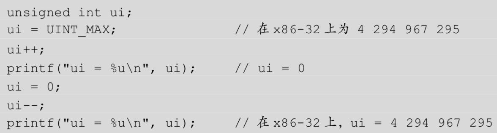

# 计算机中的整数
- 分为有符号整数和无符号整数
- x86-32的数据模型是ILP32，即整数（Int）、长整数（Long）和指针（Pointer）都是32位
- 典型数据类型表示范围
  - 
# 整数安全漏洞
- 常见异常情况
  - 溢出，只有有符号数才会发生溢出。有符号数的最高位表示符号，在两正或两负相加时，有可能改变符号位的值，产生溢出。溢出标志OF可检测有符号数的溢出；
    - 有符号整数用于表示正值、负值和零，范围取决于为该类型分配的位数及其表示方式（原码、反码、补码）。当有符号数的运算结果不能用结果类型表示时就会发生溢出，可以分为上溢出和下溢出两种。
    - 
      - 上溢出：在有符号数最大正值的基础上+1，该数据会上溢出为最小的负数
      - 下溢出：在有符号数最小负值的基础上-1，该数据会下溢出为最大的正数
  - 回绕，无符号数0-1时会变成最大的数，如1字节的无符号数会变为255，而255+1会变成最小数0。进位标志CF可检测无符号数的回绕；
    - 
  - 截断，将一个较大宽度的数存入一个宽度小的操作数中，高位发生截断。
    - 
- 整数转换
  - 整数转换是一种用于表示赋值、类型强制转换或者计算的结果值的底层数据类型的改变，这种转换可能是显式的（通过类型申明转换）也可能是隐式的（通过算数运算转换）。
  - 如果具有某个宽度的类型向一种具有更大宽度的类型转换，通常会保留数学值，但如果反过来，就会导致高位丢失，例如把一个unsigned char加到一个signed char上。具体来看就是下面两种错误：第一，损失值，当转换为一种更小宽度的类型时会损失值；第二，损失符号，从有符号类型转换为无符号类型时会损失符号。
- 整数提升
  - 整型提升是指当计算表达式中包含了不同宽度的操作数时，较小宽度的操作数会被提升到和较大操作数一样的宽度
# 漏洞多发函数
- size_t数据类型的函数参数常会由于整数溢出从而导致缓冲区溢出，size_t是无符号整数类型的sizeof()的结果，本质上就是unsigned int
  - 
- 当size_t用作内存操作函数的参数时，容易导致安全问题
  - 
  - 
- 此外strlen()函数返回值的类型是size_t，即unsigned int，如果该返回值被复制给宽度较小的变量，会导致数值截断。
# 整数溢出示例
- 整数转换。如果攻击者给len赋予了一个负数，则可以绕过if语句的检测，执行到memcpy()的时候，由于第三个参数是size_t类型，负数len会被转换为一个无符号整型，于是变成了一个非常大的正数，从而复制大量的内容到buf，引发缓冲区溢出。 
  - 
- 回绕和溢出。这个例子看似避开了缓冲区溢出的问题，但是如果len过大，len+5是有可能发生回绕的。比如，在x86-32上，如果len=0xFFFFFFFF，则len+5=0x00000004，这时malloc()只分配了4字节内存，然后在里面写入大量数据，就发生了缓冲区溢出。（如果将len声明为有符号int类型，len+5可能发生溢出）。
  - 
- 截断。这个例子接受两个字符串类型的参数并计算总长度，程序分配足够的内存来存储拼接后的字符串。首先将第一个字符串复制到缓冲区，然后将第二个字符串连接到尾部。此时如果攻击者提供的两个字符串总长度无法用total表示，就会发生截断，从而导致后面的缓冲区溢出。
  - 
# 整数溢出漏洞实际利用
- 漏洞程序源码
  - 
- 上面的程序中strlen()返回类型是size_t，却被存储在无符号字符串类型中，任意超过无符号字符串最大上限值（256字节）的数据都会导致截断异常。当密码长度为261时，截断后值变为5，成功绕过了if的判断，导致栈溢出。下面我们利用溢出漏洞来获得shell。
  - 
- 通过阅读反汇编代码，我们知道缓冲区passwd_buf位于ebp-0x14的位置，而返回地址在ebp+4的位置，所以返回地址位于相对于缓冲区0x18的位置。我们测试一下：
  - 
- 可以看到EIP被“BBBB”覆盖，我们获得了返回地址的控制权。另外，我们看eflags寄存器中的carry（进位标志位）和overflow（溢出标志位），这两个标记分别对无符号数和有符号数的计算结果是否超出范围进行检查。
- 最终的payload
  - 