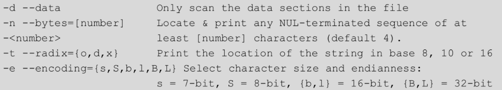

# IDA Pro
## 反汇编算法
- 线性扫描和递归下降是两种主要的反汇编算法。GDB采用的是线性扫描算法，而IDA采用的是递归下降算法，其主要优点是基于控制流，区分代码和数据的能力更强，很少会在反汇编过程中错误地将数据值作为代码处理。同时，递归下降算法的主要缺点是，它无法处理间接代码路径，如利用指针表来查找目标地址的跳转或者调用。
## IDA目录含义
- cfg：包含各种配置文件，包括IDA基础配置文件ida.cfg、GUI配置文件idagui.cfg和文本模式用户界面配置文件idatui.cfg。
- dbgsrv：包含远程调试的server端，包括Android、macOS、Windows、Linux等操作系统以及不同架构的调试器。
- idc：包含IDA内置脚本语言idc所需的核心文件。
- ids：包含一些符号文件（IDA语法中的IDS文件），这些文件用于描述可被加载到IDA 的二进制文件引用的共享库的内容。这些IDS文件包含摘要信息，其中列出了由某一个指定库导出的所有项目。这些项目包含描述某个函数所需的参数类型和数量的信息、函数的返回类型（如果有）以及与该函数的调用约定有关的信息。
- loaders：包含在文件加载过程中用于识别和解析PE/ELF等已知文件格式的IDA扩展。
- platforms：包含QT的一个运行时库qwindows.dll。
- plugins：插件安装目录。
- procs：包含所支持的处理器模块，提供了从机器语言到汇编语言的转换能力，并负责生成在IDA用户界面中显示的汇编代码。
- python：支持64位的Python，包含IDAPython相关的库文件。
- sig：包含在各种模式匹配操作中利用的签名。通过模式匹配，IDA能够将代码序列确定为已知的库代码，从而节省大量的分析时间。这些签名通过IDA的“快速的库识别和鉴定技术”（FLIRT）生成。
- til：包含一些类型库信息，记录了特定编译器库的数据结构。
## IDA程序加载
- 
- IDA通过loaders目录下的文件加载器，来加载不同架构不同格式的可执行文件，如果别无选择，也可以勾选手动加载复选框，以二进制原始格式进行加载。
- 在Processor Type下拉菜单中可以指定反汇编过程使用的处理器模块。通常情况下，IDA会根据文件头信息，选择合适的处理器模块。
- 如果同时选择了二进制文件输入格式和一种x86系列处理器，Loading Segment和Loading Offset将处于活动状态。由于加载器无法得到内存布局信息，在这里输入的段和偏移量将共同构成所加载文件的基址。
- Kernel Options用于配置特定的反汇编分析选项，从而改进递归下降过程。
- Processor Options用来选择处理器模块的配置选项。通常直接点击OK即可。
## IDA交叉引用功能
- 交叉引用是IDA最强大的功能之一，大致分为两类：代码交叉引用和数据交叉引用。首先选择一个函数，使用交叉引用（快捷键X）可以快速地找到该函数被调用的地方，同样地，选择一个数据，也可以快速找到该数据被使用的位置。
- 点击Options菜单的general可以对显示的内容进行调整，例如Lineprefixes(graph)给控制流图加上地址，Auto comments给指令加上注释。
## IDA远程调试
- IDA Pro不仅是一个反汇编器，还是一个强大的调试器，支持Windows 32/64-bit、Linux 32/64-bit、OSX x86/x64、iOS、Android等平台的本地或者远程调试。远程调试是通过TCP/IP网络在本地机器上调试远程机器上的程序，因此需要两部分组件，运行IDA的机器称为客户端，运行目标程序的机器称为服务端。
- 下面列出的是IDA自带的服务端程序，其他平台则可以通过gdbserver进行扩展。
  - 
- 首先，我们使用IDA自带的Linux服务端程序进行演示。先将linux_server64复制到Linux中并启动运行，默认在本地23946端口进行监听。
  - 
- 点击IDA的Debugger菜单栏，选择一个debugger，这里我们选择Remote Linux debugger，也就是自带的服务端程序。然后，在Process options窗口中输入服务端文件路径、IP、端口等信息。远程调试客户端也就设置完成了。如图6-6所示。
  - 
- 接下来，点击Start Process启动进程（点击attach to process则可以调试正在运行的进程），IDA会自动将目标程序发送到服务端相同路径下运行，并触发断点，在debug模式主窗口中可以看到程序指令、寄存器、共享库、线程以及栈等信息。
- 下面是使用gdbserver的方法，将目标程序绑定到0.0.0.0:6666端口。客户端的设置同上。
  - 
- 调试结束后，点击Terminate process或者Detach fromprocess即可退出。
## IDApython
- 6.1.4
## 常用插件
- 对于Windows系统IDA Pro插件的安装，一般情况只需要把dll/python文件复制到plugins目录下即可，对于一些复杂的插件，就参照插件的官方文档。
- 首先，最重要也最强大的插件就是官方的Hex-Rays反编译器（快捷键F5），能够将低级的二进制代码转换为高级的C语言伪代码。已经支持的体系结构有x86、x64、ARM32、ARM64和PowerPC，遗憾的是物联网中常见的MIPS还没有得到支持，如果有这方面的需求，可以尝试NSA开源的Ghidra逆向工程框架。
- FRIEND提供了指令和寄存器的及时文档查看功能，非常推荐对汇编语言还不太熟悉的新手使用，哪里不会点哪里。
- BinCAT是一个静态二进制代码分析工具包，通过追踪寄存器和内存值，可以进行污点分析、类型识别和传播、前向后向切片分析等，获得了2017年插件大赛第一名。
- BinDiff最初是Zynamics公司的商业产品，后被Google所收购，是一个用于二进制文件分析和对比的工具，能够帮助我们快速地发现汇编代码的差异或者相似之处，常用于分析patch、病毒变种等。
- Keypatch是一个利用keystone框架修改二进制可执行文件的插件。由于IDA自带的patch功能只能使用机器码进行修改，且修改后不能撤销，Keypatch就应运而生了。首先我们需要选择汇编语法，如Intel、Nasm和AT&T，然后在汇编一栏输入修改后的指令并点击Patch，Keypatch就会自动将汇编代码变换为对应的机器码。
- heap-viewer也是一个漏洞利用开发辅助插件，主要关注Linuxglibc(ptmalloc2)的堆管理实现，是解决CTF Pwn题的绝佳工具。
- deREferencing重写了IDA在调试时的寄存器和栈窗口，增加了指针解引用的数据显示，就像我们熟悉的GDB插件PEDA/GEF那样。
- IDArling旨在解决多个用户在同一个数据库上协同工作的问题。Ghidra框架有一大亮点就是允许多用户协作和版本控制，但IDA并没有提供这一功能，于是就有了IDArling，它还获得了2018年插件大赛的第一名。
# Radare2
## 安装
- 
## 基础使用
- 详见6.2节
# GDB（6.3节）
## 附加调试
- 用户确定需要进行调试的进程PID；
- 运行GDB，输入attach <pid>，对该进程执行操作：ptrace(PTRACE_ATTACH, pid, 0, 0)；
- 需要注意的是，在将GDB attach到一个进程时，可能会出现下面这样的问题。
  - 
- 这是因为设置了内核参数ptrace_scope=1（表示True），此时普通用户进程是不能对其他进程进行attach操作的，当然我们可以用root权限启动GDB，但最好的办法还是关掉它。
  - 
## 常用命令（命令的全称和简称使用 - 间隔）
- 详见6.3.3节
- help - h
  - help <class>：获取该类中各个命令的列表；
  - help <command>：获取某命令的帮助信息。
- attach○ attach <pid>
  - attach到GDB以外的进程或文件。将进程ID或设备文件作为参数。
- info breakpoints - i b：查看断点，观察点和捕获点的列表；
- info reg：查看当前寄存器信息；
- info threads：打印所有线程的信息，包含Thread ID、Target ID和Frame；
- info frame：打印指定栈帧的详细信息；
- info proc：查看proc里的进程信息。
- break - b
  - 注意给内存地址下断点时，需要在内存地址之前使用*，即类似b *0x1234，否则gdb会将内存地址识别为函数名称
  - b fork@plt：在linux中可以使用该方法对程序引用的外部函数进行下断
- disable - dis
  - disable [breakpoints] [list…]：禁用断点，不带参数时禁用所有断点；breakpoints是disable的子命令（可省略）。
- enable [breakpoints] [list…]：启用指定的断点（或所有定义的断点）；
- clear：清除指定行或函数处的断点。参数可以是行号，函数名称或*address。不带参数时，清除所选栈帧在源码中的所有断点；
- delete - d
  - delete [breakpoints] [list…]：删除断点，不带参数时删除所有断点。
- until - u
  - until <location>：执行程序直到大于当前栈帧或当前栈帧中的指定位置的源码行。此命令常用于快速通过一个循环，以避免单步执行。
- x/nfu <addr>：查看内存；
  - n、f和u都是可选参数，用于指定要查看的内存以及如何格式化；
  - addr是起始地址的表达式；
  - n：重复次数（默认值为1），指定要查看多少个单位（由u指定）的内存值；
  - f：显示格式（初始默认值是x），显示格式是print('x'，'d'，'u'，'o'，'t'，'a'，'c'，'f'，'s') 使用的格式之一，再加i（机器指令）；
  - u：单位大小，b表示单字节，h表示双字节，w表示四字节，g表示八字节。
- disassemble - disas 
  - disas <func> 反汇编指定函数；
  - disas /r <addr> 反汇编某地址所在函数，/r显示机器码 
    - 注意如果该内存地址未被符号文件识别为函数，则此处会显示无法将该内存地址识别为函数
  - disas <begin_addr>,<end_addr> 反汇编从开始地址到结束地址的部分。注意起始、结束地址之间需要加逗号
- run - r
  - 启动被调试程序。可以直接指定参数，也可以用set args设置（启动所需的）参数。还可以使用“>”、“<”、和“>>”进行输入输出的重定向。甚至还可以运行一个脚本，例如：run`python2 -c 'print "A"*100'`。
- backtrace - bt
  - bt：打印整个栈的回溯，每个栈帧一行；
  - bt N：只打印最内层的N个栈帧；
  - bt -N：只打印最外层的N个栈帧；
  - bt full N：类似于bt N，增加打印局部变量的值。
- finish
  - 程序开始运行，直到当前函数执行完毕
  - 在arm实际调试中，在遇到函数调用指令时，ni命令并不能起到单步步过的作用，而是会进入函数内部，此时finish指令即可将当前函数执行完毕，从而退出当前函数
- ***set follow-fork-mode 调试多线程***
  - 当程序复刻一个子进程的时候，GDB默认设置为追踪父进程（set follow-fork-mode parent），但也可以使用命令setfollow-fork-mode child让其追踪子进程；
  - 如果想要同时追踪父进程和子进程，可以使用命令setdetach-on-fork off（默认为on），这样就可以同时调试父子进程，在调试其中一个进程时，另一个进程被挂起。如果想让父子进程同时运行，可以使用set schedule-multiple on（默认为off）；
  - 但如果程序使用exec启动了一个新的程序，则可以使用setfollow-exec-mode new（默认为same）来新建一个inferior给新程序，而父进程的inferior仍然保留。
- thread apply all bt
  - 打印出所有线程的堆栈信息。
- generate-core-file
  - 将调试中的进程生成内核转储文件。
- directory - dir
  - 设置查找源文件的路径。或者使用GDB的-d选项，例如：gdb a.out -d /search/code/。
- gdb在qemu系统模拟的情况下远程调试固件
  - 详见iot/固件模拟.md
- set 设置内存数据
  - (gdb) set {int}0x83040 = 4 #经过测试可行
  - set *(unsigned int *)0x804a02c = 0x1
### 15pb笔记中补充命令
- 
- 
- 
## 增强工具
- 安装gef
  - 
- gef相关功能
  - 6.3.4节
  - aslr (on|off)：查看或者修改GDB的ASLR行为。
  - assemble - asm：利用keystone将汇编指令转换为机器码（默认为x86）。例如：asm mov eax, 1; mov ebx, 0xffffd500; mov ecx, 3; int80h；使用-l [addr]选项，可以直接将生成的机器码写入指定地址。
  - capstone-disassemble - cs：利用capstone进行反汇编操作。
  - checksec：checksec.sh脚本的移植，用于检查程序保护。
  - canary：查看当前进程的canary。
  - dereference [addr] [l[NB]] - telescope, dps：查看地址解引用的信息。
  - edit-flags [(+|-|~)FLAGNAME ...] - flags：修改flag寄存器的值。例如：edit-flags +zero
  - elf-info - elf：查看ELF文件的信息。
  - entry-break - start：试图找到程序的最佳入口点（如main和__libc_start_main）并在其上设置临时断点。
  - $ [expr]：类似于WinDBG的“？”命令，尝试将表达式转换为不同格式或者进行计算。
  - format-string-helper - fmtstr-helper：帮助检测格式化字符串漏洞。原理是对危险的字符串操作函数（如printf、snprintf）下断点，并检查保存格式化字符串的指针是否可写。
  - functions：列出一些有用的函数，可作为其他命令的参数直接使用。
  - gef-remote：远程调试命令，在本地没有被调试的二进制文件时，将自动将其下载到本地（默认为/tmp）并加载调试信息。此外，该命令还将获取/proc/PID/maps的所有信息。例如：gef-remote -p 6789 localhost:1234。
  - heap (chunk|chunks|bins|arenas)：用于获取glibc堆块的信息。
    - heap arenas：在多线程程序中，该命令用于查看当前所有arena的信息；
    - heap bins (fast|large|small|tcache|unsorted)：获取arena（默认为main_arena）中包含的各类bins的信息；
    - heap chunk [addr]：查看某地址处chunk的信息；
    - heap chunks [addr]：查看从某地址开始的所有chunk的信息；
    - heap set-arena：指定main_arena的地址，常用于无调试符号的二进制文件。
  - heap-analysis-helper：跟踪堆操作函数（如malloc()、free()等）的调用，分析堆操作行为，从而检测堆漏洞。目前已经支持了NULL free，Double free等。
  - hijack-fd FD_NUM NEW_OUTPUT：在调试时修改文件描述符，从而重定向输出。例如：hijack-fd 2 /tmp/stderr_output.txt。
  - ida-interact：配合ida_gef.py插件使用，用于与IDA Pro进行交互操作。
  - is-syscall：判断下一条要执行的指令是否为系统调用。
  - ksymaddr：对内核符号进行定位。
  - patch：将指定的值写入指定的地址。
  - pattern (create|search|offset)：生成用于确定内存中偏移量的字符串（de Bruijn序列）。
  - pie (breakpoint|info|delete|run|attach|remote)：对开启PIE的程序下断点，这是一种虚拟断点，其地址是二进制基地址的偏移。当程序run或者attach时将断在真实断点处。
  - process-search - ps：列出或者筛选程序进程。例如程序使用“socat tcp4-listen:10001,reuseaddr,forkexec:./a.out”运行时，我们真正想要attach的进程是a.out，而不是socat，于是可以使用命令“ps -as a.out”。
  - process-status：查看进程状态的详细信息（来自procfs结构体）。
  - register：查看寄存器的详细信息。
  - ropper --search：利用ropper查找gadget。
  - scan HAYSTACK NEEDLE - lookup：搜索HAYSTACK中指向NEEDLE的地址。例如：scan stack libc。
  - search-pattern PATTERN [small|big] - grep：在进程内存中搜索指定字符串或地址。
  - shellcode (search|get)：从shell-storm's shellcodedatabase中搜索及下载shellcode。
  - syscall-args：根据当前寄存器的值得到系统调用名称及参数。
  - trace-run：配合ida_color_gdb_trace.py插件使用，创建从$pc指针到指定地址所有指令的运行时跟踪。
  - unicorn-emulate [-f LOCATION] [-t LOCATION] [-nNB_INSTRUCTION] [-s] [-o PATH] [-h] -emulate：在不影响当前进程上下文的情况下利用Unicorn-Engine模拟程序的执行。例如：unicorn-emulate -f $pc -n 10 -o /tmp/my-gef-emulation.py。
  - vmmap [FILTER]：查看完整的或者指定的虚拟内存空间映射。
  - xfiles [FILE [NAME]]：显示二进制文件加载的所有库（以及节信息）。例如：xfiles libc IO_vtables。
# GNU工具链
- GNU工具链（GNUtoolchain）是一个包含了由GNU计划所产生的各种编程工具的集合，这些工具形成了一条工具链，用于开发应用程序和操作系统。
## dd
- 常见用法
- 
  - 选项“if”和“of”分别指定文件输入和输出以替代标准输入和输出；
  - “bs”指定读入或写入的块大小，以字节为单位；
  - “count”指定复制的块数；
  - “skip”和“seek”分别用于指定读入或写入的位置；
  - “conv”则用于指定转换选项。
- 使用dd对二进制文件进行patch
- 以我们熟悉的hello world程序为例，使用dd命令可以patch二进制文件，将字符串“hello, world”替换为“bye, world”
  - 
## file
- file命令用于检测给定文件的类型，包含文件系统、魔法幻数和语言3个检测过程
- 选项“-z”用于读取压缩文件中的文件；“-L”用于解析符号链接的文件类型
  - 
## ldd
- ldd 命令用于打印程序或者库文件所依赖的共享库列表。该命令并不是一个可执行文件，而是一个shell脚本，它会设置一系列的环境变量，如“LD_TRACE_LOADED_OBJECTS”。当程序执行时，加载器ld-linux.so就会根据环境变量来工作，打印出依赖关系。
- 选项“-r”用于执行数据和函数的重定位，以确定是否有符号和函数丢失；“-v”用于打印出依赖关系的详细信息
  - 
## objdump
- objdump命令用于查看目标文件的信息，具备反汇编能力是其最大的亮点，但其反汇编过于依赖ELF节头，且不会进行控制流分析，导致其健壮性略差。
- 常用选项
  
  - 选项“-s”用于将目标文件转换成十六进制表示；
  - 选项“-d”或者“-D”用于对目标文件进行反汇编
  - 如果想要指定某个节，可以使用“-j”选项。
- 使用示例
  - 
## readelf
- readelf命令用于解析ELF格式目标文件的信息。该工具与objdump类似，但显示的内容更具体，且不依赖BFD库。常见用法如下所示。
- 常用选项
  - 
  - 选项“-h”、“-l”和“-S”分别用于显示文件头、程序头和节区头信息；选项“-s”和“--dyn-syms”分别用于显示符号表和动态符号表
- 查看libc中system函数的偏移（通过查看符号表）
  - 
## socat
- socat是netcat的加强版，其特点是在两个数据流之间建立通道，且支持众多协议和连接方式。CTF中常用它连接服务器，或者非常方便地在本地部署Pwn题
- 常见参数
  - 
## strace&ltrace
- strace命令基于ptrace系统调用，用于记录和解析程序执行过程中的所有系统调用和信号传递。有时我们希望了解程序的行为，又不想使用调试器，那么strace就能发挥作用
- 常见选项
  - 
  - 选项“-i”可以打印出每条系统调用的指令指针；
  - 选项“-e”可以指定一个表达式，对如何跟踪进行控制；
  - 选项“-f”将跟踪由fork()调用产生的子进程；
  - 选项“-p”可以指定一个进程PID，从而进行跟踪；
  - “-c”选项对系统调用情况进行统计。
- 实例
  - 
  - 
  - 第一个系统调用是execve，它用于执行hello程序，然后程序加载器会进行设置环境变量、加载依赖库、初始化内存并设置权限等操作，最后调用write将字符串写入标准输出。
- ltrace命令，它不仅可以跟踪系统调用和信号（“-S”选项），还可以跟踪库函数调用的情况。
  - 
## strip
- strip用于去除目标文件中符号和节的信息，减小目标文件的大小。
- 
- 不加任何选项使用strip默认去除所有符号和重定位信息，与程序编译时使用GCC编译选项“-s”的效果相同（仅BuildID不同）。
- 使用选项“-g”可以去除调试信息和节信息，此时函数名被保留下来，调试时依然可以很方便地对函数下断点。
- 对于“.o”和“.a”等目标文件或者静态库文件，只能“--strip-debug”或“--strip-unneeded”，否则在需要进行链接时将发生错误。
- 对于“.so”文件，全局符号保存在一个名为“.dynsym”的节区中，strip不会对其产生影响。
## strings
- strings命令用于在二进制文件中查找可打印的字符串，这些字符串是以换行符或空字符结束的任意序列。
- 常见参数
  - 
  - 默认情况下，strings会扫描整个文件，但添加“-d”选项可以限定只扫描文件的数据段；
  - “-n”选项用于指定字符序列的最小长度，默认为4个字符；
  - 添加“-t”选项可以打印出字符串所在的位置；
  - 在某些特殊情况下，字符类型并不是ASCII（如UTF32LE），此时就需要添加“-e”选项指定字符的长度和大小端序。
- 使用strings可以检查程序是否加了某种特征明显的壳，如UPX。
  - 
- 在Return-into-libc攻击中，常常需要查找一些符号的地址，如“/bin/sh”。
  - 
## xxd
- xxd 命令用于将一个二进制文件以十六进制的形式显示出来。常见用法如下所示。
- 
  - 添加“-o”选项可以在文件原始地址上加上偏移，
  - 添加“-s”选项指定从文件的某个偏移开始，
  - “-l”选项则指定显示多少个字节；中间的部分是十六进制显示的文件内容，默认为一行16个字节，
  - 添加“-c”选项进行修改，
  - “-g”选项则将十六进制数分组显示。
  - “-i”选项将输出转换为C语言风格，从而可以在C语言代码中直接使用。
- xxd不仅可以将二进制文件dump成十六进制，更神奇的是可以将十六进制反向dump成二进制文件，看下面的例子。
  - 
- 另外，xxd还可以搭配VIM一起使用（“-b”选项以二进制方式打开文件，命令模式下输入命令“:%!xxd”）