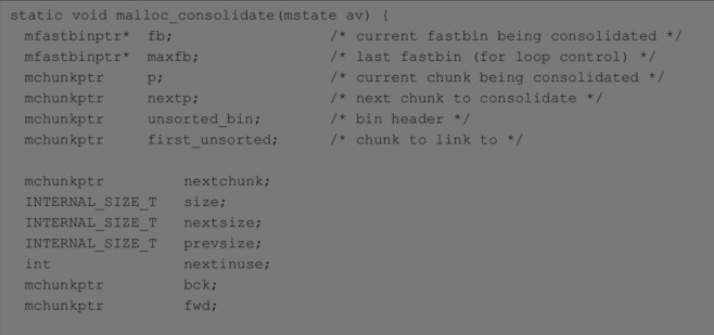
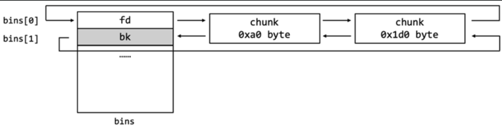
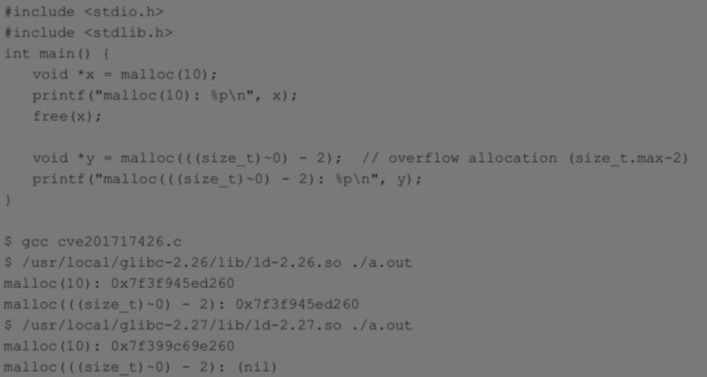
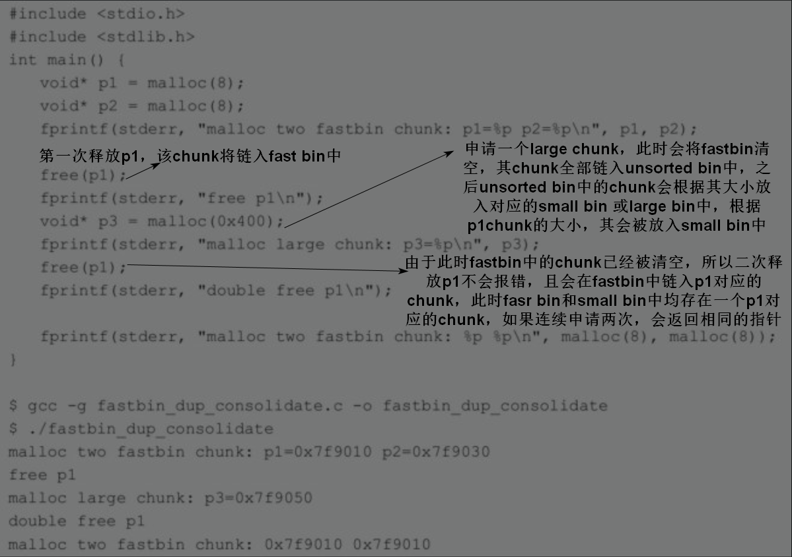
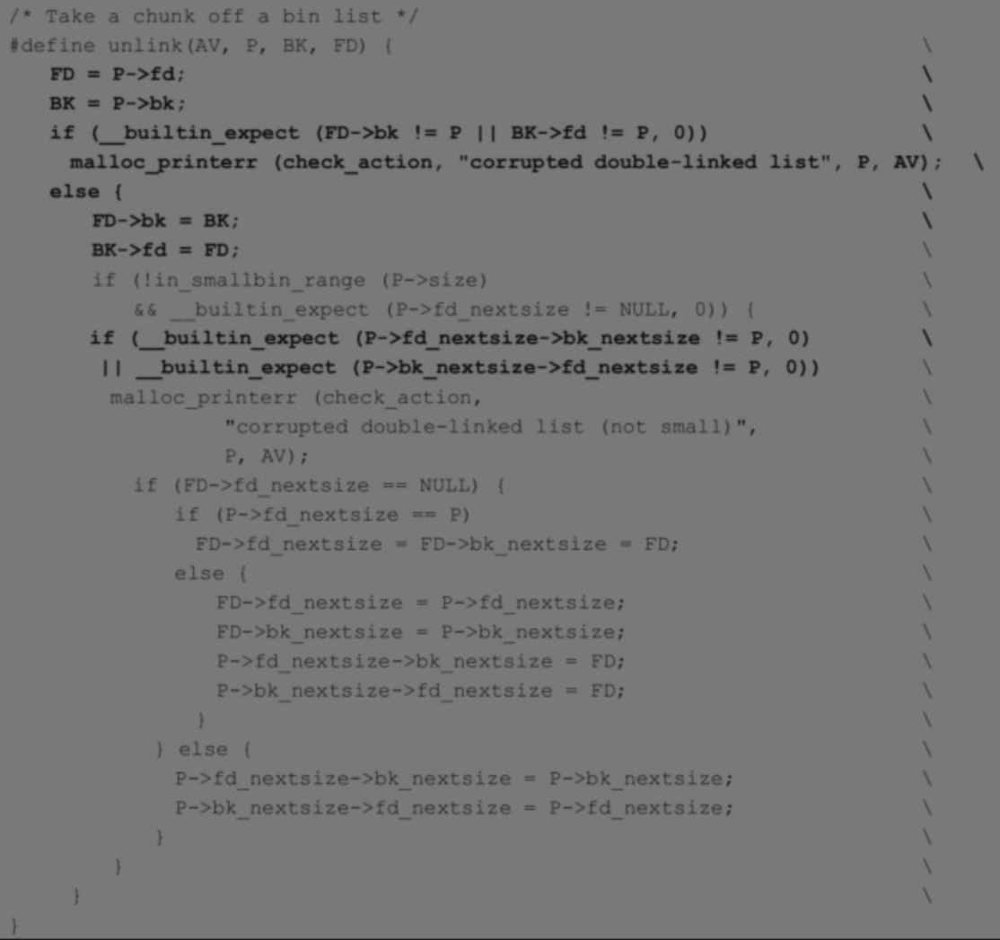
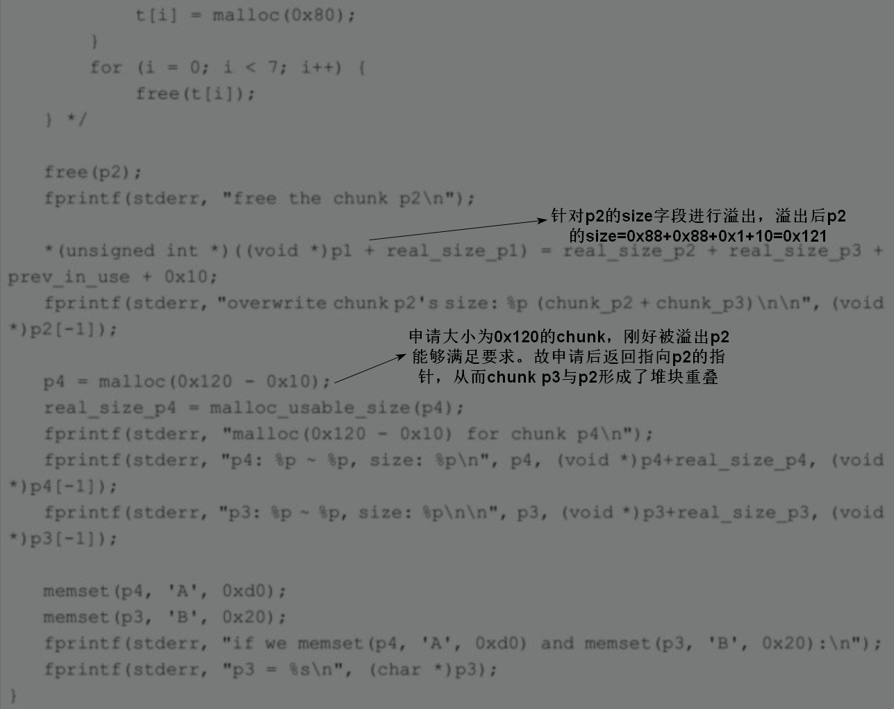
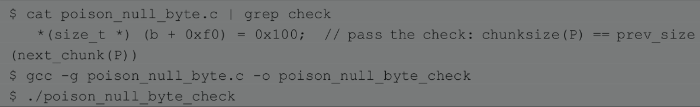
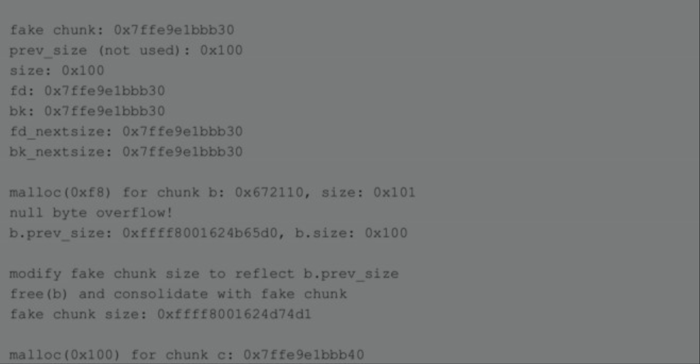
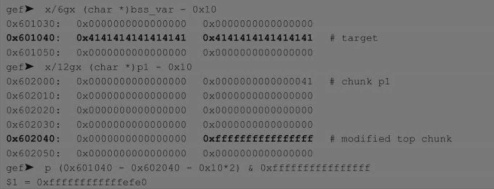

# 不局限于书上内容，会根据学到的东西进行更新
# 常见堆管理机制
- CTF中常见堆管理机制：ptmalloc2
  - ptmalloc2是glibc实现的内存管理机制，它继承自dlmalloc，并提供了对多线程的支持
- 其他堆管理机制：dlmalloc、tcmalloc、jemalloc
# 内存中堆分配的思路
- 是由低地址到高地址线性增长的区域，一般位于bss段高地址处
- 用户申请时才进行分配
- 第一次会分配相当大的连续内存，程序再次申请时会从该片内存中分配，直到堆空间无法满足时，堆空间才会再次增长
# 内存中堆分配函数
## brk与sbrk
- 堆的属性是可读可写的，大小通过brk()或sbrk()函数进行控制。如下图所示，在堆未初始化时，program_break指向BSS段的末尾，通过调用brk()和sbrk()来移动program_break使得堆增长。在堆初始化时，如果开启了ASLR，则堆的起始地址start_brk会在BSS段之后的随机位移处，如果没有开启，则start_brk会紧接着BSS段。
  - 
- 两个函数的定义如下，
  - brk()函数的参数是一个指针，用于设置program_break指向的位置。sbrk()函数的参数increment（可以是负值）用于与program_break相加来调整program_break的值。成功执行后brk()函数会返回0，sbrk()函数会返回上一次program_break值（可以设置参数increment为0来获得当前program_break的值）。
  - 
## mmap与unmmap
当用户申请内存过大时，ptmalloc2会选择通过mmap()函数创建匿名映射段供用户使用，并通过unmma()函数回收。
# 系统中的堆
- 通常来说，系统中的堆指的是主线程中main_arena所管理的区域。但glibc会同时维持多个区域来供多线程使用，每个线程都有属于自己的内存（称为arena），这些连续的内存也可以称为堆。
- 本节我们的侧重点是主线程的内存分配，不会详细介绍多线程。
# 堆管理结构
## arena
- arena包含一片或数片连续的内存，堆块将会从这片区域划分给用户。主线程的arena被称为main_arena，它包含start_brk和brk之间的这片连续内存。除非特别声明，后文一般将start_brk和brk之间这片连续内存称为堆。
- 主线程的arena只有堆，子线程的arena可以有数片连续内存（即子线程的arena并不是一整块连续内存，而多块不相邻的连续内存块的集合）
- 如果主线程的堆大小不够分的话可以通过brk()调用来扩展，从而保证分配的main_arena是一个连续内存块（可以一直扩展直到触及 Memory Mapping Segment）
- 子线程分配的映射段大小是固定的，不可以扩展，所以子线程分配出来的一段映射段不够用的话就需要再次用mmap()来分配新的内存（因为使用mmap分配新的内存，从而导致子线程每次分配的arena块之间可能不是连续的）。
- arena的个数是跟系统中处理器核心个数相关的
  - For 32 bit systems:Number of arena = 2 * number of cores + 1.
  - For 64 bit systems:Number of arena = 8 * number of cores + 1.
## heap_info
- 该数据结构仅用于非主线程的堆块管理，主线程通过sbrk扩展main_arena的大小，只有一个heap，没有heap_info数据结构
- heap_info: 即Heap Header，因为一个thread arena（注意：不包含main thread）可以包含多个heaps，所以为了便于管理，就给每个heap分配一个heap header。那么在什么情况下一个thread arena会包含多个heaps呢?在当前heap不够用的时候，malloc会通过系统调用mmap申请新的堆空间，新的堆空间会被添加到当前thread arena中
- 子线程的arena可以有多片连续内存，这些内存被称为heap。每一个heap都有自己的heap header。其定义如下，heap header是通过链表相连接的，并且heap header里面保存了指向其所属的arena的指针。
  - 
- Main thread不含有多个heaps所以也就不含有heap_info结构体。当需要更多堆空间的时候，就通过扩展sbrk的heap segment来获取更多的空间，直到它碰到内存mapping区域为止。
## malloc_state
- 每个线程只有一个malloc_state，里面保存了bins、topchunk以及最后一个remainder chunk等信息。
- 主线程的malloc_state保存在libc.so的.bss数据段里，其他线程的malloc_state则保存在最新申请的arena分配的heap里面.(因为一个子线程可能存在多个arena，但是在子线程中多个arena的信息仍由一个malloc_state结构体描述)
  - 
  - 
- binmap为malloc_state的成员，常用于索引bin，其中一个比特位表示bins中相应的bin的状态，1表示bin不为空，0表示为空，这样能加快搜索速度。
- malloc_state中会记录Fast bin、Small bin、Large bin和Unsorted bin的信息
  - fastbinsY：这是一个bin数组，里面保存了NFASTBINS个fastbin的指针。该数组每个元素为chunk中的fd指针，用于指向不同fastbin链表的尾节点（fastbin中chunk的使用依据后进先出规则，chunk的入链和断链均发生在fastbin的尾节点）
    - 
  - fastbinsY数组中每个fastbin元素均指向了该链表的rear end（尾结点），而尾结点通过其fd指针指向前一个结点，依次类推，如图所示。
    - 
  - bins：也是一个bin数组，一共有126个bin，按顺序分别是：
    - bin 1为unsorted bin
    - bin 2到bin 63为small bin 
    - bin 64到bin 126为large bin
  - bins数组实际上只保存了双链表的头结点的fd和bk指针
  - 
- malloc_state中 fastbins 以及 bins的整体情况
  - 
  - 
  - 
  - fastbins 10条
  - bins 126条
    - unsortd bins 1条
    - small bins 62条
    - large bins 63条

## malloc_chunk
- chunk是glibc管理内存的基本单位
- Chunk分为4类：allocated chunk、free chunk、top chunk、Last remainder chunk。从本质上来说，所有类型的chunk都是内存中一块连续的区域，只是通过该区域中特定位置的某些标识符加以区分。为了简便，我们先将这4类chunk简化为2类：allocated chunk以及free chunk，前者表示已经分配给用户使用的chunk，后者表示未使用的chunk。
- 一个heap被分为多个chunk，至于每个chunk的大小，这是根据用户的请求决定的。
- 整个堆在初始化后会被当成一个free chunk，称为top chunk，每次用户请求内存时，如果bins中没有合适的chunk，malloc就会从top chunk中进行划分
- 如果top chunk的大小不够，则调用sbrk()扩展堆的大小，然后从新生成的top chunk中进行切分。
- 用户释放内存时，glibc会先根据情况将释放的chunk与其他相邻的free chunk合并，然后加入合适的bin中，注意，top chunk 的prev_inuse比特位始终为1，但是这并不妨碍top chunk将其相邻的free chunk进行合并，重新组成新的top chunk。（实例见house of einherjar攻击方法）
- 当前chunk低地址处相邻的chunk为上一个（后面的）chunk，高地址处相邻的chunk为下一个（前面的)chunk。
### chunk结构

- INTERNAL_SIZE_T的大小在64位系统下是8字节，32位系统下是4字节，
- SIZE_SZ在64位系统下是8字节，32位系统下是4字节
- prev_size：如果上一个chunk处于释放状态，用于表示其大小；否则作为上一个chunk的一部分，用于保存上一个chunk的数据。
- size：表示当前chunk的大小，根据规定必须是2*SIZE_SZ的整数倍。默认情况下，SIZE_SZ在64位系统下是8字节，32位系统下是4字节。受到内存对齐的影响，最后3个比特位被用作状态标识，其中最低的三个比特位，从高到低分别代表：
  - NON_MAIN_ARENA，记录当前 chunk 是否不属于主线程，1 表示不属于，0 表示属于。
  - IS_MAPPED：用于标识一个chunk是否是从mmap()函数中获得的。如果用户申请一个相当大的内存，malloc会通过mmap()函数分配一个映射段，1表示该chunk由mmap()函数获得，0表示该函数不由mmap()函数获得。
  - PREV_INUSE：用于标识上一个chunk的状态。当它为1时，表示上一个chunk处于使用状态，当该位为0时，表示上一个chunk处于释放状态。
- fd指向下一个chunk(高内存地址)，bk指向上一个chunk（低内存地址）均不一定是物理相邻的，两个字段仅在当前chunk处于释放状态时有效，free chunk通过fd、bk指针形成bin链表
- fd_nextsize和bk_nextsize：与fd和bk相似，仅在处于释放状态时有效，否则就是用户使用的空间。不同的是它们仅用于large bin，分别指向前后第一个和当前chunk大小不同的chunk。
- 使用状态的chunk
  - 
- free状态的chunk
  - 
- ***由于bk成员之后的空间大小可能为0，也就是说一个chunk的大小最小可能是32字节（64位系统）或者16字节（32位系统），即两个SIZE_SZ的大小加上两个指针的大小。***
## 只有一个heap segment的main arena和thread arena的内存分布图：

## 一个thread arena中含有多个heap segments的内存布局图 

- thread arena只含有一个malloc_state(即arena header)，却有两个heap_info(即heap header)。由于两个heap segments是通过mmap分配的内存，两者在内存布局上并不相邻而是分属于不同的内存区间，所以为了便于管理，libc malloc将第二个heap_info结构体的prev成员指向了第一个heap_info结构体的起始位置（即ar_ptr成员），而第一个heap_info结构体的ar_ptr成员指向了malloc_state，这样就构成了一个单链表，方便后续管理。
## fast bin
- 这类bin使用单链表结构
- fast bin一共有10个
- 采用LIFO（后进先出）的分配策略。在fast bin中无论是添加还是移除fast chunk，都是对“链表尾”进行操作，而不会对某个中间的fast chunk进行操作。更具体点就是LIFO(后入先出)算法：
- fastbin的内存分配策略是exact fit，即只释放fastbin中跟申请内存大小恰好相等的堆。
- 为了加快速度，fast bin里的chunk不会进行合并操作，所以下一个chunk的PRV_INUSE始终标记为1，使其处于使用状态。
- 同一个fast bin里chunk大小相同，并且在fastbinsY数组里按照从小到大的顺序排列
  - 序号为0的fast bin中容纳的chunk大小为4*SIZE_SZ字节，
  - 随着序号增加，所容纳的chunk递增2*SIZE_SZ字节。如图11-5所示（以64位系统为例）

- 由于fast bin中的chunk永远不会释放，导致相邻的free chunk无法与之合并，从而造成大量的内存碎片，malloc_consolidate()函数最主要的功能就是来解决这个问题。***在达到某些条件时***，glibc就会调用该函数将fast bin中的chunk取出来，与相邻的free chunk合并后放入unsorted bin，或者与top chunk合并后形成新的top chunk。
- malloc_consolidate()函数源码
  - 
  - 
  - 
  - 
- fastbin中的chunk一般不会与其他chunk合并。但如果合并之后的chunk大于FASTBIN_CONSOLIDATION_THRESHOLD，就会触发malloc_consolidate()函数，将fastbin中的free chunk合并，然后移动到unsorted bin中。（在malloc函数当判断完该所申请的chunk是否为fast chunk和small chunk之后，在遍历unsorted bin之前，会判断当前是否存在fast chunk，如果存在则调用malloc_consolidate()函数尝试将fastbin中的chunk与其他freechunk合并，然后移动到unsorted bin中，详见linux堆管理流程图）
- 
- ***malloc_consolidate()函数还有一个功能，即初始化堆，即调用malloc_consolidate函数对malloc_state结构体进行初始化***
- fast bin中最大的chunk是由global_max_fast决定的，这个值一般在堆初始化的时候设置。当然在运行时也是可以设置的。
- 在初始化的时候fast bin支持的最大内存大小以及所有fast bin链表都是空的，所以当最开始使用malloc申请内存的时候，即使申请的内存大小属于fast chunk的内存大小(即16到80字节)，它也不会交由fast bin来处理，而是向下传递交由small bin来处理，如果small bin也为空的话就交给unsorted bin处理：
- fastbin首次初始化的过程（详细代码见linux中堆内存管理.md）
  - 第一次调用malloc(fast bin)的时候，系统执行_int_malloc函数，该函数首先会发现当前fast bin为空，就转交给small bin处理，进而又发现small bin 也为空，就调用malloc_consolidate函数对malloc_state结构体进行初始化，malloc_consolidate函数主要完成以下几个功能：
    - 首先判断当前malloc_state结构体中的fast bin是否为空，如果为空就说明整个malloc_state都没有完成初始化，需要对malloc_state进行初始化。
    - malloc_state的初始化操作由函数malloc_init_state(av)完成，该函数先初始化除fast bin之外的所有的bins(构建双链表，详情见后文small bins介绍)，再初始化fast bins。
    - 然后当再次执行malloc(fast chunk)函数的时候，此时fast bin相关数据不为空了，就开始使用fast bin 
    - malloc_consolidate调用时如果fast bin中存在被释放的fast chunk，则会将被释放的fast chunk进行合并，合并后的chunk链入unsorted bin中
- fastbin chunk释放过程
  - free(fast chunk)操作：这个操作很简单，主要分为两步：先通过chunksize函数根据传入的地址指针获取该指针对应的chunk的大小；然后根据这个chunk大小获取该chunk所属的fast bin，然后再将此chunk添加到该fast bin的链尾即可。整个操作都是在_int_free函数中完成。

## unsorted bin
- 当非fast chunk被释放时，在进入small bin或者large bin之前，会先加入unsorted bin。在实践中，一个被释放的chunk常常很快就会被重新使用，所以将其先加入unsorted bin可以加快分配的速度。
- 当非fast chunk被合并或分割后，合并后或分割剩下的chunk均会链入unsorted bin
- 当程序申请一个chunk时，malloc函数首先判断当前fast bin和small bin中的chunk是否能够满足需求，如果无法满足，mallco将遍历unsorted bin，如果找到正好满足要求的chunk，则将该chunk直接返回，同时将unsorted bin中的chunk根据大小链入对应的small bin或large bin中，***这也是small bin和large bin中chunk的唯一来源，***
- 在malloc遍历unsorted bin完成并将unsorted bin中的chunk链入对应small bin或large bin之后，如果程序申请的chunk属于large chunk，则此时开始遍历large bin，寻找合适的chunk，遍历过程中使用binmap加快遍历速度
- unsorted bin使用双链表结构
-  unsorted bin的个数： 1个
- 采用FIFO（先进先出）的分配策略。
- 与fastbinsY不同，unsroted bin中的chunk大小可能是不同的，
- 由于是双链表结构，一个bin会占用bins的两个元素。如图11-6所示（以64位系统为例）

- 一个非fastbin的chunk被释放后一般会被放入unsorted bin临时保存，以提高堆块管理的效率，然后当从unsorted bin中取出chunk时，只是简单地检查其size是否在合理范围内（即大于2*SIZE_SZ且小于等于system_mem），然后通过宏chunksize赋值给变量size。最后，如果取出的chunk正好与请求大小相同，则直接返回该chunk，同时设置下一个chunk的PREV_INUSE位。 
- unsortedbin可以视为空闲chunk回归其所属bin之前的缓冲区，分配策略是exact fit。
- 可能会被链入unsortedbin的堆块是
  - 申请largebin大小堆块切割后的last remainder；
  - 释放不属于fastbin大小且不与topchunk紧邻的堆块时会被先链入unsortedbin；
  - 在特定情况下将fastbin内的堆合并后会进入unsortedbin的处理流程  
    - 特定情况为
      - 申请fastbin范围堆fastbin为空；
      - 申请非fastbin范围smallbin的堆但smallbin未初始化；
      - 申请largechunk
## small bin
- 同一个small bin里chunk的大小相同
- 采用双链表结构
- 使用频率介于fast bin和large bin之间
- Small bin采用FIFO(先入先出)算法：内存释放操作就将新释放的chunk添加到链表的front end(前端)，分配操作就从链表的rear end(尾端)中获取chunk。
- small bin的内存分配策略是exact fit，即只释放small bin中跟申请内存大小恰好相等的堆。
- small bin在bins里居第2到第63位，共62个
- 根据排序，每个small bin的大小为2*SIZE_SZ*idx（idx表示bins数组的下标）。
- 在64位系统下，最小的small chunk为2×8×2=32字节，最大的small chunk为2×8×63=1008字节。由于small bin和fast bin有重合的部分，所以这些chunk在某些情况下会被加入small bin中。如图11-7所示（以64位系统为例）。

- small chunk申请操作
  - malloc(small chunk)操作：类似于fast bins，最初所有的small bin都是空的，因此在对这些small bin完成初始化之前，即使用户请求的内存大小属于small chunk也不会交由small bin进行处理，而是交由unsorted bin处理，如果unsorted bin也不能处理的话，glibc malloc就依次遍历后续的所有bins，找出第一个满足要求的bin，如果所有的bin都不满足的话，就转而使用top chunk，如果top chunk大小不够，那么就扩充top chunk，这样就一定能满足需求
    - 注意遍历后续bins以及之后的操作同样被large bin所使用，因此，将这部分内容放到large bin的malloc操作中加以介绍。
  - glibc malloc是如何初始化这些bins的呢？因为这些bin属于malloc_state结构体，所以在初始化malloc_state的时候就会对这些bin进行初始化
    - 在malloc源码中，将bins数组中的第一个成员索引值设置为了1，而不是我们常用的0(在bin_at宏中，自动将i进行了减1处理…)。从上面代码可以看出在初始化的时候glibc malloc将所有bin的指针都指向了自己——这就代表这些bin都是空的。
    - 过后，当再次调用malloc(small chunk)的时候，如果该chunk size对应的small bin不为空，就从该small bin链表中取得small chunk，否则就需要交给unsorted bin及之后的逻辑来处理了。
- small chunk释放操作
  -  free(small chunk)：当释放small chunk的时候，先检查该chunk相邻的chunk是否为free，如果是的话就进行合并操作：将这些chunks合并成新的chunk，然后将它们从small bin中移除，最后将新的chunk添加到unsorted bin中，注意即使small chunk在释放时没有发生合并，释放后的smallchunk也会被先链入unsorted bin中，从而提升堆内存分配效率，之后对应chunk才会从unsorted bin中分配回small bin中。（注意该特征也适用于large chunk进行释放操作时，即释放后先进入unsorted bin，之后才被分配回large bin）
## large bin
- 对于相同大小的堆，释放的堆插入到bin头部，通过fd、bk与其他的堆链接形成循环双向链表
- Largebin的分配策略是best fit，即最终取出的堆是符合申请内存的最小堆（记为chunk）。若取出的chunk比申请内存大至少minsize，则分割chunk并取合适大小的剩余堆做为last remainder；若取出的chunk比申请内存不大于minsize，则不分割chunk直接返回做为用户申请内存块。
- large bin在bins里居第64到第126位，共63个，被分成了6组，每组bin所能容纳的chunk按顺序排成等差数列，公差分别如下。

- 32位系统下第一个large bin的chunk最小为512字节，第二个large bin的chunk最小为512+64字节（处于[512,512+64)之间的chunk都属于第一个large bin）
- 64位系统也是一样的，第一个large bin的chunk最小为1024字节，第二个large bin的chunk最小为1024+64字节（处于[1024,1024+64)之间的chunk都属于第一个large bin），以此类推。
- large bin也是采用双链表结构，里面的chunk从头结点的fd指针开始，按大小顺序进行排列。为了加快检索速度，fd_nextsize和bk_nextsize指针用于指向第一个与自己大小不同的chunk，所以也只有在加入了大小不同的chunk时，这两个指针才会被修改。
- large chunk可以添加、删除在large bin的任何一个位置，没有后进先出或先进先出的规则
- 鉴于同一个large bin中每个chunk的大小不一定相同，因此为了加快内存分配和释放的速度，就将同一个large bin中的所有chunk按照chunk size进行从大到小的排列：最大的chunk放在链表的front end，最小的chunk放在rear end。
- 需要注意的是，large bins的每个bin所存储的chunk并不一定是大小相同的，而是处于一定的范围内，然后通过指针fd_nextsize按从大到小的顺序进行排列。同样地，换成bk_nextsize就是按从小到大的顺序排列
- large chunk的合并操作类似于small bin
- large chunk申请操作
  - 分配large chunk的过程：当请求的大小在fastbins和smallbins中无法得到满足时，就会进入一个遍历unsorted bin的for循环，此时如果请求的大小是一个large chunk，则从unsortedbin中取出chunk并整理回对应的large bin中。
  - 初始化完成之前的操作类似于small bin，这里主要讨论large bins初始化完成之后的操作。首先确定用户请求的大小属于哪一个large bin，然后判断该large bin中最大的chunk的size是否大于用户请求的size(只需要对比链表中front end的size即可)。如果大于，就从rear end开始遍历该large bin，找到第一个size相等或接近的chunk，分配给用户。如果该chunk大于用户请求的size的话，就将该chunk拆分为两个chunk：前者返回给用户，且size等同于用户请求的size；剩余的部分做为一个新的chunk添加到unsorted bin中。
  - 如果该large bin中最大的chunk的size小于用户请求的size的话，那么就依次查看后续的large bin中是否有满足需求的chunk，不过需要注意的是鉴于bin的个数较多(不同bin中的chunk极有可能在不同的内存页中)，如果按照上一段中介绍的方法进行遍历的话(即遍历每个bin中的chunk)，就可能会发生多次内存页中断操作，进而严重影响检索速度，所以glibc malloc设计了Binmap结构体来帮助提高bin-by-bin检索的速度。Binmap记录了各个bin中是否为空，通过binmap可以避免检索一些空的bin。如果通过binmap找到了下一个非空的large bin的话，就按照上一段中的方法分配chunk，否则就使用top chunk来分配合适的内存。
- large chunk释放操作
  - 类似于small chunk。
## unsortedbin smallbin largebin的内存布局
- 
## top chunk
- 程序第一次进行 malloc 的时候，heap 会被分为两块，一块给用户，剩下的那块就是 top chunk。其实，所谓的 top chunk 就是处于当前堆的物理地址最高的 chunk。这个 chunk 不属于任何一个 bin，它的作用在于当所有的 bin 都无法满足用户请求的大小时，如果其大小不小于指定的大小，就进行分配，并将剩下的部分作为新的 top chunk。否则，就对 heap 进行扩展后再进行分配。在 main arena 中通过 sbrk 扩展 heap，而在 thread arena 中通过 mmap 分配新的 heap。
- 需要注意的是，top chunk 的 prev_inuse 比特位始终为 1，但是这并不妨碍top chunk将其相邻的free chunk进行合并，重新组成新的top chunk。（实例见house of einherjar攻击方法）
- 初始情况下，我们可以将 unsorted chunk 作为 top chunk。
## Last Remainder Chunk(需要结合smallbin的机制来看)
- Last Remainder Chunk是怎么产生的?
  - 先回答第一个问题。还记得第二部分文章中对small bin的malloc机制的介绍么？当用户请求的是一个small chunk，且该请求无法被small bin、unsorted bin满足的时候，就通过binmaps遍历bin查找最合适的chunk，如果该chunk有剩余部分的话，就将该剩余部分变成一个新的chunk加入到unsorted bin中，另外，再将该新的chunk变成新的last remainder chunk。
- Last Remainder Chunk的作用是什么？
  - 然后回答第二个问题。此类型的chunk用于提高连续malloc(small chunk)的效率，主要是提高内存分配的局部性。那么具体是怎么提高局部性的呢？举例说明。当用户请求一个small chunk，且该请求无法被small bin满足，那么就转而交由unsorted bin处理。同时，假设当前unsorted bin中只有一个chunk的话——就是last remainder chunk，那么就将该chunk分成两部分：前者分配给用户，剩下的部分放到unsorted bin中，并成为新的last remainder chunk。这样就保证了连续malloc(small chunk)中，各个small chunk在内存分布中是相邻的，即提高了内存分配的局部性。
# chunk 相关源码
## 相关宏定义
- request2size()
  - 
  - 这个宏将请求的req转换成包含chunk头部（presize和size）的chunk大小，示例如下（MINSIZE默认为0x20）。
  - 当req属于[0, MINSIZE-MALLOC_ALIGN_MASK-SIZE_SZ)，也就是[0, 9)时，返回0x20；
  - 当req为0x9时，返回(0x9+0x8+0xF) & ~0xF，也就是0x20；
  - 当req为0x18时，返回(0x18+0x8+0xF) & ~0xF，也是0x20。
  - 可能读者会有疑惑，0x18的user data加上头部0x10就已经是0x28了，为什么返回的chunk却是0x20。这是因为如果当前chunk在使用中，下一个chunk的prev_inuse成员就会属于当前chunk，所以就多出了0x8的使用空间。考虑到这一点，当req在0x9~0x18之间时，对应的chunk大小为0x10；当req在0x19~0x28之间时，对应的chunk大小为0x20，以此类推。
- chunk2mem()和mem2chunk()
  - 
  - chunk2mem()把指向chunk的指针转化成指向user data的指针，常出现在malloc()函数返回时；mem2chunk()把指向userdata的指针转化成指向chunk的指针，常出现在free()函数开始时。
- chunk状态相关的宏
  - 定义PREV_INUSE、IS_MMAPPED、NONMAIN_ARENA（chunk是否属于非主线程）以及对三者进行或运算（用于掩码）。
    - 
  - 通过chunk指针p，对某标志位进行提取、检查、置位和清除操作。
    - 
  - 由于当前chunk的使用状态是由下一个chunk的size成员的PREV_INUSE比特位决定的，所以可以通过下面的宏获得或者修改当前chunk的inuse状态。
    - 
  - set_head_size()修改size时不会修改当前chunk的标志位，而set_head()会。seet_foot()修改下一个chunk的prev_size时，当前chunk一定要处于释放状态，不然下一个chunk的pre_size是没有意义的。
    - 
  - next_chunk()将当前chunk地址加上当前chunk大小获得下一个chunk的指针。prev_chunk()将当前chunk地址减去prev_size值获得上一个chunk的指针，前提是上一个chunk处于释放状态。chunk_at_offset()将当前chunk地址加上s偏移处的位置视为一个chunk。
    -  
# chunk合并操作
- 当一个非fast bin的chunk被释放时，会与相邻的chunk进行合并，顺序通常是先向后（上一个chunk，即低地址处chunk，即bk指针所指向的）合并再向前（下一个chunk，即高地址处chunk，即fd指针所指向的）合并。如果向前合并的chunk是top chunk，则合并之后会形成新的topchunk；如果不是的话，则合并之后会被加入unsorted bin中。
- 后向合并是通过prev_size获得低地址的chunk并将其unlink；前向合并是通过size获得高地址的chunk并将其unlink。因此控制了prev_size就相当于控制了低地址的chunk；控制了size就相当于控制了next chunk，攻击过程中所需要绕过的检查主要就是unlink。
- chunk合并代码
  - 
  - 
# chunk拆分
- 当用户申请的chunk较小时，会先将一个大的chunk进行拆分，合适的部分返回给用户，剩下的部分（称为remainder）则加入unsorted bin中。***同时malloc_state中的last_remainder会记录最近拆分出的remainder。***当然，这个remainder的大小至少要为MINSIZE，否则不能拆分。
- 拆分chunk的一种情况是：fast bin和small bin中都没有适合的chunk、同时unsorted bin中有且只有一个可拆分的chunk、并且该chunk是last remainder。
- 
# bin相关源码
## fast bin相关
- 
- fastbinsY数组其实并没有保存头结点，而是只保存了malloc_chunk的fd成员，因为其他成员对于单链表头结点并没有用，所以就省略了。如图11-8所示，这些fd指针的初始值为NULL，表示对应的bin为空，直到有chunk加进来时，fd才保存chunk的地址。
  - 
- FASTBIN_CONSOLIDATION_THRESHOLD，fastbin中的chunk一般不会与其他chunk合并。但如果合并之后的chunk大于FASTBIN_CONSOLIDATION_THRESHOLD，就会触发malloc_consolidate()函数，将fastbin中freechunk合并，然后移动到unsorted bin中。（在malloc函数当判断完该所申请的chunk是否为fast chunk和small chunk之后，在遍历unsorted bin之前，会判断当前是否存在fast chunk，如果存在则调用malloc_consolidate()函数尝试将fastbin中的chunk与其他freechunk合并，然后移动到unsorted bin中，详见linux堆管理流程图）
  - 
- fast bin中最大的chunk是由global_max_fast决定的，这个值一般在堆初始化的时候设置。当然在运行时也是可以设置的。
  - 
## bins相关
- 
- 可以看到binat(m,i)宏定义中减去了offsetof (structmalloc_chunk, fd)，也就是prev_size和size成员的大小。这是因为bins数组实际上只保存了双链表的头结点的fd和bk指针，如图11-9所示。
  - 
- bins[0]和bins[1]是unsorted bin的fd和bk指针，binat(1)返回的应该是unsorted bin的头指针，但实际上其指向的是bins[0]地址减去offsetof (struct malloc_chunk, fd)的位置，这样使用头结点指针b时，b->fd或者b->bk能够正确访问，同时prev_size和size对于头结点没有意义，所以就被省略了。对于binat(64)及之后的large bin来说，因为头结点的size成员没有意义，所以其fd_nextsize和bk_nextsize也是没有意义的，也可以省略。
- small bin和large bin索引如下。
  - 
- 获得unsorted bin。
  - 
# malloc源码
因为使用了宏strong_alias (__libc_malloc, malloc)，在glibc源码中malloc()函数实际上是__libc_malloc()

## 核心函数_int_malloc()
- _int_malloc()是内存分配的核心函数，为了以最快的速度找到最合适的堆块，glibc根据申请堆块的大小、各个bin的状态仔细地安排了分配顺序和内存整理的时机。其大概搜索顺序是：
- （1）fast bin（寻找大小完全一样的，即仅当fast bin中的chunk恰好满足堆内存申请需求时才返回，不进行chunk的分割）；
- （2）small bin（寻找大小完全一样的，即仅当small bin中的chunk恰好满足堆内存申请需求时才返回，不进行chunk的分割）；
- （3）unsorted bin（寻找大小完全一样的，如果找到则返回该chunk并将unsorted bin中其余chunk根据其大小链入small bin或large bin中，其次如果满足特定条件（即请求的chunk属于small bin且unsorted bin只有一个chunk为last remainder并且满足拆分条件时）寻找大小略大的chunk，将该chunk切分从而满足堆内存申请需求，剩余部分将作为lastremainder继续留在unsorted bin中）；
- （4）large bin（如果申请较大的是chunk，寻找最小能满足的，对多出的部分进行分割，并剩余部分链入unsorted bin中）；
- （5）bins（寻找最小能满足的）；
- （6）top chunk（切分出合适的chunk）；
- （7）系统函数分配。
### _int_malloc()函数具体流程（详细代码注释见11.1.7）
- （1）首先定义一系列所需的变量，并将用户请求的bytes转化为表示chunk大小的nb。如果没有合适的arena，就调用sysmalloc()，用mmap()分配chunk并返回。
- （2）其次，检查fast bin中是否有合适的chunk，如果有大小完全匹配的，则返回。
- （3）然后，检查small bin中是否有合适的chunk，如果有大小完全匹配的，则返回。
- （4）此后，调用malloc_consolidate整理fast bin，同时计算所申请的chunk的大小应当对应的large bin的index。
- （5）接下来，函数进入一个大的外层for循环，包含了_int_malloc()函数之后的所有过程。紧接着是内层第一个while循环，***它会遍历unsorted bin中的每一个chunk，如果大小正好合适，就将其取出，否则就将其放入small bin或者largebin。这是唯一的将chunk放进small bin或者large bin的过程***。
- （6）在内层第一个循环内部，当请求的chunk属于small bin、unsorted bin只有一个chunk为last remainder并且满足拆分条件时，就将其拆分。（有待进一步理解，实际中当unsorted bin中存在0x90以及0x410两个chunk时，malloc(0x30)的执行会将unsoted bin中0x90大小的chunk分割，剩余部分作为lastremainder链入unsorted bin中，而0x410大小的chunk会被链入large bin中（详见large bin攻击示例程序））
- （7）接着，将chunk从unsored bin中移除，如果大小正好合适，就将其返回给用户。
- （8）如果chunk大小不合适，就将其插入对应的bin中。插入过程也就是双链表插入结点的过程，注意此时会将unsorted bin中的所有free chunk根据其大小链入small bin或large bin中（是否将lastremainder也链入small bin或large bin仍不清楚）。
- （9）如果用户申请的chunk是large chunk，就在第一个循环结束后搜索large bin。
- （10）接下来，进入内层第二个for循环。根据binmap来搜索bin，因为申请的chunk大小所对应bin没有找到合适的chunk，所以就从下一个bin中搜索。
- （11）在内层第二个循环内部，寻找第一个不为空的block，再根据比特位找到合适的bin。
- （12）然后检查bit对应的bin是否为空，如果是，就清空对应的比特位，从下一个bin开始再次循环，否则将victim从bin中取出来。
- （13）将取出的victim进行切分并把remainder加入unsortedbin，如果victim不够切分，就直接返回给用户。内层第二个循环到此结束。
- （14）如果上面的操作还不能满足要求，就只能从top chunk上进行切分。
### 主线程下sysmalloc()函数具体流程
- （1）当申请的大小nb大于mp_.mmap_threshold时，通过mmap()函数进行分配。其中mp_.mmap_threshold的默认大小为128×1024字节。
- （2）尝试用brk()扩展堆内存，形成新的top chunk，而旧的top chunk会被释放。然后从新的top chunk中切分出nb大小的chunk，返回给用户。
## __libc_free()源码
同malloc()函数一样，free()函数实际上是__libc_free()，其定义如下。

## 核心函数_int_free()（详细代码注释见11.1.8）
- 函数开头先定义了一系列所需的变量，并获得要释放的chunk的大小，并对chunk做一些检查。
- 然后，判断该chunk是否在fast bin范围内，如果是，就插入fast bin中。
- 如果该chunk并非mmap()生成的，就需要进行合并，过程如前面所讲，先向后合并，再向前合并。如果合并之后的chunk超过了FASTBIN_CONSOLIDATION_THRESHOLD，就会整理fastbin并向系统返还内存。_int_free()函数到此结束。
--- 
# 以上内容是libc-2.23内存分配器的实现，libc-2.26因为加入了TCache机制而有了较大的变化
# TCache机制
- TCache全名为Thread Local Caching，它为每个线程创建一个缓存，里面包含了一些小堆块，无须对arena上锁即可使用。
- 能有效提高性能
- 2017年ptmalloc2才在libc-2.26中将该机制正式加入，并默认开启。
- tcache bin中的chunk不会被合并，无论是相邻chunk，还是chunk和top chunk都不会。这是因为这些chunk的PREV_INUSE位会被标记。
## 相关宏定义
- glibc在编译时使用USE_TCACHE条件来开启tcache机制，并定义了下面这些宏。
  - 
  - 每个线程默认使用64个单链表结构的bins，每个bins最多存放7个chunk。
  - chunk的大小在64位机器上以16字节递增，从24到1032字节，
  - chunk的大小在32位机器上则以8字节递增，从12到512字节，所以tcache bin只用于存放non-large的chunk。
## 相关数据结构：tcache_entry和tcache_perthread_struct
- 
- tcache_perthread_struct
  - tcache_perthread_struct位于堆开头的位置，这说明它本身也是一个堆块，大小为0x250。其中包含数组entries，用于放置64个bins的地址，数组counts则存放每个bins中的chunk数量。
- tcache_entry
  - 类似于普通chunk的fd指针，不同点在于其指向下一个chunk的用户空间首地址
  - 每个被放入bins的chunk都会在其用户数据中包含一个tcache_entry（即fd指针），指向同bins中下一个chunk的用户数据（而不是chunk头），从而构成单链表。
## TCache初始化

## TCache相关操作
- 触发在tcache中放入chunk的操作
  - 释放堆块时：在fastbins的操作之前进行，如果chunk的大小符合要求，并且对应的bins还未装满，就将其放进去
  -  
- 分配堆块时，触发点有三处。
1. 如果从fastbins中成功返回了一个需要的chunk，那么对应fastbins中的其他chunk会被放进相应的tcache bin中，直到上限。需要注意的是chunks在tcache bin的顺序和在fastbins中的顺序是反过来的。
   - 
2. small bins中的情况与fastbins中的相似，双链表中剩余的chunk会被填充到tcache bin中，直到上限。
   - 
3. binning code（chunk合并等其他情况）中，每一个符合要求的chunk都会优先被放入tcache，而不是直接返回（除非tcache已装满）。然后，程序会从tcache中返回其中一个。
   - 
4. 由于tcache的存在，malloc从unsorted bin取chunk的时候，如果对应的tcache bin还未装满，则会将unsorted bin里的chunk全部放进对应的tcache bin，再从tcache bin中将其取出
- 触发从tcache中取出chunk的操作
  - 在__libc_malloc()调用_int_malloc()之前，如果tcache bin中有符合要求的chunk，则直接将它返回。
    - 
  - bining code中，如果在tcache中放入的chunk达到上限，则会直接返回最后一个chunk。默认情况下是没有限制的。
    - 
  - binning code结束后，如果没有直接返回（如上），那么如果有至少一个符合要求的chunk被找到，则返回最后一个。
    - 
## 安全性分析
- 函数tcache_put()和tcache_get()分别用于在单链表中放入和取出chunk。
  - 
- 这两个函数都假设调用者已经对参数进行了有效性检查，然而由于tcache的操作在free和malloc中往往都处于很靠前的位置，导致原来的许多有效性检查都被无视了。这样做虽然有利于提升执行效率，但对安全性造成了负面影响。另外，tcache_get()函数中加粗部分的断言是错误的，其本意应该是检查tcache bin中chunk的数量大于0，否则counts可能发生整数溢出变成负数（0x00-1=0xff）。该问题已在libc-2.28中修复。CVE-2017-17426
- libc-2.26中的tcache机制被发现了安全漏洞，由于__libc_malloc()使用request2size()来将请求大小转换为实际块大小，该函数不会进行整数溢出检查。所以如果请求一个非常大的堆块（接近SIZE_MAX），那么就会导致整数溢出，从而导致malloc错误地返回tcache bin里的堆块。下面是一个例子，可以看到在使用libc-2.26时，第二次调用malloc()时返回了第一次释放的堆块。而在使用libc-2.27时返回NULL，说明该问题已被修复。
  - 
- 修复的办法也很简单，就是用更安全的checked_request2size()函数替换request2size()函数，以实现对整数溢出的检查。如下所示。
  - 
- 二次释放检查:libc-2.28版本增加了对tcache中二次释放（double free）的检查，方法是在tcache_entry结构体中增加了一个标志key，用于表示chunk是否已经在tcache bin中，如下所示。
  - 
  - 
## TCache示例
- 11.2.4　HITB CTF 2018：gundam
## TCache相关绕过
- 当chunk被释放时，如果想避免将chunk放入tcache，就需要对应tcache bin的counts域不小于tcache_count（默认为7），即让对应tcache处于满员状态（详见unsorted bin attack示例程序）
- 当tcache bin的counts域不为0时，相关chunk的分配会优先从tcache bin中寻找chunk，
- 如果此时既不想从tcache bin中取出chunk（要求tcache bin的counts域为0）也不想chunk被释放后链入tcache bin（要求tcache bin的counts域不小于tcache_count（默认为7）），我们可以利用tcache poisoning技术，将counts修改成0xff，利用该整数溢出的小技巧，从而绕过tcache（详见unsorted bin attack示例程序）
# 堆溢出利用
- 整体思路：
  - 利用unlink机制达到任意地址写任意数据（堆块合并、分割、申请、释放等unlink）
  - 利用堆溢出修改堆块内部的size大小，从而达到堆块扩展或堆块缩小的目的
  - 利用堆溢出修改堆块内部bk fd相关指针，并在对应内存地址伪造chunk，从而获得该块内存的读写权限
  - 利用uaf、double free等堆操作机制
## use after free
- uaf的意义在于，当一个chunkA被free之后，如果恶意攻击者申请了类似大小的chunk，则会将该chunkA返回使用，恶意攻击者向chunkA内写入恶意函数地址，此后若再次使用被free的chunkA的指针，则指针指向的chunk中的值已经被修改，故可能导致异常问题
## double free
- double free的意义在于，会在bin链中创建两个相同chunk，这样的话，当多次申请chunk时，就会将同一个chunk返回给两个不同的指针，即两个指针指向同一个chunk
- fastbin对doublefree存在检测，所以一个chunk不能连续释放两次，需要中间间隔一个同大小其他chunk的释放
## fastbin攻击思路
前提条件：存在堆溢出或者其他漏洞可以控制chunk的内容。
- 二次释放，使得重新申请时多个指针指向同一片堆空间
- 利用二次释放获取chunk指针，修改其fd指针指向任意伪造的chunk（任意可写内存，stack、bss、heap等），并在随后的malloc()调用中将伪造的chunk变成真实的chunk
  - 即修改fd指针并申请（或释放）任意位置的chunk（或fake chunk）
## fastbin二次释放
### 原理
- 漏洞产生原因：
  - 当chunk释放时，不会清空next_chunk的prev_inuse
  - fastbin对二次释放的检查机制仅仅验证了当前块是否与链表头部的块相同，而对链表中其他的块则没有做验证。在释放时还有对当前块的size域与头部块的size域是否相等的检查，由于我们释放的是同一个块，也就不存在该问题
- 通过在两次针对fastchunk的free之间插入其他free操作，即可实现fastchunk的双重释放
- 可以通过malloc_consolidate()函数合并机制绕过fastbin针对double free的检查
- libc-2.26中TCache机制让该技巧利用更加简单
### fastbin dup与fastbin dup in stack攻击实例
- 目标程序
  - 
  - 
- 目标程序执行结果
  - fastbin dup攻击：chunk_a被二次释放，且与chunk_b形成循环的fastbin单链表
    - 
    - 
  - fastbin dup into stack攻击：在栈上随意写入（本例中stack_var被赋值为0x21，作为fake chunk的size），且可以修改chunk的内容，那么就可以利用二次释放获取chunk，修改其fd指针指向任意伪造的chunk（任意可写内存，stack、bss、heap等），并在随后的malloc()调用中将伪造的chunk变成真实的chunk
    - 
    - 
    - 
- mallco函数执行过程中会验证chunk的size字段，从而匹配申请的内存大小，所以fake chunk需要伪造size字段
  - 
  - 
### fastbin dup consolidate攻击实例
- fastbin dup consolidate是另一种绕过fastbin二次释放检查的方法。我们知道libc在分配large chunk时，如果fastbins不为空，则调用malloc_consolidate()函数合并里面的chunk，并放入unsorted bin；接下来，unsorted bin中的chunk又被取出放回各自对应的bins。此时fastbins被清空，再次释放时也就不会触发二次释放。
  - 
- 示例程序
  - 
  - 与fastbin dup中两个被释放的chunk都被放入fastbins不同，此次释放的两个chunk分别位于small bins和fastbins。此时连续分配两个相同大小的fastbin chunk，分别从fastbins和smallbins中取出，如下所示。
  - 查看对应fast bin和small bin中的情况
    - 
    - 
  - 需要注意的是，虽然fastbin chunk的next chunk的PREV_INUSE标志永远为1，但是如果该fastbin chunk被放到unsorted bin中，next chunk的PREV_INUSE也会相应被修改为0。这一点对构造不安全的unlink攻击很有帮助。
  - chunk p1同时存在于fastbins和small bins中的情景。
    - 
#### 实例
- 安全博客学习\valsamaras.medium.com\堆利用系列文章\The toddler’s introduction to Heap Exploitation, FastBin Dup Consolidate (Part 4.2) _ by _Ch0pin🕷️ _ InfoSec Write-ups (2023_3_20 00_26_56).html

### 二次释放攻击实例
- 11.3.3　0CTF 2017：babyheap
## TCache的二次释放
- libc-2.26中由于新添加的tcache机制不会检查二次释放，因此不必考虑如何绕过的问题，直接释放两次即可，fastbin dup变得更加简单，甚至还不局限于fastbin大小的chunk，我们称之为tcache dup。下面是一个示例程序。
  - 
- fastbin dup into stack攻击也可以对应到tcache dupinto stack攻击，或者称为tcache poisoning。其方法是修改tcache bin中chunk的fd指针为目标位置，也就是改变tcache_entry的next指针，在调用malloc()时即可在目标位置得到chunk。对此，tcache_get()函数没有做任何的检查。示例程序如下。
  - 
## house of spirit（针对fastbin）
- 相关论文：house of spirit出自2005年的一篇文章The MallocMaleficarum
- 用于获得某块内存区域控制权的技术
- 假如我们希望对内存中一块fastbins大小的不可控内存区域进行读写，恰巧满足下面两个条件：一是该区域前后的内存是可控的；二是存在一个可控指针可以作为free()函数的参数，那么通过布局前后内存，伪造fake chunk并将其释放到fastbins中，就可以在下一次申请同样大小的内存时取出这块fake chunk，从而获得控制权。
- 该技术常被用于辅助栈溢出，我们知道栈溢出后通常需要覆盖函数的返回地址以控制EIP，但有时溢出的长度无法满足这一需求，此时如果能覆盖一个即将被释放的指针，那么我们就可以让该指针指向返回地址附近，并在此构造fastbins大小的fakechunk，利用house of spirit将fake chunk变成真chunk，从而获得返回地址的控制权。
- libc-2.26中TCache机制让该技巧利用更加简单，且适用范围扩展到small bin
### 示例程序
- 栈上伪造了两个fake chunk，修改指针p指向fakechunk a的mem区域并将其释放，则fake chunk a会被放进fastbins，接下来如果申请同样大小的内存，则fake chunk a会被取出
  - 
- 相关安全检查绕过，在释放fake chunk时glibc会对该chunk的next chunk进行检查，故需要特别设置fake chunk的next fake chunk的大小
  - 伪造fake chunk需要绕过一些检查，首先是标志位，PREV_INUSE并不影响释放的过程，但IS_MMAPPED和NON_MAIN_ARENA都要为零。其次，在64位系统中fastbinchunk的大小要在32~128字节之间，需要对齐。最后，nextchunk的大小必须大于2*SIZE_SZ（即大于0x10），小于av->system_mem（即小于0x21000），才能绕过libc对nextchunk大小的检查，libc-2.23中的这些检查代码如下所示。
  - 
  - 
  - 
  - 
- 由于fastbins后进先出的机制，接下来的malloc(0x20)将返回fake chunk a，于是我们就控制了该chunk的内存区域。整个流程如图
  - 
### 技术缺陷
- 该技术的缺点是需要对栈地址进行泄露，从而准确覆盖需要释放的堆指针。另外，在构造fake chunk时限制条件及内存对齐要求较多，需要小心布局。
### TCache情境下该技术的运用
- 该技术在libc-2.26中同样适用，且使用范围更广也更简单。由于tcache在释放堆块时没有对其前后堆块进行合法性校验，因此只需本块对齐（2*SIZE_SZ）就可以将堆块释放到tcache，而在申请时，tcache对内部大小合适的堆块也是直接分配的，这使得该技术可以直接延伸到small bin。（为何会延伸到small）
### CTF实例
- 11.4.2　LCTF 2016：pwn200
## unlink攻击
- chunk的合并操作
  - 当一个非fast bin的chunk被释放时，会与相邻的chunk进行合并，顺序通常是先向后（上一个chunk，即低地址处chunk）合并再向前（下一个chunk，即高地址处chunk）合并。如果向前合并的chunk是top chunk，则合并之后会形成新的topchunk；如果不是的话，则合并之后会被加入unsorted bin中。
  - 可以分为后向合并和前向合并。后向合并是通过prev_size获得低地址的chunk并将其unlink；前向合并是通过size获得高地址的chunk并将其unlink。因此控制了prev_size就相当于控制了低地址的chunk；控制了size就相当于控制了next chunk，攻击过程中所需要绕过的检查主要就是unlink。
- 由于非fastbin chunk释放导致的chunk合并操作，会触发chunk的unlink机制，从而导致fd、bk指针的修改，从而可能导致任意地址写任意数据
- 当一个堆块（非fastbin chunk）被释放时，libc会查看其前后堆块是否处于被释放的状态，如果是，则将前面或后面的堆块从bins中取出，并与当前堆块合并，这个取出的过程就是unlink。
- 尽管新版本中增加了一些对链表和堆块完整性的检查，但依然存在被绕过的风险。
### libc-2.23中的unlink宏
- “FD=P->fd; BK=P->bk; FD->bk=BK; BK->fd=FD;”这四句代码就是经典的链表操作，也是最初unlink的实现（smallbin），相信熟悉数据结构与算法的读者对此都不会陌生。其余部分则是对该操作的加固以及对large bin的处理。
  - 
- 需要绕过的检查
  - 当前chunk的大小=下一个chunk中存储的上一个chunk的大小
    - 
  - 当前chunk的下一个chunk中所记录的上一个chunk是否为当前chunk，当前chunk的上一个chunk中所记录的下一个chunk是否为当前chunk
    - 
- 任意地址写任意数据的关键
  - 
### 示例程序
- 假设内存中存在一个指向堆区的全局指针chunk0_ptr，并且存在某个漏洞（如堆溢出）可以任意修改堆块chunk1的结构（prev_size和PREV_INUSE），那么，通过在chunk0中构造fake chunk（非fastbin）并触发unlink即可改写chunk0_ptr，进而获得任意地址写的能力。
  - 
  - 
  - 
- 触发unlink之前的内存布局如下
  - 
- 可以看到，我们在chunk0里面构造了一个fake chunk（P是指向它的指针），其fd和bk指针分别指向&chunk0_ptr-3（FD）和&chunk0_ptr-2（BK），从而绕过“(P->fd->bk != P || P->bk->fd != P) ==False”语句的检查。
  - 
- 然后利用chunk0的堆溢出漏洞，修改chunk1的prev_size和PREV_INUSE，伪造fake chunk为free chunk的假象。接下来释放chunk1，触发unlink从而修改chunk0_ptr。fakechunk的unlink的链表操作及结果如下所示。
  - 
- 此时chunk0_ptr与chunk0_ptr[3]相等，我们已经获得了任意地址写的能力。第一步利用chunk0_ptr将任意地址（如puts@got.plt）写入chunk0_ptr[3]，从而改变chunk0_ptr自身，指向该任意地址；第二步再次利用chunk0_ptr即可在该任意地址写入任意内容（如*(system@got.plt)）。
- 以下分别展示了unlink前、unlink后和任意地址写后的内存情况。
  - 
  - 
  - 
### CTF实例
- 11.5.2　HITCON CTF 2016：Secret Holder
- 11.5.3　HITCON CTF 2016：Sleepy Holder
## off-by-one
- 即仅仅溢出一个字节，往往是在字符串操作时边界检查不严谨所导致的，例如循环语句中的循环次数设置有误。
- 发生在堆上的off-by-one，根据其是否涉及堆块头的修改可分为两类
  - 第一类是普通的off-by-one，通常用于修改堆上的指针；
  - 第二类则是通过溢出修改堆块头，制造堆块重叠，达到泄露或改写其他数据的目的，通常情况下溢出后所修改的是下一个堆块的size域（由于当本chunk使用时，下一个chunk的prev_size字段会被作为本chunk的用户空间，所以溢出可以直接修改到下一个chunk的size字段）
- 由于glibc采用了空间复用技术，即将下一个堆块的prev_size域提供给当前chunk使用，所以堆块实际可用的大小（可以通过函数malloc_usable_size()获得）不是固定的，如果堆块是通过mmap分配的，其实际可用大小是size减去两倍的字节大小，否则是size减去一倍的字节大小。
- 第二类off-by-one根据溢出对象和溢出目的的不同，又可以分为四种攻击方法。
  - ***扩展被释放块***
    - 
    - 当溢出堆块的下一个堆块（即被溢出块）为被释放块且处于unsorted bin中时，可以通过溢出一个字节来扩大其size域，下次分配取出此块时，其后的堆块将被覆盖，造成堆块重叠。该方法的成功依赖于malloc()不会对free chunk的完整性以及next chunk的prev_size域进行检查
    - 一个非fastbin的chunk被释放后一般会被放入unsorted bin临时保存，以提高堆块管理的效率，然后当从unsorted bin中取出chunk时，只是简单地检查其size是否在合理范围内（即大于2*SIZE_SZ且小于等于system_mem），然后通过宏chunksize将chunk大小赋值给变量size。最后，如果取出的chunk正好与请求大小相同，则直接返回该chunk，同时设置下一个chunk的PREV_INUSE位。
    - 扩展被释放块实例程序
      - 程序在堆上依次分配p1、p2和p3三个堆块，并假设p1存在堆溢出漏洞，目标是制造p3的重叠堆块。
      - 
      - 
      - 可以看到，p4的区域完全覆盖了p2和p3，因此生产了堆块重叠。如下所示。
      - 
      - 当然，也可以制造部分重叠，前提是请求大小与size大小相同。例如设置size为0xf0字节，然后调用malloc(0xe0)。这个例子的成功，正是因为malloc对大小正好合适的堆块进行分配时检查比较弱。
      - ***那么，如果chunk的size并不刚好等于请求大小呢？例如设置size为0x120字节，但只请求malloc(0xe0)的堆块，此时0x120字节大小的chunk首先被整理回small bins，然后从中切分出0xf0字节大小的空间返回，剩下的作为last_remainder。在这个过程中使用了unlink函数，它包含一些对链表完整性的安全检查（参考11.5节），因此是需要绕过的。其中对本例影响较大的检查是chunk_size==next->prev->chunk_size（参考11.6节），因为我们溢出后只修改了size，而没有与之相对应的prev_size，于是会触发“corrupted size vs. prev_size”报错。***
      - 
      - 当然，没有打过补丁的libc-2.23是没有此项检查的，结果如下所示。
      - 
      - 
  - ***扩展已分配块***
    - 
    - 当溢出堆块的下一堆块（通常为fastchunk或者small chunk）处于使用中时，则单字节溢出需要***合理设置size域的大小，使堆块被释放时的合并操作能够顺利进行***，例如直接加上下一个堆块的size，就可以在释放时完全覆盖下一个堆块。在下一次分配对应大小的堆块时，这个被扩大的堆块将被取出，造成堆块重叠。该方法的成功在于free()完全根据size域来判断一个将被释放堆块的大小
    - 一般来说，该技术在unsorted bin和fastbins上均可使用，具体又可分为后向合并和前向合并。后向合并是通过prev_size获得低地址的chunk并将其unlink；前向合并是通过size获得高地址的chunk并将其unlink。因此控制了prev_size就相当于控制了低地址的chunk；控制了size就相当于控制了next chunk，攻击过程中所需要绕过的检查主要就是unlink。
    - unsorted bin中small chunk扩展已分配块示例程序（前向合并：依据size字段与内存高地址的chunk进行合并）
      - 程序在堆上依次分配5个堆块，假设p1存在堆溢出漏洞，目标是制造覆盖p3的重叠堆块。
      - 
      - 
      - 
      - 
      - 可以看到，p6的范围完全覆盖了p2、p3和p4。程序首先释放p4，利用堆溢出漏洞将p2的size修改为0x121字节（即p2+p3的大小，PREV_INUSE防止后向合并），因此在释放p2时，找到next chunk为p4，这是一个free chunk，于是通过unlink将p4从unsorted bin中取出来，将它们合并后放回unsortedbin，最后设置堆块头。内存布局如下所示。
      - 
    - 上述程序的基础上进行后向合并：根据prev_size字段与内存低地址的chunk进行合并
      - 如果想要制造后向合并，则可以先释放p2，修改p4的prev_size和size，最后释放p4。如下所示。
      - 
    - fast chunk扩展已分配块示例程序（向前合并）
      - 相较于small chunk，使用fast chunk则更加简单，因为不涉及unlink，所以只需要修改p2的size并释放，即可制造堆块重叠。
      - 
    - 扩展已分配块示例CTF
      - 11.8.3　hack.lu CTF 2015：bookstore
      - 11.8.4　0CTF 2018：babyheap
  - ***收缩被释放块（poison null byte）***
    - 该方法被称为poison null byte，针对溢出字节只能为0的情况
    - 
    - 上图中由于chunk a中存在溢出，所以可以将chunk b的size字段从0x111修改为0x100，使得chunk b大小减小0x10，此时chunk b的实际实际大小仍保存在chunk c的prev_size字段，为0x110，这就导致当chunk c被释放时，仍然会根据0x110向上寻找相邻的chunk b，当此时chunk b为处于释放状态时，chunk c就会与chunk b合并为一个被释放的chunk。
    - 
    - 上图中由于chunk b处于释放状态，且大小为0x100，所以malloc(0x80）返回了chunk b1，malloc(0x40)返回chunk b2，chunk b剩余部分被链入unsroted bin中，free(b1)将chunk b1设置为释放状态，此时free(c)，由于chunk c的prev_size仍为0x110，所以会将chunk b1视为相邻chunk，此时chunk b1被释放，所以free(c)后从chunk b1到chunk c之间的所有chunk均释放且合并为一个chunk e，导致此时chunk d的prev_size字段为0x1a0，但实际上chunk b2仍未被释放，即chunk b2与被合并释放的chunk e发生了重合，所以当malloc(0x190)获得了chunk e的操作权限后，可以直接修改chunk b2中的内容
    - poison null byte示例代码
      - 首先按顺序分配三个堆块chunk a、chunk b和chunk c，并且释放chunk b；此时假设chunk a中存在null byte溢出漏洞，则利用该漏洞可以缩小chunk b的size域；然后连续分配两个堆块chunk b1和chunk b2，其中b1必须是非fastbin大小的chunk，b1和b2都位于原chunk b的内部；接下来依次释放chunk b1和chunk c，此时b1和c越过b2被合并为一个freechunk；再次分配就将产生堆块重叠。
      - 
      - 
      - 
      - 将上面的演示代码编译运行时会抛出错误“corrupted size vs.prev_size”。但如果使用我们自己编译的libc-2.23，则程序能够正常运行。(替换运行时libc见第五章：分析环境搭建.md)
      - 
      - 
      - 这是因为libc-2.26中新增了unlink对chunk_size==next->prev->chunk_size的检查，以对抗单字节溢出，检查代码如下。
      - 
      - 同时，Ubuntu16.04的libc-2.23也打了相应的补丁，所以我们需要修改chunk b的下一个堆块，即将fake chunk c的prev_size设置为0x100，从而绕过检查。
      - 
      - 利用单字节溢出修改chunk b的size域，内存布局如下所示。
      - 
      - 
      - 释放chunk c之前的内存布局如下所示，可以看到chunk c的prev_size并没有随着chunk b1和chunk b2的分配而被更新，被更新的是fake chunk c的prev_size。
      - 
      - 释放chunk c，则libc用chunk c的地址减去prev_size域，找到前一个chunk（即chunk b1），发现这是一个free chunk，于是b1和c越过b2合并在了一起，然后又一起被合并到了topchunk中。接下来只需要分配一块大空间，就可以覆盖chunkb2，使之成为重叠堆块。
      - 
    - poison null byte示例CTF
      - 11.6.3　ASIS CTF 2016：b00ks
      - 11.6.4　Plaid CTF 2015：PlaidDB
  - ***house of einherjar***
    - 同样针对溢出字节只能是0的情况，当溢出堆块的下一个堆块处于使用中时，通过溢出修改其PREV_INUSE位，同时将prev_size域修改为该堆块与目标堆块位置的偏移。在该堆块被释放时，将与上一个被释放块合并，造成堆块重叠，
    - 
    - house of einherjar不仅可以造成堆块重叠，它还具备将堆块分配到任意地址的能力，例如可以在栈上伪造一个fake free chunk，制造被溢出的堆块与伪造堆块的合并，（即通过unlink）从而达到任意地址写。在利用house of einherjar时，由于需要计算堆的偏移，因此要求能够泄露堆地址。
    - house of einherjar示例代码（关于示例代码中chunk b的申请存在一定疑惑，即b=malloc(0x100-8),疑似与后文中chunk b的内存布局不相符）
      - 在栈上伪造了一个fake free chunk，假设chunk a存在null byte溢出漏洞，即可利用溢出覆盖到chunk b的size域（最好是0x100的倍数）并清空PREV_INUSE位，同时将prev_size域设置为chunk b与fake chunk的位置偏移，那么当chunk b被释放时，就会根据prev_size找到前一个同样是被释放状态的fake chunk，此时两个堆块进行合并，下一次分配的堆块就会出现在fake chunk的位置。如下所示
      - 
      - 
      - 
      - 鉴于Ubuntu16.04的libc-2.23是打过补丁的，我们还需要将fake chunk的size域设置成与chunk b的prev_size相同的数值，以绕过size(P) == prev_size(next_chunk(P))的检查。
      - 
      - 
      - 对于fake chunk的伪造，需要能够绕过unlink的检查，因此可以设置fd和bk指针都指向fake chunk本身。释放chunk b之前的内存布局如下所示。
      - 
      - 释放chunk b，此时chunk b先与fake chunk进行合并，然后又被合并到top chunk中，于是top chunk就被转移到fake chunk的位置。此时top chunk的大小等于fake chunk加上chunk b再加上原来的top chunk。
      - 
      - 下一次分配的堆块就会位于栈中，类似于达到任意地址写。整个过程如图
      - 
      - 
    - house of einherjar示例CTF
      - 11.7.2　SECCON CTF 2016：tinypad
## house of force
- 是一种通过攻击top chunk获得某块内存区域控制权的技术。攻击者利用程序漏洞（如堆溢出）把top chunk的size域修改成一个很大的数（如负有符号整数），以欺骗libc在请求一块很大的空间（略小于size）时能够使用top chunk来进行分配，***此时top chunk的地址加上请求空间的大小，造成了整型溢出，使得top chunk被转移到内存中的低地址区域（如.bss段、.data段、GOT表等）***，接下来再次请求空间，就可以获得转移地址后面的内存区域的控制权。
- top chunk的size域是随着堆分配和释放不断变化的，在分配堆空间时，如果fastbins和bins中的空闲堆块都无法满足需求，就会尝试从top chunk中进行分配。此时会判断topchunk的size是否满足切割条件，但并没有检查其是否被篡改，漏洞也就出在这里，如果我们将size修改为一个很大的数，就可以使该判断永远为真。具体内容可查看11.1.7节。
- 示例程序（使用house of force技巧控制低地址内存）
  - 示例代码演示了如何利用house-of-force在.bss段上分配空间，并修改段上的数据。前提条件有两个，一个是存在栈溢出等漏洞可以修改top chunk的size域，另一个是可以控制堆分配的请求大小。
  - 
  - 
  - 可以看到，top chunk的size域被修改为-1（即0xffffffffffffffff），然后请求一块大小为0xffffffffffd13fe0的空间，这个大小的计算公式是用目标地址减去top chunk地址，再减去两个chunk头的大小0x10*2。由于size域以及请求大小的数据类型都是size_t，即与机器字长相等的无符号整型，此时0xffffffffffd13fe0被认为是小于0xffffffffffffffff的，因此使用top chunk进行分配。于是top chunk被转移到了0x8ed040+0xffffffffffd13fe0+0x10=0x601030的位置。在下一次malloc时，我们就获得了.bss段上的空间，从而修改其上的变量。
  - top chunk转移前的内存布局如下所示。
  - 
  - 执行malloc(0xffffffffffffefe0)使top chunk转移后：
  - 
  - 再次进行malloc就获得了目标地址空间。整个流程图如图
  - 
  - 
- 使用house of force技巧控制高地址内存
  - 从上面的例子中我们看到了如何控制一块低地址内存，但其实house-of-force还可以控制高地址的内存，例如我们想要修改libc中的__malloc_hook函数指针，计算方法同样是用__malloc_hook的地址减去top chunk地址，再减去两个chunk头的大小0x10*2。
- house of force技巧的局限性
  - 最后，house-of-force的缺点是需要泄露堆地址，如果攻击者想要通过该技术控制指定内存区域，首先就需要知道top chunk的位置，以构造合适的请求来获得对应内存，因此会受到ASLR的影响。
  - libc-2.29在_int_malloc()函数中新增了一段对top chunk大小的检查，除非我们能够修改av->system_mem，否则house-of-force就失效了。
    - 
- house of force示例CTF
  - 11.9.2　BCTF 2016：bcloud
## house of lore
- 攻击者通过修改small bin链表的bk指针，将栈上的fake chunk链接到链表中，进而获得一个任意地址的指针
- 实例见：The toddler’s introduction to Heap Exploitation, House of Lore(Part 4.5) _ by _Ch0pin🕷️ _ InfoSec Write-ups (2023_3_20 15_53_48).html
## unsorted bin与large bin攻击
### unsorted bin into stack
- 堆块分配的过程，当请求的大小在fastbins和smallbins中无法得到满足时，就会进入一个for循环，按照先进先出的方式遍历unsorted bin，此时如果请求是一个small chunk，且满足要求，则直接返回；如果不是，则将chunk取出并整理回对应的bins中，然后进行下一轮循环。具体过程查看11.1.7节。
- 通过修改unsorted bin中chunk的bk指针，从而将栈中fake chunk链入unsorted bin中，如果此时申请堆空间且堆空间所需大小刚好fake chunk可以满足，则此时会将fake chunk返回给用户，从而获得fake chunk内存区域的控制权，
- 示例程序
  - 该程序试图在栈上伪造一个fake chunk来达到欺骗malloc的目的，如果利用成功，就会调用函数jackpot()，输出字符串“Nice jump d00d”。
  - 
  - 
  - 
  - 
  - 首先创建两个chunk，第一个是我们的victim chunk，第二个则是为了确保在释放时victim chunk不会被合并进top chunk里；然后，在栈上伪造一个fake chunk，其size域设置成我们下一次请求的大小，bk指针设置成任意一个可写地址；此后，释放victim chunk，将其放入unsorted bin。此时内存布局如下所示。
  - 
  - 接下来是最关键的一步，假设存在一个漏洞，可以让我们修改victim chunk。于是就修改其size为不同于下一次请求的大小，这是为了让匹配chunk的判断不成立，使循环遍历继续进行，其bk就让它指向我们在栈上布置的fake chunk。我们知道unsorted bin 是先进先出的，此时整条链是下面这样的。
  - 
  - 接下来的malloc(0x80)将顺着unsorted bin，先将victimchunk放入对应的small bin，然后找到fake chunk并取出返回，于是我们就获得了栈上空间的控制权。
  - 
  - ***同样地，可以修改保存在栈上的返回地址为shellcode地址，实际利用中需要考虑stack canaries的问题。需要注意的是，fakechunk的fd指针在这个过程中被修改成了unsorted bin的地址，位于main_arena，因此可以通过信息泄露得到libc的地址，我们会在11.10.2节中阐述***
  - 
  - ***另外，示例程序中同样给出了libc-2.26的方案，由于受到tcache的影响，堆块分配时fake chunk的bk必须指向它自己，这样才能不断地形成fake->bk->...->bk=fake的循环，直到将tcache填满，然后才能从unsorted bin中取出fake chunk。具体过程可查看11.2.2节。该技巧对于漏洞利用过程中绕过tcache机制极为重要，该技巧存在的原因可能为：由于tcache的存在，malloc从unsorted bin取chunk的时候，如果对应的tcache bin还未装满，则会将unsorted bin里的chunk全部放进对应的tcache bin，再从tcache bin中将其取出。即如果fake chunk的bk指针指向自己，则当从unsorted bin中取chunk时，可以用fake chunk填满tcache bin，然后从unsorted bin中取出fake chunk（以上内容仅来自推测）***
  - 从下面的内存布局中可以看到，对应tcache的counts为7，entries为fake chunk的地址。同样的，fake chunk的fd指向unsorted bin。
  - 
### unsorted bin attack
- 如果我们只是想修改某块内存的值，而不是获得内存的控制权，那么就可以使用unsorted bin attack。该技术并不要求在目标内存伪造fake chunk，因此使用起来更加方便，通常是为进一步的攻击做准备的，例如泄露libc地址，或者修改全局变量global_max_fast，使更大的chunk被视为fastbin，从而做一些fastbin attack。
- 该技术可以实现修改任意内存为一个较大的数值。
- unsorted bin是一个双向链表，在分配时会通过特殊的unlink操作从链表中移除chunk，所以如果能够控制chunk的bk指针，就可以达到任意位置写入。
- 
- 示例程序
  - 该程序通过修改unsorted bin里chunk的bk指针，使malloc在从unsorted bin里取出chunk时，将unsorted bin的地址（该地址在libc中）写入bk指向的内存（即bck->fd），从而导致信息泄露。
  - 
  - 
  - 栈上的变量stack_var是我们要修改的目标。首先创建两个chunk，其中第一个是我们的victim chunk，将其释放后放入unsorted bin。
  - 
  - 此时假设存在一个漏洞，可以让我们修改victim chunk的bk指针，那么我们就将其修改为&stack_var-2，这就相当于将stack_var作为fake chunk的fd指针。然后执行语句malloc(0x80)，取出victim chunk，同时stack_var就被修改成了unsorted bin的地址，如下所示。
  - 
  - 另外，注释部分是libc-2.26开启了tcache的版本。这里需要解释一下，由于我们不能在目标内存处伪造fake chunk，也就无法像unsorted bin into stack那样通过bk指针的循环绕过tcache。因此，这里需要使用一个整数溢出的小技巧。
  - 我们知道，由于tcache的存在，malloc从unsorted bin取chunk的时候，如果对应的tcache bin还未装满，则会将unsorted bin里的chunk全部放进对应的tcache bin，再从tcache bin中将其取出。那么问题就来了，在放进tcache bin的这个过程中，malloc会以为我们的target address也是一个chunk，然而这个chunk是无法通过检查的，会抛出“memorycorruption”的错误。
  - 
  - 那么要想跳过放chunk的这个过程，就需要对应tcache bin的counts域不小于tcache_count（默认为7），但如果counts不为0，说明tcache bin里是有chunk的，那么分配堆块时会直接从tcache bin里取出，于是就和unsorted bin没什么关系了。
  - 
  - 这就产生了矛盾，即既要从unsorted bin中取chunk，又不能把chunk放进tcache bin。为了解决这个问题，我们可以利用tcache poisoning技术，将counts修改成0xff，当程序进行到下面这个判断语句时，会直接进入else分支，取出chunk并返回。
  - 
  - 这样，我们就成功地绕过了tcache，将unsorted bin的地址写入目标内存。
  - 
  - ***以上关于绕过tcaceh的部分还需进一步分析***
### large bin攻击
- 在unsorted bin攻击中，攻击者通过修改unsorted bin中chunk的bk指针，进而修改任意内存为一个较大的数值，为fastbin等攻击方式做准备。本节我们将这种攻击技术拓展到large bin。
- 回顾分配large chunk的过程，当请求的大小在fastbins和smallbins中无法得到满足时，就会进入一个遍历unsorted bin的for循环，此时如果请求的大小是一个large chunk，则从unsortedbin中取出chunk并整理回对应的large bin中。需要注意的是，large bins的每个bin所存储的chunk并不一定是大小相同的，而是处于一定的范围内，然后通过指针fd_nextsize按从大到小的顺序进行排列。同样地，换成bk_nextsize就是按从小到大的顺序排列。具体过程可以查看11.1.7节。
- 示例程序
  - 主要思路是利用large chunk_A从unsorted bin中返回large bin中的过程，该过程中将large bin中的已有的large chunk_B的size、bk、bk_nextsize字段进行伪造，从而当large chunk_A从unsorted bin中返回large bin中时，large chunk_A与large chunk_B发生链接，从而实现将指定内存地址处的数据修改为一个极大值
  - 该程序通过修改large bin里free chunk p2的size域、bk指针和bk_nextsize指针，使malloc在把从unsorted bin中取出的large chunk p3插入large bin链表中时，修改p2的bk和bk_nextsize所指向的内存，即stack_var1和stack_var2。
  - 
  - 
  - 
  - 
  - 首先，分配三个chunk：p1、p2和p3，其中p2和p3是largechunk，后续会被放入large bins，p1则用于切分堆块。此外，还需要插入其他chunk以防释放时被合并。然后，依次释放p1和p2，将它们插入unsorted bin中。此时内存布局如下所示。
  - 
  - 接下来，为了将p2放入对应的large bin，我们随意分配一个比p1小的chunk。***此时，根据unsorted bin先进先出的机制，p1被切分为两块，一块作为分配的chunk返回，剩下一块作为lastremainder继续留在unsorted bin中***（注意此时unsorted bin中的先进先出机制发挥了作用），如下所示。
  - 
  - 
  - 然后释放p3，将其放入unsorted bin中。此时，假设存在一个可以修改chunk p2的漏洞，就可以结合large chunk的分配过程，使p2的size小于p3的size，p2的bk等于&stack_var1-2，bk_nextsize等于&stack_var2-4，相当于在栈上有两个fakechunk。如下所示。
  - 
  - 最后，再次分配一个比p1_2小的chunk。同样地，p1_2被切割，而p3被整理到与p2相同的large bin中。在这个过程中，栈上的目标变量stack_var1和stack_var2也被修改了（victim是p3的地址），对应的语句分别是“bck->fd = victim”和“victim->bk_nextsize->fd_nextsize = victim”。
  - 
  - 程序中注释部分是libc-2.26的版本，只需要在释放堆块之前把两种大小的tcache bin都占满就可以了。
- large bin攻击CTF示例
  - 11.10.4　0CTF 2018：heapstorm2

# 其他堆溢出技巧见ctf-allin-one