# one-gadget
## one-gadget的定义
- one-gadget是libc中存在的一些执行execve('/bin/sh', NULL,NULL)的片段。当我们知道libc的版本，并且通过信息泄露得到libc的基址，就可以通过控制EIP/RIP（覆盖.got.plt或者函数返回地址等）执行该gadget达到远程代码执行的目的，即获得shell。
- 相较于调用system('/bin/sh')，该方法的优点是简单实用，只需要控制EIP/RIP，无须控制调用函数的参数，例如，在64位程序中，无须控制RDI、RSI、RDX等寄存器（因为找到的one-gadget中会将函数参数进行正确地设置，无需用户手动设置）。同时，缺点也很明显，它通常需要满足一些限制条件，稳定性会受到一定影响。
## 寻找libc中的one-gadget
- 使用工具one_gadget可以很方便地在libc中查找one-gadget
- one_gadget的原理
  - 关于该工具的原理，简单地说就是寻找这样一段代码，能够：（1）访问 “/bin/sh”字符串；（2）调用execve()函数。对于所找到代码的限制条件，则是通过符号执行的方式进行约束的。
- 工具使用实例（以Ubuntu16.04上的64位libc为例）
  - 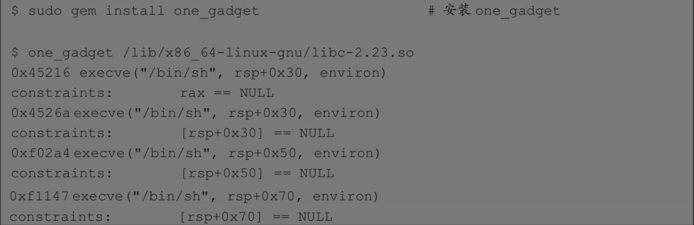
  - 可以看到，我们总共找到了4个one-gadget，以及它们各自的限制条件
  - 使用grep命令查找指定函数调用位于glibc源码的哪个文件中:grep -ir "函数名" ./ | grep "PATH"
  - 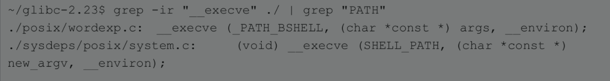
## one-gadget使用实例
- 12.1.2　ASIS CTF Quals 2017：Start hard
# 通用gadget及Return-to-csu
- 我们知道64位程序的前6个参数依次通过寄存器rdi、rsi、rdx、rcx、r8和r9进行传递，所以在构造ROP链的时候，常常需要找到能够给这些寄存器赋值的gadget，例如pop rdi; ret等。幸运的是，在__libc_csu_init()函数中就存在这样的gadget，该函数是每一个使用了libc的动态链接程序所必备的，我们称之为通用gadget。利用该通用gadget构造ROP链的方法称为Return-to-csu，该技术适用于开启ASLR、但关闭PIE或者二进制文件在内存中的基地址已知的情况。具体细节可查阅Black Hat Asia2018的议题Return-to-csu: A New Method to Bypass 64-bitLinux ASLR。
## linux程序启动过程
- 相关资料：Linuxx86 Program Start Up
- 显示可执行文件中所有的函数： nm 文件名 | grep " [Tt]" && nm -D 文件名
  - 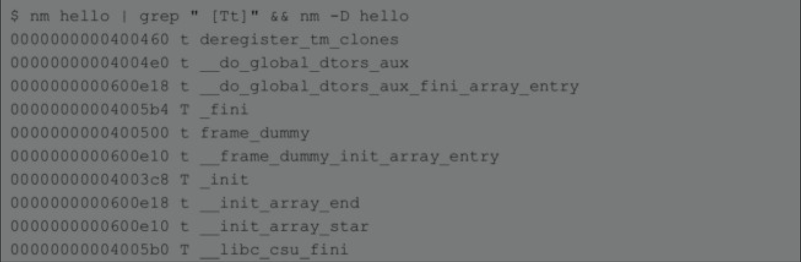
  - 
- linux程序启动过程
  - _start()
    - __lib_start_main()
      - __libc_csu_init()
      - main()
      - exit()
- Linux程序的入口是_start()函数，该函数通过寄存器及栈传递7个参数（加粗部分代码），最终调用了__lib_start_main()函数：
  - 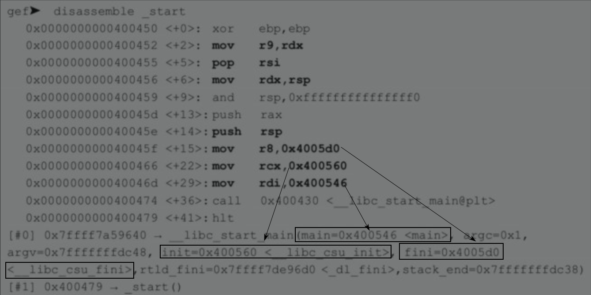
- 除了 main()函数指针，还传入了3个外部函数指针，分别是__libc_csu_init()、__libc_csu_fini()和_dl_fini()。其中，作为参数init传递的__libc_csu_init()函数是需要重点关注的，该函数用于在main()函数调用前做一些初始化工作。list命令输出源码 bt命令输出调用堆栈
  - 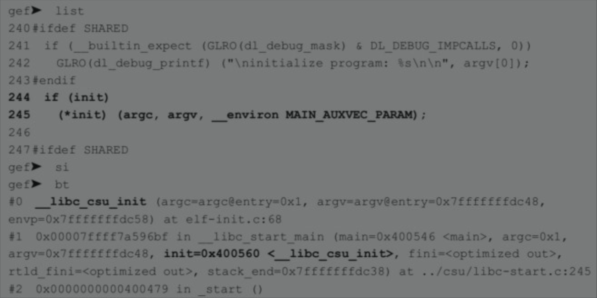
- __libc_csu_init()函数结束后，又返回到__libc_start_main()函数中，然后调用main()函数：
  - 
- main()函数结束后，同样返回到__libc_start_main()，最后退出。
  - 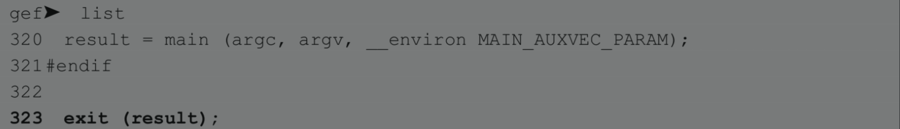
## Return-to-csu
- 了解了Linux程序启动的基本过程，我们来重点关注__libc_csu_init()函数，加粗部分代码就是我们所找的通用gadget。
  - 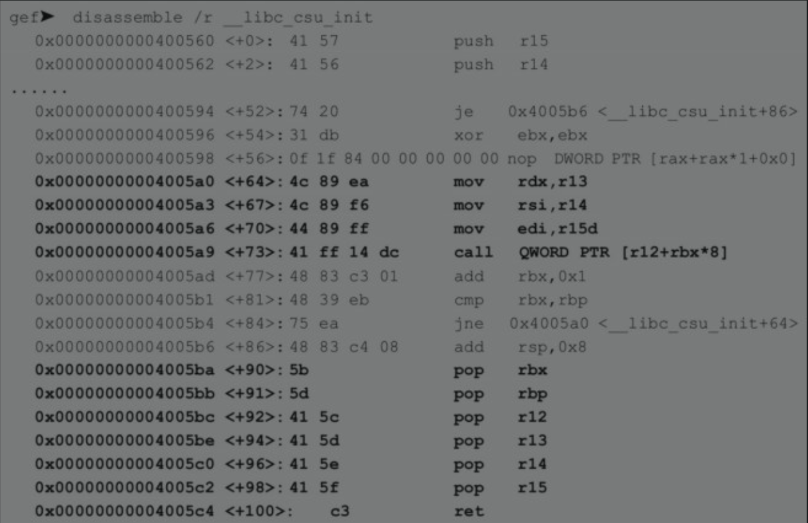
- 将其提取出来（以ret结尾），可分为part1和part2两段，如下所示。
  - 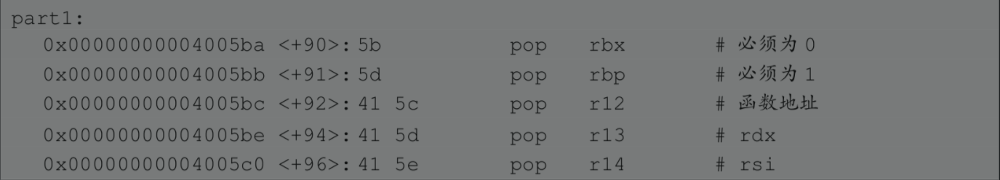
  - 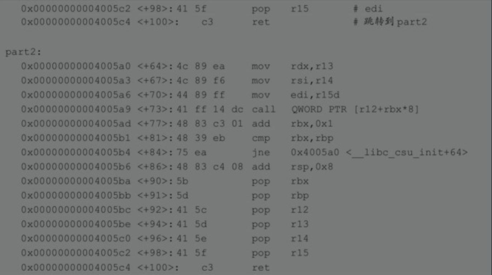
- 在构造ROP链时，part1是连续六个pop，我们可以通过布置栈来设置这些寄存器，然后进入part2，前三条语句（r13->rdx、r14->rsi、r15d->edi）分别给三个寄存器赋值，并作为part2调用函数的参数。需要注意的是，第三句r15d（r15的低32位）给edi（rdi的低32位）赋值，两者皆是32位，但即使这样也已经可以做很多事情了。另外，在布置栈时需要满足一些条件，已经在上面的代码中标出
- 在使用Python编写利用脚本时，可以直接套用下面的这个函数。
  - 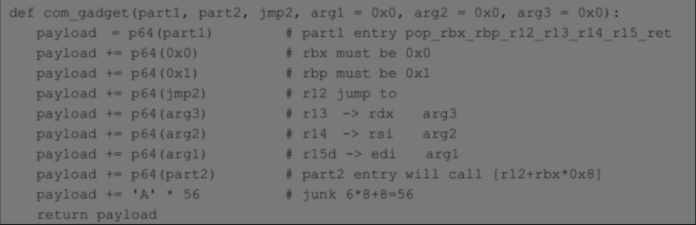
- 对于关闭了PIE的二进制文件，其加载到内存中的地址是已知的，也就是通用gadget的地址已知，那么我们只需要泄露libc的地址即可绕过ASLR；而对于开启了PIE的二进制文件，其内存地址随机，那么就需要先得到这个地址，可以通过Offset2lib技术来实现。在并发服务器（foring server）上，受copy-on-write机制的影响，其复刻的子进程无须再次PIE，所以可以逐字节进行爆破。
- 其实，在__libc_csu_init()中，不止上面这个gadget，如果有人精通字节码，稍作偏移即可找到一些更隐蔽的gadget。例如5e和5f分别是pop rsi和pop rdi的字节码，如下所示。
  - 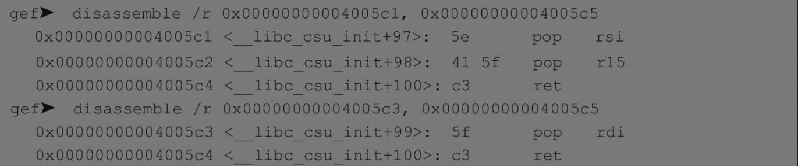
## Return-to-csuCTF题目实例
- 12.2.3　LCTF 2016：pwn100
# 劫持hook函数
- 在glibc中，通过指定对应的hook函数，可以修改malloc()、realloc()和free()等函数的行为，从而帮助我们调试使用了动态内存分配的程序。例如，当调用malloc()函数时，程序会先查看其hook函数是否为空，如果不是就会跳到hook函数处执行。在Pwn题目中，我们也常常利用这一特性，修改hook函数的值（例如one-gadget），使程序在调用malloc系列函数之前，执行hook所指定的代码片段，从而改变程序流。
## 内存分配hook
- __malloc_hook、__realloc_hook和__free_hook都是函数指针变量，在源文件malloc.c中被申明，其中__free_hook的初始值为0，另外两个则分别是各自的初始化函数malloc_hook_ini和realloc_hook_ini。
  - 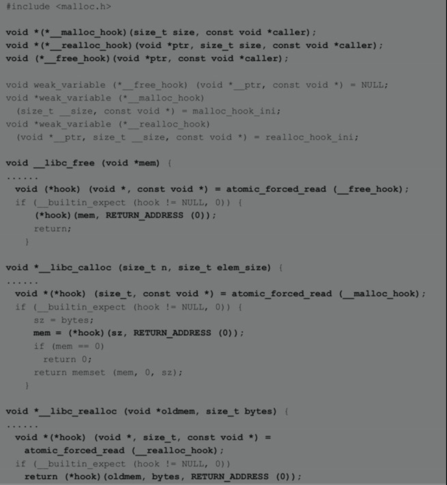
- 通过信息泄露得到libc的基地址，将其加上偏移即可得到hook函数变量在内存中的地址，通常该地址所在的内存段都是可读写的，下面是一个例子。
  - 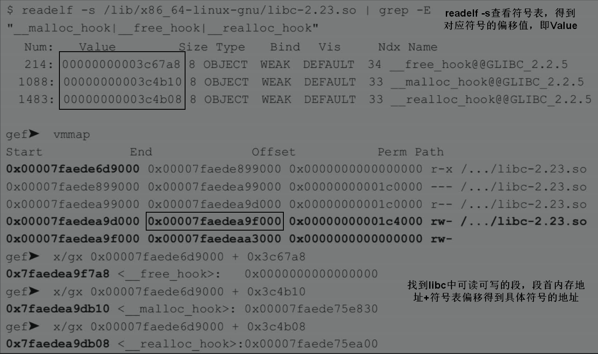
## 劫持hook函数CTF题目实例
- 12.3.2　0CTF 2017 - babyheap
# 利用DynELF泄露函数地址
- 通常，我们要想获得某个库函数在内存中的地址，方法是先泄露同一个库中已知函数的地址，然后计算偏移。这样做的前提是我们能够知道两个函数之间的偏移是多少，但在不同服务器上，libc的版本差异使得偏移不尽相同。当我们面对未知版本的libc时，通常有两种办法：第一种先泄露任意两个函数的地址，再通过一些工具（如libc.blukat.me）进行版本查询；第二种就是本节所讲的DynELF。
## DynELF模块使用示例
- DynELF是Pwntools中一个非常有用的模块，当目标程序存在可以反复触发的，对任意给定地址均有效的信息泄露漏洞时，就可以使用该模块。官方文档中给出了下面的例子。
  - 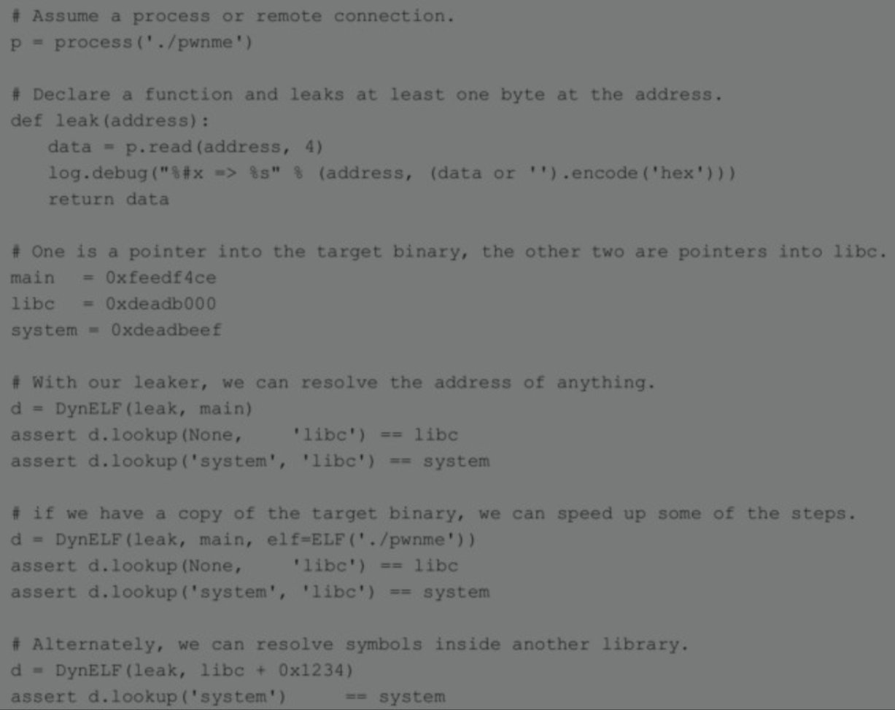  
- 可以看到，要想使用DynELF，首先需要一个leak()函数，该函数至少需要获取到某个地址上1个字节的数据，然后将这个函数作为参数生成一个DynELF对象d = DynELF(leak, main)，就完成了初始化工作。接下来，我们就可以搜索内存，获得所需的函数地址了。
- DynELF实例的初始化如下所示。
  - 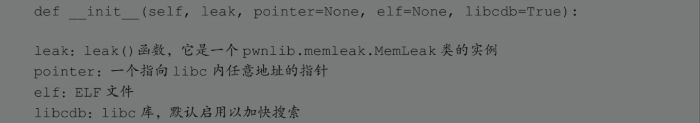
## DynELF原理 
- 通过信息泄露漏洞，DynELF将对任意内存进行搜索，它首先找到ELF文件在内存中的基地址，然后定位到libc并对其进行解析，从而找到所需函数符号的地址，
## CTF题目实例
- 12.4.3　XDCTF 2015：pwn200
# SSP Leak
- Stack Smashing Protector（SSP）是一个著名的缓冲区溢出漏洞缓解措施，其首次出现是1998年作为StackGuard被引入GCC，后来发展成ProPolice，由RedHat实现了-fstack-protector和-fstack-protector-all编译选项。当一个函数检测到栈上的Canary被破坏时，就会转到__stack_chk_fail()函数终止程序运行并抛出错误信息。该错误信息包含了argv[0]指向的字符串，如果我们能够控制argv[0]，那么将可能造成信息泄露，这一技术被称为SSP Leak。具体细节可查看发表在Phrack杂志的文章Adventure with Stack Smashing Protector(SSP)。
# 利用environ泄露栈地址
- 4.1.5节详细介绍了环境变量和环境变量表的相关知识，并且提到environ变量常用于泄露栈地址，因为该变量位于libc中，并且保存了环境变量表（位于栈上）的地址。本节通过一道例题巩固一下相关知识。
# 利用_IO_FILE结构
- FILE结构的利用是一种通用的控制流劫持技术。攻击者可以覆盖堆上的FILE指针使其指向一个伪造的结构，并通过结构中一个名为vtable的指针，来执行任意代码。
# 利用vsyscall
- 在一个开启ASLR的系统上运行一个PIE的二进制文件，可以很大程度上进行地址随机化，增加漏洞利用的难度。然而在内存空间中，vsyscall页由于历史的原因并没有随机化，虽然大部分指令已经被移除，并替换为一些特殊的陷入（trap）指令，但仍然可能成为攻击者的突破口。