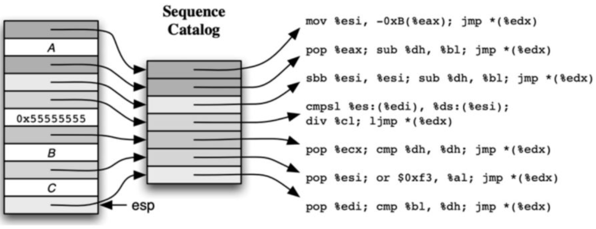
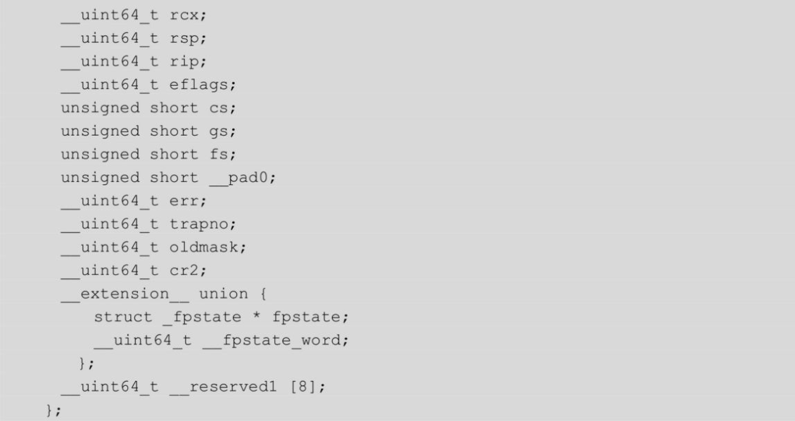
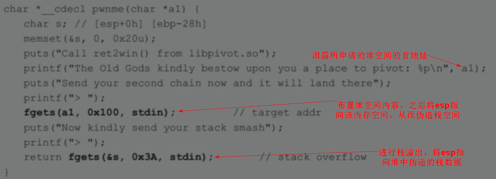
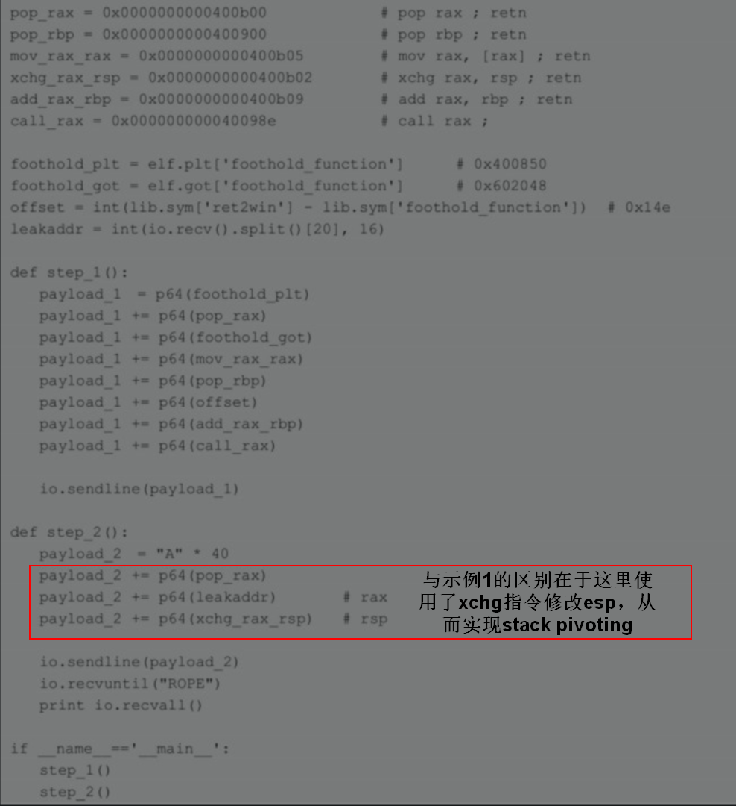

# 栈溢出原理
- C语言对数组引用不做任何边界检查，从而导致缓冲区溢出，包括堆溢出和栈溢出
- 函数调用栈
  - 
- x86函数调用栈
  - 
- x86-64
  - 
  - func()没有下移rsp开辟栈空间的操作，导致rbp和rsp的值是相同的，其实这是一项编译优化：根据AMD64 ABI文档的描述，rsp以下128字节的区域被称为redzone，这是一块被保留的内存，不会被信号或者中断所修改。于是，func()作为叶子函数就可以在不调整栈指针的情况下，使用这块内存保存临时数据。
  - 在更极端的优化下，rbp作为栈基址其实也是可以省略的，编译器完全可以使用rsp来代替，从而减少指令数量。GCC编译时添加参数“-fomit-frame-pointer”即可。
# 栈溢出危险函数
- 第一类危险函数是scanf、gets等输入读取函数。
  - 第一条scanf的格式字符串"%s"并未限制读取长度，明显存在栈溢出的风险；
  - 第二条scanf使用"%ns"的形式限制了长度为10，看似没有问题，但由于scanf()函数会在字符串末尾自动添加一个“\0”，如果输入刚好10个字符，那么“\0”就会溢出。
  - 最安全的做法应该是第三条scanf，既考虑了缓冲区大小，又考虑了函数特性。
  - 
- 第二类危险函数是strcpy、strcat、sprintf等字符串拷贝函数。考虑下面的语句，read()函数读取用户输入到srcbuf，这里很好地限制了长度。接下来strcpy()把srcbuf拷贝到destbuf，此时由于destbuf的最大长度只有10，小于srcbuf的最大长度20，显然是有可能造成溢出的。对于这种情况，建议使用对应的安全函数strncpy、strncat、snprintf等来代替，这些函数都有一个size参数用于限制长度。
  - 
# ret2shellcode注入与ret2libc
- ret2shellcode
  - 适用于未开启nx保护机制的情况
  - padding1使用任意数据即可，比如“AAAA...”，一直覆盖到调用者的ebp。然后在返回地址处填充上shellcode的地址，当函数返回时，就会跳到shellcode的位置。padding2也可以使用任意数据，但如果开启了ASLR，使shellcode的地址不太确定，那么就可以使用NOP sled（“\x90\x90...”）作为一段滑板指令，当程序跳到这段指令时就会一直滑到shellcode执行。
  - 
- ret2libc
  - 适用于绕开nx保护机制
  - 开启NX后，栈上的shellcode不可执行，这时就需要使用ret2libc来调用libc.so中的system("/bin/sh")，如图10-3所示。这一次返回地址被覆盖上system()函数的地址，padding2为其添加一个伪造的返回地址，长度为4字节。紧接着放上"bin/sh"字符串的地址，作为system()函数的参数。如果开启了ASLR，那么system()和"/bin/sh"的地址就变成随机的，此时需要先做内存泄露，再填充真实地址。
  - 
- 具体实例见4.3和4.4节
# 返回导向编程
- 相关论文
  - The Geometry of Innocent Flesh on the Bone: Return-into-libc without Function Calls (on the x86)
- gadget搜索工具
  - ROPgadget、Ropper，还可以直接在ropshell网站上搜索。
- gadgets在多个体系架构上都是图灵完备的，允许任意复杂度的计算，也就是说基本上只要能想到的事情它都可以实现
- 常见的gadget类型
  - （1）保存栈数据到寄存器。弹出栈顶数据到寄存器中，然后跳转到新的栈顶地址。所以当返回地址被一个gadget的地址覆盖，程序将在返回后执行该指令序列。例如：pop eax; ret；
  - （2）保存内存数据到寄存器。例如：mov ecx,[eax]; ret；
  - （3）保存寄存器数据到内存。例如：mov [eax],ecx; ret；
  - （4）算数和逻辑运算。add、sub、mul、xor等。例如：addeax,ebx; ret, xor edx,edx; r
  - （5）系统调用。执行内核中断。例如：int 0x80; ret, call gs:[0x10]; ret；
  - （6）会影响栈帧的gadget。这些gadget会改变ebp的值，从而影响栈帧，在一些操作如stack pivot时我们需要这样的指令来转移栈帧。例如：leave; ret, pop ebp; ret。
## 传统rop的特征及其检测思路
- 传统rop的特征
  - 第一，ROP执行流会包含很多ret指令，而且这些ret指令可能只间隔了几条其他指令；
  - 第二，ROP利用ret指令来unwind堆栈，却没有与ret指令相对应的call指令。
- 检测思路
  - 针对第一点，可以检测程序执行中是否有频繁ret的指令流，作为报警的依据；
  - 针对第二点，可以通过call和ret指令的配对情况来判断异常。或者维护一个影子栈（shadowstack）作为正常栈的备份，每次ret的时候就与正常栈对比一下；
  - 还有更极端的，直接在编译器层面重写二进制文件，消除里面的ret指令。
- 使用不依赖于ret指令的变种rop即可绕过相关防御措施
## 变种rop
- JOP（Jump-Oriented Programming
  - 相关论文
    - Return-Oriented Programming without Returns
    - 另一篇论文Jump-Oriented Programming: A New Class ofCode-Reuse Attack几乎同时提出了这种基于jmp指令的攻击方法。
  - 使用update-load-branch替代ret指令，实现程序执行流程的修改
    - ret指令的作用主要有两个：一个是通过间接跳转改变执行流，另一个是更新寄存器状态。在x86和ARM中都存在一些指令序列，也能够完成这些工作，它们首先更新全局状态（如栈指针），然后根据更新后的状态加载下一条指令的地址，并跳转过去执行。我们把这样的指令序列叫作update-load-branch，使用它们来避免ret指令的使用。由于update-load-branch相比ret指令更加稀少，所以通常作为跳板（trampoline）来重复利用。当一个gadget执行结束后，跳转到trampoline，trampoline更新程序状态后把控制权交到下一个gadget，由此形成ROP链
      - 
    - 由于这些gadgets都以jmp指令作为结尾，我们就称之为JOP（Jump-Oriented Programming），考虑下面的gadget：
      - 
    - 它的行为和ret很像，唯一的副作用是覆盖了eax寄存器，假如程序执行不依赖于eax，那么这一段指令就可以取代ret。当然，eax可以被换成任意一个通用寄存器，而且比起单间接跳转，我们通常更愿意使用双重间接跳转：
      - 
    - 此时，eax存放的是一个被称为sequence catalog表的地址，该表用于存放各种指令序列的地址，也就是一个类似于GOT表的东西。所谓双间接跳转，就是先从上一段指令序列跳到catalog表，然后从catalog表跳到下一段指令序列。这样做使得ROP链的构造更加便捷，甚至可以根据偏移来实现跳转。如图10-6所示。
      - 
- 其他rop变种
  - ROP的变种还包括string-orientedprogramming(SOP)、sigreturn-orientedprogramming(SROP)、data-orientedprogramming(DOP)、crash-resistant orientedprogramming(CROP)和printf programming。
## 示例
- ROP的payload由一段触发栈溢出的padding和各条gadget及其参数组成，这些参数通常用于pop指令，来设置寄存器的值。当函数返回时，将执行第一条gadget 1，直到遇到ret指令，再跳转到gadget 2继续执行，以此类推
- 典型内存布局
  - 
- 将下面的示例代码编译成带PIE的64位程序。由于64位程序在传递前几个参数时使用了寄存器，而不是栈，所以就需要攻击者找到一些gadgets用于设置寄存器的值。在这里就是“pop rdi;ret”，用于将“/bin/sh”的地址存到rdi寄存器。
  - 
- 方便起见，程序直接打印了system函数的地址，来模拟信息泄露。完整的利用代码如下所示
  - 
# Blind ROP
- BROP，即Blind Return Oriented Programming，于2014年在论文Hacking Blind中提出，作者是来自斯坦福大学的Andrea Bittau等人。BROP能够在无法获得二进制程序的情况下，基于远程服务崩溃与否（连接是否中断），进行ROP攻击获得shell，可用于开启了ASLR、NX和canaries的64位Linux。
## BROP原理
- 传统的ROP攻击需要攻击者通过逆向等手段，从二进制文件里提取可用的gadgets，而BROP在符合一定的前提条件下，无须获得二进制文件。其中，两个必要的条件是：
  - 第一，目标程序存在栈溢出漏洞，并且可以稳定触发；
  - 第二，目标进程在崩溃后会立即重启，并且重启后的进程内存不会重新随机化，这样即使目标机器开启了ASLR也没有影响。如果同时在编译时启用了PIE，则服务器必须是一个fork服务器，并且在重启时不使用execve。
- BROP攻击阶段
  - （1）Stack reading：泄露canaries和返回地址，然后从返回地址可以推算出程序的加载地址，用于后续gadgets的扫描。泄露的方法是遍历所有256个数，每次溢出一个字节，根据程序是否崩溃来判断溢出值是否正确。就这样一个字节一个字节地泄露，直到获得完整的8字节canaries。用同样的方法泄露得到返回地址。
  - （2）Blind ROP：这一阶段用于远程搜索gadgets，目标是将目标程序从内存写到socket，传回攻击者本地。
    - write()、puts()等函数都可以作为目标，函数调用可以通过syscall指令，也可以通过call指令，甚至是直接改变控制流跳转到PLT执行。另外，还需要一些修改寄存器的gadgets，可以在通用gadget里找到。
    - 同样地，搜索gadgets的思路也是基于溢出返回地址后判断程序是否崩溃。我们从上一步得到的加载地址开始，每次给返回地址加1，大多数时候这都是一个非法地址，导致程序崩溃。但某些时候，程序会被挂起，例如进入无限循环、sleep或者read，此时连接不会中断，我们将这些指令片段称为stop gadgets。将stop gadgets放到ROP链的最后，就可以防止程序崩溃，利于其他gadgets的搜索。举个例子，如果覆盖的返回地址是指令“pop rdi; ret”，那么它在ret的时候，从栈里弹出返回地址，就可能导致崩溃，但如果栈里放着stop gadget，那么程序就会挂起。
    - 有了stop gadgets，就可以搜索和判断gadgets的行为，从而推断某个gadgtes是否是我们需要的。
  - （3）Build the exploit：利用得到的gadgets构造ROP，将程序从远程服务器的内存里传回来，BROP就转换成了普通的ROP攻击。
## BROP防御思路
- 由于BROP攻击的前提是程序在每次崩溃后会立即重启，并且重启后内存不会再次随机化，论文同时还提出了如下几种防御方案。
  - （1）同时开启ASLR和PIE，并在程序重启时重新随机化内存地址空间以及canaries，例如复刻一个新进程并执行；
  - （2）在程序发生段错误后延迟复刻新进程，降低攻击者的暴力枚举速度；
  - （3）其他的一些通用ROP防御措施，例如控制流完整性CFI。
## 示例
- HCTF 2016：brop（10.3.2节）
# SROP
- Sigreturn Oriented Programming
- 相关论文：Framing Signals — A Return toPortable Shellcode 2014年
- SROP与ROP类似，通过一个简单的栈溢出，覆盖返回地址并执行gadgets控制执行流。不同的是，SROP使用能够调用sigreturn的gadget覆盖返回地址，并将一个伪造的sigcontext结构体放到栈中。
## SROP原理
- linux系统调用
  - 先讲一下Linux的系统调用。64位和32位的系统调用表分别位于/usr/include/asm/unistd_64.h和/usr/include/asm/unistd_32.h中，另外还需要查看/usr/include/bits/syscall.h。
  - 一开始Linux是通过int 0x80中断的方式进入系统调用的，它会先进行调用者特权级别的检查，然后进行压栈、跳转等操作，这无疑会浪费许多资源。
  - 从Linux 2.6开始，就出现了新的系统调用指令sysenter/sysexit，前者用于从Ring3进入Ring0，后者用于从Ring0返回Ring3，它没有特权级别检查，也没有压栈的操作，所以执行速度更快。
- signal机制
  - 当有中断或异常产生时，内核会向某个进程发送一个signal，该进程被挂起并进入内核，然后内核为其保存相应的上下文，再跳转到之前注册好的signal handler中进行处理，待signalhandler返回后，内核为该进程恢复之前保存的上下文，最终恢复执行。具体步骤如下。
    - 一个signal frame(即sigcontext)被添加到栈，这个frame中包含了当前寄存器的值和一些signal信息
    - 一个新的返回地址被添加到栈顶，这个返回地址指向sigreturn系统调用；
    - signal handler被调用，signal handler的行为取决于收到什么signal；
    - signal handler执行完后，如果程序没有终止，则返回地址用于执行sigreturn系统调用；
    - sigreturn利用signal frame恢复所有寄存器以回到之前的状态；
    - 最后，程序执行继续
- signal frame(即sigcontext）的结构
  - 32位中sigcontext结构体
    - 
    - 
  - 64位中，保存到栈中的是ucontext_t结构体
    - 
    - 
- SROP攻击实现原理
  - 系统在执行sigreturn系统调用的时候，不会对signal做检查，它不知道当前的这个frame是不是之前保存的那个frame。由于sigreturn会从用户栈上恢复所有寄存器的值，而用户栈是保存在用户进程的地址空间中的，是用户进程可读写的。如果攻击者可以控制栈，也就控制了所有寄存器的值
  - ***根据signal原理，在进行SROP攻击时，需要在程序返回地址覆盖指向sigreturn系统调用的指针，并在该指针之后布置signal frame，程序中的函数返回后，sigreturn系统调用开始执行，并根据栈中的signal frame对寄存器进行设置，从而完成程序执行流程劫持***
  - ***在程序中确定指向sigreturn系统调用的指针有以下几种方法***
    - 使用程序中已经存在的sigreturn gadget（不同操作系统中位置可能不同）
    - 64位程序中，使用程序中的syscall&ret gadget，需要将rax者设置为0xf，即sigreturn的系统调用号（该gadget的地址在一些较老的系统上是没有随机化的，通常可以在vsyscall中找到，地址为0xffffffffff600000）
    - 32位程序中，使用程序中的int 0x80&ret gadget，需要将rax者设置为0xf，即sigreturn的系统调用号（通常可以在vDSO中找到，但这个地址可能是随机的）
  - 常见sigreturn以及syscall gadget位置
## signal handler退出时的栈顶结构

## 论文示例，基于x86-64 Linux
- 首先利用一个栈溢出漏洞，将返回地址覆盖为一个指向sigreturn gadget的指针。如果只有syscall，则将RAX设置为0xf，效果是一样的。在栈上覆盖上fake frame。其中：
  - RSP：一个可写的内存地址
  - RIP：“syscall;retn”gadget的地址
  - RAX：read 的系统调用号
  - RDI：文件描述符，即从哪儿读入
  - RSI：可写内存的地址，即写入到哪儿
  - RDX：读入的字节数，这里是306
- sigreturn gadget执行完之后，因为设置了RIP，会再次执行“syscall;retn”gadget。payload的第二部分就是通过这里读入文件描述符的。这一部分包含了3个“syscall;retn”、fake frame和其他的代码或数据。
- 接收完数据后，read函数返回，返回值即读入的字节数被放到RAX中。我们的可写内存被这些数据所覆盖，并且RSP指向了它的开头。然后“syscall;retn”被执行，由于RAX的值为306，即syncfs的系统调用号，该调用总是返回0，而0又是read的调用号。
- 再次执行“syscall;retn”，即read系统调用。这一次，读入的内容不重要，重要的是数量，让它等于15，即sigreturn的调用号。
- 执行第三个“syscall;retn”，即sigreturn系统调用。从第二个fake frame中恢复寄存器，这里是execve("/bin/sh",...)。另外还可以调用mprotect将某段数据变为可执行的。
- 执行execve，拿到shell。
- 
## pwntools srop模块
- pwntools中已经集成了SROP的利用工具pwnlib.rop.srop，类SigreturnFrame的构造总共分为三种情况，结构和初始化的值会有所不同：（1）32位系统上运行32位程序；（2）64位系统上运行32位程序；（3）64位系统上运行64位程序。
  - 
## 示例题目:Backdoor CTF 2017：Fun Signals
- 10.4.3节
## rop教程
- ROP Emporium提供了一系列用于学习ROP的挑战，每个挑战介绍一个知识，难度也逐渐增加。它的特点是所有挑战都有相同的漏洞点，不同的只是ROP链的构造方法。每个挑战都包含了32位和64位程序，通过对比可以帮助我们理解ROP链构造的差异。这些挑战都包含一个flag.txt的文件，目标就是通过控制程序执行打印出文件内容。
# stack pivoting
- 攻击者能够控制ESP和EBP的值，那么就相当于控制了整个堆栈，通过伪造栈上的返回地址进而控制执行流。
- Stackpivoting就是这样一种将程序真实的堆栈转移到伪造堆栈上的攻击技术，可用于绕过不可执行栈保护或者处理栈空间过小的情况。
## stack pivoting原理
- 一个函数入口处和结尾处（leave和retn）通常表示为下面的指令。
  - 
- stack pivoting的payload构造通常如下所示，其中fake ebp是目标地址减去4个字节。
  - 
- leave指令将fake ebp赋值给了esp，相当于转移了栈顶，然后从新的栈里弹出ebp的值，这个值是什么不是特别重要，因为程序在一个函数里的执行主要依赖esp。接着retn指令从新的栈里弹出eip，从而控制执行流。
## 示例1
- 来自ROP Emporium中的pivot32
- 目标程序仅开启了NX保护，另外，还依赖动态库libpivot32.so。
  - 
- 栈溢出漏洞位于pwnme()函数中，但是溢出的字节数很小，除去EBP后只有0x3A-0x28-4=14字节的空间可以使用。因此，为了执行更复杂的逻辑，我们将ROP链放置在a1处（这是一个由malloc分配的堆，且地址已经给出），并通过stack pivoting将栈转移过去。
  - 
- 程序提供的gadget
  - 
- 最后，要控制执行流调用libpivot32.so中的ret2win()函数。由于启用了ASLR和PIE，函数地址是随机的，因此需要做信息泄露。这时就可以利用同样从libpivot32.so中导入的函数foothold_function()，在动态绑定后，通过GOT表泄露出该函数的地址，计算偏移就可以得到ret2win()的地址。
  - 
  - 
## 示例2
- 来自ROP Emporium中的pivot
- 基本同上，但可以尝试把修改rsp的部分也用gadgets来实现，这样做的好处是不需要伪造一个堆栈，即不用管ebp的地址。另外，由于在构造payload时，“leave;retn”的地址0x0000000000400adf存在截断字符“0x0a”，导致不能通过正常方式写入缓冲区，虽然这也是可以解决的（比如先将“0x0a”换成非截断字符，之后再通过寄存器将“0x0a”替换进去，这是解决缓冲区存在截断字符的通用方法），但是难度较大，感兴趣的读者可以尝试一下。
  - 
  - 
## ctf题目
- 10.5.2　GreHack CTF 2017：beerfighter
# ret2dl-resolve
- ret2dl-resolve于2015年在论文How the ELF RuinedChristmas中被提出
## 基础知识
- 关于elf文件加载、动态链接、动态链接器（ld-linux.so）的信息见：./资料收集/linux中elf文件加载执行.md
- 相关论文：ret2dl-resolve于2015年在论文How the ELF RuinedChristmas中被提出
- 动态链接的elf文件加载运行的大致步骤
  1. linux内核加载可执行文件以及ld-linux.so，并将控制权交给动态链接器ld-linux.so
  2. ld-linux.so加载可执行文件所依赖的其他共享库文件，并执行其他共享库及符号解析及重定位
  3. 动态链接器ld-linux.so完成符号解析及重定位后，将控制权交给可执行文件，开始执行主程序代码
- 动态链接对导入符号（函数和全局变量）的解析涉及的数据结构如图所示（阴影部分表示只读内存）。
  - 
- 动态符号字符串表.dynstr
  - 用于保存动态链接相关的符号名称字符串，例如函数名称以及全局变量名称
- 动态符号表.dynsym
  - 由Elf_Sym结构体组成，每个动态链接相关的符号对应一个Elf_Sym结构体
  - Elf_Sym结构体中
    - st_name域保存符号名字符串相对于.dynstr段首地址的偏移；
    - st_value域是当符号被导出时用于存放虚拟地址的，不导出时则为NULL。
    - 
- 重定位表：.rel.plt段（用于导入函数）和.rel.dyn段（用于导入全局变量）
  - 由Elf_Rel结构体组成，每个动态链接相关的符号对应一个Elf_Rel结构体
  - Elf_Rel结构体中
    - r_offset域用于保存解析后的符号地址写入内存的位置（绝对地址），即对应got表项的地址
    - r_info域的高位3个字节用于标识该符号在.dynsym段中的位置（无符号下标）
    - 
- 当程序导入一个函数时
  - 动态链接器会同时在.dynstr段中添加一个函数名字符串，在.dynsym段中添加一个指向函数名字符串的Elf_Sym，在.rel.plt段中添加一个指向Elf_Sym的Elf_Rel。最后，这些Elf_Rel的r_offset域又构成了GOT表，保存在.got.plt段中。
- 由于延迟绑定机制的存在，符号的解析发生在第一次使用时，需要got表和plt表的协同，原理是调用_dl_runtime_resolve()函数
  - 调用_dl_runtime_resolve()前，先将导入函数的标识（Elf_Rel在.rel.plt段中的偏移，即reloc_index）压栈，然后跳转到PLT0执行。PLT0包含两条指令，先将GOT[1]的值（一个link_map对象的地址，即link_map_obj）压栈，然后跳转到GOT[2]保存到地址处，即跳转到_dl_runtime_resolve()函数开始执行
    - 参数reloc_index则标识了解析哪一个导入函数
    - 参数link_map_obj用于获取解析导入函数所需的信息
  - _dl_runtime_resolve()函数调用完毕后，符号实际地址填入got表，并调用对应函数
- _dl_runtime_resolve()函数在sysdeps/i386/dl-trampoline.S中用汇编实现，其中关键函数为_dl_fixup()，该函数在elf/dl-runtime.c中实现，用于解析导入函数的真实地址，并改写GOT
## ret2dl-resolve原理
- 通过获取ret2dl-resolve地址，从而伪造参数调用该函数，即可获得指定函数地址并直接调用该函数，详见xmind笔记
## RELRO保护机制对ret2dl-resolve的影响
- RELRO保护机制会影响延迟绑定，因此也会影响ret2dl-resolve：
  - Partial RELRO：包括.dynamic段在内的一些段会被标识为只读。
  - Full RELRO：在Partial RELRO的基础上，禁用延迟绑定，即所有的导入符号在加载时就被解析，.got.plt段被完全初始化为目标函数的地址，并标记为只读。
- 攻击场景1
  - 关闭RELRO保护，使.dynamic段可写时：由于动态加载器是从.dynamic段的DT_STRTAB条目中来获取.dynstr段的地址，而DT_STRTAB的位置是已知的，且默认情况下可写，所以攻击者能够改写DT_STRTAB的内容，欺骗动态装载器，使它以为.dynstr段在.bss上，同时在那里伪造一个假的字符串表。当动态装载器尝试解析printf()时就会使用不同的基地址来寻找函数名，最终执行的是execve()
  - 总结：通过修改.dynamic，从而伪造.dynstr表，实现不同函数之间的替换，根本原理在于Elf_Sym结构体中st_name域保存符号名字符串相对于.dynstr段首地址的偏移，如果伪造.dynstr表，则在对应偏移设置任意函数，可以完成函数的替换
    - 
- 攻击场景2
  - 开启Partial RELRO保护，使.dynamic段不可写时：我们知道_dl_runtime_resolve()的第二个参数reloc_index对应Elf_Rel在.rel.plt段中的偏移，动态装载器将其加上.rel.plt的基地址来得到目标Elf_Rel的内存地址。然而，当这个内存地址超出了.rel.plt段，并最终落在.bss段中时，攻击者就可以在那里伪造一个Elf_Rel，使r_offset的值是一个可写的内存地址来将解析后的函数地址写在那里。同理，使r_info的值是一个能够将动态装载器导向到攻击者控制内存的下标，指向一个位于它后面的Elf_Sym，而Elf_Sym中的st_name指向它后面的函数名字符串。
  - 总结：即通过修改_dl_runtime_resolve函数的第二个参数，将该函数所解析的Elf_Rel结构体设置为伪造的，Elf_Rel结构体内部的r_offset即对应符号got表项的地址，通过伪造该字段，可以将符号地址解析到攻击者指定的可写地址，同理可以控制Elf_Rel结构体内部的r_info字段，进一步使其指向伪造的Elf_Sym，而Elf_Sym中的st_name指向它后面的函数名字符串。
    - 
- 其他更复杂的攻击场景，包括修改GOT[1]的link_map对象，以及绕过Full RELRO的方法等，可以阅读论文进一步了解。
## 实例ctf题目
- 10.6.2　XDCTF 2015：pwn200