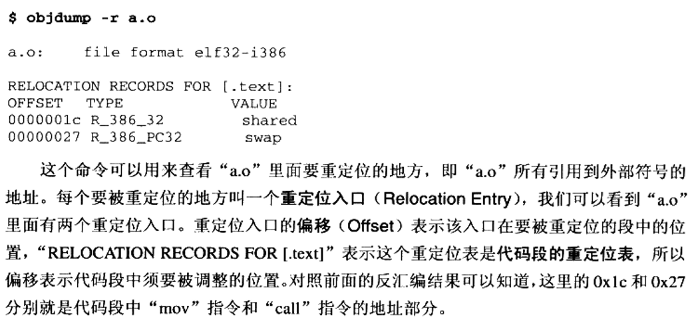
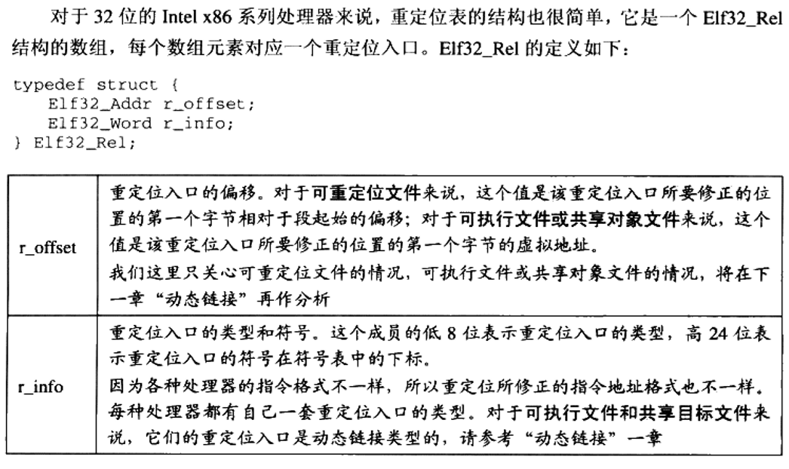
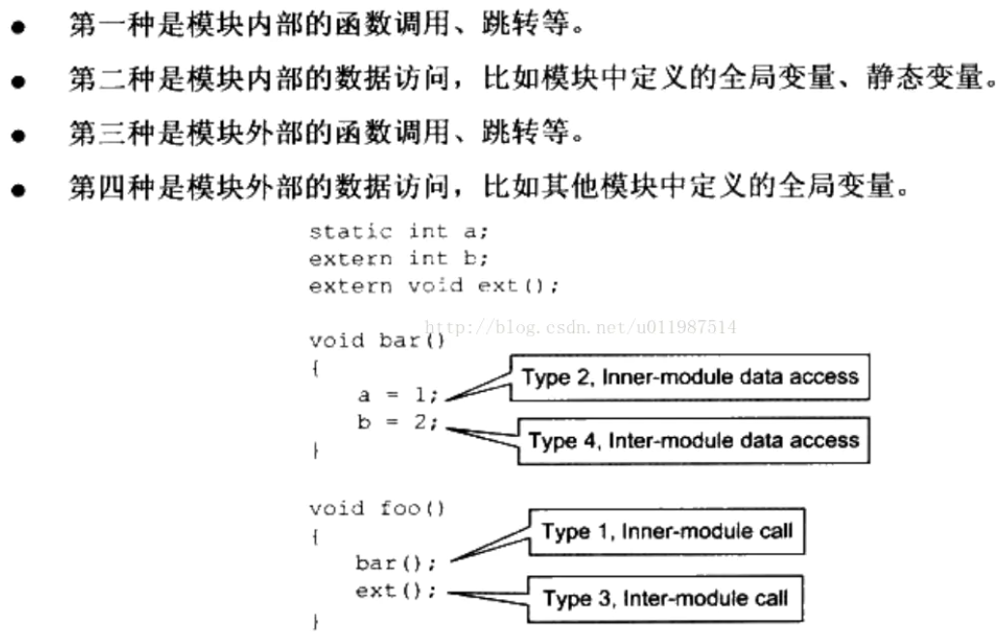

资料来源
- https://www.cnblogs.com/gradyblog/p/8964073.html
- https://www.jianshu.com/p/2055bd794e58
- CTF PWN.xmind CTF PWN2.xmind
# 什么是重定位行为
- 重定位操作是连接符号引用（symbolic references）和符号定义（symbolic definitions）的过程。例如，程序中调用一个（外部）函数，代码中我们只需要指定函数名（符号引用）即可，但是当程序实际运行的时候，相关的CALL指令必须能够正确无误地跳转到函数实际地址处（符号定义）去执行函数代码。可是在链接阶段之前，符号的虚拟地址（亦可称运行时地址）并没有分配，只有在链接阶段的符号解析过程中链接器才会为符号分配虚拟地址。在符号地址确认后，链接器这才会修改机器指令（即重定位操作是在符号解析之后），可是链接器并不会聪明到可以自动找到可重定位文件中引用外部符号的地方（即需要修改的地方），所以可重定位文件必须提供相应的信息来帮助链接器，换句话说，可重定位文件中必须包含相关的信息来告诉链接器如何去修改节的内容，只有这样，最后生成的可执行文件或者共享库才会包含正确的信息来构建最终的进程映像。可重定位项就是帮助链接器进行重定位操作的信息。
- 重定位就是把符号引用与符号定义链接起来的过程，这也是 android linker 的主要工作之一。
# 静态链接过程中的重定位(链接时重定位)
- 静态链接所使用的重定位段（对于每一个需要重定位的段，都有一个重定位表与之对应）
  - .rel.data 存储.data的重定位信息
  - .rel.text 存储.text的重定位信息
    - .rel.text属于普通重定位辅助段 ,他由编译器编译产生，存在于obj文件内。链接器链接时，该段用于最终可执行文件或者动态库的重定位。通过它修改原obj文件的.text段后，合并到最终可执行文件或者动态文件的.text段。
    - .rel.text由编译器产生，然后在连接时候，由链接器负责根据.rel.text对.text段进行修改，从而达到重定位目的；
- 使用命令objdump -r查看
  - 
- 重定位表项结构(r_offset是需要被重定位的位置，r_info是对应位置的重定位类型，决定了该位置将会被以何种方式重定位)
  - 
# 动态链接过程中的重定位(装载时重定位)
- 在链接时，对所有绝对地址的引用不作重定位，而把这一步推迟到装载时再完成。一旦模块装载地址确定，即目标地址确定，那么系统就对程序中所有的绝对地址引用进行重定位。（即函数实际内存地址=函数在模块内的偏移+模块内存加载基址）
- 可能带来的问题：装载时重定位因为会修改指令中的绝对地址引用，所以当共享对象中的代码被多个可执行文件引用时，就需要针对不同的可执行文件保存不同的重定位后的代码，所以会占据大量内存
- 解决思路：使用把程序模块中共享的指令部分在装载时不需要因为装载地址的改变而改变。把指令中那些需要被修改的部分分离出来，跟数据部分放在一起，这样指令部分就可以保持不变，而数据部分可以在每个进程中拥有一个副本。这种方案就是目前的地址无关代码（PIC）技术。
  - 先分析模块中各种类型的地址引用方式，把共享对象模块中地址引用按照是否跨模块分为两类：模块内部引用和模块外部引用，按照不同的引用方式又可以分为指令引用和数据访问。
  - 
  - 对于类型3和类型4，分别使用.got.plt和.got保存模块外部的函数地址和模块外部全局变量的实际地址，程序代码段中通过pc寄存器+指定偏移从而寻址.got.plt和.got表，.got.plt和.got保存在对应模块数据段，从而避免重定位过程中修改程序模块中的代码段，转而仅修改数据段。
- 动态链接中，共享文件（.so文件）是否使用地址无关代码（PIC）技术的区别
  - 如果不使用PIC模式编译，那么装载时肯定是要重定位的，而且时每个进程都有一个副本（相对比较占用内存）
  - 如果使用PIC模式编译，将会在编译期生成地址无关代码（PIC Position-Independent Code），则代码段可以实现多程序共享，而仅数据段部分会在每个程序中有一个副本（节省内存）
    - PIC模式编译的模块仅需要对数据段进行重定位（因为代码段中的绝对地址引用部分被分离到了GOT中，而GOT是数据段的一部分；数据段中也可能包含绝对地址的引用，正好重定位数据段）
- 动态链接所使用的重定位段（即重定位表）
  - .rel.dyn：重定位的地方在.got段内。主要是针对外部数据变量符号。例如全局数据。重定位在程序运行时定位，一般是在.init段内。定位过程：获得符号对应value后，根据rel.dyn表中对应的offset，修改.got表对应位置的value。另外，.rel.dyn 含义是指和dyn有关，一般是指在程序运行时候，动态加载。区别于rel.plt，rel.plt是指和plt相关，具体是指在某个函数被调用时候加载。
    - 对于数据，根据.rel.dyn找到.got中的offset位置。
  - .rel.plt：重定位的地方在.got.plt段内（注意也是.got内,具体区分而已）。主要是针对外部函数符号。一般是函数首次被调用时候重定位。可看汇编，理解其首次访问是如何重定位的，实际很简单，就是初次重定位函数地址，然后把最终函数地址放到.got.plt内，以后读取该.got.plt就直接得到最终函数地址(参考过程说明)。 所有外部函数调用都是经过一个对应桩函数，这些桩函数都在.plt段内。
    - 对于函数则通过.plt桩函数和.rel.plt段来获取函数真实地址，然后存在于.got.plt。
  - .rel.dyn和.rel.plt是动态定位辅助段。由链接器产生，存在于可执行文件或者动态库文件内。借助这两个辅助段可以动态修改对应.got和.got.plt段，从而实现运行时重定位。
- 使用命令objdump -R查看elf文件的动态重定位表（即查看.rel.dyn和.rel.plt）
  - 详见工具使用.md 