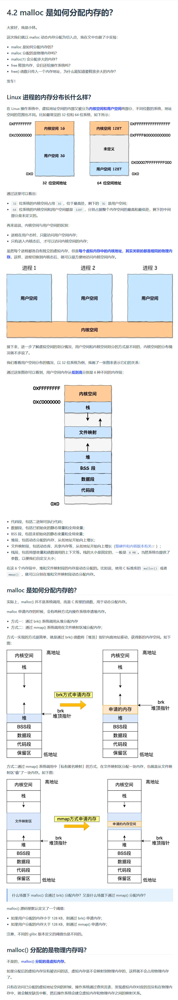
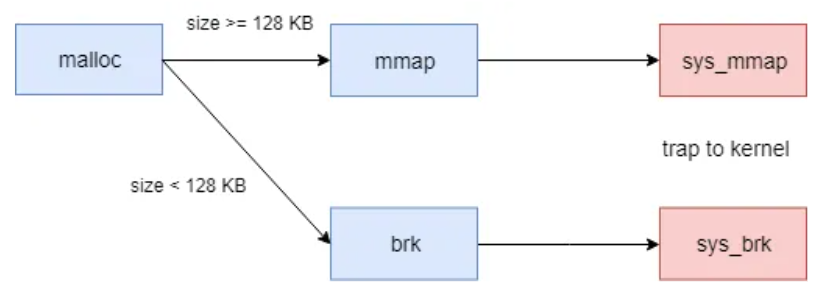

- https://xiaolincoding.com/os/3_memory/malloc.html#linux-%E8%BF%9B%E7%A8%8B%E7%9A%84%E5%86%85%E5%AD%98%E5%88%86%E5%B8%83%E9%95%BF%E4%BB%80%E4%B9%88%E6%A0%B7
- 

# 狼组知识库
堆管理器并非由操作系统实现，而是由libc.so.6链接库实现。封装了一些系统调用，为用户提供方便的动态内存分配接口的同时，力求高效地管理由系统调用申请来的内存，申请内存的系统调用有brk和mmap两种。

brk是将数据段(.data)的最高地址指针_edata往高地址推。（_edata指向数据段的最高地址）

mmap是在进程的虚拟地址空间中（堆和栈中间，称为文件映射区域的地方）找一块空闲的虚拟内存。

这两种方式分配的都是虚拟内存，没有分配物理内存。在第一次访问已分配的虚拟地址空间的时候，发生缺页中断，操作系统负责分配物理内存，然后建立虚拟内存和物理内存之间的映射关系。malloc小于128k的内存时，glibc使用brk分配内存；大于128k时，使用mmap分配内存，在堆和栈之间找一块空闲内存分配。第一次执行malloc可能出现的系统调用如下。
- 