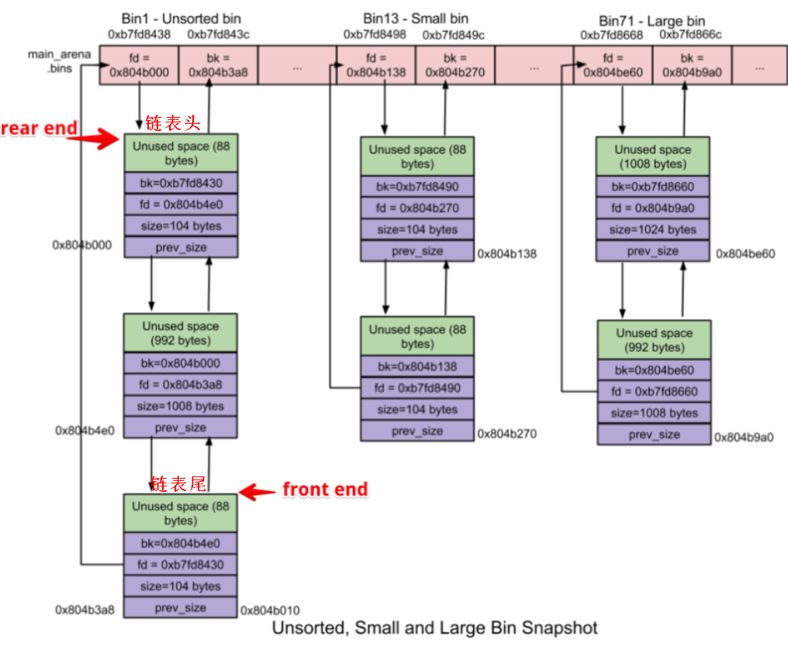

- https://ctf-wiki.org/pwn/linux/user-mode/heap/ptmalloc2/unsorted-bin-attack/

- Unsorted Bin 在使用的过程中，采用的遍历顺序是 FIFO，即插入的时候插入到 unsorted bin 的头部，取出的时候从链表尾获取。
- 结合源码看，即遍历unsorted bin时，使用使用 bin[] 中的bk指针开始，找到链表尾部的chunk，从而开始遍历的

- 个人理解
  - 可以将bin[]中fd指针指向的chunk视为链表头，将bk指针指向的chunk视为链表尾部
  - 