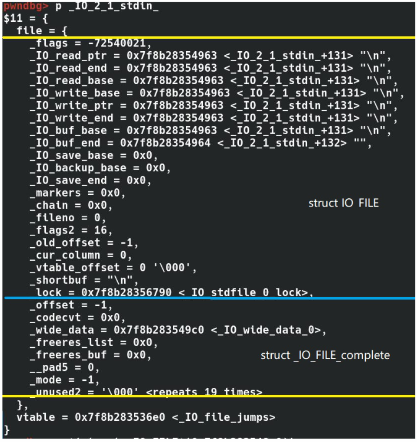
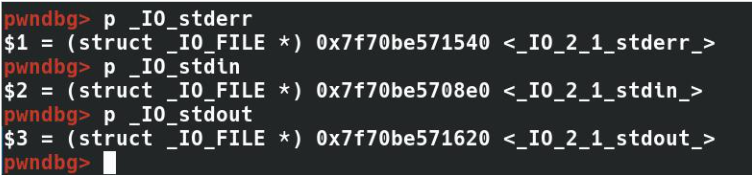

# https://www.cnblogs.com/zengyiwen/p/57551w87.html
- 当Linux创建一个进程时，会自动创建3个文件描述符0,1,2,分别对应标准输入，标准输出，错误输出。C库中与文件描述符对应的是文件指针。查看C库头文件stdio.h中的源码
```C
typedef struct _IO_FILE FILE;  //文件流类型
extern struct _IO_FILE *stdout;     /* 标准输出流  */
extern struct _IO_FILE *stderr;     /* 错误流  */
#ifdef __STDC__
/* C89/C99 say they're macros.  Make them happy.  */
#define stdin stdin
#define stdout stdout
#define stderr stderr
#endif 
```
- 从上面源码看stdin,stdout,stderr是文件流指针，看看stdin，stdout,stderr是如何定义的
```C
_IO_FILE *stdin = (FILE *) &_IO_2_1_stdin_;
_IO_FILE *stdout = (FILE *) &_IO_2_1_stdout_;
_IO_FILE *stderr = (FILE *) &_IO_2_1_stderr_; 
```
- 继续查看_IO_2_1_stdin_的定义
```C
DEF_STDFILE(_IO_2_1_stdin_, 0, 0, _IO_NO_WRITES);
DEF_STDFILE(_IO_2_1_stdout_, 1, &_IO_2_1_stdin_, _IO_NO_READS);
DEF_STDFILE(_IO_2_1_stderr_, 2, &_IO_2_1_stdout_, _IO_NO_READS+_IO_UNBUFFERED); 
```
- DEF_STDFILE是一个宏定义，用于初始化C库中的FILE结构，_IO_2_1_stdin__IO_2_1_stdout__IO_2_1_stderr_分别用于0,1,2的初始化，这样c库的文件指针跟系统的文件描述符关联起来了，另外注意后面的标志位，stdin是不可写，stdout不可读，stderr不可读不可写没缓冲
- 通过上面分析可以得知stdin,stdout,stderr是file类的文件指针

# https://xz.aliyun.com/t/6468
  - 堆进阶学习之第4大利器——IO_File - 先知社区 (2023_4_2 14_59_47).html

# https://b0ldfrev.gitbook.io/note/pwn/iofile-li-yong-si-lu-zong-jie
  - _IO_FILE利用思路总结 - Note (2023_3_24 14_13_34).html


# https://bbs.kanxue.com/thread-268815.htm 讲的较为清楚
- [原创]新人PWN入坑总结(七)-Pwn-看雪论坛-安全社区_安全招聘_bbs.pediy.com (2023_4_2 15_42_27).html
```c
//_IO_2_1_stderr_
//_IO_2_1_stdout_
//_IO_2_1_stdin_
struct _IO_FILE_plus
{
    _IO_FILE    file;
    IO_jump_t   *vtable;
}

```
- 然网上相关定义的里面包含的是_IO_FILE，但是实际上在内存中_IO_FILE却会被完善成_IO_FILE_complete:

- 上述三个符号均为_IO_FILE_plus结构体指针
```c
//_IO_stderr_
//_IO_stdout_
//_IO_stdin_
```
- 上述三个符号就是struct _IO_FILE的结构体指针，但是实际会被完善为_IO_FILE_complete。

- 覆盖部分函数指针后，程序一旦触发abort或执行exit函数，则会执行该函数指针
```txt
五、FSOP的触发与伪造：File Stream Oriented Programming

1.伪造：

劫持_IO_list_all的值，指向伪造的_IO_FILE_结构体stderr。

2.触发：

借助_IO_flush_all_lockp触发，这个函数会刷新每个_IO_FILE结构体，同样调用里面vtable中的_IO_overflow。那么如果_IO_overflow为system，并将flag=/bin/sh，那么就可以getshell了。

▲而_IO_flush_all_lockp这个函数不需要手动触发，以下情况程序会自己触发：

(1)当 libc 执行 abort 流程时：

(2)当执行 exit 函数时：

exit->__run_exit_handlers->_IO_cleanup->_IO_flush_all_lockp

(3)当执行流从 main 函数返回时

那么一旦我们伪造好了，main函数返回，或者exit，或者abort都会getshell。

3.需要绕过的绕过检查：

1
2
3
4
#注释头
 
fake_IO_FILE_._mode <= 0
fake_IO_FILE_._IO_write_ptr > fake_IO_FILE._IO_write_ba
```