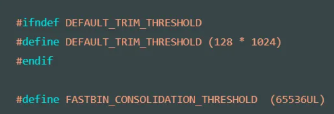

# 堆溢出时各个bins的范围
- 详见 pwn堆溢出各个bins的范围 - husterlong - 博客园 (2023_3_28 16_38_30).html

pwn堆溢出各个bins的范围，总是忘记，这里记录一下，以儆效尤！！！！！！

malloc_chunk的对齐属性
- 在glibc中，malloc_chunk以 2*sizeof(size_t)对齐，在32位系统中以8字节对齐，在64位系统中一般以16字节对齐。Malloc_chunk的定义如下：
- 既然malloc_chunk以2*sizeof(size_t)对齐，那么malloc返回给用户的指针数值也是以2*sizeof(size_t)对齐。

Glibc中最小的chunk是多大呢？
- 最小的chunk需要保证能放下prev_size、size、fd以及bk字段并保证对齐。在32位系统中，即16字节，在64位系统中，一般为32字节。在64位系统中也可能定义INTERNAL_SIZE_T也即size_t为4字节，这种情况下最小的chunk位24字节。如下：

Fastbin里有多少bin呢？
- 将上面的宏计算出来，会发现NFASTBINS为10，不论32位系统还是64位系统。

Fastbin里chunk的大小范围呢？
- 因此，在32位系统中，fastbin里chunk的大小范围从16到64；在64位系统中，fastbin里chunk的大小范围从32到128。

Small bins里chunk大小范围？有多少bins？
- 在32位系统中，small bins里的chunk大小从16到504字节；在64位系统中，small bins里的chunk大小从32到1016字节。
- 根据small bins里的chunk大小范围以及每个chunk递增的大小得知，small bins里有62个bin。

怎么根据p=malloc(m)里的m来判断分配多大的chunk呢？
- 将申请的内存大小加上每个chunk的overhead，也就是chunk结构体里的size字段。然后对齐，就是需要分配的chunk的大小。
    举个例子：
    在64位系统中，确定chunk的大小为0x88+0x8=0x90。所以每一次申请，都会分配一个大小为0x90的chunk。
    返回的一个chunk大小为0x90，除了pre_size和size，还剩下0x80大小的区域，你会想"什么？我申请了0x88的大小，却返回了一个0x80大小的内存？"其实这些chunk都是虚拟出来的，正常情况下可以使用的内存包括下一个chunk的pre_size字段，所以申请了0x88的大小，还是可以使用到0x88大小的内存的。
本文转载自https://www.cnblogs.com/wangaohui/p/5190889.html，感谢简单地快乐

# https://wiki.wgpsec.org/knowledge/ctf/basicheap.html
- 【PWN】堆基础 _ 狼组安全团队公开知识库 (2023_4_3 17_08_54).html
## bins
- Bins一共可分为fast bin、small bin、large bin、unsorted bin和tcache bin。可分为：10个fast bins，存储在fastbinsY中；1个unsorted bin，存储在bins[1]；62个small bins，存储在bins[2]至bins[63]；63个large bins，存储在bins[64]至bins[126]。其中虽然定义了NBINS=128，但是bins[0]和bins[127]其实是不存在的。
- 第一个为 unsorted bin，字如其面，这里面的 chunk 没有进行排序，存储的 chunk 比较杂。
- 索引从 2 到 63 的 bin 称为 small bin，同一个 small bin 链表中的 chunk 的大小相同。两个相邻索引的 small bin 链表中的 chunk 大小相差的字节数为 2 个机器字长，即 32 位相差 8 字节，64 位相差 16 字节。
- small bins 后面的 bin 被称作 large bins。large bins 中的每一个 bin 都包含一定范围内的 chunk，其中的 chunk 按 fd 指针的顺序从大到小排列。相同大小的 chunk 同样按照最近使用顺序排列。
- 

## fastbin
Fast bins非常像高速缓存cache，主要用于提高小内存分配效率。相邻空闲chunk不会被合并，这会导致内存碎片增多但是free效率提升。注意：fast bins时10个LIFO的单链表，最后三个链表保留未使用。

默认情况下，对于 SIZE_SZ 为 4B 的平台， 小于 64B 的 chunk 分配请求，对于 SIZE_SZ 为 8B 的平台，小于 128B 的 chunk 分配请求，首先会查找fast bins中是否有所需大小的chunk存在（精确匹配），如果存在，就直接返回。

Fast bin的chunk 大小（含 chunk 头部）：0x10-0x40（64 位 0x20-0x80）B，相邻 bin 存放的大小相差 0x8（0x10）B。总结以下特点。

fastbinsY[]，fast bin存放在此数组中

单向链表

LIFO（last in first out，当下次malloc大小与这次free大小相同时，会从相同的bin取出，也就是会取到相同位置的chunk）

管理 16、24、32、40、48、56、64 Bytes 的 free chunks（32位下默认）

其中的chunk的in_use位（下一个物理相邻的chunk的P位）总为1。也就是说，释放到fastbin的chunk不会被清除in_use标志位。

关于fastbin最大大小参见宏DEFAULT_MXFAST:

在初始化时，这个值会被复制给全局变量global_max_fast。申请fast chunk时遵循first fit原则。释放一个fast chunk时，首先检查它的大小以及对应fastbin此时的第一个chunk的大小是否合法，随后它会被插入到对应fastbin的链表头，此时其fd指向上一个被free的chunk。

Fast bin示意图如下

## Unsorted bin
Unsorted bin非常像缓冲区buffer，大小超过fast bins阈值的chunk被释放时会加入到这里，这使得ptmalloc2可以复用最近释放的chunk，从而提升效率。

所有的大小超过fast bins阈值的 chunk 在回收时都要先放到 unsorted bin中，分配时，如果在 unsorted bin 中没有合适的 chunk，就会把 unsorted bin 中的所有 chunk分别加入到所属的 bin 中，然后再在 bin 中分配合适的 chunk。Bins 数组中的元素 bin[1]用于存储 unsorted bin 的 chunk 链表头。

它是一个双向循环链表，chunk大小大于global_max_fast。

当程序申请大于global_max_fast内存时，glibc会遍历unsorted bin，每次取最后的一个unsorted bin。

如果 unsorted chunk 满足以下四个条件，它就会被切割为一块满足申请大小的 chunk 和另一块剩下的 chunk，前者返回给程序，后者重新回到 unsorted bin。

申请大小属于 small bin 范围

unosrted bin 中只有该 chunk

这个 chunk 同样也是 last remainder chunk

切割之后的大小依然可以作为一个 chunk

否则，从 unsorted bin 中删除 unsorted chunk。

若 unsorted chunk 恰好和申请大小相同，则直接返回这个 chunk

若 unsorted chunk 属于 small bin 范围，插入到相应 small bin

若 unsorted chunk 属于 large bin 范围，则跳转到 3。

此时 unsorted chunk 属于 large bin 范围。

若对应 large bin 为空，直接插入 unsorted chunk，其 fd_nextsize 与 bk_nextsize 指向自身。

否则，跳转到 4。

到这一步，我们需按大小降序插入对应 large bin。

若对应 large bin 最后一个 chunk 大于 unsorted chunk，则插入到最后

否则，从对应 large bin 第一个 chunk 开始，沿 fd_nextsize（即变小）方向遍历，直到找到一个 chunk 命名为c，其大小小于等于 unsorted chunk 的大小

若c大小等于unsorted chunk大小，则插入到c后面

否则，插入到c前面

直到找到满足要求的unsorted chunk，或无法找到，去top chunk切割为止。总结以下特点。

双向循环链表

当free的chunk大小大于等于144字节时，为了效率，glibc并不会马上将chunk放到相对应的bin中，而会先放到unsorted bin

而下次mallocs时将会先找找看unsorted bin中是否有合适的chunk，找不到才会去对应的bin中寻找，此时会顺便把unsorted bin的chunk放到对应的bin中，但small bin除外，为了效率，反⽽而先从small bin找

Unsorted bin的示意图如下。

## Small bins
Small bins，chunk size小于0x200（64位下0x400）字节的chunk叫做small chunk，而small bins存放的就是这些small chunk。Chunk大小同样是从16字节开始每次+8字节。

small bins 是 62 个双向循环链表，并且是 FIFO 的，这点和 fast bins 相反。同样相反的是相邻的空闲 chunk 会被合并。chunk大小：0x10-0x1f0字节（64位下0x20-0x3f0），相邻bin存放的大小相差0x8（0x10）字节。

ptmalloc 维护了 62 个双向环形链表（每个链表都具有链表头节点，加头节点的最大作用就是便于对链表内节点的统一处理，即简化编程），每一个链表内的各空闲 chunk 的大小一致，因此当应用程序需要分配某个字节大小的内存空间时直接在对应的链表内取就可以了，这样既可以很好的满足应用程序的内存空间申请请求而又不会出现太多的内存碎片。

释放非 fast chunk 时，按以下步骤执行：

若前一个相邻chunk空闲，则合并，触发对前一个相邻 chunk的unlink操作

若下一个相邻chunk是top chunk，则合并并结束；否则继续执行 3

若下一个相邻 chunk 空闲，则合并，触发对下一个相邻chunk的unlink 操作；否则，设置下一个相邻 chunk 的 PREV_INUSE 为 0

将现在的chunk插入unsorted bin。

若size超过了FASTBIN_CONSOLIDATION_THRESHOLD，则尽可能地合并 fastbin中的chunk，放入unsorted bin。若top chunk大小超过了 mp_.trim_threshold，则归还部分内存给 OS。

​总结有以下特点。

双向循环链表

Chunk size < 0x400 byte（64位）

FIFO

根据大小再分成62个大小不同的bin

0x20,0x30…0x60,0x70…

Small bins图示如下。

## Large bins 
Large bins存放的是大于等于0x200（64位下0x400）字节的chunk，它是63个双向循环链表，插入和删除可以发生在任意位置，相邻空闲chunk也会被合并。Chunk大小就比较复杂了：

前32个bins：从0x400字节开始每次+0x40字节

接下来的16个bins：每次+0x200字节

接下来的8个bins：每次+0x1000字节

接下来的4个bins：每次+0x8000字节

接下来的2个bins：每次+0x40000字节

最后的1个bin：只有一个chunk，大小和large bins剩余的大小相同

同一个bin中的chunks不是相同大小的，按大小降序排列。这和上面的几种 bins都不一样。而在取出chunk时，也遵循best fit原则，取出满足大小的最小 chunk。总结以下特点。

双向循环链表（排好序了）

Chunk size > 0x400

Freed chunk多两个指针fd_nextsize、bk_nextsize指向前一块和后一块large chunk

根据大小再分成63个bin但大小不再是固定大小增加

前32个bin为0x400+0x40*i

32~48bin为0x1380+0x200*i

…以此类推

不再是每个bin中的chunk大小都固定，每个bin中存着该范围内不同大小的bin并在过程中进行排序用来加快寻找的速度，大的chunk会放在前面，小的chunk会放在后面

FIFO

Large bins示意图如下。

## Tcache
Tcache是libc2.26之后引进的一种新机制，类似于fastbin一样的东西，每条链上最多可以有7个chunk，free的时候当tcache满了才放入fastbin或unsorted bin，malloc的时候优先去tcache找。

基本工作方式：

malloc 时，会先 malloc 一块内存用来存放 tcache_perthread_struct 。

free 内存，且 size 小于 small bin size 时

先放到对应的 tcache 中，直到 tcache 被填满（默认是 7 个）

tcache 被填满之后，再次 free 的内存和之前一样被放到 fastbin 或者 unsorted bin 中

tcache 中的 chunk 不会合并（不取消 inuse bit）

malloc 内存，且 size 在 tcache 范围内

先从 tcache 取 chunk，直到 tcache 为空
tcache 为空后，从 bin 中找
tcache 为空时，如果 fastbin/smallbin/unsorted bin 中有 size 符合的 chunk，会先把 fastbin/smallbin/unsorted bin 中的 chunk 放到 tcache 中，直到填满。之后再从 tcache 中取；因此 chunk 在 bin 中和 tcache 中的顺序会反过来