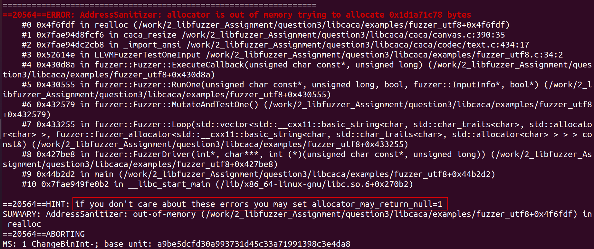
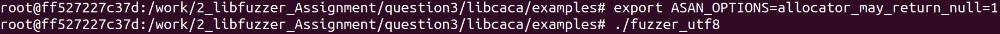
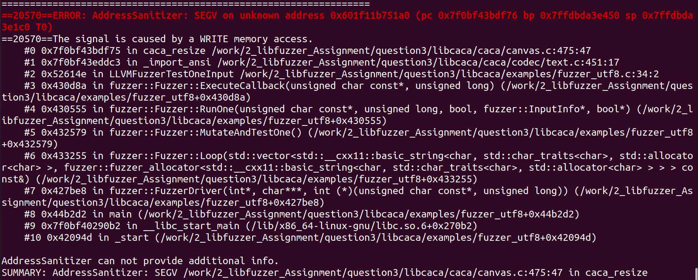
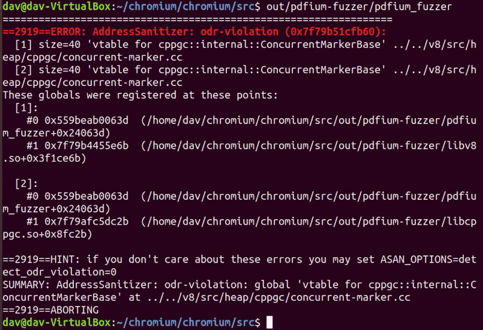

ASAN_yunlianglinfeng的专栏-CSDN博客_asan
https://blog.csdn.net/yunlianglinfeng/article/details/106639516

Linux下内存检测工具：asan【转】_biqioso的博客-CSDN博客
https://blog.csdn.net/biqioso/article/details/82875310
# 忽略由于申请较大堆内存从而导致的ASAN报错：allocator_may_return_null=1
运行fuzer（带address sanitizer，及ASAN），输出显示程序申请了0x1d1a71c78字节内存，换算下来大约7gb，注意此时程序并未崩溃，仅仅是realloc程序申请较大内存块失败，从而导致realloc返回null，而该过程被ASAN捕获。此时提示信息显示，如果想忽略该问题（及内存申请函数realloc申请内存失败返回0），可以设置allocator_may_return_null=1

根据查阅资料发现 ASAN作为linux下提供的内存泄露检测工具，可以通过修改环境变量改变ASAN检测逻辑，通过执行 export ASAN_OPTION=allocator_may_return_null=1 修改环境变量之后重新运行fuzzer

重新运行fuzzer后，程序由于引用未分配内存而崩溃，而崩溃位置位于之前realloc申请内存失败位置的附近，说明当前错误可能是之前realloc申请内存失败引起的


此时的crash文件
./crash-35e667082b8dd0cf38d7602ad74105bd84b4c637
# 忽略ASAN的odr-violation报错：ASAN_OPTIONS = detect_odr_violation = 0
ASAN_OPTIONS=detect_odr_violation=0的设置用于忽略如下错误，该错误在fuzzing chrome过程中很常见


请注意，我们还必须传递选项ASAN_OPTIONS = detect_odr_violation = 0，因为否则运行我们时，模糊器会抱怨。
```bash
$ mkdir Corpus
$ ASAN_OPTIONS=detect_odr_violation=0 ./out/pdfium-fuzzer/pdfium_fuzzer ./Corpus/
INFO: Seed: 629343114
INFO: Loaded 11 modules   (713051 inline 8-bit counters): 14299 [0x7fadab5362b0, 0x7fadab539a8b), 2565 [0x7fadaa2ced2b, 0x7fadaa2cf730), 4316 [0x7fadb4383bbb, 0x7fadb4384c97), 3565 [0x7fadb444f9db, 0x7fadb44507c8), 34633 [0x7fadb15e8cdb, 0x7fadb15f1424), 46444 [0x7fadabcbedcb, 0x7fadabcca337), 2370 [0x7fadb44c21ab, 0x7fadb44c2aed), 368077 [0x7fadb0a1500b, 0x7fadb0a6edd8), 57647 [0x7fadb210ffeb,
```


