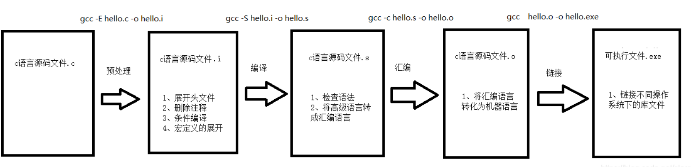

# clang官方文档
https://clang.llvm.org/docs/
# clang参数列表
https://clang.llvm.org/docs/ClangCommandLineReference.html
# clang用户手册（查询具体参数含义时需要与参数列表配套查询）
https://clang.llvm.org/docs/UsersManual.html
# clang编译过程（参数使用上和gcc相同）

- clang编译器参数手册
  - https://clang.llvm.org/docs/ClangCommandLineReference.html
- 直接使用如下命令查找帮助
  - clang -help
# 常用编译flag
## -I <value>              
- Add directory to include search path，用于指定源码中引用的头文件的位置
## -fprofile-instr-generate -fcoverage-mapping  
- 开启代码覆盖率统计
```bash
if [ $# -eq 0 ]
then
    echo "Please give a filename"
    exit 1
fi

FUZZ_FLAGS="-fsanitize=fuzzer -fprofile-instr-generate -fcoverage-mapping "
clang $FUZZ_FLAGS $1
```
## -g
- 启用调试信息，提升错误消息易读性
- 在编译libfuzzer可执行文件时可以使用
```bash
clang++ -g -fsanitize=address,fuzzer fuzzing/tutorial/libFuzzer/fuzz_me.cc
```
- -g和-O1是gcc/clang的通用选项，前者保留调试信息，使错误消息更易于阅读；后者指定优化等级为1（保守地少量优化），但这两个选项不是必须的。
```bash
clang++ -g -O1 -fsanitize=fuzzer,address -fsanitize-coverage=trace-pc-guard \
fuzz_target.cc ../../libFuzzer/Fuzzer/libFuzzer.a \
-o mytarget_fuzzer
```
## -O
- 用于指定编译优化的等级
- 编译fuzzer时通过提高优化等级，可以提高fuzzer的执行效率，但过高的优化等级可能会导致fuzzer运行问题
- 也可以通过优化编译fuzzing目标，从而提升被fuzz的程序的执行速度，从而提升fuzzing效率
- 部分libfuzzer编译示例使用1或2级的优化等级编译被fuzzing目标
```bash
make CC="clang -O2 -fno-omit-frame-pointer -g -fsanitize=address" -j$(nproc)
```
## -fno-omit-frame-pointer 
- 对于不需要栈指针的函数就不在寄存器中保存指针，因此可以忽略存储和检索地址的代码，同时对许多函数提供一个额外的寄存器。所有”-O”级别都打开它，但仅在调试器可以不依靠栈指针运行时才有效。在AMD64平台上此选项默认打开，但是在x86平台上则默认关闭。建议显式的设置它。
- 该参数可以有效提高程序执行速度，当用其编译fuzzer或被fuzz目标时，可以提高fuzzer效率
```bash
make clean
make CC="clang -O2 -fno-omit-frame-pointer -g -fsanitize=address" -j$(nproc)
```
# 编译器中-std和-stdlib含义
## -std= <c++11/gnu++11/c99>
- -std指编译器编译时采用的C/C++标准，用哪种标准进行编译。
- -std=  c++11，支持C++11标准； -std=gnu++11，支持C++11标准和GNU扩展特性；-std=c99开启c语言c99支持； -std=c11开启c语言c11库的支持；
示例命令
```bash
clang++ -g -std=c++11 -fsanitize=fuzzer,address first_fuzzer.cc ../../libFuzzer/Fuzzer/libFuzzer.a -o first_fuzzer
```
- 在编译不同项目时(甚至同一项目不同版本)，项目所使用的c语言标准版本不一样，故需要通过指定该flag从而确定对应的c语言规范版本，使用std=gnu++98
- 例如编译re2正则表达式库时，使用c++98标准的c语言，故编译指令如下
```bash
clang++ -O2 -fno-omit-frame-pointer -gline-tables-only -fsanitize=address,fuzzer-no-link -fsanitize-address-use-after-scope -std=gnu++98 target.cc -I re2/ re2/obj/libre2.a -fsanitize=fuzzer -o re2_fuzzer
```
## -stdlib= <libstdc++/libc++>
- stdlib指编译器编译时依赖的标准库。
- gcc编译器没有-stdlib这样命令行选项，LLVM clang编译器支持，这是因为clang为您提供链接LLVM标准C ++库（ libc ++ ）或GNU标准C ++库（ libstdc ++ ），而gcc只支持 libstdc ++。简单说就是两个都是 C++ 标准库，libc++ 是针对 Clang 编译器特别重写的 C++ 标准库，而 libstdc++ 则是 GCC 的对应 C++ 标准库。
- 随着 Android P 的逐步应用，越来越多的客户要求编译库时用 libc++ 来代替 libstdc++。libc++ 和 libstdc++ 这两个库有关系呢？它们两个都是 C++ 标准库，libc++ 是针对 Clang 编译器特别重写的 C++ 标准库，而 libstdc++ 则是 GCC 的对应 C++ 标准库了。从 Android 市场来说，Android NDK 已在具体应用中放弃了 GCC，全面转向 Clang
## 实例
- 编译程序范例指定CXXFLAGS = -std=c++11 -stdlib=libstdc++
- 链接时使用静态主机OpenMP例程
  - export CXXFLAGS="-fsanitize=fuzzer-no-link,address -stdlib=libc++"
# 在clang中使用lbfuzzer的两种方法
- 除了在编译过程中使用-fsanitize = fuzzer从而指定使用libfuzz，也可以将目标代码链接到/usr/lib/libFuzzingEngine.a中从而使用libfuzzer，只不过前者性能更好，将目标代码链接到静态库文件相关操作见libfuzzer学习工坊。
# OSS-fuzz项目中指定libfuzzer对目标进行fuzzing
- export LIB_FUZZING_ENGINE="-fsanitize=fuzzer"
- 该环境变量常在OSS-fuzz项目中用于指定使用libfuzzer对项目进行fuzzing
- https://github.com/google/oss-fuzz/issues/2317