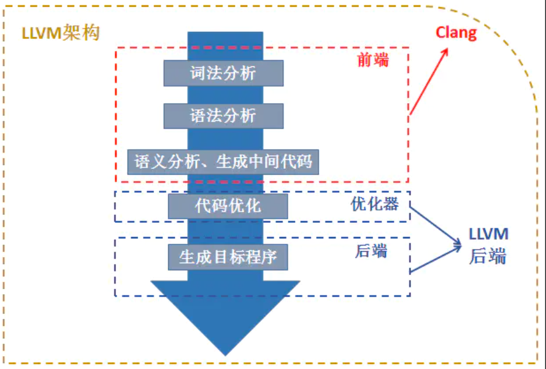

# 简而言之，clang是编译器的前端，llvm是编译器的后端，两者一同组成的编译器整体架构
https://www.jianshu.com/p/474c03647784

LLVM与Clang的概述及关系

LLVM是构架编译器(compiler)的框架系统，以C++编写而成，用于优化以任意程序语言编写的程序的编译时间(compile-time)、链接时间(link-time)、运行时间(run-time)以及空闲时间(idle-time)，对开发者保持开放，并兼容已有脚本。LLVM计划启动于2000年，最初由University of Illinois at Urbana-Champaign的Chris Lattner主持开展。2006年Chris Lattner加盟Apple Inc.并致力于LLVM在Apple开发体系中的应用。Apple也是LLVM计划的主要资助者。

我们可以认为LLVM是一个完整的编译器架构，也可以认为它是一个用于开发编译器、解释器相关的库。

在理解LLVM时，我们可以认为它包括了一个狭义的LLVM和一个广义的LLVM。广义的LLVM其实就是指整个LLVM编译器架构，包括了前端、后端、优化器、众多的库函数以及很多的模块；而狭义的LLVM其实就是聚焦于编译器后端功能（代码生成、代码优化、JIT等）的一系列模块和库。

接下来，简要的介绍一下Clang。

Clang是一个C++编写、基于LLVM、发布于LLVM BSD许可证下的C/C++/Objective-C/Objective-C++编译器。那么为什么已经有了GCC还要开发Clang呢？Clang相比于GCC有什么优势呢？

其实，这也是Clang当初在设计开发的时候所主要考虑的原因。Clang是一个高度模块化开发的轻量级编译器，它的编译速度快、占用内存小、非常方便进行二次开发。

最后，我们大概讲一讲LLVM和Clang的关系。我们将它们对应于传统的编译器当中的几个独立的部分，这样能够更加方便明确生动的表述。

传统编译器基本分为三段式，前端、优化器和后端。

- 前端负责解析源代码，检查语法错误，并将其翻译为抽象的语法树；
- 优化器对这一中间代码进行优化，试图使代码更高效；
- 后端则负责将优化器优化后的中间代码转换为目标机器的代码，这一过程后端会最大化的利用目标机器的特殊指令，以提高代码的性能

其实，对应到这个图中，我们就可以非常明确的找出它们的对应关系。Clang其实大致上可以对应到编译器的前端，主要处理一些和具体机器无关的针对语言的分析操作；编译器的优化器部分和后端部分其实就是我们之前谈到的LLVM后端（狭义的LLVM）；而整体的Compiler架构就是LLVM架构。

