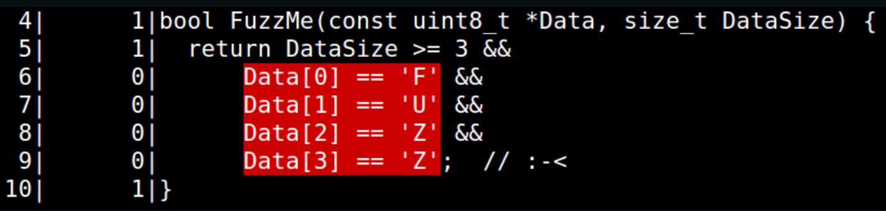
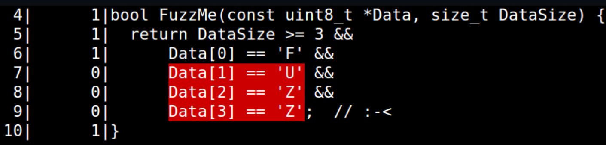
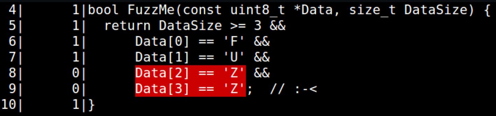
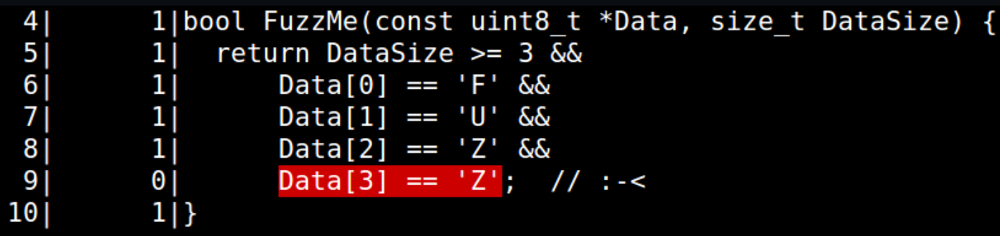
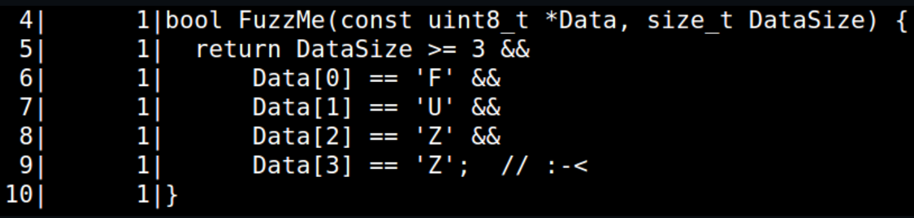

- 文档：https://github.com/google/fuzzing/tree/master/docs
- 教程：https://github.com/google/fuzzing/tree/master/tutorial
# 使用谷歌云服务（GCE）配置虚拟机，从而运行libfuzzer
https://cloud.google.com/compute/
# libfuzzer输出内容解析
```bash
INFO: Seed: 3918206239
INFO: Loaded 1 modules (14 guards): [0x73be00, 0x73be38),
INFO: Loaded 1 PC tables (7 PCs): 7 [0x52f8c8,0x52f938),
INFO: -max_len is not provided; libFuzzer will not generate inputs larger than 4096 bytes
INFO: A corpus is not provided, starting from an empty corpus
#0      READ units: 1
#1      INITED cov: 3 ft: 3 corp: 1/1b exec/s: 0 rss: 26Mb
#8      NEW    cov: 4 ft: 4 corp: 2/29b exec/s: 0 rss: 26Mb L: 28 MS: 2 InsertByte-InsertRepeatedBytes-
#3405   NEW    cov: 5 ft: 5 corp: 3/82b exec/s: 0 rss: 27Mb L: 53 MS: 4 InsertByte-EraseBytes-...
#8664   NEW    cov: 6 ft: 6 corp: 4/141b exec/s: 0 rss: 27Mb L: 59 MS: 3 CrossOver-EraseBytes-...
#272167 NEW    cov: 7 ft: 7 corp: 5/201b exec/s: 0 rss: 51Mb L: 60 MS: 1 InsertByte-
=================================================================
==2335==ERROR: AddressSanitizer: heap-buffer-overflow on address 0x602000155c13 at pc 0x0000004ee637...
READ of size 1 at 0x602000155c13 thread T0
    #0 0x4ee636 in FuzzMe(unsigned char const*, unsigned long) fuzzing/tutorial/libFuzzer/fuzz_me.cc:10:7
    #1 0x4ee6aa in LLVMFuzzerTestOneInput fuzzing/tutorial/libFuzzer/fuzz_me.cc:14:3
...
artifact_prefix='./'; Test unit written to ./crash-0eb8e4ed029b774d80f2b66408203801cb982a60
...
```
## INFO: Seed: 3918206239
模糊器已从此随机种子开始。 使用-seed = 3918206239重新运行它以获得相同的结果。
## INFO: -max_len is not provided; libFuzzer will not generate inputs larger than 4096 bytes
## INFO: A corpus is not provided, starting from an empty corpus
默认情况下，libFuzzer假定所有输入均为4096字节或更小。 要更改该值，请使用-max_len = N或与非空种子语料库一起运行。
## #272167 NEW    cov: 7 ft: 7 corp: 5/201b exec/s: 0 rss: 51Mb L: 60 MS: 1 InsertByte-
libFuzzer尝试了至少272167个输入（＃272167），并发现了总共201个字节的5个输入（corp：5 / 201b），这些输入共同覆盖了7个覆盖点（cov：7）。 您可能将覆盖点视为代码中的基本块。
# 并行fuzz
- 提高模糊测试效率的另一种方法是使用更多的CPU。 如果使用-jobs = N运行模糊器，它将生成N个独立的作业，但最多不超过您拥有的内核数的一半； 使用-workers = M设置允许的并行作业数。
``` bash
cd ~/woff
./woff2-2016-05-06-fsanitize_fuzzer MY_CORPUS/ seeds/ -jobs=8
```
- 在8核计算机上，这将产生4个并行工作器。 如果其中一个死亡，则将创建另一个，最多8个。
```bash
Running 4 workers
./woff2-2016-05-06-fsanitize_fuzzer MY_CORPUS/ seeds/  > fuzz-0.log 2>&1
./woff2-2016-05-06-fsanitize_fuzzer MY_CORPUS/ seeds/  > fuzz-1.log 2>&1
./woff2-2016-05-06-fsanitize_fuzzer MY_CORPUS/ seeds/  > fuzz-2.log 2>&1
./woff2-2016-05-06-fsanitize_fuzzer MY_CORPUS/ seeds/  > fuzz-3.log 2>&1
```
- 这时，拥有一些终端多路复用器（例如，多路复用器）将很方便。例如GNU screen，或只是打开另一个终端窗口。让我们看一下其中一个日志文件fuzz-3.log。 您将看到以下行： 
- #17634  RELOAD cov: 864 ft: 2555 corp: 340/20Mb exec/s: 979 rss: 408Mb
- 这样的行表明，此模糊器实例已重新加载了主体（仅重新加载了第一个目录），并发现了由其他实例创建的一些有趣的新输入。
- 如果您持续运行此目标一段时间（在撰写本文时：在4-8个内核上为20-60分钟），您将获得一个不错的安全漏洞的奖励。
- 如果您既急躁又好奇，则可以使用提供的崩溃复制器来查看错误：
- ./woff2-2016-05-06-fsanitize_fuzzer ../FTS/woff2-2016-05-06/crash-696cb49b6d7f63e153a6605f00aceb0d7738971a
## -jobs与-workers联合使用
```bash
mkdir CORPUS
./libxml2-v2.9.2-fsanitize_fuzzer -dict=afl/dictionaries/xml.dict -jobs=8 -workers=8 CORPUS
```
# 字典
afl中自带字典，且可以与libfuzzer通用
# 交叉检查
fuzzing可以用于针对函数预期输出进行检查，例如，两函数预期输出一样，可以使用fuzzer给两个函数相同的输入，从而验证两函数输出是否的确一致，从而验证函数正确性
# 条件竞争漏洞
有时，目标中只有一个浅的（容易发现的）错误，使您无法发现更多的错误。 在这种情况下，最好的方法是修复较浅的错误并重新开始模糊测试。 但是，只需多次重新启动libFuzzer，您就可以前进一点。  -jobs = 1000将为您完成此任务。
```bash
mkdir -p ~/pcre2 ; rm -rf ~/pcre2/*; cd ~/pcre2
~/FTS/pcre2-10.00/build.sh
mkdir CORPUS
./pcre2-10.00-fsanitize_fuzzer -jobs=1000 -workers=8 CORPUS
```
一两分钟后，在日志文件中查找错误：
```bash
grep ERROR *.log | sort -k 3
```
您会经常看到一个bug（哪个？），但偶尔也会出现。
# 将导致崩溃的输入最小化
尝试迭代10000次从而将导致crash的输入最小化，使用-minimize_crash -runs两个参数
```bash
cd ~/openssl-1.0.2d
./openssl-1.0.2d-fsanitize_fuzzer \
  -minimize_crash=1 -runs=10000 \
  ~/FTS/openssl-1.0.2d/crash-12ae1af0c82252420b5f780bc9ed48d3ba05109e
```
# 覆盖率可视化
- 建议使用Clang Coverage可视化并研究您的代码覆盖率
- https://clang.llvm.org/docs/SourceBasedCodeCoverage.html
```bash
# Build you code for Clang Coverage; link it against a standalone driver for running fuzz targets.
svn co http://llvm.org/svn/llvm-project/compiler-rt/trunk/lib/fuzzer Fuzzer
clang -fprofile-instr-generate -fcoverage-mapping ~/fuzzing/tutorial/libFuzzer/fuzz_me.cc \
                                                  ~/Fuzzer/standalone/StandaloneFuzzTargetMain.c
mkdir CORPUS # Create an empty corpus dir.
```
```bash
echo -n A > CORPUS/A && ./a.out CORPUS/* && \
             llvm-profdata merge -sparse *.profraw -o default.profdata && \
             llvm-cov show a.out -instr-profile=default.profdata -name=FuzzMe
```

```bash
echo -n AAA > CORPUS/AAA && ./a.out CORPUS/* && ... 
```

```bash
echo -n FAA > CORPUS/FAA && ./a.out CORPUS/* && ... 
```

```bash
echo -n FUA > CORPUS/FUA && ./a.out CORPUS/* && ... 
```

```bash
echo -n FUZA > CORPUS/FUZA && ./a.out CORPUS/* && ... 
```

# sanitizer
- AddressSanitizer不是唯一可以与模糊测试结合使用的动态测试工具。 至少尝试UBSan。 例如，将-fsanitize = signed-integer-overflow -fno-sanitize-recover = all添加到pcre2基准测试的构建标志中，并进行更多的模糊测试。 您将看到如下报告：
```bash
src/pcre2_compile.c:5506:19: runtime error: signed integer overflow: 1111111411 * 10 cannot be represented in type 'int'
```
- 在某些情况下，您可能希望不使用任何其他工具（例如消毒剂）来进行模糊测试。 这将使您仅查找最简单的错误（空引用，断言失败），但运行速度更快。 稍后，您可以在生成的语料库上运行经过清理的版本以查找更多错误。 不利的一面是，您可能会以这种方式错过一些错误。
- -fno-sanitize-recover = all该flag具体用途有待进一步确定
# 其他fuzzing引擎
- 部分模糊目标中没有任何东西使它们与libFuzzer绑定在一起-只有一个函数将字节数组作为参数。 因此，用不同的其他模糊测试引擎对相同的目标进行模糊测试是可能的，甚至是希望的。
- 例如，您可以使用其他引导性模糊测试引擎（例如AFL（指令）或honggfuzz）使目标模糊。 甚至尝试其他方法，例如无指导的测试突变（例如，使用Radamsa）。
- 当使用多个模糊测试引擎时，请确保在引擎之间交换语料库-这样，引擎将互相帮助。 您可以使用libFuzzer的-merge =标志进行操作。
# 分布式模糊测试
- 如果我想在一个特定目标上使用大量CPU进行fuzzing，而不是仅限于单个虚拟机fuzzing，该怎么办？ 这很容易：您可以将语料库存储在某个云存储系统上并来回同步。
- 示例（使用GCS）：
  - 创建GCE VM时，请确保已使用“允许对所有Cloud API的完全访问权限”。 如果没有，请创建一个新的VM。
  - （在浏览器中）转到https://console.cloud.google.com/storage并创建一个新存储桶（将其命名为$ GCS_BUCKET）
  - 在您的云存储桶中创建一个名为CORPUS的目录： 
```bash
touch EMPTY_FILE; gsutil cp EMPTY_FILE  gs://$GCS_BUCKET/CORPUS/
```
  - （在浏览器中）单击“刷新”，确认您看到其中包含EMPTY_FILE的新目录。
  - 创建一个名为CORPUS的本地目录，并进行一些模糊处理：
```bash
cd ~/pcre2
mkdir CORPUS
./pcre2-10.00-fsanitize_fuzzer CORPUS/ -runs=10000
```
  - 现在，CORPUS有一些文件。 将其与云目录同步：
```bash
gsutil -m rsync  CORPUS  gs://$GCS_BUCKET/CORPUS/
```
  - 检查您是否可以看到新文件：
```bash
gsutil ls gs://$GCS_BUCKET/CORPUS/
```
  - 恭喜，您已经将语料库保存到了云存储中。 但这并不是所有的乐趣。 现在，您可以将其同步回本地磁盘，然后再次进行模糊测试。
```bash
gsutil -m rsync  gs://$GCS_BUCKET/CORPUS/ CORPUS
```
  - 如果多个VM同时执行此操作，则将出现分布式模糊测试。
  - 在实践中，这要稍微复杂一些。 如果您盲目地同步工作人员之间的语料库，则语料库可能会增长到难以管理的大小。 最简单的建议是首先在单台计算机上进行模糊测试，然后最小化语料库，将其上传到云中，然后才在许多VM上开始进行模糊测试。 更好的是定期最小化语料库并在云中对其进行更新。
# 持续fuzzing
  - 一次性的模糊测试可能会发现一些错误，但是除非您使模糊测试过程连续进行，否则这将是一种浪费。
  - 一个简单的连续模糊测试系统可以用少于100行的bash代码编写。 在无限循环中执行以下操作： 
    - 拉取目标代码的当前版本
    - 构建fuzzing
    - 将语料库从云端复制到本地磁盘
    - fuzzing若干次
      - 对于libFuzzer，使用标志-max_total_time = N设置时间（以秒为单位）。
    - 将更新后的语料库同步回云中
    - 通过电子邮件，Web界面或云存储提供日志，覆盖率信息，崩溃报告和崩溃重现器。
# 可能的报错
- 目标代码的某些功能（或错误）可能会使模糊处理变得复杂，并向您隐藏其他错误。
## OOM
- 内存不足（OOM）错误极大地减慢了进程内模糊测试的速度。 默认情况下，libFuzzer将每个进程的RAM数量限制为2Gb。
  - 尝试用空的种子语料模糊woff基准： 
```bash
cd ~/woff
mkdir NEW_CORPUS
./woff2-2016-05-06-fsanitize_fuzzer NEW_CORPUS -jobs=8 -workers=8
```
  - 很快，您将遇到一个OOM错误：
```bash
==30135== ERROR: libFuzzer: out-of-memory (used: 2349Mb; limit: 2048Mb)
   To change the out-of-memory limit use -rss_limit_mb=<N>

   Live Heap Allocations: 3749936468 bytes from 2254 allocations; showing top 95%
   3747609600 byte(s) (99%) in 1 allocation(s)
   ...
   #6 0x62e8f6 in woff2::ConvertWOFF2ToTTF src/woff2_dec.cc:1274
   #7 0x660731 in LLVMFuzzerTestOneInput FTS/woff2-2016-05-06/target.cc:13:3
```
- 基准目录还包含OOM错误的复制器。 找到它。 您可以复制OOM吗？
- 有时，每个目标调用使用2Gb并不是一个错误，因此您可以使用-rss_limit_mb = N设置另一个限制。
## Leaks
- 内存泄漏本身就是错误，但是如果未被发现，则会在进程模糊过程中导致OOM。
- 当与AddressSanitizer或LeakSanitizer结合使用时，libFuzzer将尝试在每次执行输入后立即查找泄漏。 如果发现泄漏，libFuzzer将打印警告，将复制器保存在磁盘上并退出。
- 但是，并非所有泄漏都是很容易检测到的，因此，如果逃避了LeakSanitizer，libFuzzer最终将因OOM而结束（请参见上文）。
## Timeouts
超时对于进程内的模糊测试同样不利。 如果某些输入花费了1200多秒钟来运行libFuzzer，它将报告“超时”错误并退出，从而将复制器转储到磁盘上。 您可以使用-timeout = N更改默认超时。
## Slow inputs
libFuzzer区分慢速输入和非常慢的输入。 速度很慢的输入将导致超时失败，而在运行过程中将报告速度很慢（复制器已转储到磁盘上），但不会导致进程退出。 使用-report_slow_units = N可以为慢速单位设置阈值。
## 进阶主题
结构感知类fuzz：https://github.com/google/fuzzing/blob/master/docs/structure-aware-fuzzing.md