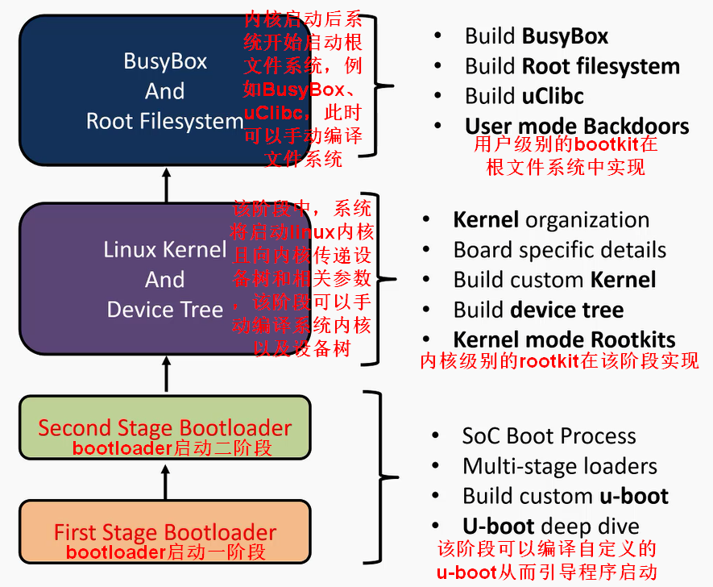
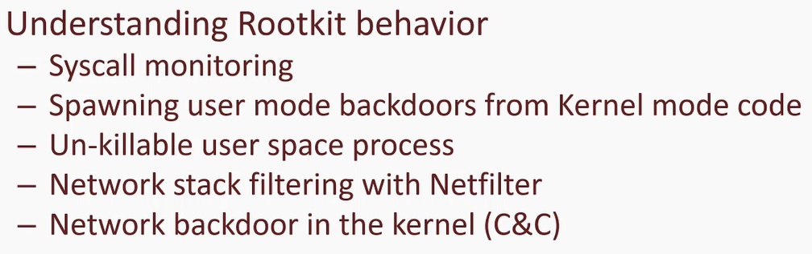
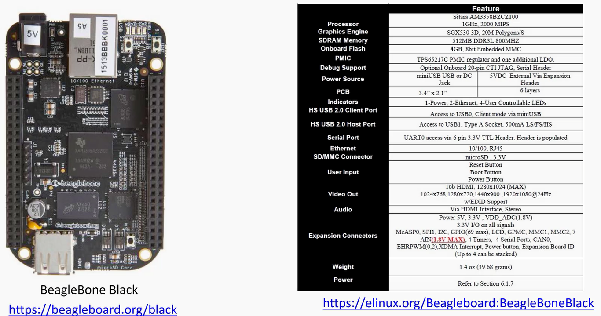

# 嵌入式linux启动过程

# kernel rootkit的相关行为

# 课程所需硬件

- https://beagleboard.org/black
- https://elinux.org/Beagleboard:BeagleBoneBlack
- BeagleBone Black相关资料下载
  - https://cebbs.iceasy.com/thread-9659-1-1.html?utm_source=tmall
- 官网
  - https://beagleboard.org/black/
- BeagleBone Black处理器手册
  - https://www.ti.com/product/AM3358?qgpn=am3358
# 课程官方网站
https://www.pentesteracademy.com/