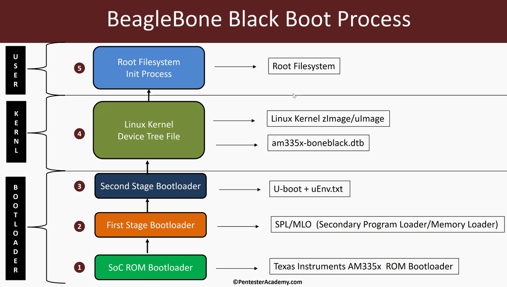
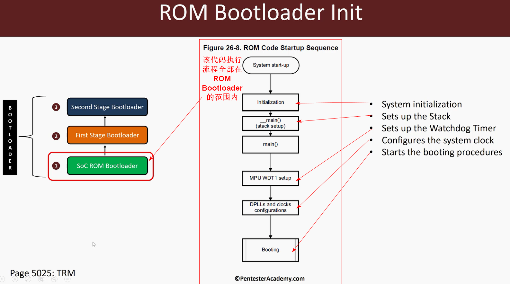

# 从嵌入式设备角度理解linux引导过程

## bootloader阶段

- 设备上电，首先将设备控制权转移到重置向量（reset vector）中，重置向量是设备制造商预先编程到电路板上的
- 控制权转移到ROM bootloader中，其任务是对硬件进行一些基本设置，之后ROM bootloader从boot device中找到第一阶段的bootloader，（该boot device即存储着bootloader的设备，可以位于网络、内存总线、sd卡等位置，即可能有多个boot device）
- ROM bootloader从boot device中找到第一阶段的bootloader后，将第一阶段boot loader加载到SoC内部的内存(RAM)，并将控制权转移给第一阶段boot loader
- 第一阶段boot loader会继续获取第二阶段boot loader，并将第二阶段boot loader加载到外部RAM中，将控制权转移到第二阶段boot loader
- ***注意:此处控制权转移的概念和函数调用不同，控制权转移后前一个程序将不复存在，仅剩后一个程序继续运行，而函数调用中，被调用函数执行完毕后将返回调用程序中继续执行***
- ***bootloader具体有几个阶段取决于设备的嵌入式系统架构，可以仅有一个阶段，也可以有多个阶段
## kernel阶段

- 第二阶段的bootloader读取相应配置信息，该配置信息可以是静态嵌入的，也可以是某种外部配置文件，之后第二阶段的bootloader将linux内核以及设备树加载到RAM中
- 第二阶段的bootloader根据获得的配置信息，启动内核，并将启动参数（boot argument）传递给内核，此后内核启动，第二阶段的bootloader结束
- 设备树文件本质上是一个枚举文件，该文件对所有无法被发现的设备进行枚举，并包含如何启动该设备、如何给该设备供电等相关配置信息
## filesystem阶段

- 内核启动后会将各个硬件组件初始化，之后根据二阶段bootloader传递的启动参数（boot argument）定位并挂起根文件系统
- 根文件系统挂载完毕后，内核在根文件系统中搜索并启动init进程，init进程为第一个用户态进程，pid为0，init进程运行起来后会定位并读取配置文件，从而启动其他用户态进程
# BeagleBone Black的启动过程
## BeagleBone Black相关资料下载
- https://cebbs.iceasy.com/thread-9659-1-1.html?utm_source=tmall
- 官网：https://beagleboard.org/black/
## BeagleBone Black的处理器手册
- https://www.ti.com/product/AM3358?qgpn=am3358
- 处理器手册中有的涉及硬件部分，有的涉及软件部分，软件开发的相关手册涉及TRM（Technical Reference Manual）
  - 
## 处理器结构框图（注意此时板上所谓处理器是指包含运算处理部分的soc整体，而非单纯的cpu）
- 
- 根据框图可知，soc内部的处理器rom仅为176KB，ram仅为128KB
## 处理器内存映射图
- 
- 根据处理器的内存映射图，发现Boot ROM部分大小为128+48=176KB，与硬件标识的176KB相符，该部分即设备启动后重置向量（reset vector）执行完毕后，一阶段bootloader存储与执行的位置
## 处理器boot rom启动架构
- 
- 即处理器176KB的rom中所存储的代码的架构以及实现的功能
- FAT表示支持rom中的bootloader代码支持fat文件系统
- BOOTP TFTP表示rom中的bootloader代码支持通过网络进行boot启动
- UART表示支持uart串口调试
- XIP表示execute in place，即支持相关代码在其所存储的位置进行执行，即代码直接在rom执行，无需拷贝到ram中进行执行
- MMC/SD cards表示bootloader代码支持sd卡存储介质的执行 
## 处理器启动方式（主要资料查看trm的初始化部分）
- 
- 该处理器支持两种bootloader，第一种为安全启动的bootloader，该bootloader必须经过数字签名认证且bootloader执行过程中会检查该数字签名，若数字签名不符，则bootloader无法执行，即存在可信启动过程。第二种为普通bootloader，该bootloader不进行该安全检查
- 两种bootloader的镜像格式有所不同
## 处理器启动过程

- SoC ROM Bootloader阶段：运行位于处理器内部ROM中的bootloaerd代码，处理器内部ROM大小仅为176KB，该bootloader代码在boot device中找到第一阶段的bootloader，并将其加载到处理器内部RAM(128KB)中，并将执行权限转移给第一阶段bootloader
- First Stage Bootloader阶段：第一阶段bootloader存储在boot device中，在本例中，即存储在sd卡中。第一阶段bootloader可能为SPL(secondary program loader)或MLO(memory loader)，该bootloader用于引导启动第二阶段bootloader(有时MLO与SPL是同一个东西)
- second stage bootloader阶段：在beagle bone black的环境下，第二阶段bootloader为U-boot，其配置文件名为uEnv.txt（实则更多的是保存环境变量），uEnv.txt包含U-Boot的环境变量，U-Boot使用此类环境变量更改其自身的配置信息从而决定引导启动什么以及如何引导，需要注意除了使用uEnv.txt之外，boot.src也是向U-Boot传递配置信息的一种方法，second stage bootloader引导加载linux内核以及设备树
- linux kernel&device tree file阶段：linux kernel格式可能为zImage或uImage，设备树文件为am335x-boneblack.dtb，linuxkernel将进一步启动根文系统以及init进程
- Root Filesystem&Init Process阶段：内核启动根文件系统以及init进程，系统开始运行
### SoC Boot loader启动过程
- 
- 首先进行初始化initialization
- 进入__main()的主例程
- 继续执行main函数
- 设置看门狗计时器，根据文档，看门狗计时器会设置3分钟的时限，该三分钟内程序会寻找boot device（即引导设备）并从中加载下一阶段的bootloader，如果三分钟后该过程没有完成，则程序会重启pcb板
- 设置时钟并修改相关时钟设置，具体的时钟功能由锁相环（PLL: Phase-Locked Loops）电路实现
  - 锁相环（PLL: Phase-Locked Loops），是一种利用反馈技术（feedback）来实现频率及相位控制的电路。基本上，所有成熟的SoC芯片中都会含有PLL电路。伴随着技术的不断发展，芯片集成的PLL功能也愈发强大。一般来说，PLL在一个SoC里的主要任务有：提供时钟，倍频，相位锁定，频率综合等等。
- Booting，即启动下一阶段的bootloader，下一阶段的bootloader存储在对应boot device(引导设备)中，这涉及到rom bootloader搜索boot device的顺序，该顺序是硬件设计师决定的，通过向SoC不同的引脚传递高电平与低电平，以此确定rom bootloader搜索boot device的顺序，具体Booting过程如下
  - 
- 使用MMC/SD卡方式进行booting时具体流程如下（假设sd卡位于boot device列表中）
  - 
  - rom bootloader首先会初始化sd卡的驱动
  - rom bootloader检测sd卡或嵌入式内存是否存在
  - 如果检测到sd卡，则配置相关内存地址
  - rom bootloader检测是否存在raw mode，如果存在，则获得相应raw data，从而成功booting，若检测不存在raw mode，但是存在Booting file，则也可以通过获得Booting file从而成功booting
    - 
    - raw mode中第一阶段以及第二阶段的bootloader可以保存在指定的四个内存偏移处，可以通过dd命令将第一阶段以及第二阶段的bootloader镜像放置在sd卡指定内存偏移处，从而在Booting过程中获取下一阶段的bootloader
    - 对于使用Booting file进行Booting的方法，本质上是从sd卡的FAT分区读取数据，而下一阶段的bootloader镜像即保存在FAT文件系统中，FAT文件系统中，第一阶段的bootloader的镜像文件名为MLO,即所谓的Booting file就是指MLO
## BeagleBone Black启动实操

- sdcard中需要分为三个分区，分别用于保存第一二阶段的bootloader、linux内核以及设备树文件、根文件系统，相关分区信息会保存在uEnv.txt文件中，所以当U-boot开始运行时能够定位sd卡中的第二个ext3分区，从而获得内核以及设备树文件
- 针对不同的设备，启动过程中不同点主要在于rom booloaler如何经过一个或两个阶段，将U-boot加载到设备内存中并将其执行，U-boot执行之后的启动过程，不同设备之间大致相同
- 第一阶段bootloader，即MLO存在的必要性在于，如果rom boolader直接将U-boot加载到处理器内部ram中并运行，可能的问题是处理器内部ram太小，无法存储整个U-bbot镜像，处理器内部ram过于昂贵，从而无法特别大
- 第一阶段bootloader，即MLO为何不直接加载到设备的外部ram中，而是要加载到处理器内部ram中呢？其原因在于处理器及SoC制造商无法预估处理器及SoC的外部设备情况，所以无法获得外部设备ram以及ram控制器相关信息，MLO文件能够理解特定ram控制器如何工作，其会进行相关设置从而使得ram能够正常使用
- 部分系统中，该引导过程甚至分为更多的阶段和步骤，这些步骤的目的均在与将外部设备的ram进行正确设置，从而在该ram中加载并运行想要的程序