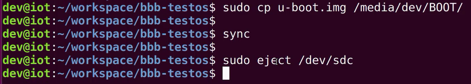

# BeagleBone Black安装自定义linux操作系统
## 保证虚拟机连接sd卡读卡器以及bealgebone black

## 安装分区工具gparted

## 准备启动Beaglebone black
- 连接其uart调试口，从而加载bootloader，内核，根文件系统等，
  - 
- 启动bbb，不插sd卡，运行其预装的操作系统，预装系统存储在板上的emmc存储卡中，是debian系统
  - ，
## 启动串口调试终端，开始调试运行BeagleBone Black
- 可以使用screen进行串口调试
  - 
- 也可以使用其他串口调试工具，例如图形化界面的gtkterm，该工具需要使用root权限启动，从而访问ttyUSB0端口，如果不使用sudo，则可以将当前用户添加到对应工作组，从而使其可以访问ttyUSB0端口
  - 
- 点击gtkterm工具的configuration，配置端口以及波特率，不存在奇偶校验位，不开启流控制，8位数据位，1位停止位
  - 
- gtkterm可以直接将命令行输出保存为文件
  - 
- 设备上电，gtkterm输出启动过程，启动debian操作系统，该操作系统烧录在emmc存储芯片中
  - 
  - 
  - 
## 使用sd卡引导Beaglebone black启动
- 将定制版linux存放在sd卡中，将sd卡插入BBB，按下图操作
  - 注意在boot键保存按下的状态下，插入usb供电或电源适配器供电，此时uart口始终保持连接，boot键一直按住直到串口调试窗口输出相关跟踪消息，此时说明设备从sd卡启动，已经可以放开boot键
  - 
## 使用gparted给sd卡分区
- 选择sd卡对应盘符
  - 
- 删除sd卡中已分配的分区
  - 
- 创建新分区
  - 
- 添加第一个分区，大小为100mb，文件系统格式为fat32
  - 
- 同理，添加第二个分区，其中存放linux内核以及设备树，甚至可以在该分区放置多个内核，从而实现内核之间的切换
  - 
- 剩余所有空间作为一个分区，保存根文件系统
  - 
- 点击对勾，保存分区结果
  - 
- 给分区重新命名
  - 
  - 设置完成的分区命名
  - 
- 给BOOT分区设置boot flag，从而使该分区可以作为引导分区，修改完成后需要点击绿色对勾保存修改结果
  - 
  - 
- 关闭gparted，发现三个sd卡分区已经被挂载
  - 
## 将MLO拷贝到sd卡的BOOT分区中（注意在取出sd卡之前一定要将设备断电）
- 整体思路
  - 
- 具体执行
  - 
  - 
- 将sd卡插入BBB并且按照上述方法使用sd卡booting启动BBB，此时由于sd卡中仅有MLO，所以在MLO引导U-Boot的过程中会报错，显示对应函数无法找到U-Boot的镜像文件，同时看门狗计时器会每隔三分钟再次尝试让MLO引导U-Boot，从而输出如下内容
  - 
- ***将设备断电，然后将sd卡取出，注意在取出sd卡之前一定要将设备断电***
## 将U-Boot镜像拷贝到sd卡的BOOT分区中（注意在取出sd卡之前一定要将设备断电）
- 
- 与之前相同，使用sd卡引导启动设备
  - MLO与U-Boot相继启动，uboot尝试寻找uEnv.txt文件或boot.src文件，***需要注意除了使用uEnv.txt之外，boot.src也是向U-Boot传递配置信息的一种方法，只不过本文中使用uEnv.txt文件向U-Boot传递配置信息***
  - 
  - 尝试寻找linux内核的zImage文件，但是并未找到，之后则尝试检检查其他设备，尝试是否能连接网络
  - 
  - 最终无法找到linux内核，则回显U-Boot命令行
  - 
## 将uEnv.txt拷贝到sd卡的BOOT分区中（注意在取出sd卡之前一定要将设备断电）
- uEnv.txt包含U-Boot的环境变量，U-Boot使用此类环境变量更改其自身的配置信息从而决定引导启动什么以及如何引导
- 
- 使用sd卡引导启动设备
  - 
## 将内核以及设备树文件拷贝到sd卡的kernel分区（注意在取出sd卡之前一定要将设备断电）

- 与之前相同，使用sd卡引导启动设备
  - 
  - 由于sd卡第三个分区为空，所以内核将其挂载后无法从中找到并运行init，无法初始化用户态内存空间
  - 
## 将根文件系统拷贝到sd卡的rootfs分区（注意在取出sd卡之前一定要将设备断电）
- 将根文件系统解压拷贝到rootfs分区
  - 
  - 
- 使用sd卡引导启动设备，启动成功，没有密码
  - 