# 进入uboot
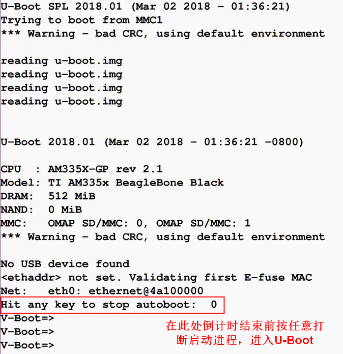
# 输入？显示uboot提供的指令
- uboot实际有哪些功能以及提供哪些命令取决于制造商在设备中烧录了哪种uboot，不同方式编译的uboot能够提供不同的功能，可以通过将设备制造商原本的uboot覆盖为自定义的uboot从而启用大部分功能
## printenv：输出uboot的环境变量，很多启动参数均为uboot内部维护的，其中很多环境变量会被攻击者修改，从而达到攻击目的
- 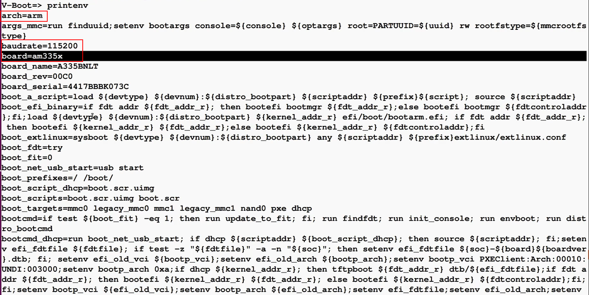
## bdinfo：输出pcb板的信息，其中包括一些内存地址信息，其中可能包括启动参数的内存地址以及DRAM的起始内存地址以及大小
- 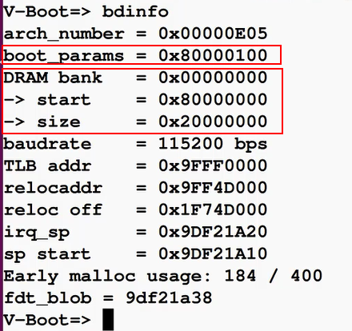
## mmc help：mmc相关命令，BBB开发板中包括板上自带的mmc存储以及sd卡所代表的mmc存储
- 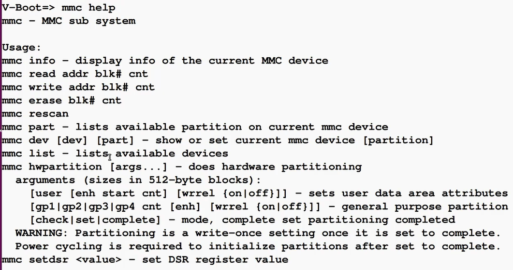
- 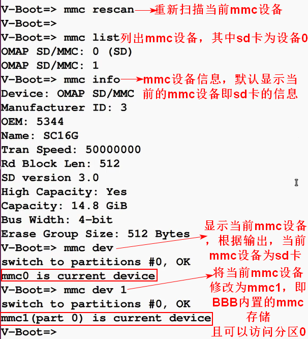
- 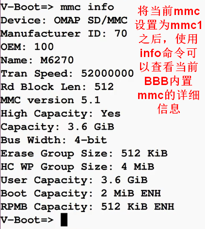
- 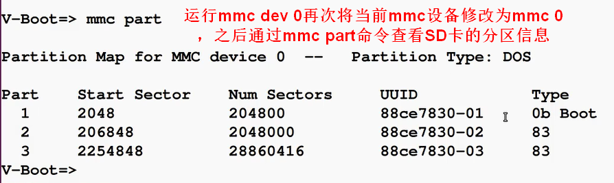
- 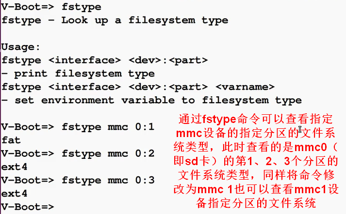
- 以上展示查看mmc设备详细信息的思路，该思路也适用于uboot引导启动的其他设备，通过该思路，可以查看其他设备的详细信息
## uboot提供了基于不同文件系统的实用程序，可以用于分析不同的设备上的相应文件系统
- 输入fat后按两下tab键，显示当前uboot所支持的fat文件系统相关命令，fatinfo可以查看指定设备的fat文件系统相关信息，fatls可以查看指定设备fat文件系统中的文件
  - 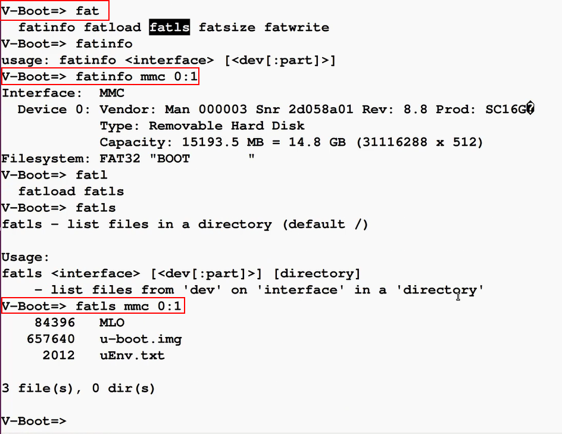
- fatload支持将fat分区中的数据拷贝到内存中
  - 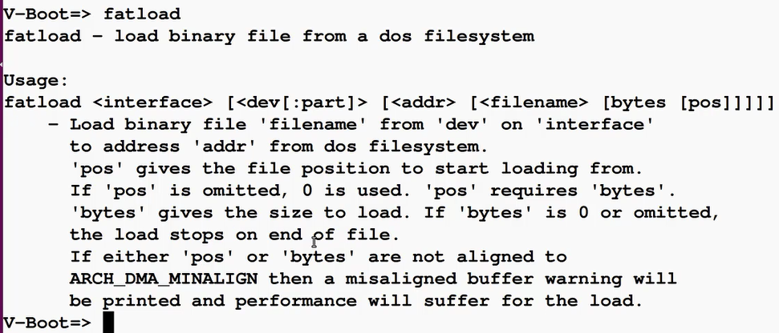
- 对于ext4文件系统也是同理
  - 
## uboot也提供快捷程序访问不同文件系统中的文件
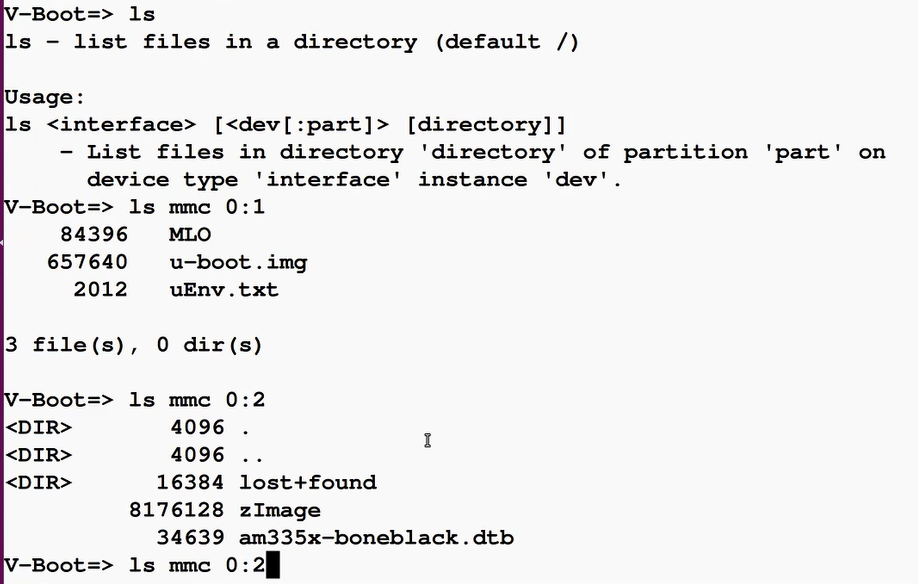
# 在此处需要关注的重点是Uboot中是否存在相关恶意boot kit程序，该程序可能与uboot具有相同权限，可以在操作系统运行起来之前进行各项操作
# 注意课程提供的uEnv.txt进行了详细的注释，可以作为学习工具