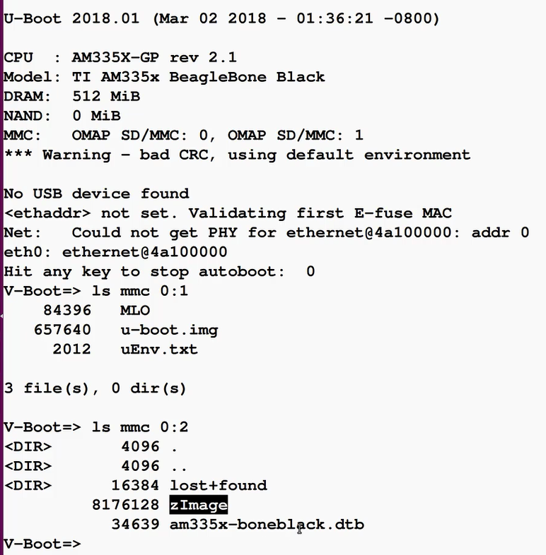
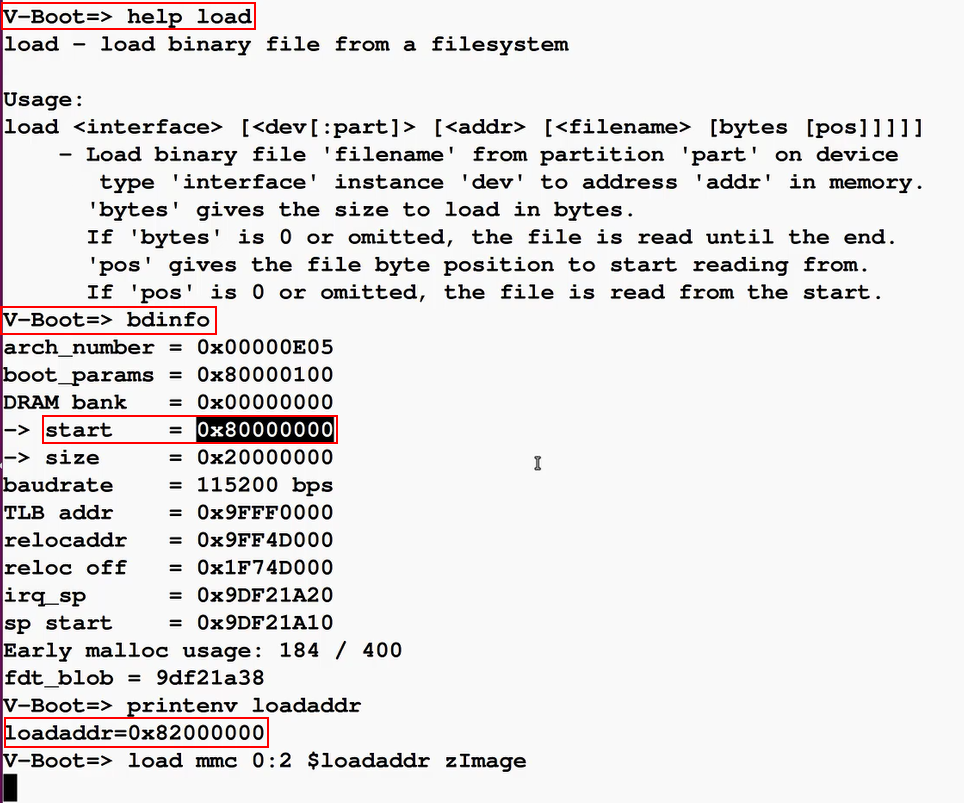
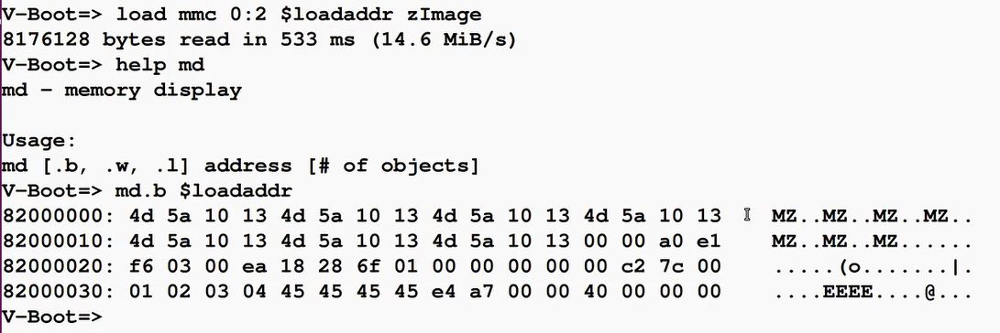
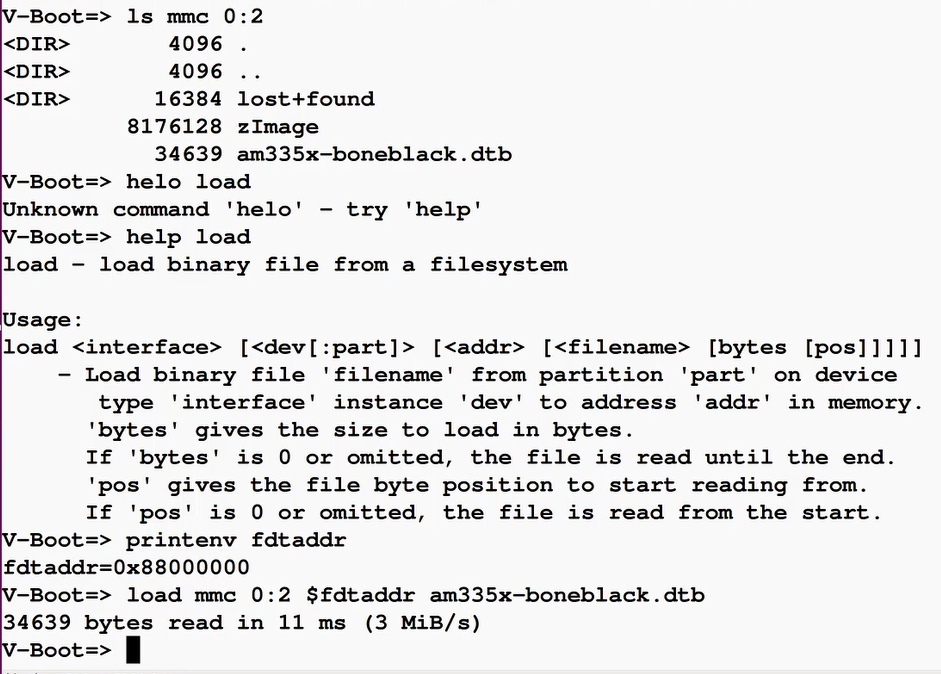
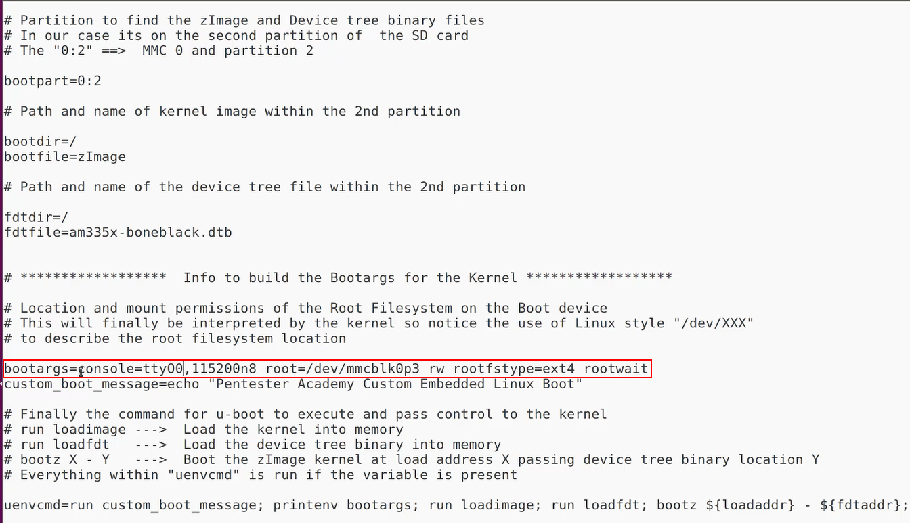
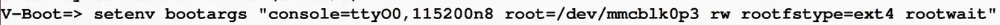
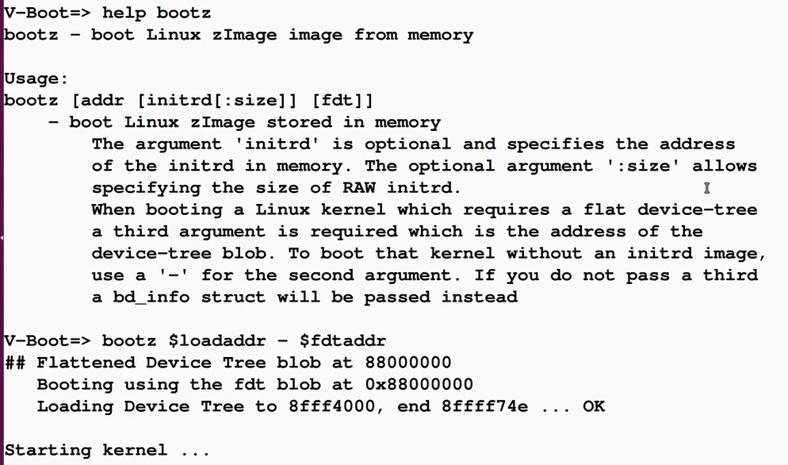

# 在U-Boot中手动加载linux内核以及设备树
- 本节的目的不是让uboot通过加载uEnv.txt从而进一步加载linux内核，而是通过手动引导的过程，让uboot成功加载Linux内核，即相当于手动模拟uEnv.txt中指定的加载linux内核的各项操作
## 打断启动过程，进入uboot
- 
## 将内核镜像加载到ram中(此处的ram为BBB的外部ram，而非处理器内部ram)
- 使用load命令可以将文件系统中文件加载到内存中，需要指定加载到的内存地址
- bdinfo命令给出了DRAM的内存映射的首地址，即0x80000000，但是实际内核加载时往往不会从DRAM内存映射首地址开始加载，而是会留一段距离
- 通过printenv命令，可以打印出loadaddr环境变量，该变量用于指定内核的内存加载地址，即0x82000000，注意不同的硬件制造商均有不同的首选内核加载地址，该地址存储在环境变量中。在uboot编译完成前，此类环境变量均保存于该设备相关配置文件中，该配置文件可以在uboot编译过程中编译到uboot中
- 使用load命令将内核镜像加载到0x82000000处，注意引用环境变量时需要加$符号
  - 
- 加载成功后，可以使用md命令查看加载到内存中的linux内核
  - 
## 将设备树文件加载到ram中(此处的ram为BBB的外部ram，而非处理器内部ram)
- 与加载内核类似，加载设备树的内存地址由环境变量fdtaddr表示
  - 
## 向linux内核传递启动参数，即boot argument
- 启动参数位于uEnv.txt中，console=ttyO0表示console应当映射到第一个串口 root=mmcblk0p3用于指定根文件系统的位置，当内核启动后mmcblk0p3表示0号mmc设备的第三个分区，rw表示加载跟文件系统时赋予读写权限，也可以设置为只读，rootwait表示内核要一直等待，直到根文件系统被加载到正确目录
  - 
- 将启动参数设置为环境变量bootargs
  - 
- 使用bootz命令在uboot中启动内核，使用启动参数启动内核后，内核将自动获取根文件系统，然后运行init进程
  - 注意bootz命令第二个参数可选，此时没有使用到initrd，所以不设置第二个参数，根据命令解释，使用-占用第二个参数的位置
  - 
  - 内核正常启动，挂载根文件系统，linux系统启动成功