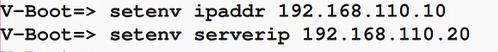
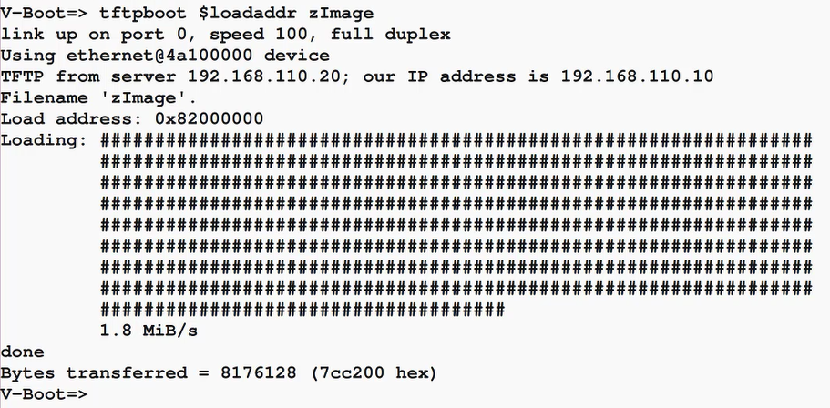

- 本节主要目的是使用uboot提供的命令，通过网络将linux内核和设备树传输给uboot，从而使uboot引导并启动linux内核
# beaglebone black需要访问tftp服务器，BBB中的uboot通过网络从tftp服务器中下载linux内核，本实验中将BBB与虚拟机通过uart和网线相连，注意BBB与虚拟机通过网线桥接，这样当给虚拟机中的tftp服务分配ip地址后，BBB与虚拟机应当可以进行通讯

# 完成虚拟机与BBB的uart连接

# 网线连接完成后，在ubuntu虚拟机中安装tftpd-hpa作为tftp服务端

# 重启BBB，进入UBoot，为虚拟机和BBB分配ip地址
- 查看虚拟机的IP地址
  - 
- uboot中设置自身ip地址（ipaddr）以及tftp服务器ip地址（serverip）
  - 
# 检查网络是否联通，即互ping
- 虚拟机到BBB未能ping通 
  - 
- BBB到虚拟机成功ping通
  - 
- 可能的原因是BBB被设置为不回应ping包
# 取消uboot的自动引导加载内核

# 保证虚拟机中的tftp服务程序已经启动，如果未启动可以通过service start进行启动

# 将内核以及设备树文件拷贝到tftp服务器程序指定目录下

# 通过tftpboot命令将tftp服务器上的Linux内核下载到BBB的指定内存地址，***这其中隐含着该特性被用于攻击的可能性***

# 同理下载设备树文件

# 设置内核启动参数，该参数来自uEnv.txt文件，之后启动linux内核（将两个加载地址作为参数）

- 内核启动后会进而引导根文件系统，此时根文件系统仍然在sd卡中，能够达到该效果的前提是linux内核成功启动了相关必要的驱动程序
# 从攻击者的角度而言，当破解了bootloader，利用其权限可以对tftp服务器上的内核程序进行检查，可以将服务器上的内核文件进行替换，从而获得持久性的后门，即基于bootloader的后门
