# 关键目录
- /bin /sbin /usr/bin/ /usr/sbin
- /lib /usr/lib
- /etc
# gcc编译工具
- p24
# gdb
- p26
# mips汇编基础
- p28
# http协议
- p38
# linux中安装ida pro
- 路由器固件提取出的根文件系统中存在符号链接，当将根文件系统拷贝到windows主机中，符号链接丢失，故选择在ubuntu中运行ida pro
- p50
# ida的mips插件和脚本
- p52
- 一种mipsgadget搜索插件
  - 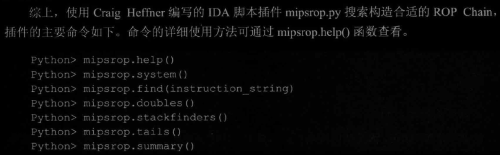
# binwalk安装
- p55
# qemu安装
- p60
# mips交叉编译环境
- p61
# qemu用户模式与系统模式使用
- qemu启动系统模式时有两个关键参数：内核镜像、硬盘镜像，该两个变量存在时加上内核启动参数（-append）即可启动一个qemu虚拟机
- p64
# 为qemu模拟的mips系统设置网络
- p66
# dlink固件下载ftp服务（在文件资源管理器中的打开即可）
- ftp://ftp2.dlink.com/PRODUCTS/
# 通过hook修复固件程序运行环境（mips架构）
- p71
- 编译hook.so文件的命令，可以用于尝试修复之前hook失败案例
  - 
- 注意，qemu用户模拟进行hook时，需要通过-E参数指定环境变量LD_PRELOAD，注意此时已经将hook.so文件拷贝到固件文件系统根目录下
  - 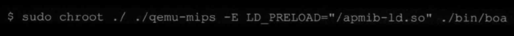
- 注意在hook过程中可以针对fork函数进行hook，将其返回值改为0，从而实现针对http处理子进程的调试（使用ida远程调试）
  - 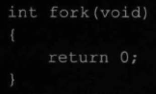
# linux下qemu+ida动态调试
- 包括附加调试以及运行调试
- 里面提到在qmeu+ida模拟执行并调试CGI程序时，需要在qemu命令中使用 -E 参数指定CONTENT_LENGTH的环境变量
  - 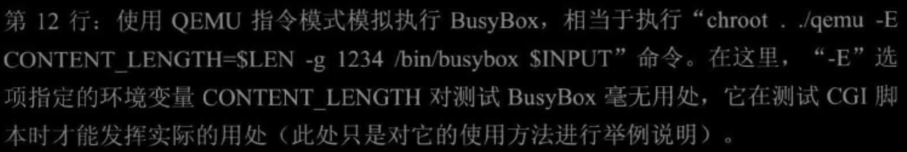
- p80
# ida脚本基础
- 包含枚举危险函数的IDC脚本
- 包含分析危险函数交叉引用的IDApython脚本
- p87
# python网络编程
- p107
# 路由器web漏洞
- p112
# 路由器溢出漏洞
- p119
## mips堆栈
- p119
## mips函数调用过程以及参数传递
- p120
## mips缓冲区溢出可能性
- p124
- 对于非叶子函数，调用函数调用非叶子函数时，函数调用指令会将返回地址保存在ra寄存器中，当进入非叶子函数中，非叶子含税会将ra中的返回地址保存在本函数栈帧的底部（即内存高地址），并在非叶子函数返回前，从栈帧中取出返回地址，赋值给ra寄存器，进而跳转到ra寄存器所指向的内存地址，从而完成函数返回，即，若非叶子函数中存在缓冲区溢出，则可能修改本函数栈帧中保存的返回地址，进而修改函数处理流程
- 对于叶子函数，调用函数调用叶子函数时，函数调用指令会将返回地址保存在ra寄存器中，进入叶子函数后，叶子函数不会讲返回地址保存到栈帧中，仅仅会在叶子函数的最后通过jr $ra命令直接返回，此时叶子函数中存在溢出时，无法修改叶子函数的返回地址，但如果溢出数据足够长，就可以通过溢出修改叶子函数父函数的返回地址（例如当mian函数中调用叶子函数时，通过叶子函数的溢出修改main函数返回地址），从而实现修改程序执行流程
## mips缓冲器溢出利用实例
- p128
- ida的汇编代码中，可以看到指定函数栈帧的布局信息，在指定函数汇编代码的起始位置，可以通过给出的局部变量偏移信息，判断出各个局部变量相对本函数栈帧底部的偏移，如下图中buf变量相对于存储返回地址ra的局部变量偏移为0x1a0-0x4=0x19c，从图中可以看到存储返回地址ra的局部变量对应品偏移为-4，即在本函数中该变量相对于栈帧底部的偏移为-4
- 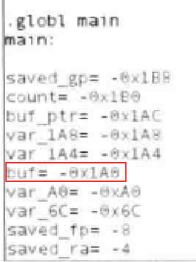 
## mips缓冲区溢出利用实践（nop ROP Shellcode）
- p134
- mips中的nop指令为0x00000000，可能会导致字符串操作函数阶段，所以可以使用一些不影响shellcode正常执行的汇编指令作为nop区域的填充，从而以此作为滑板指令并引导执行流程执行最后的payload
- 以下python脚本用于将shellcode写入可执行文件中，之后反编译可执行文件，即可弄懂shellcode的用途，注意ida一开始无法将可执行文件内容解析为代码，需要选中第0行，之后按c键，让ida将数据解析为汇编代码（p137）
  - 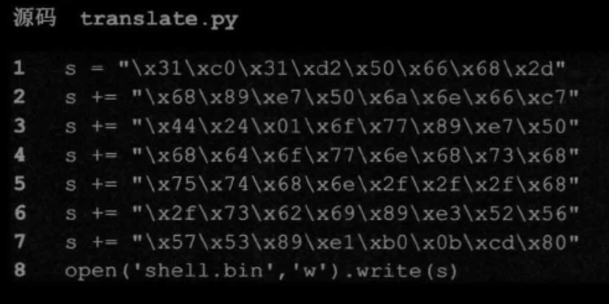
## mips漏洞利用实际开发过程
- p139
# 基于mips的shellcode开发
- p147
## mips中的linux系统调用
- mips中通过syscall实现linux系统调用
  - 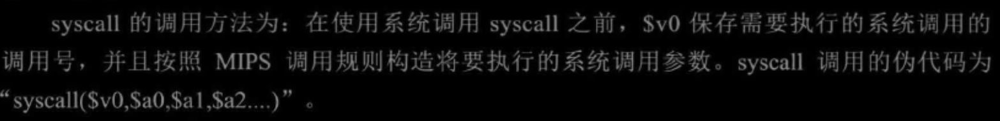
- 系统调用号定义的位置
  - 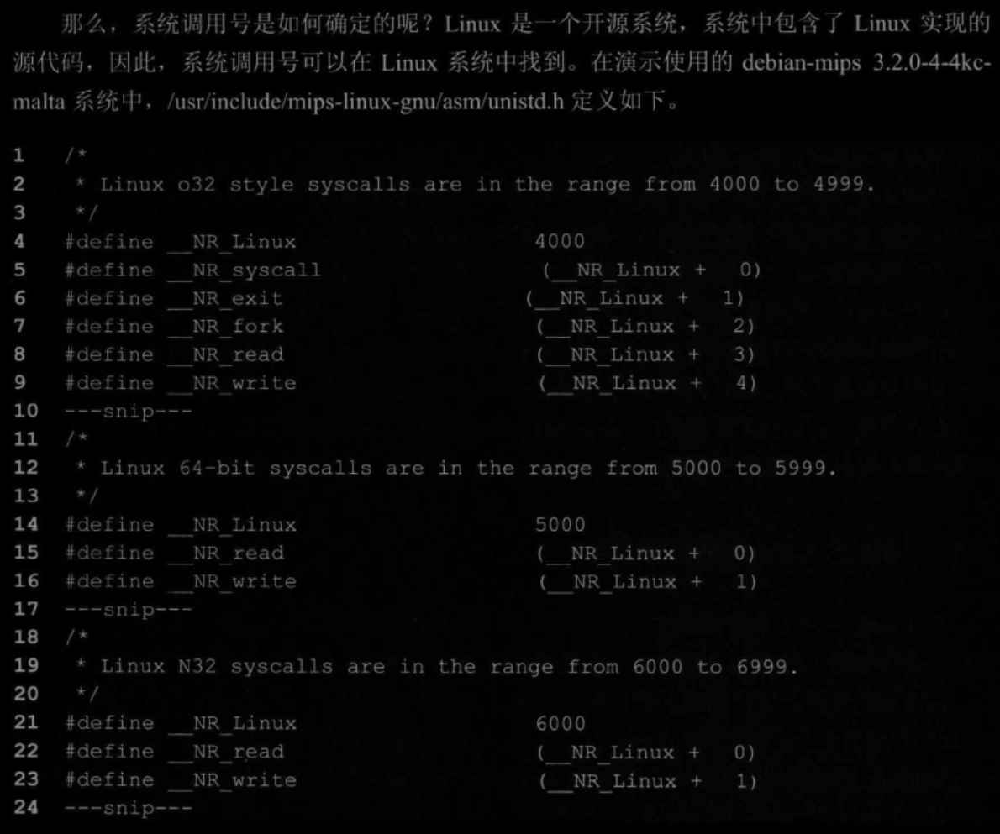
## write系统调用
- 将汇编代码编译为可执行文件的命令（p150）
  - 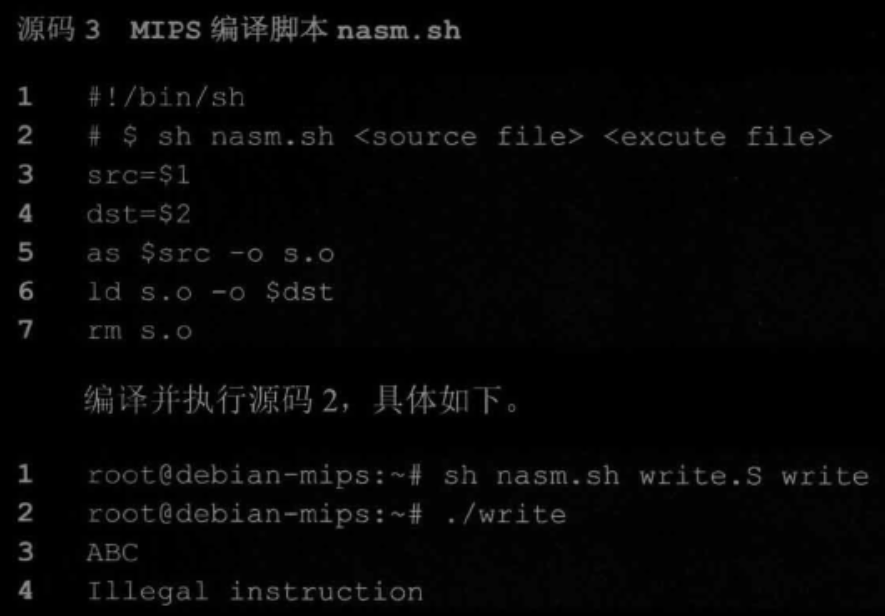 
- 从可执行文件中提取shellcode机器码（p150）
  - 使用readelf -S获取程序入口地址以及文件偏移，通过gdb调试查看程序代码段的汇编指令及其对应十六进制数据
- 测试shellcode功能的代码（p152）
  - 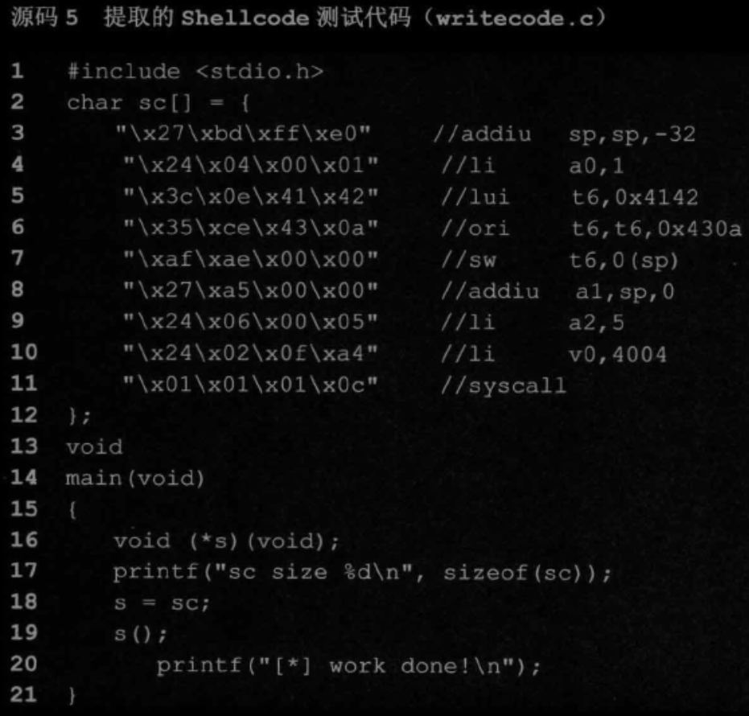
  - 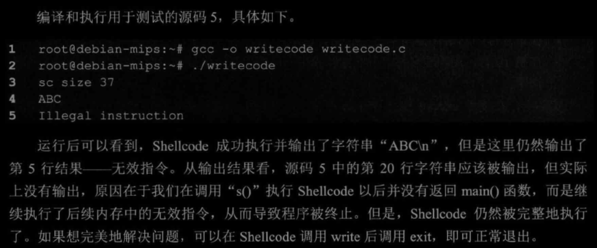
## execve系统调用
- p153
- 整体过程与write系统调用部分类似
## shellcode编码优化
- p156
- 主要目的：清除shellcode中的坏字符
- 主要方法：指令优化
  - 使用特殊指令
  - 将一条指令替换为多条指令
  - 无null调用write的shellcode（p157）
  - 无null调用system的shellcode（p158）
- 主要方法：shellcode编码（适用于对shellcode具有更苛刻限制条件的情况）
  - shellcode所面临的限制条件
    - 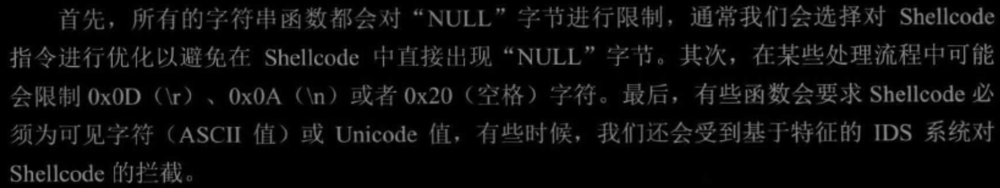
  - 使用异或方式编码解码（p161）
## 通用shellcode开发
- p164
- reboot shellcode
- reverse_tcp shellcode
## shellcode应用实例
- p173
- 通过reverse_tcp shellcode进行漏洞利用
## 手动提取固件文件系统
- p182
- 判断文件类型
  - 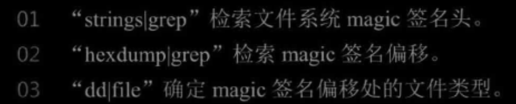
- 通过file strings hexdump dd命令配合，手动对设备固件进行提取
## 自动提取文件系统
- p189
- 介绍了binwalk工具固件扫描的基本原理
- binwalk工具参数（p191）
  - -I：显示所有扫描结果
  - -A：分析指定文件中通用CPU架构的可执行代码
- 为binwalk添加新签名文件从而增加新的提取规则和提取方法（p194）
- 为binwalk添加新配置文件从而增加新的提取规则和提取方法（p199）
# 漏洞分析实例
## 第十章 D-link DIR-815栈溢出漏洞（p203）
- 模拟运行cgi程序，调试并利用其中的漏洞,注意cgi程序通过读取环境变量从而读取http数据包内容(例如获得cookie值：char *getenv("HTTP_COOKIE"))，所以在qemu用户模式模拟运行cgi程序时的，可以通过-E 参数指定环境变量，从而指定cgi程序读取到的http数据
- 发现固件文件系统中所有.cgi文件
  - find ./ -name '*.cgi' 
- 固件分析过程中一些关键函数
  - strcpy等
  - sprintf
  - system
- qemu模拟环境（特指用户态模拟）以及路由器真实运行环境往往存在差别，例如qemu用户态模拟状态下，固件根文件系统中var目录常为空，而在实际路由器运行过程中，var目录常用于保存运行过程中产生的中间结果，当固件中web server运行过程中使用了var目录下的文件，则会导致固件模拟运行与固件实际运行结果不同，甚至会影响能否触发漏洞
- 在mips固件的栈溢出漏洞中，因为mips函数中在函数起始位置会将ra寄存器中的返回地址保存到栈中，之后还会将s0等保留寄存器的值保存在栈中，所以如果栈溢出能够修改函数返回地址，则一定能修改返回地址之前栈中保存的s0等寄存器的值，所以漏洞利用时，可以充分利用so等保存寄存器的值以及ra寄存器的值从而实现system等函数的系统调用
- mips中rop寻找插件
  - MIPS ROP Finder（p218）
- 使用telnetd作为system函数的参数，即执行system('telnetd')即可在设备的指定端口开启telnet服务，进一步在攻击端执行“telnet 目标ip”命令即可连接到目标设备命令行中（p226）
## 第十一章 D-link DIR-645溢出漏洞（p227）
- 在汇编代码中右键点击相关变量，选择Jump in a new hex windows选项，可以在新创建的Hex View窗口中找到该变量在程序内存中的值（232）
- 有时用于溢出的数据过长，从而导致溢出数据修改了栈中重要的数据结构，使得程序在返回之前就因为引用错误数据而出错，此时可以通过减少溢出数据长度，从而避免溢出数据对重要数据结构的修改，让程序正常返回，从而劫持程序执行流程（p234）
- 执行system('telnetd -p 2323')可以在指定端口开启telnet服务（p241）
- 登录指定端口的telnet服务，可以使用如下命令行命令：（p243）
  - telnet ip地址:指定端口
## 第十二章 D-link DIR-505越界漏洞（p244）