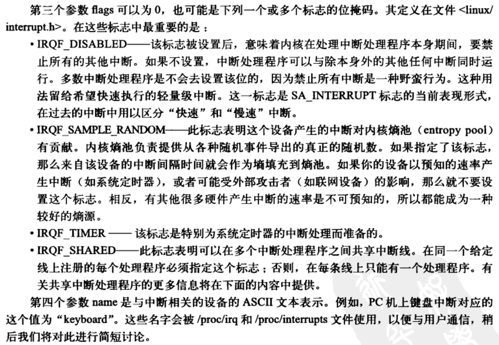
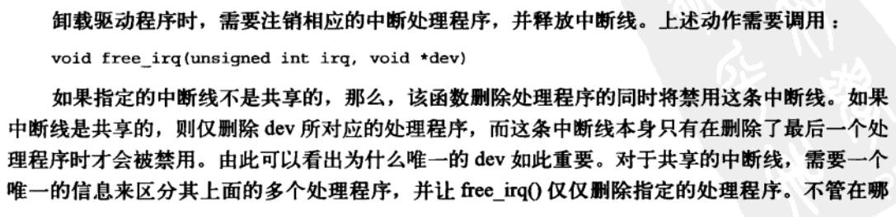
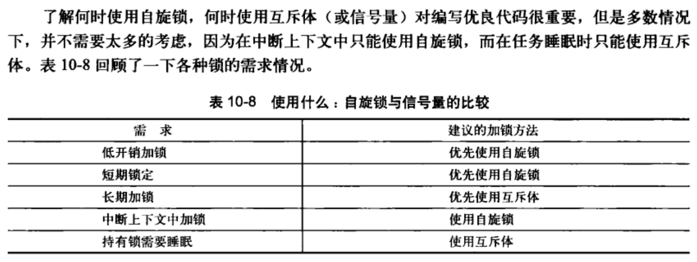
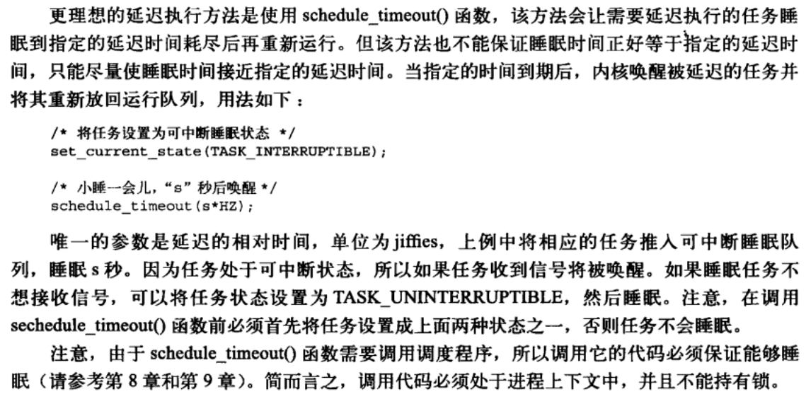
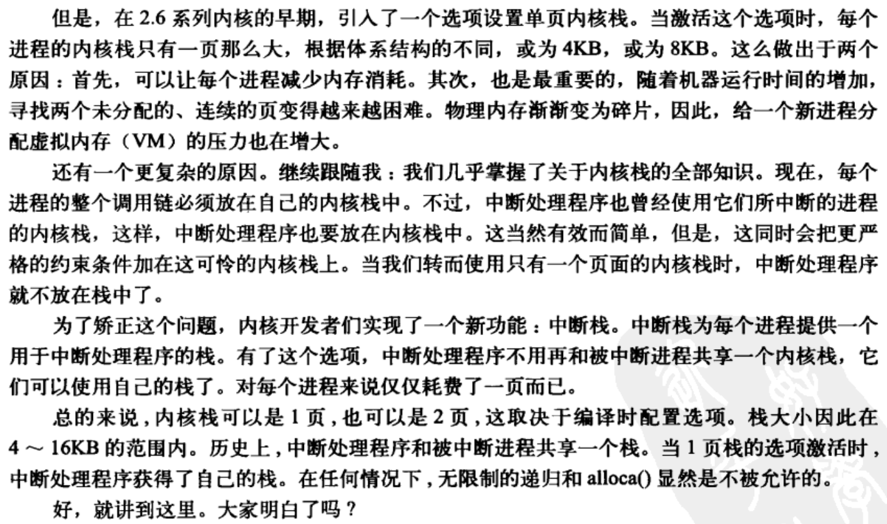
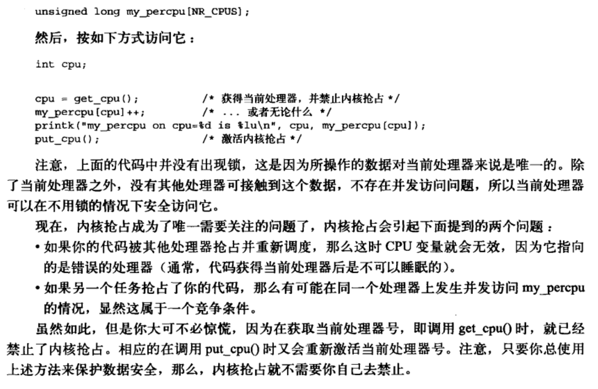
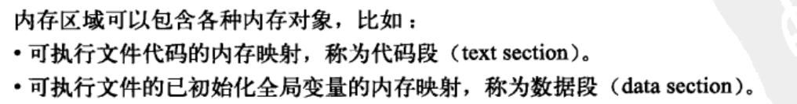
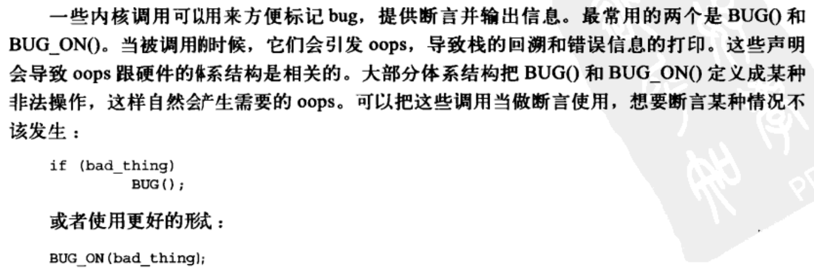
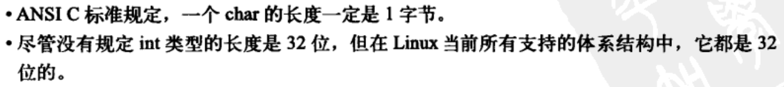
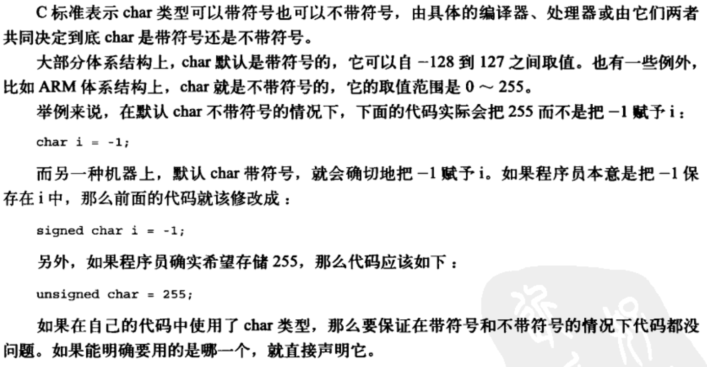

# 笔记主要针对有助于理清概念的内容进行记录，其他知识性内容不做记录
# 将知识分为概念类知识和技术类知识
# 第一章
- 内核的组成
  - 中断服务程序：负责响应中断
  - 调度程序：负责管理多个进程从而共享处理器时间
  - 内存管理程序：负责管理进程地址空间
  - 网络、进程间通讯系统服务程序等
- 应用程序与内核通讯的方式
  - 应用程序-》c库函数-》系统调用-》进入内核
  - 
- 关于中断
  - 所有硬件体系结构均支持中断机制，硬件发起中断，内核停止，根据中断号调用中断服务程序，处理中断
  - 所有中断服务程序均不在进程上下文中执行，而在一个与所有进程均无关的专门的中断上下文执行
- cpu在任意时间点上处于下述三个状态之一
  -  

# 第二章
- 获取、安装和使用补丁
- 源码树
  - 
  - 
- 编译内核
- 内核开发特点
  - 

# 第三章 进程
- 进程定义
  - 
- 内核调度对象是线程不是进程，linux中线程进程不特别区分
- 进程提供两种虚拟机制：虚拟处理器 虚拟内存
- 进程创建相关函数 fork exec wait
- linux中进程也称为任务task
- 进程描述符task_struct 任务队列 task list
  - 
- linux分配进程描述符通过slab分配器，后者在栈顶或栈底创建结构thread_info，该结构中task域指向该进程的进程描述符结构
  - 
- pid用于表示一个进程，pid保存在进程描述符中，pid最大值影响系统支持的进程上限，pid最大数值可设置
- current宏用于快速找到当前进程的进程描述符，不同硬件架构该宏的实现不同，x86中引入thread_info结构从而支持current宏快速找到进程描述符
- 进程描述符中state表示进程当前状体，进程状态有五种
  - 
  - 
- 内核设置进程状态的函数set_task_state
- linux中处理同一进程的不同线程时，将多个线程均分配task_struct，并指定他们共享一些资源
  - 
- linux中创建线程与创建进程类似，之不过调用clone时需要指定一些参数
  - 
- 内核线程，可以通过其他内核进程调用指定函数进行创建、运行、销毁
  - 
  - 
- 进程通过隐式或显示得调用exit系统调用从而终结，书中给出具体过程
  - exit->do_exit
- 进程终结后的清理工作和进程描述符的删除分开执行，需要父进程执行特定操作释放子进程的task_struct
  - release_task 函数 用于释放进程描述符
- 子进程的父进程结束后，需要为该子进程重新寻找父进程，否则此类子进程退出后没有父进程为其清理数据，会白白占据内存
  - p32

# 第四章 进程调度
- 进程调度定义
  - 
- 多任务系统分两类 非抢占式多任务、抢占式多任务 定义
  - p35
- 本章讲解linux进程调度算法
  - 
- p39之前将调度算法一般规律 之后讲linux调度算法
- linux进程调度算法 CFS
- linux提供两种实时调度策略
  - 
- linux中与进程调度相关的系统调用
  - 

# 第五章系统调用
- 系统调用、异常、陷入是用户空间访问内核的手段
  - 
- 系统api、c库、系统调用的关系
  - 
  - 
  - 
- linux中通过调用c库函数触发系统调用
- 源码中定义一个系统调用
  - 
  - 
- 内核为每一个系统调用指定了一个系统调用号
  - 
- 应用程序通过软中断通知内核要执行系统调用，希望系统切换到内核态执行系统调用处理函数 
  - x86中该陷入内核的软中断即int 0x80 该指令触发中断从而切换到内核态执行128号中断处理程序，而该程序就是系统调用处理程序 该处理程序名为system_call 此外x86处理器还添加了sysenter指令，同样用于陷入内核执行系统调用
  - 
- ***系统调用是用户空间进入内核空间的合法入口，用户空间通过触发软中断int 0x80（软件发起的中断），触发内核中对应中断处理程序，该中断处理程序的作用就是根据当前寄存器的值，触发不同的系统调用执行，从而实现了用户空间触发内核空间的代码执行***
  - 
- 所有系统调用陷入内核的方式相同，需要将系统调用号一并传给内核 x86使用eax
  - 
- 系统调用传参使用ebx ecx edx esi edi 六个及以上的参数需要单独的寄存器保存指针，该指针指向用户空间中的所有参数
- 函数调用返回值通过eax传递（x86体系中）
- 重新实现一个系统调用
  - p61介绍实现一个新的系统调用需要遵循的原则、系统调用参数设计的注意事项，并例举了几个系统调用的实现
- 系统调用上下文
  - 
- 内核在执行系统调用时，处于进程上下文，current指针指向引发系统调用的进程
- 实现系统调用后，将其注册为一个正式的系统调用
  - p65
- 一般用户空间通过调用c库函数，从而间接触发系统调用，当然存在宏可以在用户空间中直接触发系统调用
  - 
- ***内核进程处于进程上下文中时，进程可以睡眠，可以被抢占，而中断上下文中代码执行不可阻塞，故也称原子上下文***
# 第六章 内核数据结构
- 链表
  - linux内核中不是将数据结构塞入链表，而是将链表节点塞入数据结构
  - linux官方链表实现
    - p71
    - 将特定链表结构体（list_head）嵌入到实际包含数据的结构体中，从而将该结构体组织为链表结构
    - linux官方提供一组函数来操作链表，此类函数使用一个或多个list_head结构体指针作为参数，实现链表元素的增加、删除、移动、合并等操作
      - p73
    - linux官方提供了遍历链表和引用链表中数据结构的方法
      - p75
- 队列
  - linux内核通用队列的实现称为kfifo
    -  
  - 队列的关键操作是入队列(enqueue)和出队列（dequeue）
  - 官方实现堆其他操作包括
    - 创建
    - 入队列
    - 出队列
    - 获取队列长度
    - 重置和撤销队列
- 映射
  - 可以理解为键值对的集合
  - 可以通过自平衡二叉树和散列表实现
  - linux中映射结构称为idr，该户数据结构用于映射用户空间的uid
- 二叉树
  - 红黑树p85
  - linux实现的红黑树称为rbtree
  - 红黑树主要用于存储大量数据且检索迅速
- 算法复杂度
  - p88
# 第七章 中断和中断处理
- 处理器为管理外围硬件提供一种机制，当硬件需要的时候再向内核发送信息，即中断机制，内核使用对应中断处理程序处理对应中断
- 中断的本质是电信号
  - 
- 中断总是与一个值相关联，部分架构中硬件设备的中断号是动态分配的，不同的外围设备在不同时刻可能对应不同的中断号
- 异常与中断类似，但是异常由cpu执行到错误的指令产生，而中断来自于硬件发起，异常的产生需要考虑处理器时钟同步，中断无需考虑
  - 
- 中断处理程序
  - 一个中断对应一个中断处理程序 ，***中断处理程序是设备驱动程序的一部分***，设备能产生多种类型的中断，就需要对应数量的中断处理函数在驱动程序中实现
  - 中断处理程序是一个普通c函数，但是需要以特定方式声明，此类函数运行在中断上下文中，该上下文中的代码执行不可阻塞，故也称原子上下文，区别于普通的进程上下文 ***内核进程处于进程上下文中时，进程可以睡眠，可以被抢占***
    - 
- 关注网络设备的中断处理程序
  - 
- 上半部与下半部
  - 中断发生后，上半部立即开始执行，用于完成严格实现限制的事，用于快速响应，相关耗时操作会被推迟到下半部中
    - 
  - 例如网络到达网卡后，网卡立即发送中断到处理器，内核会立刻将数据包拷贝到系统内存，此为上半部，此后内核会恢复中断前的程序的执行，对网络数据包进一步处理均在之后的下半部中进行
    - 
- 注册中断处理程序
  - 中断处理函数实现并注册在设备的驱动程序中
  - 驱动程序通过request_irq()函数注册一个中断处理程序
    - 
    - 
    - 
    - 
    - 
    - 上述中一个中断线可以理解为一个中断号，对多个中断共享一个中断线意味着多个中断使用同一个中断号表示，可能共享同一个中断处理函数
    - 根据后续分析，一个中断号即表示一个中断线，两者可以一一对应
    - 根据后续描述，一个中断线上似乎可以有多个中断处理函数，所以中断线的真正含义到底是什么？
  - 注册一个中断处理程序的例子
    - 
- 驱动程序卸载时，需要注销对应中断处理函数，使用free_irq函数
  - 
  - 
- 实现中断处理程序
  - 
  - 
- 中断处理程序的无法被重入，即中断处理程序执行过程中，不必担心有其他进程触发同样的中断处理函数执行
  - 
- 共享的中断处理函数
  - 
- 中断处理程序示例
  - 在驱动初始化函数中会完成中断函数的注册
    - 
  - 执行其他操作  
    - 
    - 
- 中断上下文
  - ***进程上下文是一种内核所处的操作模式，此时内核代表进程执行，进程上下文可以睡眠，可以调用调度程序***
  - ***中断上下文不能睡眠，故不能在中断处理函数中调用会睡眠的函数***
    - 
  - 中断上下文具有严格时间限制，中断处理函数应该尽量迅速简洁
    - 
  - 中断处理程序拥有字节的函数栈，长度受限
    - 
    - 
- 中断机制的实现
  - 
  - 内核中中断的触发点 do_IRQ
  - 内核中handle_IRQ_event用于运行中断处理程序
    - 该函数中会循环执行每个潜在的中断处理函数，除非该中断线不是共享的，否则所有处理函数均会被执行
    - p100
- /proc/interrupts目录中的内容可以显示当前系统中中断的详细信息，包括支持哪些中断号（中断线）每个中断触发多少次
  - 
  - 
- 内核提供接口提供控制中断系统的能力，包括激活和禁止特定中断以及判断当前系统状态
  - p103
  - 用于控制中断的一些函数
    - 

# 第八章 下半部以及推后执行的工作
- 中断处理程序仅能完成中断处理流程中的上半部分，这存在局限
  - 
- 下半部的任务以及上半部与下半部之间的任务划分
  - 上半部注定要完成部分工作，例如向硬件确认终端到达、从硬件中拷贝数据到系统内
  - 不存在严格定义上下半部之间如何划分功能，仅存在推荐的原则
    - 
- 下半部的必要性
  - 中断触发时，当前中断线在所有处理器上都会被屏蔽，如果一个中断类型为IRQF_DISABLE，则该中断执行时会禁用所有本地中断
  - 下半部运行过程中会允许所有的中断进行响应
  - 下半部执行没有确切时间，通常中断处理程序一返回就会执行
- 有多种机制可以实现下半部
  - 2.6版本中，软中断 tasklet（通过软中断实现） 工作队列 内核定时器（通过软中断实现）均为下半部的实现机制
  - ***大部分驱动程序使用tasklet实现其下半部***
  - 
- 软中断
  - 注册软中断
    - 
  - 软中断处理函数
    - 
  - 执行软中断处理函数：中断处理函数在返回前会标记其软中断，从而使其在稍后执行，软中断在do_softirq()中执行，该函数循环遍历并执行每个待处理的软中断
    - 
  - do_softirq中遍历所有软中断，触发其中等待执行的软中断函数
    - 
  - 目前只有网络和SCSI子系统直接使用软中断
  - 创建一个新的软中断
    - 在编译期间通过定义枚举变量声明一个软中断
      - 
    - 注册处理程序 通过open_softirq
      - 
      - 
    - 触发软中断可以使用raise_softirq 通常在中断处理函数中触发软中断，从而在中断处理函数执行完毕后调用do_softirq()函数开始触发程序下半部
      - 
- tasklet
  - 软中断在执行频率和连续性要求高的场景下使用，其他场景下tasklet更具有用途广泛性
  - tasklet的实现
    - 
    - tasklet结构体
      - 
    - 调度tasklet
      - 
      - 
      - 
    - 使用tasklet
      - 采用静态或动态的方式声明一个tasklet
        - 
        - 
      - 编写tasklet处理程序
        - 
      - 调度自己的tasklet
        - 
        - 
      - ksoftirqd
        - ksoftirqd是一个内核线程，每个处理器均存在一个该线程
        - 软中断可以在执行过程中再次触发自身，故当系统中存在大量软中断时，可能导致系统一直处理软中断或中断处理函数，而不执行用户空间进程
        - ksoftirqd线程专门用于字上述情况下辅助处理软中断，从而使得处理能在处理软中断和用户空间程序之间实现平衡
- 老的BH机制
  - p119 仅做了解
- 工作队列
  - p120
  - 工作队列实际上是将代码交给一个内核线程去执行，即在内核的进程上下文中执行，允许重新调度甚至睡眠，适用于需要大量内存、需要获取信号量、需要执行阻塞性io操作时的下半部执行
    - 
  - 工作队列的实现
    - 工作队列创建的内核线程称为工作者线程，每个处理器均提供一个缺省的工作者线程用于处理内核其他部分推后的工作，驱动程序可以使用默认的缺省线程，也可以创建自己的工作者线程
    - 
  - 工作者线程的数据结构
    - 一个 workqueue_struct 对应一种工作者线程类型，该结构体中为每个工作者线程分配一个cpu_workqueue_struct
    - 
    - 
  - 表示工作的数据结构 work_struct ，该结构体被连接成链表
    - 所有工作者线程均会执行worker_thread()函数，该函数中存在死循环，工作被插入到工作队列后，工作被执行，工作队列中为空时会继续休眠
    - worker_thread()函数中死循环执行 work_struct 链表中的结构体，对应工作执行完毕，会将结构体从链表中移除 
    - worker_thread()函数中调用run_workqueue函数实际触发工作队列的执行
    - 
    - 
    - 
  - 工作队列实现机制总结
    - 
    - 
  - 使用工作队列
    - 创建工作（即创建工作对应结构体）静态声明 动态创建
      - 
    - 创建工作者线程要执行的函数
      - 
      - 
    - 调度工作，即将工作提交给工作者线程进行处理，可以选择立刻执行或延迟执行
      - 
    - 刷新操作，即执行指定函数会一直睡眠，直到队列中所有工作被工作者线程执行完毕才返回
      - 
    - 创建新的工作队列及其对应的工作者线程
      - 
      - 
- 老的任务队列
  - p126
- 下半部机制选择 p127
  - 
- 下半部中加锁 注意，不同类型的下半部实现机制需要进行的同步操作不同，需要根据下半部机制特点决定
  - 
- 禁止下半部 p128
  - 使用指定函数可以禁止处理器中的软中断和tasklet两种下半部
  - 存在相关数据结构，当该数据结构为0时中断才允许执行
  - 上述机制无法禁止工作队列，因为其运行在进程上下文
  - 
  
# 第九章 内核同步介绍
- 需要针对共享资源的访问进行保护 ，即防止共享资源的并发访问，多个线程同访问修改共享数据可能导致数据处于不一致状态
- ***多处理器意味着内核代码而可以同时运行在多个处理器上，两个不同内核可能同时访问同一个共享数据***
- 抢占式内核意味着内核可以抢占正在执行的内核代码，并重新调度其他进程
- 临界区与竞争条件
  - 临界区：访问和操作共享数据的代码段
  - 竞争条件：多个线程在临界区中共同时执行
  -  
- 原子操作：一般只能针对简单的指令代码或共享数据实现原子操作，复杂的代码逻辑或复杂的共享数据结构需要加锁
- 加锁
  - 
  - 加锁解锁的代码本身必须是原子操作，其具体实现与体系结构有关
- linux中不同的锁机制的区别，当无法获得锁时，进程的表现形式是什么
  - 
- ***代码中造成并发的原因***
  - 
  - 中断
  - 软中断和tasklet
  - 内核抢占
  - 睡眠
  - 对称多处理器
  - ***在单核处理器中，不存在真正的并发，都是伪并发，故产生竞争条件的原因是，当线程运行在临界区中时，内核调度其他线程运行，且之后的线程访问同样的临界区，故此时产生了类似两个线程同时访问临界区的问题，即竞争条件问题，故导致问题的核心是，内核将一个进程中断，调度另一个进程运行的行为，故此类行为可能导致竞争条件***
  - 产生bug的几个场景
    - 内核代码操作某资源时系统产生中断（内核调度软中断或tasklet执行），而中断处理函数也要访问该资源，产生bug
    - 内核访问共享资源期间可以被抢占，抢占执行的进程访问同样的资源，产生bug
    - 内核代码在临界区睡眠，内核调度其他进程执行，被调度的进程访问同一个临界区，产生bug
    - 两个处理器同时访问同一个共享数据，产生bug
  - 预防bug的关键：辨认出需要共享的数据和相应的临界区，代码设计阶段就要加入锁
  - 中断安全代码：中断处理过程中能避免并发访问的安全代码
  - smp安全代码：对称多处理器中能避免并发访问的安全代码
  - 抢占安全代码：内核抢占时能避免并发访问的安全代码
- 了解需要保护的数据
  - 可能被并发访问的代码都需要保护
  - 大多数内核数据结构都需要加锁，从而实现同步
  - 如果有多个线程可以访问指定数据，则需要给此类数据加上锁
  - 注意给数据加锁而不是给代码加锁
- 不需要保护的数据
  - 线程的局部数据不需要保护，因为数据在栈中
  - 数据只被特定进程访问，不需要加锁
- 内核编译配置选项
  - CONFIG_SMP：允许对称多处理器
  - CONFIG_PREEMPT：允许内核抢占配置
- 代码同步问题的自我诊断
  - 
- 死锁
  - 定义
    - 
  - 场景
    - 自死锁：一个线程尝试获取一个已经拥有的锁
    - 多个线程中尝试获得对方线程所拥有的锁
  - 避免死锁  
    - 
    - 
  - 锁的争用性和扩展性 锁的颗粒度
    - p139
- ***锁的根本目的是保护数据不被并发访问***

# 第十章 内核同步方法
- 原子操作
  - 内核提供两组原子操作接口：针对整数进行操作、针对位进行操作
    - 
  - 32位原子整数操作
    - 通过定义一种特定的数据类型atomic_t存储整数操作数，提供一系列接口实现整数的加减等原子操作
    - 上述数据类型针对32位数据
      - p142
  - 原子操作仅仅保证操作过程不被打断，但是不保证操作的顺序，两个原子操作的顺序性通过屏障指令来实施
  - 64位原子整数操作
    - 通过定义一种特定的数据类型atomic64_t存储整数操作数，提供一系列接口实现整数的加减等原子操作
    - p144
  - 原子位操作
    - 与体系结构相关
    - 使用普通指针和具体偏移作为参数，提供多个接口实现对bit位进行原子操作
    - 系统还提供了非原子位操作函数，不保证原子性，执行速度会快些
    - p146
- 自旋锁
  - 最常见的锁  只允许一个可执行线程持有，自旋锁被占用是，申请该锁的进程会进入忙循环，等待锁重新可用，因为会自旋会占用处理器时间，故自旋锁不应该被长时间持有，推荐用于短时间内轻量级加锁
    - 
    - 
  - 自旋锁方法
    - 实现与体系结构有关，往往通过汇编实现
    - linxu中自旋锁不能递归调用（在获得锁进入临界区后再次尝试获得锁），否则造成死锁
    - 
    - 中断处理程序中获得自旋锁前，需要禁用本地中断（即当前处理器上的中断），否则中断处理程序打断持有锁的内核代码时，再次尝试获得该自旋锁，从而中断处理程序进入自旋，而持有锁的线程在中断处理程序执行完毕前不可能执行，无法释放锁，故导致死锁
    - 内核提供禁用中断同时请求锁的接口
      - 
      - 
    - 锁保护的是共享数据而不是代码
    - 解锁后激活中断
      - 
  - 调试锁的内核配置选项
    - CONFIG_DEBUG_SPINLOCK
    - CONFIG_DEBUG_LOCK_ALLOC
  - 针对自旋锁的其他操作
    - 
    - 
  - 自旋锁和下半部
    - 
    - 下半部可以抢占进程上下文中的代码，故进程上下文和下半部共享的数据需要加锁，同时要禁止下半部执行
    - 中断处理程序和下半部共享的数据结构需要加锁，同时因为中断可以抢占下半部，所以要禁止中断
    - 上述说明，同步过程中，能够实施抢占的进程 会被优先禁止掉
  - 读写自旋锁 也称共享/排斥锁
    - 该种自旋锁中为读和写提供了不同的锁，读取线程可以并发持有多个读者锁，用于写入的锁只能被一个线程持有，且此时不能有并发的读操作
    - 
  - 自旋锁适用于加锁时间不长且代码不会睡眠（中断处理程序）的场景中
- 信号量
  - 适用于加锁时间长且持有锁期间代码可能睡眠的场景
  - 一种睡眠锁，线程尝试获得已经被占用的信号量时，信号量会将其推入等待队列，让其睡眠，此时处理器执行其他代码，直到信号量可用后，唤醒对应线程，获得信号量
  - 信号量仅保证一次只有一个线程进入临界区
  - 信号量相关特点：锁需要被长时间持有时，使用信号量更好
    - 
  - 计数信号量与互斥信号量
    - 即计数信号量允许任意数量个锁的持有者，允许的持有者的数量通常在声明信号量时指定，从而允许多个线程同时访问临界区，内核中使用的不多
    - 互斥信号量即仅允许一个信号持有者存在
    - p153
  - 创建和初始化信号量
    - p154
  - 使用信号量
    - p154
    - 
  - 读写信号量
    - 类似读写自旋锁
    - 所有读写信号量均为互斥信号量，只对写者互斥，不对读者互斥
    - 
    - 存在函数可以将获取的写锁转换为读锁
    - 只有在代码中明确区分开读写操作时，使用读写信号量或读写自旋锁才有意义
  - 信号量适用于复杂的、未名情况下的互斥访问 例如内核空间与用户空间的交互
- 互斥体
  - 相较于信号量，是更简单的睡眠锁，
  - 以前的概念中互斥体是指任何可以睡眠的强制互斥锁，例如计数为1的信号量
  - 新版内核中互斥体也指一种实现互斥的特定睡眠锁
  - 互斥体对应数据结构mutex，行为与计数为1的信号量类似，但接口更简单、实现更高效
  - 互斥体定义
    - p157
    - 
  - 互斥体严格的使用场景
    - 
  - 内核配置选项CONFIG_DEBUG_MUTEXES 配置后内核会检测mutex的使用是否规范
  - 信号量与互斥体的使用选择
    - 
  - 如何选择同步机制
    - 
- 完成变量
  - 用于一个进程通知另一个进程发生了某个特定事件，另一个进程获得完成变量前会等待（休眠），类似于信号量
    - 
  - 完成变量的创建与使用
    - 
    - 
- BLK 大内核锁
  - 新代码中不再使用，但部分内核接口中仍会使用
  - 使用类似与自旋锁
  - BLK相关特性
    - 
  - BLK的使用
    - 
    - 
    - 
- 顺序锁
  - 提供机制实现读写共享数据
  - 主要实现了一个序列计数器，当数据被写入时，会得到锁，并且序列值会增加，数据读取发生前后发生后，序列值会被读取，如果读取序列号相同，则说明读取期间没有被写操作打断
    - 
  - 顺序锁使用
    - 
  - 顺序锁示例
    - 
  - 顺序锁适用场景
    - 
- 禁止抢占
  - preempt_disable用于禁止内核抢占，preempt_disable允许内核抢占
    - 上述函数可以嵌套调用，并调用任意次
    - 可以用于对原子操作和睡眠进行调试
    - 
  - 还可以使用get_cpu put_cpu来实现禁止内核抢占
    - 
- 顺序和屏障
  - 处理多处理器和硬件之间的同步的过程中，需要保证指令以特定顺序执行，但编译器和处理器为提高效率可能将指令重新排序
  - 处理器提供机器指令保证指令执行顺序
  - 编译器提供编译选项来保证指令执行顺序
  - 确保顺序的指令称之为屏障
  - 读写相关屏障
    - 
  - 读写屏障示例
    - 
    - 
  - smp变种屏障
    - 
  - 编译器屏障
    - 
  - 所有屏障机制
    - 
- 合理使用上述同步方法，可以避免编写竞争条件
# 定时器和时间管理
- 相对时间
- 绝对时间
- 周期性产生的事件：由系统定时器驱动，是一个可编程硬件芯片，触发定时器中断，其中断处理程序负责更新系统时间和执行周期性任务
  - 
- 推迟到某时间的事件：由动态定时器驱动
  - 
- 内核中时间概念
  - 在硬件系统定时器帮助下，系统计算流失的时间，
  - 系统定时器以固定频率触发时钟中断，并调用对应中断处理函数
  - 固定频率已知，可以结合中断触发次数计算时间  
  - 内核中全部时间概念均来自周期运行的系统时钟
  - 利用时钟中断周期执行的功能
    - 
- 关于系统定时器频率的设置
  - p167
  - linxu支持无节拍操作（即不按固定时间触发时钟中断），只要设置对应内核编译选项 
- jiffies ：用于记录系统启动以来的产生节拍的总数
  - 
  - p170
- 内核中定义USER_HZ来表示用户空间看到的HZ值
- 硬时钟和定时器
  - 
- 时钟中断处理程序
  - p174
  - 显示了时钟中断处理程序如何实现，可以分为
    - 体系结构相关部分：作为系统定时器的中断处理程序而注册到内核中，产生时钟中断时能进行相应处理
      - 体系结构相关部分 要完成的工作
      - 
    - 体系结构无关部分
      - 中断处理程序通过调用与体系无关的例程执行如下操作
      - 
      - 
- 实际时间 即用户界面中可以看到的时间
  - p176
- 定时器（即动态定时器或内核定时器）
  - 用于支持进程推后指定时间段后执行
  - 设置时间和要执行的函数，初始化并激活定时器，时间到后函数执行，最后定时器自动销毁
  - 
  - 使用定时器
      - p178
  - 定时器的竞争条件
    - 定时器触发的代码执行是异步的，所以可能产生竞争条件漏洞，要注意相关api的使用
    - 
  - 定时器的机制实现
    - 内核收到时钟中断->触发中断处理函数->中断处理函数中触发定时器软中断，从而触发定时器执行->run_timer_softirq是定时器软中断处理函数，从而在当前处理器上运行所有超时定时器
    - 所有定时器以链表形式存在
    - p180
    - 
- 延迟执行
  - 内核代码（特别是驱动程序）需要方式延迟执行某些任务，除了下半部和定时器，内核还提供如下延迟执行任务的机制
  - 延迟执行任务一般是为了等待其他硬件完成某些工作
  - 一些延迟方法会挂起处理器，不执行任何代码，有的则不会挂起处理器
  - 延迟执行不应该在持有锁或禁止中断时发生
  - 忙等待
    - 延迟的时间是节拍的整数倍，通过在循环中不不断空转实现
    - 能延迟的时间不精确
    - 
  - 短延迟
    - 实现更短时间、更精确的延迟
    - 
    - 
  - schedule_timeout
    - 让目标进程睡眠指定时间，从而延迟执行
    - 是内核定时器的简单应用
    - 
    - 该方法的实现机制
      - p183
# 十二章 内存管理
- 如何在内核中获取内存
- 页
  - 内存管理单元以页为单位对物理内存进行管理，物理内存会被划分为若干个页进行管理
  - ***内核用该数据结构管理系统中的所有页，系统中每个物理页都要分配一个该结构体***
  - 不同体系结构页的大小不同，大多数32位系统支持4kb的页 64为8kb
  - ***内核用page结构体表示系统中的每一个物理页 该结构用于描述物理内存本身，而不描述物理页中的数据***
    - 
    - 
    - 
- 区
  - 内核使用区对具有相似属性的内存页进行分类管理，页所具有的不同属性，有的页位于特殊物理地址上，故不能用其执行一些特殊任务
  - linux需要处理的硬件缺陷导致的内存寻址问题
    - 
  - linux使用的四种区 p187
    - 
    - 
  - linux将内存页划分为区，形成不同的内存池，这样即可根据用途进行分配
  - x86-64体系结构中没有ZONE_HIGHMEM区，所有物理内存均位于ZONE_DMA到ZONE_NORMAL
  - 每个区使用zone结构体表示，一个区对应一个结构体，
    - 
- 通过内核提供的接口获得内存页 p198
  - 内核提供的接口，支持以页为单位分配内存
    - 
- 获得填充为0的内存页面
  - 
- 释放页面
  - 
- kmalloc
  - 分配的内存在物理空间中连续
  - p191
  - 
  - 
- 页内存申请过程中使用的相关修饰符
  - 行为修饰符：定义内核应当如何分配所需的内存
    - p192
  - 区修饰符：表示从哪个区中分配内存
    - p193
  - 类型：组合上两个修饰符，提供可能用到的组合
    - p193
  - 何时使用哪种类型标志
    - 
- kfree
  - 
  - 
- vmalloc
  - 分配的内存在逻辑地址空间中连续，但是在物理页上可能是不连续的
  - 硬件设备需要得到物理地址连续的内存，因为很多体系结构中硬件设备都位于内存管理单元之外，其不理解虚拟内存地址
  - 仅供软件使用的内存块只需要虚拟地址连续的内存，例如从内核看来所有的内存都是逻辑连续的
  - 执行vmalloc一般是为了获得大块内存，模块动态插入内核时，会把模块装载到由vmalloc分配的内存中，
  - 
  - 
- slab层 p197
  - 即slab分配器，该分配器用于管理内核中常用的数据结构，将此类数据结构分配并组织为空闲链表，当需要用到该结构时，将数据结构从链表中取下，不需要使用时将其重新加入链表，从而避免释放，可以将此类空链表视为内核对象的高速缓存，slab用于管理频繁使用的数据结构
  - 进程描述符结构就是slab分配器进行分配与管理
  - slab设计原则
    - 
  - slab层的设计
    - p198
    - 关键概念：高速缓存->slab->对象
    - 
    - 
  - 高速缓存的结构体：kmem_cache slab对应结构体：slab
    - slab分配器创建新的slab
    - p199
  - slab分配器的接口
    - p200
    - 创建高速缓存的函数
      - 
    - 撤销一个高速缓存（通常在模块的注销函数中被调用）
      - 
      - p201
    - 从高速缓存中获得对象
      - 
    - 释放一个对象到高速缓存
      - 
    - slab分配器使用实例 p202
      - 使用slab分配进程描述符
- 在内核栈上静态分配内存空间
  - 内核进程栈的大小依赖于体系结构，也和编译时的选项有关，***历史上每个内核进程有两页大小的内核栈，目前也存在单页内核栈的选项***
    - 
  - 单页内核栈，相当于将内核栈中的另一页给中断程序使用，这样中断处理程序就无需占用内核进程的栈空间
    - 
  - 内核栈中产生溢出后容易威胁到栈中存储的thread_info结构（其中的成员指向进程描述符，进程描述符中存在表示进程权限的字段，故修改后可能导致提权）
- 高端内存映射 p204
  - 永久映射 ：映射一个页结构到内核地址空间 使用kmap函数，函数可能会睡眠，只能用于进程上下文，kunmap用于解除映射，允许永久映射的数量是有限的
  - 临时映射：不会阻塞，禁止内核抢占 kmap_atomic kunmap_atomic
- 获取每个cpu的数据并对其进行处理
  - 每个cpu的数据以数组元素的形式存放在数组中，可以使用相关api获取并操作
    - 
- 新的cpu接口 precpu p206
  - 在编译时使用cpu数据接口
  - 运行时使用cpu数据接口
- 使用每个cpu数据的原因
  - p208
- 内存分配函数的选择
  - 
# 十三章虚拟文件系统
- VFS虚拟文件子系统向用户空间提供文件和文件系统相关接口，通过VFS，linux成功支持多种类的文件系统
  - 
- 通用文件系统接口
  - VFS提供的文件接口（即系统调用）可以支持不同类型的文件系统以及介质，从而为linux支持各类存储介质和文件系统打下基础
- 文件系统抽象层
  - 通过提供抽象层，linux得以支持多种文件系统
  - 
  - 
- UNIX文件系统 p212
  - unix中四种文件系统传统概念:文件、目录项、索引节点、安装点
  - unix中文件目录属于普通文件，可以对目录执行与普通文件相同的的操作
  - uniz中将文件数据与文件相关信息进行区分，文件相关信息包括访问控制权限、文件大小等，也被称为文件元数据，文件元数据存储在单独数据结构中，即索引点inode中
  - unix中文件系统的控制信息保存在超级块中，其中包括单独文件信息以及文件系统信息
- vfs对象以及数据结构
  - p213
  - vfs的四种对象
    - 
  - 每个对象都包含操作对象
    - 
    - 
  - 超级块对象：存放文件系统相关信息 super_block p214
  - 超级块操作：是一个存放函数指针的结构体，其中的函数是超级块的操作函数，超级块对象中的s_op域指向该结构体
  - 索引节点对象：包含内核在操作文件和目录时所需的所有信息 p217 
    - 一个索引节点表示文件系统中的一个文件（注意管道、块设备、字符设备也可以表示为一个文件）
  - 索引节点操作 p219
    - 类似的inode_operation结构体中包含多个函数指针，用于表示索引节点支持的操作
    - 部分索引节点操作函数实际上会被文件操作相关的系统调用所触发，从实现对应系统调用的功能，例如打开文件、创建目录等
  - 目录项对象 dentry结构进行表示
    - vfs中将目录也作为文件处理
    - 路径中每一个部分均可以由一个索引节点对象表示，但是为了支持路径相关操作，还是引入了目录项的概念
    - 一个路径中每一个项目都是目录项对象，目录项对象可以对应路径中的目录或文件或挂载点
    - vfs执行目录操作时会现场创建目录项对象
  - 目录项状态 三种状态：被使用 未被使用 负状态
    - 被使用的目录项对应一个有效的索引节点，且存在一个或多个使用者，表示正在被VFS指向有效的数据
    - 未被使用的目录项对应一个有效的索引节点，但当前VFS未使用该节点，
    - 负状态的目录项没有有效的索引节点
  - 目录项缓存
    - 为减轻系统遍历路径的工作（避免每次访问路径都需要进行路径解析），会将目录项对象缓存在目录项缓存中
    - 因为目录项和索引节点具有对应关系，所以目录项被缓存后，其对应的索引节点也就被缓存了
  - 目录项操作
    - dentry_operations结构体中包含针对目录项的操作处理函数
  - 文件对象
    - 表示进程已经打开的文件，即已经打开的文件在内存中的表示，由open函数创建，有close函数撤销
    - 同一个文件可能对应多个文件对象，因为同一个文件可能会被打开多次
    - 使用file结构体表示
  - 文件操作
    - file_operations结构体中包含文件操作相关函数指针
  - 一些ioctl
    - 
- 和文件系统相关的数据结构
  - file_system_type结构体用于描述特定文件系统类型 ，每种文件系统都只有一个该结构体
  - vfsmount 描述一个安装完成的文件系统的实例，即代表一个安装点，文件系统被安装后，将有一个vfsmount结构体在安装点被创建
- 与进程相关的数据结构 p230
  - 三个结构将VFS和系统进程相联系到一起
    - file_struct：由进程描述符中的files目录项指向 该进程所有文件相关的信息都包括在其中
    - fs_struct：由进程描述符中的fs域指向，包含文件系统和进程相关信息
    - namespace：由进程描述符中的mmt_namespace域指向
# 十四章 块IO层
- 块设备：能随机访问固定大小数据块的硬件设备 硬盘、闪存等
- 字符型设备：数据按照字符流的方式被有序访问 串口、键盘等
- 上述两者主要区别是是否可以随机访问数据
- 管理块设备更复杂，故内核提供专门子系统对块设备进行管理
- 本章讨论内核如何对块设备以及块设备请求进行管理，内核中称为块IO层
- 本章内容暂略，有用时才考虑学习
# 十五章 进程地址空间
- 内核需要管理用户空间中进程的内存，该内存为进程地址空间，即系统中每个用户空间所看到的内存
- 所有进程均使用虚拟的方式共享内存，即虚拟地址空间
- 地址空间
  - 每个进程都拥有32位或64位的平坦地址空间
  - 地址空间中可以被进程合法访问的区间称之为内存区域，通过内核，进程可以给自己的地址空间动态增加或减少内存区域
  - 进程只能访问内存区域中的内存地址，每个内存地址也存在相关权限属性，读写执行等
  - 进程访问不再有效内存区域中的内存地址时，内核会终止该进程，并返回段错误信息
  - 内存区域中包含各种内存对象：例如代码段、数据段等
    - 
    - 
    - 
- 内存描述符 p248
  - 用于描述进程地址空间的所有信息
  - mm_struct结构体，该结构体通过自身的mmlist域连接在一个双向链表中
  - 分配内存描述符
    - 进程描述符中的mm域存放该进程使用的mm内存描述符，
    - 通常每个进程都有唯一的mm_struct结构体，即唯一的进程地址空间
    - ***是否共享地址空间是linux中进程和线程的唯一区别，即进程中的子线程会共享进程中的地址空间***
    - 
    - 
  - 撤销内存描述符
    - 进程退出时会调用exit_mm函数，该函数中会减少内存描述符相关引用计数，最后若内存描述符被撤销，则特定函数会将mm_struct结构体归还到slab缓存中
  - mm_struct与内核线程
    - 内核线程没有进程地址空间，没有内存描述符，内核线程对应的进程描述符中mm域为空
    - 
- 虚拟内存区域
  - 由vm_area_struct结构体描述 内存区域在内核中也经常称为虚拟内存区域（VMA）
  - 该结构体描述指定地址空间中连续的一段内存范围，该段内存区域存在相同的属性，例如读写执行等，
  - 故一个VMA用于表示一段具体类型的内存区域（用户栈、内存映射文件等）
  - 该结构体的定义
    - 
    - 
  - VMA标志
    - 包含在vm_area_struct结构体的vm_flags域内，表示内存区域包含的行为和信息
    - 
  - VMA操作
    - vm_area_struct结构体的vm_ops域指向内存区域操作相关函数表
    - 函数表由vm_operations_struct结构体表示
  - 内存区域的树形结构和链表结构
    - 在内存描述符中，可以使用mmap或mm_rb访问指定内存区域，该两个域指向当前进程地址空间中所有内存区域对象(即vm_area_struct对象)，但是前者通过链表组织内存区域对象，后者通过红黑树组织所有内存区域对象
    - 
    - 链表适用于遍历所有节点、红黑树适用于查找特定节点
  - 实际使用中的内存区域 p256
    - 使用/proc文件系统或pmap命令可以查看指定进程的内存空间
    - 
    - 
    - 
  - 操作内存区域
    - 内核为了操作指定内存区域定义了很多辅助函数
    - find_vma()找到一个给定内存地址属于哪个内存区域
    - find_vma_prev() 类似于上一个函数
    - find_vma_intersection() 返回第一个和指定地址区间相交的VMA
- mmap、do_mmap 创建地址区间
  - do_mmap会将新的地址区间加入到进程地址空间中，类似于为进程地址空间增加一个 数据段？代码段？
  - 
  - 
  - 
  - 用户空间可以使用mmap调用do_mmap
  - 目前mmap在c库中存在对应实现，但是mmap系统调用已经被mmap2系统调用所取代
- mummap和do_mummap删除地址区间
  - do_mummap函数从特定的进程地址空间中删除指定地址区间
- 页表
  - 页表用于将虚拟地址转换为物理地址，处理器解析虚拟地址时，会查询页表，通过多级页表索引，最终定位到物理地址
  - linux使用三级页表结构对虚拟地址进行转换
    - 页全局目录
    - 中间页目录
    - 页表：该页表项指向物理页面
    - 
  - 每个进程都有自己的页表（线程会共享页表）内存描述符中pgd域指向进程的页全局目录，操作和检索页表时需要使用page_table_lock锁，该锁位于进程的内存描述符中，从而防止竞争条件
  - 为加快虚拟地址转物理地址速度， 部分体系结构实现TLB，是一个将虚拟地址映射物理地址的硬件缓存，处理器翻译虚拟地址时，会首先检查该缓存，若缓存了对应映射关系，则直接获得物理地址
  - 硬件会完成部分页表相关工作
  - 
  - 

# 十六章 页高速缓存和页回写
- 页高速缓存：将磁盘中的数据缓存到物理内存中，将对磁盘的访问转换为对物理内存的访问，实际上锁缓存的是内存页面，缓存中的页来自对文件设备、块设备、内存映射文件的读写
- 页高速缓存中的页可能包含了多个不连续物理磁盘块
- linux的页高速缓存目标是缓存任何基于页的对象，其中包含各种类型的文件和内存映射
- 页回写：将页高速缓存中的变更数据刷写回磁盘  
- 缓存手段 读缓存
  - 页高速缓存由物理页组成，其内容对于磁盘上的物理块
  - 正在被缓存存储设备称为后备存储
  - 内核读操作首先会检查缓存，若命中则放弃访问磁盘，直接从内存中读取
  - 若未命中，则内核调度块I/O操作去磁盘中读取数据，之后将读取到的数据放入缓存中
  - 缓存可以仅保存指定文件的部分内容，而不是全部内容
- 写缓存 存在三种策略
  - 写操作时不缓存、写操作实同步缓存、写操作时回写（即不立即同步，而是由另一个进程将缓存修改的内容同步到磁盘中） 
  - 
  - 
- 缓存回收
  - 即将缓存中的数据清除、或为其他缓存数据腾出空间、或收缩缓存大小
  - 缓存回收策略即决定缓存的哪些部分将被清除，理想情况下应该将最不可能使用得到的缓存页面进行回收，故需要预测算法，但实际上无法完全合理预测
  - 缓存回收策略（预测算法）
    - 最近最少使用算法
    - 双链策略（一个修改过的最近最少使用算法）
- linux页高速缓存 分析该过程中使用的数据结构以及内核如何使用此类数据结构
  - address_space对象：该对象用于管理缓存项和页I/O操作
    - 该结构体是虚拟地址vm_area_struct的物理地址对等体
  - address_space操作
    - a_ops域指向地址空间对象中的操作函数表
- 基树
  - 任何页io前内核都要检查页是否已经在页高速缓存中了，故该检查必须足够快
  - linux中使用基于二叉树的结构体实现页高速缓存的搜索
  - 2.6版本前内核页高速缓存不是通过基树搜索，而是维护一个系统中所有页的全局hash表进行检索
- 缓冲区高速缓存
  - 缓冲区高速缓存是页高速缓存的一部分（缓存是针对块io操作的相关概念，知识位于第十四章）
  - 在2.4内核之前，存在两个独立的磁盘缓存，页高速缓存和缓冲区高速缓存，前者缓存页面、后者缓存缓冲区
  - 现在只有一个磁盘缓存，即页高速缓存
- flusher线程
  - 该线程用于将页高速缓存中的被修改的数据部分写回磁盘中，
  - 下述三种情况下，会发生页高速缓存的写回
    - 
- 膝上型计算机模型
  - 是一种特殊的页回写策略，主要意图是将硬盘转动的机械行为最小化，允许硬盘尽可能长时间停滞
- 历史
  - 2.6版本之前，flusher线程的工作分别是由bdflush和kupdated两个线程共同完成
- 为避免页回写产生拥塞，通过多线程的技术实现页回写

# 十七章 设备与模块
- 设备类型
  - 块设备
    - 支持数据随机访问，通过块设备节点的特殊文件进行访问，通常被挂载为文件系统
  - 字符设备
    - 提供数据流式访问，通过字符设备节点的特殊文件进行访问，应用程序通过直接访问设备节点与字符设备交互
  - 网络设备
    - 通过物理设备和协议进行的，打破了一切皆文件的设计原则，通过套接字api进行访问，不通过设备节点进行访问
  - 不是所有设备驱动均对应物理设备，部分设备驱动仅提供内核功能，例如内核随机数发生器(/dev/random)等等
- 模块
  - 即可装载的内核模块
  - 驱动程序利用模块形式提供
  - 模块程序的hello world
    - 
    - 
    - 模块程序可以的单独编译为一个模块，也可以静态编译到内核镜像中
    - 
    - 
  - 构建模块
    - 需要决定如何维护模块的源码，可以选择在将模块源码加入到内核源码树中，也可以在内核源码树之外维护和构建模块源码
      - 将模块源码加入到内核源码树，即成为linux内核的一部分，此处需要注意将源码文件放入指定目录，且修改并创建指定Makefile文件
        - p276
      - 将模块源码放在内核代码外维护
        - p277
  - 安装模块
    - 使用make modules_install 安装编译完成的模块到指定linux目录下
  - 产生模块依赖性
    - linux模块间存在依赖性，当模块a被载入，则模块a所依赖的模块b会被自动载入，其中依赖信息需要事前生成
    - depmod命令用于自动生成模块依赖信息
    - depmod -A仅仅为新模块生成依赖信息
    - 模块依赖信息存储在/lib/modules/version/modules.dep
  - 载入/卸载模块
    - insmod命令载入
    - rmmod命令卸载
    - 上述两命令不进行依赖性分析以及错误检查
    - modprobe命令会提供模块依赖性分析以及、错误智能检查、错误报告等功能，同时可以载入或卸载内核模块
      - 该命令载入内核时会将指定参数传入内核，同时会自动加载所有被加载的模块所依赖的模块（卸载时同样会卸载依赖模块，前提是此类模块未被使用）
  - 管理配置选项
    - 即为内核新加入一个配置选项
    - 向kconfig文件中添加一项，对驱动程序而言，kconfig通常和源代码处于同一目录
    - 存在一个总体的kconfig会将其他目录中的kconfig中的信息集合起来
  - 模块参数
    - linux允许驱动程序声明参数，用户可以在系统启动或模块装载时指定该参数，此类参数对驱动程序属于全局变量，模块参数同时也会出现在sysfs文件系统中
    - 模块源码中可以通过 module_param(name,type,perm)完成参数定义，注意使用该宏前需要完成参数定义
    - 
    - 
    - 
    - 
  - 导出符号表
    - 模块被载入后会被动态链接到内核
    - ***内核中所实现的函数需要导出后才能被模块所调用*** 
    - 导出内核函数所用的指令：EXPORT_SYMBOL EXPORT_SYMBOL_GPL 只要在对应函数的声明之后调用该两个宏之一即可
    - 导出的内核符号表被看作是导出的内核接口
    - 对于模块而言，其实现的所有接口均需要导出，否则会产生连接错误且无法编译成功
- 设备模型
  - 设备模型提供统一机制专门表示设备，并描述其在系统中的拓扑
  - 
  - 设备模型的核心结构体 kobject
  - kobject通常嵌入在其他结构中，单独使用意义不大，例如嵌入在cdev结构体中(即表示字符设备的结构体)，嵌入kobject的其他结构体就可以成为对象层次架构中的一部分
  - ktype
    - kobject结构体中一个成员为ktype，其类型为kobj_type，该字段和结构体用于表示一类kobject所包含的属性和性质
    - kobj_type结构体中包含kobject释放时会调用的析构函数，同类的kobject会调用同一个析构函数
    - ktype定义了kobject的sysfs相关行为
  - kset 
    - 是kobject的集合体，可以将同类的kobject置于同一位置
    - 具有相同ktype的kobject可以被分到不同的kset中，说明kset也可以被看作为kobject的一种分类方法
    - kobject中的kset指针指向kset结构体，该结构体中list成员连接所有kobject对象（链表形式组织）
  - kobject kset ktype之间的关系
    - 
    - 
  - 管理和操作kobject
    - kobject一般被嵌入到特殊类型结构体中，驱动程序代码中也可以操作该结构体
    - 声明和初始化kobject ：kobject_init函数
    - kobject_create 返回一个新分配的kobject
  - 引用计数
    - kobject中提供了引用计数系统，引用计数不为零，则对象持续保存在内存中，代码引用该对象则需要增加引用计数，反之减少
    - kobject_get函数用于增加引用计数
    - kobject_put函数用于减少引用计数
    - kobject的引用计数通过kref结构体实现
      - kref_get 增加引用计数
      - kref_put 减少引用计数
- sysfs
  - 是一个虚拟文件系统，挂载在/sys目录下，提供了对kobject对象层次结构的视图
  - 该文件系统中，将kobject和目录项紧密联系起来，即将kobject映射到目录上，实现将kobject导出到文件系统中
  - 对象模型成为了一棵树，同样的其对应的目录项也作为目录树存在于sys目录下
    - 
    - 
  - 
  - sysfs中添加和删除kobject
    - 使用函数kobject_add或kobject_create_and_add将kobject添加到sysfs
    - kobject_del用于删除kobject对应目录
  - 向sysfs中添加文件
    - 上述过程中kobject会映射为文件目录（在/sys目录下）但是具体目录中的文件不由sysfs提供，sysfs仅提供一个树型结构
    - 默认属性
      - 通过kobject和kset中的ktype字段提供默认的文件集合
      - ***kobj_type结构体中含有字段default_attrs，后者是一个attribute结构体数组，这些属性负责将内核数据映射为sysfs中的文件***
      - default_attrs列出了默认的属性（即sysfs中的文件），sysfs_ops结构体描述了如何使用它们，该结构体中定义了读写sysfs中文件时会被调用到的函数
        - 读sysfs文件时调用 show函数
        - 写sysfs文件时调用 store函数
      - 
      - 
      - 
    - 创建新属性
      - 部分kobject实例需要拥有自己的属性，故内核提供sysfs_create_file接口，从而实现为特定kobject对象设置属性
      - 添加新属性的过程可以看作是在sysfs文件系统中添加新文件的过程
    - 创建新符号链接
      - 使用sysfs_create_link在sysfs文件目录中创建符号链接
    - 删除新属性 相当于在sysfs文件系统中删除文件
      - sysfs_remove_file 一旦调用，给定的属性将不再存在于给定的kobject目录中
    - 删除符号链接
      - sysfs_remove_link
    - sysfs约定
      - 即开发者在开发sysfs时需要遵守的约定
      - 
  - 内核事件层
    - 内核事件层实现了内核到用户空间的消息通知系统，该系统建立在kobject基础上
    - 通知系统的意义在于将内核事件传递到用户层，例如硬盘满了 cpu过热等
    - 内核事件层通过kobject和sysfs进行实现，内核事件层将事件模拟为信号，从特定的kobject对象发出，每个事件源都是一个sysfs路径 
    - 内核认为事件都是由幕后kobject对象产生的
    - 内核事件由内核传递到用户空间需要经过netlink
    - 内核中代码向用户空间发送信号的函数
      - kobject_uevent

# 十八章 调试
- bug的触发可能需要多次执行以及一些特定的配置或特定的机器
- 能精确重现bug时，就已经成功大半
- 通过打印输出来进行调试
  - printk函数可以被随时调用并输出数据，除非是在设备启动过程初期就要在终端上输出，此时可以使用early_printk
  - 日志等级
    - 使用printk输出时可以指定日志等级，从而决定哪些数据在终端上输出
      - 
      - 
      - 
  - 记录缓冲区
    - 内核消息保存在一个固定大小的环形缓冲区中，如果有大量内核消息产生，则新的消息会覆盖掉旧消息
  - syslogd 和 klogd
    - 该两个进程用于在linux中读取并保存内核消息到指定文件，文件/var/log/messages
  - 从printf到printk
    - 内核中要使用printk
- oops
  - oops被内核用于通知用户进程有不幸事件发生  
  - oops发生时会向终端输出错误信息，输出寄存器中保存的值，提供可跟踪的回溯线索
  - 一个oops示例
    - 
  - ksymoops
    - 该命令用于将oops输出的信息转化为有意义的符号，从而方便使用，需要提供内核编译时产生的System.map，如果是模块则需要提供模块信息
    - 现在无需使用ksymoops工具
  - kallsyms
    - 通过CONFIG_KALLSYMS配置选项启动，从而保存内核中函数地址到符号名称的映射
    - CONFIG_KALLSYMS_ALL在上述基础上还会保存所有符号名称
    - CONFIG_KALLSYMS_EXTRA_PASS选项会引起内核构建过程中再次忽略内核的目标代码，该选项仅仅在调试kallsyms本身时才会有用
- 内核调试配置选项
  - 内核配置选项中提供了很多与调试相关的功能，在学习过程中应该启用此类调试
  - 
- 触发bug并打印信息
  - 可以在内核代码中使用指定的函数从而输出打印栈回溯等信息
  - BUG()
  - BUG_ON()
  - BUILD_BUG_ON
  - panic
  - dump_stack
  - 
  - 
- 神奇的系统请求键
  - 对应一个键盘上的物理按键，可以通过特殊的组合键与内核进行通讯
  - 需要配置CONFIG_MAGIC_SYSRQ选项，同时使用sysctl标记该特性的开或关
  - 
- gdb调试内核
  - 局限性：无法修改内核数据、无法单步执行内核代码、无法断点
- kgdb调试内核
  - 是一个补丁，允许两台计算机通过串口进行调试，其中一台运行带有kgdb补丁的内核，另一台使用gdb进行远程调试
  - 不同体系结构不同内核版本使用的kgdb有所不同，需要自己进一步查找
- 探测系统
  - 提供一些小技巧从而实现对slinux系统的修改
- 使用二分法定位导致bug的代码变更
  - 即找到一个不存在bug的旧版本内核 和 一个存在bug的新版本内核，通过二分法，定位在哪个版本变更过程中引入了bug
- 使用Git进行二分搜索
  - 通过git进行二分搜索，定位具体哪次代码提交引发了bug
- 通过社区尝试解决bug
  - 在内核邮件列表发送邮件 内核邮件列表LKML

# 十九章 可移植性
- linux中与体系结构相关的代码位于arch/体系结构名称/目录下
- 字长和数据类型
  - 字表示机器一次可以完成处理数据，即一次可以完成处理的数据的位数
  - 当说某个机器为多少位，即该机器的字长为多少位 64位的处理器-》字长为64位-》字长为8字节
  - 处理器通用寄存器的长度和字长相等
  - c语言定义的long类型的数据长度总是等于机器的字长 int类型有时会比字长小
  - 64位机器 其寄存器、指针、long类型数据都是64位的 int类型为32位
  - 部分机器中仅仅将字作为固定长度的数据类型，而并不将其等价于处理器一次能处理的数据长度
  - linux支持的体系结构和字长
    - 
  - 一些原则
    - 
    - 
  - 不透明类型
    - 内核中部分数据类型隐藏了其内部的格式或结构，此类变量类型多通过typedef进行声明
    - 不同版本中不透明类型对应的实际数据类型可能并不相同，例如保存进程标识符的pid_t在新版linux中是int，旧版linux中是short
    - 处理原则
      - 
      - 
  - 指定数据类型
    - 内核中部分数据被定义成了指定的数据类型
  - 长度明确的数据类型
    - 内核中定义了下述长度明确的数据类型 只能在内核空间中使用，本质是通过typedef对标准c类型进行映射得到的
      - 
  - char符号问题
    - 部分架构中char变量是带符号的 部分架构中char不带符号
    - 
- 数据对齐
  - 若变量的内存地址正好是该变量数据长度的整数倍，则称为对齐
  - 避免标准数据对齐引发的问题
    - 一个对其错误的示例，将一个较小类型的数据指针转换为较大数据类型的指针，并进行解引用时，会导致错误
      - 
  - 非标准数据类型的对其
    - 
  - 结构体填补
    - 通过结构体中的成员进行填充以及重排序，实现结构体中的每一个成员访时能保证对齐
    - 注意结构体填充的内容中可能包括垃圾数据或内存遗数据，通过网络发送此类数据包时，可能导致信息泄露
  - 字节序：即一个字中各个字节的存放顺序
      - 大端
      - 小端
      - 内核提供相关函数完成大小端转换
        - 
  - 时间
    - 不要假定不同架构或不同内核版本下时间频率相同
  - 页长度
    - 处理页管理的内存时，不要假定页长度，不同体系架构页长度可能不同
      - 
  - 处理器排序
    - 部分处理器允许对指令序列重新排序，部分处理器不允许，如果此时要保证指令执行顺序，必须使用rmb wmb等内存屏障
  - smp 内核抢占 高端内存
    - 
# 二十章 补丁开发 社区
- 社区
  - 订阅邮件列表
    - 
  - http://vger.kernel.org/
  - https://kernelnewbies.org/ 新手资源
  - https://lwn.net/ 内核新闻
- linux编码风格 p322
- 管理系统
- 提交错误报告
- 补丁
  - 通过两份源码以及diff命令创建补丁
  - 使用git创建补丁
  - 提交补丁、

# 其他资料
- https://www.kernel.org/
