# 资料来源
https://xz.aliyun.com/t/7625?time__1311=n4%2BxnD0DyDuDgDjhlDlhAePiKeeGqqi%3DKze8e74D 
    - Linux Kernel Pwn 初探 - 先知社区 (2024_2_21 17_00_06).html

- 进入内核态方法
  - 系统掉调用：int 0x80 syscall ioctl
  - 产生异常
  - 外设中断

- 进入内核态前先保存用户态寄存器值

- 内核态返回到用户态时，从栈中恢复寄存器环境，此时栈布局如下
  - 返回用户态时候的栈布局：
  - 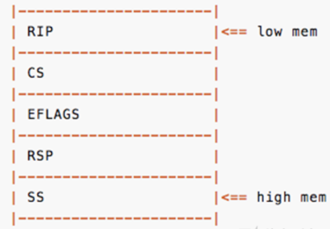- 

- 返回用户态时，恢复完寄存器值时，执行swapgs（64位）和 iret 指令
  - swapgs用于置换GS寄存器和KernelGSbase MSR寄存器的内容
  - 32位系统中不需要swapgs，直接iret返回即可

- linux源码目录结构
  - 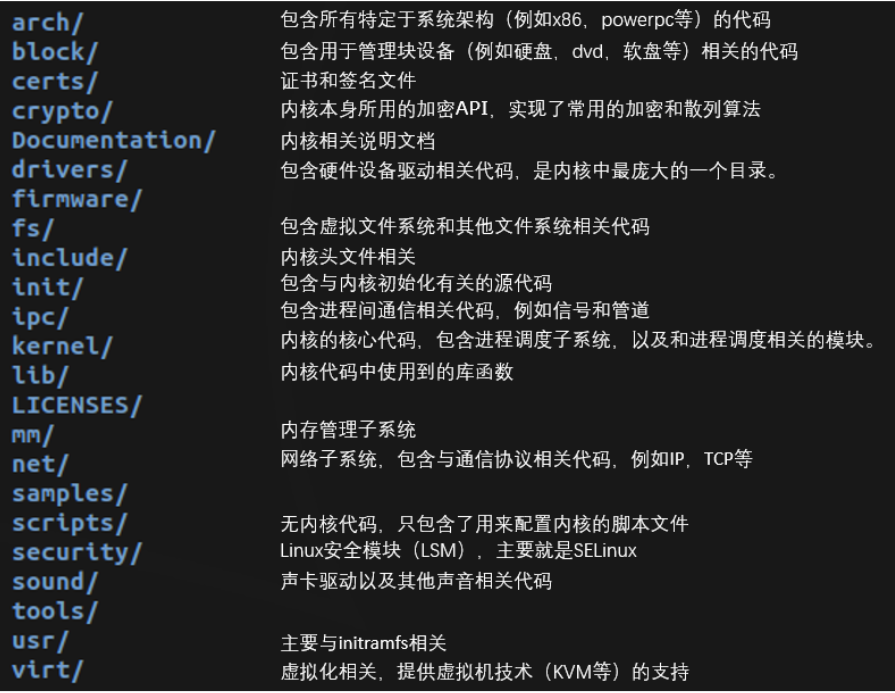
# linux内核pwn题 基本情况
- linux内核pwn中，一般不针对内核核心模块（进程调度、内存管理等）进行漏洞利用，一般漏洞位于lkm可加载模块中（驱动程序、内核扩展模块）

- 典型linux内核pwn题目构成
  - ko文件：存在漏洞的模块
  - bzImag文件：打包好的linux内核，用qemu启动该内核文件，gadget也在该文件中寻找
  - 文件系统文件：根据文件系统打包方式不同，可能是.cpio文件或.img文件
  - .sh启动脚本：用于qemu启动整个linux内核

- 典型启动启动脚本，使用qemu启动linux
  - qemu启动参数中增加 -gdb tcp::1234 -S 可以指定调试端口，并强制中断linux，等待调试器连接（这里最好用ubuntu 18.04，16.04有可能出现玄学问题，）
```bash
#!/bin/bash

stty intr ^]
cd `dirname $0`
timeout --foreground 600 qemu-system-x86_64 \
    -m 64M \
    -nographic \
    -kernel bzImage \
    -append 'console=ttyS0 loglevel=3 oops=panic panic=1 nokaslr' \
    -monitor /dev/null \
    -initrd initramfs.cpio \
    -smp cores=1,threads=1 \
    -cpu qemu64 2>/dev/null \
    -gdb tcp::1234 -S #使虚拟机启动时强制中断 将1234作为调试端口
```

- 内核文件形式
  - bzImag文件：bz方式压缩打包好的内核文件
  - vmlinux文件，未压缩打包的文件，其中可包含符号信息用于帮助调试

- bzImag文件转为vmlinux文件
  - linux源码目录下的scripts/extract-vmlinux来解压bzImage得到vmlinux
  - extract-vmlinux bzImage > vmlinux ，此时vmlinxu中不包含符号信息

- 利用vmlinux文件进行调试
  - gdb vmlinux

- 利用vmlinux文件寻找gadget
  - bjdump -d vmlinux > gadget + 使用编辑器搜索
  - 该方法快于ROPgadget或ropper工具搜索gadget

- 从文件系统中提取驱动程序（题目中漏洞驱动程序.ko可能不单独提供）
  - 挂载文件系统获得驱动程序
    - mkdir ./rootfs
    - sudo mount rootfs.img ./rootfs
    - 查看根目录的init或etc/init.d/rcS，该脚本是系统启动脚本，其中使用insmod加载驱动模块.ko，即可获得驱动程序路径
    - sudo umount rootfs
  - 解压文件系统获取驱动程序
    - mkdir extracted; cd extracted
    - cpio -i --no-absolute-filenames -F ../rootfs.cpio
    - 找到rcS等启动脚本，确定内核模块路径
    - find . | cpio -o --format=newc > ../rootfs.cpio

# linux内核漏洞类型和保护机制
- 漏洞类型
  - 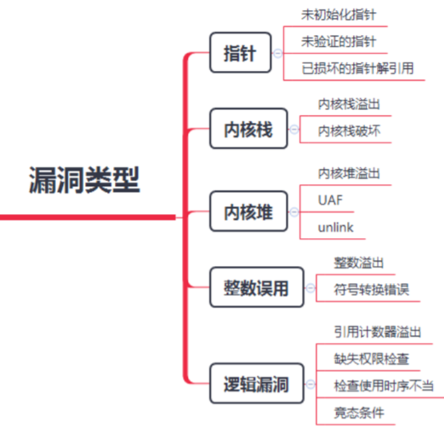
- 保护机制
  - KPTI：Kernel PageTable Isolation，内核页表隔离
    - KPTI 是一种通过隔离用户态和内核态的页表来减轻 Meltdown 漏洞影响的技术。其主要目的是防止用户态代码访问内核态内存，从而保护敏感数据。
    - 绕过思路
      - 侧信道攻击：使用缓存侧信道攻击（如 Spectre 和 Meltdown）来推测内核内存内容。
      - 内核漏洞利用：找到并利用其他内核漏洞，在不直接访问内核页表的情况下获取敏感信息。

  - KASLR：Kernel Address space layout randomization，内核地址空间布局随机化
    - 类似用户态aslr
    - KASLR 随机化内核和模块的加载地址，增加攻击者对内核内存布局预知的难度，从而防止利用固定地址的漏洞。
      - 绕过思路
        - 信息泄露：通过信息泄露漏洞（如 proc 文件系统）获取内核地址信息，破坏随机化效果。
        - 猜测攻击：使用暴力猜测内存地址的攻击方式，虽然成功率低，但在某些情况下可能有效。

  - SMEP：Supervisor Mode Execution Prevention，管理模式执行保护
    - SMEP下，内核态运行时，不允许执行用户态代码  
    - 绕过思路
      - ROP（Return-Oriented Programming）：利用内核中现有的代码片段（gadgets）进行编程，避免执行用户态代码。
      - 禁用 SMEP：如果存在可以控制 CR4 寄存器的漏洞，可以禁用 SMEP。

  - SMAP：Supervisor Mode Access Prevention，管理模式访问保护
    - SMAP下，内核态不允许访问用户态数据
    - 绕过思路
      - 类似于 SMEP，可以通过控制 CR4 寄存器的漏洞禁用 SMAP。

  - Stack Protector：Stack Protector又名canary，stack cookie 
    - 类似用户态stack canary
    - 绕过思路
      - 信息泄露：通过信息泄露漏洞获取 canary 值，然后在攻击中正确地重写 canary。
      - 任意地址写：不破坏canary的基础上修改栈中数据

  - kptr_restrict：允许查看内核函数地址
    - kptr_restrict 控制内核符号表的访问权限，防止非特权用户查看内核函数地址。
    - 绕过思路
      - 实现提取提权后，查看内核函数地址
      - 通过信息泄露获得内核函数地址

  - dmesg_restrict：允许查看printk函数输出，用dmesg命令来查看
    - dmesg_restrict 限制非特权用户访问内核日志信息，防止泄露内核地址和其他敏感信息。
    - 绕过思路：类似kptr_restrict：

  - MMAP_MIN_ADDR：不允许申请NULL地址 mmap(0,....)
    - MMAP_MIN_ADDR 设置用户态进程可以 mmap 的最低地址，防止 NULL 指针引用漏洞的利用。
    - 绕过思路
      - 提权为root

- SMEP与SMAP的开关都通过cr4寄存器来判断，因此可通过修改cr4的值来实现绕过SMEP，SMAP保护  
  - 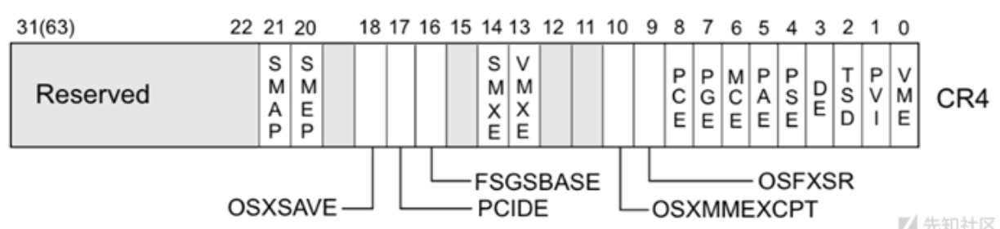

- 查看开启了哪些保护
  - cat /proc/cpuinfo
  - 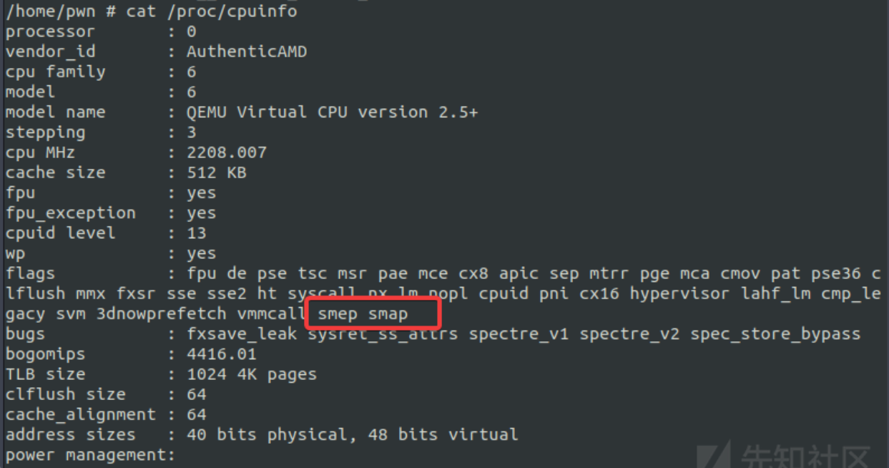

- 关闭保护
  - KASLR、SMEP、SMAP可通过修改startvm.sh来关闭
    - 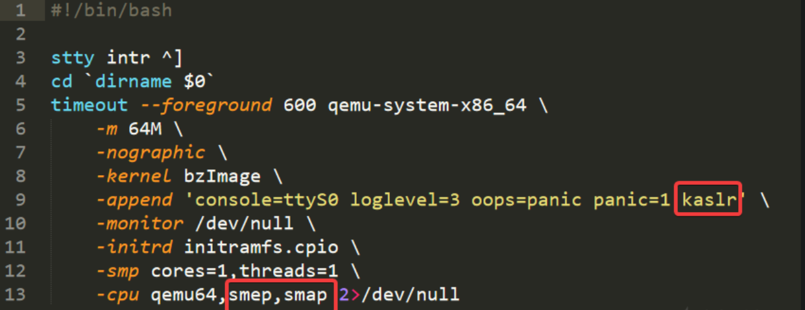
  - dmesg_restrict、dmesg_restrict可在rcS文件中修改关闭
    - 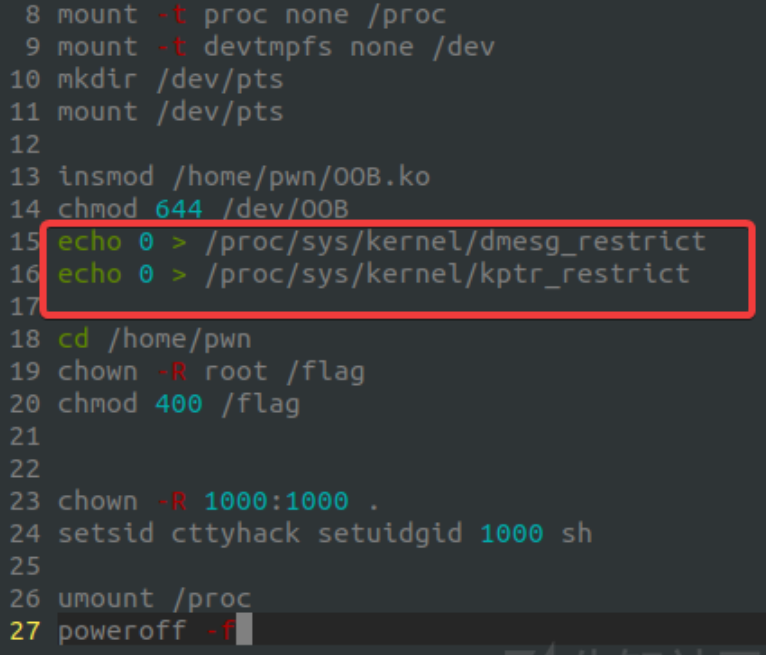
  - MMAP_MIN_ADDR是linux源码中定义的宏，可重新编译内核进行修改（.config文件中），默认为4k
    - 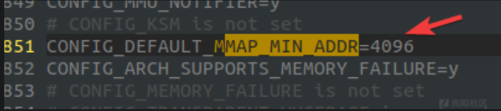

# 做题准备
  - 漏洞利用过程中需要几个固定内存地址，该内存地址分别对应关键数据结构或函数，所以做题前需要将linux内核的保护机制全部关闭

- 漏洞利用过程中关键数据结构
  - prepare_kernel_cred
    - 作用：prepare_kernel_cred 函数用于分配和初始化一个新的内核凭据结构（cred），通常用于创建一个新的用户凭据。
    - 签名：struct cred *prepare_kernel_cred(struct task_struct *daemon);
    - 用法：在内核漏洞利用中，通常传递 NULL 参数来创建具有 root 权限的凭据。
  - commit_creds
    - 作用：commit_creds 函数用于将一个已分配和初始化的 cred 结构应用到当前进程，从而改变进程的权限。
    - 签名：int commit_creds(struct cred *new);
    - 用法：在内核漏洞利用中，commit_creds 被用来将 prepare_kernel_cred 创建的 root 凭据应用到当前进程，从而提升权限。
  - 获得 prepare_kernel_cred 和 commit_creds 的地址后，可以通过构造恶意内核代码或利用漏洞来调用这些函数，从而获取 root 权限
  ```c
  // 提升权限的示例代码
  void get_root() {
      // 计算函数地址（假设 kernel_base 已知）
      unsigned long prepare_kernel_cred_addr = kernel_base + prepare_kernel_cred_offset;
      unsigned long commit_creds_addr = kernel_base + commit_creds_offset;
      
      // 函数指针
      struct cred* (*prepare_kernel_cred)(struct task_struct *) = (void *)prepare_kernel_cred_addr;
      int (*commit_creds)(struct cred *) = (void *)commit_creds_addr;

      // 获取 root 凭据并应用
      struct cred *new_cred = prepare_kernel_cred(NULL);
      commit_creds(new_cred);
  }
  ```

- KASLR 的作用是随机化内核和模块的加载地址，若未开启，则内核加载基址固定，可以通过内核加载基址+函数偏移的方法得到上述两函数地址（这些偏移可以通过符号表或反汇编得到）。若kaslr开启，则需要其他方法泄露内核加载基址

- 其他提权相关基础知识 见该资料中给出通过直接修改进程结构体中表示进程权限的字段，从而实现提权的思路
  - linux内核\linux设备驱动\高通加解密引擎提权漏洞解析.md # 基础知识

- 做题前具体操作
  - 关闭所有保护机制，可以在startvm.sh中把保护全部关掉，之前提到过
  - 需要以root权限启动虚拟机，
    - 启动的用户权限也是由rcS文件来控制的，找到setsid这一行，修改权限为0000
      - 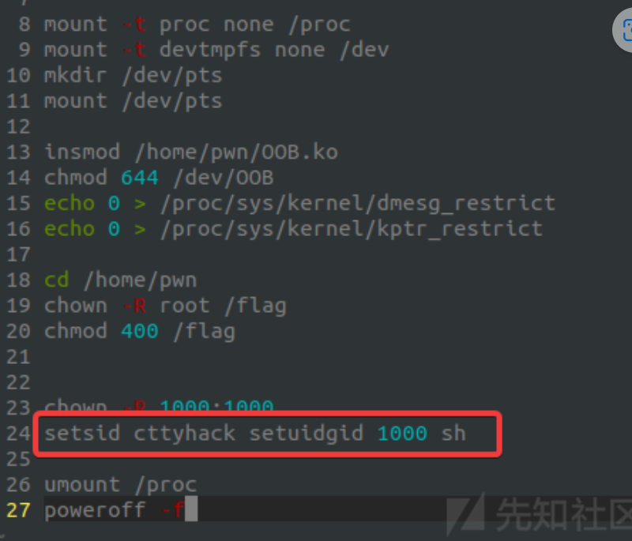
    - 获得驱动加载基址（因为漏洞位于驱动模块）
      - 启动后，执行lsmod可以看到驱动加载基址，可以用gdb调试时方便计算断点地址，这里也可以看到设备名称为OOB，路径为/dev/OOB
      - 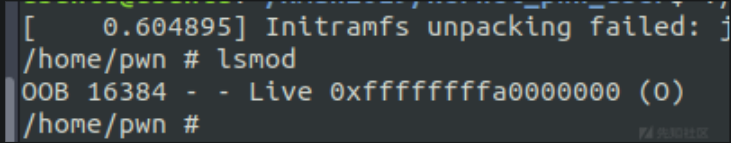
    - 获得关键函数地址
      - cat /proc/kallsyms | grep "prepare_kernel_cred"得到prepare_kernel_cred函数地址
        - 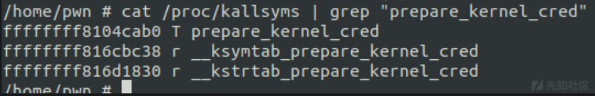
      - cat /proc/kallsyms | grep "commit_creds"得到commit_creds函数地址
        - 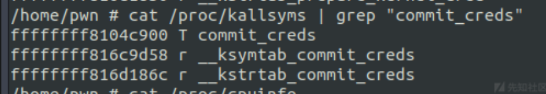
    - 编写exp.c，之后需要将exp编译并上传到qemu环境中执行，从而实现漏洞利用，作者给出脚本，通过脚本可以通过ssh将编译好的exp上传到qemu，同时在其中执行exp，从而实现漏洞利用
      ```python
      from pwn import *
      #context.update(log_level='debug')

      HOST = "10.112.100.47"
      PORT =  1717

      USER = "pwn"
      PW = "pwn"

      def compile():
          log.info("Compile")
          os.system("musl-gcc -w -s -static -o3 oob.c -o exp")

      def exec_cmd(cmd):
          r.sendline(cmd)
          r.recvuntil("$ ")

      def upload():
          p = log.progress("Upload")

          with open("exp", "rb") as f:
              data = f.read()

          encoded = base64.b64encode(data)

          r.recvuntil("$ ")

          for i in range(0, len(encoded), 300):
              p.status("%d / %d" % (i, len(encoded)))
              exec_cmd("echo \"%s\" >> benc" % (encoded[i:i+300]))

          exec_cmd("cat benc | base64 -d > bout")
          exec_cmd("chmod +x bout")

          p.success()

      def exploit(r):
          compile()
          upload()

          r.interactive()

          return

      if __name__ == "__main__":
          if len(sys.argv) > 1:
              session = ssh(USER, HOST, PORT, PW)
              r = session.run("/bin/sh")
              exploit(r)
          else:
              r = process("./startvm.sh")
              print util.proc.pidof(r)
              pause()
              exploit(r)
      ```
# 关于linux内核加载基址
- Linux 内核的默认加载基址取决于架构和配置。
- 在 x86_64 架构上，常见的内核默认加载基址是 0xffffffff81000000。
- 个地址在启用了 KASLR（Kernel Address Space Layout Randomization）时会被随机化，但仍然以 0xffffffff8 开头。具体地址可以通过某些信息泄露方法来确定
## 确定内核加载基址
- 内核加载地址的确定
  - 查看内核配置：可以通过查看内核的配置文件（比如 .config）中的 CONFIG_PHYSICAL_START 和 CONFIG_PHYSICAL_ALIGN 来确定物理加载地址。
  - 从内核符号表获取信息：通过 /proc/kallsyms 或 System.map 文件，可以获取具体的内核符号地址。
  - 信息泄露：在启用了 KASLR 的情况下，可以通过信息泄露漏洞获取内核加载基址。
- 假设我们有一个未启用 KASLR 的内核，基址为 0xffffffff81000000，可以通过以下步骤来验证：
```bash
# 查看 /proc/kallsyms 中的符号
cat /proc/kallsyms | grep 'T _stext'
# 结果可能类似于：
# ffffffff81000000 T _stext
```


# pwn例题
## level1
- 漏洞位于驱动程序
- init_module中可以确定驱动名称
- 驱动中共唯一一个函数中存在栈溢出，是ioctl的某个处理函数，使用copy_from_user将用户态数据拷贝到内核栈
  - 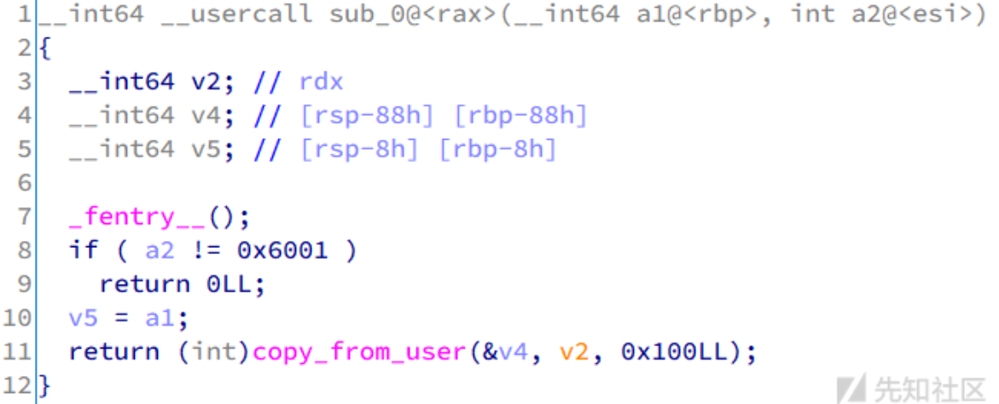
- 可以覆盖返回地址，因为没有保护，所以直接ret2usr，返回用户空间执行 prepare_kernel_cred和commit_creds 实现进程提权
- 详细见原文

## level2
- 与level1类似，开启了smep、smap、kaslr
- 漏洞函数中可以使用用户态数据溢出内核态栈，也可以将内核态栈数据拷贝到用户态
  - 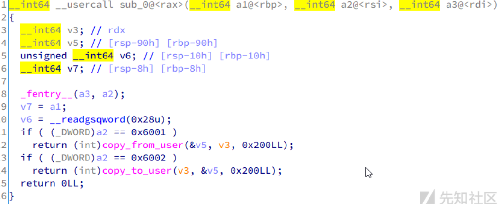
- 通过获得内核态栈中数据，可以泄露模块内核加载基址，之后使用gadget修改cr4来绕过smep、smap
- 通过内存泄露，得到内核栈中数据如下
  - x86-64架构下，内核加载基址一般以0xffffffff8，寻找栈中类似的指针，此时因为没开aslr，所以可以找到下图中的0xffffffff81开头的指针
    - 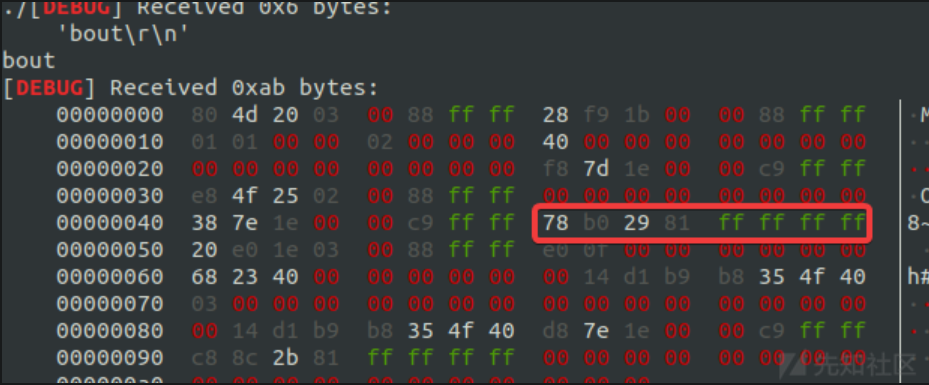
  - 这里还要泄露canary（见上图v6变量），一般来说，canary会在rbp-8的位置，视具体情况可能有些偏移，且canary是一个高字节为\x00的随机字符串，还是比较容易找的。
    - 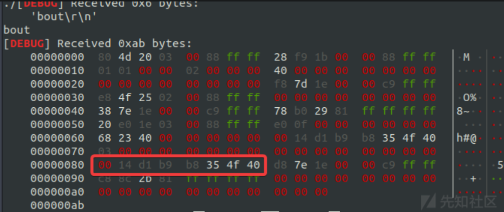
- 寻找cr4寄存器相关的gadget进行smap、smep的绕过
  - 通过解压bzImage获得vmlinux，从而在其中寻找gadget
    - ~/linux-4.20/scripts/extract-vmlinux ./bzImage > vmlinux
    - objdump -d ./vmlinux > gadget
  - 在gadget中寻找哪些寄存器能修改cr4，例如rdi能修改，则再去寻找哪些gadget能赋值rdi，从而构成gadget链，实现 ***修改cr4为0x6f0，关闭smep、smap***
    - 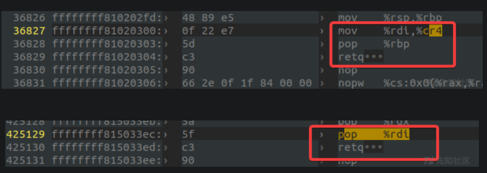
 - 具体利用见原文

## level3
- qemu启动脚本中有 -smp 2选项，即使用两个对称处理器，推测可能的漏洞类型为double fetch
  - 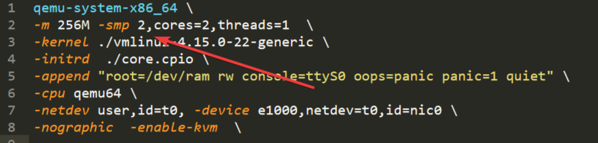

- 关于double fetch 参考资料：https://lantern.cool/note-pwn-kernel-double-fetch/
  - Double Fetch 从漏洞原理上属于条件竞争漏洞，是一种内核态与用户态之间的数据访问竞争。
  - 用户空间向内核转递数据时，内核先通过通过 copy_from_user 等拷贝函数将用户数据拷贝至内核空间进行校验及相关处理，但在输入数据较为复杂时，内核可能只引用其指针，而将数据暂时保存在用户空间进行后续处理。此时，该数据存在被其他恶意线程篡改风险，造成内核验证通过数据与实际使用数据不一致，导致内核代码执行异常。
  - 具体攻击场景
    - 一个典型 Double Fetch 漏洞原理如下图所示，一个用户态线程准备数据并通过系统调用进入内核，该数据在内核中有两次被取用。
      - 第一次取用数据进行安全检查 (如缓冲区大小、指针可用性等), 当检查通过后内核第二次取用数据进行实际处理。
      - 而在两次取用数据之间，另一个用户态线程可创造条件竞争，对已通过检查的用户态数据进行篡改，在真实使用时造成访问越界或缓冲区溢出，最终导致内核崩溃或权限提升。
      - 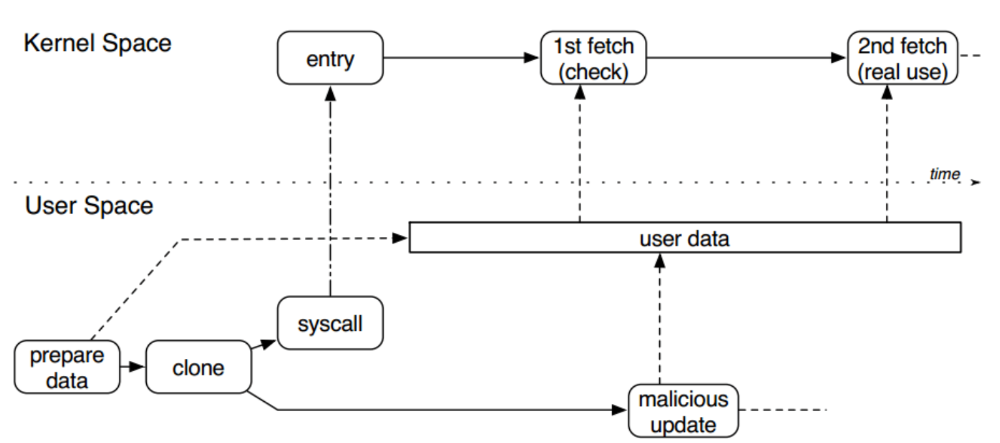

- 该题目中，需要用到double，即通过先输入特定用户态内存地址，从而进入指定if条件，之后将该内存地址变量值通过double fetch修改为falg的内核态内存地址，从而输出保存在内核态空间中的falg
- 详细题解见原文

- ctfwiki中对该题也有讲解
  - https://ctf-wiki.org/pwn/linux/kernel-mode/exploitation/race/double-fetch/

```c
__int64 __fastcall baby_ioctl(__int64 a1, __int64 choice)
{
  FLAG *s1; // rdx
  __int64 v3; // rcx
  __int64 result; // rax
  unsigned __int64 v5; // kr10_8
  int i; // [rsp-5Ch] [rbp-5Ch]
  FLAG *s; // [rsp-58h] [rbp-58h]

  _fentry__(a1, choice);
  s = s1;//这里s1和s都表示用户输入的数据，赋值不在当前函数中
  if ( choice == 0x6666 )
  {
    // 此处flag是全局变量，目标是获取该变量的值，此处可以输出flags变量的地址，供后期使用    
    printk("Your flag is at %px! But I don't think you know it's content\n", flag, s1, v3);
    result = 0LL;
  }
  else if ( choice == 0x1337
         && !_chk_range_not_ok(s1, 16LL, *(__readgsqword(&current_task) + 0x1358)) 
         && !_chk_range_not_ok(s->flag, s->len, *(__readgsqword(&current_task) + 0x1358))
         && s->len == strlen(flag) )            // a4
         //_chk_range_not_ok函数中，a1+a2小于a3，则返回true，否则返回flase
         //(__readgsqword(&current_task) + 0x1358) 用户态地址空间最高地址
         //s->flag, s->len都是用户输入的数据，分别是一个内存地址和一个长度变量
         //说明要进入该if，输入的内存地址值（s->flag+s->len）需要在用户态地址空间范围内，同时满足长度需求
         //要进入该if，还需要s->len == strlen(flag)，可以在满足之前两个条件的基础上，尝试不同的s->len，如果s->len正确，则进入if，一定会触发s->flag[i] != flag[i]从而返回22，如果如果s->len错误，则无法触发返回22，由此可以爆破flag的实际长度
  {
    for ( i = 0; ; ++i )
    {
      v5 = strlen(flag) + 1;
      if ( i >= v5 - 1 )
        break;
        //此处，若用户输入的内存地址s->flag 和 flag全局变量的内存地址相同，则触发break，跳出循环，执行printk，打印位于内核空间的flag值
        //问题是 要进入当前分支，需要满足前述_chk_range_not_ok，当s->flag等于flag全局变量的地址时，s->flag是一个内核空间地址，不可能通过校验
        //故需要通过条件竞争，在程序执行流进入此处之后，将s->flag修改为flag全局变量的地址
      if ( s->flag[i] != flag[i] )
        return 22LL;
    }
    printk("Looks like the flag is not a secret anymore. So here is it %s\n", flag, flag, ~v5);
    result = 0LL;
  }
  else
  {
    result = 14LL;
  }
  return result;
}

bool __fastcall _chk_range_not_ok(__int64 a1, __int64 a2, unsigned __int64 a3)
{
  bool v3; // cf
  unsigned __int64 v4; // rdi
  bool result; // al

  v3 = __CFADD__(a2, a1);
  v4 = a2 + a1;
  if ( v3 )
    result = 1;
  else
    result = a3 < v4;
  return result;
}
```
## level4
- 保护全开，从qemu启动脚本中可以看出开启了kaslr、smep、smap
```c

__int64 __fastcall sub_0(__int64 a1, __int64 a2)
{
  __int64 v2; // rdx
  __int64 a3; // r13
  BUF *buf; // rbx
  __int64 i; // rax
  __int64 v7; // r12
  CHUNK *chunk_1; // rax
  char *call_arg; // rdx
  __int64 v10; // rax
  CHUNK *chunk; // rsi
  __int64 idx; // rax
  __int64 ptr; // rdi

  _fentry__(a1, a2);
  a3 = v2;//用户可控数据为v2，即此处的a3
  buf = kmem_cache_alloc_trace(kmalloc_caches[4], 0x6000C0LL, 0x10LL);
  //将用户可控数据保存在buf中，根据后续使用，可以确定buf中至少有idx和data两个变量
  copy_from_user(buf, a3, 16LL);
  switch ( a2 )
  {
    case 0x6008:                                // delete
      idx = buf->idx;
      //pool是全局变量，表示内存池，当前分支是根据用户输入的idx将内存池中对应chunk释放。注意此处释放后为将ptr置为0.故存在uaf隐患
      if ( idx <= 0x1F )
      {
        ptr = pool[idx];
        if ( ptr )
          kfree(ptr);                           // no clean
      }
      break;
    //根据该分支可知，pool中的每个chunk中包含函数地址和参数，此处是根据提供的idx调用对于chunk中的函数
    case 0x6009:                                // call
      v10 = buf->idx;
      if ( v10 <= 0x1F )
      {
        chunk = pool[v10];
        if ( chunk )
          _x86_indirect_thunk_rax(chunk->arg1, chunk, 0x48LL);// call rax
      }
      break;
    // 很简单，向pool中添加chunk，chunk中默认的函数是copy_to_user，参数用户可以指定，故可以指定为将内核数据拷贝到用户空间，实现信息泄露，绕过aslr
    // 同时，因为上述存在针对chunk指针的uaf，所以利用思路如下，申请内存池-》释放内存池中的chunk-》使用堆喷，使用socket连接中的sendmsg进行堆喷，chunk的大小可以通过msg结构体中的msg_controllen来进行调整，堆喷过程将上述释放的chunk申请到，即可任意修改chunk中函数地址-》根据idx调用0x6009对应功能，从而执行任意函数
    // 实施两次函数执行，第一次通过gadgets修改CR4，关闭smap和smep保护，第二次直接调用提权函数（commit_creds(prepare_kernel_cred(0))）
    case 0x6007:                                // add
      i = 0LL;
      while ( 1 )
      {
        v7 = i;
        if ( !pool[i] )
          break;
        if ( ++i == 0x20 )
          goto LABEL_4;
      }
      chunk_1 = kmem_cache_alloc_trace(kmalloc_caches[1], 0x6000C0LL, 72LL);
      call_arg = buf->data;
      pool[v7] = chunk_1;
      chunk_1->call_func = &copy_to_user;       // call func
      chunk_1->arg1 = call_arg;                 // call args
      break;
  }
LABEL_4:
  kfree(buf);
  return 0LL;
}
```
- 完整了利用见原文

## babykernel
- copy_from_user 导致的栈溢出，，开了smap, smep，没有kaslr，漏洞利用方面，先通过rop修改cr4寄存器，关闭smap, smep，之后ret2usr调用 commit_creds(prepare_kernel_cred(0)); 实现进程提权


# CVE-2019-9213
- 该漏洞属于逻辑漏洞，最终效果可以将0内存地址实现内存映射，从而在读取操作0内存地址上的数据，如果配合空指针解引用漏洞，有潜力实现提权
- 现有两种提权的exp——CVE-2019-9213+cve-2018-5333 和 CVE-2019-9213+CVE-2019-8956 。
  - https://raw.githubusercontent.com/bcoles/kernel-exploits/master/CVE-2018-5333/cve-2018-5333.c
  - https://www.anquanke.com/post/id/200303

- 详细学习过程：linux内核\linux内核历史漏洞分析\CVE-2019-9213.md