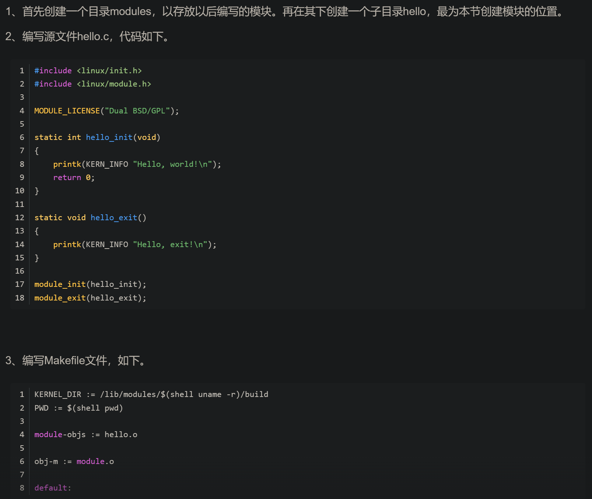
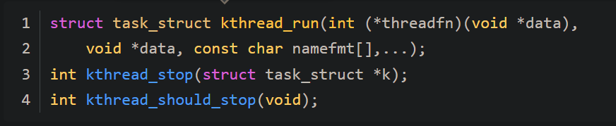
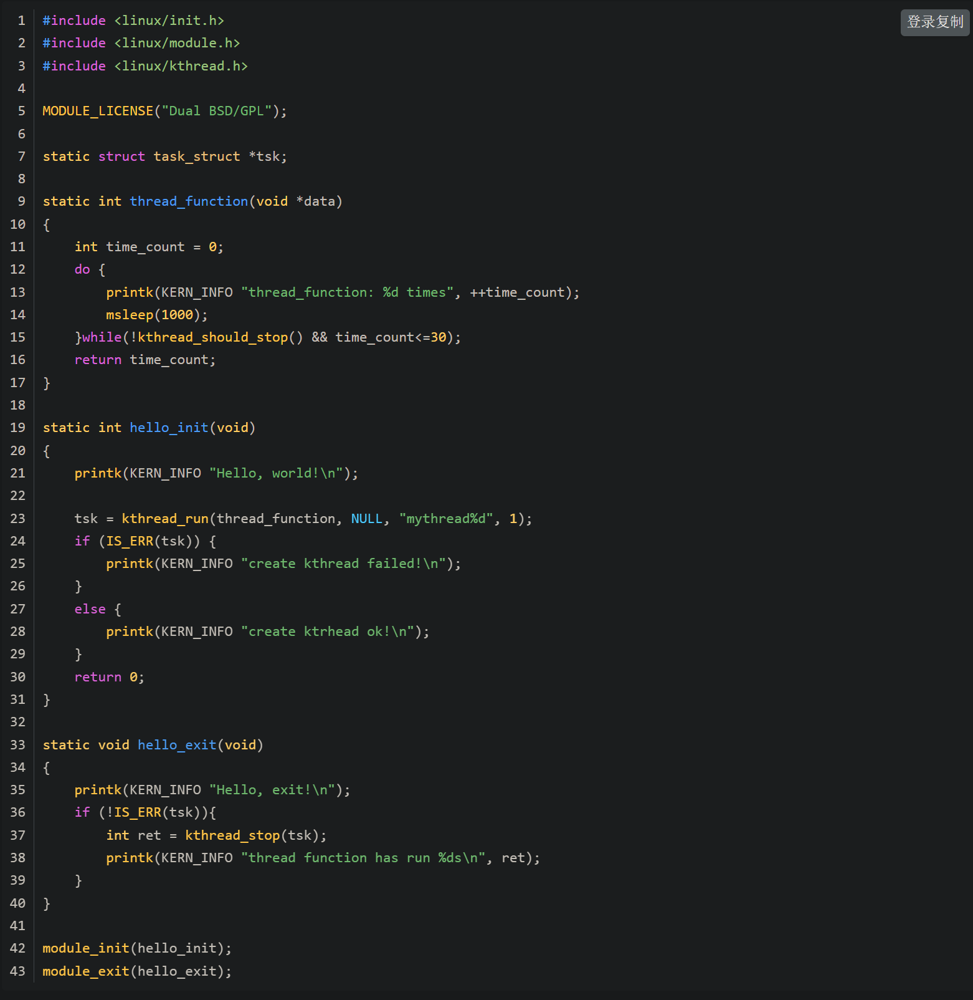
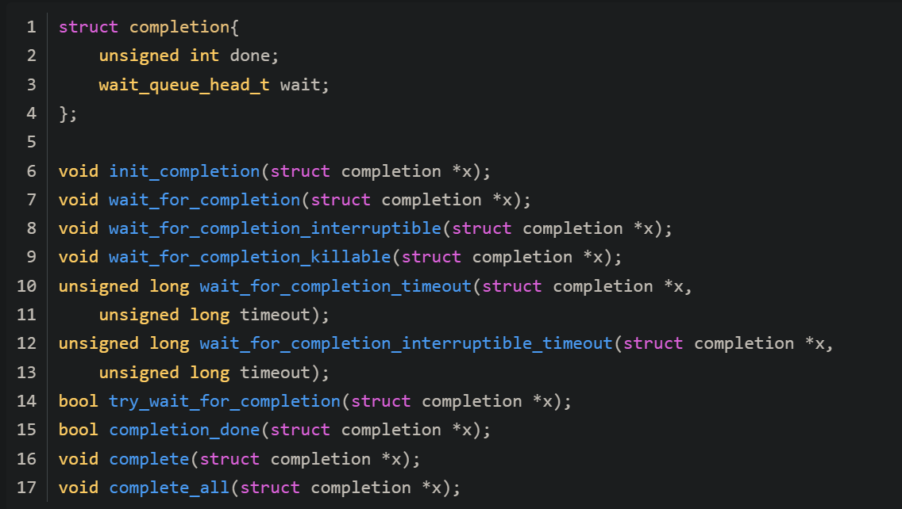

# 资料来源
- linux内核初步学习路径，从ctf开始 该博客作者是OSR trustzone课程的作者
  - https://github.com/xuanxuanblingbling/linux_kernel_module_exercise?tab=readme-ov-file
    - linux_kernel_module_exercise-master.zip
  - 其中推荐了一篇入门文章 
  - https://xz.aliyun.com/t/7625?time__1311=n4%2BxnD0DyDuDgDjhlDlhAePiKeeGqqi%3DKze8e74D 
    - Linux Kernel Pwn 初探 - 先知社区 (2024_2_21 17_00_06).html


# linux 内核 初探：运行你代码在内核态
- 基础的内核Pwn题多是出在外挂的内核模块上，而不是内核本体

- 三种内核攻击入口
  - 用户态打内核：用户态通过中断陷入内核，最常见的是ioctl等系统调用进入内核
    - 引入资料：https://xz.aliyun.com/t/7625?time__1311=n4%2BxnD0DyDuDgDjhlDlhAePiKeeGqqi%3DKze8e74D 
      - Linux Kernel Pwn 初探 - 先知社区 (2024_2_21 17_00_06).html
  - 从外设打内核态：接口是各种外设的输入，比如空口（wifi、蓝牙等）、线缆（USB、TCP/IP等）、平行系统间（TEE与REE）的通信报文，如：Bleeding Tooth：Linux蓝牙驱动远程代码执行分析与利用、在Tesla Model S上实现Wi-Fi协议栈漏洞的利用、探索澎湃S1的安全视界
  - 更底层控内核态：已经能控了内核态的更底层（x86的ring-1/2/3，ARM的EL2/3），则可直接控制内核态的代码执行，如：checkra1n、checkm30，注：负的CPU保护环
    - 类似从挖掘bootROM中启动代码的漏洞，从而影响内核

- 内核攻击目的
  - 控用户态：对用户态（x86的ring3，ARM的EL0）进行彻底的控制，突破其安全措施（自主访问控制，SELinux等），进而获得用户态的最高权限，这也是最常见的目标。
  - 往底层、其他系统打：拿到了通往底层、其他系统的更广阔的接口，如：利用 ARM 核间调试漏洞获得 SoC 硬件最高权限（上）、利用 ARM 核间调试漏洞获得 SoC 硬件最高权限（下）

- 本地提权 LPE 用户态打内核态，以此回到用户态获得最高权限

## 正向开发
- linux模块编程（一）——加载你的模块 该系列文章可读
  - https://blog.csdn.net/qb_2008/article/details/6835677
  - 
- linux模块编程（二）——运行不息的内核线程kthread
  - https://blog.csdn.net/qb_2008/article/details/6835783
  - 在上述最简单的内核模块中，创建一个内核线程，用于完成模块作用，涉及三个关键api：kthread_run、kthread_stop、kthread_should_stop
    - 
  - 使用该三个api，创建内核线程，在init中启动内核线程，exit中结束内核线程
    - 
  - 内核模块编译加载完毕后，使用ps -e可以查看到对应内核线程
- linux模块编程（三）——线程的约会completion
  - 即 completion 完成量 也算是信号量的一种
  - 内核中线程同步大多使用信号量，互斥资源保护多使用自旋锁或互斥锁
  - 完成量可以作为一种线程间通讯的方法，用于a进程告诉b进程某任务已经完成
  - 
    - init相关api用于初始化完成量
    - 等待完成量的线程调用wait_for相关api，等待过程中会陷入阻塞
    - 拥有完成量的线程调用complete相关api，表示事件完成，等待中完成量的线程可以退出阻塞，从而继续执行
- linux模块编程（四）——消息的使者list
  - 即使用消息队列在两个线程之间传递数据
  - 上述基础上，一个模块创建两个线程
    - watchdog线程
      - 用于调用complete相关函数，表示完成量完成，从而唤醒work线程
      - 创建work结构体，并将其加入到对应链表中，作为生产者
    - work线程
      - 调用wati_for相关函数，阻塞等待完成量完成
      - 从链表中获得并删除work结构体，并进行相应操作，作为消费者
- linux内核的学习方法
  - 学最新的内核
  - linux内核的学习方法，由简单模块到复杂模块 
  - 看代码，找到一个中等体量模块，与其他模块耦合度尽量低，推荐usb模块，规范清晰
  - 写代码

- linux API
  - 可以看官方文档，有一些书籍
  - linux内核快速发展，不会提供稳定的内核api，需要自己查看api的实现，从而理解其功能

- 编写一个内核模块的hello world
```c
#include <linux/init.h>
#include <linux/module.h>
 
MODULE_LICENSE("GPL");
 
static int hello_init(void)
{
    printk(KERN_INFO "Hello, world!\n");
    return 0;
}
 
static void hello_exit(void)
{
    printk(KERN_INFO "Hello, exit!\n");
}
 
module_init(hello_init);
module_exit(hello_exit);
```
- 实现了一个看门狗模块
  - 看门狗是一个系统进程，其中存在一个计时器，看门狗运行后，计时器开始运行，存在一个数值，当计时器积累到大于该数值时，看门狗会认为程序出现异常，实施强制系统复位
  - 关键系统进程需要周期性与看门狗进程交互，从而将其计数器置为0，重新计数（称之为喂狗），避免触发强制系统复位
  - 当关键进程被gdb调试时，可能导致看门狗超时，导致系统重置
  - 通过删除看门狗所依赖的ko模块、或patch看门狗进程，可以绕过看门狗，实现对关键进程的调试
```c
#include <linux/init.h>
#include <linux/module.h>
#include <linux/reboot.h>
#include <linux/kthread.h>
#include <linux/delay.h>
#include <linux/proc_fs.h>

MODULE_LICENSE("GPL");

struct task_struct * result;
int clock;

int dog(void * argc)
{   
    while(!kthread_should_stop()){
        ssleep(1);
        printk(KERN_INFO "hidog clock: %d\n",++clock);
        if(clock>30) emergency_restart();
    }
    return 0;
}

int hidog_open(struct inode *inode, struct file *file){
    clock = 0;
    return 0;
}

const struct proc_ops myops = {
    .proc_open = hidog_open
};

static int hidog_init(void)
{
    printk(KERN_INFO "hidog, init!\n");
    result = kthread_create_on_node(dog, NULL, -1, "hidog");
    wake_up_process(result);
    proc_create("hidog",0666,NULL,&myops);
    return 0;
}
 
static void hidog_exit(void)
{
    kthread_stop(result);
    remove_proc_entry("hidog", NULL);
    printk(KERN_INFO "hidog, exit!\n");
}
 
module_init(hidog_init);
module_exit(hidog_exit);
```
- 内核文件读写
  - 通常来说是用户态实现文件读写功能
  - 内核态使用 kernel_read /filp_open /filp_close可以实现读写文件
```c
//模块装载后即可读文件
#include <linux/init.h>
#include <linux/module.h>
#include <linux/fs.h>
 
MODULE_LICENSE("GPL");

static char buf[100]; 
mm_segment_t old_fs;

static int readfile_init(void)
{
    struct file *fp;
    loff_t pos = 0;

    printk("readfile enter\n");
    fp  = filp_open("/flag", O_RDWR ,0);
    kernel_read(fp, buf, sizeof(buf), &pos);
    printk("read: %s\n", buf);
    filp_close(fp, NULL);
    return 0;
}
 
static void readfile_exit(void)
{
    printk(KERN_INFO "readfile, exit!\n");
}
 
module_init(readfile_init);
module_exit(readfile_exit);
```
```c
//模块装载后，通过proc接口读文件

#include <linux/init.h>
#include <linux/module.h>
#include <linux/fs.h>
#include <linux/proc_fs.h>

MODULE_LICENSE("GPL");

static char buf[100];

static ssize_t flag_read(struct file *file, char __user *ubuf, size_t count, loff_t *ppos)
{
    struct file *fp;
    loff_t pos = 0;

    if(*ppos > 0) return 0;
    fp  = filp_open("/flag", O_RDWR ,0);
    int len = kernel_read(fp, buf, sizeof(buf), &pos);
    printk("read: %s\n", buf);
    filp_close(fp, NULL);

    copy_to_user(ubuf,buf,len);
    *ppos = len;
    return len;
}

const struct proc_ops myops = {
    .proc_read  = flag_read//通过proc中的read操作调用读文件
};

static int readfile_init(void)
{
    printk("readfile enter\n");
    proc_create("flag",0666,NULL,&myops);
    return 0;
}

static void readfile_exit(void)
{
    remove_proc_entry("flag", NULL);
    printk(KERN_INFO "readfile, exit!\n");
}

module_init(readfile_init);
module_exit(readfile_exit);
```

## 内存调试
- 调试方案
  - 双机调试或者使用qemu调试的道理
  - 硬件层次的JTAG以调试你的代码
  - log调试
  - linux的proc提供了接口用于读写内核内存，安全考虑一般不开启
- 一个模块，用于读内核内存
```c
//用法：向/proc/kmem写入目标地址和长度，然后在cat这个文件即可，默认会打印printk的内存： 
//到此，我们不需要什么qemu，kdb，kgdb，也可以直接看到我们本机内核的内存。
#include <linux/init.h>
#include <linux/module.h>
#include <linux/proc_fs.h>

MODULE_LICENSE("GPL");

char * addr;
int length;

static ssize_t kmem_write(struct file *file, const char __user *ubuf, size_t count, loff_t *ppos) 
{
    char buf[0x1000];
    copy_from_user(buf, ubuf, count);
    sscanf(buf,"%llx %x",&addr,&length);
    printk("addr: %llx, length: %x\n",addr,length);
    return count;
}

static ssize_t kmem_read(struct file *file, char __user *ubuf, size_t count, loff_t *ppos) 
{
    printk(KERN_INFO "kmem, read!\n");
    if(*ppos > 0) return 0;
    char buf[0x1000];
    
    int len = sprintf(buf,"addr: 0x%llx length: 0x%x\n",addr,length);
    int i=0;
    for(i;i<length;i++){
        if((i%8==0)  && (i!=0)) len += sprintf(buf+len,"  ");
        if((i%16==0) && (i!=0)) len += sprintf(buf+len,"\n");
        len += sprintf(buf+len,"%02X ",addr[i] & 0xff);
    }
    len += sprintf(buf+len,"\n");
    
    copy_to_user(ubuf,buf,len);
    *ppos = len;
    return len;
}

const struct proc_ops myops = {
    .proc_write = kmem_write,
    .proc_read  = kmem_read
};

static int kmem_init(void)
{
    printk(KERN_INFO "kmem, init!\n");
    addr = (char *)printk;
    length = 0x20;
    proc_create("kmem",0666,NULL,&myops);
    return 0;
}
 
static void kmem_exit(void)
{
    remove_proc_entry("kmem", NULL);
    printk(KERN_INFO "kmem, exit!\n");
}
 
module_init(kmem_init);
module_exit(kmem_exit);
```

## 内核本体
- 不必dump内存，内核二进制本身就可以通过文件系统访问到，它就在/boot目标下：
```bash
$ uname -r
$ sudo file /boot/vmlinuz-5.11.0-25-generic 
/boot/vmlinuz-5.11.0-25-generic: Linux kernel x86 boot executable bzImage
```

- 将内核二进制文件转为带符号的elf文件，从而方便逆向
  - https://blog.csdn.net/qq_40421991/article/details/111241980
    - Linux中提取内核vmlinux并转化为带有symbol name的可分析elf-CSDN博客 (2024_7_14 23_24_46).html
- 使用到的工具
  - https://blog.csdn.net/jasonchen_gbd/article/details/44025681
    - 内核符号表的生成和查找过程 需要付费看
  - https://github.com/torvalds/linux/blob/master/scripts/extract-vmlinux
    - 将vmlinuz解压成vmlinux
    ```bash
    #!/bin/sh
    # SPDX-License-Identifier: GPL-2.0-only
    # ----------------------------------------------------------------------
    # extract-vmlinux - Extract uncompressed vmlinux from a kernel image
    #
    # Inspired from extract-ikconfig
    # (c) 2009,2010 Dick Streefland <dick@streefland.net>
    #
    # (c) 2011      Corentin Chary <corentin.chary@gmail.com>
    #
    # ----------------------------------------------------------------------

    check_vmlinux()
    {
      # Use readelf to check if it's a valid ELF
      # TODO: find a better to way to check that it's really vmlinux
      #       and not just an elf
      readelf -h $1 > /dev/null 2>&1 || return 1

      cat $1
      exit 0
    }

    try_decompress()
    {
      # The obscure use of the "tr" filter is to work around older versions of
      # "grep" that report the byte offset of the line instead of the pattern.

      # Try to find the header ($1) and decompress from here
      for	pos in `tr "$1\n$2" "\n$2=" < "$img" | grep -abo "^$2"`
      do
        pos=${pos%%:*}
        tail -c+$pos "$img" | $3 > $tmp 2> /dev/null
        check_vmlinux $tmp
      done
    }

    # Check invocation:
    me=${0##*/}
    img=$1
    if	[ $# -ne 1 -o ! -s "$img" ]
    then
      echo "Usage: $me <kernel-image>" >&2
      exit 2
    fi

    # Prepare temp files:
    tmp=$(mktemp /tmp/vmlinux-XXX)
    trap "rm -f $tmp" 0

    # That didn't work, so retry after decompression.
    try_decompress '\037\213\010' xy    gunzip
    try_decompress '\3757zXZ\000' abcde unxz
    try_decompress 'BZh'          xy    bunzip2
    try_decompress '\135\0\0\0'   xxx   unlzma
    try_decompress '\211\114\132' xy    'lzop -d'
    try_decompress '\002!L\030'   xxx   'lz4 -d'
    try_decompress '(\265/\375'   xxx   unzstd

    # Finally check for uncompressed images or objects:
    check_vmlinux $img

    # Bail out:
    echo "$me: Cannot find vmlinux." >&2
    ```
  - https://github.com/marin-m/vmlinux-to-elf
    - vmlinux-to-elf-master.zip
    - 恢复vmlinux为IDA可以解析其符号表的ELF，运行时间较长
    - 然后使用IDA分析最后的生成的vmlinux.elf，可以看到入口是startup_64
    - 可以使用之前的读内核内存的模块，读取内核内存，从而与ida反汇编结果进行对比分析
    - 因为存在内核基址的随机化，所以IDA结果和实际不同，至此我们可以放心的看IDA中的逆向结果来认识内核二进制了。

- $ ./extract-vmlinux.sh  ./vmlinuz-5.11.0-25-generic  > vmlinux
- $ vmlinux-to-elf ./vmlinux ./vmlinux.elf

```bash
$ file vmlinuz-5.11.0-25-generic 
vmlinuz-5.11.0-25-generic: Linux kernel x86 boot executable bzImage, version 5.11.0-25-generic (buildd@lgw01-amd64-038) #27~20.04.1-Ubuntu SMP Tue Jul 13 17:41:23 UTC 2021, RO-rootFS, swap_dev 0x9, Normal VGA
$ file ./vmlinux
./vmlinux: ELF 64-bit LSB executable, x86-64, version 1 (SYSV), statically linked, BuildID[sha1]=c0263a3075bc0a9388365ddf35ab5422da3356a9, stripped
$ file ./vmlinux.elf 
./vmlinux.elf: ELF 64-bit LSB executable, x86-64, version 1 (SYSV), statically linked, BuildID[sha1]=c0263a3075bc0a9388365ddf35ab5422da3356a9, not stripped
```

