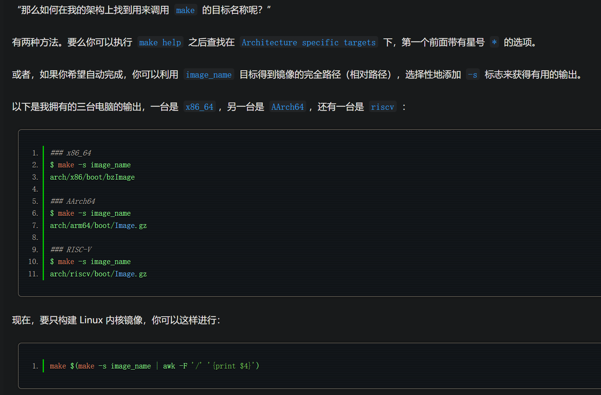
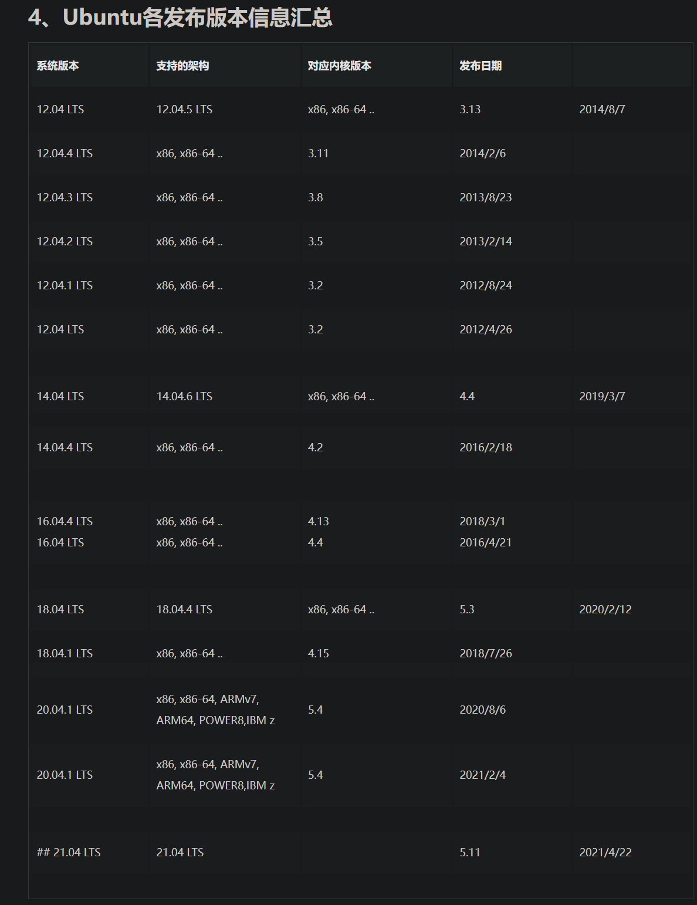

# 参考资料
- https://blog.csdn.net/Breeze_CAT/article/details/127305138

## https://linux.cn/article-16252-1.html
- 技术_Linux 内核动手编译实用指南 (2024_7_24 11_57_17).html
- 文中提到下载得到linux内核源码后，配置并修改.config文件的策略
  - 配置.config的方法
    - 使用你的 Linux 发行版的配置作为基础（推荐做法）
      - 此处涉及将当前发行版.config文件拷贝到源码并使用make olddefconfig相关命令，详见原文
    - 使用默认的，通用的配置
      - make defconfig 使用默认配置
  - 配置完毕config后，修改.config使用如下方法
    - make menuconfig
      - 在此界面，你可以根据各选项的类型来进行切换操作。
      - 有两类可切换选项：
        - 布尔状态选项：这类选项只能关闭（[ ]）或作为内建组件开启（[*]）。
        - 三态选项：这类选项可以关闭（< >）、内建（<*>），或作为可加载模块（<M>）进行构建。
        - 想要了解更多关于某个选项的信息，使用上/下箭头键导航至该选项，然后按 <TAB> 键，直至底部的 < Help > 选项被选中，然后按回车键进行选择。此时就会显示关于该配置选项的帮助信息。
      - 在修改选项时请务必谨慎。
        - 当你满意配置后，按 <TAB> 键直到底部的 < Save > 选项被选中。然后按回车键进行选择。然后再次按回车键（记住，此时不要更改文件名），就能将更新后的配置保存到 .config 文件中。

- .config配置完毕后，make编译之前，可以为内核设置自定义标签 （非必须）
  - ./scripts/config --file .config --set-str LOCALVERSION "-pratham"
  - 此时构建的是 6.5.5 版本内核，而 LOCALVERSION 字符串被设为 -pratham，因此运行 uname -r 命令时版本名将会是 6.5.5-pratham

- 编译内核命令
  - make -j$(nproc) 2>&1 | tee log
  - 其中的 -j 选项用于指定并行编译任务的数量。而 nproc 命令用于返回可用处理单位（包括线程）的数量。因此，-j$(nproc) 其实意味着“使用我拥有的 CPU 线程数相同数量的并行编译任务”。
  - 2>&1 会将 STDOUT 和 STDIN 重定向到相同的文件描述符，并通过管道传输给 tee 命令，这会将输出存储在一个名为 log 的文件，并且在控制台打印出完全相同的文本。如果你在构建时遇到错误，并希望回顾日志来检查出了什么问题，这将会十分有用。遇到那种情况，你只需要简单执行 grep Error log 命令就能找到线索。

- make的相关选项
  - make bzImage
    - 对于 x86_64，Linux 内核的默认镜像名称是 bzImage。因此，如果你只需要构建引导所需的 Linux 内核，你可以像下面这样设定 bzImage 为目标
    - 不同架构中，Linux 内核的默认镜像名不同，确定对应架构中的默认镜像名
      - 

- make的clean操作
  - clean：除了 .config 文件外，删除几乎所有其他内容。
  - mrproper：执行了 make clean 的所有操作外，还会删除 .config 文件。
  - distclean：除了执行 make mrproper 的所有操作外，还会清理任何补丁文件。

## https://doc.embedfire.com/lubancat/build_and_deploy/zh/latest/building_image/building_kernel/building_kernel.html
- 检查当前系统中内核配置情况
  -  sudo wget https://raw.githubusercontent.com/moby/moby/master/contrib/check-config.sh
  -  sudo chmod 755 ./check-config.sh
  -  ./check-config.sh

- 编译内核依赖的工具
  - sudo apt install make gcc-arm-linux-gnueabihf gcc bison flex libssl-dev dpkg-dev lzop vim


## https://blog.csdn.net/Breeze_CAT/article/details/123787636
- [kernel]linux内核基础_ 版本、源码、编译与调试_emuc b202 linux 内核 5.15.0-CSDN博客 (2024_7_24 16_58_31).html
- ***该文章的作者的思路是为了复现内核漏洞，直接寻找对应内核版本的ubuntu发行版进行编译，因为ubuntu提供了内核编译的方案，按我理解，可以降低编译失败可能性质***
- 查看ubuntu对应版本号，使用uname -r
  - uname -r
  - 5.13.0-35-generic
  - ubuntu内核版本号格式形如5.13.0-35-generic，其中：
  - 5.13.0：代表linux 内核稳定版本号5.13，一般ubuntu中最后小修订号都是0，因为ubuntu会自己合入补丁。
  - 35：由ubuntu进行的第35次修订(合入补丁)。
  - generic：通用版本，除此之外还可能有服务器版server或老式处理器的i386版等。

- ubuntu版本与linux内核版本
  - ubuntu 会对上游内核的特定稳定版本进行rebase，并对该版本进行补丁管理，但由于上游linux 内核版本过一阵就会进入下一个版本，而ubuntu 通常不会，ubuntu 通常会自己去合入补丁。换句话说，ubuntu 只是松散的机遇上游稳定版本维护ubuntu 版本，必须查看更新日志来确定ubuntu 更新的功能。

- ubuntu常见版本对应内核版本
```bash
ubuntu-20.04-desktop-amd64.iso	        5.4.0-26-generic	35f5a0
ubuntu-20.04-live-server-amd64.iso	    5.4.0-26-generic	35f5a0
ubuntu-20.04.1-desktop-amd64.iso		5.4.0-42-generic	36a5aa
ubuntu-20.04.1-live-server-amd64.iso	5.4.0-42-generic	36a5aa
ubuntu-20.04.2.0-desktop-amd64.iso		5.8.0-43-generic	5f0820
ubuntu-20.04.2-live-server-amd64.iso	5.4.0-65-generic	d388b4
ubuntu-20.04.3-desktop-amd64.iso		5.11.0-27-generic	
ubuntu-20.04.3-live-server-amd64.iso	5.4.0-81-generic	33be0a
ubuntu-21.04-beta-desktop-amd64.iso		5.11.0-13-generic	4687e5
ubuntu-21.04-beta-live-server-amd64.iso	5.11.0-13-generic	4687e5
ubuntu-21.10-beta-desktop-amd64.iso		5.13.0-16-generic	4442a0
ubuntu-21.10-beta-live-server-amd64.iso	5.13.0-16-generic	4442a0
```
-  
  - from https://juejin.cn/post/6992016116713259022


- 内核编译添加调试符号选项
  - Kernel hacking ---> Compile-time checks and compiler options  
  - [*] Compile the kernel with debug info

- debian 体系的内核编译可以参考：https://wiki.ubuntu.com/Kernel/BuildYourOwnKernel

## https://blog.csdn.net/Breeze_CAT/article/details/127305138
- [kernel] 编译能复现指定poc的内核的排错过程_cve-2022-2588复现-CSDN博客 (2024_7_24 17_34_12).html
- ***该文章的作者的思路是为了复现内核漏洞，直接寻找对应内核版本的ubuntu发行版进行编译，因为ubuntu提供了内核编译的方案，按我理解，可以降低编译失败可能性质***
- 内核是内核(bzImage)+内核模块(.ko)组成的，很多内核的功能都不是直接在内核之中，而是在内核模块之中，系统启动之后加载对应的内核模块。这个过程涉及到linux系统启动之后的动作，而我们自己编译的简易版内核和基于qemu 的简易漏洞复现环境(qemu + 单个kernel + 基于busybox做的简易文件系统)是没有那么完整的启动过程的。所以我们一般要把需要的内核模块直接编译到内核之中
- .config文件中，不同内核模块的编译是由编译选项决定的，如果编译选项是m，则代表该功能会被编译成内核模块(.ko)，而如果该编译选项是y则代表该功能被编译进内核(bzImage)之中。
  - CONFIG_NET_CLS_ROUTE4=m
  - CONFIG_NET_CLS_ROUTE4=y
- 所以我们需要的便是将漏洞所在模块设置成y，让其直接编译到内核bzImage中
- 设置内核编译选项的时候最好不要直接编辑.config文件，因为好多内核模块之间有依赖关系，如果只是把目标模块的m改成y，而没改它依赖的模块的话，最后编译容易造成依赖链混乱，最好是通过make menuconfig 的形式来配置编译选项，menuconfig可以显示某个编译选项所依赖的其他选项。

## 最佳实践：https://blog.csdn.net/u014679440/article/details/135659333
- 制作基于ubuntu-base的文件系统，用于sudo,网络内核cve调试-CSDN博客 (2024_7_24 17_41_28).html

- 文中作者通过docker搭建不同版本的ubunto系统，之后将下载到的linux内核代码在对应docker中编译
- 编译环境的linux内核版本与要编译的linux内核版本是否匹配会影响内核编译过程中是否报错
  - 文中在1604ubuntu版本的docker中编译 linux-4.8.13.tar.xz 版本的内核

- 作者安装了三个docker，分别用于鼻编译对应版本的docker
  - docker  ubuntu:14.04 可编译的版本 < linux 4.0
  - docker  ubuntu:16.04 可编译的版本 linux 4.0 <= ~ < linux 5.0
  - 主机    ubuntu 20.04 可编译的版本 linux 5.0 <= ~ 最新的linux版本

                        
原文链接：https://blog.csdn.net/u014679440/article/details/135659333

## https://blog.csdn.net/u014679440/article/details/134148197
- linux驱动开发环境搭建_linux内核开驱动发 环境搭建-CSDN博客 (2024_7_26 11_11_04).html
- 在编译的时候把虚拟机分配8核，8G内存，开发的时候2核，4G内存就够了

# 基础框架
```bsh
$ wget https://mirrors.tuna.tsinghua.edu.cn/kernel/v4.x/linux-4.20.7.tar.xz
$ tar -xvf linux-4.20.7.tar.xz
$ make menuconfig
$ make -j32
```
# 有用的make命令
- sudo make mrproper
- 清理以前编译时留下的临时文件。如果是刚刚解开的包，不需要执行这步。如果是第二次或者是第n次编译，那么一定要执行

# make menuconfig注意点
- 需要使用sudo权限，保存编译配置时需要将信息写入.config文件，权限不足回失败
- 两次esc可以返回上一层，直至退出
- 上下移动光标选择条目，左右选择要进行的操作，回车确认操作
- y键选中项目 n键取消项目
- 左侧的[]里面有三种可能的值： 根据不同的情况进行修改
  - [*]表示将编译进内核(即编译为bzImage)；
  - [M]表示以内核模块的形式编译(即编译为.ko)，这种形式可以用modprobe xxx命令进行加载
  - []表示不对该模块进行编译

- 每一个选项前都有个括号, 但有的是中括号有的是尖括号，还有一种圆括号。用空格键选择时可以发现
  - 中括号里要么是空，要么是"*"，对应的项要么不要，要么编译到内核里
  - 尖括号里可以是空，"*"和"M"，表示对应的项要么不要，要么编译到内核里，要么可以编译成模块
  - 圆括号的内容是要你在所提供的几个选项中选择一项。

# 出于使用qemu模拟启动linux内核复现漏洞的方案，最好将所需模块编译进内核中
- 内核是内核(bzImage)+内核模块(.ko)组成的，很多内核的功能都不是直接在内核之中，而是在内核模块之中，系统启动之后加载对应的内核模块。这个过程涉及到linux系统启动之后的动作，而我们自己编译的简易版内核和基于qemu 的简易漏洞复现环境(qemu + 单个kernel + 基于busybox做的简易文件系统)是没有那么完整的启动过程的。所以我们一般要把需要的内核模块直接编译到内核之中。

# 以root权限编译内核
- make -j8 命令执行不需要root权限
- 执行下述两个指令时需要root权限
  - make modules_install
  - make install