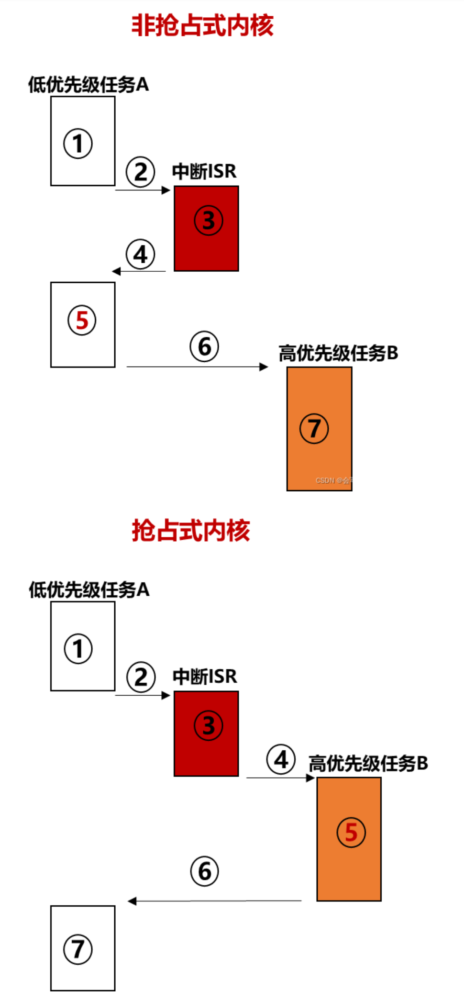

# https://blog.csdn.net/hongzg1982/article/details/56515771
一般的Linux进程间通信的方法：
pipe
socket
shared memory
FIFO
Message Queue
Semaphores

Android另外还有Binder等，也是用的shared memory机制。这有专门的说明，这里就不多说了。

# unlocked_ioctl和compat_ioctl 与ioctl的区别
在 Linux 内核编程中，ioctl、unlocked_ioctl 和 compat_ioctl 都是用于处理设备驱动程序中的 IOCTL（Input/Output Control）操作的函数。它们之间的区别如下：

ioctl：ioctl 是最常见的 IOCTL 处理函数，它是 Linux 内核提供的标准接口。在设备驱动程序中实现 ioctl 函数时，需要使用 ioctl 操作码来识别不同的 IOCTL 命令，并根据命令执行相应的操作。ioctl 函数的原型如下：

int ioctl(struct file *filp, unsigned int cmd, unsigned long arg);
ioctl 函数接受一个文件指针 filp，一个无符号整数 cmd 表示 IOCTL 命令，以及一个无符号长整数 arg 作为命令的参数。该函数在驱动程序内部实现不同 IOCTL 命令的具体逻辑。

unlocked_ioctl：unlocked_ioctl 函数是 ioctl 的一种变种。它在某些情况下用于替代 ioctl 函数，以提高性能和并发访问的效果。不同于 ioctl 函数，unlocked_ioctl 函数不会自动获得和释放文件锁，因此可以在自旋锁保护的上下文中使用。unlocked_ioctl 函数的原型与 ioctl 函数相同，但它不受文件锁的限制，可以在多个线程同时访问设备时使用。

compat_ioctl：compat_ioctl 函数主要用于处理 32 位应用程序在 64 位系统上运行时发出的 IOCTL 命令。在这种情况下，由于数据结构的大小和布局可能不同，使用标准的 ioctl 函数可能会导致兼容性问题。因此，Linux 内核提供了 compat_ioctl 函数来处理这些兼容性问题。当 32 位应用程序使用 ioctl 系统调用时，内核将自动调用 compat_ioctl 函数来处理 IOCTL 命令。

# 锁机制

## 针对内核中各种锁以及并发编程的介绍
- https://blog.csdn.net/u012294613/article/details/123878624

### https://blog.csdn.net/u012294613/article/details/123878531
- 锁 - linux内核锁（零）_mutex_lock-CSDN博客 (2024_2_18 18_12_12).html

- 代码是静态的，执行流是动态的，这是两个不同的视角。若只存在一个cpu，那就只有一个执行流，那就不存在微观上的并发，也就不需要锁。但我们往往使用多个cpu，因而有多个执行流，同一个代码可能在两个执行流上执行。所以需要锁

- 多任务同时执行，对于单核的CPU来说，宏观上并行，微观上串行。而并发的执行单元对共享资源的访问则很容易导致竞态（Race Conditions）

- cpu所处的上下文相关概念
  - 进程上下文，中断上下文（硬中断上下文、软中断上下文，不可屏蔽中断上下文）

- 中断引入后，可能产生的影响
  - 中断能够打断进程的执行流，无论进程优先级多高，都会被打断。因此原本执行流被打断，CPU转而执行中断的指令流。因此，与上下文对应，执行流也可分为：进程执行流和中断执行流
    - 1、cpu在用户态运行时，外部中断触发，程序会先陷入内核态，保存上下文后，再执行中断代码。
    - 2、cpu在内核态运行时，外部中断触发，保存上下文后，执行中断代码。
    - 3、中断处理函数（中断上半部）必须要快速执行完成，以便返回继续执行各个进程。中断返回时，会发生调度，原来被打断的进程未必能够得到执行。

- 中断处理函数中执行的代码可能会产生一些影响，当cpu从中断上下文返回到进程上下文时，该影响可能导致进程上下文的代码执行出现异常，例如中断上下文和进程上下文中的代码会修改同一个变量

- 抢占引入后，可能产生的影响  
  - 1、抢占可以分为用户态抢占和内核态抢占。抢占时机？（中断、返回用户态、主动schedule（））
  - 2、Linux kernel是抢占式内核。
  - 
  - 因为多核导致并发，结合抢占机制的引入，需要锁保证争抢有序

- 单处理器中，因为中断和抢占机制的引入，cpu在执行代码流程1的过程中可能被切换到执行代码流程2，（例如进程执行过程中中断触发，开始执行中断处理函数）这种情况下若没有锁机制，可能导致代码错误（例如共享变量在进程执行过程中和中断处理函数中同时被修改）

- 锁保护的对象：公共资源。公共资源，从某一方面讲，就是全局变量，或者从堆里面申请的共用内存。从保护资源的角度，锁只是为了保护全局变量，公共资源是一种更严谨的通用的说法。若非要说“锁也保护了代码”，那也只是在保护全局变量的时候，顺便保护了代码而已。

- Spin lock 是实现其他锁的基础，原子操作是实现 spin lock 的基础。
- 锁的种类
  - 原子操作
  - 自旋锁
  - 互斥锁
  - 信号量
  - 读写锁
  - 读写信号量
  - 顺序锁
  - RCU锁

### https://blog.csdn.net/u012294613/article/details/123878624
- 原子操作 - linux内核锁（一）

## linux内核中有哪些同步机制？ from llm
Linux内核提供了多种同步机制来保护共享资源，防止竞态条件，并确保数据的一致性。以下是一些主要的内核同步机制：

自旋锁（Spinlocks）：
spin_lock、spin_unlock、spin_trylock：这些锁用于保护临界区，防止多个处理器同时访问。它们通过忙等待来实现同步，适用于锁持有时间较短的情况。

读写锁（Read-Write Locks）：
rwlock、_read_lock、_write_lock、_read_trylock、_write_trylock：读写锁允许多个读操作并发进行，但写操作是独占的。适用于读操作远多于写操作的场景。

互斥锁（Mutexes）：
mutex_lock、mutex_unlock、mutex_trylock：互斥锁用于保护临界区，类似于自旋锁，但允许进程在等待锁时睡眠，适用于锁持有时间可能较长的情况。

顺序锁（Sequence Locks）：
seqlock、seqlock_lock、seqlock_lock_irqsave、seqlock_unlock：顺序锁用于保护顺序一致性，确保在执行一系列操作时，其他处理器不会干扰。

大内核锁（Big Kernel Lock, BKL）：
在早期的Linux内核中，BKL用于保护整个内核空间，防止并发修改。现代内核已经很少使用BKL，而是采用更细粒度的锁。

原子操作（Atomic Operations）：
提供了一系列原子操作，如atomic_set、atomic_add等，用于在不使用锁的情况下实现简单的同步。

屏障（Barriers）：
smp_mb()、smp_rmb()、smp_wmb()：这些屏障操作用于确保在多处理器系统中，某些操作的执行顺序。

顺序计数器（Sequence Counters）：
seqcount_t：用于实现简单的顺序一致性保护，通常与smp_mb()、smp_rmb()、smp_wmb()一起使用。

条件变量（Condition Variables）：
wait_queue_head_t：条件变量允许进程在满足特定条件时唤醒，通常与互斥锁一起使用。

信号量（Semaphores）：
semaphore：信号量是一种通用的同步原语，可以用于进程间同步或进程内同步。

完成量（Completions）：
completion：完成量用于等待某个事件的发生，通常用于异步操作的同步。

工作队列（Workqueues）：
workqueue：工作队列允许将工作项（work items）提交到队列中，由工作线程（worker threads）处理。

定时器（Timers）：
timer：定时器用于安排在未来某个时间点执行任务。

RCU（Read-Copy-Update）：
RCU是一种用于读多写少场景的同步机制，它允许读者在不阻塞写者的情况下并发访问数据。
这些同步机制各有特点，适用于不同的场景。开发者需要根据具体的应用需求选择合适的同步策略，以确保系统的稳定性和性能。在多处理器系统中，正确使用这些同步机制对于避免并发问题至关重要。

下面是Linux内核中一些主要同步机制的特点和关键API的介绍：

自旋锁（Spinlocks）：
特点：忙等待锁，适用于锁持有时间短的情况，避免进程睡眠，节省上下文切换开销。
关键API：
spin_lock(&lock)：获取自旋锁。
spin_unlock(&lock)：释放自旋锁。
spin_trylock(&lock)：尝试获取自旋锁，如果锁已被占用则立即返回失败。

读写锁（Read-Write Locks）：
特点：允许多个读操作并发执行，写操作时独占。适用于读操作远多于写操作的场景。
关键API：
rwlock_init(&lock)：初始化读写锁。
read_lock(&lock)：获取读锁。
write_lock(&lock)：获取写锁。
read_unlock(&lock)：释放读锁。
write_unlock(&lock)：释放写锁。

互斥锁（Mutexes）：
特点：类似于自旋锁，但允许进程在等待锁时睡眠，适用于锁持有时间可能较长的情况。
关键API：
mutex_init(&lock)：初始化互斥锁。
mutex_lock(&lock)：获取互斥锁。
mutex_unlock(&lock)：释放互斥锁。
mutex_trylock(&lock)：尝试获取互斥锁，如果失败则立即返回。

顺序锁（Sequence Locks）：
特点：保证操作的顺序性，但不保证互斥性。适用于需要保证操作顺序的场景。
关键API：
seqlock_init(&lock)：初始化顺序锁。
seqlock(&lock)：获取顺序锁。
sequnlock(&lock)：释放顺序锁。

原子操作（Atomic Operations）：
特点：提供了一系列原子操作，用于在不使用锁的情况下实现简单的同步。
关键API：
atomic_set(&v, i)：原子设置值。
atomic_add(i, &v)：原子加法。
atomic_dec(&v)：原子减一。

条件变量（Condition Variables）：
特点：允许进程在满足特定条件时唤醒。通常与互斥锁一起使用。
关键API：
init_waitqueue_head(&q)：初始化等待队列。
wait_event(q, condition)：等待条件满足。
wake_up(&q)：唤醒等待队列中的进程。

信号量（Semaphores）：
特点：用于控制对资源的访问，可以用于进程间同步。
关键API：
sem_init(&sem, value)：初始化信号量。
down(&sem)：等待信号量。
up(&sem)：释放信号量。

完成量（Completions）：
特点：用于等待异步操作完成。
关键API：
init_completion(&comp)：初始化完成量。
wait_for_completion(&comp)：等待完成量。
complete(&comp)：标记完成量为完成。

工作队列（Workqueues）：
特点：允许将工作项提交到队列，由工作线程处理，适用于异步任务。
关键API：
INIT_WORK(&work, func)：初始化工作项。
queue_work(workqueue, &work)：将工作项添加到工作队列。
flush_workqueue(workqueue)：确保工作队列中的所有工作项都被处理。

RCU（Read-Copy-Update）：
特点：用于读多写少的场景，允许读者在不阻塞写者的情况下并发访问数据。
关键API：
rcu_read_lock()：开始RCU读取操作。
rcu_read_unlock()：结束RCU读取操作。
rcu_assign_pointer(ptr, value)：原子地更新指针。
这些同步机制提供了丰富的选项来处理并发问题，开发者可以根据具体场景选择合适的同步策略。在设计并发程序时，正确使用这些机制对于保证数据一致性和系统稳定性至关重要

## 锁必须具有的特征及其解决方案
### https://switch-router.gitee.io/blog/LockAndNolock/ 锁与无锁 (2024_2_16 11_37_43).html
- 特征
  1. 它需要支持加锁(lock)和解锁(unlock)两种操作。 
  2. 它需要是有状态(State)的，它需要记录当前这把锁处于Locked还是Unlocked状态。
  3. 它的状态变化必须是原子(Atomic)的 
  4. 当它处于Locked状态时，对其进行加锁(lock)的操作，不会成功。
- 解决方案
  - 第1条,对实现者来说,一是要提供两个API分别对应这两种操作。
  - 第2条,需要一个地方能记录锁的状态,对计算机系统来说,这个地方只能是内存。
  - 第3条,将锁的状态记录在内存中有个和全局变量一样的问题，那就是如何避免多个线程同时去改变锁的状态 ? 总不能用锁去保护锁吧 ? 好在各个体系的CPU都提供了这种原子操作的原语, 对x86来说，就是指令的LOCK前缀, 它可以在执行指令时控制住总线，直到指令执行完成。这也就保证了锁的状态修改是通过原子操作完成的。
  - 第4条，加锁操作成功的前提是锁的状态是处于”Unlocked”,如果该条件不满足，则本次加锁操作失败，那么失败以后的行为呢？不同的锁有不同的实现，一般来说有三种可选择的行为：1.立即返回失败 2.不断尝试再加锁,直到成功. 3. 睡眠线程自己，直到可以获得锁。

- 获取锁失败后，一般有三种情况
  - 1.立即返回失败 2.不断尝试再加锁,直到成功. 3. 睡眠线程自己，直到可以获得锁。

## 自旋锁
### https://switch-router.gitee.io/blog/spinlock/  深入理解同步机制---内核自旋锁 (2024_2_16 11_52_55).html
- 内核使用spin_lock_init来进行自旋锁的初始化
- 内核使用spin_lock、spin_lock_irq或者spin_lock_irqsave完成加锁操作；
- 内核使用spin_unlock、spin_unlock_irq或者spin_unlock_irqsave完成对应的解锁。
- 自旋锁可以在对称多处理器环境（SMP）下实现对临界区的保护 并且在单处理器系统（UP）上也有简化的实现
- 内核自旋锁与抢占和中断的关系密切

- 作用机制
  - 当任务A希望访问被自旋锁保护的临界区(Critical Section)，它首先需要这个自旋锁当前处于unlocked状态，然后它会去尝试获取(acquire)这个自旋锁(将这个变量状态修改为locked),
  - 如果在这之后有另一个任务B同样希望去访问这段这段临界区，那么它必须要等到任务A释放(release)掉自旋锁才行，在这之前，***任务B会一直等待此处，不段尝试获取(acquire)，也就是我们说的自旋在这里。***

- 在同步过程中，使用锁进行同步时还会遇到一些问题，即一切情况可能导致 使用锁无法成功进行同步，需要考虑的影响因素包括 
  - UP（单处理器） & SMP（多处理器）

  - 中断(interrupt)
    - 内核中使用 local_irq_disable()或者local_irq_save(&flags)来去使能中断。两者的区别是后者会将当前的中断使能状态先保存到flags中。
    - 内核使用local_irq_enale()来无条件的使能中断，而使用local_irq_restore(&flags)来恢复之前的中断状态。
    - ***上述函数只能作用在当前处理器***

  - 内核态抢占(preempt)
    - 内核中使用preemt_disbale()来禁止抢占，使用preempt_enable()来使能可抢占。***上述函数只能作用在当前处理器***
    - 注意，如果要开启抢占，则需要中断处于开启状态
  - 上述该概念的细节
    - 

  - 上述情况使得锁无法成功同步的情况
    - Case 1 单处理器情况下，任务上下文抢占
      - 低优先级任务A进入临界区，但此时发生了调度(比如发生了中断, 然后从中断中返回),高优先级任务B开始运行访问临界区。造成临界区数据被修改
      - 解决方案：进入临界区前禁止抢占就好了。这样即使发生了中断，中断返回也只能回到任务A.
      -   
    - Case 2 单处理器情况下，中断上下文抢占
      - 任务A进入临界区，此时发生了中断，中断处理函数中也去访问修改临界区。当中断处理结束时，返回任务A的上下文，但此时临界区已经变了！
      - 解决方案：进入临界区前禁止中断(顺便说一句，这样也顺便禁止了抢占，因为若要开启抢占，则必须开启中断)
      - 
    - Case 3 多处理器上临界区问题
      - 任务A运行在CPU_a上，进入临界区前关闭了中断(本地)，而此时运行在CPU_b上的任务B还是可以进入临界区！没有人能限制它
      - 
      - 解决方案：任务A进入临界区前持有一个互斥结构，阻止其他CPU上的任务进入临界区，直到任务A退出临界区，释放互斥结构。这个互斥结构就是自旋锁的来历。所以本质上，自旋锁就是为了针对SMP体系下的同时访问临界区而发明的！
      - ***即自旋锁可以实现多处理器之间的互斥，适合保护很短的临界区，并且不允许在临界区睡眠。申请自旋锁的时候，如果自旋锁被其他处理器占有，本处理器自旋等待（也称为忙等待）。进程、软中断和硬中断都可以使用自旋锁。***

### https://blog.csdn.net/u012294613/article/details/123365262
- 自旋锁 - linux内核锁（二）
- 自旋锁用于处理器之间的互斥，适合保护很短的临界区，并且不允许在临界区睡眠。申请自旋锁的时候，如果自旋锁被其他处理器占有，本处理器自旋等待（也称为忙等待）。进程、软中断和硬中断都可以使用自旋锁。自旋锁是用在多处理器环境中的锁：如果内核控制路径发现自旋锁开着，就获取锁并继续执行，相反，如果内核控制路径发现锁由运行在另一个CPU上的内核控制路径锁着，就在周围“旋转”，直到锁被释放。这个“旋转”就是在忙等，这期间正在等待的内核控制路径除了浪费时间，无事可做。
- spinlock的区间不能发生调度，不能  睡眠（不能调用可睡眠函数）
- spin_lock挡不住中断，如果中断处理程序也要访问临界资源，则spinlock就起不到作用了。这时要用spinlock的修改版本spin_lock_irqsave，即既拿spinlock，也把这个核上的中断关掉。并且，这时线程中必须使用spin_lock_irqsave，要不然线程在spin_lock的时候被中断，中断处理中又调用spin_lock就死锁了。

