# 文章原始来源
http://blog.chinaunix.net/uid/25014876/cid-2370-list-7.html

# 系列文章目录
https://www.cnblogs.com/huty/p/8518600.html

# 在新版内核中上述文章对应代码
- https://github.com/28Ln/Linux_DeviceDriver


部分文章原始来源已经丢失，在上述链接中找到保存位置

# linux设备驱动归纳总结（一）：内核的相关基础概念-diytvgy-ChinaUnix博客 (2024_2_15 16_24_49).html
- init/main.c ->start_kernel->内核执行第一条代码
- 在makefile中，y表示编译进内核，m表示编译成模块，不写代表不编译
- 介绍了如何在内核makefile过程中增加一个驱动程序配置选项
- 介绍了如何之只编译一个内核模块
- 介绍编写驱动时makefile的格式
# linux设备驱动归纳总结（二）：模块的相关基础概念-diytvgy-ChinaUnix博客 (2024_2_15 16_28_17).html
- 内核中的printk
- 内核模块的传参
- 内核函数之间的调用
- 模块之间的引用
# 【Linux开发】linux设备驱动归纳总结（三）：1.字符型设备之设备申请 - ZhangPYi - 博客园 (2024_2_15 16_33_17).html
- 三种设备类型
- 主设备号 次设备号
- 设备号的申请和字符设备的注册（旧）
  - register_chrdev，这是旧版本的设备注册函数，完成设备号申请和字符设备的注册
  - unregister_chrdev 对应注销函数
- 设备号的申请和字符设备的注册（新）
  - 申请设备号 （函数可能出错） 
    - register_chrdev_region 手动指定设备号
    - alloc_chrdev_region 动态分配设备号
  - 释放设备号
    - unregister_chrdev_region
  - 设备注册分为三步（使用cdev结构体表示字符设备）
    - 分配cdev的两种方法
      - 直接定义struct cdev test_cdev;
      - 调用函数:struct cdev* cdev_alloc(void)
    - 初始化cdev；
      - cdev_init 函数
    - 添加cdev； （函数可能出错）
      - cdev_add 函数
  - 删除cdev
    - cdev_del 函数
- 函数错误返回处理
  - 内核中，在linux/errno.h文件中定义了一些错误号，当内核的函数操作失败后，它会返回一个负数，通过查看这个数的值，内核就会在终端中显示相应的错误原因。
  - 注：错误号是正数，错误时的返回值是错误号的负值。


# linux设备驱动归纳总结（三）_2open.close.read.write-diytvgy-ChinaUnix博客 (2024_2_15 16_34_06).html
- 设置设备操作函数，并在设备号和设备注册完毕后，使用mknod创建一个设备文件（以主次设备号作为参数），之后针对该设备文件进行open等操作，即可调用驱动中 file_operations 结构体中open等对应函数
- 虽然说内核中不能使用C库提供的函数，但是内核也有一个memcpy的函数，用法跟C库中的一样。
- 内核中的 copy_from_user和copy_to_user： 用于在内核态和用户态之间传输数据，该两个函数的from和to都基于内核而言，相当于在memcpy的基础上增加检查传入参数的功能，避免内核crash

# linux设备驱动归纳总结（三）：3面向对象思想和lseek-diytvgy-ChinaUnix博客 (2024_2_15 16_35_10).html
- file_operations 结构体中open release函数 的两个参数：struct file struct inode，文章中解释了该两个结构体存在的意义
- struct file
  - 用于维护打开的文件，每打开一次文件，就增加一个file结构体维护
  - 所以，在内核中可以存在同一个文件的多个file，因为该文件被应用程序打开被打开多次
  - 关键成员
    - loff_t f_pos
      - 这是用来记录文件的偏移量。在应用程序中，打开文件时偏移量为0，每次的读写操作都会使偏移量增加。
    - void *private_data
      - 这是空类型的指针可以用于存放任何数据
      - 文件操作结构体fops中所有的函数成员里面都有一个参数是file结构体，所以每个函数都可以在file->private_data中拿到我自己定义的结构体了。
    - struct file_operations *fops;
      - 打开文件后，内核会把fops存放在这里，以后的操作就在这里在这里找函数了。
  - 在应用程序中，open打开文件后得到的文件句柄fd，其就是一个指向file结构体的指针

- struct inode
  - 这个结构体是用来保存一个文件的基本信息的结构体，即使打开多个相同的文件，也只会有一个对应的inode。
  - 关键成员
    - dev_t i_rdev;
      - 这里存放着这个文件的设备号
    - struct cdev *i_cdev;
      - 这是一个cdev结构体的指针，cdev这个结构体很熟悉吧，注册设备时用的cdev。这个结构体的用处现在我还不好说，待会看程序就知道了。

- 通过file和inode结构体，可以将驱动程序中涉及的全局变量组织在一个结构体中，通过file和inode可以在file_operations中的文件处理函数中找到该结构体

- 关于 define container_of(ptr, type, member) 宏，该宏根据结构体内的成员的地址，计算出该结构体的起始地址 ptr是type结构体中member成员的地址，该函数最后返回包含ptr的tpye结构体的地址

- 结合使用 file结构体中的 loff_t f_pos 、private_data 可以将驱动中去全局变量保存在一个结构体中，并在read write的文件操作函数中 读写该结构体中的全局变量，同时实现lseek文件操作函数，实现修改文件偏移
- 应用层的函数lseek函数对应驱动的函数是llseek(为什么多了一个l我也想不懂)。

# linux设备驱动归纳总结（三）：4.ioctl的实现-diytvgy-ChinaUnix博客 (2024_2_15 16_35_37).html
- 给出用户层中ioctl函数驱动中ioctl函数参数的对应关系
- 内核中的驱动函数返回值都有一个默认的方法，只要是正数，内核就会傻乎乎的认为这是正确的返回，并把它传给应用层，如果是负值，内核就会认为它是错误号了。

- ioctl调用过程中 cmd命令 的构成，一个cmd被分为了4个段，每一段都有各自的意义 ，ioctl-number.txt
  - 存在相关命令，可以根据要求定义cmd，也可以将指定cmd拆分为上述四个部分
  - 生成cmd
    - _IO(type,nr) //没有参数的命令
    - _IOR(type,nr,size) //该命令是从驱动读取数据
    - _IOW(type,nr,size) //该命令是从驱动写入数据
    - _IOWR(type,nr,size) //双向数据传输
  - 拆分指定命令
    - _IOC_DIR(cmd) //从命令中提取方向
    - _IOC_TYPE(cmd) //从命令中提取幻数
    - _IOC_NR(cmd) //从命令中提取序数
    - _IOC_SIZE(cmd) //从命令中提取数据大小
  - 此类命令是预定义命令，预定义命令是由内核来识别并且实现相应的操作，换句话说，一旦你使用了这些命令，你压根也不要指望你的驱动程序能够收到，因为内核拿掉就把它处理掉了

- ioctl的传参
  - 应用层的ioctl的第三个参数是"..."，这个跟printf的"..."可不一样，printf中是意味这你可以传任意个数的参数，而ioctl最多也只能传一个，"..."的意思是让内核不要检查这个参数的类型。也就是说，从用户层可以传入任何参数，只要你传入的个数是1.
  - 一般会有两种的传参方法：
    - 1、整数，那可是省力又省心，直接使用就可以了。
    - 2、指针，通过指针的就传什么类型都可以了，当然用起来就比较烦。
      - 通过指针传参时，需要检验用户层传入的指针，有两种方法进行检验，即
        - 1、用的时候才检验。
          - 即使用copy_xx_user系列函数，类似copy_xx_user的函数含有put_user、get_user等
        - 2、一进来ioctl就检验。
          - 进入ioctl后使用access_ok检测。该函数用于检测地址的安全性，三个参数分别为，该函数成功返回1，失败返回0。
            - type：用于指定数据传输的方向，VERIFY_READ表示要读取应用层数据，VERIFT_WRITE表示要往应用层写如数据。注意：这里和IOR IOW的方向相反。如果既读取又写入，那就使用VERIFY_WRITE。
            - addr：用户空间的地址
            - size：数据的大小
          - access_ok并没有做完的所有的内存检查，所以即使access_ok检验通过，仍可能存在内存错误，大多数的驱动代码都不是用access_ok的，后面的内存管理会讲述。

- 驱动程序中内存拷贝与校验的最佳实践（来自设备驱动第三版）
  - 1.传入指针需要检查安全性。memcpy函数尽量不要在内核中使用。
  - 2.copy_to_user.copy_from_user.get_user.put_user函数会再拷贝数据前检测指针的安全性。不需要access_ok。
  - 3.如果在ioctl函数开头使用了accsee_ok检验数据，接下来的代码可以使用__put_user或__get_user这些不需要检测的函数（书上有例子）

# linux设备驱动归纳总结（三）：5.阻塞型IO实现-diytvgy-ChinaUnix博客 (2024_2_15 16_36_16).html
- 进程休眠：简单的说就是正在运行的进程让出CPU。休眠的进程会被内核搁置在在一边，只有当内核再次把休眠的进程唤醒，进程才会会重新在CPU运行。
- 实现阻塞型IO
  - read：当没数据可读时，函数让出CPU，进入休眠状态，等待write写入数据后唤醒read。
  - write：写入数据，并唤醒read。

- 使用等待队列实现阻塞性IO，

- 等待队列：
  - 是一个链表，链表中的元素是特定进程，此类进程均在等待特定事件
  - 如果一个进程要唤醒另一个进程，可以将待唤醒进程存放到等待队列，当队列中的待唤醒进程获得唤醒事件后，则从链表断链，并继续执行
  - init函数中初始化 等待队列
    - init_waitqueue_head(&my_dev.test_queue);
      - 即定义并初始化一个链表，后续在这个链表添加需要等待的进程了。
  - read函数中的等待唤醒事件，等待过程中进程处于休眠状态
    - if(wait_event_interruptible(dev->test_queue, dev->cur_size > 0))
  - write函数中触发唤醒事件，使得read函数对应进程开始执行
    - wake_up_interruptible(&dev->test_queue);

- 定义并初始化等待队列有两种方法
  - 方法1： DECLARE_WAIT_QUEUE_HEAD(name)  使用：定义并初始化一个叫name的等待队列。
  - 方法2：定义等待队列头结构体：wait_queue_head_t test_queue;  初始化结构体：init_waitqueue_head(&test_queue);
    - 初始化函数的位置，它必须在cdev添加函数”cdev_add”前。因为”cdev_add”执行成功就意味着设备可以被操作，设备被操作前当然需要把所有的事情都干完，包括等待队列的初始化。

- wait_event_interruptible(wq, condition) 
  - 使用 wait_event_interruptible(wq, condition) 函数可以将当前进程加入 等待队列 并 等待唤醒
  - 函数调用成功会进入可中断休眠，
  - 返回非零值意味着休眠被中断,且驱动应返回-ERESTARTSYS*/
  - 类似函数
    - wait_event(queue, condition) /*函数成功会进入不可中断休眠,不推荐*/
    - wait_event_timeout(queue, condition, timeout)
    - wait_event_interruptible_timeout(queue, condition, timeout)
      - /*比上面两个函数多了限时功能，若休眠超时，则不管条件为何值返回0，*/
  - 该函数执行后 会触发的操作
    - 1、定义并初始化一个wait_queue_t结构体，然后将它添加到等待队列test_queue中。
    - 2、更改进程的状态，休眠的状态有两种：（可中断休眠）TASK_INTERRUPTIBLE和（不可中断休眠）TASK_UNINTERRUPTIBLE。上面的函数会切换到可中断休眠。
    - 3、***判断条件 dev->cur_size > 0是否成立，如果不成立，则调用函数schedule()让出CPU。*** 注意，一旦让出CPU进入休眠后，***进程再次被唤醒后就会从这一步开始，再次检测条件是否成立，如果还是不成立，继续让出CPU，等待下一次的唤醒。如果成立，则进行下一步的操作。***所以，这个函数的条件会被多次判断，因此这个判断语句并不能对这个进程带来任何副作用。
    - 4、条件成立后做一些相应的清理工作，并把进程状态更改为TASK_RUNNING。 

- wake_up_interruptible(&dev->test_queue)
  - 用于 唤醒指定等待队列中睡眠的进程。
  - 类似函数
    - void wake_up(wait_queue_head_t *queue); //唤醒等待队列中所有休眠的进程
    - void wake_up_interruptible(wait_queue_head_t *queue); //唤醒等待队列中所有可中断睡眠的进程
    - 一般来说，用 wake_up 唤醒 wait_event ；用 wake_up_interruptible 唤醒wait_event_interruptible。
  - 函数功能
    - 一旦上面的函数调用成功，等待队列里面所有符合休眠状态的进程都会被唤醒，所有进程都会执行上面说的休眠函数的第三步——轮流占用CPU来是判断时候否符合条件。一旦有一个进程符合条件，那个进程就会运行下去，其他进程变回原来的休眠状态等待下一次的被唤醒。如果全部都不符合，全部都会变回原来的休眠状态

- 总结 上述阻塞IO
  - 1）首先需要定义并初始化一个等待队列。
  - 2）test_read函数中，如果条件不符合，调用该函数的进程就会进入休眠。
  - 3）每当另一个进程调用test_write函数唤醒等待队列，test_read中的函数就会再一次判断条件是否符合，如果不符合，就会继续休眠，直到哪次的唤醒时条件符合。

- 编写两个用户态程序，先后调用驱动中的read和write，可以发现，在wirte执行前吗，执行read的相关进程会陷入等待，直到write函数执行完毕

- 实现非阻塞的io操作（即读写条件不满足时直接返回，并不阻塞）
  - 当我们在应用层以非阻塞方式打开文件时，读写操作不满足条件时并不阻塞，而是直接返回。
  - 实现非阻塞操作也很简单，判断filp->f_flags中的是否存在O_NONBLOCK标志（标志在定义，并被自动包含），如果有就返回-EAGAIN。


# linux设备驱动归纳总结（三）：6.poll和sellct-diytvgy-ChinaUnix博客 (2024_2_15 16_37_04).html
- select系统调用在，驱动中的实现
  - select这个系统调用的作用就是在应用层调用驱动函数中的poll来检测指定的文件的状态（读、写和异常）。如果某个状态满足，select函数调用成功后返回，应用程序就可以通过指定的函数来判断现在的文件状态。注意的是：***select可以指定判断的时间，指定时间内，应用程序会阻塞在select函数，直到状态满足或者超时。***
- 驱动函数中实现pool时，需要用到等待队列
  - 在write函数中  wake_up_interruptible(&dev->read_queue);  实现唤醒等待队列
  - 在驱动的pool函数中，调用 poll_wait(filp, &dev->read_queue, table); 用于检测等待队列状态，当write执行过，说明当前设备内部有数据可读，且read等待队列处于唤醒状态，即设备可读
  - 在file_operations test_fops 结构体中添加 .poll = test_poll 项目
  - init函数中调用 init_waitqueue_head(&my_dev.read_queue); 进行等待队列的初始化

- pool函数返回对应设备的状态，即返回相应的掩码。那就是说，如果设备可读，那就返回可读的掩码。

- 应用层调用select 和 上述驱动程序中test_poll函数被调用的关系
  - test_poll函数调用 poll_wait 函数实现功能，poll_wait函数并不会导致休眠，若设备不可读，test_poll返回掩码为0
  - 这时，内核接到返回的掩码，知道设备不可读，此时用户层select函数就会阻塞，进程休眠，等待有数据时被唤醒
  - 所以，在写入数据后，需要唤醒等待队列头read_queue。此时设备可读了，就会再次调用test_poll函数，返回掩码POLLIN，select调用成功。
  - 故得出一下结论
    - 1.test_poll并不会导致休眠，进程阻塞是系统调用select搞的鬼。
    - 2.系统调用select的阻塞会导致test_poll被调用多次。

- 使用pool同时检测设备可读可写状态
  
- select函数中调用 do_select 实现阻塞
  - do_select 函数中存在一个大循环，从而实现阻塞，如果条件不成立休眠后，唤醒正在这个大循环里，
  - 循环中调用我们实现的poll函数，这也是poll被多次调用的原因，
  - .判断poll返回的掩码，根据返回的掩码的情况，可以调用break跳出大循环，do_select调用完毕，即select返回
  - 根据返回的掩码的情况，可以继续循环，进程状态改变有TASK_INTERRUPTIBLE，并加入指定的等待队列头，让出CPU，进程休眠，等待唤醒
  - 综上
    - poll只是做了一个判断工作，真正的阻塞在select中。

# linux设备驱动归纳总结（三）：7.异步通知fasync-diytvgy-ChinaUnix博客 (2024_2_15 16_37_46).html
- 异步通知fasync是应用于系统调用signal和sigaction函数，下面我会使用signal函数。简单的说，signal函数就是让一个信号与与一个函数对应，每当接收到这个信号就会调用相应的函数。

- 用户层代码要做的事
  - signal(SIGIO, sig_handler);
    - 调用signal函数，让指定的信号SIGIO与处理函数sig_handler对应。
    - 其中sig_handler 在用户层实现，若当前进程接收到SIGIO信号，则sig_handler 函数被调用
  - fcntl(fd, F_SET_OWNER, getpid());
    - 指定一个进程作为文件的“属主(filp->owner)”，这样内核才知道信号要发给哪个进程。
    - fd 是用户空间打开的驱动设备文件的句柄，  getpid() 获得当前用户态进程的pid，将其作为 fd的属主，故该fd（设备驱动）产生的信号会发送到当前用户进程
    - 也说明 fd对应驱动程序中会产生 SIGIO 信号
  - f_flags = fcntl(fd, F_GETFL); fcntl(fd, F_SETFL, f_flags | FASYNC);
  - 第一个fcntl调用获得fd中所有flag，第二个fcntl 获得 在设备文件中添加FASYNC标志，驱动中就会调用将要实现的test_fasync函数。 test_fasync 函数作用见之后
  - 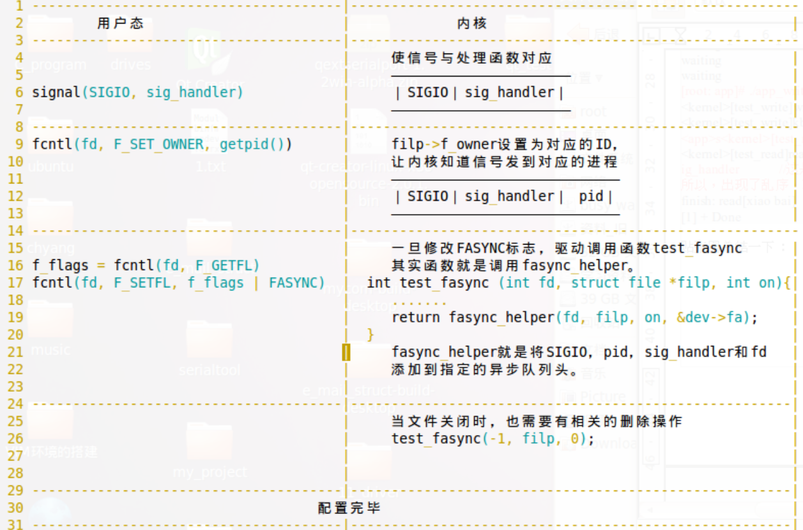

- 设备驱动层要做的事
  - 定义结构体，struct fasync_struct *async_queue; 该结构体用于表示当前驱动的异步通知，之后会被fasync_helper作为参数调用，该函数会将async_queue 加入链表结构，交给给内核管理，当内核接收到异步通知，会遍历链表，找到接收该异步通知的进程pid，并向该进程发送异步通知
  - 实现 test_fasync 函数，该函数实现方法固定，即调用  fasync_helper(fd, filp, mode, &dev->async_queue); 函数，主要就是将async_queue 加入对应链表管理结构
  - 在test_write函数中，用户态数据成功写入内核空间后，调用 kill_fasync(&dev->async_queue, SIGIO, POLL_IN);发送信号SIGIO给内核，POLL_IN，表示设备可读，说明当前设备可读
    - 内核接收到该 SIGIO 后， 遍历对应链表管理结构，找到用户态进程pid，将异步通知发送给该进程，进程中对应处理函数会被调用，在此之前，用户态进程会执行自己的代码，不需要阻塞
  - test_close中，需要test_fasync(-1, filp, 0); 即在 文件关闭时将异步通知结构体从队列中删除
  - 记得将  test_fasync 加入到 struct file_operations test_fops 结构体

- 上述过程中实现了一个机制，特定进程可以设置一个函数，然后正常执行其他代码，驱动程序可以发起异步通知给内核，内核将该通知发送给该特定进程，此时该进程之前设置的函数被调用，在此之前该进程无需阻塞或轮询等待

- 阻塞型IO、poll和异步通知的区别
  - 1）异步通知是不会造成阻塞的。
  - 2）调用阻塞IO时如果条件不满足，会在驱动函数中的test_read或test_write中阻塞。
  - 3）如果条件不满足，selcet会在系统调用中阻塞。
  - 所谓的异步，就是进程可以在信号没到前干别的事情，等到信号到来了，进程就会被内核通知去做相应的信号操作。进程是不知道信号什么时候来的。

- 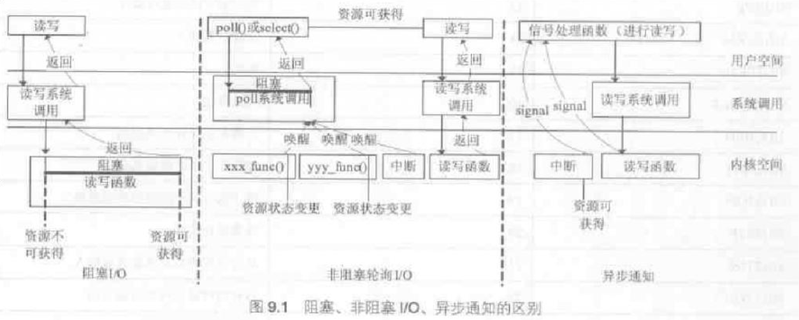


# linux设备驱动归纳总结（四）：1.进程管理的相关概念-diytvgy-ChinaUnix博客 (2024_2_15 16_38_29).html
- 进程由fork创建，通过exit退出。
- 有人或许会问，那线程是什么？线程就是一种特殊的进程
- 内核进程数据结构
  - 内核将所有的进程放在叫任务队列（task list）的双向循环链表中
  - 链表中的每个项都是类型为task_struct、称为进程描述符的结构。
  - 每个进程描述符包含着一个进程的所有信息，驱动开发中我用得最频繁的有两个成员，
    - pid(进程标识值)和comm（当前进程的所执行的程序文件名称）
- 获得当前进程的进程描述符
  - P_DEBUG("[%s]:pid[%d]\n", current->comm, current->pid);

- 五种进程状态及其调度
  - 1）TASK_RUNNING（运行）：该状态出现在进程正在运行，或者已经放在运行队列中等待执行（对应操作系统原理上所说的就绪状态）。这里要注意的是等待执行和休眠是两码事。
  - 2）TASK_INTERRUPTIBLE（可中断休眠）：这就是休眠状态中一种，之所以说可中断，就是说除了可以被其他进程从等待队列唤醒以外，还可以接送到信号而唤醒，这是常用的休眠状态。
  - 3）TASK_UNINTERRUPTIBLE（不可中断休眠）：这就是休眠状态的另一种，只能从等待队列被唤醒。因为它如此霸道，所以很少有人使用。
  - 4）TASK_ZOMBIE（僵死）：这种情况出现在进程结束后，但父进程还有来回收该进程的进程描述符。
  - 5）TASK_STOPPED（停止）：一看就知道，进程停止执行。

- 进程状态转换
  - 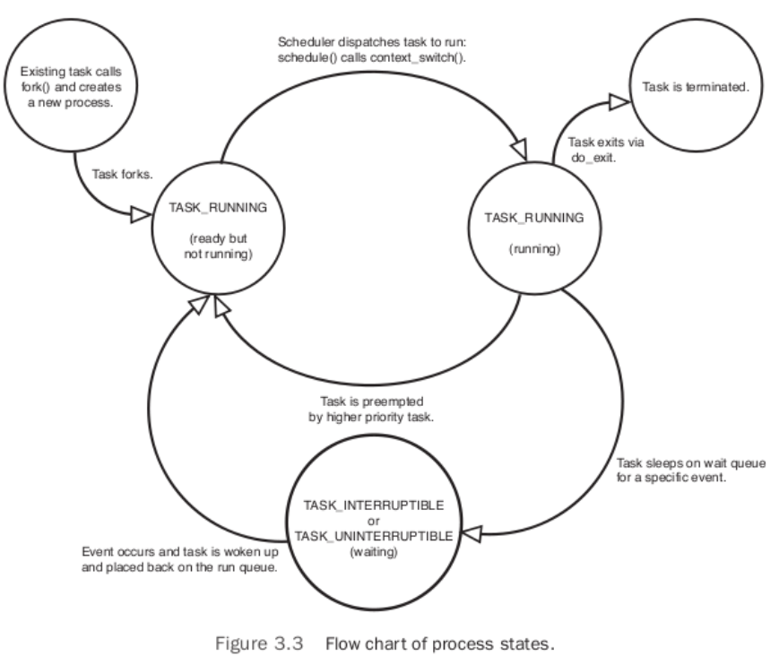

- 用户空间的进程有fork()系统调用产生，如果运行途中没有任何阻塞，它会在最后调用do_exit将进程的状态转为TASK_ZOMBIE。等待父进程来收尸

- linux的fork()有了写时拷贝(copy-on-write)技术。从字面上就能理解意思，父进程创建子进程后，他给子进程创建一个文件描述符，并且与子进程以只读方式共享原有的资源，只有在子进程或者父进程修改资源时，资源才会被复制。所以说，在不修改资源的情况下，fork()的实际开销就两样：
  - 1）复制父进程的页表给子进程。大家应该都知道，linux内存管理使用的页式管理，只要也就是说，只要把父进程的页表复制给子进程，子进程就能在页表中找到与父进程共享的4G虚拟地址了。
  - 2）为子进程创建唯一的进程描述符。这个就不用解释了，进程与进程描述符是一一对应的。

- fork 调用链
  - fork->clone->do_fork()->copy_procrss：
  - fork()系统调用根据提供的参数调用clone()，然后clone()去调用do_fork()，其中do_fork中完成了创建的大部分操作，里面有一个主要的函数copy_process()

- exec()的作用就是读取可执行文件并加载到地址空间开始运行，可以类比成命令”./xxxxx”。如果fork()后子进程调用exec()执行新的代码，就不需要拷贝父进程的资源了

- 一般的，进程调用exit()结束进程。相应的，exit()是调用do_exit()进行删除进程的资源和改变进程状态等操作。

- 进程上下文
  - 用户态的应用程序执行系统调用时，它就会陷入内核空间，此时，我们称内核“代表进程执行”并处于进程上下文。简单的说，以我们之前写的驱动举例，当应用成调用open，他就会陷入内核调用驱动函数中的test_open，此时内核就 处于进程上下文了。
  - 值得一提的是，在进程上下文时，current始终有效，它还是指向应用层中的进程，所以在”1st”的例子中，tesp_open打印出来的进程号current->pid与应用层是一样的。

- 线程 进程 内核线程
  - 线程，它是进程活动中的对象，最通俗的解释，一个进程里面可以有一个或者多个线程，它们共同享用进程的资源。
  - 内核线程，独立运行在内核空间的标准进程，但没有独立的运行空间，只运行在内核空间，但和普通进程一样被调度和抢占。
  - 总的来说，线程（又叫用户线程）和内核线程都是进程的特殊形式，它们的创建同样也是通过调用clone()。它们和进程的最大区别在于它们没有独立的4G虚拟空间。
  - 而线程和内核线程的区别就是：线程存在与用户态，内核线程存在与内核态。
  - 同时需要强调的是，进程是存在于用户态的。


# linux设备驱动归纳总结（四）：2.进程调度的相关概念-diytvgy-ChinaUnix博客 (2024_2_15 16_38_48).html
- 进程的调度就是指进程间的切换

- 进程的类型
  - I/O消耗型，是指进程大部分时间用来提交I/O请求或者等待I/O请求的进程。
  - 处理器消耗型，是指进程大部分时间用来执行代码的进程。
  - 有的进程同时具有上述两类特征

- 优先级概念
  - 优先级其实就是一个数，优先级高的程序先运行，低优先级的程序后运行，这是基本的进程调度策略。

- 时间片概念
  - 在一个周期里，内核调度全部进程的总时间中分给一个进程运行的时间，称为该进程的时间片
  - 如果没有中断等其它情况的话，进程A可以在内核分配的时间片内欢快地连续地运行，直到时间片用完。
  - 分配的时间片并不是一定要一次过用完，进程可以分开几次使用

- 进程调度策略的分类
  - 按调度策略分类：
    - SCHED_NORMAL：普通的分时进程，上层应用程序的默认策略。
    - SCHED_FIFO：先进先出的实时进程。
    - SCHED_RR：时间片轮转的实时进程。
  - 按调度类分类：
    - CFS调度类：用于策略SCHED_NORMAL等。
    - 实时调度类：用于SCHED_FIFO，SCHED_RR。

- 优先级和时间片的分配，是根据内核的调度算法分配。

- 基于上述分析，内核通过优先级和时间片两个概念，结合调度分配算法，完成进程的调度

- 上述过程中未考虑到用户抢占等概念，内核并不会只是单一地分配时间片让进程运行。
  
# linux设备驱动归纳总结（四）：3.抢占和上下文切换-diytvgy-ChinaUnix博客 (2024_2_15 16_39_02).html
- 上下文切换
  - 是指从一个可执行的进程切换到另外一个可执行的进程

- 两种上下文切换
  - 让步：第一种是进程主动让出CPU，这样的操作成为“让步”。
  - 抢占：第二种是由内核调度程序决定进程运行时间，在在运行时间结束（如时间片耗尽）或者需要切换高优先级进程时强制挂起进程，这样的操作叫“抢占”。***注意执行抢占的是内核运行的调度程序，而不是进程***

- 两种抢占类型：用户抢占和内核抢占。

- 用户抢占
  - need_resched 标志用于标识进程是否需要被调度
    - 内核使用need_resched标志来表示进程是否需要被调度，该标志位于每个进程对应的thread_info结构体内
  - need_resched 标志 在时间片耗尽 或 更高优先级的进程进入可执行队列 时被设置
    - 当一个进程的时间片耗尽，或者有更高优先级的进程进入可执行队列，当前运行的进程对应的need_reched标志会被设置。
  - 用户抢占发生的原理
    - 在内核即将要返回用户空间的时候，如果need_resched标志被设置，内核会在继续执行原来的进程之前调用调度程序，此时就会发生用户抢占。
    - 内核调用调度程序，重新选择一个更加合适的进程来运行（如高优先级），当然也可以是原来的程序。
    - 用户抢占发生的时机（内核返回用户空间时）
      - 1、从系统调用返回用户空间。
      - 2、从中断处理程序返回用户空间。
  - 用户抢占不会出现内核资源争夺，因为用户进程都有独立的4GB虚拟空间
    - ***内核返回用户空间后，每个进程有独立的4G虚拟空间，这时的进程调度并不会出现内核资源的争夺。***
  - 对比内核抢占，用户抢占中被抢占的程序是用户进程

- 内核抢占
  - 是什么：高优先级进程抢占正在内核运行的进程
  - 背景：2.6内核前，调度程序是不能调度正在运行在内核中的进程，即使时间片已经用完，只有在进程返回用户空间或者阻塞，才能进行进程的调度。
  - 内核空间资源共享，故内核抢占可能带来安全问题
    - 对于多个同时运行的进程，内核空间的资源的共享的。所以，内核在抢占并且调度进程的时候，必须要保证调度是安全的。所谓的安全，就是不会因为新进程的调度导致一些共享资源的错乱，
  - ***内核进程可以调用函数来禁止内核抢占，在禁止这段时间内，抢占是不允许的***
  - 内核抢占发生时机
    - 1、当终端处理程序将要执行完毕，返回内核空间之前。
    - 2、执行在可以抢占的代码的时候。
    - 3、内核进程让出CPU后，如阻塞。

- 进程调度的介绍并没有涉及中断，一般的，只要中断产生，内核就会马上相应，不管进程在内核还是用户空间，所以这也是内核资源保护的内容之一。

# linux设备驱动归纳总结（四）：4.单CPU下竞态和并发-diytvgy-ChinaUnix博客 (2024_2_15 16_39_38).html
- 内核的 ***进程调度*** 和 ***中断***，它们都会进入内核共用内核的资源，故可能带来条件竞争问题
- 并发：所谓的并发，就是多个进程同时、并行执行。
  - 单处理器下，看似同时执行，实则进程轮流执行
  - 多处理器下，真正的并发
  - 上述两者均会导致内核中共享资源的并发访问，带来条件竞争风险
- 单处理器中，进程A执行到一半，内核调度进程B执行，等进程B执行完后再回来执行A。（进程AB都是内核进程）两个进程完全相同，修改相同的数据，则数据会被错误修改

- 在并发执行的情况下，不能预料到进程什么时候会被调度，一些内核中的共享资源就要有一些相应的保护

- 临界区
  - 临界区就是访问和操作共享数据的代码段
- 竞争条件
  - 如果两个进程同时进入临界区，那就会发生资源的抢夺，这个情况就叫做竞争条件
- 同步 
  - 避免并发和防止竞争条件被成为同步

- 进程不管是在用户空间还是内核空间都是并发执行的

- 造成内核中并发执行的原因 ***下述过程中处理不好可以发生竞争条件，故后续同步机制，都是为了处理下述四种情况***
  - 1）中断：中断是随时可以产生，内核一旦接收到中断，就会放下手头上的工作，优先执行中断。如果中断代码中修改了之前运行进程的共享资源，这样就会出现bug。
  - 2）内核抢占：前一节已经介绍，支持内核抢占的情况下，正在执行的进程随时都有可能被抢占。
  - 3）睡眠：当在内核中执行的进程睡眠，此时就唤醒调度程序，调度新的进程执行。
  - 4）多处理器：多个处理器就能同时执行多个进程。这是真正的同时执行
  - 5）软中断和tasklet
  - 临界区中需要避免上述情况发生，故需要内核同步
 
 ***在单核处理器中，不存在真正的并发，都是伪并发，故产生竞争条件的原因是，当线程运行在临界区中时，内核调度其他线程运行，且之后的线程同样访问临界区，故此时产生了类似两个线程同时访问临界区的问题，即竞争条件问题，故导致问题的核心是，内核将一个进程中断，调度另一个进程运行的行为，故此类行为可能导致竞争条件***

## 单处理器不支持内核抢占前提下 
  - 两个进程之间：
    - 在单处理器不支持抢占的情况下，运行在内核的两个内核线程，并不会产生并发。
  - 中断与进程之间：
    - 中断上下文与普通内核线程之间，会产生并发。在内核线程正在执行时，随时会有可能被中断打断。所以，在临界区的代码，可以通过关闭中断来避免并发。
  - ***只有内核中断可能造成问题，故进入临前区前需要禁止中断，即避免内核进程在临界区中执行代码时切换到中断，而中断处理程序修改共享变量***

- 中断处理函数的实现也是基于内核模块.ko 即需要 insmod 命令插入内核模块后才能起效

- 如何关闭中断
  - 关闭中断的方法1 （这种方法有缺陷，如果内核本来就是关闭中断的，上面的代码却在最后把中断打开了，这是多不合理的做法。所以有了下面的函数：）
    - local_irq_disable(); //关中断
    - /*执行临界区代码*/
    - local_irq_enable(); //开中断
  - 关闭中断的方法2
    - unsigned long flag;
    - local_irq_save(flag); //在关中断前，先报存原来的中断状态
    - /*执行临界区代码*/
    - local_irq_restore(flag); //开启中断，然后还原原来的中断状态

- 还要注意的是，关中断的时间不能太长。

## 单处理器支持内核抢占前提下 
- 两个进程之间：
  - 在单处理器支持抢占的情况下，运行在内核的两个内核线程，会产生并发。访问临界区时需要关抢占。
- 中断与进程之间：
  - 中断上下文与普通内核线程之间，会产生并发。在内核线程正在执行时，随时会有可能被中断打断。所以，在临界区的代码，可以通过关闭中断来避免并发。

- 内核抢占如果开启，则用户态进程也可以抢占内核态进程去执行，而不仅仅是 内核态进程 抢占 内核态进程，只不过两个内核进程之间的抢占才会导致内核的竞争条件，因为内核中所有资源是共享的

- 为避免内核抢占导致内核线程之间并发访问临界区，需要在访问临界区时把内核抢占关掉
  - preempt_disable(); 关抢占
  - /*临界区代码*/
  - preempt_enable(); 开抢占
  - 这两个函数的实现原理也很简单，有这样一个计数器，当执行preempt_disable()时计数器加一，当执行preempt_enable()时计数器减一，只有当计数器的值为0时，内核才可以抢占。

- 上述基础上，为保护共享数据，也需要进入临界区之前关闭中断，故整体代码如下
  - preempt_disable();
  - unsigned long flag;
  - local_irq_save(flag);
  - /*临界区代码*/
  - local_irq_restore(flag);
  - preempt_enable();

- 如单处理器非抢占内核，如果你知道中断代码中根本没有访问另一个进程临界区的资源，你的进程完全可以不关中断。

- 同样的，单处理器抢占内核的情况下。如果只有中断会访问到临界区的资源，那你完全可以不关抢占（但是这样的情况好像很难说，同时打开两个相同的程序就会有可能发生临界区并发访问）

# linux设备驱动归纳总结（四）：5.SMP下的竞态和并发-diytvgy-ChinaUnix博客 (2024_2_15 16_39_59).html
- 多处理器抢占式内核 进行内核同步时需要注意什么
  - 防内核抢占。
  - 防中断打断。
  - 防其他处理器也来插一脚。
  - 前两个之前讨论过，关键看第三个，解决方案是使用自旋锁

## 自旋锁
  - 只要代码在进入临界区前加上自旋锁，在进程还没出临界区之前，别的进程（包括自身处理器和别的处理器上的进程）都不能进入临界区
  - 未获得锁的进程会进行忙等待，直到另一个进程释放锁

- 自旋锁使用
  - 定义并初始化自旋锁
    - 静态定义
      - spinlock_t lock = SPIN_LOCK_UNLOCKED;
    - 动态定义
      - spinlock_t lock;
      - spin_lock_init(&lock);
  - 在进入临界区前，必须先获得锁，
    - spin_lock(&lock);
  - 在退出临界区后，需要释放锁
    - spin_unlock(&lock);

- spin_lock() 实现的功能
  - 第一步：关抢占。
  - 第二步：获得锁，防止别的处理器访问。
- spin_unlock()实现了相反的操作：
  - 第一步：开抢占。
  - 第二步：释放锁。


- 单处理器下的自旋锁
  - 单处理器支持内核抢占的内核下，spin_lock()函数会退化成关抢占。
  - 在单处理器不支持内核抢占的内核下，spin_lock()将会是一条空语句。


- 综上自旋锁起效后，会关闭内核抢占，但是此时中断仍可以发挥作用，若指定临界区需要保护，则在使用自旋锁基础上，还需要关闭中断

- 为了在自旋锁基础上同时防止因为中断造成竞态条件，有两种思路
  - 在需要访问临界区的中断处理函数中添加自旋锁
    ```c
    do_irq() //中断处理函数
    {
    spin_lock();
    /*临界区。。*/
    spin_unlock();
    }
      ```
  - 直接在加自旋锁锁的同时把中断也禁掉：
    ```c
    #include
    spinlock_t lock;
    spin_lock_init(&my_dev.lock);
    unsigned long flag = 0;
    loacl_irq_save(flag);
    spin_lock(&lock);
    /*临界区。*/
    local_irq_restroe(flag);
    spin_unlock(&lock);
    ```

- 提供函数可以同时完成上锁和关闭中断
```c
spin_lock_irq(spinlock_t *lock) = spin_lock(spinlock_t *lock) + local_irq_disable()

spin_unlock_irq(spinlock_t *lock) = spin_unlock(spinlock_t *lock) + local_irq_enable()

spin_lock_irqsave(spinlick_t *lock, unsigned long falg) = spin_lock(spinlock_t *lock) + local_irq_save(unsigned long flag)

spin_unlock_irqrestore(spinlick_t *lock, unsigned long falg) = spin_unlock(spinlock_t *lock) + local_irq_restorr(unsigned long flag)
```

- 自旋锁中，如果未获得锁，则会忙等待，从而占用cpu，提供下述函数，用于判断当前自旋锁是否可得，避免忙等待
  - int spin_try_trylock(spinlock_t *lock);
  - 尝试获得锁，成功返回非零，失败返回零。

- 使用自旋锁需要注意的点
  - 持有锁的时间必须尽量的短： 
    - ***进程在没获得锁前不进入睡眠，而是会占用CPU查询***，这样的做法是为了节省进程从TASK_RUNNING切换至TASK_INTERRUPTIBLE后又切换回来消耗的时间。同时也是出于这样的原因，被上锁的临界区代码必须尽量的短。
  - 持有锁期间不能睡眠
    - 在临界区的代码里不能有引起睡眠的操作。譬如，一个进程上锁后睡眠（睡眠会触发调度程序，从而触发新的进程执行），此时切换执行中断处理函数，可中断处理函数也要获得锁，这样就会使中断自旋，并且没人能打断。
  - 要注意上锁的顺序：
    - 两个进程分别等待获取对方锁持有的那把锁，最终造成死锁
  - 不能嵌套上锁  
    - 就是获得锁后后的进程不能再上一次同样的锁。

## 信号量
- 自旋锁 - 临界区中不能睡眠，且尽可能短，获取自旋锁不成功则忙等待
- 信号量是一种睡眠锁，当进程试图获取已经被占同的信号量，他就会被放到等待队列中，直到信号释放后被唤醒。
- 信号量 - 获得信号量不成功则睡眠
- 信号量就是允许长时间上锁的睡眠锁。

- 信号量有两种：互斥信号量和计数信号量。
  - 互斥信号量，就是说同一时间只能有一个进程获得锁并进入临界区。
  - 计数信号量，那就是锁的数量可以多于一个，允许多个获得锁的进程进入临界区

- 信号量使用数据类型struct semaphore表示。

- 初始化信号量
  - 静态定义并初始化
    - static DECLARE_SEMAPHORE_GENERIC(name, count) 定义并初始化一个叫name的计数信号量，允许conut个进程同时持有锁。
    - static DECLARE_MUTEX(name)  定义并初始化一个叫name的互斥信号量。
  - 动态定义并初始化
    - 首先你要定义一个信号量结构体：
      - struct semaphore sem;
    - 然后初始化：初始化是指定信号量的个数
      - ssema_init(&sem, count);
    - 初始化一个互斥信号量
      - #define init_MUTEX(sem) sema_init(sem, 1)
    - 初始化一个互斥信号量并加锁
      - #define init_MUTEX_LOCKED(sem) sema_init(sem, 0)

- 信号量相关函数
  - 获取信号量，如果未能获取信号量则开始睡眠，根据睡眠是否能被中断打断，分为如下两种函数
    - voud down(struct semaphore *sem) 
      - /*获取信号量sem，如果不能获取，切换状态至TASK_UNINTERRUPTIBLE，它的睡眠不能被中断打断，不太常用*/
    - int down_interruputible(struct semaphore *sem)
      - /*获取信号量sem，如果不能获取，切换状态至TASK_INTERRUPTIBLE，如果睡眠期间被中断打断，函数返回非0值*/
      - 因为上面的函数在睡眠时会被中断打断，一般会如下使用：如果在睡眠期间被中断打断，返回-ERESTARTSYS给用户，告知用户重新执行。如果是被唤醒，则会往下执行。
        - if (down_interruptible(&sem)){return – ERESTARTSYS;}
    - int down_try_lock(struct semaphore *sem)
      - /*尝试获得信号量，如果获得信号量就返回零，不能获得也不睡眠,返回非零值*/
  - 释放信号量
    - void up(struct semaphore *sem);

- 信号量典型用法
```c
#include

struct semaphore sem;
sema_init(&sem, 1);

if (down_interruptible(&sem)){
return – ERESTARTSYS;
}

临界区代码。。。。。

up(&sem);
```

- 信号量的特点
  - 信号量不会关闭抢占，如果别的进程没有访问上锁的临界区(如app)，这个进程照样可以运行。
  - 信号量不会关闭中断：临界区还是可以被中断打断的，因为信号量根本没关中断，
    - 如果临界区的资源不能被中断访问，那就像之前说的处理，要不在中断处理函数在进入临界区前获得锁，要不就把中断也关了
  - 访问了上锁临界区的进程，会陷入睡眠，直到信号量被释放，该进程才会被唤醒，如果临界区中是死循环，说明该信号量永远不被释放，不考虑其他情况下，会导致该进程一直睡眠
  - 计数信号量，可以在这个进程上锁，另外的进程解锁。***存疑***

- 简单的说，信号量就是一个数，你获得这个数了，你就可以进去临界区。

## 自旋锁和信号量的区别
- 区别一：实现方式
  - 自旋锁是自旋等待，进程状态始终处于TASK_RUNNING。
  - 信号量是睡眠等待，进程在等待是处于TASK_INTERRUPTIBLE。
- 区别二：睡眠死锁陷阱：
  - 在自旋锁的临界区中，进程是不能陷入睡眠的。  
  - 而信号量可以睡眠。
  - 同时，基于上面的原因，***中断上下文中只能使用自旋锁（中断里不能休眠），在有睡眠代码的临界区只能使用信号量***
- 区别三：CPU的使用情况：
  - 明显的，信号量对系统的负载小，因为它睡眠了。
  - 区别四：执行的效率方面：
  - 自旋锁的效率比较高，因为它少了进程状态切换的消耗。
  - 相对的信号量的效率比较低，因为进程的等待需要切换进程状态。
- 区别五：上锁的时间长短：
  - 因为自旋锁是忙等待，所以临界区的代码不能太长。
  - 而信号量可以使用在运行时间较长的临界区代码。
- 区别六：是否关抢占：
  - 自旋锁是关抢占的，所以在单处理器非抢占的内核下，自旋锁是没用的。是空操作。
  - 信号量并没有关抢占，所以，只有需要获得锁的进程才会睡眠，其他进程还可以继续运行，如上面的例子。


## 不同情况下建议的加锁方式
- 

## 互斥量
- 2.6内核新加的，是互斥信号量的升级版。相当于轻量级互斥信号量
- 互斥量使用结构体struct mutex来表示：

- 定义互斥量
  - 静态定义：
    - DEFINE_MUTEX(name)
  - 动态定义并初始化：
    - struct mutex mutex;
    - mutex_init(&mutex);

- 互斥量操作
  - void inline __sched mutex_lock(struct mutex *lock) //获得锁进入不可中断睡眠
  - int __sched mutex_lock_interruptible(struct mutex *lock) //获得锁进入可中断睡眠
  - int __sched mutex_trylock(struct mutex *lock) //尝试获得锁
    - 这三个函数的用法的信号量的三个完全一样，返回值也是，所以我就不细讲了。
  - void __sched mutex_unlock(struct mutex *lock) //释放信号量

- 互斥量的相关限制
  - 1）同一时间只能有一个进程获得锁，这是互斥的概念。
  - 2）只能在同一进程上锁和解锁，而信号量不一样，可以在这个进程上锁，另外的进程解锁。***存疑***
  - 3）同一个进程获得锁后这段期间无法再获得这个锁，也就是说不能递归使用，原因很简单，因为是互斥，上锁的只有一次，只能解锁后再上锁。
  - 4）进程持有锁是不能退出。
  - 5）中断上下文不能使用锁，即使是mutex_trylock()。***存疑***
  - 6）互斥锁只能通过内核提供的API接口来操作。

- 内核推荐，在能使用互斥锁的情况下优先考虑，而不是使用信号量。

## 原子操作
- 所谓的原子操作，就是这段代码不会被其它进程打断，所以，加上自旋锁等锁之后的操作也算是原子操作。
- 内核提供了两种的原子操作：原子整数操作和原子位操作。顾名思义，就是在操作这个整数或者设置一个数的位数时，是不会被打断的。
- 《linux内核设计与实现（第三版）》P175页。


# linux设备驱动归纳总结（五）：1.在内核空间分配内存-diytvgy-ChinaUnix博客 (2024_2_15 16_41_21).html
- 内核只有1G的空间，同时，除了自己本身有进程运行外，内核还要允许用户空间进程调用系统调用进入内核空间去执行。
- 内核规定内核中的每个进程都只有4KB或8KB（32位下）的定长栈。
- 大的数据结构就不能在栈中分配，只能请求内核分配新的空间来存放数据，如函数kmalloc()。

- 内存管理和内存页
  - 内核需要完成虚拟地址和物理地址转换，从而支持用户空间虚拟内存机制，该转换通过内存管理器（MMU）完成
  - 内存管理器（MMU，用于虚拟地址与物理地址之间的转换）通常以页为单位进行内存管理
  - 页是内存管理的最小单位。在32位的系统中，一页的大小为4KB
  - ***每一个物理页对应地用一个struct page来维护，该结构体是用来维护物理页，而不是虚拟页***，结构体记录该页是否被使用，对应的虚拟地址是多少等信息。

- 内核将内存分为三个区域
  - 如有些硬件的访问只能在24位的地址空间寻址，出于这总访问限制，linux把前16MB划分为ZONE_DMA——用于直接内存访问（DMA）。
  - 在x86体系里，高于896M的内存空间称为高端内存，这段内存区域的页和普通的内存页操作后有差异，这段区域划分为ZONE_HIGHMEM。
  - 剩下的，加载这两段区域之间的就是我们平时用的普通内存区域——ZONE_DMA。
  - 即 从低地址到高地址，依次为 ZONE_DMA->ZONE_DMA->ZONE_HIGHMEM

- 1）这些分区是指linux自己分的，当然，如果普通分区不够用，当然也可以占用其他区的空间。
- 2）分区的大小是根据体系结构而定的，一般的ARM下，ZONE_NORMAL就是所有的可用内存区域。

- 分配内存时使用的标记gfp_mask
  - 分配内核内存时使用gfp_mask，用于指示被分配内存的状态
  - 该标记分为三类，用于表示不同类型的内存性质
    - 行为修饰符：表示内核应当如何分配内存，如指定不能休眠等。
    - 区修饰符：指定内存将要分配到上面讲的三个区中的哪一个。
    - 类型标记：这包含了上面两种修饰符（或运算），这些标记是为了让用户更好地去使用。
  - 常用标记类型
    - 1）GFP_KERNEL：最常用的标记，用于可睡眠的进程上下文。
    - 2）GFP_ATOMIC：使用了这个标记，内存分配函数不会引起随眠。
    - 3）GFP_USER：当需要给用户空间分配内存空间时使用该标记。
  - 《linux内核设计与实现（第三版）》P238页。更多标记类型
  
## 按页分配内存（以页为单位分配内存）
- 请求内核分配页，获得物理页对应的结构体struct page：
  - static inline struct page * alloc_pages(gfp_t gfp_mask, unsigned int order)
    - 函数会引起睡眠，成功返回一个指针，指向这连续物理页的第一个struct page结构体，失败返回NULL。
- 分配页后还不能直接用，需要得到该页对应的虚拟地址：
  - void *page_address(struct page *page)
  - 其实这个函数就是获取page的成员virtual，但千万不要直接访问，需要使用这个函数。函数返回的是物理页对应的虚拟地址，注意，如果你申请了多个物理页，分配的物理页是连续的，对应的虚拟地址也是连续的。

- 上述两个函数可以合成一个函数
  - unsigned long __get_free_pages(gfp_t gfp_mask, unsigned int order)

- 释放内存页面
  - void __free_pages(struct page *page, unsigned int order) 针对alloc_pages+page_address 的申请方法
  - void free_pages(unsigned long addr, unsigned int order) 针对 __get_free_pages 的申请方法

- 内核中物理地址和虚拟地址之间的转换
  - phys = __pa((unsigned long)s); //通过虚拟地址获得对应的物理地址
  - virt = (unsigned long)__va(phys); //通过物理地址获得对应的虚拟地址

- 仅分配一页的物理内存 的 api
  - #define alloc_page(gfp_mask) alloc_pages(gfp_mask, 0)
  - #define __get_free_page(gfp_mask) __get_free_pages((gfp_mask),0)
  - 释放上述函数分配的内存
    - nsigned long get_zeroed_page(gfp_t gfp_mask)

## 使用kmalloc分配内存
- kmalloc()的用法和malloc差不多，只是多了一个我前面介绍的标志gfp_flag。
- void *kmalloc(size_t size, gfp_t flags)
  - 成功返回指向这块内存的地址（虚拟地址），失败返回NULL。
  - 这里注意一下，返回的内存大小不一定是size，因为内存的分配是基于页来分配的，有时需要地址对齐之类，所有分配的内存地址可能比size大。
  - 函数同样会引起睡眠，如果不能睡眠需要使用GFP_ATOMIC。

- 对应释放函数
  - void kfree(const void *objp)

- 注意 kmallo只能用于分配连续的物理内存。

## 使用vmalloc
- 在连续的物理内存不足时，用于分配不连续的物理内存

- void * vmalloc(unsigned long size);
  - 成功返回虚拟内存首地址，失败返回NULL，切记这个函数会引起睡眠。而且没有标志可选。
  - 当指定的size没有真够大的连续空间时，这个函数就会像捡破烂一样，东捡一块西捡一块，凑成满足大小的物理内存，并连在一起形成连续的虚拟内存再把首地址返回
  - 性能考虑，尽量不用

- void vfree(void *addr);

## slab层
- 文中对slab的理解存在问题
- 即slab分配器，该分配器用于管理内核中常用的数据结构，将此类数据结构分配并组织为空闲链表，当需要用到该结构时，将数据结构从链表中取下，不需要使用时将其重新加入链表，从而避免释放，可以将此类空链表视为内核对象的高速缓存，slab用于管理频繁使用的数据结构


## 使用内存映射，将一片物理地址映射为虚拟地址 ioremap
- void *ioremap(unsigned long phys_addr, unsigned long size);
  - 它同样会建立新页表来管理虚拟地址。函数传入两个参数，需要访问的物理内存（寄存器）的首地址phys_addr和这段内存区域的大小size，返回与该段物理地址对应的虚拟地址。这段地址可以多次被映射，当然，每次映射的虚拟地址也不一样。

- 对应的也有撤销映射关系的函数：
  - void ioumap(void *addr);


- 具体信息 《linux内核设计与实现（第三版）》P245。

# linux设备驱动归纳总结（五）：2.操作硬件——IO内存-diytvgy-ChinaUnix博客 (2024_2_15 16_41_57).html
- 解决了内核如何访问硬件设备的问题 有两种访问硬件的方法 通过IO内存访问，通过IO端口访问
- IO端口与IO内存
  - 在x86下，为了能够满足CPU高速地运行，内存与CPU之间通过北桥相连并***通过地址方式访问***，***而外设通过南桥与CPU相连并通过端口访问。***
  - 在ARM下也实现了类似的操作，通过两条不同的总线（AHB BUS和APB BUS）来连接不同访问速度的外设。但是它与x86不同，***无论是内存还是外设，ARM都是通过地址访问。***
    - 在ARM下，访问寄存器就像访问内存一样——从指定的寄存器地址获取数据，修改
  - 因为这两种访问方式的不同，linux分出了两种不同的访问操作：
    - 以地址方式访问硬件——使用IO内存操作。
    - 以端口方式访问硬件——使用IO端口操作。

- 物理地址映射为虚拟地址
  - void *ioremap(unsigned long phys_addr, unsigned long size);
  - 它同样会建立新页表来管理虚拟地址。函数传入两个参数，需要访问的物理内存（寄存器）的首地址phys_addr和这段内存区域的大小size，返回与该段物理地址对应的虚拟地址。这段地址可以多次被映射，当然，每次映射的虚拟地址也不一样。
  - 对应的也有撤销映射关系的函数：
    - void ioumap(void *addr);

- 裸板中操作硬件寄存器，即针对某个物理地址进行操作
  - 首先，先给个地址定义个容易记的名字：
    - #define GPECON *(volatile unsigned long *) 0x56000040
  - 接着，我就要操作这个GPECON寄存器了：
    - *GPECON &= ~(3 << 24); //将24和25位清零
    - *GPECON |= (1 << 24); //将24和25位分别赋值为1、0

- linux中操作硬件寄存器类似，只是操作的时候不能使用物理地址，需要用映射出来的虚拟地址。
  - init函数中 将物理地址转为虚拟地址，并定义要操作的硬件寄存器
    - phys = 0x56000000; //1、指定物理地址
    - virt = (unsigned long)ioremap(phys, 0x0c); //2、通过ioremap获得对应的虚拟地址
    - //0x0c表示只要12字节的大小
    - GPECON = (unsigned long *)(virt + 0x40); //3、指定需要操作的三个寄存器的地址
    - GPEDAT = (unsigned long *)(virt + 0x44);
    - GPEUP = (unsigned long *)(virt + 0x48);
  - led配置函数中，配置各个寄存器
    - *GPECON &= ~(3 << 24); //配置GPE12为输出端口
    - *GPECON |= (1 << 24); //先清零再赋值
    - *GPEUP |= (1 << 12); //禁止上拉电阻
  - led点亮函数中
    - *GPEDAT &= ~(1 << 12);
  - led灭灯函数中
    - *GPEDAT |= (1 << 12);
  - exit函数中 取消映射
    -  iounmap((void *)virt); //注意，即使取消了映射，通过之前的虚拟地址还能访问硬件，

- 为了实现更好的移植性，内核建议，尽量使用内核提供的内存访问接口来访问硬件寄存器
  - //从内存读取数据,返回值是指定内存地址中的值
    - unsigned int ioread8(void *addr)
    - unsigned int ioread16(void *addr)
    - unsigned int ioread32(void *addr)
  - //往指定内存地址写入数据
    - void iowrite8(u8 value, void *addr)
    - void iowrite16(u16 value, void *addr)
    - void iowrite32(u32 value, void *addr)

- 使用上述内存读写函数替代驱动中直接对硬件寄存器（实际上就是内存）的读写

- 使用request_mem_region分配内存区域，函数的任务是检查申请的资源是否可用，如果可用则申请成功，并标志为已经使用，其他驱动想再申请该资源时就会失败。
  - struct resource *request_mem_region(unsigned long start, unsinged long len, char *name)
    - 该函数从start开始分配len字节长的内存空间。如果成功，返回一个结构体指针，但这结构体我们没必要用，如果失败返回NULL。成功后，可以在.proc/iomem查看到name的信息。
    - 调用request_mem_region()不是必须的，但是建议使用

  - 对应释放函数
    - void release_mem_region(unsigned long start, unsigned long len)

  - 在实际读写硬件寄存器（内存区域）前，建议调用上述函数检查申请的资源是否可用


# linux设备驱动归纳总结（五）：3.IO静态映射-diytvgy-ChinaUnix博客 (2024_2_15 16_42_30).html
- ioremap函数 用于将物理地址映射为虚拟地址，该映射过程是动态的
- IO静态映射可以将指定物理地址永久映射到特定虚拟地址

- Io静态映射发生在内核启动的时候，通过修改配置文件可以实现

- 静态映射的建立方法，是在内核启动的时候，读取struct map_desc结构体里面的成员：
```c
/*arch/arm/include/asm/mach/map.h*/
struct map_desc {
unsigned long virtual; //存放以后需要操作的虚拟地址，由自己定义
unsigned long pfn; //需要操作的硬件的物理地址对应的页帧号，即物理地址右移12
unsigned long length; //需要映射的大小
unsigned int type; //类型
};
```

- 通过填充该结构体，并调用对应函数（由内核调用），最后重新编译内核，即可实现静态调用
```c
static struct map_desc mini2440_iodesc[] __initdata = {
  {
  .virtual = 0xeeee0000,
  .pfn = __phys_to_pfn(0x56000000), //0x56000
  .length = SZ_4K, //这里我直接映射一页
  .type = MT_UNCACHED
  },
};

/*linux-2.6.29/arch/arm/mach-s3c2440/mach-mini2440.c*/
static void __init mini2440_map_io(void)
{ //就是这个函数，将我刚才修改的结构体的成员进行静态映射
  s3c24xx_init_io(mini2440_iodesc, ARRAY_SIZE(mini2440_iodesc));//关键函数
  s3c24xx_init_clocks(12000000);
  s3c24xx_init_uarts(mini2440_uartcfgs, ARRAY_SIZE(mini2440_uartcfgs));
}
```

# linux设备驱动归纳总结（五）：4.写个简单的LED驱动-diytvgy-ChinaUnix博客 (2024_2_15 16_43_24).html

- 依据上面内容，实现了一个led驱动，将驱动涉及的各种全局变量和操作函数封装为一个结构体

- 上述基础上面 将led作为一个字符设备，在结构体中添加 dev_t devno;   struct cdev led_cdev; 两个成员，并添加cde设备的申请、 初始化、添加过程，从而将led设备作为字符设备进行管理

- 上述基础上，实现 应用层使用ioctl系统调用，可以操作LED配置、打开和关闭
  - file_operations 中可以不添加open close相关函数，即使用默认的，同时可以添加 ioctl函数，实现led的亮灭以及配置

- 上述基础上，这里使用信号量来限制只能同时一个进程打开并操作led设备文件，实现的方法就是在打开的时候使用信号量：
  - 将信号量变量增加到 led设备结构体中
  - 初始化函数中，调用 sema_init(&led->led_sem, 1); 初始化信号量
  - open函数中，调用 (&dev->led_sem)获得锁
  - release函数中 调用 up(&dev->led_sem); 释放锁
  - 故一个进程将 led打开后，进程不结束，则其他进程无法操作led文件


# linux设备驱动归纳总结（六）：1.中断的实现-diytvgy-ChinaUnix博客 (2024_2_15 16_44_10).html
- 中断分两种  
  - 1）中断，又叫外部中断或异步中断，它的产生是由于外设向处理器发出中断请求。其中外部中断也有两种，这是由配置寄存器设定的：普通中断请求（IRQ）和快速中断请求（FIQ）。一般地，linux下很少使用快速中断请求。
  - 2）异常，又叫内部中断或同步中断，它的产生是由于处理器执行指令出错。

- 中断请求线：在后面也叫中断号，每个中断都会通过一个唯一的数值来标识，而这个值就称做中断请求线

- 有些中断是需要共享一个中断寄存器中的一位，如EINT4——EINT7，它们是共享寄存器SRCPEND的第4位。具体可以查看芯片手册。

- 中断处理函数
  - 在响应一个中断时，内核会执行该信号对应的一个函数，该函数就叫做该中断对应的中断处理函数。中断的优先级是最高的，一但接收到中断，内核就会调用对应的中断处理函数。

- 内核的进程上下文和中断上下文
  - 内核上下文是指应用层调用系统调用陷入内核执行，内核代表陷入的进程执行操作。函数中可以通过current查看当前进程（即应用层的进程）的信息，并且可以睡眠。
  - 中断上下文中，不能通过current查看调用它的应用层进程的信息，同时，***处于中断上下文时，不能睡眠。***

- 从硬件角度看中断
  - 主要涉及中断从产生到被内核接受前的过程
  - 涉及概念中断处理器、SORCPND寄存器等

- 注册和释放中断处理函数
  - 中断传入处理器后，接下来的工作就是由内核来实现了，
  - 内核提供了相关的接口给我们，我们只要通过接口告诉内核，当来了指定中断时，内核你该执行哪个中断处理函数。即注册中断处理函数
    - int request_irq(unsigned int irq, irq_handler_t handler,unsigned long irqflags, const char *devname, void *dev_id)
      - 将中断号irq与中断处理函数handler对应
      - 参数
        - irq：指定要分配的中断号，中断号的定义在“include/mach/irqs.h”中。注意，不管是单独占有中断请求线的中断，还是共享中断请求线的每个中断，都有一个对应的中断号。，所以，调用该函数不需要考虑是哪种中断（是否共享寄存器），你想哪种中断响应，你就填对应的中断号。
        - handler：中断处理函数指针。
        - irqflags：中断处理标记，待会介绍：
        - devname：该字符串将显示在/proc/irq和/pro/interrupt中。
        - dev_id：ID 号，待会会介绍。
      - 返回值
        - 返回值：成功返回0，失败返回非0。
      - 注意
        - 1）该函数会睡眠。
        - 2）必须判断返回值。
    - 中断处理标记 irqflags
      - /*linux-2.6.29/include/linux/interrupt.h*/
      - #define IRQF_TRIGGER_NONE 0x00000000
      - #define IRQF_TRIGGER_RISING 0x00000001 //上升沿触发中断
      - #define IRQF_TRIGGER_FALLING 0x00000002 //下降沿触发中断
      - #define IRQF_TRIGGER_HIGH 0x00000004 //高电平触发中断
      - #define IRQF_TRIGGER_LOW 0x00000008 //低电平触发中断
      - #define IRQF_TRIGGER_MASK (IRQF_TRIGGER_HIGH | IRQF_TRIGGER_LOW | \
      - IRQF_TRIGGER_RISING | IRQF_TRIGGER_FALLING)
      - #define IRQF_TRIGGER_PROBE 0x00000010
    - 释放中断处理函数：
      - void free_irq(unsigned int irq, void *dev_id)

- 编写中断处理函数
  - static irqreturn_t intr_handler(int irq, void *dev_id)
  - 中断处理函数返回值
    - /*linux-2.6.29/include/linux/interrupt..h*/
    - #define IRQ_NONE (0) //如果产生的中断并不会执行该中断处理函数时返回该值
    - #define IRQ_HANDLED (1) //中断处理函数正确调用会返回
    - #define IRQ_RETVAL(x) ((x) != 0) //指定返回的数值，如果非0，返回IRQ_HADLER，否则
    - #ifndef IRQ_NONE //返回IRQ_NONE。

- ***驱动程序中指定中断处理函数 即让指定驱动程序处理特定中断***
  - 在init函数中注册中断处理函数
    - ret = request_irq(IRQ_EINT1, irq_handler, IRQF_TRIGGER_FALLING,"key INT_EINT1", NULL);
  - 在exit中释放中断处理函数
    - free_irq(IRQ_EINT1, NULL);

- proc/interrupt
  - 查看中断相关信息
    - [root: 1st]# cat /proc/interrupts
    - CPU0
    - 17: 11 s3c-ext0 key INT_EINT1 显示我注册和中断名字
      - 第一列是中断号 17
      - 第二列“11”是对应处理器响应该中断的次数。
      - 第三列“s3c-ext0”是处理这个中断的中断控制器
      - 第四列一看就知道调用irq_request()时定义的中断名字。

- 中断号的位置
  - 在S3C2440中，这些中断号定义在文件"include/mach/irqs.h"中， 即不同芯片中断号可能定义在不同位置
  - 有些中断号是共享的，当收到这些中断时，都会调用对应的中断处理函数。这就需要在中断处理函数中通过第一个传参irq来辨别中断并执行相应的操作
    - irqreturn_t irq_handler(int irqno, void *dev_id) //中断处理函数
    - {
    - switch(irqno){
    - 。。。。}
    - }
  - 无论在硬件上ARM是怎么实现中断的（是否共享），在内核看来所有的中断都是一样的，都可以独自获得一个中断号。

- 要实现中断，大部分的工作已经给内核包了，我们只需要做的就是告诉内核，当来了什么中断要执行怎么样的函数

# linux设备驱动归纳总结（六）：2.分享中断号-diytvgy-ChinaUnix博客 (2024_2_15 16_44_35).html
- 之前的讨论中，存在共享中断号的概念，即，多个中断共享同一个中断号，当收到这些中断时，都会调用该中断对应的同一个处理函数。需要在该中断处理函数中通过第一个传参irq来辨别不同的中断，并执行相应的操作。上述机制是硬件层面支持的

- 分享中断号，例如，调用接口request_irq()，使中断号与中断处理函数对应，当同一个中断号被多个中断处理函数关联，则基于操作系统层面，就导致一个中断的到来可以调用多个中断处理程序，

- 正常而言，当使用 request_irq() 注册一个中断的处理函数时，若该中断之前注册过中断处理函数，则该再次注册的行为会失败，除非卸载之前注册过该中断的模块

- 要实现多个中断处理程序共享一个中断号，需要使用特定的 request_irq()的 参数irqflags，即SA_SHIRQ
  - ***SA_SHIRQ：这个标志表明多个中断处理程序可以共享一个中断号。***
  - SA_SAMPLE_RANDOM：这个标志表明产生的中断会对内核的entropy pool有贡献。Entropy pool负责产生随机数。
  - SA_INTERRUPT：这个标志表明该中断处理程序是一个快速中断处理程序。当响应这个中断时，禁止所有的中断，是该中断处理函数不会被其他中断打断，迅速执行。

- 注意若要两个中断均支持共享，则需要两个 request_irq()  的 参数irqflags 都加上共享标记SA_SHIRQ，表示它们两都同意共享，同时，为区分同一个中断的不同中断处理函数，需要使用 dev_id 作为 request_irq 和 free_irq的最后一个参数，两个中断处理函数使用不同的 dev_id，从而区分彼此
  - 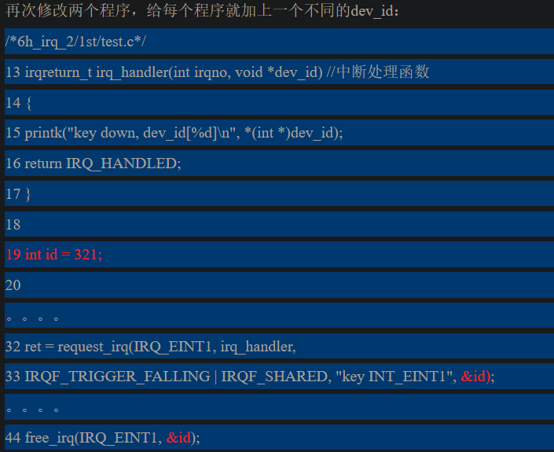
  - 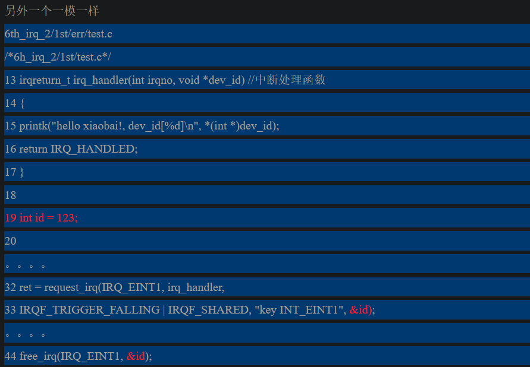

- 上述分享中断号成功后，同一个中断触发，两个中断处理函数均会执行

- 中断产生后的流程
  - 硬件角度
    - 当硬件（Hardware）产生中断，传给中断处理器（Interrupt controller），经过中断处理器的一轮筛选后，把中断传给处理器（Processer）。
  - 处理器接收到中断后
    - 1、处理器中断内核（processor interrupts the kernel）：这步骤如下：
      - 1.1、处理器会立即停止它正在进行的事情。
      - 1.2、处理器关闭中断。
      - 1.3、保存原来寄存器的值（这些值属于被中断的任务），切换工作模式至IRQ（S3C2440有7种工作模式，芯片手册有讲解，切换工作模式之前需要保存原来部分寄存器上的值，具体请看S3C2440芯片手册）。
    - 2、do_IRQ：（这个部分说得可能有错，因为我把内核的源代码仔细看过，这部分主要是为了引出下一个的函数handle_IRQ_event()）
      - 在ARM相关的内核代码我没找到do_IRQ函数，但我找到一个相关的——asm_do_IRQ。看看大概做了些什么事情：
      - 2.1、把中断号和一个在内核中存放对应的相关数据的结构体（这个结构体就是存放处理器中寄存器的值）作为参数，传参给asm_do_IRQ。
      - 2.2、asm_do_IRQ进行一系列的准备工作之后，调用函数generic_handle_irq()：
      - 2.3、generic_handle_irq中调用函数_do_IRQ：
      - 2.4、在__do_IRQ中，会判断该中断号是否已经注册了中断处理函数，如果没有则退出中断，切换至原来的工作模式。如果有，__do_IRQ会调用函数handle_IRQ_event()。
    - 3、irqreturn_t handle_IRQ_event(unsigned int irq, struct irqaction *action) 干了些什么：
      - 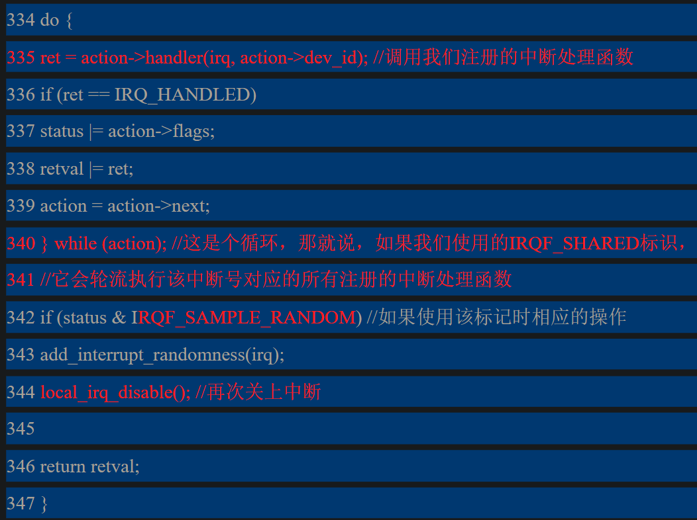

- 总结
  - 1、调用request_irq必须通过返回值判断是否成功。
  - 2、共享中断号时，所有共享这个中断号的request_irq都必须添加标记IRQF_SHARED，另外还需要使用一个独特的设备好dev_id，让内核能够通过dev_id对应注册时的中断处理函数。

# linux设备驱动归纳总结（六）：3.中断下半部之tasklet-diytvgy-ChinaUnix博客 (2024_2_15 16_45_12).html
- 如果在中断处理函数中没有禁止中断，该中断处理函数执行过程中仍有可能被其他中断打断。出于这样的原因，大家都希望中断处理函数执行得越快越好。

- 中断上下文中不能阻塞，这也限制了中断上下文中能干的事。

- 内核将整个的中断处理流程分为了上半部和下半部。
  - 上半部就是之前所说的中断处理函数，它能最快的响应中断，并且做一些必须在中断响应之后马上要做的事情。
  - 一些需要在中断处理函数后继续执行的操作，内核建议把它放在下半部执行

- 以网卡接收网络数据包为例
  - 上半部：网卡会通过中断告诉内核处理数据，内核会在网卡中断处理函数（上半部）执行一些网卡硬件的必要设置
  - 下半部：内核调用对应的下半部函数来处理网卡接收到的数据

- ***三种方法来实现下半部：软中断、tasklet和工作队列。***

## 软中断
- 软中断一般很少用于实现下半部，但tasklet是通过软中断实现的
- 软中断就是软件实现的异步中断，它的优先级比硬中断低，但比普通进程优先级高
- 软中断和硬中断一样不能休眠。

- 软中断是在编译时候静态分配的，要用软中断必须修改内核代码。 

- 内核中使用一个结构体数组管理软中断
  - static struct softirq_action softirq_vec[NR_SOFTIRQS] __cacheline_aligned_in_smp;
  - 内核通过一个softirq_action数组来维护的软中断，NR_SOFTIRQS是当前软中断的个数，kernel/softirq.c中

- softirq_action结构体
```c
/*include/linux/interrupt.h*/
struct softirq_action
{
void (*action)(struct softirq_action *); //软中断处理函数
};
//结构体里面就一个软中断函数，他的参数就是本身结构体的指针。之所以这样设计，是为了以后的拓展，如果在结构体中添加了新成员，也不需要修改函数接口
```

- 使用软中断实现下半部
  - include/linux/interrupt.h 中静态声明软中断
  - 为软中断注册处理函数
    - 通过函数open_sofuirq来注册软中断处理函数，使软中断索引号与中断处理函数对应。该函数在kernel/softirq.c 中定义：
  - 在中断处理函数返回前，触发对应的软中断。
    - 中断处理函数完成了必要的操作后，就应该调用函数raise_sotfirq触发软中断，让软中断执行中断下半部的操作
    - 触发软中断，并不是指马上执行该软中断，不然和在中断上执行没什么区别。它的作用只是告诉内核：下次执行软中断的时候，记得执行我这个软中断处理函数。

- 驱动程序中使用软中断处理中断下半部
  - 实现软中断处理函数 void xiaobai_action(struct softirq_action *t) //软中断处理函数
  - 中断处理函数末尾，调用 raise_softirq(XIAOBAI_SOFTIRQ); 从而触发软中断
  - init函数中 调用 open_softirq(XIAOBAI_SOFTIRQ, xiaobai_action); //注册软中断处理程序 

- 触发软中断函数raise_softirq并不会让软中断处理函数马上执行，它只是打了个标记，等到适合的时候再被实行。如在中断处理函数返回后，内核就会检查软中断是否被触发并执行触发的软中断。

- 软中断被调用的原理
  - 软中断会在do_softirq中被执行，其中核心部分在do_softirq中调用的__do_softirq中/*kernel/softirq.c*/

## tasklet
- 软中断索引号中，有两个用于实现tasklet的软中断索引号：HI_SOFTIRQ和TASKLET_SOFTIRQ。两个tasklet唯一的区别就是优先级的大小，一般使用TAKSLET_SOFTIRQ。

- 如何使用tasklet 实现下半部
  - 编写tasklet处理函数，定义并初始化结构体tasklet_struct：tasklet_struct中存在两个成员
    - void (*func)(unsigned long); //tasklet处理函数
    - unsigned long data; //给处理函数的传参
    - 有两种办法定义和初始化tasklet_struct。
      - 静态定义并初始化
      - 动态定义并初始化
  - 在中断处理函数返回前调度tasklet：
    - 调度并不是马上执行，只是打个标记，至于什么时候执行就要看内核的调度。
    - 调度使用函数 tasklet_schedule 或者 tasklet_hi_schedule，两个的区别是一个使用TASKLET_SOFTIRQ，另一个使用HI_SOFTIRQ。这两个函数都是一tasklet_struct指针
      - static inline void tasklet_schedule(struct tasklet_struct *t)
      - static inline void tasklet_hi_schedule(struct tasklet_struct *t)
  - 当模块卸载时，将tasklet_struct结构体移除：
    - void tasklet_kill(struct tasklet_struct *t)
    - 确保了 tasklet 不会被再次调度来运行，通常当一个设备正被关闭或者模块卸载时被调用。如果 tasklet 正在运行, 程序会休眠，等待直到它执行完毕
  - 禁止与激活tasklet的函数。被禁止的tasklet不能被调用，直到被激活：
    - static inline void tasklet_disable(struct tasklet_struct *t) //禁止
    - static inline void tasklet_enable(struct tasklet_struct *t) //激活

- 模块中要做的事情
  - 定义 tasklet_struct 结构体 和 对应处理函数
  - 中断处理函数末尾 调用  tasklet_schedule(&xiaobai_tasklet); 从而调度 tasklet
  - init函数中 tasklet_init(&xiaobai_tasklet, xiaobai_func, (unsigned long)123); 初始化 tasklet_struct 结构体
  - exit函数中 void tasklet_kill(struct tasklet_struct *t)  将tasklet_struct 结构体移除

- 使用软中断实现的优缺点很明显：
  - 优点：运行在软中断上下文，优先级比普通进程高，调度速度快。
  - 缺点：由于处于中断上下文，所以不能睡眠。

- 软中断和tasklet有什么区别？
  - 个人理解，tasklet是基于软中断实现的，基本上和软中断相同。但有一点不一样，
    - 如果在多处理器的情况下，内核不能保证软中断在哪个处理器上运行（听起来像废话），所以，***软中断之间需要考虑共享资源的保护。***
    - 而在tasklet，内核可以保证，两个同类型（TASKLET_SOFTIRQ和HI_SOFTIRQ）的tasklet不能同时执行，那就说明，***同类型tasklet之间，可以不考虑同类型tasklet之间的并发情况。***

# linux设备驱动归纳总结（六）_3.中断下半部之工作队列-diytvgy-ChinaUnix博客 (2024_2_15 16_46_36).html
- 相对于软中断/tasklet，工作对列运行在进程上下文，允许睡眠

- 通过工作队列，实现下半部机制
  - 定义并初始化工作队列 
    - struct workqueue_struct *xiaobai_wq; //定义工作队列
    - xiaobai_wq = create_workqueue("xiaobai");//函数传参是内核中工作队列的名称，返回值是workqueue_struct结构体的指针，该结构体用来维护一个工作队列。
  - 定义并初始化work结构体，同时实现下半部处理函数
    - 该结构体用于表示一个加入工作队列的任务，其中包含下半部处理函数指针、同时包含链表头结构，所有wrok_struct通过链表连接到一起
    - 静态定义并初始化work结构体
      - define DECLARE_WORK(n, f)
      - struct work_struct n = __WORK_INITIALIZER(n, f)//定义并初始化一个叫n的work_struct数据结构，它对应的的处理函数是f。
    - 动态初始化work结构体
      - 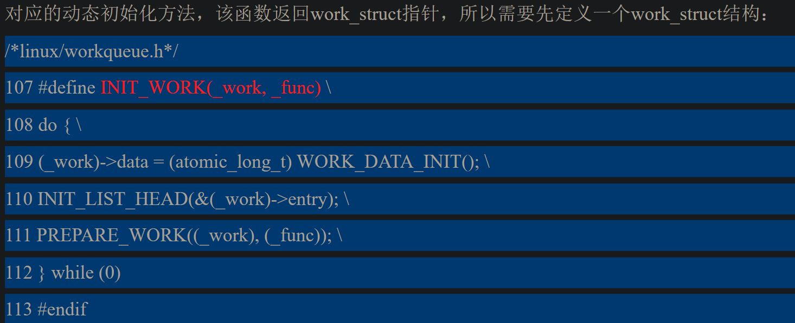
    - 实现下半部函数
      - 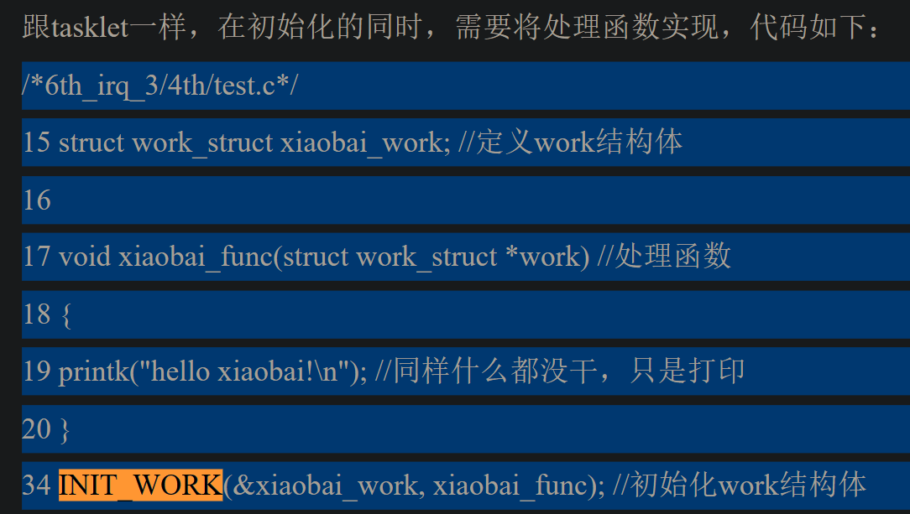
  - 在中断处理函数中调度任务：
    - int queue_work(struct workqueue_struct *wq, struct work_struct *work)
    - 将指定的任务（work_struct），添加到指定的工作队列中。同样的，调度并不代表处理函数能够马上执行，这由内核进程调度决定。
  - 在卸载模块时，刷新并注销工作队列：
    -  void flush_workqueue(struct workqueue_struct *wq) //刷新工作队列函数，该函数会一直等待，直到指定的工作队列中所有的任务都执行完毕并从工作队列中移除。
    -  void destroy_workqueue(struct workqueue_struct *wq)// 注销工作队列： 该函数是是创建工作队列的反操作，注销掉指定的工作队列。


- 驱动程序中使用工作队列
  - 代码中定义工作队列、work结构体、实现下半部处理函数
  - 中断处理函数末尾， queue_work(xiaobai_wq ,&xiaobai_work) 调度任务
  - init函数中初始化工作队列和work结构体
  - exit函数中刷新工作队列，注销工作队列


- 工作队列
  - 在内核中有一个默认的工作队列events，使用共享的工作队列可以省去创建和注销工作队列的步骤。
  - 多个不同的任务都加入到这个工作对列中，每个任务调度的速度就会比较慢
  - 一般默认工作队列都能满足要求，不需要创建一个新的。

- 使用共享的工作队列
  - 实现处理函数，定义并初始化work结构体：类似之前介绍的
  - 中断处理函数末尾，调度任务
    - int schedule_work(struct work_struct *work)
    - 该函数会把work_struct结构体加入到默认工作队列events中。

- 工作队列的实现
  - 工作者线程，是指负责执行在内核队列中任务的内核线程。
  - 在工作队列中，有专门的工作者线程来处理加入到工作队列中的任务。
  - 工作队列对应的工作者线程可能不止一个，每个处理器有且仅有一个工作队列对应的工作者线程。当然，如果内核中两个工作对列，那每个处理器就分别有两个工作者线程。
  - 工作对列workqueue_struct有一个成员cpu_workqueue_struct，每个工作者线程对应一个cpu_workqueue
  - cpu_workqueue_struct中存在内核链表，所有分配在这个处理器的work_struct将通过链表连在一起，等待执行，同时该结构体中存在指向当前执行的work_struct、指向关联自己的工作队列、指向对应的内核线程，即工作者线程 的工作者线程

- 如何选择使用哪种机制实现下半部
  - 软中断和tasklet优先级较高，性能较好，调度快，但不能睡眠。
  - 工作队列是内核的进程调度，相对来说较慢，但能睡眠。所以，如果你的下半部需要睡眠，那只能选择工作队列。否则最好用tasklet。

- 有函数能够使指定工作队列的任务延时执行
  - struct delayed_work
  - DECLARE_DELAYED_WORK(n,f)
  - INIT_DELAYED_WORK(struct delayed_work *work, void (*function)(void *));
  - int queue_delayed_work(struct workqueue_struct *queue, struct delayed_work *work, unsigned long delay);
  - schedule_delayed_work(struct delayed_work *work, unsigned long delay)

- Linux内核中的工作队列(workqueue)和等待队列(wait queue)是两个不同的概念和机制。
  - **工作队列(Workqueue)**是一种异步执行机制,它允许内核在某些条件满足时,将工作项(work item)安排到一个工作队列中,由专用的内核线程(worker thread)异步执行这些工作项。工作队列常用于延迟执行一些工作,或将耗时工作从中断上下文中分离出去,从而提高响应性能。
  - **等待队列(Wait Queue)**则是一种同步机制,用于协调不同执行流(通常是进程或线程)之间对共享资源的访问。当一个执行流需要等待某个条件满足(如IO完成、锁释放等)时,它可以将自己添加到相应的等待队列中,进入睡眠状态。当条件满足时,这个执行流会被唤醒继续执行。等待队列常用于进程同步、互斥等场景。
  - 两者的主要区别如下:
    - 目的不同:工作队列用于异步延迟执行工作,而等待队列用于进程/线程同步。
    - 使用场景不同:工作队列常用于中断、延迟工作等;等待队列用于进程/线程同步、互斥等。
    - 实现方式不同:工作队列依赖于内核线程执行工作项;等待队列依赖于进程/线程调度实现等待和唤醒。
    - 使用方式不同:工作队列通过提交工作项实现异步执行;等待队列通过睡眠/唤醒实现同步等待。
    - 虽然两者都涉及了队列的概念,但它们的作用和实现机制完全不同。工作队列和等待队列在Linux内核中分别发挥着异步执行和同步协调的重要作用,共同确保了内核的高效运行和资源利用。


# linux设备驱动归纳总结（七）：1.时间管理与内核延时-diytvgy-ChinaUnix博客 (2024_2_15 16_47_56).html
- 一些时间相关概念
  - 墙上时钟：也就是实际时间。
  - 系统时间：自系统启动开始所经过的时间。
  - 时钟中断：内核会周期性的产生时钟中断，在中断处理函数中执行一些与时间相关的操作，如更新时间，进程调度，检查时间片等。
  - 节拍率：在linux内核中，通过编程定义节拍率，也就是HZ。每1/HZ秒发生一次时钟中断。在ARM中，节拍率被定义为100，节拍率越大，系统进入时钟中断就越频繁，时间和进程调度等操作就越准确，但对系统的负担也就越大。
  - jiffies：该32位（unsigned long）的全局变量用来记录自系统启动以来产生的节拍的总数。系统启动时清零，每次时钟中断加一。所以，一秒内的时钟中断次数（或者说jiffies一秒内增加的值）也就等于HZ。如果系统时间以秒来表示，那就等于jiffies/HZ秒。
  - 实时时钟（RTC）：体系结构中用于维持系统时间的设备，就像电脑的BIOS，需要在关机状态时通过电池供电。系统启动时通过读取RTC来初始化墙上时钟。

- 用户空间和内核空间有其各自的节拍率

- jiffies是一个unsigned long类型的全局变量，当加到4294967295时溢出，从零开始继续增加，这也叫回绕。由于回绕的问题，内核提供了四个宏来比较超时，它们能正确的处理节拍数回绕情况
```bash
/*linux/jiffies.h */

#define time_after(a,b) \
(typecheck(unsigned long, a) && \
typecheck(unsigned long, b) && \
((long)(b) - (long)(a) < 0))
#define time_before(a,b) time_after(b,a)

#define time_after_eq(a,b) \
(typecheck(unsigned long, a) && \
typecheck(unsigned long, b) && \
((long)(a) - (long)(b) >= 0))
#define time_before_eq(a,b) time_after_eq(b,a)
```

## 内核延时的相关方法
- 忙等待
  - 即使用死循环，将时间变量大于某值作为跳出循环的判断依据
  ```c
  unsigned long delay = jiffies + 5*HZ //5*HZ = 5秒
  while(delay < jiffies)
  ;

  //内核也有另外一种版本：
  unsigned long delay = jiffies + 5*HZ //5*HZ = 5秒
  while(delay < jiffies)
  cpu_relax; //但ARM下cpu_relax是空语句。

  ///所以有了改进版：让出处理器。
  unsigned long delay = jiffies + 5*HZ //5*HZ = 5秒
  while(delay < jiffies)
  schedule(); //让出处理器，在延时这段时间内，内核重复一个操作，调度进程，而当前进程仍处于忙等待

  //jiffies是一个unsigned long类型的全局变量，当加到4294967295时溢出，从零开始继续增加，这也叫回绕。,为防止回绕使用time_before等进行时间对比
  unsigned long delay = jiffies + 5*HZ //5*HZ = 5秒
  while(time_before(jiffies, delay))
  schedule(); //让出处理器

  ```
- 短延时
  - 忙等待的最小时间间隔是1/HZ秒，假设HZ的值为100，那忙等待的时间间隔最小也只是10ms。但在有些内核代码中，不但需要很短的延时，而且时间精确度较高。
  - 能实现更短时间间隔的延时
    ```c
    void ndelay(unsigned long nsecs);
    void udelay(unsigned long usecs);
    void mdelay(unsigned long msecs);

    udelay(150); //延时150微秒
    ```
  - 一般的体系架构都没办法达到纳秒级的延时标准。
  - udelay的实现是靠执行次数循环达到延时效果。内核知道处理器一秒能执行多少次循环，udelay根据执行的延时时间在1s中的比例，得出需要延时的次数来达到延时。
  - mdelay是基于udelay实现的。超过1ms的延时不要使用udelay，建议使用mdelay。
  - 不管是哪种延时，真正的延时至少会达到要求的延时时间，但可能更长。
  - 它们也属于忙等待的一种，不过延时时间较短。

- schedule_timeout()： 
  - 更理想的延时方法  
  - 也不能保证睡眠时间和延时时间一致，只能尽量接近。
  ```c
  /*将任务设置为可中断睡眠状态，当然你也可以设置为TASK_UNINTERRUPTIBLE，但不建议*/
  set_current_state(TASK_INTERRUPTIBLE);
  /*小睡一会，s秒后唤醒*/
  schedule_timeout(s*HZ);
  ```

- 设置超时时间，在等待队列中睡眠：
  - 即之前等待队列中支持的功能，
  - 之前的等待队列中，等待事件成立，则对应进程被唤醒
  - 支持延时的等待队列中，如果在特定延时时间内等待事件到来，那任务被唤醒。否则，等到特定延时时间耗尽后事件还没发生，那也得唤醒任务。
  - 相关函数 wait_event_interruptible_timeout(wq, condition, timeout)
  ```c
  //使用大概如下：
  wait_queue_head_t wait;
  init_waitqueue_head(&wait);
  wait_event_interruptible_timeout(wait, 0, s*HZ); //延时s秒

  //上面的调用condition为0，那表示等待时间永远不成立，只有时间到才能唤醒，相当于：

  set_current_state(TASK_INTERRUPTIBLE);
  schedule_timeout(s*HZ);
  ```
  - schedule_timeout还少了等待队列创建的操作，减少内核负担。所以，如果不是既要等待延时，又要等待时间发生，那就没必要用到等待队列的延时了。

- 在持有锁和禁止中断时使用忙等待，因为这样会降低系统的速度和性能。

# linux设备驱动归纳总结（七）：2.内核定时器-diytvgy-ChinaUnix博客 (2024_2_15 16_48_20).html
- 定时器作用：能够使工作在指定的时间点上执行，而且不需要使用忙等待这类的延时方法。通过定义一个定时器，告之内核在哪个时间需要执行什么函数就可以了，等时间一到，内核会就执行指定的函数。

- 定时器的使用
  - 1、定义并初始化定时器结构体timer_list。
    - 结构体timer_list中存在定时器处理函数，函数参数，定时器时间等成员，需要用户设置
      - 静态定义并初始化：
        - struct timer_list TIMER_INITIALIZER(_function, _expires, _data);
      - 动态初始化：
        - /*定义一个名为my_timer的timer_list数据结构*/
        - struct timer_list my_timer;
        - /*初始化my_timer的部分内部成员*/
        - init_timer(&my_timer);
  - 2、设置超时时间，定义定时器处理函数和传参。
    - 即填充timer_list的三个成员：expires、function和data。
    - my_timer.expires = jiffies + 5*HZ; //2.设定定时器处理函数触发时间为5秒
    - my_timer.function = timer_func; //2.给结构体指定定时器处理函数
    - my_timer.data = (unsigned long)99; //2.设定定时器处理函数的传参
  - 3、激活定时器。
    - 一个函数，一旦调用，内核就会知道，在当前时候的5秒后，执行相应的处理函数
    - 定时器激活后，它只会在指定时间执行一次处理函数，执行后会将定时器在内核中移除。
    - add_timer(&my_timer); //3.激活定时器

- 在模块init函数中设置上述步骤，即可在模块加载指定时间后，执行定时器函数

- 注意调用定时器函数的进程不是加载模块时的进程，当调用add_timer后，就会将定时器交由内核来管理，当时间一到，内核调用进程swapper来执行处理函数。

- 定时器的删除和修改
  - 激活定时器后只能执行一遍，如果要实现隔指定时间又重复执行，那就要修改一下代码。在定时器处理函数中加上两条代码：每个2秒就会再次执行定时器处理函数。
    - my_timer.expires = jiffies + 2*HZ; //重新设定时间，在两秒后再执行
    - add_timer(&my_timer); //再次激活定时器
  - 两条代码也相当与一下的函数：
    - int mod_timer(struct timer_list *timer, unsigned long expires)  
    - 是改变定时器超时时间的函数，如果在指定的定时器(timer)没超时前调用，超时时间会更新为新的新的超时时间(expires)。如果在定时器超时后调用，那就相当于重新指定超时时间并再次激活定时器。
  - 在定时器没有超时前取消定时器，可以调用以下函数，该函数用来删除还没超时的定时器。
    - int del_timer(struct timer_list *timer)

- 利用定时器实现按键去抖
  - 每次进入中断，都会刷新定时器的值。当按下按键时，由于抖动的关系，会出现多次的中断，但只有最后的一次中断才会触发一次定时器处理函数，实际的按键后处理逻辑是在定时器处理函数中实现的

- 总结
  - 定时器的使用很简单，只需要三部：
  - 1、定义定时器结构体timer_list。
  - 2、设置超时时间，定义定时器处理函数和传参。
  - 3、激活定时器。
  - 另外还可以通过mod_timer和del_timer来修改或者删除定时器。


# linux设备驱动归纳总结（八）：1.总线、设备和驱动-diytvgy-ChinaUnix博客 (2024_2_15 16_49_04).html
## sysfs文件系统
- 2.6内核，内核把设备相关的信息归类在新增加sysfs文件系统，并将它挂载到/sys目录中，把设备信息归类的同时，让用户可以通过用户空间访问。
- 常见sys目录
  - block：用于管理块设备，系统中的每一个块设备会在该目录下对应一个子目录。
  - bus：用于管理总线，每注册一条总线，在该目录下有一个对应的子目录。
    - 其中，每个总线子目录下会有两个子目录：devices和drivers。
    - devices包含里系统中所有属于该总线的的设备。
    - drivers包含里系统中所有属于该总线的的驱动。
  - class：将系统中的设备按功能分类。
  - devices：该目录提供了系统中设备拓扑结构图。
  - dev：该目录已注册的设备节点的视图。
  - kernel：内核中的相关参数。
  - module：内核中的模块信息。
  - fireware：内核中的固件信息。
  - Fs：描述内核中的文件系统。

- sys中的其他目录都是将device目录下的数据加以转换加工而得。
  - 例如将usb设备归类到bus总线上，又把它归类到class，从而形成逻辑拓扑图
  
- 维护这些关系的结构体就包括kobject、kset、ktype和subsystem等数据结构

- 通过设备模型，内核实现的任务
  - 1、电源管理和系统关机。
  - 2、与用户空间通信。这个就比较容易理解，sys目录向用户展示了设备模型的结构图。
  - 3、热插拔设备。大概意思就是，当设备插入后，内核会根据插入的设备安装驱动，设备拔出后，内核又会自动卸载驱动。
  - 4、设备类型。将设备归类。

## 总线
- 总线来管理设备和驱动函数
- 总线有bus_type结构表示，其中要关注name字段表示总线名称，bus_attrs表示总线属性 match uevent probe表示总线方法
  - 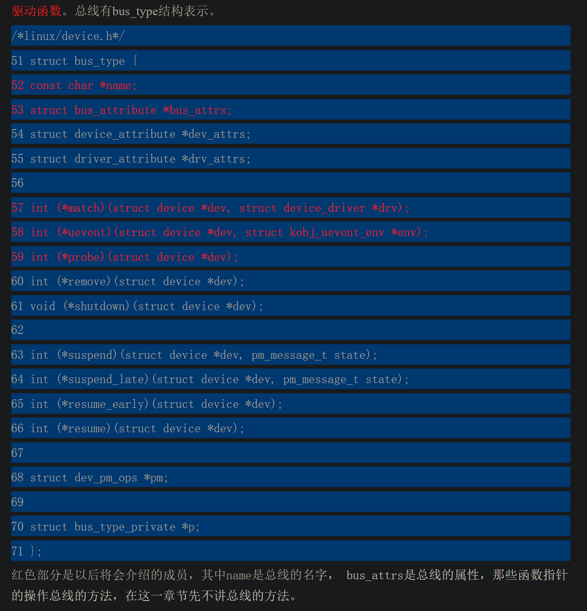
- 注册总线 删除总线
  - 1、定义一个bus_type结构体，并设置好需要设置的结构体成员。
  - 2、调用函数bus_register注册总线。函数原型如下： int bus_register(struct bus_type *bus) 该调用有可能失败，所以必须检查它的返回值，如果注册成功，会在/sys/bus下看到指定名字的总线。
  - 3、总线删除时调用 void bus_unregister(struct bus_type *bus)
- 模块中注册总线
  - 全局定义 bus_type 结构体，并赋值其中的成员变量（name bus_attrs之类的）
  - init函数中调用 bus_register注册
  - exit函数中调用 bus_unregister注销 

- 注册完毕后，/sys/bus/目录下会出现 bus_type结构体 name字段命名的一个目录，从而表示该总线

- bus_type结构体中的  struct bus_attribute *bus_attrs;  即总线的属性
  - 设置总线的属性后，会在对应的总线目录下增加了一个新的文件，通过对该文件的读写访问，触发相应的函数操作，从而实现/sys/的文件接口与内核设备模型的数据交互。
  - bus_attrs中存在show store函数指针
    - 当访问总线目录中的name文件时，就会触发show函数，一般会将指定的信息存放到数组buf，并传到用户空间显示。
    - 当修改总线目录中的name文件是，就会触发stroe函数，一般会将从用户空间传来的buf指针存放的count个字节内容存放到内核中。
    - 通过这样的文件，就能实现sys目录下的文件与内核设备模型之间的数据交互。
  - 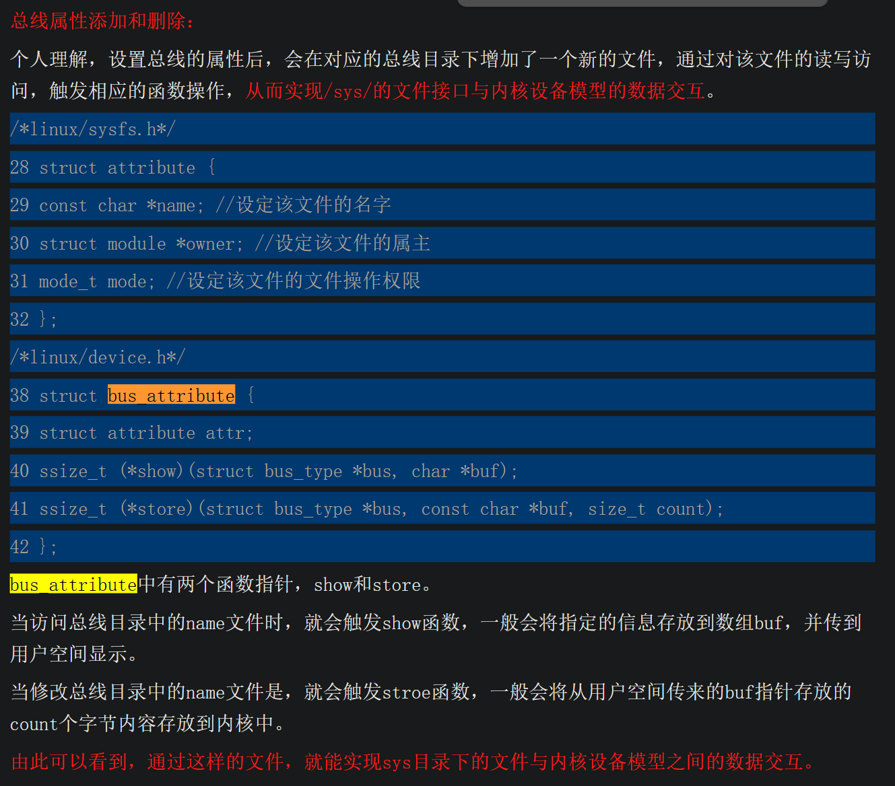

- bus_type结构体中的  struct bus_attribute *bus_attrs;  即总线的属性 创建与删除
  - 创建并初始化bus_attribute结构，使用宏BUS_ATTR
    - 该宏会定义一个名叫bus_attr__name（红色部分是固定的）的bus_attibute的结构，并且成员name设置为_name，文件权限mode设置为_mode，两个函数调用分别人show和store。
  - 将bus_attibute添加到指定的总线上 int bus_create_file(struct bus_type *bus, struct bus_attribute *attr)
    - ***一旦调用该函数，会就在指定bus总线的目录下新建一个名叫_name的文件，权限为_mode，当访问和修改该文件是会分别调用show和store函数调用。***
  - 如果不需要该属性时，使用以下函数删除 void bus_remove_file(struct bus_type *bus, struct bus_attribute *attr)

- 程序中设置带 struct bus_attribute *bus_attrs; 的总线设备
  - 全局定义 bus_type 结构体，并赋值其中的成员变量（name bus_attrs之类的）
  - 全局实现show store函数
  - 全局使用static BUS_ATTR(version, S_IRUGO|S_IWUGO, show_bus_version, store_bus_version); 定义bus_attrs结构体
  - init函数中调用 bus_register注册
  - init函数中 ret = bus_create_file(&usb_bus, &bus_attr_version); 为总线设备添加属性
  - exit函数中调用 bus_unregister注销 

## 设备
- linux系统中每个设备都用一个device结构的表示
```c
/*linux/device.h*/

struct device {
struct klist klist_children;
struct klist_node knode_parent; /* node in sibling list */
struct klist_node knode_driver;
struct klist_node knode_bus;
struct device *parent; //指定该设备的父设备，如果不指定(NULL)，注册后的设备目录在sys/device下
struct kobject kobj;
char bus_id[BUS_ID_SIZE]; /* position on parent bus */ //在总线识别设备的字符串，同时也是设备注册后的目录名字。即/sys/device目录下的文件名
struct bus_type *bus; /* type of bus device is on */ //指定该设备连接的总线 设置后在sys/bus/对应总线/device目录下有一个软连接
struct device_driver *driver; /* which driver has allocated this device */ //管理该设备的驱动函数
void *driver_data; /* data private to the driver */ //驱动程序的私有数据
struct dev_pm_info power;
void (*release)(struct device *dev); //当给设备的最后一个引用被删除时，调用该函数
};
```
- 在注册一个完整的device结构前，至少定义parrent、bus_id、bus和release成员。
  - bus_id 指定设备注册后对应目录的名字
  - ***bus 对应的总线，不加也行*** 即设备注册时，不一定要指定总线
  - release 这是必须的，不然卸载模块时会出错，不信自己试试

- 设备的注册和注销
  - 1、定义结构体device。
  - 2、调用注册函数：int device_register(struct device *dev) 函数失败返回非零，需要判断返回值来检查注册是否成功。
  - 设备注销函数 void device_unregister(struct device *dev)

- 设备的属性  device_attribute 结构体，和bus属性类似，其中包含show store属性
  - 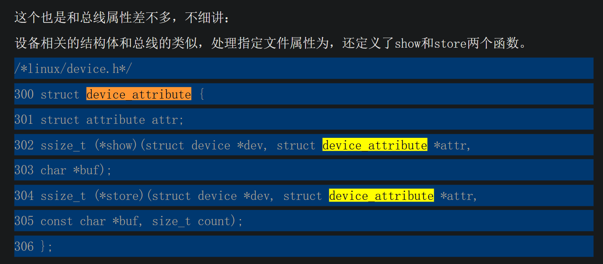

- 设备属性的设置，和bus的属性类似，使用宏定义设备属性结构体 device_attribute ，使用函数device_create_file 将属性注册到设备，使用 device_remove_file 将属性从设备中删除
  - 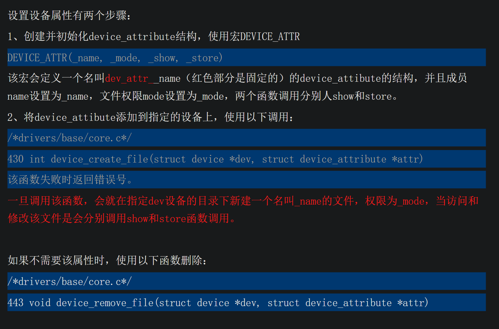

- 内核模块中注册设备并设置设备属性
  - 导入总线结构体 bus_type usb_bus
  - 实现设备release函数
  - 实现设备结构体 usb_device
    - 其中指定bus_id、总线和release函数
  - 实现属性的show store函数
  - 定义 device_attribute 结构体积
  - init函数中 device_register 注册设备  device_create_file 为设备添加属性
  - exit函数中 device_remove_file 为设备取消属性  device_unregister 注销设备
## 驱动程序
- struct device_driver 贴出一些重要的成员：
```c
/*linux/device.h*/

struct device_driver {
  const char *name; //驱动函数的名字，在对应总线的driver目录下显示
  struct bus_type *bus; //指定该驱动程序所操作的总线类型，必须设置，不然会注册失败
  struct module *owner;
  const char *mod_name; /* used for built-in modules */
  int (*probe) (struct device *dev); //探测函数，以后会讲，当驱动和设备在总线的match函数中完成匹配后，内核调用驱动的probe函数开始操作设备，即驱动执行的第一个函数
  int (*remove) (struct device *dev); //卸载函数，当设备从系统中删除时调用，以后讲
  void (*shutdown) (struct device *dev); //当系统关机是调用
  int (*suspend) (struct device *dev, pm_message_t state);
  int (*resume) (struct device *dev);
  struct attribute_group **groups;
  struct dev_pm_ops *pm;
  struct driver_private *p;
};
```
- 在注册驱动函数是必须指定该驱动函数对应的总线，因为驱动函数注册成功后，会存放在对应总线的driver目录下，如果没有总线，注册当然会失败。这一点和设备不一样

- 注册成功后的驱动位于/sys/bus/对应总线名/driver 目录下 故驱动注册时，必须指定bus

- 驱动的注册
  - 与总线的注册一样：
    - 1、定义结构体device_driver。
    - 2、调用注册函数：int driver_register(struct device_driver *drv) 函数失败返回非零，需要判断返回值来检查注册是否成功。
  - 设备注销函数： void driver_unregister(struct device_driver *drv)

- 驱动属性  driver_attribute  和总线已经设备属性类似，需要指定show和store函数
```c
struct driver_attribute {
  struct attribute attr;
  ssize_t (*show)(struct device_driver *driver, char *buf);
  ssize_t (*store)(struct device_driver *driver, const char *buf,size_t count);
};

```
- 设置驱动属性 和之前一样，定义驱动结构体，使用特定函数注册和注销
  - DRIVER_ATTR(_name, _mode, _show, _store) 注册驱动结构体
    - 该宏会定义一个名叫driver_attr__name（红色部分是固定的）的driver_attibute的结构，并且成员name设置为_name，文件权限mode设置为_mode，两个函数调用分别人show和store。
  - 将驱动属性添加到指定驱动
    - int driver_create_file(struct device_driver *drv, struct driver_attribute *attr)该函数失败时返回错误号。
  - 删除驱动属性
    - void driver_remove_file(struct device_driver *drv, struct driver_attribute *attr)

- 内核模块中注册驱动
  - 导入总线结构体 bus_type usb_bus
  - 实现驱动结构体 device_driver
  - 实现show store函数
  - 注册 驱动属性的接结构体 driver_attribute static DRIVER_ATTR(version, S_IRUGO|S_IWUGO,show_driver_version, store_driver_version);
  - init函数中
    - 注册驱动 driver_register(&usb_driver);
    - 为驱动设置属性 driver_create_file(&usb_driver, &driver_attr_version);
  - exit函数中
    - 注销驱动 driver_unregister(&usb_driver);
    - 删除属性 driver_remove_file(&usb_driver, &driver_attr_version);

- 总结
  - 注册函数：xx_register。
  - 注销函数：xx+unregister。
  - 属性结构体：xx_attribute。
  - 创建属性文件函数：xx_create_file。
  - 删除属性文件函数：xx_remove_file。
  - 其中xx可以是总线(bus)、设备(device)或者驱动函数(deriver)。
  - 一但注册成功，就会在/sys目录下相应的地方创建一个自己命名的目录。其中，设备和驱动函数还可以添加到指定的bus目录下。
    - 总线的成功注册后会在/sys/bus目录下创建相应的目录。
    - 设备的成功注册后会在/sys/device目录下创建相应的目录，如果指定总线，会在指定总线目录/sys/bus/xx/device下创建一个指向/sys/device目录的软连接。
    - 驱动函数的公共注册会在/sys/bus/xx/driver目录下创建相应的目录。
  - 属性文件提供了shoe和store两个函数调用，当读写文件时会触发相应的函数调用，实现内核sysfs与用户空间的数据交互。


# linux设备驱动归纳总结（八）：2.match.probe.remove-diytvgy-ChinaUnix博客 (2024_2_15 16_49_45).html
- 将usb设备 usb总线 usb驱动分别使用三个c文件实现，文件中对设备 总线 驱动进行注册，加载时需要先加载总线（因为驱动和设备均指定了该总线）故卸载时总线模块最后卸载
## 配对函数(match)（来自bus提供）、探测函数(probe)和卸载函数(remove)（来自驱动提供）
- 配对函数(match)，它是总线结构体bus_type的其中一个成员：int (*match)(struct device *dev, struct device_driver *drv);
- 当总线上添加了新设备或者新驱动函数的时候，内核会调用一次或者多次这个函数。
- 举例，如果我现在添加了一个新的驱动函数，内核就会调用所属总线的match函数，配对总线上所有的设备，如果驱动能够处理其中一个设备，函数返回0，告诉内核配对成功。
- 一般的，match函数是判断设备的结构体成员device->bus_id和驱动函数的结构体成员device_driver->name是否一致，如果一致，那就表明配对成功。
  - 即驱动和设备的name相关字段一致，则说明两者能否匹配上

- 探测函数(probe)，它是驱动函数结构体中的一个成员：
  - 当配对(match)成功后，内核就会调用指定驱动中的probe函数来查询设备能否被该驱动操作，如果可以，驱动就会对该设备进行相应的操作，如初始化。所以说，***真正的驱动函数入口是在probe函数中。***
  - int (*probe) (struct device *dev);

- 卸载函数(remove)，它是驱动函数结构体中的一个成员：
  - 当该驱动函数或者驱动函数正在操作的设备被移除时，内核会调用驱动函数中的remove函数调用，进行一些设备卸载相应的操作。

## 多个设备与驱动的配对
- 多个设备对应一个驱动：  
  - 例如match函数中，只要设备的bus_id和驱动的name的前7个字符相同，则认为匹配到
  - 实验证明 一个驱动可以对应多个设备，即mach成功后，驱动正常执行其probe函数，从而尝试操作设备
- 一个设备对应多个驱动
  - 上面的验证表明，一个设备只能对应一个驱动，当一个设备匹配驱动后，再加载另一个符合标准的驱动模块，则match函数表示匹配成功，但该驱动模块的probe函数不会被调用


# linux设备驱动归纳总结(八)3设备模型的分层与面向对象-diytvgy-ChinaUnix博客 (2024_2_15 16_50_05).html
- 之前的设备和驱动函数注册时，它们是自己指定所属的总线。但是，内核开发人员觉得，这样的方法不好，应该由总线来提供设备和驱动的注册函数。当设备和驱动需要注册到指定总线时，那就必须使用该总线为设备和驱动提供的注册函数。
```c
/*8th_devModule_3/1st/bus.c*/
/*总线提供的设备注册函数*/
int usb_device_register(struct device *dev)
{
    dev->bs u= &usb_bus; //设备device的总线为usb_bus
    return device_register(dev); //注册此device
}
void usb_device_unregister(struct device *dev)
{
    device_unregister(dev);
}
EXPORT_SYMBOL(usb_device_register);
EXPORT_SYMBOL(usb_device_unregister);
/*总线提供的驱动注册函数*/
int usb_driver_register(struct device_driver *drv)
{
    drv->bus = &usb_bus; //设置driver的总线为usb_bus
    return driver_register(drv); //注册此driver
}
void usb_driver_unregister(struct device_driver *drv)
{
    driver_unregister(drv);
}
EXPORT_SYMBOL(usb_driver_register);
EXPORT_SYMBOL(usb_driver_unregister);
```
- 再写一个bus.h，让设备和驱动函数包含该头文件后能够使用总线提供的驱动函数。即将设备和驱动注册以及绑定总线的过程由对应总线封装好函数，从而调用
```c
/*8th_devModule_3/1st/bus.h*/

#ifndef _BUS_H
#define _BUS_H

int usb_device_register(struct device *dev);
void usb_device_unregister(struct device *dev);

int usb_driver_register(struct device_driver *drv);
void usb_driver_unregister(struct device_driver *drv);  
#endif /* _BUS_H */
```
## 面向对象思想——结构内嵌
- 将device结构体内嵌到其他结构体中，从而形成具体类型设备的结构体，类似于内嵌device后，实现了device结构体的子类
- device_driver也一样
- device结构体分别包含了设备模型的基本信息。然后，大多数的子系统还会记录该结构体以外但与设备相关的信息。因此，单纯用一个device结构来表示设备是很少见的，而是把device结构体内嵌到其他的结构体中。当然，device_driver也是一样。
```c
/*8th_devModule_3/2nd/bus.h*/

struct usb_device{ //在usb_device中包含device结构体
    unsigned long phys, virt; //存放设备和物理地址和对应的虚拟地址
    int irq; //存放设备的中断号
    int VendorID, DeviceID; //存放设备的生产厂商编号和设备编号
    struct device dev;
 };

struct usb_driver{ //在usb_driver中包含device_driver结构体
    int VendorID, DeviceID;
    struct device_driver drv;
 };

int usb_device_register(struct usb_device *usb_dev);
void usb_device_unregister(struct usb_device *usb_dev);

int usb_driver_register(struct usb_driver *usb_drv);
void usb_driver_unregister(struct usb_driver *usb_drv);
```

- 为适应上述变化，相关函数的传参均会发生变化，主要是使用container_of从内嵌的结构体中获得被嵌入的外层结构体的指针，从而获得外层结构体中的关键数据
  - 具体而言，可以修改
    - match函数
    - 驱动注册函数

- 平台类设备也是基于上述封装思路产生的，其实平台类就是这样一步步封装起来的。

# linux设备驱动归纳总结（八）：4.总线热插拔-diytvgy-ChinaUnix博客 (2024_2_15 16_50_25).html
- 在之前的代码，需要我自己手动去加载驱动和设备的模块，但在现实的情况下，一般是当设备一被插入，系统自己会注册设备，并调用合适的驱动
- 要实现的是，在加载了usb总线和usb鼠标驱动的前提下，当有usb鼠标插入，系统自己进行设备注册的操作。当然，上面的usb鼠标是我自己想象出来的，当我一按下按键（对应中断E_INT1），就代表有usb鼠标插入。
- 即将之前由devie.ko实现的操作交由中断处理函数来执行，当我按下按键，触发中断自动执行。（即热插拔）
- 具体而言，是在总线驱动中注册中断处理函数，并通过工作队列实现中断下半部，中断下半部中调用 usb_device_register(&mouse_dev); 完成设备注册，故当bus接收到中断，就会自动注册设备，此前驱动已经注册过，bus会调用match开始匹配驱动和设备

# linux设备驱动归纳总结（九）：1.platform设备驱动-diytvgy-ChinaUnix博客 (2024_2_15 16_51_38).html
- 平台类总线设备其实就是总线的一个封装。
- 一个现实的linux设备和驱动通常都需要挂接在一种总线上，比较常见的总线有USB、PCI总线等。但是，在嵌入式系统里面，SoC系统中集成的独立的外设控制器、挂接在SoC内存空间的外设却不依附与此类总线
- platform总线对加入到该总线的设备和驱动分别封装了两个结构体——platform_device和platform_driver。并且提供了对应的注册函数。当然，前提是要包含头文件。
- 需要在platform总线上注册设备和驱动，只要定义指定的结构体后调用platform给出的注册函数就可以了。

## platform总线
  - linux在系统启动时就注册了platform总线，总线中定义了成员名字和match函数，当有总线或者设备注册到platform总线时，内核自动调用match函数，判断设备和驱动的name是否一致。
    - 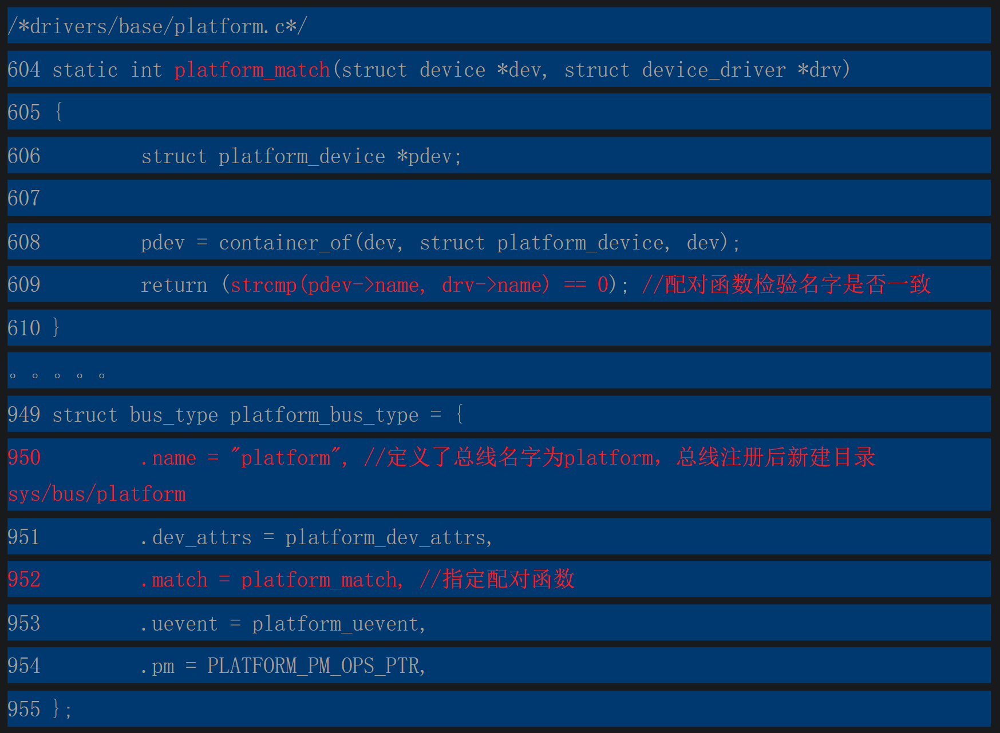

## platform设备
  - platform设备对应的结构体paltform_device：
  ```c
  /*linux/platform_device.h*/
  struct platform_device {
    const char * name; //设备的名字，这将代替device->dev_id，用作sys/device下显示的目录名
    int id; //设备id，用于给插入给该总线并且具有相同name的设备编号，如果只有一个设备的话填-1。
    struct device dev; //结构体中内嵌的device结构体。
    u32 num_resources; //资源数。
    struct resource * resource; //用于存放资源的数组。
  };
  ```
  - platform_device的注册和注销使用以下函数： 注册后，同样会在/sys/device/目录下创建一个以name命名的目录，并且创建软连接到/sys/bus/platform/device下。
    - int platform_device_register(struct platform_device *pdev) //同样的，需要判断返回值
    - void platform_device_unregister(struct platform_device *pdev)

## platform驱动
  - platform驱动对应的结构体paltform_driver：
```c
/*linux/platform_device.h*/
struct platform_driver {
  int (*probe)(struct platform_device *);
  int (*remove)(struct platform_device *);
  void (*shutdown)(struct platform_device *);
  int (*suspend)(struct platform_device *, pm_message_t state);
  int (*suspend_late)(struct platform_device *, pm_message_t state);
  int (*resume_early)(struct platform_device *);
  int (*resume)(struct platform_device *);
  struct device_driver driver;
};
```
  - platform_driver结构体内嵌了device_driver，并且实现了prob、remove等操作。其实，当内核需要调用probe函数时，它会调用driver->probe，在dricer->probe中再调用platform_driver->probe。

- platform_driver的注册和注销
  - /*drivers/base/platform.c*/
  - int platform_driver_register(struct platform_driver *drv)
  - void platform_driver_unregister(struct platform_driver *drv)
  - 注册成功后内核会在/sys/bus/platform/driver/目录下创建一个名字为driver->name的目录

-可以将之前的设备和驱动代码均修改为platform_driver和platform_device类型的

## platform设备的资源和数据
- platform设备对应的结构体paltform_device：
```c
/*linux/platform_device.h*/
struct platform_device {
  const char * name; //设备的名字，这将代替device->dev_id，用作sys/device下显示的目录名
  int id; //设备id，用于给插入给该总线并且具有相同name的设备编号，如果只有一个设备的话填-1。
  struct device dev; //结构体中内嵌的device结构体。
  u32 num_resources; //资源数。
  struct resource * resource; //用于存放资源的数组。
};
```
- resource是一个指向platform资源数组的指针，该数组中有num_resource个资源
- struct resource 结构体的形式
```c
/*linux/ioport.h"*/
struct resource {
    resource_size_t start; //资源的开始值
    resource_size_t end;//资源结束值
    const char *name;
    unsigned long flags;//资源类型。
    struct resource *parent, *sibling, *child;
};
```
- 资源类型 flags
  - 常见的flags有IORESOURCE_MEM和IORESOURCE_IRQ。其他的可以自己查看include/linux/ioport.h
  - 如果fiags为IORESOURCE_MEM，start和end分别是该设备的连续的开始和结束地址，如果不连续你可以定义两个或者更多的资源结构体。
  - 如果flags为IORESOURCE_IRQ，start和end分别是该设备连续的开始和结束的连续中断号，如果不连续可以分开定义。
  - 当然，如果地址或者中断只有一个，你可以将start和end定义成一样。

- 代码执行过程中，可以通过paltform_device中的resource字段获取设备对应资源，驱动程序的目的往往就是对设备的资源进行操作，从而控制设备

- device结构体下有一个paltform_data：这是用于platform，device的代码不会使用该结构体。这是一个void指针类型，用于存放platform的数据地址，类似字符设备时介绍的private_data
  - void *platform_data; /* Platform specific data, device391 core doesn't touch it */
## platform设备的静态注册
- 设备和驱动都是通过手动加载的，但有些情况下，内核已经为设备注册到platform总线上，只需要我们注册驱动就可以了
- 上述内核将设备注册到platfrom的过程即 platform设备的静态注册

- 内核是从哪里获取静态注册的platform_device。
  - 内核是从 arch/arm/mach-s3c2440/mach-mini2440.c文件中获取到platform_device的信息：其中有个 struct platform_device 的数组，可以向其添加自定义的元素，从而实现静态注册
  - 这个数组存放着所有静态注册的platform_device信息
  ```c
  /*arch/arm/mach-s3c2440/mach-mini2440.c*/
  static struct platform_device *mini2440_devices[] __initdata = {
      &s3c_device_usb,
      &s3c_device_rtc,
      &s3c_device_lcd,
      &s3c_device_wdt,
      &s3c_device_led, //这是我新加的
      &s3c_device_i2c0,
      &s3c_device_iis,
      &s3c_device_dm9k,
      &net_device_cs8900,
      &s3c24xx_uda134x,
  };
  ```
- arch/arm/plat-s3c24xx/devs.c 内核在在这个文件中声明并定义s3c_device_wdt的platform_device结构体 故自己新加的platfrom设备结构体也要在此处实现
- arch/arm/plat-s3c/include/plat/devs.h：platform_match函数读取上述文件中的platform_device信息来跟platform_driver匹配。所以，新加的platform_device结构体需要在该文件中声明
- 修改完上面的3个文件后，重新编译内核后就实现了静态注册platform设备，在内核启动时会自动注册s3c_device_led。所以，我们只需要注册platform驱动就可以了

# linux设备驱动归纳总结（十）：1.udev&misc-diytvgy-ChinaUnix博客 (2024_2_15 16_51_57).html
## 动态创建设备节点——udev
- 之前加载字符型设备后是通过命令mknod来创建设备节点的。在2.6内核中，有一个名叫udev的后台程序，它通过读取/sys/class的信息，一旦添加的新的设备，该后台程序就会自动创建设备节点。

- 要使用动态创建设备节点，首先要运行udev后台程序。
  - 1、移植udev到嵌入式系统中。移植udev后，系统启动是就会自己启动udev程序。具体方法见文章
  - 2、在编译busybox时加入mdev。
- 在代码中使用动态创建函数
  - udev 通过读取读取/sys/class的信息创建设备节点，所以此时目的是在/sys/class目录下设置相应信息
    - 创建一个类 struct class *class_create(struct module *owner, const char *name)
      - owner用于指定该类的所属，一般填写THIS_MODULE。
      - name是指定该类该/sys/class/目录下的目录名字。
      - 同样的，该操作有可能出错，需要检验返回值。
      - 类创建成功后会在/sys/class创建一个以name命名的目录。
    - 注销类
      - void class_destroy(struct class *cls)
    - 创建类后，就可以调用以下函数注册 类设备，将设备加入到指定的类中，这样udev就可以才class目录下读取信息后动态创建设备节点了：
      - struct device *device_create(struct class *class, struct device *parent,dev_t devt, void *drvdata, const char *fmt, ...)
        - class是用于指定所属的class。
        - parent用于指定设备的父设备，一般填NULL就可以了。
        - Devt用于指定该设备的设备号。
        - drvdata用于指定class下的数据，一般也不用传。
        - fmt就是动态创建的设备文件的名字，一般格式："%s", "test_led"。
        - 设个函数成功调用会在/sys/devices/virtual的对应总线下创建一个test_led的目录，并且软连接到/sys/class对应的总线目录下。
    - 注销类设备
      - void device_destroy(struct class *class, dev_t devt)
- 上面的两步并没有真正创建设备文件，只有在udev读取/sys/class信息后发现tesl_led，才会真正创建设备文件

- 将上述代码安排在驱动程序的init以及exit函数中，则可以在加载驱动程序时触发，从而动态创建设备节点
## 杂设备——misc
- 杂设备就是内核自动帮你分配设备号并且自动创建设备文件。
  - 1、自动分配设备号，是指所有注册为杂设备的设备的主设备号为10，而次设备号内核自动分配。
  - 2、自动创建设备文件是指，内核会使用udev（前提是你已经移植udev），动态创建设备节点。

- 杂设备结构体  
  - 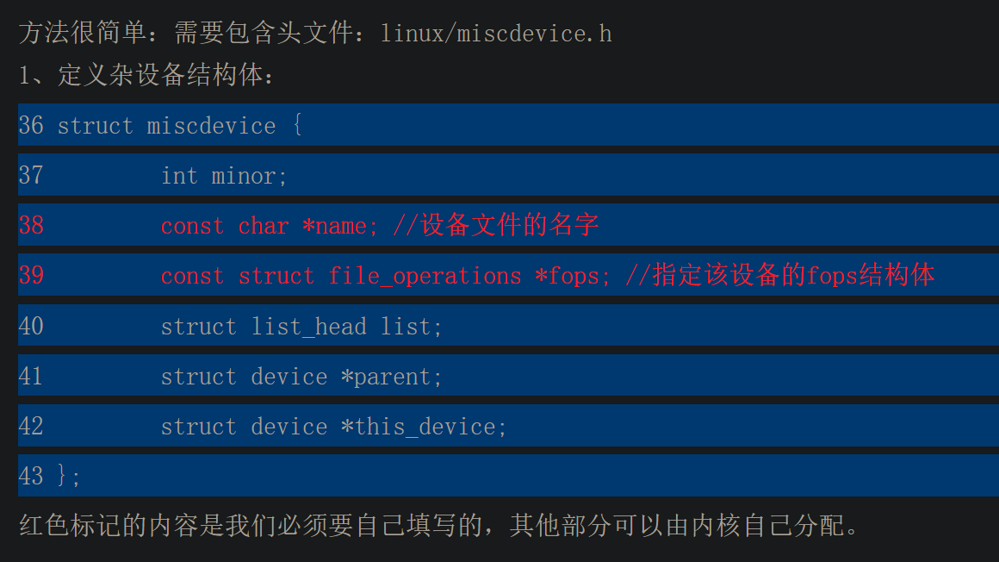

- 杂设备注册和注销
  - int misc_register(struct miscdevice * misc); //注册
  - int misc_deregister(struct miscdevice *misc); //注销


# linux设备驱动归纳总结（十一）：简单的看门狗驱动-diytvgy-ChinaUnix博客 (2024_2_15 16_52_10).html
- 示例代码，供参考


# linux设备驱动归纳总结（十二）：简单的数码相框-diytvgy-ChinaUnix博客 (2024_2_15 16_52_35).html
- DMA编程，
  - 简单的理解就会调用一个函数，函数给你返回两个地址，一个是虚拟地址，一个是对应的物理地址。只要你的程序往虚拟地址中读写数据，实际就会往物理地址写数据。主要的特点就是：数据的传输不需要经过处理器，而是2440中的DMA负责传输
  - 对应函数：void *dma_alloc_writecombine(struct device *dev, size_t size, dma_addr_t *handle, gfp_t gfp)

- 应用程序中调用mmap，驱动就会把一块实际的内存地址映射到应用层，并返回一个地址给用户操作。


# linux设备驱动归纳总结（十三）：1.触摸屏与ADC时钟-diytvgy-ChinaUnix博客 (2024_2_15 16_52_52).html


# 相关代码
https://github.com/28Ln/Linux_DeviceDriver/tree/main?tab=readme-ov-file
