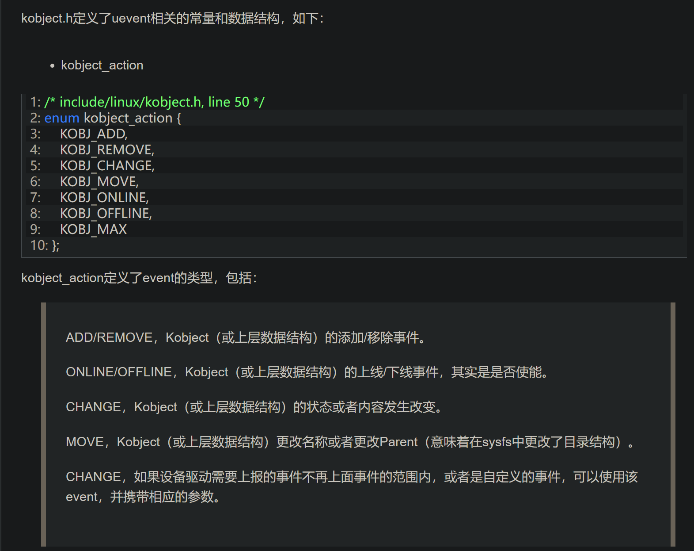

## http://www.wowotech.net/device_model/13.html
- Linux设备模型(1)_基本概念 (2024_1_23 08_43_51).html
- 设备驱动模型四大结构：Bus Class Device Device Driver
- 什么是Platform Bus？
  - 在计算机中有这样一类设备，它们通过各自的设备控制器，直接和CPU连接，CPU可以通过常规的寻址操作访问它们（或者说访问它们的控制器）。这种连接方式，并不属于传统意义上的总线连接。但设备模型应该具备普适性，因此Linux就虚构了一条Platform Bus，供这些设备挂靠。
- 热插拔
  - 在Linux内核中，只要任何Device和Device Driver具有相同的名字，内核就会执行Device Driver结构中的初始化函数（probe），该函数会初始化设备，使其为可用状态。
  - 大多数热拔插设备而言，它们的Device Driver一直存在内核中。当设备没有插入时，其Device结构不存在，因而其Driver也就不执行初始化操作。当设备插入时，内核会创建一个Device结构（名称和Driver相同），此时就会触发Driver的执行。这就是即插即用的概念。
- 通过"Bus-->Device”类型的树状结构（见2.1章节的图例）解决设备之间的依赖，而这种依赖在开关机、电源管理等过程中尤为重要。即要启动一个设备，需要先启动其依赖的设备

## http://www.wowotech.net/device_model/kobject.html
- Linux设备模型(2)_Kobject (2024_1_23 08_56_15).html
- kobject提供的功能
  - 通过parent指针，可以将所有Kobject以层次结构的形式组合起来。
  - 使用一个引用计数（reference count），来记录Kobject被引用的次数，并在引用次数变为0时把它释放（这是Kobject诞生时的唯一功能）。
  - 和sysfs虚拟文件系统配合，将每一个Kobject及其特性，以文件的形式，开放到用户空间

- 注1：在Linux中，Kobject几乎不会单独存在。它的主要功能，就是内嵌在一个大型的数据结构中，为这个数据结构提供一些底层的功能实现。
- 注2：Linux driver开发者，很少会直接使用Kobject以及它提供的接口，而是使用构建在Kobject之上的设备模型接口。

- 源码位置
  - include/linux/kobject.h
  - lib/kobject.c
  - 其中kobject.h为Kobject的头文件，包含所有的数据结构定义和接口声明。kobject.c为核心功能的实现。

- Kobject, Kset和Ktype这三个概念。
  - Kobject是基本数据类型，每个Kobject都会在"/sys/“文件系统中以目录的形式出现。
  - Ktype代表Kobject（严格地讲，是包含了Kobject的数据结构）的属性操作集合（由于通用性，多个Kobject可能共用同一个属性操作集，因此把Ktype独立出来了）。
  - Kset是一个特殊的Kobject（因此它也会在"/sys/“文件系统中以目录的形式出现），它用来集合相似的Kobject（这些Kobject可以是相同属性的，也可以不同属性的）。

- kobject的数据结构
  - Uevent提供了“用户空间通知”的功能实现，通过该功能，当内核中有Kobject的增加、删除、修改等动作时，会通知用户空间。有关该功能的具体内容，会在其它文章详细描述。

- kset的结构（可以视为用于表示一群kobject的结构）（其中关键字段保存了uevent操作函数集合，用于支持uevent操作）
  - 关键字段：uevent_ops，该kset的uevent操作函数集，任何Kobject需要上报uevent时，都要调用它所从属的kset的uevent_ops，添加环境变量，或者过滤event（kset可以决定哪些event可以上报）如果一个kobject不属于任何kset时，是不允许发送uevent的。

- ktype的结构（可以视为用于表示一群kobject在释放、sys文件操作过程中所用到的函数）（该结构中保存的release函数用于释放kobject结构，同时sysfs_ops支持了kobject在sys目录中的文件接口）
  - 关键是release 回调函数，通过该回调函数，可以将包含该种类型kobject的数据结构的内存空间释放掉。
  - 关键是 sysfs_ops，该种类型的Kobject的sysfs文件系统接口。当操作sys目录对应文件时，触发此处的函数

- kobj kset ktype之间的关系
  - 
  - 

- kobject的使用流程
  - 
  - 
- kobject的分配和释放，有两种方法
  - 通过kmalloc自行分配（一般是跟随上层数据结构分配），并在初始化后添加到kernel。这种方法涉及如下接口：
  - Kobject模块可以使用kobject_create自行分配空间，并内置了一个ktype（dynamic_kobj_ktype），用于在计数为0是释放空间。代码如下：

- Kobject引用计数的修改
  - 通过kobject_get和kobject_put可以修改kobject的引用计数，并在计数为0时，调用ktype的release接口，释放占用空间。

- Kset的初始化、注册

- 太棒了，我开始逐渐理解一切

# http://www.wowotech.net/device_model/uevent.html
- Linux设备模型(3)_Uevent (2024_1_25 14_22_44).html
- uevent是什么
  - Uevent是Kobject的一部分，用于在Kobject状态发生改变时，例如增加、移除等，通知用户空间程序。用户空间程序收到这样的事件后，会做相应的处理。
  - U盘插入后，USB相关的驱动软件会动态创建用于表示该U盘的device结构（相应的也包括其中的kobject），并告知用户空间程序，为该U盘动态的创建/dev/目录下的设备节点，更进一步，可以通知其它的应用程序，将该U盘设备mount到系统中，从而动态的支持该设备。

- 内核空间中的uevent
  - 
  - 设备产生事件，则表示设备的结构体device中的kobject中提供的uevent接口会被触发，通过kmod或netlink机制通知用户空间 

- 代码位置
  - Uevent的代码比较简单，主要涉及kobject.h和kobject_uevent.c两个文件，如下：
  - include/linux/kobject.h
  - lib/kobject_uevent.c

- kobject_action 结构定义了event的不同事件类型
  - 
  
- kobj_uevent_env 使用komod上报事件，会调用用户空间可执行程序，kobj_uevent_env 结构用于规定此时的环境变量
  - 

- kset_uevent_ops是为kset量身订做的一个数据结构，里面包含filter、uevent、 name函数，
  - filter函数用于过滤同一个kset中kobject发起的uevent，
  - uevent函数用于给同一个kset中kobject发起的uevent添加环境变量
  - name，该接口可以返回kset的名称。如果一个kset没有合法的名称，则其下的所有Kobject将不允许上报uvent

- 通过kobject.h，uevent模块提供了如下的API（这些API的实现是在"lib/kobject_uevent.c”文件中）： 
  - kobject_uevent_env，以envp为环境变量，上报一个指定action的uevent。环境变量的作用是为执行用户空间程序指定运行环境。具体动作如下：
  - kobject_uevent，和kobject_uevent_env功能一样，只是没有指定任何的环境变量。
  - add_uevent_var，以格式化字符的形式（类似printf、printk等），将环境变量copy到env指针中。
  - kobject_action_type，将enum kobject_action类型的Action，转换为字符串。
  
- 可以在编译内核时，通过CONFIG_UEVENT_HELPER_PATH配置项，静态指定uevent helper ，该程序用于在kmod处理uevent的情况下作为uevent的处理程序，现在内核不再推荐使用该方式。因此内核编译时，需要把该配置项留空。

- 现在指定uevent处理程序的方法（kmod模式下）
  - 在系统启动后，大部分的设备已经ready，可以根据需要，重新指定一个uevent helper，以便检测系统运行过程中的热拔插事件。这可以通过把helper的路径写入到"/sys/kernel/uevent_helper”文件中实现。实际上，内核通过sysfs文件系统的形式，将uevent_helper数组开放到用户空间，供用户空间程序修改访问

- 用udevadm monitor命令即可观察uevent事件
- 现在的uevent基本上都使用netlink传递msg，kernel上报的msg会保存在一个socket queue中，等待user醒来并读取。所以resume回来的时候，还是能收到的。当然，如果保存的数据太多了（超过netlink的限制），也是会失败的，不过这种情况可以忽略（因为netlink的数目很大）。


# http://www.wowotech.net/device_model/dm_sysfs.html
- Linux设备模型(4)_sysfs (2024_1_25 15_34_00).html  
- sysfs是一个基于RAM的文件系统，它和Kobject一起，可以将Kernel的数据结构导出到用户空间，以文件目录结构的形式，提供对这些数
据结构（以及数据结构的属性）的访问支持

- 在"Linux设备模型_Kobject”文章中，有提到过，每一个Kobject，都会对应sysfs中的一个目录。因此在将Kobject添加到Kernel时，create_dir接口会调用sysfs文件系统的创建目录接口，创建和Kobject对应的目录，相关的代码如下：

- attribute的概念
  - 在sysfs中，attribute是对应kobject而言的，指的是kobject的“属性”
  - sysfs中的目录描述了kobject
  - attribute，在sysfs文件系统中是以文件的形式提供的
  - kobject的所有属性，都在它对应的sysfs目录下以文件的形式呈现。这些文件一般是可读、写的
  - 所谓的attibute，就是内核空间和用户空间进行信息交互的一种方法。例如某个driver定义了一个变量，却希望用户空间程序可以修改该变量，以控制driver的运行行为，那么就可以将该变量以sysfs attribute的形式开放出来
  - 
- attribute分为普通的attribute和二进制attribute
  - struct attribute为普通的attribute，使用该attribute生成的sysfs文件，只能用字符串的形式读写（后面会说为什么）。
  - struct bin_attribute在struct attribute的基础上，增加了read、write等函数，因此它所生成的sysfs文件可以用任何方式读写。

- attibute文件的创建
  - 主要是文件系统相关操作和设备模型不相关
- attibute文件的read和write
  - 所有的文件系统，都会定义一个struct file_operations变量，用于描述本文件系统的操作接口，sysfs也不例外，存在const struct file_operations sysfs_file_operations结构体 其中定义六种文件操作函数
  - attribute文件的read操作，会由VFS转到sysfs_file_operations的read（也就是sysfs_read_file）接口上


- 总结一下：所谓的attibute，就是内核空间和用户空间进行信息交互的一种方法。例如某个driver定义了一个变量，却希望用户空间程序可以修改该变量，以控制driver的运行行为，那么就可以将该变量以sysfs attribute的形式开放出来。
  - 即从漏洞的视角看，attibute就是用户空间可控数据之一，用于触发内核漏洞


- attibute文件的read和write
  - 每个文件系统都会定义一个struct file_operations变量，用于描述本文件系统的操作接口，sysfs对应的结构是 sysfs_file_operations，其中定义了六种文件操作函数
  - 对attribute文件的读取，会由vfs转到sysfs_file_operations结构中的read操作函数sysfs_read_file中
  - sysfs_read_file 函数中，实际的读取函数由 struct file *file 结构体解析得到，该结构体表示attribute文件
  - struct file *file 结构体中的读取函数来自哪里，需要查看 sysfs_open_file 函数，发现读取相关函数来自表示dir的kobject所属的ktype的sysfs_ops（ktype结构体中的确有该字段）
  - ***综上此时读取attribute时，实际调用的函数来自该attribute所在目录的kobject的ktype中的sysfs_ops***
  - 因为kobject对应sysfs中一个目录，所以上述操作仅仅在目录层面，针对attribute文件本身的读取，还要继续往下分析
  - 根据文中所述，针对attribute文件本身的读取涉及class相关概念，简单来说，步骤如下
    - 定义名为class_sysfs_ops 的sysfs_ops 结构，该结构中实现了class_attr_show 和 class_attr_store函数
      - 类比之前kobject->ktype->sysops结构
      - 
    - 定义名为class_ktype 的 ktype 结构，其中sysfs_ops字段指向 class_sysfs_ops 
      - 类比之前kobject->ktype 结构
      - 
    - 如前所述，class_type的Kobject下面的attribute文件的读写操作，都会交给class_attr_show和class_attr_store两个接口处理（截至目前，和前述逻辑相符）
    - 对于 class_attr_show 函数中会使用  container_of 函数，从struct attribute类型的指针中取得一个class模块的自定义指针：struct class_attribute，从class_attribute 中找到 show 回调函数
      - 
    - 该struct class_attribute 是自己实现的，该结构中一个成员是struct attribute类型的变量，并提供show和store回调函数
      - 
    - 所以相比上述读取目录的过程更深入show函数，可以看到在 class_attr_show 函数中，会从struct attribute类型的指针中取得struct class_attribute 的指针，class_attribute是自定义的数据结构，其中实现的show和store就是针对attribute文件的读写函数，所以
    - 因此，所有需要使用attribute的模块，都不会直接定义struct attribute变量，而是通过一个自定义的数据结构，该数据结构的一个成员是struct attribute类型的变量，并提供show和store回调函数。然后在该模块ktype所对应的struct sysfs_ops变量中，实现该本模块整体的show和store函数，并在被调用时，转接到自定义数据结构（struct class_attribute）中的show和store函数中。这样，每个atrribute文件，实际上对应到一个自定义数据结构变量中了。
    - 上述过程如下
      - class_ktype
        - class_sysfs_ops
          - class_attr_show （截至目前，和前述逻辑相符）
            - class_attribute（自定义实现的结构，针对一个对应的attribute，该部分代码由驱动程序实现）
              - show （class_attribute 中实现的，针对attribute的读取函数）
  
## 精彩评论
从linux3.14开始，sysfs已经采用新的kernfs框架实现。蜗窝这篇文章参考的是3.13之前的内核代码


文中介绍的比较清楚，用户对kernel空间特定数据属性访问是通过sysfs来实现，具体形式为读写设备文件属性。文中对calss.c进行分析说明但对device driver实现kobj->ktype->sysfs_ops->show调用逻辑理解不是特别清楚；
结合kernel driver的实现补充，进一步理解其调用关系；
调用栈：user（read(dev_file)）->syscall(read)->vfs(file_operations.read)->sysfs(sysfs_file_operation.read->fill_read_buffer->sysfs_ops.show)->driver(xxx_sysfs_ops.show)

1.vfs提供统一文件操作接口，sysfs需要实现vfs文件操作结构file_operations,即sysfs_file_operations;

2.sysfs_file_operations中sysfs file相关操作接口,负责sysfs文件及其属性的打开、读、写等

```c

const struct file_operations sysfs_file_operations = {

.read = sysfs_read_file,

.write = sysfs_write_file,

.llseek = generic_file_llseek,

.open = sysfs_open_file,

.release = sysfs_release,

.poll = sysfs_poll,

};
```

4.对于“每一个Kobject，都会对应sysfs中的一个目录”，说明sysfs_ops通过kobject与device driver关联；

5.“该变量以sysfs attribute的形式开放出来”：通过sysfs接口开放attribute给用户，用户设置atrribute来控制driver函数调用或功能

6..sysfs_ops中相关函数怎么关联至driver中sysfs_ops实现呢？

通过kobj对象来关联具体device driver：

sysfs_read_file->fill_read_buffer.sysfs_ops.ops->show(kobj,attr_sd->s_attr.attr, buffer->page)->driver.show()

对dma中sysfs_ops回调函数的实现如下：

（linux/v2.6.39.4/source/fs/sysfs/inode.c#L269）
sys_file_operations：主要用户操作sysfs_kobj_attr;

```C

///linux/v2.6.39.4/source/drivers/dma/ioat/dma.c#L1142
const struct sysfs_ops ioat_sysfs_ops = {
.show = ioat_attr_show,

};

//sysfs_ops回调dma的ioat_attr_show，具体实现功能由dma driver负责。
static ssize_t
ioat_attr_show(struct kobject *kobj, struct attribute *attr, char *page)

{

struct ioat_sysfs_entry *entry;
struct ioat_chan_common *chan;

entry = container_of(attr, struct ioat_sysfs_entry, attr);

chan = container_of(kobj, struct ioat_chan_common, kobj);


if (!entry->show)

return -EIO;

return entry->show(&chan->common, page);

}

```

- 为什么会出现如kobject_attribute、class_attribute、device_attribute之类的结构呢？不直接使用attribute吗？
- 你可以自己推演一下：attribute就这么简单，连show、store都没有，怎么办呢？
- 因为sysfs_ops中已经有了show和store接口了，按文中的意思是不是因为sysfs_ops中提供的接口只能处理所有属性的公共部分，所以提出了比如xxx_attribute这样的结构体来实现各自具体的show和store功能？如果是的话，那么sysfs_ops中的show和store是不是就没用了呢？
- 可以把sysfs_ops中的show和store看作一个桥梁，将文件的read/write，绕道具体attribute的show/store之上。


- puppypyb在《Linux设备模型(5)_device和device driver》中评论非常对，这篇文章写的太过简单、模糊了。甚至一个很重要的概念（attribute group）都没有提。
另外，“4. sysfs在设备模型中的应用总结”中的例子，如果换成device_attribute会更好，它在driver开发过程中会经常使用。
- 很多人写driver，需要export出来一些信息的时候，总会胡来，直接自定义attribute（或group），然后调用sysfs_create_file（或者sysfs_create_group），导致/sys/devices
/中的目录、文件乱飞（在wowo工作的team中，这种事很常见）。
这种情况下，使用DEVICE_ATTR（struct device_attribute），然后调用 device_create_file创建文件，是比较规范的一种做法，这样创建出来的attribute文件，都会集中在"/sys/devices/xxx/driver/"目录下（其中xxx为driver名）。
- 总之，设备模型系列的文章，wowo只是把自己写明白了，远远没有达到让大家明白的程度，有时间要再重写几遍


# http://www.wowotech.net/device_model/device_and_driver.html
- Linux设备模型(5)_device和device driver (2024_1_26 10_29_51).html
  - device和device driver是Linux驱动开发的基本概念。Linux kernel的思路很简单：驱动开发，就是要开发指定的软件（driver）以驱动指定的设备，所以kernel就为设备和驱动它的driver定义了两个数据结构，分别是device和device_driver。
- 介绍device和device_driver的过程中，会遇到很多额外的知识点，如Class、Bus、DMA、电源管理等等，不会深入
- 在include/linux/device.h中，Linux内核定义了设备模型中最重要的两个数据结构，struct device和struct device_driver。

- struct device和struct device_driver 数据机构以及字段定义

- 设备模型框架下驱动开发的基本步骤
  - 步骤1：分配一个struct device类型的变量，填充必要的信息后，把它注册到内核中。
  - 步骤2：分配一个struct device_driver类型的变量，填充必要的信息后，把它注册到内核中。
  - 这两步完成后，内核会在合适的时机（后面会讲），调用struct device_driver变量中的probe、remove、suspend、resume等回调函数，从而触发或者终结设备驱动的执行。而所有的驱动程序逻辑，都会由这些回调函数实现，此时，驱动开发者眼中便不再有“设备模型”，转而只关心驱动本身的实现。

- 补充信息
  - 1. ***一般情况下，Linux驱动开发很少直接使用device和device_driver，因为内核在它们之上又封装了一层，如soc device、platform device等等，而这些层次提供的接口更为简单、易用（也正是因为这个原因，本文并不会过多涉及device、device_driver等模块的实现细节）。***
  - 2. 内核提供很多struct device结构的操作接口（具体可以参考include/linux/device.h和drivers/base/core.c的代码），主要包括初始化（device_initialize）、注册到内核（device_register）、分配存储空间+初始化+注册到内核（device_create）等等，可以根据需要使用。
  - 3. device和device_driver必须具备相同的名称，内核才能完成匹配操作，进而调用device_driver中的相应接口。这里的同名，作用范围是同一个bus下的所有device和device_driver。
  - 4. device和device_driver必须挂载在一个bus之下，该bus可以是实际存在的，也可以是虚拟的。
  - 5. driver开发者可以在struct device变量中，保存描述设备特征的信息，如寻址空间、依赖的GPIOs等，因为device指针会在执行probe等接口时传入，这时driver就可以根据这些信息，执行相应的逻辑操作了。

- 设备驱动probe的时机
  - 设备驱动的入口函数

- device_attribute和driver_attribute
  - 和之前对attribute的讨论类似，
  - device_attribute文件的读写数据流为：vfs---->sysfs---->kobject---->attibute---->kobj_type---->sysfs_ops---->xxx_attribute，和之前讨论的一致
  - driver_attribute文件读写数据流更为简单：vfs---->sysfs---->kobject---->attribute---->driver_attribute

- device_type
  - device_type是内嵌在struct device结构中的一个数据结构，用于指明设备的类型，并提供一些额外的辅助功能

- root device
  - 在sysfs中有这样一个目录：/sys/devices，系统中所有的设备，都归集在该目录下。有些设备，是通过device_register注册到Kernel并体现在/sys/devices/xxx/下。但有时候我们仅仅需要在/sys/devices/下注册一个目录，该目录不代表任何的实体设备，可以使用下述api
    - root_device_unregister
    - root_device_register
  - 该接口会调用device_register函数，向内核中注册一个设备，但是（你也想到了），没必要注册与之对应的driver（顺便提一下，内核中有很多不需要driver的设备，这是之一）  

## 精彩评论
了解device和device_driver相关概念和结构，但对应device和device_driver之间怎么匹配或建立联系呢？
1.内核解析dts(device tree source)文件获知系统存在的硬件设备及其配置；
2.device driver 通过设备树来获取系统中硬件设备，并与其通信。
3.device driver功能，读写设备寄存器，或调用封装设备寄存器读写的接口，实现改变设备寄存器状态、数据。
4.device driver 通过实现vfs提供标准接口结构file_operations{.read=xxx_read;.write=xxx_write}给用户使用。

# http://www.wowotech.net/device_model/bus.html
- Linux设备模型(6)_Bus (2024_1_27 15_18_09).html
- bus用于连接处理器与设备
- 内核规定，系统中的每个设备都要连接在一个Bus上，这个Bus可以是一个内部Bus、虚拟Bus或者Platform Bus。
- 内核通过struct bus_type结构，抽象Bus，它是在include/linux/device.h中定义的。

- struct bus_type 数据结构
  - 该结构中存在 struct subsys_private *p; 成员
  - struct subsys_private 的数据结构
    - 这个结构就是集合了一些bus模块需要使用的私有数据
    - 这里引出子系统概念（即一系列 device 或 device_driver 的集合）
      - 无论是bus，还是class，还是我们会在后面看到的一些虚拟的子系统，它都构成了一个“子系统（sub-system）”，该子系统会包含形形色色的device或device_driver，就像一个独立的王国一样，存在于内核中。而这些子系统的表现形式，就是/sys/bus（或/sys/class，或其它）目录下面的子目录，每一个子目录，都是一个子系统（如/sys/bus/spi/）。

- bus模块的功能
  - bus的注册和注销
  - 本bus下有device或者device_driver注册到内核时的处理
  - 本bus下有device或者device_driver从内核注销时的处理
  - device_drivers的probe处理
  - 管理bus下的所有device和device_driver

- 注册bus
  - bus的注册是由bus_register接口实现的，该接口的原型是在include/linux/device.h中声明的，并在drivers/base/bus.c中实现，其原型如下：

- device和device_driver的添加
  - 内核提供了device_register和driver_register两个接口，供各个driver模块使用。而这两个接口的核心逻辑，是通过bus模块的bus_add_device和bus_add_driver实现的
  - 这两个接口都是在drivers/base/base.h中声明，在drivers/base/bus.c中实现

- driver的probe
  - 之前介绍过driver的probe时机及过程，其中大部分的逻辑会依赖bus模块的实现，主要为bus_probe_device和driver_attach接口。同样，这两个接口都是在drivers/base/base.h中声明，在drivers/base/bus.c中实现。
  - 这两个结构的行为类似，逻辑也很简单，既：搜索所在的bus，比对是否有同名的device_driver（或device），如果有并且该设备没有绑定Driver（注：这一点很重要，通过它，可以使同一个Driver，驱动相同名称的多个设备，后续在Platform设备的描述中会提及）则调用device_driver的probe接口。

- subsystem的注册
  - 方式一，在各自的初始化函数中，调用kset_create_and_add接口，创建对应的子系统，包括
    - bus子系统，/sys/bus/，buses_init（drivers/base/bus.c）
    - class子系统，/sys/class
    - kernel子系统，/sys/kernel
    - firmware子系统，/sys/firmware
    - 等等
  - 方式二，在bus模块中，利用subsys_register接口，封装出两个API：subsys_system_register和subsys_virtual_register，分别用于注册system设备(/sys/devices/system/*)和virtual设备(/sys/devices/virtual/*)。 而该方式和方式一的区别是：它不仅仅创建了sysfs中的目录，同时会注册同名的bus和device。

- 三种特殊的bus
  - 在Linux内核中，有三种比较特殊的bus（或者是子系统），分别是system bus、virtual bus和platform bus。它们并不是一个实际存在的bus（像USB、I2C等），而是为了方便设备模型的抽象，而虚构的。
  - system bus是旧版内核提出的概念，用于抽象系统设备（如CPU、Timer等等）。而新版内核认为它是个坏点子，因为任何设备都应归属于一个普通的子系统（New subsystems should use plain subsystems, drivers/base/bus.c, line 1264），所以就把它抛弃了（不建议再使用，它的存在只为兼容旧有的实现）。
  - virtaul bus是一个比较新的bus，主要用来抽象那些虚拟设备，所谓的虚拟设备，是指不是真实的硬件设备，而是用软件模拟出来的设备，例如虚拟机中使用的虚拟的网络设备（有关该bus的描述，可参考该链接处的解释：https://lwn.net/Articles/326540/）。
  - platform bus就比较普通，它主要抽象集成在CPU（SOC）中的各种设备。这些设备直接和CPU连接，通过总线寻址和中断的方式，和CPU交互信息。 
    - i2c和spi的controller设备（即master）挂载在platform bus下

- subsys interface
  - 用于抽象bus下所有设备的一些特定功能。
  - kernel使用struct subsys_interface结构抽象subsys interface，并提供了subsys_interface_register/subsys_interface_unregister用于注册/注销subsys interface，bus下所有的interface都挂载在struct subsys_private变量的“interface”链表上
  - struct subsys_interface 结构中实现 add_dev/remove_dev两个回调函数，是subsys interface的核心功能。当bus下有设备增加或者删除的时候，bus core会调用它下面所有subsys interface的add_dev或者remove_dev回调。设计者可以在这两个回调函数中实现所需功能，

## 精彩评论
- subsystem应该是之前设备模型里面的一种逻辑上的概念，看到现在的API文档上所不再推荐使用
- bus不一定非得是一个device。从struct bus_type结构中，可以看到佐证，因为里面没有嵌入struct device结构。
从本质上说，bus是一个subsystem，所以才会在bus_register中调用kset_register向/sys/bus/下添加一个目录。
至于要不要在注册bus_type时也注册一个device（例如platform bus），由bus controller的driver开发者决定。
platform bus之所以这么做，是因为它需要在/sys/devices/中创建platform目录，其它bus却没这么做。
另外，有些bus controller本身就是一个物理设备，因此一定会对应一个struct device，但不一定非得和bus绑在一起。


# http://www.wowotech.net/device_model/class.html
- Linux设备模型(7)_Class (2024_1_28 15_17_08).html
- class是虚拟出来的，只是为了抽象设备的共性。
- 设备模型中的Class所提供的功能也一样了，例如一些相似的device，需要向用户空间提供相似的接口，如果每个设备的驱动都实现一遍的话，就会导致内核有大量的冗余代码，这就是极大的浪费

- struct class 数据结构解析
  - struct class和struct bus很类似

- struct class_interface 数据结构解析
  - struct class_interface是这样的一个结构：它允许class driver在class下有设备添加或移除的时候，调用预先设置好的回调函数（add_dev和remove_dev）。那调用它们做什么呢？想做什么都行（例如修改设备的名称），由具体的class driver实现

- class的功能

- class的注册
  - class的注册，是由__class_register接口（它的实现位于"drivers/base/class.c, line 609"）实现的，它的处理逻辑和bus的注册类似

- device注册时，和class有关的动作
  - 当某个class driver向内核注册了一个class后，需要使用该class的device，通过把自身的class指针指向该class即可，剩下的事情，就由内核在注册device时处理了。
  - device的注册最终是由device_add接口（drivers/base/core.c）实现了，该接口中和class有关的动作包括：
    - 调用device_add_class_symlinks接口，创建3.1小节描述的各种符号链接，即：在对应class的目录下，创建指向device的符号链接；在device的目录下，创建名称为subsystem、指向对应class目录的符号链接
    - 调用device_add_attrs，添加由class指定的attributes（class->dev_attrs）
    - 如果存在对应该class的add_dev回调函数，调用该回调函数


# http://www.wowotech.net/device_model/platform_device.html
- Linux设备模型(8)_platform设备 (2024_1_28 16_01_28).html

- 平台设备是通常在系统中显示为自治实体的设备。这包括传统的基于端口的设备和到外设总线的主机桥，以及集成到片上系统平台中的大多数控制器。它们通常的共同点是从 CPU 总线直接寻址。极少情况下，platform_device 会通过一段其他类型的总线进行连接；但其寄存器仍可直接寻址。

- 这些设备有一个基本的特征：可以通过CPU bus直接寻址（例如在嵌入式系统常见的“寄存器”）。因此，由于这个共性，内核在设备模型的基础上（device和device_driver），***对这些设备进行了更进一步的封装，抽象出paltform bus、platform device和platform driver，以便驱动开发人员可以方便的开发这类设备的驱动。***

- 可以说，paltform设备对Linux驱动工程师是非常重要的，因为我们编写的大多数设备驱动，都是为了驱动plaftom设备。本文我们就来看看Platform设备在内核中的实现。

- Platform设备在内核中的实现主要包括三个部分：
  - Platform Bus，基于底层bus模块，抽象出一个虚拟的Platform bus，用于挂载Platform设备；
  - Platform Device，基于底层device模块，抽象出Platform Device，用于表示Platform设备；
  - Platform Driver，基于底层device_driver模块，抽象出Platform Driver，用于驱动Platform设备。
  - 其中Platform Device和Platform Driver会会其它Driver提供封装好的API，具体可参考后面的描述。

- Platform模块向其它模块提供的API汇整
  - Platform提供的接口包括：Platform Device和Platform Driver两个数据结构，以及它们的操作函数。

- struct platform_device 数据结构

- struct platform_driver 数据结构
  - struct platform_driver结构和struct device_driver非常类似，无非就是提供probe、remove、suspend、resume等回调函数，这里不再细说。

- Platform Device主要提供设备的分配、注册等接口，供其它driver使用，具体的api定义见文章

- Platform Driver提供struct platform_driver的分配、注册等功能

- 系统提供API，可以同时注册platform driver，并分配一个platform device：
  - extern struct platform_device *platform_create_bundle

- platform模块提供了一种称作Early platform device/driver的机制，允许驱动开发人员，在开发驱动时，向内核注册可在内核早期启动过程中使用的driver。并提供了一些接口

- Platform模块的初始化
  - Platform模块的初始化是由drivers/base/platform.c中platform_bus_init接口完成的，

- platform device和platform driver的注册
  - platform device和platform driver的注册，由platform_device_add和platform_driver_register两个接口实际实现

- platform设备的probe
  - 设备的probe，都发生在向指定的bus添加device或者device_driver时，由bus模块的bus_probe_device，或者device_driver模块driver_attach接口触发。这里就不再详细描述了。


# http://www.wowotech.net/device_model/device_resource_management.html
- Linux设备模型(9)_device resource management (2024_1_28 17_10_36).html

- 驱动执行过程中，会申请很多资源，常见资源包括IRQ、Clock、memory、regions、ioremap、dma、等等，如果申请多个资源，其中一个资源申请失败，则之前申请的资源都要释放
  - 
- 用于介绍驱动初始化过程中申请资源的方式，可以使用“devm_”开头的接口，实现对让设备模型自动释放申请的资源，从而避免手动释放申请的资源，

- 列举一些常用的资源申请接口，它们由各个framework（如clock、regulator、gpio、等等）基于device resource management实现，使用该接口 driver可以只申请，不释放，设备模型会帮忙释放

- 设备资源
  - 一个设备能工作，需要依赖很多的外部条件，如供电、时钟等等，这些外部条件称作设备资源（device resouce）。对于现代计算机的体系结构，可能的资源包括：
    - a）power，供电。
    - b）clock，时钟。
    - c）memory，内存，在kernel中一般使用kzalloc分配。
    - d）GPIO，用户和CPU交换简单控制、状态等信息。
    - e）IRQ，触发中断。
    - f）DMA，无CPU参与情况下进行数据传输。
    - g）虚拟地址空间，一般使用ioremap、request_region等分配。
    - h）等等
- Linux kernel的眼中，“资源”的定义更为广义，比如PWM、RTC、Reset，都可以抽象为资源，供driver使用。

- 在较早的kernel中，系统还不是特别复杂，且各个framework还没有成型，因此大多的资源都由driver自行维护。但随着系统复杂度的增加，driver之间共用资源的情况越来越多，同时电源管理的需求也越来越迫切。于是kernel就将各个resource的管理权收回，基于“device resource management”的框架，由各个framework统一管理，包括分配和回收

- device resource management位于“drivers/base/devres.c”中，它的实现非常简单
  - 提供一种机制，将系统中某个设备的所有资源，以链表的形式，组织起来，以便在driver detach的时候，自动释放。
  
- 这些framework包括：regulator framework（管理power资源），clock framework（管理clock资源），interrupt framework（管理中断资源）、gpio framework（管理gpio资源），pwm framework（管理PWM），等等。
  - 其它的driver，位于这些framework之上，使用它们提供的机制和接口，开发起来就非常方便了。

- struct devres 数据结构解析，该结构用于表示驱动资源，且和struct device中相关字段相关联，从而表示一个device下的所有资源

- 向上层framework提供的接口：devres_alloc/devres_free、devres_add/devres_remove
  - 例如针对irq资源，就有对应的资源申请函数和释放函数

- 向设备模型提供的接口：devres_release_all 用于自动释放资源。
  - devres_release_all接口被调用的时机有两个：
    - probe失败时，调用过程为__driver_attach/__device_attach-->driver_probe_device—>really_probe，really_probe调用driver或者bus的probe接口，如果失败（返回值非零，可参考本文开头的例子），则会调用devres_release_all。
    - deriver dettach时（就是driver remove时）driver_detach/bus_remove_device-->__device_release_driver-->devres_release_all
  
- devres_release_all 的实现


# http://www.wowotech.net/device_model/421.html
- 统一设备模型：kobj、kset分析 (2024_1_28 18_21_25).html