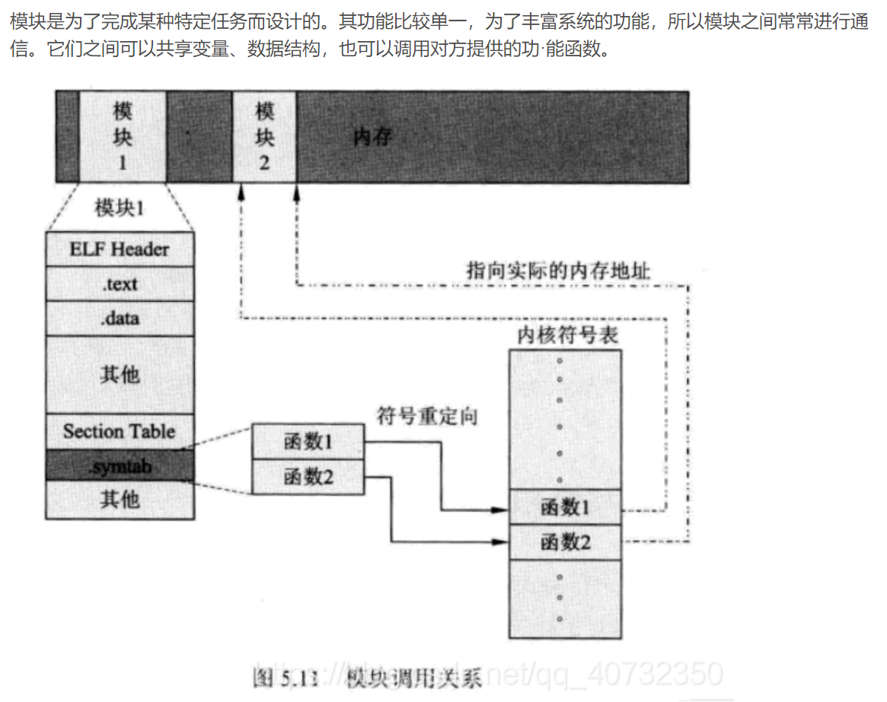

# Linux设备驱动模型简述（源码剖析） _ Huey's Blog (2024_1_28 18_53_35).html
- sysfs顶层目录含义
  - block: 包含所有的块设备，如ram，sda等
  - bus: 包含系统中所有的总线类型，如pci，usb，i2c等
  - class: 包含系统中的设备类型，如input，pci_bus，mmc_host等
  - dev: 包含两个子目录：char和block，分别存放字符设备和块设备的主次设备号(major:minor)，指向/sys/devices目录下的设备
  - devices:包含系统所有的设备
- 主要介绍了针对 platform总线 情况下，  platform总线、platform驱动、platform设备的注册

- ***引入Linux设备驱动模型下，设备和驱动可以分开注册，依赖总线完成相互绑定。***系统每注册一个设备的时候，会寻找与之匹配的驱动；相反，系统每注册一个驱动的时候，会寻找与之匹配的设备。这个过程中，设备和驱动的匹配工作由总线完成。

- platform总线与其注册
  - platform_bus_type结构体来描述platform总线，同时也定义了设备platform_bus，用于管理所有挂载在platform总线下的设备
  - platform_bus_init() 在内核启动阶段就完成了注册
    - platform_bus_init()对platform总线的注册主要分为两步：device_register(&platform_bus) bus_register(&platform_bus_type)

- platform总线驱动与其注册
  - Linux内核中对依赖于platform总线的驱动定义了platform_driver结构体，内部封装了前述的struct device_driver。
  - 使用 platform_driver_register 完成驱动注册
    - 具体实现为__platform_driver_register(&globalfifo_driver, THIS_MODULE)。该函数会对struct device_driver的bus、probe、remove等回调函数进行初始化，紧接着调用driver_register(&globalfifo_driver->driver)。

- platform总线设备与其注册
  - Linux内核中对依赖于platform总线的设备也定义了特有的结构：platform_device，内部封装了struct device结构。
  - 设备platform_device进行注册的入口函数为platform_device_register，其中分别会调用
    - device_initialize(&pdev->dev);
    - arch_setup_pdev_archdata(pdev);
    - platform_device_add(pdev)


# Linux Soc Platform总线 - 知乎 (2024_1_28 13_37_55).html
- 一个现实的Linux 设备和驱动通常都需要挂接在一种总线上，对于本身依附于PCI、USB、I2C、SPI 等的设备而言，这自然不是问题，但是在嵌入式系统里面，***SoC 系统中集成的独立的外设控制器、挂接在SoC 内存空间的外设（例如基带模块之于骁龙soc）等确不依附于此类总线。***基于这一背景，Linux 发明了一种虚拟的总线，称为platform 总线。
- SOC系统中集成的独立外设单元（I2C，LCD，SPI，RTC等）都被当作平台设备来处理，而它们本身是字符型设备。

- 主要还是讲述 platform总线相关概念是
- 给出一个点亮led的platform总线设备驱动的例子，例子中分别通过两个.c文件实现了；驱动模块和设备模块的代码，最终编写c程序，打开指定设备，根据传入的参数值，调用驱动中write_led函数，成功触发led的点亮操作
- platform_driver结构体 表示platform 总线驱动
- platform 总线驱动的注册和注销
  - platform_driver_register platform_driver_unregister
  - 
- platform_device 结构体 表示platform 总线设备
- platform 总线设备的注册和注销
  - platform_device_register platform_device_unregister 

- 定义平台总线驱动（led_drv.c）和平台总线设备（led_dev.c），并编写test程序点亮led
  - led_drv.c和led_dev.c 均符合linux内核模块的规范，使用module_init和module_exit定义模块入口和出口，并分别在入口和出口中注册platform 总线驱动/设备 以及 注销platform 总线驱动/设备
  - test程序中通过open打开/dev/led 文件，并调用write函数 写入0或1从而控制led亮灭


# https://www.cnblogs.com/downey-blog/category/1412931.html 
- 比较不错的linux设备驱动文章，
- 详见 linux设备驱动\牧野星辰文章学习

# 5.linux设备驱动模型_linux设备驱动模型有哪些-CSDN博客 (2024_2_10 15_10_30).html
- https://blog.csdn.net/qq_40732350/article/details/82992904
5.1、平台总线体系的工作流程
(1)第一步：系统启动时在bus系统中注册platform
(2)第二步：内核移植的人负责提供platform_device
(3)第三步：写驱动的人负责提供platform_driver
(4)第四步：platform的match函数发现driver和device匹配后，调用driver的probe函数来完成驱动的初始化和安装，然后设备就工作起来了


# 2.字符设备驱动基础_一个ko,rmmod ko,先运行module_exit,还是先运行.remove函数-CSDN博客 (2024_2_10 16_10_09).html
- https://blog.csdn.net/qq_40732350/article/details/82918531
2.1、常用的模块操作命令
(1)lsmod(list module,将模块列表显示)，功能是打印出当前内核中已经安装的模块列表，就是读取/proc/modules
(2)insmod（install module，安装模块），功能是向当前内核中去安装一个模块，用法是insmod xxx.ko
(3)modinfo（module information，模块信息），功能是打印出一个内核模块的自带信息。，用法是modinfo xxx.ko
(4)rmmod（remove module，卸载模块），功能是从当前内核中卸载一个已经安装了的模块，用法是rmmod xxx（注意卸载模块时只需要输入模块名即可，不能加.ko后缀）
(5)如modprobe、depmod

modprobe命令比insmod命令要强大,它在加载某模块时,会同时加载该模块所依赖的其他模块。使用modprobe命令加载的模块若以"modprobe-r filename"的方式卸载,将同时卸载其依赖的模块。

模块之间的依赖关系存放在根文件系统,的/ib/modules//modules.dep文件中,实际上是在整体编译内核的时候由depmod工具生成的,它的格式非常

## 模块之间的通讯
- 
- 模块2的加载过程如下：

(1)使用insmod模块2.ko加载模块2。

(2)内核为模块2分配空间，然后将模块的代码和数据装入分配内存中。

(3)内核发现符号表中有函数1，函数2可以导出，于是将其内存地址记录在内核符号表中。

模块1在加载进内核时，系统会执行以下操作：

(1) insmod命令会为模块分配空间，然后将模块的代码和数据装入内存中。

(2)内核在模块1的符号表(symtab)中发现一些未解析的函数。

图中这些未解析的函数是“函数1”、“函数2”，这些函数位于模块2的代码中。所以模块1会通过内核符号表，查到相应的函数，并将函数地址填到模块1的符号表中。

通过模块1加载的过程后，模块1就可以使用模块2提供的“函数1”和“函数2”了。

详细参考：linux驱动开发入门与实战PDF（典藏大典）

## 应用和驱动之间的数据交换
(1)copy_from_user，用来将数据从用户空间复制到内核空间
(2)copy_to_user
get_user
put_user
注意：复制是和mmap的映射相对应去区分的

从用户空间拷贝数据到内核空间，失败返回没有被拷贝的字节数，成功返回0

这么简单的一个函数却含盖了许多关于内核方面的知识,比如内核关于异常出错的处理.从用户空间拷贝数据到内核中时必须很小心,假如用户空间的数据地址是个非法的地址,或是超出用户空间的范围，或是那些地址还没有被映射到，都可能对内核产生很大的影响，如oops，或被造成系统安全的影响.所以copy_from_user函数的功能就不只是从用户空间拷贝数据那样简单了，他还要做一些指针检查连同处理这些
问题的方法.

copy_from_user主要是这个函数提供了两个功能：
1. 对用户进程传过来的地址范围进行合法性检查；
2.当用户传来的地址没有分配物理地址时，定义了缺页处理后的异常发生地址，保证程序顺利执行；

另外一个问题，直接使用memcpy时为什么没有出现异常？
在上面的分析过程中我们知道，只有用户传来的地址空间没有分配对应的物理地址时才会进行修复，
如果用户进程之前已经使用过这段空间，代表已经分配了物理地址，自然不会发生缺页异常。

返回值：和常规有点不同
成功复制则返回0
不成功返回尚未成功复制剩下的字节数


## 驱动中如何操控硬件
裸机和驱动的操作硬件的方式不同
(1)寄存器地址不同。
原来是直接用物理地址，现在需要用该物理地址在内核虚拟地址空间相对应的虚拟地址。寄存器的物理地址是CPU设计时决定的，从datasheet中查找到的。

(2)编程方法不同。
裸机中习惯直接用函数指针操作寄存器地址，而kernel中习惯用封装好的io读写函数来操作寄存器，以实现最大程度可移植性。

### 内核的虚拟地址映射方法
虚拟地址映射方法：动态和静态
1.静态映射方法的特点：
    内核移植时以代码的形式硬编码，如果要更改必须改源代码后重新编译内核
    在内核启动时建立静态映射表，到内核关机时销毁，中间一直有效
    对于移植好的内核，你用不用他都在那里
2.动态映射方法的特点：
    驱动程序根据需要随时动态的建立映射、使用、销毁映射
    映射是短期临时的

- 静态映射要依靠映射表
- 动态映射要依靠动态分配内存
  - 使用下述api进行动态映射
    - (1)request_mem_region，向内核申请（报告）需要映射的内存资源。
    - (2)ioremap，真正用来实现映射，传给他物理地址他给你映射返回一个虚拟地址
  - 使用下述api销毁动态映射
    - (1)iounmap
    - (2)release_mem_region


- 内存映射代码示例
```c
#define FB_GPJ0_BASE 0xe0200240  //真实物理地址（通过芯片手册得到）
#define FB_GPJ0_CON (unsigned int)0x0
#define FB_GPJ0_DAT (unsigned int)0x4
 
unsigned int *pGPJ0CON = NULL;
unsigned int *pGPJ0DAT = NULL;
 
//动态分配虚拟空间
if (!request_mem_region(FB_GPJ0_BASE + FB_GPJ0_CON, 4, "GPJ0CON"))  //为物理地址分配虚拟地址
{
	printk(KERN_ERR "request_mem_region error\n");
	goto err_mem_region_con;	
}	
if (!request_mem_region(FB_GPJ0_BASE + FB_GPJ0_DAT, 4, "GPJ0DAT"))
{
	printk(KERN_ERR "request_mem_region error\n");
	goto err_mem_region_dat;	
}
 
	
pGPJ0CON = ioremap(FB_GPJ0_BASE + FB_GPJ0_CON, 4);  //获取分配的虚拟地址
pGPJ0DAT = ioremap(FB_GPJ0_BASE + FB_GPJ0_DAT, 4);
	
*(pGPJ0CON) = 0x11111111;
*(pGPJ0DAT) = ((0<<3) | (0<<4) | (0<<5));	

```