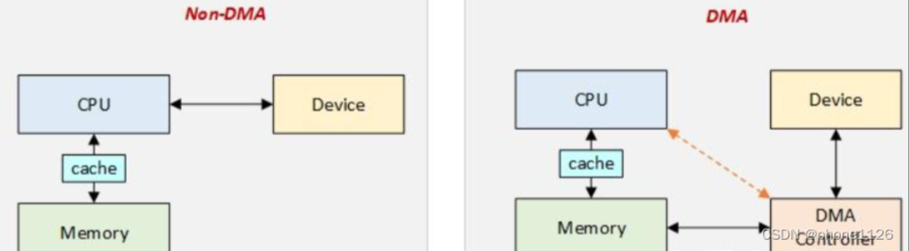

- https://paper.seebug.org/3091/
- 高通 MSM Linux 内核和 ARM Mali GPU 中 0-day 漏洞攻击利用分析 (2024_2_10 17_38_21).html

- Snapdragon 801 
  - 技术报告：https://www.qualcomm.com/content/dam/qcomm-martech/dm-assets/documents/snapdragon_801_processor_product_brief_122.pdf
  - 28nm  cpu 用于登月车
  - 该 SoC（片上系统）板上只有9个组件：除了CPU 之外，还有 Adreno GPU、数字信号处理器（DSP）、集成的无线连接芯片、传感器、摄像头、卫星支持、显示器和多媒体芯片。***每个组件都是一个独立的硬件设备，在操作系统中需要一个专门的内核驱动程序来支持。***
  - 现代智能机级别的 Snapdragon SoC 程序更复杂，	
  - 许多 Android 智能手机都基于Snapdragon SoC，而现在的 iPhone 仅使用 Snapdragon 系列的一个独立蜂窝调制解调器芯片
  - soc中部分组件（例如基带）运行单独操作系统，该操作系统需要与HLOS进行通讯 msm负责支持此通讯接口（例如QMI就是msm与基带交互的专有接口）
    - 关于qmi 详见 linux设备驱动\高通qmi.md

- ARM Mali 是 Arm Holdings 的 GPU 核心设计， 与高通的Adreno GPU 设计是主要竞争对手 ，iPhone使用苹果自己的专有GPU设计
  - 嵌入arm mail gpu的soc 包括联发科 麒麟等等
    - https://en.wikipedia.org/wiki/Mali_(processor)#Implementations
- arm定义cpu指令集架构和硬件设计，高通获得arm授权设计骁龙soc的cpu，但soc中其他组件和arm无关
- 因此，Adreno GPU 和 Mali GPU 具有两种不同且不兼容的硬件设计，需要不同的操作系统内核驱动程序，在这些驱动程序中可能会发现漏洞。

# CVE-2023-33063：aDSP FastRPC DMA 内存管理中的释放后重用
- 补丁 https://git.codelinaro.org/clo/la/kernel/msm-5.15/-/commit/2643808ddbedfaabbb334741873fb2857f78188a
- 相关代码位于 https://git.codelinaro.org/explore/ 即之前确定的 高通开源代码项目
- 对应代码位于 	msm5.15 的 drivers/char/adsprpc.c 目录下，从谷歌开源代码中下载到的 高通芯片源码（msm.git-refs_heads_android-msm-angler-3.10-nougat-mr2.tar.gz ）中可以定位到 drivers/char/adsprpc.c 文件，但是与高通开源代码相对比，发现同一 adsprpc.c 文件中部分代码不相同，可能是高通msm与对应安卓手机版本不匹配，或者安卓手机代码在高通开源代码的基础上对驱动程序进行了修改
- 根据搜索，通过谷歌开源代码下载高通msm相关源码是普遍方案，但是高通开源代码也是重要代码来源，且后者存在漏洞的对比相关信息

- msm-5.15中 补丁位于 fastrpc_mmap_remove 函数中，但是 msm.git-refs_heads_android-msm-angler-3.10-nougat-mr2.tar.gz 源码中 drivers/char/adsprpc.c 文件中没有该函数，推测是msm-5.15 版本较新，而安卓设备源码是较旧版本安卓手机的的代码
  - android-msm-angler-3.10-nougat-mr2这个分支是为 Google Nexus 6P 设备，使用3.10版本的Linux内核，运行Android 7 Nougat第二个维护版本的系统设计的
  - 尝试下载最新安卓手机源码的msm，漏洞代码补丁情况  https://android.googlesource.com/kernel/msm/+refs 中能下载到的最新手机型号为pixel5，代号 redfin，下载与其相关的代码版本 android-msm-redfin-4.19-android11-qpr1
  - 该版本 adsprpc.c 文件中，存在 fastrpc_mmap_remove 函数，说明上述猜测成立，较新版本的手机的高通源码的确与旧版本手机中的不同

- DSP运行实时操作系统，在现代高通芯片组中为 QuRT。CPU 和 DSP 核心相互隔离，因此，它们必须通过某种接口进行通信，在 CPU/HLOS 端由 MSM 内核实现，RPC 协议通常编码通信接口的高级方面。漏洞所在的 adsprpc.c 源模块实现了这段代码。

- ***adsprpc.c 源码中存在mdsp相关 说明该套逻辑也被用于基带相关通讯***

- ***在msm5.15和 android-msm-redfin-4.19-android11-qpr1 的文档中找到下述内容，其中说明了通过pc机调试\Documentation\arm\msm\remote_debug_drv.txt adsp以及基带等外围子系统的方案，而在旧版手机源码中没有该文件，似乎是仅有高版本支持***
  - 详见 linux设备驱动\remote_debug_drv学习.md

## fastrpc 相关文档 阅读
- linux设备驱动\代码保存\android-msm-angler-3.10-nougat-mr2源码\Documentation\arm\msm\adsprpc-drv.txt
- msm-5.15以及android-msm-redfin-4.19-android11-qpr1源码文档中没有上述文档文件，但是 adsprpc.c 仍存在，说明不同版本源码中，文档内容不同，为寻找指定模块的文档，可能需要找旧版本源码
- 该驱动实现了一种IPC（进程间通讯）机制，允许客户端在不同处理器之间透明地进行远程方法调用。

- 该解决方案的组成元素
  - 客户端（Client）：在Linux用户模式下发起远程调用的进程。
  - 存根（Stub）：与用户模式进程链接的自动生成代码，负责参数的序列化。
  - 传输（Transport）：负责将调用从客户端传递到对象。这包括两部分：1）MSM ADSPRPC Linux内核驱动程序，接收远程调用，排队并等待响应；2）远程处理器上的服务，从队列中获取消息并进行处理。
  - 骨架（Skel）：自动生成的代码，负责反序列化参数。
  - 对象（Object）：方法实现。

- 软件描述
  - 使用SMD（Shared Memory Driver）与远程处理器发送和接收消息。在驱动程序初始化时打开SMD通道，并在模块卸载时关闭。驱动程序不将HLOS（Host Operating System）内存暴露给远程处理器，而是通过ION分配的缓冲区传递调用参数。

- 驱动程序通过 ioctl 调用接收远程调用。当一个收到远程调用调用后，驱动程序执行以下操作：
  - 检索调用参数：驱动程序首先会从ioctl调用中获取远程调用所需的参数。
  - 复制输入缓冲区：将用户空间（HLOS）内存中的输入缓冲区复制到由ION（Ion Memory Allocator）分配的缓冲区。这样做是为了确保在传输过程中数据的完整性和安全性。
  - 分配输出缓冲区：如果需要，驱动程序会在HLOS内存中为输出缓冲区分配ION缓冲区。
  - 构建页表：驱动程序会构建一个页表，这个页表包含了ION分配的输入和输出缓冲区的页信息。这个页表随后会被发送到远程处理器，以便远程处理器可以将其映射到自己的地址空间。
  - 构建消息：驱动程序会根据接收到的信息构建一个消息，这个消息包含了调用的上下文信息，如方法编号、方法属性等。
  - 发送消息：通过SMD（Shared Memory Driver）通道，驱动程序将构建好的消息发送到远程处理器。
  - 等待响应：驱动程序通过SMD通道等待远程处理器的响应。这个响应可能包含方法调用的结果或者错误信息。
  - 读取响应消息：一旦收到响应，驱动程序会从共享内存SMD通道读取消息。
  - 复制回输出缓冲区：如果远程调用成功，驱动程序会将结果从ION缓冲区复制回用户空间的输出缓冲区。
  - 返回响应：最后，驱动程序将远程调用的响应返回给发起调用的客户端。

- 总结来说，就是
  - linux用户空间程序 -》ioctl机制 -》驱动程序 -》 smb通道 -》远程处理器
  - 驱动程序完成下述功能
    - 将用户空间数据复制到 ION分配的缓冲区
    - 通过ION分配输出缓冲区
    - 接收到的ioctl 构建消息
    - 通过SMD通道发送并接收消息
    - 将接收到的消息从ION缓冲区拷贝到用户空间缓冲区

- 关于ION 是安卓中的一种内存管理方式，用于实现用户层和内核层之间的数据共享
  - ION分配1： ION是Android系统上Google引入的内存管理方式，主要用于实现用户与内核间数据共享时零拷贝，多用于多媒体，比如camera和display，graphic。ION是一个内存管理器，管理不同type的内存堆（heap），而不同的type的内存又通过不同的内存分配器来分配，比如cma、kmalloc、vmalloc。用户层打开/dev/ion，并通过ioctl调用传递分配内存需要的参数，内核中ioctl调用ion_alloc函数进行分配。
  - 资料 linux设备驱动\高通msm平台设备驱动开发相关文章\笔记.md Linux内核驱动：ion memory_kgsl drm-CSDN博客 (2024_2_15 15_29_06).html

- 关于SMD
  - 详见 linux设备驱动\高通msm平台设备驱动开发相关文章\笔记.md Linux驱动基础：MSM平台AP_CP通信机制_msm_platform-CSDN博客 (2024_2_15 15_15_46).html
  - SMD是高通实现的一种驱动，即Shared memory driver 驱动程序路径是 \drivers\rpmsg\qcom_smd.c ，该驱动作为ap和bp的通讯方式
  - SMD相关文档可见 linux设备驱动\代码保存\android-msm-angler-3.10-nougat-mr2源码\Documentation\arm\msm\msm_sharedmem.txt

- qcom_smd.c文件中的注释信息
  ```bash
  Qualcomm共享内存通信解决方案为客户端提供了点对点的通道，用于发送和接收流式或基于包的数据。

  每个通道由一个控制项（通道信息）和一个环形缓冲区对组成。通道信息携带有关通道状态、流控制以及环形缓冲区内偏移量的信息。

  所有分配的通道都列在分配表中，通过名称、类型和远程处理器来识别项目对。

  在创建新通道时，远程处理器从smem堆中分配通道信息和环形缓冲区项目，并填充分配表。然后向通道的另一端发送中断，并应进行新通道的扫描。通道永远不会消失，只会改变状态。

  远程处理器通过将其通道端的状态设置为“打开”并发送中断，表明其意图建立通道。我们检测到这种变化并注册一个smd设备来消费通道。找到消费者后，我们完成握手，通道就建立起来了。

  在关闭通道时，远程处理器会更新其通道端的状态并向我们发出信号，然后我们将注销任何附加的设备并关闭我们的通道端。

  附加到通道的设备可以使用qcom_smd_send函数将数据推送到通道，这是通过将数据复制到tx环形缓冲区，更新通道信息中的指针并向远程处理器发出信号来完成的。

  远程处理器在传输数据时做同样的事情，当我们接收到中断时，我们检查通道信息中是否有新数据，并将其交付给附加的设备。如果设备还未准备好接收数据，我们暂时将其留在环形缓冲区中。
  ```

- SMD相关文档信息总结
  ```bash
  msm_sharedmem驱动程序是一个在Android系统中用于在外围处理器（如MPSS和ADSP）与用户空间应用程序之间共享非缓存连续物理内存的组件。以下是对该驱动程序的详细总结：

  功能：

  在启动时使用DMA API分配内存，并使用内核QMI服务在LA-HLOS上与外围处理器共享。
  通过UIO（用户空间I/O）设备暴露共享内存，允许用户空间客户端映射这些内存。
  硬件描述：

  驱动程序不实现任何特定硬件。
  软件描述：

  在启动时预分配共享内存，并使用内核QMI服务与外围处理器共享。
  使用UIO框架将内存映射到UIO设备，供用户空间服务（如远程文件系统和RFSA）使用。
  当外围处理器通过QMI请求缓冲区地址时，驱动程序返回物理地址。
  设计：

  内核空间：驱动程序使用DMA API预分配内存，创建UIO设备，并通过QMI服务处理内存共享请求。
  用户空间：使用UIO框架，用户空间客户端可以在其地址空间中映射共享内存地址。
  外围处理器：在MPSS和ADSP上，通过QMI服务请求内存，并通过TZ（TrustZone）或SMMU/IOMMU API进行安全检查。
  依赖性：

  依赖DMA框架分配连续的非缓存内存。
  依赖内核设备树文件提供用户空间客户端的详细信息。
  用户空间工具：

  与远程文件系统（RFS）和RFSA（Remote File System Access）服务通信。
  版本兼容性：

  MPSS和ADSP依赖于内核驱动程序中的msm QMI服务。新旧HLOS与MPSS/ADSP映像的兼容性需要考虑。
  其他：

  驱动程序不实现任何电源管理。
  在SMP/多核环境中，驱动程序为每个客户端加载/探测一次。
  设备（/dev/uioX）的文件权限受到限制，只有具有系统权限的用户才能访问。
  已知问题：

  无。
  这个驱动程序的设计确保了在Android系统中，外围处理器和用户空间应用程序之间可以高效、安全地共享内存，这对于需要大量数据传输和处理的应用（如多媒体处理）至关重要。通过使用UIO框架和QMI服务，msm_sharedmem驱动程序简化了内存共享的实现，并提供了必要的安全措施。
  ```

- 关于dma的概念
  - https://blog.csdn.net/phone1126/article/details/130040715
  - 
  ```bash
  DMA（Direct Memory Access）：直接存储器访问；

  一、DMA传输将数据从一个地址空间复制到另一个地址空间，提供在外设和存储器之间或者存储器和存储器之间的高速数据传输。

  DMA用来提供在外设和存储器之间或者存储器和存储器之间的高速数据传输。无须CPU的干预，通过DMA数据可以快速地移动。这就节省了CPU的资源来做其他操作。

  DMA的工作原理是，如果按数据块进行I/O，即需要传输大量数据时，就无须CPU的介入。
  在这种情况下，我们可以让I/O设备与计算机内存进行直接数据交换。而CPU则可以去忙别的事情。这种将CPU的介入减少的I/O模式称为直接内存访问。

  二、DMA中也有cpu（DMA数据传输需要使用CPU，只不过这里使用的CPU不是计算机里面所有进程共享的CPU，而是由另外一个CPU来负责数据传输。这个另外的CPU就是DMA控制器） 只不过里面的CPU可以比通用CPU简单，且价格便宜很多，它只需要能够以不慢于I/O设备的速度进行数据读写即可。其他复杂功能，如算数运算、移位、逻辑运算等功能皆可以不要。

  ```

- 关于UIO框架的概念 简单来说就是允许在用户空间编写驱动程序
  - https://blog.csdn.net/weixin_43249970/article/details/126411340
  ```bash
  在Linux内核中，UIO（User-space I/O）框架是一个允许用户空间应用程序直接与硬件设备进行通信的机制。这个框架提供了一种方法，使得用户空间程序可以通过内存映射（mmap）来访问和控制硬件寄存器，从而实现对硬件的直接操作。

  UIO框架的关键特点包括：

  内存映射：用户空间程序可以通过内存映射的方式直接访问硬件寄存器，就像访问内存一样。这使得硬件操作可以像操作内存地址一样简单。

  中断处理：UIO框架支持中断处理，用户空间程序可以注册中断处理函数，当硬件产生中断时，这些函数会被调用。

  设备文件：UIO框架在/dev目录下创建设备文件（如/dev/uioX），用户空间程序可以通过这些文件与硬件设备进行交互。

  多设备支持：UIO框架支持多个设备，每个设备都有自己的设备文件。这允许多个用户空间程序同时与不同的硬件设备通信。

  安全性：UIO框架提供了一定的安全性，确保只有具有适当权限的用户空间程序才能访问硬件设备。

  在msm_sharedmem驱动程序的上下文中，UIO框架被用来允许Android用户空间应用程序映射和访问共享内存。这样，应用程序可以直接与外围处理器（如MPSS和ADSP）共享的内存进行交互，而不需要通过内核空间的中间层。这种直接的硬件访问提高了性能，因为减少了数据在用户空间和内核空间之间的复制开销。
  ```

## linux设备驱动\代码保存\android-msm-redfin-4.19-android11-qpr1源码\drivers\char\adsprpc.c 源码阅读