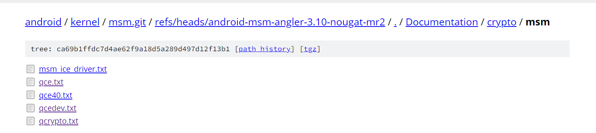
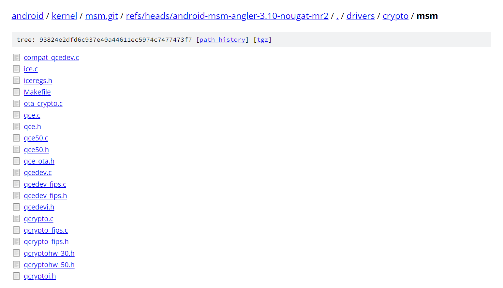
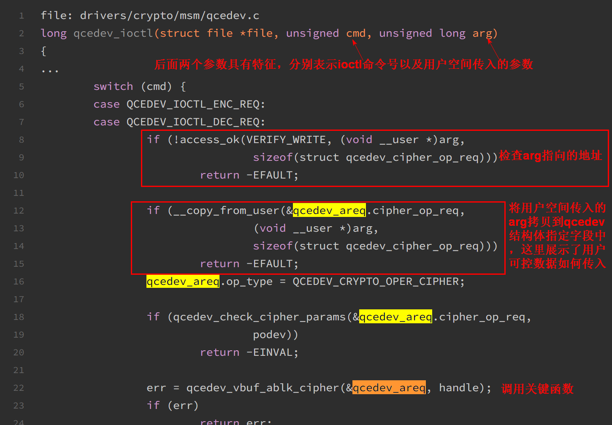

- https://www.iceswordlab.com/2017/08/07/qualcomm-crypto-engine-vulnerabilities-exploits/#top
- 高通加解密引擎提权漏洞解析 _ IceSword Lab (2024_2_3 15_20_22).html
- 相关漏洞被谷歌安卓漏洞榜和高通漏洞公告分别致谢
- 漏洞高通硬件加解密的驱动程序中，该驱动程序用于给内核态和用户态程序提供加解密服务，目标是三个驱动程序
  - qcrypto driver:  供内核态程序使用的加解密接口 
  - qcedev driver: 供用户态程序使用的加解密接口
    - qcedev driver 就是本文两个漏洞发生的地方
    - 这个驱动通过 ioctl 接口为用户层提供加解密和哈希运算服务
  - qce driver:  与加解密芯片交互，提供加解密驱动底层接口

- ***从上面可以看出，部分驱动只为内核态程序提供服务，而不为用户态程序提供服务***
- 根据文章中各个驱动的架构关系图，看出驱动与驱动之间通过一些交互才能最终调用到设备硬件层
- 阅读高通驱动中的文档信息对理解该驱动很重要，其中会给出驱动功能以及如何使用，如何传参等信息

- 获得了漏洞代码的方式 即是从谷歌安卓开源代码中获得高通驱动代码， 
```bash
git clone https://android.googlesource.com/kernel/msm.git
git checkout android-msm-angler-3.10-nougat-mr2
git checkout 6cc52967be8335c6f53180e30907f405504ce3dd drivers/crypto/msm/qcedev.c 
```
- 尝试理解该源码树
  - https://android.googlesource.com/kernel/msm.git 根据注释表示的是高通芯片相关的内核树
  - 上述代码目录下存在大量 android-msm-angler-3.10-nougat-mr2 等类似目录，经过llm查询，发现该字符串表示特定安卓手机型号
    - "android-msm-angler"：这是指针对一种特定设备的代码分支。"angler" 是 Google Nexus 6P 手机的代号，因此 "android-msm-angler" 可能是 Nexus 6P 设备的代码分支。
    - "3.10"：这表示 Android 内核的版本号。在此情况下，它指的是 Linux 内核版本 3.10。
    - "nougat-mr2"：这是 Android 操作系统版本的代号。"Nougat" 是 Android 7.0 和 7.1 版本的代号，而 "MR2" 表示 "Maintenance Release 2"，即修订版本 2。
  - 注意可以使用kimi chat对url的分析去尝试理解页面信息
  - 搜索谷歌pixel手机的代号，能在上述代码树中查到的最新型号为pixel5，代号 redfin 更新的pixels6 7 8相关代号无法在源码树中找到

- 进入android-msm-angler-3.10-nougat-mr2 目录，该目录下对应document目录下可以找到漏洞分析文章中的文档信息
  - https://android.googlesource.com/kernel/msm.git/+/refs/heads/android-msm-angler-3.10-nougat-mr2/Documentation/crypto/msm/
  - 
  - 在 android-msm-angler-3.10-nougat-mr2 目录下 drivers/crypto/msm/qcedev.c 目录中可以找到文中分析的漏洞代码
  - 

- ***这里有个思路，其实下载到对应手机设备源码后，在源码中搜索ioctl等驱动程序处理用户传入数据的机制的特征，就可以定位到处理用户数据的位置，从而开始分析***
  - 经过测试可以在document目录查找到fastrpc相关介绍，
  - 查找到linux设备驱动\代码保存\源码\drivers\char 目录下存在diag 以及 fastrpc相关源码，可以学习
  
- 上述谷歌来源的代码，同样可以下载高通相关开源代码，从而确定同一份代码在不同来源的表现形式


# 基础知识
## linux内核判断与数据传输
- linux kernel 的用户态空间和内核态空间是怎么划分的？
  - 简单来说，在一个进程的地址空间里，比 thread_info->addr_limit 大的属于内核态地址，比它小的属于用户态地址

- linux kernel 用户态和内核态之间数据怎么传输？
  - 不可以直接赋值或拷贝，需要使用规定的接口进行数据拷贝，主要是4个接口：
    - ***copy_from_user/copy_to_user/get_user/put_user***
  - 这4个接口会对目标地址进行合法性校验，比如：
    - copy_to_user = access_ok + __copy_to_user // __copy_to_user 可以理解为是memcpy 
  - 不使用access_ok检验内存操作地址（源地址或目的地址），则__copy_to_user 直接使用是不安全的，因为没有验证内存操作地址的合法性，例如导致用户传入的数据写入任意内核地址

## 安卓提权基础知识
- linux kernel 里，进程由 struct task_struct 表示，进程的权限由该结构体的两个成员 real_cred 和 cred 表示
- 所谓提权，就是修改进程的 real_cred/cred 这两个结构体的各种 id 值，随着缓解措施的不断演进，完整的提权过程还需要修改其他一些内核变量的值，但是最基础的提权还是修改本进程的 cred, 这个任务又可以分解为多个问题：
  - 怎么找到目标 cred ?
  - cred 所在内存页面是否可写？
  - 如何利用漏洞往 cred 所在地址写值？
```c
//include/linux/sched.h

struct task_struct {
        volatile long state;    /* -1 unrunnable, 0 runnable, >0 stopped */
        void *stack;
...
/* process credentials */
        const struct cred __rcu *real_cred; /* objective and real subjective task
                                         * credentials (COW) */
        const struct cred __rcu *cred;  /* effective (overridable) subjective task
                                         * credentials (COW) */
        char comm[TASK_COMM_LEN]; /* executable name excluding path
                                     - access with [gs]et_task_comm (which lock
                                       it with task_lock())
                                     - initialized normally by setup_new_exec */
...
}

//include/linux/cred.h

struct cred {
        atomic_t        usage;
#ifdef CONFIG_DEBUG_CREDENTIALS
        atomic_t        subscribers;    /* number of processes subscribed */
        void            *put_addr;
        unsigned        magic;
#define CRED_MAGIC      0x43736564
#define CRED_MAGIC_DEAD 0x44656144
#endif
        kuid_t          uid;            /* real UID of the task */
        kgid_t          gid;            /* real GID of the task */
        kuid_t          suid;           /* saved UID of the task */
        kgid_t          sgid;           /* saved GID of the task */
        kuid_t          euid;           /* effective UID of the task */
        kgid_t          egid;           /* effective GID of the task */
        kuid_t          fsuid;          /* UID for VFS ops */
        kgid_t          fsgid;          /* GID for VFS ops */
...
}
```
- 历史漏洞利用方式演进 详见文章


# 漏洞代码路径drivers/crypto/msm/qcedev.c

# CVE-2016-6738
- 一个任意地址写任意值的漏洞，关键在于内核对传入的内存拷贝的目的地址未进行校验，用户可以自行控制，同时内存拷贝的源数据是用户可控数据经过加密或解密得到的，只要将用户传入的可控数据预先加密，之后在驱动中相应解密，即可控制内存拷贝源数据
- 漏洞出现在驱动对指定ioctl的处理过程中，特征就是存在函数分发 不同ioctl 的处理流程，可以此处开始分析
  - 

# CVE-2016-3935
- 用户空间传入多个数组，内核中会判断该多个数组的总长度是否会发生溢出，判断关机爱你命令如下
  - if (req->data[i].len > ULONG_MAX - total)
- 其中req->data[i].len  total 类型均为uint32_t, ，uint32_t 的上限是 UINT_MAX, 而这里使用了 ULONG_MAX 来做校验
- 根据代码中的定义
```c
//usr/include/limits.h

/* Maximum value an `unsigned long int' can hold.  (Minimum is 0.)  */
#  if __WORDSIZE == 64
#   define ULONG_MAX    18446744073709551615UL
#  else
#   define ULONG_MAX    4294967295UL
#  endif
```
- 即 32 bit 系统， UINT_MAX = ULONG_MAX 但64 bit 系统， UINT_MAX ！= ULONG_MAX
- 所以这里的整数溢出校验 在64bit系统是无效的，即在 64bit 系统，req->data 数组项的总长度可以整数溢出，这里还无法确定这个整数溢出能造成什么后果。
- 后续执行流程中，会根据上述数组总长度申请堆，并将多个数组均拷贝到该空间中，从而触发堆溢出

# 漏洞利用