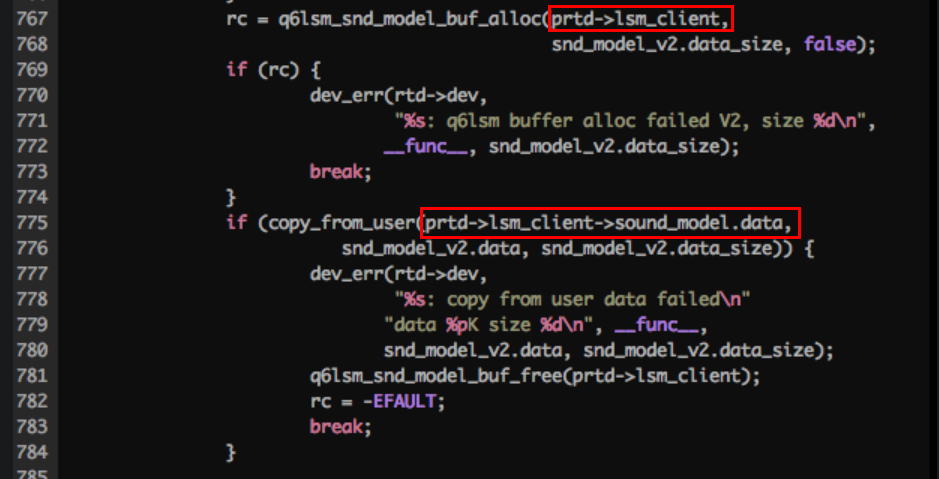
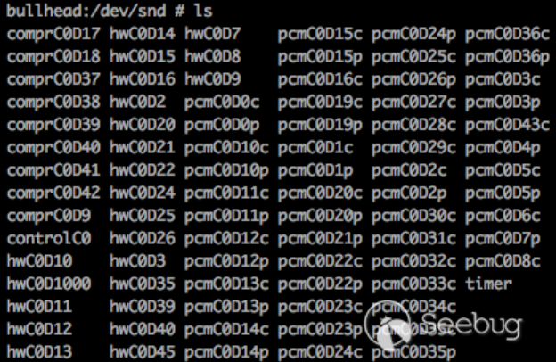
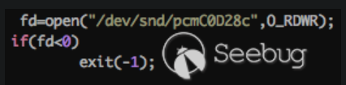

- https://paper.seebug.org/364/

- 高通声卡驱动中的条件竞争漏洞分析（CVE-2017-7368） (2024_2_5 15_21_23).html

- Linux 驱动程序一般会在 /dev 目录下创建一些文件，然后用户可以打开这些文件，通过 ioctl 函数控制硬件。其中，声卡创建的文件在 /dev/snd 目录下
- 
- 漏洞代码位于 sound/soc/msm/qdsp6v2/msm-lsm-client.c 中，从 https://android.googlesource.com/kernel/msm.git/+refs 下载到的源码中能找到该文件，例如下载的msm.git-refs_heads_android-msm-angler-3.10-nougat-mr2.tar.gz 中就能找到，***说明在代码树中，处理ioctl相关的驱动程序不仅仅位于/driver目录下（例如之前分析的高通加解密引擎漏洞），定位ioctl处理函数时，也不能仅仅在driver目录下搜索*** 

- 漏洞对应的ioctl分发函数位于 linux设备驱动\代码保存\源码\sound\soc\msm\qdsp6v2\msm-lsm-client.c ，函数原型为static int msm_lsm_ioctl_shared(struct snd_pcm_substream *substream,unsigned int cmd, void *arg)，与之前高通加解密驱动中ioctl分发函数特征不同， ***故还是要用不同的特征搜索ioctl处理函数***

- 可以从 linux设备驱动\代码保存\源码\Documentation\devicetree\bindings\sound\qcom-audio-dev.txt找到存在漏洞的驱动程序的介绍 （原文中没提到）

- 漏洞位于处理特定ioctl分支的代码中，会申请堆空间保存到 ptrd->lsm_client 中，之后会将用户空间数据拷贝到该堆空间中，申请对空间的大小，拷贝到堆空间中的数据以及大小均用户空间可控，
  - 

- ptrd->lsm_client是全局变量，在多线程时可能出现问题，如下
  - 假设线程 A 请求分配 2000 个字节的空间，这时内核执行到 767 行为 ptrd->lsm_client 分配了 2000 字节，ptrd->lsm_client 的长度为 2000，这时线程 A 挂起，执行线程 B。
  - 线程 B 请求分配 1000 个字节的空间，这时内核执行到 767 行为ptrd->lsm_client分配了 1000 字节，ptrd->lsm_client 的长度为 1000，这时线程 B 挂起，执行线程 A。
  - 线程 A 继续执行到 775 行，进行数据拷贝，此时 ptrd->lsm_client 的长度已经变成了 1000，而线程 A 并不知情，依然拷贝 2000 个字节到 ptrd->lsm_client，这时就会出现一个堆的溢出。

- 漏洞关键在于驱动程序中的全局变量使用过程中未加锁，导致多线程进行任务切换时全局变量被一个进程修改，并被另一个进程错误引用

- 漏洞poc，
  - open打开对应设备文件
  - 创建 snd_model_v2 相关结构体，该结构体中保存用户态空间传入内核空间的数据
  - 两个线程中分别运行while循环，调用ioctl函数向设备发送触发漏洞的ioctl请求，即可触发条件竞争

- 漏洞修复，在switch case分发ioctl处理代码过程前加锁

# 根据之前的学习经验，分析\sound\soc\msm\qdsp6v2\msm-lsm-client.c 驱动程序
- 为理解该驱动程序，在源码 Documentation 中搜索 msm-lsm-client 发现对应信息，仅存在所需属性和兼容性相关信息
- llm中搜索msm-lsm-client，有的解释为 lsm则代表监听声音模型（Listen Sound Model）有的将lsm解释为 Linux Security Module（LSM）客户端，显然前者更靠谱

- 文章中，可以看到 /dev/snd 目录下存在大量设备，而编写利用时打开的设备是 /dev/snd/pcmC0D28c，***是如何根据msm-lsm-client.c 确定到pcmC0D28c 设备的？？ 这是一个疑惑点***
  - 
  - 
  - 问问kimi，似乎是seebug创宇盾，kimichat无法访问该页面，换一个链接
    - 根据kimi，通过在源码中搜索 触发漏洞的ioctl号，可以定位到处理该ioctl的处理函数，并定位到处理该ioctl的设备名是什么，但实际未能确定
  - 存在漏洞的ioctl为 SNDRV_LSM_REG_SND_MODEL_V2 

- 分析整个msm-lsm-client.c 发现可以理解其大致逻辑，
  - 根据 Linux设备驱动开发详解：基于最新的Linux4.0内核 一书，一个设备程序会实现在一个.c文件中，故推测msm-lsm-client.c 中完整实现了当前驱动程序
  - 从后往前读程序，父函数调用的子函数一般会在父函数之前实现，
    - 发现 module_exit module_init函数，即linux内核模块的定义，
      - 发现该两个函数作用分别就是注销和注册 msm_lsm_driver 结构体，使用的api是 platform_driver_register 和 platform_driver_unregister，参数是 platform_driver 结构体，说明当前设备是平台总线的设备，结合文档，说明该设备是个soc，符合paltfrom总线设备特征，下述自资料描述了 paltfrom总线设备驱动的编写过程 
        - Linux设备驱动模型简述（源码剖析） _ Huey's Blog (2024_1_28 18_53_35)
        - Linux Soc Platform总线 - 知乎 (2024_1_28 13_37_55).html
    - msm_lsm_driver 结构体中定义了probe remove函数，即用于在设备初始化以及移除过程中调用
    - 查看 msm_lsm_probe ，发现是调用 snd_soc_register_platform 函数将 snd_soc_platform_driver 注册到 platform_device 的dev成员中
    - snd_soc_platform_driver 结构体中包括 ops成员，该成员中 包括了处理 open close ioctl等相关请求的函数指针，故从此处可以确定，当前驱动中处理ioctl的函数为 msm_lsm_ioctl
    - 再往上的函数，发现是ioctl处理过程中调用的子函数的实现
    - 此外有个 lsm_event_handler 函数，该函数会被赋值到 关键结构体的私有数据中，作为回调函数，用于接收并处理硬件产生的相关事件 

- 综上整体驱动编写符合linux内核模块以及platfrom总线设备驱动的开发框架，结合结合相关资料可以进行理解
  - Linux设备驱动模型简述（源码剖析） _ Huey's Blog (2024_1_28 18_53_35)
  - Linux Soc Platform总线 - 知乎 (2024_1_28 13_37_55).html
    - 该资料中展示了 Platform总线 下设备和驱动分别的结构体以及对应的中注册函数，而在msm-lsm-client.c中我们只能看到Platform总线 驱动相关结构体和注册函数调用，未找到设备相关结构体和注册函数，说明 ***设备和驱动代码别位于两个.c文件中，就像文中led示例一样，设备和驱动通过总线实现匹配***

- 搜索平台总线中设备注册函数platform_device_register ，找到 linux设备驱动\代码保存\源码\drivers\soc\qcom\smd.c 该文件中似乎是共享内存的核心实现，但是没有module_init等Linux内核模块注册的特征，可以尝试进行研究 
  - 详见 linux设备驱动\高通共享内存模块代码分析.md

