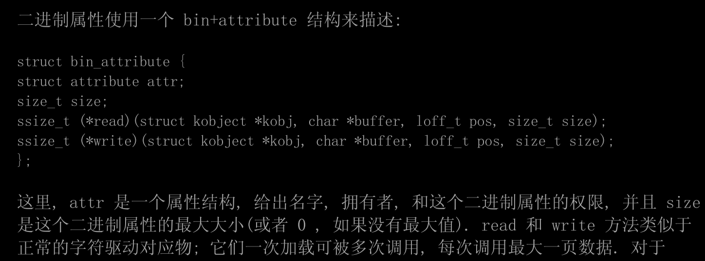
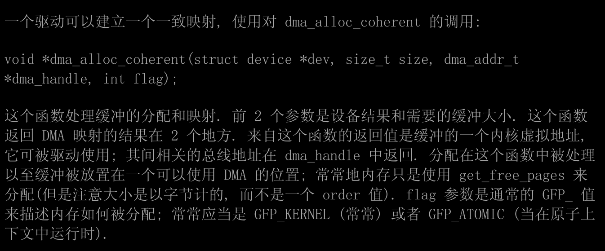

- Linux设备驱动程序中文版第三版.pdf 该书籍可以搜索函数名等特征，方便学习时查询
# 第一章
- 内核功能：进程管理、内存管理、文件系统、设备控制、网络
- 每块可以在运行时添加到内核的代码, 被称为一个模块. Linux 内核提供了对许多模块类型的支持, 包括但不限于设备驱动
- Linux 中越来越多的功能被模块化了.
- 以Linux的方式看待设备可区分为3种基本设备类型. 每个模块常常实现3种类型中的1种, 因此可分类成字符模块, 块模块, 或者一个网络模块
- 在设备驱动之外, 别的功能, 不论硬件和软件, 在内核中都是模块化的
- 驱动编写过程中，应当考虑到的问题
  - 会影响全局资源的设备操作( 例如设置一条中断线 ),
  - 可能会损坏硬件( 例如, 加载固件 ), 
  - 或者它可能会影响其他用户(例如设置一个磁带驱动的缺省的块大小),
  - 小心对待未初始化的内存;，从内核获取的任何内存应当清零或者在其对用户进程或设备可用之前进行初始化. 否则, 可能发生信息泄漏( 数据, 密码的暴露等等 )
  - 始终怀疑用户输入
- ***Linux 内核可以编译成不支持任何属于模块的东西, 因此关闭了任何模块相关的安全漏洞. 在这种情况下, 当然, 所有需要的驱动必须直接建立到内核自身内部***


# 第 2 章 建立和运行模块
- moudle_init 和 module_exit 函数
- printk 函数 printk(KERN_ALERT "Hello, world\n"); 该优先级可以直接在输出在命令行
- 在 insmod 加载了它之后, 模块被连接到内核并且可存取内核的公用符号 ，故可以调用printk等函数
- 系统日志文件 /var/log/messages 
- 模块的退出函数必须小心恢复每个由初始化函数建立的东西, 否则会保留一些东西直到系统重启
- 内核模块与用户程序不同，不连接库到模块中，模块只要连接到内核, 它能够调用的唯一的函数是内核输出的那些; 没有库来连接
- 关于内核空间和用户空间
  - CPU 自己实现不同的操作形态(或者级别). 这些级别有不同的角色, 一些操作在低些级别中不允许 ， Unix 系统设计成利用了这种硬件特性, 使用了两个这样的级别，实现了用户态和内核态
  - 每个模式有它自己的内存映射 -- 它自己的地址空间
  - 用户进程通过系统调用进入内核，此时内核代码在进程上下文工作，***其代表调用进程并可以存取该进程的地址空间***
  - 用户进程被中断打断进入内核，内核代码运行在中断上下文，***不和任何特别进程有关***
  - 模块化的代码在内核空间运行. 通过一个驱动负责处理 ***系统调用***和 ***中断***

- 内核大部分时候的执行是代表一个特定的进程，通过存取全局项 current, 它在 <asm/current.h> 中定义, 它产生一个指针指向结构 task_struct，从而获得所代表的进程的信息，此类进程即发出系统调用的进程
  - 同时内核内核堆栈内存在一个指向 task_struct 的指针
  - printk(KERN_INFO "The process is \"%s\" (pid %i)\n", current->comm, current->pid);
  - 打印了当前进程的进程 ID 和命令名称

- 内核编程注意事项
  - 内核栈很小，甚至只有4096字节 即4kb 即一个内存页面，故大的是数据结构需要动态分配内存
  - 查看内核 API 时, 你会遇到以双下划线(__)开始的函数名. 这样标志的函数名通常是一个低层的接口组件, 应当小心使用. 本质上讲, 双下划线告诉程序员:" 如果你调用这个函数, 确信你知道你在做什么." 
  - 内核代码不能做浮点算术. 使能浮点将要求内核在每次进出内核空间的时候保存和恢复浮点处理器的状态 

- 编译模块 p16
- 加载和卸载模块 insmod modprobe rmmod lsmod
- 版本依赖
  - 模块代码一定要为每个它要连接的内核版本重新编译
  - 模块见到的接口可能一个内核版本与另一个有很大差别

- 内核符号表
  - 如果你的模块需要输出符号给其他模块使用, 应当使用下面的宏定义: 
  - EXPORT_SYMBOL(name); 
  - EXPORT_SYMBOL_GPL(name);
  - 模块堆叠：一个模块依赖于另一个模块之上，modprobe可以加载当前模块所需其他模块

- 驱动中必须出现的引用
  - #include <linux/module.h>
  - #include <linux/init.h>

- 模块初始化函数 module_init(initialization_function);
- 模块退出函数 module_exit(cleanup_function);

- 内核编程中需要对关键函数的返回值进行判断，若函数执行失败，则在程序退出前要对之前申请的资源和操作进行释放和恢复 

- 模块所需参数可以加载时指定
  - insmod hellop howmany=10 whom="Mom" 
- 驱动中使用下述宏对参数进行定义和引用
  - static char *whom = "world"; 
  - static int howmany = 1; 
  - module_param(howmany, int, S_IRUGO); 
  - module_param(whom, charp, S_IRUGO);
  - module_param_array(name,type,num,perm);

- 其实在用户空间也可以编写驱动程序
  - USB 驱动能够在用户空间编写; 看libusb 项目,

- 用户空间实现驱动的缺点
  - 

# 第 3 章 字符驱动
- 字符设备在/dev中以c作为标识 ，块设备在/dev中以b进行标识
- 主设备号1、4、7、10 ；次设备号1、3、5、64、65、129
```bash
crw-rw-rw- 1 root root 1, 3 Apr 11 2002 null 
crw------- 1 root root 10, 1 Apr 11 2002 psaux 
crw------- 1 root root 4, 1 Oct 28 03:04 tty1 
crw-rw-rw- 1 root tty 4, 64 Apr 11 2002 ttys0 
crw-rw---- 1 root uucp 4, 65 Apr 11 2002 ttyS1 
crw--w---- 1 vcsa tty 7, 1 Apr 11 2002 vcs1
crw--w---- 1 vcsa tty 7,129 Apr 11 2002 vcsa1 
crw-rw-rw- 1 root root 1, 5 Apr 11 2002 zero s
```
- 主设备号标识设备相连的驱动，主设备号相同的设备由一个驱动进行管理
- 现代 Linux 内核允许多个驱动共享主编号, 但是你看到的大部分设备仍然按照一个主编号一个驱动的原则来组织
- 次编号被内核用来决定引用哪个设备，可以使用次编号作为本地设备数组的索引
## 驱动的编号，主设备编号和次设备编号
- 设备号的内部表示
  - 在内核中, dev_t 类型(在 <linux/types.h>中定义)用来持有设备编号 -
  - 对于 2.6.0 内核, dev_t 是 32 位的量, 12 位用作主编号, 20 位用作次编号

- 存在宏从dev_t中获得主编号和次编号
  - MAJOR(dev_t dev);
  - MINOR(dev_t dev); 

- 存在宏根据主次编号将其转为dev_t
  - MKDEV(int major, int minor);

- 分配和释放设备编号
  - int register_chrdev_region(dev_t first, unsigned int count, char *name);  
    - 可以指定要分配的设备号
  - int alloc_chrdev_region(dev_t *dev, unsigned int firstminor, unsigned int count, char *name); 
    - 分配到的账户号由内核指定
  - void unregister_chrdev_region(dev_t first, unsigned int count)
    - 释放账户号
  
- 对于新驱动, 我们强烈建议你使用动态分配来获取你的主设备编号, 而不是随机选取一个当前空闲的编号. 换句话说, 你的驱动应当几乎肯定地使用 alloc_chrdev_region, 不是 register_chrdev_region. 

- 针对动态申请主设备号实现的设备，可以使用相关脚本替代insmod进行模块加载并创建对应设备文件，创建设备文件的核心还是调用mknod
  - snull_load 用于加载模块并创建设备文件
  - scull_unload 脚本来清理 /dev 目录并去除模块.

## file_operations, file, 和 inode 结构
### file_operations 
- 内核中每个打开的文件用一个file结构体来代表
- 一个 file_operation 结构或者其一个指针称为 fops( 或者它的一些变体). 结构中的每个成员必须指向驱动中的函数
- file_operations 成员 p38
- 不需要实现 file_operations 结构体中所有成员
### file结构体
- file与用户空间程序的 FILE 指针没有任何关系. 一个 FILE 定义在 C 库中, 从不出现在内核代码中. 一个 struct file, 另一方面, 是一个内核结构, 从不出现在用户程序中.
- file结构代表一个打开的文件，它由内核在 open 时创建, 并传递给在文件上操作的任何函数, 直到最后的关闭. 在文件的所有实例都关闭后, 内核释放这个数据结构
- struct file 的最重要成员 p42
  - 其中比较关键的是 void *private_data;  file_operations 指针
### inode 结构
- inode 结构由内核在内部用来表示文件. 因此, 它和代表打开文件描述符的file结构是不同的. 可能有代表单个文件的多个打开描述符的许多文件结构, 但是它们都指向一个单个 inode 结构
- 即一个文件打开多次，那就有对应次数个的file结构体，但是其都直指向一个inode结构
- inode 结构包含大量关于文件的信息. 作为一个通用的规则, 这个结构只有 2 个成员对于编写驱动代码有用:
  - 
  - 即设备的设备号以及对应的cdev结构体
- 从inode中获得主次设备号
  - unsigned int iminor(struct inode *inode);
  - unsigned int imajor(struct inode *inode); 

## 字符设备注册
- 内核在内部使用类型 struct cdev 的结构来代表字符设备
  - struct cdev *my_cdev = cdev_alloc(); 
  - my_cdev->ops = &my_fops; 
  - void cdev_init(struct cdev *cdev, struct file_operations *fops);
  - int cdev_add(struct cdev *dev, dev_t num, unsigned int count);
  - void cdev_del(struct cdev *dev)
- cdev 嵌入到其他结构体中使用时，仍需要将cdev结构体取出并使用 cdev_init 等函数进行初始化
- 注册字符设备的老方法
  - int register_chrdev(unsigned int major, const char *name, struct file_operations *fops); 
  - int unregister_chrdev(unsigned int major, const char *name);

## open和release方法
- int (*open)(struct inode *inode, struct file *filp); 
  - open函数常见功能
    - • 检查设备特定的错误(例如设备没准备好, 或者类似的硬件错误 
    - • 如果它第一次打开, 初始化设备 
    - • 如果需要, 更新 f_op 指针. 
    - • 分配并填充要放进 filp->private_data 的任何数据结构
  - 第一步常常是确定打开哪个设备
    - inode 中成员  i_cdev 即被打开字符设备的cdev结构，要找到包含该cdev结构体的实际数据结构，需要使用container_of宏
      - container_of(pointer, container_type, container_field);
    - 通过该命令，可以找到当前设备实际所对应的数据结构
    - 可以将获得的结构保存在file结构体中的private_data 成员中，方便之后存取
      - struct scull_dev *dev; /* device information */ 
      - dev = container_of(inode->i_cdev, struct scull_dev, cdev); 
      - filp->private_data = dev; /* for other methods */

- int release(struct inode *inode, struct file *filp
  - • 释放 open 分配在 filp->private_data 中的任何东西
  - • 在最后的 close 关闭设备

- 不是每个 close 系统调用引起调用 release 方法 内核维持一个文件结构被使用多少次的计数. fork 和 dup 都不创建新文件(只有 open 这样); 它们只递增正存在的结构中的计数. close 系统调用仅在文件结构计数掉到 0 时执行 release 方法

## 内存使用 简单介绍
- void *kmalloc(size_t size, int flags); 
- void kfree(void *ptr); 
## 读和写
- ssize_t read(struct file *filp, char __user *buff, size_t count, loff_t *offp); 
- ssize_t write(struct file *filp, const char __user *buff, size_t count, loff_t *offp);
-  filp 是文件指针, count 是请求的传输数据大小. buff 参数指向持有被写入数据的缓存, 或者放入新数据的空缓存. 最后, offp 是一个指针指向一个"long offset type"对象, 它指出用户正在存取的文件位置. 返回值是一个"signed size type"; 它的使用在后面讨论. 
- read 和 write 方法的 buff 参数是用户空间指针. 因此, 它不能被内核代码直接解引用，限制的原因
  - 依赖于你的驱动运行的体系，该用户空间地址可能无效
  - 用户空间内存是分页的, 在做系统调用时这个内存可能没有在 RAM 中. 试图直接引用用户空间内存可能产生一个页面错
  - 不信任用户空间传入的数据

- 内核提供的操作读写用户内存空间的api
  - unsigned long copy_to_user(void __user *to,const void *from,unsigned long count); 
  - unsigned long copy_from_user(void *to,const void __user *from,unsigned long count);
  - 这 2 个函数的角色不限于拷贝数据到和从用户空间: 它们还检查用户空间指针是否有效. 如果指针无效, 不进行拷贝; 如果在拷贝中遇到一个无效地址, 另一方面, 只拷贝部分数据. 在 2 种情况下, 返回值是还要拷贝的数据量
  - ***如果你不需要检查用户空间指针, 你可以调用 __copy_to_user 和 __copy_from_user 来代替. ***
    - 如果你不检查你传递给这些函数的用户空间指针, 那么你可能造成内核崩溃和/或安全漏洞

- 典型的read和writ函数的实现 p52

- readv 和 writev 
  - 一个 readv 调用被期望来轮流读取指示的数量到每个缓存. 相反, writev 要收集每个缓存的内容到一起并且作为单个写操作送出它们，相关实现p55

- 相关调试
  - 你可增加一个 printk 在驱动的适当位置, 并且观察当应用程序读写大块数据中发生了什么. 可选地, 使用 strace 工具来监视程序发出的系统调用以及它们的返回值. 

# 第 4 章 调试技术
- 内核中支持的调试选项
  - p58
- 使用打印调试
  - printk
    - 输出级别p61
    - printk 函数将消息写入一个 __LOG_BUF_LEN 字节长的环形缓存, 长度值从 4 KB 到 1 MB, 由配置内核时选择. 这
- 重定向控制台消息
- dmesg 命令可用来查看内核日志缓存的数据
- cat /proc/kmsg

- 一种编码 printk 调用的方法, 你可以单独或全局地打开或关闭它们; 这个技术依靠定义一个宏, 在你想使用它时就转变成一个 printk (或者 printf)调用 p63

- 调试输出的速率限制
  - printk_ratelimit

- 为方便打印设备编号，内核提供了几个函数
  - int print_dev_t(char *buffer, dev_t dev); 
  - char *format_dev_t(char *buffer, dev_t dev); 

- 用查询来调试
  - 使用 /proc 文件系统 p66
  - ioctl 方法 p73

- 使用观察来调试
  - strace 命令

- 调试系统故障
  - oops 消息 ：大部分 bug 以解引用 NULL 指针或者使用其他不正确指针值来表现自己的. 此类 bug 通常的输出是一个 oops 消息.
    - 处理器使用的任何地址几乎都是一个虚拟地址, 通过一个复杂的页表结构映射为物理地址(例外是内存管理子系统自己使用的物理地址). 当解引用一个无效的指针, 分页机制无法映射指针到一个物理地址, 处理器发出一个页错误给操作系统. 如果地址无效, 内核无法"页入"缺失的地址; 它(常常)产生一个 oops 如果在处理器处于管理模式时发生这个情况.
    - 如何查看一个oops
      - 
  - 遇到系统挂起，可以使用下述魔术键 p78

- 调试器和相关工具
  - 使用gdb p81
    - gdb /usr/src/linux/vmlinux /proc/kcore
  - 使用 kdb 内核调试器 p83
  - kgdb 补丁
  - 用户模式 Linux 移植 
  - Linux 追踪工具
  - 动态探针

# 第 5 章 并发和竞争情况
- 并发来源
  - SMP系统
  - 内核代码抢占
  - 设备中断
  - workqueue, tasklet, 以及定时器 等

- 全局变量远远不是共享数据的唯一方式; 任何时候你的代码传递一个指针给内核的其他部分, 潜在地它创造了一个新的共享情形

- 任何时候一个硬件或软件资源被超出一个单个执行线程共享, 并且可能存在一个线程看到那个资源的不一致时, 你必须明确地管理对那个资源的存取

- 解决方案：在任何时间只有一个执行线程可以操作一个共享资源

- 临界区: 在任何给定时间只有一个线程可以执行的代码. 

## 信号量
- void sema_init(struct semaphore *sem, int val);
- 信号量被初始化为1，被称为互斥锁
  - DECLARE_MUTEX(name); 
  - DECLARE_MUTEX_LOCKED(name); 
  - void init_MUTEX(struct semaphore *sem); 
  - void init_MUTEX_LOCKED(struct semaphore *sem)
- 减少信号量 即尝试进入临界区
  - void down(struct semaphore *sem); 
  - int down_interruptible(struct semaphore *sem); 
  - int down_trylock(struct semaphore *sem); 
- 增加信号量
  - void up(struct semaphore *sem);

- 可以将信号量结构体包含在 自己创建的设备结构体中，从而使用该信号量，在设备的init函数中，可以针对该信号量进行初始化

## 读写信号量rwsem
- struct rw_semaphore
- void init_rwsem(struct rw_semaphore *sem);
- void down_read(struct rw_semaphore *sem); 
- int down_read_trylock(struct rw_semaphore *sem); 
- void up_read(struct rw_semaphore *sem);
- void down_write(struct rw_semaphore *sem); 
- int down_write_trylock(struct rw_semaphore *sem); 
- void up_write(struct rw_semaphore *sem); 
- void downgrade_write(struct rw_semaphore *sem);

## Completions 机制
- completion 是任务使用的一个轻量级机制: 允许一个线程告诉另一个线程工作已经完成. 为使用 completion
- 创建completion
  - DECLARE_COMPLETION(my_completion);
  - struct completion my_completion;
  - init_completion(&my_completion);
- 等待一个completion
  - void wait_for_completion(struct completion *c); 
- completion完成
  - void complete(struct completion *c); 
  - void complete_all(struct completion *c); 
  - 如果多于一个线程在等待同一个 completion 事件, 这 2 个函数做法不同. complete 只唤醒一个等待的线程, 而 complete_all 允许它们所有都继续
- 重新使用 completion
  - INIT_COMPLETION(struct completion c); 
- completion 机制的典型使用是在模块退出时与内核线程的终止一起， 当模块准备好被清理时, exit 函数告知线程退出并且等待结束. 为此目的, 内核包含一个特殊的函数给线程使用
  - void complete_and_exit(struct completion *c, long retval);

## 自旋锁
- 自旋锁可用在不能睡眠的代码中, 例如中断处理
- 如果这个锁已经被别人获得, 代码进入一个紧凑的循环中反复检查这个锁, 直到它变为可用. 这个循环就是自旋锁的"自旋"部分
- 初始化
  - spinlock_t my_lock = SPIN_LOCK_UNLOCKED; 
  - void spin_lock_init(spinlock_t *lock);
- 获得与释放锁
  - void spin_lock(spinlock_t *lock); 
  - void spin_lock_irqsave(spinlock_t *lock, unsigned long flags); 
  - void spin_lock_irq(spinlock_t *lock); 
  - void spin_lock_bh(spinlock_t *lock)
  - void spin_unlock(spinlock_t *lock); 
  - void spin_unlock_irqrestore(spinlock_t *lock, unsigned long flags); 
  - void spin_unlock_irq(spinlock_t *lock); 
  - void spin_unlock_bh(spinlock_t *lock); 
  - int spin_trylock(spinlock_t *lock); 
  - int spin_trylock_bh(spinlock_t *lock); 
- ***到自旋锁的核心规则是任何代码必须, 在持有自旋锁时, 是原子性的. 它不能睡眠; 事实上, 它不能因为任何原因放弃处理器, 除了服务中断(并且有时即便此时也不行)***
- 内核抢占的情况由自旋锁代码自己处理. 内核代码持有一个自旋锁的任何时间, 抢占在相关处理器上被禁止
- 编写会在自旋锁下执行的代码需要注意你调用的每个函数，因为很多内核函数可能睡眠, 并且这个行为不是都被明确记录了
- 需要在持有自旋锁时禁止中断(只在本地 CPU). 有各种自旋锁函数会为你禁止中断 否则如果进程获得锁之后，被中断打断，中断尝试获得该锁，陷入自旋，永远无法获得该锁
  - spin_lock_irqsave 用于禁止中断
  - spin_unlock_irqrestore 
- 自旋锁必须一直是尽可能短时间的持有
- 如果你有一个可能被在(硬件或软件)中断上下文运行的代码获得的自旋锁, 你必须使用一种 spin_lock 形式来禁止中断
- 如果你不在硬件中断处理里存取你的锁, 但是你通过软件中断, 你可以使用 spin_lock_bh 来安全地避免死锁, 而仍然允许硬件中断被服务

- 读写自旋锁
  - 锁允许任何数目的读者同时进入临界区, 但是写者必须是排他的存取. 读者写者锁有一个类型 rwlock_t
  - 初始化和使用
    - 
    ```c
    rwlock_t my_rwlock = RW_LOCK_UNLOCKED; /* Static way */ 
    rwlock_t my_rwlock; 
    rwlock_init(&my_rwlock); /* Dynamic way */ 

    void read_lock(rwlock_t *lock); 
    void read_lock_irqsave(rwlock_t *lock, unsigned long flags); 
    void read_lock_irq(rwlock_t *lock); 
    void read_lock_bh(rwlock_t *lock); 
    void read_unlock(rwlock_t *lock); 
    void read_unlock_irqrestore(rwlock_t *lock, unsigned long flags); 
    void read_unlock_irq(rwlock_t *lock); 
    void read_unlock_bh(rwlock_t *lock); 

    void write_lock(rwlock_t *lock); 
    void write_lock_irqsave(rwlock_t *lock, unsigned long flags); 
    void write_lock_irq(rwlock_t *lock); 
    void write_lock_bh(rwlock_t *lock); 
    int write_trylock(rwlock_t *lock); 
    void write_unlock(rwlock_t *lock); 
    void write_unlock_irqrestore(rwlock_t *lock, unsigned long flags); 
    void write_unlock_irq(rwlock_t *lock); 
    void write_unlock_bh(rwlock_t *lock); 
    ```

## 不规范的锁的使用
- 模糊的规则
  - 一个正确的加锁机制需要清晰和明确的规则. 当你创建一个可以被并发存取的资源时, 你应当定义哪个锁将控制存取. 加锁应当真正在开始处进行
- 加锁顺序规则
  - 在有大量锁的系统中(并且内核在成为这样一个系统), 一次需要持有多于一个锁, 对代码是不寻常的. 如果某类计算必须使用 2 个不同的资源进行, 每个有它自己的锁, 常常没有选择只能获取 2 个锁
  - ***获得多个锁可能是危险的, 然而. 如果你有 2 个锁, 称为 Lock1 和 Lock2, 代码需要同时都获取, 你有一个潜在的死锁. 仅仅想象一个线程锁住 Lock1 而另一个同时获得 Lock2. 接着每个线程试图得到它没有的那个. 2 个线程都会死锁. ***
  - 需要注意加锁和解锁的顺序 当多个锁必须获得时, 它们应当一直以同样顺序获得. 只要遵照这个惯例, 象上面描述的简单死锁能够避免
- 细-粗粒度加锁
  - 粗颗粒度加锁：
    - Linux 内核是 2.0; 它只含有一个自旋锁. 这个大内核锁将整个内核变为一个大的临界区; 在任何时候只有一个 CPU 能够执行内核代码
  - 细颗粒度加锁
    - 一个现代的内核能包含几千个锁, 每个保护一个小的资源. 这种细粒度的加锁可能对伸缩性是好的; 它允许每个处理器在它自己特定的任务上工作而不必竞争其他处理器使用的锁.
  - 细粒度加锁带有开销. 在有几千个锁的内核中, 很难知道你需要那个锁 ; 更多的锁提供了更多的机会使真正有害的加锁 bug 钻进内核中
  - 作为一个通用的规则, 你应当从相对粗的加锁开始, 除非你有确实的理由相信竞争可能是一个问题. 忍住怂恿去过早地优化; 

## 加锁的各种选择
- 你可以重新打造你的算法来完全避免加锁的需要
- 使用原子变量，内核提供了一个原子整数类型称为 atomic_t, 并使用对应原子操作
  - p102
- 内核提供了一套函数来原子地修改或测试单个位. 因为整个操作在单步内发生, 没有中断(或者其他处理器)能干扰.
  - p103
- seqlock 锁 即顺序锁
  - 顺序锁的设计思想是：对某一个共享数据读取的时候不加锁，写的时候加锁
- 读取-拷贝-更新(RCU) 是一个高级的互斥方法
  - RCU 对它所保护的数据结构设置了不少限制. 它对经常读而极少写的情况做了优化. 被保护的资源应当通过指针来存取, 并且所有对这些资源的引用必须由原子代码持有.
- RCU
  - 使用 RCU 的代码应当包含 <linux/rcupdate.h>. 使用一个 RCU-保护的数据结构的代码应当用 rcu_read_lock 和rcu_read_unlock 调用将它的引用包含起

# 第 6 章 高级字符驱动操作
## ioctl 接口 
- 驱动中的函数原型
- int (*ioctl) (struct inode *inode, struct file *filp, unsigned int cmd, unsigned long arg); 
  - inode 和 filp 指针是对应应用程序传递的文件描述符 fd 的值, 和传递给 open 方法的相同参数. 
  - cmd 参数从用户那里不改变地传下来, 
  - 可选的参数 arg 参数以一个 unsigned long 的形式传递, 不管它是否由用户给定为一个整数或一个指针. 如果调用程序不传递第 3 个参数, 被驱动操作收到的 arg 值是无定义的. 因为类型检查在这个额外参数上被关闭, 编译器不能警告你如果一个无效的参数被传递给 ioctl, 并且任何关联的错误将难以查找
- 驱动一般在对应.h文件中定义 ioctl 命令对应值
- ioctl 命令数字应当在这个系统是唯一的
- 内核中已有的ioctl号
  - 根据 Linux 内核惯例来为你的驱动选择 ioctl 号, 你应当首先检查 include/asm/ioctl.h 和 Documentation/ioctl-number.txt. 这个头文件定义你将使用的位段: type(魔数), 序号, 传输方向, 和参数大小. ioctl-number.txt 文件列举了在内核中使用的魔数,[20]20 因此你将可选择你自己的魔数并且避免交叠. 这个文本文件也列举了为什么应当使用惯例的原因
- ioctl 命令号的四个位段 p112

- 头文件 <asm/ioctl.h>, 它包含在 <linux/ioctl.h> 
  - 定义宏来帮助建立命令号, 如下: _IO(type,nr)(给没有参数的命令), _IOR(type, nre, datatype)(给从驱动中读数据的), _IOW(type,nr,datatype)(给写数据), 和 _IOWR(type,nr,datatype)(给双向传送)
  - 这个头文件还定义宏, 可被用在你的驱动中来解码这个号: _IOC_DIR(nr), _IOC_TYPE(nr), _IOC_NR(nr), 和 _IOC_SIZE(nr).

- ioctl返回值
  - ***在从任何系统调用返回时, 一个正值被保留(如同我们在 read 和 write 中见到的), 而一个负值被看作一个错误并且被用来在用户空间设置 errno.***

- 预定义的ioctl命令
  - FIOCLEX
  - FIONCLEX
  - FIOQSIZE
  - FIONBIO

- ioctl中 处理用户空间传入的指针时，需要提前校验，使用地址校验函数
  - int access_ok(int type, const void *addr, unsigned long size);
  - 第一个参数应当是 VERIFY_READ 或者 VERIFY_WRITE, 依据这个要进行的动作是否是读用户空间内存区或者写它. addr 参数持有一个用户空间地址, size 是一个字节量
  - access_ok 返回一个布尔值: 1 是成功(存取没问题)和 0 是失败(存取有问题). 如果它返回假, 驱动应当返回 -EFAULT 给调用者
  - 不做校验内存存取的完整工作; 它只检查看这个内存引用是在这个进程有合理权限的内存范围中. 特别地, access_ok 确保这个地址不指向内核空间内存.
  - 大部分驱动代码不需要真正调用 access_ok. 后面描述的内存存取函数为你负责这个. 

- 在调用 access_ok 之后, 驱动可安全地进行真正的传输，使用的函数如下
  - copy_from_user
  - copy_to_user_
  - put_user(datum, ptr)
  - __put_user(datum, ptr)
    - put_user 检查来确保这个进程能够写入给定的内存地址. 它在成功时返回 0, 并且在错误时返回 -EFAULT. __put_user 进行更少的检查(它不调用 access_ok), 但是仍然能够失败如果被指向的内存对用户是不可写的. 因此, __put_user 应当只用在内存区已经用 access_ok 检查过的时候. 
  - get_user(local, ptr) 
  - __get_user(local, ptr) 
    - 这些宏定义用来从用户空间接收单个数据. 它们象 put_user 和 __put_user, 但是在相反方向传递数据. 获取的值存储于本地变量 local; 返回值指出这个操作是否成功. 再次, __get_user 应当只用在已经使用 access_ok 校验过的地址. 
  
- 在进行一个特权操作之前, 一个设备驱动应当检查调用进程有合适的能力; 不这样做可能导致用户进程进行非法的操作, 对系统的稳定和安全有坏的后果. 能力检查是通过 capable 函数来进行的
  - int capable(int capability);
  - capability是内核定义的 权限集合，用于表示不同权限类型 详见p118
  - 实例 驱动中检查用户是否有权限修改系统关键数据
    - if (! capable (CAP_SYS_ADMIN)) 
    - return -EPERM;

- 可以不通过ioctl而控制设备，例如通过写设备的方式，这个技术用在控制台驱动中，这样实现设备控制的好处是用户可仅仅通过写数据控制设备, 不必使用(或者有时候写)只为配置设备而建立的程序

- 声明用来定义 ioctl 命令的宏定义. 当前被 <linux/fs.h> 包含
_IOC_NRBITS 
_IOC_TYPEBITS
_IOC_SIZEBITS
_IOC_DIRBITS


- ioctl号相关的宏定义
- 150 


## 阻塞io
- 关于进程睡眠
  - 当一个进程被置为睡眠, 它被标识为处于一个特殊的状态并且从调度器的运行队列中去除. 直到发生某些事情改变了那个状态, 这个进程将不被在任何 CPU 上调度, 并且, 因此, 将不会运行. 一个睡着的进程已被搁置到系统的一边, 等待以后发生事件.
  
- 睡眠相关的安全编码原则
  - 运行在临界区中时不能睡眠
  - 驱动在持有一个自旋锁,顺序锁, 或者 RCU 锁时不能睡眠，即使已经关闭中断你也不能睡眠
  - 可以在持有信号量情况下睡眠，但要保证睡眠时间尽可能短
  - 不能对睡眠结束后的系统状态做任何的假设, 并且你必须检查来确保你在等待的条件满足的
  - 必须确信存在代码能唤醒睡眠状态
  
- 通过等待队列实现睡眠
  - 一个等待队列由一个"等待队列头"来管理 wait_queue_head_t
  - 初始化等待队列头
    - DECLARE_WAIT_QUEUE_HEAD(name); 
      - 或者动态地, 如下: 
    - wait_queue_head_t my_queue; 
    - init_waitqueue_head(&my_queue); 
  - 使用等待队列进入睡眠
    - wait_event(queue, condition)  不可中断地睡眠
    - wait_event_interruptible(queue, condition)  可能被信号中断. 返回一个非零值意味着你的睡眠被某些信号打断
    - wait_event_timeout(queue, condition, timeout)  等待一段有限的时间 超时后返回0
    - wait_event_interruptible_timeout(queue, condition, timeout) 等待一段有限的时间 超时后返回0
  - 唤醒等待队列
    - 一些其他的执行线程(一个不同的进程, 或者一个中断处理, 也许)必须为你进行唤醒
    - void wake_up(wait_queue_head_t *queue); 
    - void wake_up_interruptible(wait_queue_head_t *queue);
    - wake_up_nr(wait_queue_head_t *queue, int nr);  更详细解释位于p133
    - wake_up_interruptible_nr(wait_queue_head_t *queue, int nr); 
    - wake_up_all(wait_queue_head_t *queue); 
    - wake_up_interruptible_all(wait_queue_head_t *queue
    - wake_up_interruptible_sync(wait_queue_head_t *queue); 

- 输入输出缓冲
  - 基本上大部分设备驱动都有输入输出缓冲
  - 如果一个进程调用 read 但是没有数据可用(尚未), 这个进程必须阻塞. 这个进程在有数据达到时被立刻唤醒, 并且那个数据被返回给调用者, 即便小于在给方法的 count 参数中请求的数量. 
  - 如果一个进程调用 write 并且在缓冲中没有空间, 这个进程必须阻塞, 并且它必须在一个与用作 read 的不同的等待队列中. 当一些数据被写入硬件设备, 并且在输出缓冲中的空间变空闲, 这个进程被唤醒并且写调用成功, 尽管数据可能只被部分写入如果在缓冲只没有空间给被请求的 count 字节.

- 一般设备驱动实现输入输出缓冲的思路
  - 读调用睡眠，等待被唤醒
  - 数据到达，硬件发出中断，驱动调用中断处理函数，中断处理函数中将唤醒读调用中的睡眠
  - 读调用中会唤醒正在等待缓冲空间可用的写调用

- 驱动中实现阻塞io的实例代码 p126
  - 代码实现了设备的read操作函数，关键逻辑是
    - 使用 wait_event_interruptible(dev->inq, (dev->rp != dev->wp)) 在函数中阻塞，等待数据到后被唤醒
    - 数据到来后，处理数据，保存数据
    - 使用 wake_up_interruptible(&dev->outq); 唤醒write函数中的阻塞，此时数据读取完毕，缓冲中有数据，故可以进行向外写的操作

### 高级睡眠 
- p128 解释 等待队列的实现原理
- p129 解释手动实现睡眠
- 到当一个进程调用 wake_up 在等待队列上, 所有的在这个队列上等待的进程被置为可运行的，但是其中只有一个能获得互斥的资源，其他进程会无法获得资源会再次进入睡眠，该过程造成较大的性能损耗
- 互斥等待
  - 进行互斥等待的进程被一次唤醒一个, 以顺序的方式，而不是一次唤醒所有等待进程

- 一个互斥等待的行为非常象一个正常的睡眠, 有 2 个重要的不同: 
  - 当一个等待队列入口有 WQ_FLAG_EXCLUSEVE 标志置位, 它被添加到等待队列的尾部. 没有这个标志的入口项, 相反, 添加到开始. 
  - 当 wake_up 被在一个等待队列上调用, 它在唤醒第一个有 WQ_FLAG_EXCLUSIVE 标志的进程后停止. 

- 使一个进程进入可中断的等待, 是调用 prepare_to_wait_exclusive 的简单事情: 
  - void prepare_to_wait_exclusive(wait_queue_head_t *queue, wait_queue_t *wait, int state); 

- 这个调用, 当用来代替 prepare_to_wait, 设置"互斥"标志在等待队列入口项并且添加这个进程到等待队列的尾部. 注意没有办法使用 wait_event 和它的变体来进行互斥等待

## poll 和 select
- poll,select 和 epoll 本质上有相同的功能: 都允许一个进程来决定它是否可读或者写一个或多个文件而不阻塞. 这些调用也可阻塞进程直到任何一个给定集合的文件描述符可用来读或写.
- poll,select 和 epoll 均需要设备驱动的支持，该支持由设备驱动的poll方法实现
  - unsigned int (*poll) (struct file *filp, poll_table *wait);

- 描述了poll的实现原理
  - p135

- poll 和 select 与 read 和 write 的交互
  - poll 和 select 调用的目的是提前决定是否一个 I/O 操作会阻塞. 在那个方面, 它们补充了 read 和 write. 更重要的是, poll 和 select , 因为它们使应用程序同时等待几个数据流
  
- poll 和 select 与 read 和 write 结合使用，实现read和write函数时的原则
  - p138
  - 针对write函数，需要驱动实现一个 fsync 系统调用
  
- poll 背后的数据结构
  - 139

## 异步通知
- 应用程序在相关文件可以操作时，从内核处异步获得通知，而不需要自己查询，该过程即异步通知
- 即通过使能异步通知, 这个应用程序可能接受一个信号无论何时数据可用并且不需要让自己去查询
- 用户层和驱动层的代码配置  具体也可见之前的笔记
  - p141

## 移位一个设备
- llseek 方法
- lseek 方法实现了 lseek 和 llseek 系统调用  该系统调用用于指定程序在文件中的读写位置，通过在设备驱动中实现该函数，从而让当前设备支持该lseek调用
- 如果设备驱动不实现llseek方法，则进行移位通过修改 filp->f_pos 实现
- llseek 示例
  - p143

- 提供流的设备不应该支持移位操作
  -  大部分设备提供了一个数据流而不是一个数据区(想想串口或者键盘), 并且移位这些设备没有意义. 如果这就是你的设备的情况, 你不能只制止声明 llseek 操作, 因为缺省的方法允许移位. 相反, 你应当通知内核你的设备不支持 llseek , 通过调用 nonseekable_open 在你的 open 方法中. 
     - int nonseekable_open(struct inode *inode; struct file *filp); 

## 在一个设备文件上的存取控制 
- 即对设备进行存取过程中，存在控制手段进行限制，例如仅允许部分权限的用户对设备进行存取
- 相关存取控制逻辑可以实现在设备opne和release函数中

- 几种存取控制策略 详细实现p144
  - 提供存取控制的强力方式是只允许一个设备一次被一个进程打开(单次打开)
  - 是使一个用户在多个进程中打开一个设备, 但是一次只允许一个用户打开设备
  - 当设备不可存取, 返回一个错误常常是最合理的方法, 但是有些情况用户可能更愿意等待设备.故可实现当open一个不可存取的设备时，进行阻塞的情况
  - 管理存取控制的另一个技术是 根据打开它的进程创建设备的不同的私有拷贝  这只当设备没有绑定到一个硬件实体时有可能 即驱动不针对一个实体硬件
    - 当设备的拷贝被软件驱动创建, 我们称它们为虚拟设备--就象虚拟控制台使用一个物理 tty 设备

- #include <linux/sched.h> 
- set_current_state(int state); 
  - 设置当前进程的执行状态. TASK_RUNNING 意味着它已经运行, 而睡眠状态是 TASK_INTERRUPTIBLE 和 TASK_UNINTERRUPTIBLE

- void schedule(void); 
  - 选择一个可运行的进程从运行队列中. 被选中的进程可是当前进程或者另外一个，即交给cpu进行进程调度

# 第 7 章 时间, 延时, 和延后工作
- 内核中测量时间的方法 p154
- 进程中获得当前时间的方法
## 延后执行的方法
### 长延时
- 忙等待 即监视 jiffy 计时器循环，循环中让计时器不做任何事情
  - 
  - while (time_before(jiffies, j1)) 
  - cpu_relax(); 
- 让出处理器 即监视 jiffy 计时器循环 循环中调用特定函数，让cpu调度其他家进程
  - 
  - while (time_before(jiffies, j1))
  - schedule();
- 超时
  - 即利用等待队列的相关函数，该函数调用后睡眠，并在指定时间后返回
    - #include <linux/wait.h> 
    - long wait_event_timeout(wait_queue_head_t q, condition, long timeout); 
    - long wait_event_interruptible_timeout(wait_queue_head_t q, condition, long timeout);
  - 不使用等待队列可以 使用 内核提供的 schedule_timeout 函数
    - signed long schedule_timeout(signed long timeout); 从而实现延时
    - 
### 短延时
- 设备驱动需要处理它的硬件的反应时间, 涉及到的延时常常是最多几个毫秒
- 内核中提供api，执行后延时指定的纳秒 微秒 毫秒
  - #include <linux/delay.h> 
  - void ndelay(unsigned long nsecs); 
  - void udelay(unsigned long usecs); 
  - void mdelay(unsigned long msecs);
  - 这 3 个延时函数是忙等待; 其他任务在时间流失时不能运行
- 另一个方法获得毫秒(和更长)延时而不用涉及到忙等待
  - void msleep(unsigned int millisecs);
  - unsigned long msleep_interruptible(unsigned int millisecs); 
  - void ssleep(unsigned int seconds) 
- 

## 内核定时器
- 要调度一个动作以后发生, 而不阻塞当前进程直到到时, 内核定时器是给你的工具. 这些定时器用来调度一个函数在将来一个特定的时间执行, 基于时钟嘀哒, 并且可用作各类任务
- 一个内核定时器是一个数据结构, 它指导内核执行一个用户定义的函数使用一个用户定义的参数在一个用户定义的时间

## tasklet机制

## 工作队列


# 第 8 章 分配内存
## kmalloc
## slab 分配器
- slab 分配器实现有一个 kmem_cache_t 类型的缓存; 使用一个 对 kmem_cache_create 的调用来创建它们，这个函数创建一个新的可以驻留任意数目全部同样大小的内存区的缓存对象
  - 详见184

## 按页分配内存
- alloc_pages 接口
- vmalloc 和 其友

## percpu 变量
- 当你创建一个percpu变量, 系统中每个处理器获得它自己的这个变量拷贝，存取percpu变量不需要(几乎)加锁, 因为每个处理器使用它自己的拷贝. percpu变量也 可存在于它们各自的处理器缓存中, 这样对于频繁更新的变量带来了显著的更好性能
- 在编译时间创建一个perCPU 变量
  - DEFINE_PER_CPU(type, name); 
- perCPU 数组变量创建，一个有 3 个整数的 perCPU 数组应当被创建使用
  - DEFINE_PER_CPU(int[3], my_percpu_array);

- get_cpu_var 宏来存取当前处理器的precpu变量拷贝, 并且当你完成时调用 put_cpu_var. 对 get_cpu_var 的调用返回一个 lvalue 给当前处理器的变量版本并且禁止抢占. 因为 一个 lvalue 被返回, 它可被赋值给或者直接操作
  - 一个网络代码中的计数器时使 用这 2 个语句来递增的
  - get_cpu_var(sockets_in_use)++; 
  - put_cpu_var(sockets_in_use);

- 存取另一个cpu的percpu的变量拷贝，如果你编写使处理器涉及到对方的每-CPU变量的代码, 当然, 一定要实现一个加锁机 制来使存取安全
  - per_cpu(variable, int cpu_id);

- 动态分配perCPU变量 
  - void *alloc_percpu(type);
  - void *__alloc_percpu(size_t size, size_t align);

- 存取一个动态分配的 perCPU 变量通过 per_cpu_ptr 来完成
  - per_cpu_ptr(void *per_cpu_var, int cpu_id);

- 将percpu变量导出给每个模块
  - EXPORT_PER_CPU_SYMBOL(per_cpu_var); 
  - EXPORT_PER_CPU_SYMBOL_GPL(per_cpu_var);

- 为在一个模块内存取这样一个变量, 声明它, 使用:
  - DECLARE_PER_CPU(type, name); DECLARE_PER_CPU 的使用(不是 DEFINE_PER_CPU)告知编译器进行一个外部引用.

## 获得大量缓冲
- 在启动时获得专用的缓冲
  - 启动时分配的一个明显问题是对通常的用户它不是一个灵活的选择, 因为这个机制只对连 接到内核映象中的代码可用. 一个设备驱动使用这种分配方法可以被安装或者替换只能通 过重新建立内核并且重启计算机.
  - 启动时内存分配通过调用下面一个函数进行
    - #include <linux/bootmem.h>
    - void *alloc_bootmem(unsigned long size); 
    - void *alloc_bootmem_low(unsigned long size); 
    - void *alloc_bootmem_pages(unsigned long size); 
    - void *alloc_bootmem_low_pages(unsigned long size);
  - 释放上述内存
    - void free_bootmem(unsigned long addr, unsigned long size);
    - 注意以这个方式释放的部分页不返回给系统

# 第 9 章 与硬件通讯
## I/O 端口和 I/O 内存
- 展示一个驱动如何存取 I/O 端口和 I/O 内存, 同时在各种 Linux 平台是可移植的
- 每个外设都是通过读写其寄存器来进行控制，外设通常又多个寄存器，通过连续地址进行存取(连续地址位于或者在内存地址空间或者在 I/O 地址空间)
- 在硬件级别上, 内存区和 I/O 区域没有概念上的区别: 它们都是通过在地址总线和控制 总线上发出电信号来存取(即, 读写信号)[32]32并且读自或者写到数据总线.
- 部分cpu实现了单独的内存地址空间用于与外设通讯，（即io端口）一些处理器(最有名的是 x86 家族)有分开的读 和写电线给 I/O 端口和特殊的 CPU 指令来存取端口
- 因为外设被建立来适合一个外设总线
- Linux 在所有它运行的计算机平台上实现了 I/O 端口的概念, 甚至在 那些 CPU 实现一个单个地址空间的平台上，
- 即便外设总线有一个单独的地址空间给 I/O 端口, 不是所有的设备映射它们的寄存器到 I/O 端口.
  - ISA外设板普遍使用 I/O 端口
  - PCI设备 普遍 映射寄存器到一个内存地址区.
    - 这种 I/O 内存方法通常是首选的, 因为它不需要使用特殊目的处理器指令; CPU 核存取内存更加有效, 并且编译器当存取内存时有更多自由在寄存器分配和寻址模式的选择上.
### I/O 寄存器和常规内存
- 存取 I/O 寄存器的程序员必须小心避免被 CPU(或者编译器)优化所戏弄，具体表现为cpu为了效率，会将读写指令重排，从而让cpu执行的够快
- 故一个驱动必须确保没有进行缓冲并且在存取寄存器时没有发生读或写的重编排.
  - 解决缓冲问题：硬件缓冲的问题是最易面对的:底层的硬件已经配置(或者自动地或者通过 Linux 初始化 代码)成禁止任何硬件缓冲, 当存取 I/O 区时(不管它们是内存还是端口区域).
  - 解决重排问题：对编译器优化和硬件重编排的解决方法是安放一个内存屏障在必须以一个特殊顺序对硬件 (或者另一个处理器)可见的操作之间
    - 内存屏障 p202

## 使用 I/O 端口
- I/O 端口分配
  - #include <linux/ioport.h>
  - struct resource *request_region(unsigned long first, unsigned long n, const char *name);
    - 你要使用 n 个端口, 从 first 开始. name 参数应当是你的设备的 名子. 如果分配成功返回值是非 NULL. 如果你从 request_region 得到 NULL, 你将无法 使用需要的端口
    - 所有的的端口分配显示在 /proc/ioports 中
- 当你用完一组 I/O 端口(在模块卸载时, 也许), 应当返回它们给系统
  - void release_region(unsigned long start, unsigned long n);
- 驱动检查io端口是否可用
  - int check_region(unsigned long first, unsigned long n);

- 大部分硬件区别8-位, 16-位, 和 32-位端口. 常常你无法混合它们,，一个 C 程序, 因此, 必须调用不同的函数来存取不同大小的端口
  - 读或写字节端口( 8 位宽 ). port 参数定义为 unsigned long 在某些平台以及 unsigned short 在其他的上. inb 的返回类型也是跨体系而不同的.
    - unsigned inb(unsigned port); 
    - void outb(unsigned char byte, unsigned port);
  - 这些函数存取 16-位 端口( 一个字宽 ); 在为 S390 平台编译时它们不可用, 它 只支持字节 I/O.
    - unsigned inw(unsigned port); 
    - void outw(unsigned short word, unsigned port);
  - 这些函数存取 32-位 端口. longword 声明为或者 unsigned long 或者 unsigned int, 根据平台. 如同字 I/O, "Long" I/O 在 S390 上不可用.
    - unsigned inl(unsigned port); 
    - void outl(unsigned longword, unsigned port);

- 用户空间使用ioperm 和 iopl 系统调用 存取io端口，通过使用 /dev/prot 设备文件也可以存取io端口

- 针对io端口的字符串操作
  - 
  
- 暂停 I/O p206
- 平台依赖性 p207

- io端口示例代码 p209


## 使用io内存
- I/O 内存是简单的一个象 RAM 的区域, 它被处理器用来跨过总线存取设备. 这个内存可 用作几个目的, 例如持有视频数据或者以太网报文, 同时实现设备寄存器就象 I/O 端口 一样的行为(即, 它们有读和写它们相关联的边际效果)
- I/O 内存可以或者不可以通过页表来存取. 当通过页表存取, 内核必须首先安排从你的驱动可见的物理地址, 并且这常常意味着你在做任何 I/O 之前必须调用 ioremap . 如果不需要页表, I/O 内存位置看来很象 I/O 端口, 并且 你只可以使用正确的包装函数读和写它

- I/O 内存分配和映射
  - I/O 内存区必须在使用前分配. 分配内存区的接口是
    - struct resource *request_mem_region(unsigned long start, unsigned long len, char *name);
    - 这个函数分配一个 len 字节的内存区, 从 start 开始. 如果一切顺利, 一个 非 NULL 指 针返回; 否则返回值是 NULL. 所有的 I/O 内存分配来 /proc/iomem 中列出
  - 释放内存区
    - void release_mem_region(unsigned long start, unsigned long len);
  - 检查io内存可用性
    - int check_mem_region(unsigned long start, unsigned long len);
    - 对于 check_region, 这个函数是不安全和应当避免的.
  - 存取io内存前，需要也保证这个 I/O 内存已经对内核是可存取，必须首先设置一个映射. 这是 ioremap 函数的功能
    - 这个函数设计来特别的安排虚拟地址给 I/O 内存区.
    - 从 ioremap 返回的地址不应当直接解引 用; 相反, 应当使用内核提供的存取函数
  - #include <asm/io.h>
    - void *ioremap(unsigned long phys_addr, unsigned long size); 
    - void *ioremap_nocache(unsigned long phys_addr, unsigned long size); void iounmap(void * addr); 

- 存取 I/O 内存
  - 读
    - unsigned int ioread8(void *addr); unsigned int ioread16(void *addr); unsigned int ioread32(void *addr);
  - 写
    - void iowrite8(u8 value, void *addr); void iowrite16(u16 value, void *addr); void iowrite32(u32 value, void *addr);
  - 重复读写
    - void ioread8_rep(void *addr, void *buf, unsigned long count); 
    - void ioread16_rep(void *addr, void *buf, unsigned long count);
    - void ioread32_rep(void *addr, void *buf, unsigned long count); 
    - void iowrite8_rep(void *addr, const void *buf, unsigned long count); 
    - void iowrite16_rep(void *addr, const void *buf, unsigned long count); 
    - void iowrite32_rep(void *addr, const void *buf, unsigned long count);
  - 操作一块io内存
    - void memset_io(void *addr, u8 value, unsigned int count); 
    - void memcpy_fromio(void *dest, void *source, unsigned int count); 
    - void memcpy_toio(void *dest, void *source, unsigned int count);
  - 读写的旧api
    - unsigned readb(address); unsigned readw(address); unsigned readl(address);
    - void writeb(unsigned value, address); void writew(unsigned value, address); void writel(unsigned value, address);

- 一些驱动的版本a中使用io端口，版本b中使用io内存，导致存取方法不同，
  - 内核实现了使 I/O 端口和io内存存取的区别最小化的方法
    - void *ioport_map(unsigned long port, unsigned int count);
    - 这个函数重映射 count I/O 端口使它们出现为 I/O 内存，则最终操作的就是io内存
    - 使用 void ioport_unmap(void *addr); 可以恢复上述修改

- 重用 short 为 I/O 内存 & 在 1 MB 之下的 ISA 内存
  - p215

# 第 10 章 中断处理
- 用于设备通知cpu某个事件发生了
- Linux 处 理中断非常类似它处理用户空间信号的方式. 对大部分来说, 一个驱动只需要为它的设备中断注册一个 处理函数, 并且当它们到来时正确处理它们.
- 中断导致并发

- 中断线注册以及释放 request_irq free_irq ***这里中断线注册和释放函数与之前资料中中断的注册于释放函数相同，说明中断线似乎和中断是相同的东西***
  - 221

- 中断数量有限，故推荐驱动设备被打开(open)时注册中断而不是在设备初始化(init)时注册中断，前者能允许某些共享资源

- 为了控制中断而维护引用计数
  - 调用 request_irq 的正确位置是当设备第一次打开时, 在硬件被指示来产生中断前. 
  - 调用 free_irq 的位置是设备最后一次被关闭时, 在硬件被告知不要再中断处理器之后. 
  - 技术的缺点是你需要保持一个每设备的打开计数, 以便于你知道什么时候中断可以被禁 止.

- i386 和 x86_64 体系定义了一个函数来询问一个中断线的能力:
  - int can_request_irq(unsigned int irq, unsigned long flags);
  - 这个函数当试图分配一个给定中断成功时返回一个非零值. 但是, 注意, 在 can_request_irq 和 request_irq 的调用之间事情可能一直改变.

- /proc/interrupts 显示中断相关信息 p223

- /proc/stat 同样显示中断相关信息
  - 

- 自动检测 IRQ 号
  - 提供一些方法，由驱动自动探测设备所使用的中断号
  - Linux 内核提供了一个低级设施来探测中断号. 它只为非共享中断
    - unsigned long probe_irq_on(void);
    - int probe_irq_off(unsigned long);
  - 驱动中手动实现探测 227

- 中断处理函数的实现和面临的限制
  - 一个处理者不能传递数据到或者从用户空间, 因为它不在进程上下文执行
  - 处理者也不能做任何可能睡眠的事情, 例如调用 wait_event, 使用除 GFP_ATOMIC 之外任何东西来分配内存, 或者加锁一个信号量. 
  - 最后, 处理者不能调用调度.

- 典型的中断处理函数的实现
  - 229

- 禁止和启用中断
  - 禁止单个中断
    - void disable_irq(int irq); void disable_irq_nosync(int irq); void enable_irq(int irq);
  - 禁止所有中断
    - void local_irq_save(unsigned long flags); void local_irq_disable(void);
  - 打开中断
    - void local_irq_restore(unsigned long flags); void local_irq_enable(void);

- 前半部 后半部
  - 在典型的场景中, 前 半部保存设备数据到一个设备特定的缓存, 调度它的后半部, 并且退出: 这个操作非常快. 后半部接着进行任何其他需要的工作, 例如唤醒进程, 启动另一个 I/O 操作, 等等. 这 种设置允许前半部来服务一个新中断而同时后半部仍然在工作
  - Linux 内核有 2 个不同的机制可用来实现后半部处理
    - tasklet 首选
    - 工作队列

- Tasklet 实现 

- 工作队列 实现

## 共享中断
- request_irq设置共享中断时的两要求
  - • SA_SHIRQ 位必须在 flags 参数中指定, 当请求中断时. • dev_id 参数必须是独特的. 任何模块地址空间的指针都行, 但是 dev_id 明确地 不能设置为 NULL
- 当内核收到一个中断, 所有的注册的处理者被调用. 一个共享的处理者 必须能够在它需要的处理的中断和其他设备产生的中断之间区别
- 在系统中安装共享处理者不影响 /proc/stat, 它甚至不知道处理者. 但是, /proc/interrupts 稍稍变化.
  - 所有同一个中断号的安装的处理者出现在 /proc/interrupts 的同一行 例如
    - 10: 11365067 XT-PIC ide2, uhci_hcd, uhci_hcd, SysKonnect SK-98xx, EMU10K1
    - IRQ 10 有 几个设备, 包括一个 IDE 控制器, 2 个 USB 控制器, 一个以太网接口, 以及一个声卡;

- 以中断为驱动，进行数据的输入输出
  - 驱动编写者应当实现缓存. 数据缓存帮助来分离数据传送和接收从写和读系统调用,
    - 一个好的缓存机制产生了中断驱动的 I/O, 一个输入缓存在中断时填充并且被读取设备的进程清空; 一个输出缓存由写设备的进程填充并且在中断时清空
  - 为使中断驱动的数据传送成功发生, 硬件应当能够产生中断, 使用下列语义:
    - 对于输入, 设备中断处理器, 当新数据到达时, 并且准备好被系统处理器获取. 进行的实际动作依赖是否设备使用 I/O 端口, 内存映射, 或者 DMA.
    - 对于输出, 设备当它准备好接受新数据, 或者确认一个成功的数据传送时递交一个中断. 内存映射的和能 DMA 的设备常常产生中断来告诉系统它们完成了这个缓存

- 写缓存的示例
  - 240


# 第 11 章 内核中的数据类型
- 内核数据使用的数据类型分为 3 个主要类型: 
  - 标准 C 类型例如 int, 
  - 明确大小的类型例如 u32, 
  - 用作特定内核对象的类型, 例如 pid_t

- datasize 程序（datasize 程序已包含在例子文件 misc-progs 目录中, 由 O' Reilly's FTP 站点提供）可以显示c语言数据类型在不同平台上的大小
  - 
  
- 内核 所有的数据 声明在 <asm/types.h>
  - 

- 如果一个用户空间程序需要使用这些类型, 可用使用一个双下划线前缀在名字上: __u8

- 使用typedef 语句定义内核中通常会使用的数据类型，例如将pid_t用typedef定义为int，从而避免移植性问题
  - 很多 _t 类型在 <linux/types.h> 中定义

- 当编写一个驱动时有几个其他的软件问题要记住, 如果你想在 Linux 平台间可移植
  - 时间间隔
  - 页大小
  - 字节序
  - 数据对齐
  - 指针和错误值

- 链表结构
  - linux实现了基础的双向链表基础设施
  - 你应当一直记住列表函数不做加锁. 如果你的驱动可能试图对同一个 列表并发操作, 你有责任实现一个加锁方案
  - 链表头
    - struct list_head { struct list_head *next, *prev; };
  - 为在你的代码中使用 Linux 链表, 你只需要嵌入一个 list_head 在构成这个链表的 结构里面
  - 链表头的初始化与出入链表 
    - 
    - 
  - 链表操作示例代码 253

# 第 12 章 PCI 驱动

# 第 13 章 USB 驱动

# 第 14 章 Linux 设备模型
- kobject
  - 初始地它被作为一个简单的引用计数, 但是它的责任已随时间增长, 并且因此有了它自己的战场
  - kobject通过嵌入其他数据结构从而实现类似于面向对象的继承思想
  
- 转换一个指向嵌在一个结构 cdev 中的一个 struct kobject 的指针 kp 的方法是:
  - struct cdev *device = container_of(kp, struct cdev, kobj);

- kobject 初始化 314

- kobject 引用计数相关函数
  - struct kobject *kobject_get(struct kobject *kobj); 
  - void kobject_put(struct kobject *kobj);

- kobject存在一个释放函数，当object引用计数为0时，会调用该函数，释放函数被包含在ktype中

- 每一个 kobject 需要有一个关联的 kobj_type 结构. 易混淆地, 指向这个结构的指针能 在 2 个不同的地方找到. 
  - kobject 结构自身包含一个成员(称为 ktype)包含这个指针. 
  - 如果这个 kobject 是一个 kset 的成员, kobj_type 指针由 kset 提供.
  - 下述函数可用于获得kobject对应的ktype
    - struct kobj_type *get_ktype(struct kobject *kobj);

- kobj的parent指针
  - 在结构 kobject 中的 parent 成员是一个指向其他对象的指针 -- 代表在层次中之上的 下一级. 如果, 例如, 一个 kobject 表示一个 USB 设备, 它的 parent 指针可能指示这 个设备被插入的 hub

- Ksets 对象
  - 一个 kset 是一个嵌入到相同类型结构的 kobject 的集合
  - struct kobj_type 关注的是一个对象的类型
  - 同一个kobj可能会被分配到上述两个不同的集合中
  - 一个 kset 的主要功能是容纳; 它可被当作顶层的给 kobjects 的容器类. 实际上, 每个 kset 在内部容纳它自己的 kobject

- 向kset中增加kobj 317

- kset相关api
  - void kset_init(struct kset *kset);
  - int kset_add(struct kset *kset); 
  - int kset_register(struct kset *kset); 
  - void kset_unregister(struct kset *kset);
  - struct kset *kset_get(struct kset *kset); 
  - void kset_put(struct kset *kset);
  - kobject_set_name(&my_set->kobj, "The name");


- ***一个 kset 包含一个子系统指针(称为 subsys)***
## 子系统
- 一个驱动作者几乎从不需要创建一个新子系统

- 子系统常常(但是不是一直)出现在 sysfs 层次的顶级. 一些内核中的例子子系统包括 block_subsys(/sys/block, 给块设备), devices_subsys(/sys/devices, 核心设备层次)

- 一个子系统, 因此, 其实只是一个对 kset 的包装, 其中多出一个flag
```c
struct subsystem {
    struct kset kset;
    struct rw_semaphore rwsem; 
};
```
- 每个 kset 必须属于一个子系统，struct kset 中的 subsys 指针可以表示当前kset所属子系统， 因此, 可以从 kset 的结构找到每个 kset 的子系统, 但是却无法直接从子系统结构发现多个包含在子系统中的 kset.

- 子系统的声明、初始化、建立、拆卸等函数
  - void subsystem_init(struct subsystem *subsys); 
  - int subsystem_register(struct subsystem *subsys); 
  - void subsystem_unregister(struct subsystem *subsys); 
  - struct subsystem *subsys_get(struct subsystem *subsys) 
  - void subsys_put(struct subsystem *subsys);

- kobject_add 用用于将一个kobj添加到kset，同时该操作也将kobj添加到sysfs对应目录中
  - 
## ktype
- kobj属性相关特性是通过ktype实现的，特别是kobj的缺省属性
  - kobj_type 中 struct attribute **default_attrs; 指向一个数组，数组中元素是 struct attribute 结构体，用于表示属性
    - 
  - ktype中的 struct sysfs_ops *sysfs_ops; 指向的结构体中，实现了上述属性的读写方法，当用户空间读写sys目录下kobj对应属性时，对应函数会被触发
    - 
    - 

- 添加新属性到kobj
  - 如果你想添加一 个新属性到一个 kobject 的 sysfs 目录, 简单地填充一个属性结构并且传递它到:
  - int sysfs_create_file(struct kobject *kobj, struct attribute *attr);
  - 相同的 show() 和 store() 函数被调用来实现对新属性的操作
  - 为去除一个属性, 调用:
  - nt sysfs_remove_file(struct kobject *kobj, struct attribute *attr);
  - 

- 二进制属性
  - 使用场景 上载固件到设备 
    - 当这样一个设备在系统中遇到, 一个用户程序可以被启动( 通过热插拔机制); 这个程序接着通过一个二进制sysfs属性传递固件代码到内核
    - bin_attribute 结构体用于描述二进制属性
      - 
      - 
  - 二进制属性的创建和删除
    - int sysfs_create_bin_file(struct kobject *kobj, struct bin_attribute *attr); 
    - int sysfs_remove_bin_file(struct kobject *kobj, struct bin_attribute *attr);
    - 

- sys中创建/去除符号链接
  - int sysfs_create_link(struct kobject *kobj, struct kobject *target, char *name);
  - void sysfs_remove_link(struct kobject *kobj, char *name);

## 热插拔事件产生
- 热插拔事件转变为一个对 /sbin/hotplug 的调用, 它响应每个事件, 通过加载驱动, 创建 设备节点, 安装分区, 或者采取任何其他的合适的动作.
- 热插拔事件的实际控制是通过一套存储于 kset_hotplug_ops 结构的方法完成.
  - 一个指向这个结构的指针在 kset 结构的 hotplug_ops 成员中. 如果一个给定的 kobject 不包含在一个 kset 中, 内核搜索整个层次( 通过 parent 指针) 直到它发现一 个 kobject 确实有一个 kset; 接着使用这个 kset 的热插拔操作
  - 
- 热插拔设置环境变量
  - 

## 总线, 设备, 和驱动
### 总线
- 一个总线是处理器和一个或多个设备之间的通道
- 一个 USB 控制器常常是一个 PCI 设备
- 一个总线由 bus_type 结构代表
  - 
- 总线注册
  - struct bus_type ldd_bus_type = { .name = "ldd", .match = ldd_match, .hotplug = ldd_hotplug, };
    - 注意仅有少部分bus_type成员要求被手动初始化; 大部分由设备模型核心处理. 但是, 我们确实不得不指定总线的名子, 以及任何伴随它的方法.
  - ret = bus_register(&ldd_bus_type);
    - 一个新总线必须注册到系统, 通过一个对 bus_register 的调用
  - void bus_unregister(struct bus_type *bus);
    - 取消注册
- 总线方法（主要是match方法和hotplug方法）
  - 
- 列举总线上的每个设备/驱动
  - 
- 总线的属性   p327
  - struct bus_attribute 结构体
  - 在编译时创建和初始化struct bus_attribute结构
    - BUS_ATTR(name, mode, show, store);
  - 任何属于一个总线的属性应当明确使用 bus_create_file 来创建
    - int bus_create_file(struct bus_type *bus, struct bus_attribute *attr);
  - 去除总线
    - void bus_remove_file(struct bus_type *bus, struct bus_attribute *attr);
### 设备
- Linux 系统中的每个设备由一个 struct device
  - struct device 中 parent, bus_id, bus, 和 release 成员必须在设备结构被注册前设置.
- 设备注册和注销
  - int device_register(struct device *dev); 
  - void device_unregister(struct device *dev);
- 设备属性 相关结构体，编译时建立，使用api创建或删除属性
  - 
- 将device结构体嵌入其他结构体，从而实现单独创建新的设备结构
  - p329
### 设备驱动
- 驱动结构体device_driver 、驱动注册、驱动属性、驱动属性创建方法
  - p331
  - 
  - 
- 驱动结构体嵌入其他结构体中
  - 332

## 类
- 类允许用户空间基于它们做什么来使用设备, 而不是它们如何被连接或者它们如 何工作. 例如驱动可以见到一个SCSI 磁盘或者一个 ATA 磁盘, 在类的级别, 它们都是磁盘
- 类成员关系常常由高级的代码处理, 不必要驱动的明确的支持.
- 类子系统是最好的输出信息到用户空间的方法
- class_simple 接口
  - 创建类自身
    - struct class_simple *class_simple_create(struct module *owner, char *name);
  - 销毁一个类
    - void class_simple_destroy(struct class_simple *cs);
  - 给类添加一个设备
    - struct class_device *class_simple_device_add(struct class_simple *cs, dev_t devnum, struct device *device, const char *fmt, ...);
  - 添加其他的属性到设备入口. 它只是使用 class_device_create_file,
  - 热插拔回调
    - int class_simple_set_hotplug(struct class_simple *cs, int (*hotplug)(struct class_device *dev, char **envp, int num_envp, char *buffer, int buffer_size));
  - 当你的设备离开时, 类入口应当被去除
    - void class_simple_device_remove(dev_t dev);
- 一个类由一个 struct class 的实例来定义
  - 
- 注册/注销函数
  - int class_register(struct class *cls); 
  - void class_unregister(struct class *cls);
- 类属性相关接口
  - 
- 类设备
  - 
  - 
- 类接口
  - 

## 一个设备在内核中生命周期全过程
- 创建设备全过程 p338
  - 
- 添加一个设备 p338
  - pci子系统初始化 pci_bus_type 
  - PCI驱动定义并初始化 struct pci_driver 变量
    - error = driver_register(&drv->driver);
  - PCI 核心 开始查找pci设备，当一个PCI 设备被发现, PCI 核心在内存中创建一个 struct pci_dev 类型的新变量
    - PCI 设备的总线特定的成员被 PCI 核心初始化
    - 设备被注册到核心
      - device_register(&dev->dev);
- 去除一个设备 p341
- 添加一个驱动
- 去除一个驱动
## 热插拔 342
## 处理固件 349
- 作为一个驱动作者, 你可能发现你面对一个设备必须在它能支持工作前下载固件到它里面
- 固件保存在用户空间，并在需要的时候调用固件接口，调用 request_firmware 要求用户空间定位并提供一个固件映象给内核
  - int request_firmware(const struct firmware **fw, char *name, struct device *device);
- 如果固件被成功加载, 返回值是 0(负责常用 的错误码被返回), 并且 fw 参数指向一个这些结构
  - struct firmware { size_t size; u8 *data;};
- 固件是来自用户空间的未 被检查的数据; 你应当在发送它到硬件之前运用任何并且所有的你能够想到的检查来说服 你自己它是正确的固件映象. 设备固件常常包含标识串, 校验和, 等等; 在信任数据前全 部检查它们
- 发送固件到设备前, 你应当释放 in-kernel 结构, 使用: 
  - void release_firmware(struct firmware *fw);
- 因为 request_firmware 请求用户空间来帮忙, 它保证在返回前睡眠. 如果你的驱动当它 必须请求固件时不在睡眠的位置, 异步的替代方法可能要用
  - int request_firmware_nowait(struct module *module, char *name, struct device *device, void *context, void (*cont)(const struct firmware *fw, void *context));
- 上述固件加载过程
  - 固件子系统使用 sysfs 和热插拔机制. 当调用 request_firmware, 一个新目录在 /sys/class/firmware 下使用你的驱动的名子被创建
  - 一旦创建了 sysfs 入口项, 内核为你的设备产生一个热插拔事件. 传递给热插拔处理者 的环境包括一个变量 FIRMWARE, 它被设置为提供给 request_firmware 的名子. 这个处 理者应当定位固件文件, 并且拷贝它到内核使用提供的属性. 如果这个文件无法找到, 处 理者应当设置 loading 属性为 -1.
  - 如果一个固件请求在 10 秒内没有被服务, 内核就放弃并返回一个失败状态给驱动. 超时 周期可通过 sysfs 属性 /sys/class/firmware/timeout 属性改变.

# 第 15 章 内存映射和 DMA
## Linux 中的内存管理
- linux中几种内存地址
  - 用户虚拟地址
    - 这是被用户程序见到的常规地址. 用户地址在长度上是 32 位或者 64 位, 依赖底 层的硬件结构, 并且每个进程有它自己的虚拟地址空间.
  - 物理地址
    - 在处理器和系统内存之间使用的地址. 物理地址是 32- 或者 64-位的量; 甚至 32-位系统在某些情况下可使用更大的物理地址
  - 总线地址
    - 在外设和内存之间使用的地址. 经常, 它们和被处理器使用的物理地址相同, 但是 这不是必要的情况. 一些体系可提供一个 I/O 内存管理单元(IOMMU), 它在总线和 主内存之间重映射地址. 一个 IOMMU 可用多种方法使事情简单
  - 内核逻辑地址
    - 从 kmalloc 返回的内存有内核逻辑地址
    - 这些组成了正常的内核地址空间. 这些地址映射了部分(也许全部)主存并且常常被当作物理内存来对待.
    - 在大部分的体系上, 逻辑地址和它们的相关物理地址 只差一个常量偏移. 
    - 逻辑地址使用硬件的本地指针大小
  - 内核虚拟地址 
    - 内核虚拟地址类似于逻辑地址, 它们都是从内核空间地址到物理地址的映射
    - 内核虚拟地址不必有逻辑地址空间具备的线性的, 一对一到物理地址的映射
    - 所有的逻辑地址是内核虚拟地址, 但是许多内核虚拟地址不是逻辑地址. 例如, vmalloc 分配的内存有虚拟地址(但没有直接物理映射). kmap 函数(本章稍后描述) 也返回虚拟地址

- 逻辑地址和物理地址的转换
  - 如果你有逻辑地址, 宏 __pa() ( 在 <asm/page.h> 中定义)返回它的关联的物理地址.
  - 物理地址可被映射回逻辑地址使用 __va(), 但是只给低内存页.

- 物理地址和页
  - 物理内存被划分为离散的单元称为页
  - 常量 PAGE_SIZE (定义在 <asm/page.h>) 给出了任何给定的体系上页的大小
  - 内存地址（虚拟或物理内存地址） 它可分为一个页号和一个页内的偏移

- 高和低内存
  - 一个典型的划分分出 3 GB 给用户空间, 和 1 GB 给内核空间
  - 低地址：内核地址空间中的逻辑地址
  - 高地址：内核虚拟地址范围之外的地址

- 内存映射和 struct page
  - 系统中每一个物理页有一个 struct page 相关成员 358 
    - 关键成员 
      - atomic_t count 页的引用计数
      - void *virtual; 内核虚拟地址
      - unsigned long flags; 描述页状态的标志位

- 使用宏在 struct page 指针和虚拟地址之间转换
  - 

- 页表
  - 用于实现虚拟地址到物理地址的转换
  - 幸运的是对于驱动作者, 2.6 内核已经 去掉了任何直接使用页表的需要

- 虚拟内存区
  - 虚拟内存区( VMA )用来管理一个进程的地址空间的独特区域的内核数据结构.
  - 一个 VMA 代表一个进程的虚拟内存的一个同质区域: 一个有相同许可标志和被相同对象(如, 一个 文件或者交换空间)支持的连续虚拟地址范围. 它松散地对应于一个"段"的概念

- 一个进程的内存映射有下列区组成:
  - • 给程序的可执行代码(常常称为 text)的一个区. 
  - • 给数据的多个区, 包括初始化的数据(它有一个明确的被分配的值, 在执行开始), 未初始化数据(BBS), [48]以及程序堆栈. 
  - • 给每个激活的内存映射的一个区域.
- 一个进程的内存区可看到通过 /proc/<pid/maps>

- vm_area_struct 结构
  - 当一个用户空间进程调用 mmap 来映射设备内存到它的地址空间, 系统通过一个新 VMA 代表那个映射来响应. 一个支持 mmap 的驱动(并且, 因此, 实现 mmap 方法)需要来帮助 那个进程来完成那个 VMA 的初始化
  - struct vm_area_struct 中最重要的成员，vma不是驱动创建，而是内核创建并维护
    - 
  - m_operations_struct 中实现下述操作
    - 

- struct mm_struct 数据结构
  - 每个系统中的进程(除了几个内核空间帮助线程)有一个 struct mm_struct ( 定义在 <linux/sched.h>), 它含有进程的虚拟内存区列表, 页表, 和各种其他的内存管理管理信 息, 包括一个旗标( mmap_sem )和一个自旋锁( page_table_lock ).


## mmap 设备操作、
- 至于驱动, 内存映射可被实现来提供用户 程序对设备内存的直接存取.
- 映射一个设备意味着关联一些用户空间地址到设备内存. 无论何时程序在给定范围内读或写, 它实际上是在存取设备. 
- mmap 的另一个限制是映射粒度是 PAGE_SIZE. 内核可以管理虚拟地址只在页表一级; 因此, 被映射区必须是 PAGE_SIZE 的整数倍并且必须位于是 PAGE_SIZE 整数倍开始的物理地址
- mmap 方法是 file_operation 结构的一部分, 当发出 mmap 系统调用时被引用. 用了 mmap, 内核进行大量工作在调用实际的方法之前,这不同于ioctl poll等调用
- mmap的系统调用声明
  - mmap (caddr_t addr, size_t len, int prot, int flags, int fd, off_t offset)
- mmap的文件操作声明
  - int (*mmap) (struct file *filp, struct vm_area_struct *vma);

- mmap过程中，内核需要完成大量工作，而驱动只要建立合适的页表给被映射的地址范围, 并且, 如果需要, 用新的操作集合替换 vma->vm_ops.
  - 建立页表的两种方法
    - 调用 remap_pfn_range 一次完成全部 p365
    - 或者一次一页通过 nopage VMA 方法 p367

- 仅仅映射一小部分内存到用户空间的操作
  - 例如只映射应用到它的外设设备的小的地址范围, 不是全部内存
  - 为了映射到用户空间只一个整个内存范围的子集, 驱动只需要使用偏移.
  - 369

- 重新映射 RAM
  - 371 没看懂

- 使用 nopage 方法重新映射 RAM
  - 映射真实内存到用户空间的方法是使用 vm_ops-<nopage 来一次一个地处理页错

- 重映射内核虚拟地址
  - 驱动如何使用 mmap 映射一个内核虚拟地址到用户空间是有趣的. 记住, 一个真正的内核虚拟地址, 是一个由诸如 vmalloc 的函数返回的地址 -- 就是, 一个映射到内核页表中的虚拟地址
  - 373

## 进行直接 I/O
- 直接io的开销也很大，不一定能提升性能
- 关键函数get_user_pages
  - int get_user_pages(struct task_struct *tsk, struct mm_struct *mm, unsigned long start, int len, int write, int force, struct page **pages, struct vm_area_struct **vmas);
  - 
- 因此, 如果你已改变了这些页(响应一个用户空间写请求), 你必须标志每个被影响到的页为脏, 使用一个调用  
  - void SetPageDirty(struct page *page);
- 将内存页从页缓存中释放
  - void page_cache_release(struct page *page);

- 异步io
  - 异步 I/O 允许用户空间来初始化操作而不必等待它们的完成; 因此，一个应用程序可以在它的 I/O 在进行中时做其他的处理
  - 块和网络驱动在整个时间是完全异步的, 因此只有字符驱动对于明确的异步 I/O 支持是可选的
  - 相关函数
    - ssize_t (*aio_read) (struct kiocb *iocb, char *buffer, size_t count, loff_t offset);
    - ssize_t (*aio_write) (struct kiocb *iocb, const char *buffer, size_t count, loff_t offset);
    - int (*aio_fsync) (struct kiocb *iocb, int datasync);
    - int is_sync_kiocb(struct kiocb *iocb)
    - int aio_complete(struct kiocb *iocb, long res, long res2);

## 直接内存存取 DMA
- DMA 是硬件机制允许 外设组件来直接传输它们的 I/O 数据到和从主内存, 而不需要包含系统处理器

- DMA 数据传输存在两种情况
  - 软件请求数据
    - 
  - 硬件异步推送数据到系统
    - 

- 分配DMA缓冲
  - DMA 要求设备驱动来分配一个或多个特殊的适合 DMA 的缓冲. 注意许多驱动分配它们的缓冲在初始化时并且使用它们直到关闭
  - 分配方式1：内存应当从 DMA 区进行分配 通过添加 GFP_DMA 标志到 kmalloc 或者 get_free_pages 调用
  - 分配方式2：你可以使用通用的 DMA 层( 我们马上讨论这个 )来分配缓冲以解决你的设备的限制
  - 自己分配一个大的dma缓冲 p381没太看懂
    - dmabuf = ioremap (0xFF00000 /* 255M */, 0x100000 /* 1M */);
    - 另一个选项, 是使用 GFP_NOFAIL 来分配你的缓冲

- 总线地址
  - 一个使用 DMA 的设备驱动必须和连接到接口总线的硬件通讯, 总线使用物理地址, 而程 序代码使用虚拟地址
  - 提供内核逻辑地址和总线地址转换的函数，这些函数的使用不被推荐, 因为它们只在有非常简单的 I/O 体系的系统上正常工作;
    - unsigned long virt_to_bus(volatile void *address); 
    - void *bus_to_virt(unsigned long address);

- 使用通用dma层
  - 内核提供了一个总线和体系独立的 DMA 层 来对驱动作者隐藏大部分这些问题. 我们非常鼓励你来使用这个层来 DMA 操作, 在任何 你编写的驱动中.
  - 需要用到指向 struct device 的指针
  - 操作步骤
    - 判断是否能对设备使用DMA
      - int dma_set_mask(struct device *dev, u64 mask);
    - DMA 映射：一个 DMA 映射是分配一个 DMA 缓冲和产生一个设备可以存取的地址的结合，
      - 简单的对virt_to_bus 的调用来获得这个地址，但是也存在其他方法
        - 例如硬件带有一个 IOMMU 来为总线提供一套映射寄存器.
        - 建立一个反弹缓冲区
      - ***建立一致映射   该函数处理缓冲的分配和映射***
        - void *dma_alloc_coherent(struct device *dev, size_t size, dma_addr_t *dma_handle, int flag);
        - 该函数处理缓冲的分配和映射
        - 
      - 取消映射
        - void dma_free_coherent(struct device *dev, size_t size, void *vaddr, dma_addr_t dma_handle);
        - 
    - dma池相关
      - 创建dma池：当驱动需要小于1页的dma区域，则需要使用dma池
        - struct dma_pool *dma_pool_create(const char *name, struct device *dev, size_t size, size_t align, size_t allocation);
      - 分配dma池
        - void *dma_pool_alloc(struct dma_pool *pool, int mem_flags, dma_addr_t *handle);
      - 释放dma池
        - void dma_pool_destroy(struct dma_pool *pool);
      - 不需要的缓冲应当返回池
        - void dma_pool_free(struct dma_pool *pool, void *vaddr, dma_addr_t addr);
    - 建立流 DMA 映射 流映射有它们自己的一套映射函数
      - 单个缓冲要发送, 使用 dma_map_single 来映射它:
        - dma_addr_t dma_map_single(struct device *dev, void *buffer, size_t size, enum dma_data_direction direction)
      - 一旦传输完成, 映射应当用 dma_unmap_single 来删除:
        - void dma_unmap_single(struct device *dev, dma_addr_t dma_addr, size_t size, enum dma_data_direction direction);
      - 驱动需要存取一个流 DMA 缓冲的内容而不映射它，即cpu获取该流的权限
        - void dma_sync_single_for_cpu(struct device *dev, dma_handle_t bus_addr, size_t size, enum dma_data_direction direction);
      - 在设备存取这个缓冲前 需要调用下述函数，即设备获取该流的权限
        - void dma_sync_single_for_device(struct device *dev, dma_handle_t bus_addr, size_t size, enum dma_data_direction direction);
    - 单页流映射
      - 你可能想建立一个缓冲的映射, 这个缓冲你有一个 struct page 指针
        - dma_addr_t dma_map_page(struct device *dev, struct page *page, unsigned long offset, size_t size, enum dma_data_direction direction);
        - void dma_unmap_page(struct device *dev, dma_addr_t dma_address, size_t size, enum dma_data_direction direction);
    - 发散/汇聚映射
      - 映射一个散布表的第一步是创建和 填充一个 struct scatterlist 数组, 它描述被传输的缓冲
        - 你的驱动应当设置 page, offset, 和 length 成员在 一个 struct scatterlist 项给每个要被发送的缓冲
      - 调用
        - int dma_map_sg(struct device *dev, struct scatterlist *sg, int nents, enum dma_data_direction direction)
      - 发散/汇聚 映射使用 dma_unmap_sg 去被映射
        - void dma_unmap_sg(struct device *dev, struct scatterlist *list, int nents, enum dma_data_direction direction);
      - 存取被映射的发散/汇聚列表前，先同步
        - void dma_sync_sg_for_cpu(struct device *dev, struct scatterlist *sg, int nents, enum dma_data_direction direction); 
        - void dma_sync_sg_for_device(struct device *dev, struct scatterlist *sg, int nents, enum dma_data_direction direction);
    - PCI 双地址周期映射
      - DMA 支持层使用 32-位总线地址, 可能受限于一个特定设备的 DMA 掩码. PCI 总线, 但是, 也支持一个64-位地址模式, 双地址周期(DAC).
      - 你可能要考虑实现 DAC 支持. 这个支持只对 PCI 总线适用, 因此 PCI-特定的 函数必须被使用.
      - 

- 一个简单的 PCI DMA 例子
  - 389

- ISA 设备的 DMA
  - 390
  - 注册 DMA 使用
    - 391
  - 和 DMA 控制器通讯
    - 393

# 块驱动
# 网络驱动
# tty驱动


-------- 15.4 直接内存读取 DMA p379 