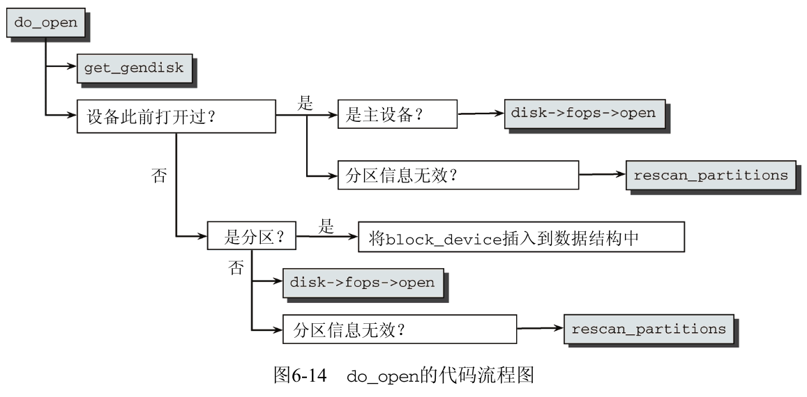
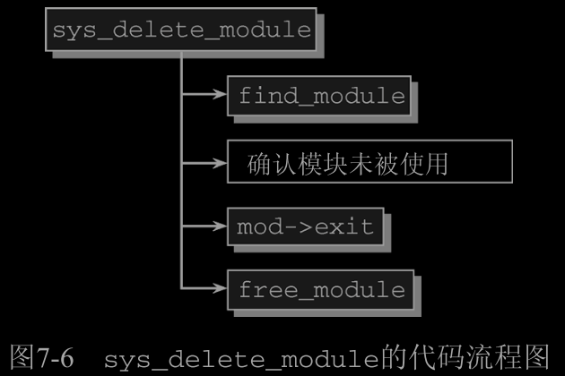
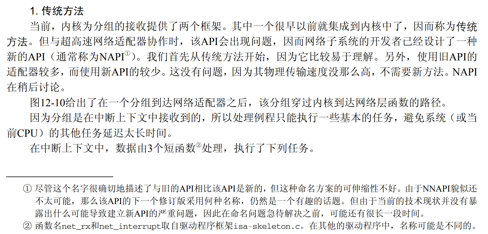
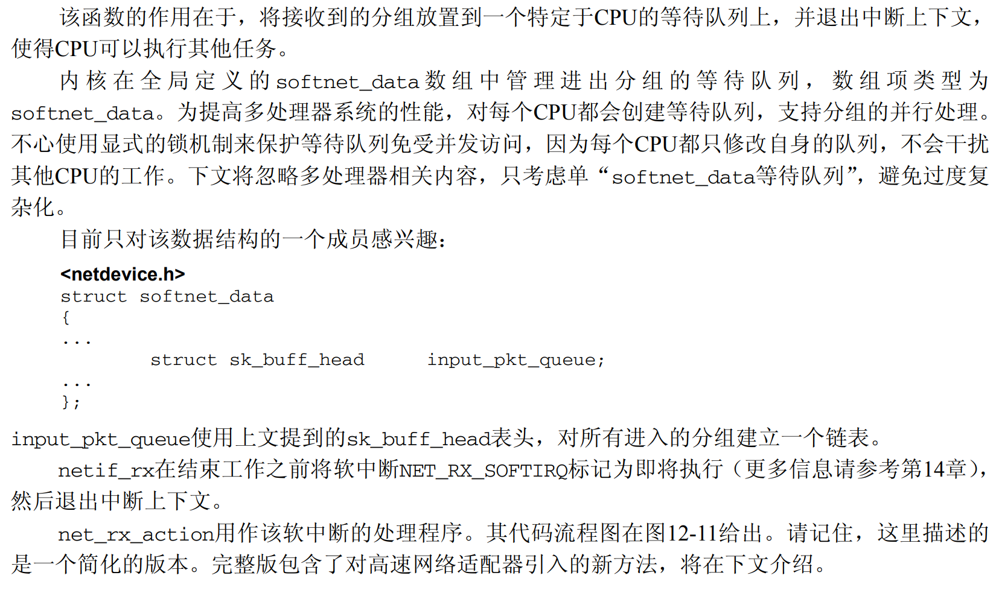
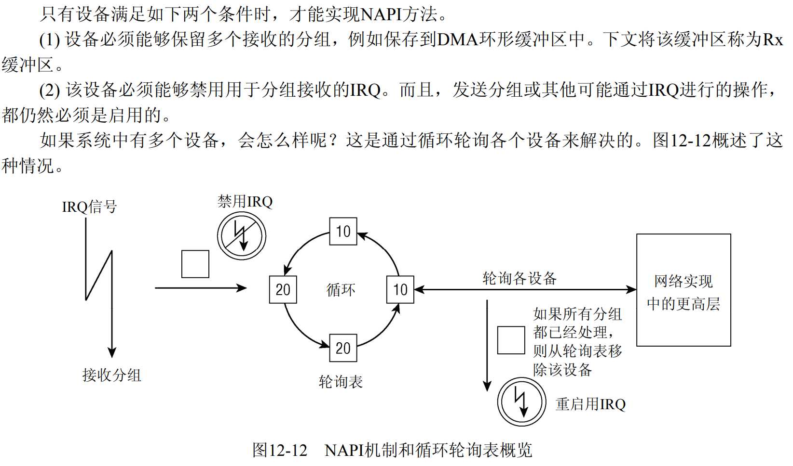
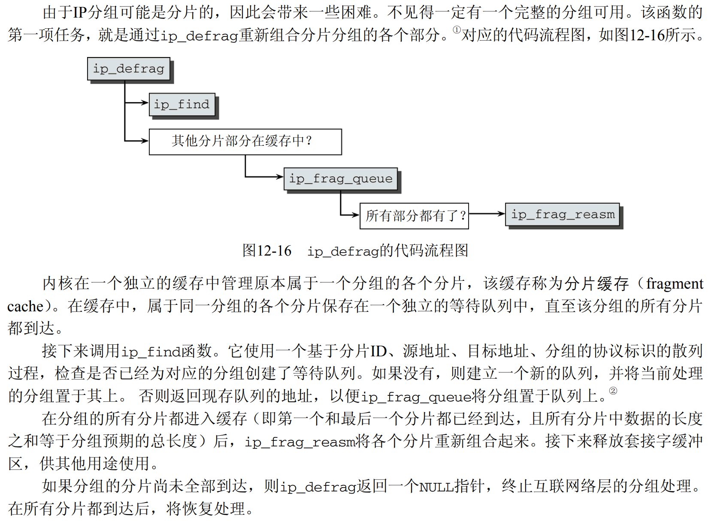

- 设备驱动程序的任务在于支持应用程序经由设备文件与设备通信。换言之，使得能够按适当的方式在设备上读取/写入数据。
- 网卡也可以通过设备驱动程序控制，但在内核中属于特殊状况，因为网卡不能利用设备文件访问。原因在于在网络通信期间，数据打包到了各种协议层中。在接收到数据时，内核必须针对各协议层的处理，对数据进行拆包与分析，然后才能将有效数据传递给应用程序。在发送数据时，内核必须首先根据各个协议层的要求打包数据，然后才能发送。 为支持通过文件接口处理网络连接（按照应用程序的观点），Linux使用了源于BSD的套接字抽象套接字可以看作应用程序、文件接口、内核的网络实现之间的代理。

# 第六章 设备驱动程序
- 不同驱动程序之间结构类似，且与设备无关
## io体系结构
- 内核要处理io时需要考虑到的三个问题
  - 如何对硬件进行寻址
  - 用户程序如何访问设备
  - 用户空间如何确定哪些设备可用
- 
- 总线连接外设与cpu，几种代表性的总线 p313
- pc中不同总线通过桥接器相互连接
  - 
### 内核与外设交互的方法
- io端口：
  - 内核发送数据给 I/O控制器。数据的目标设备通过唯一的端口号标识，数据被传输到设备进行处理。处理器管理了一个独立的虚拟地址空间，可用于管理所有I/O地址。但其余的系统硬件必须支持这种方式。
  - ***I/O地址空间通常不关联到普通的系统内存。因为端口也可以映射到内存中，这通常会引起混淆。***
  - ***在IA-32体系结构上，端口地址空间由2的16次方（即大约64 000）个不同的8位地址组成，通过0x0到0xFFFF之间的数字唯一标识。对其中的每个端口号而言，或者已经分配了一个设备，或者未使用。几个外设共享一个端口是不可能的***
    - iou端口号实际上就是通过0x0到0xFFFF之间的数字唯一标识
  - 考虑到当今的复杂技术，8个比特位在与外部设备交换数据时并不算多。因此，可以将两个连续的8位端口合并为一个16位端口。进一步地，两个连续的16位端口（实际上是4个连续的8位端口）可以认为是一个32位端口。处理器提供了一些适当的汇编语句，可以进行输入输出操作
  - 每种处理器类型实现端口访问的方式都不同。因此，内核必须提供一个适当的抽象层。诸如outb（写一个字节）、outw（写一个字）、inb（读取一个字节）之类的命令在asm-arch/io.h中实现。 这 些定义与具体处理器非常相关
- io内存映射
  - 程序员必须寻址许多设备，与内存的处理方式类似。***因此现代处理器提供了对I/O端口进行内存映射的选项，将特定外设的端口地址映射到普通内存中，可以像处理普通内存那样操作外设。***图形卡通常会使用这类操作，因为与使用特定的端口命令相比，处理大量图像数据时使用普通处理器命令要更容易。诸如PCI之类的系统总线通常也是通过I/O地址映射进行寻址的
  - 系统使用ioremap和iounmap命令将io端口映射/解除到普通内存中，不同体系结构的实现有所不同
- 轮询和中断
  - 系统使用轮询和中断判断某个设备的数据是否已经就绪并可以读取
  - 轮询：系统重复询问数据是否可用，此举占用系统大量时间，浪费资源
  - 中断：
    - 每个cpu提供中断线（可以理解为中断引脚）中断线可以理解为cpu的中断引脚
    - 各个设备可能共享一个中断线
    - 各个设备也可能共享一个中断号
    - 外设的数据已经就绪，需要由内核或应用程序（间接地）处理时，外设会引发一个中断
- 通过总线控制设备
  - 并非所有设备均通过io语句寻址，也有通过总线地址访问的
  - 系统中总线可以分为系统总线和扩展总线
    - 系统总线：连接处理器的总线，很多体系结构中均为pci总线，可使用I/O语句和内存映射与总线自身和附接的设备通信。 内核也为驱动程序提供了几个命令，以调用特殊的总线功能
    - 扩展总线：扩展总线如USB、IEEE1394、SCSI等，通过总线协议与连接在该总线的设备通讯，***内核通过I/O语句和内存映射与扩展总线自身通信，从而间接与扩展总线上的设备通讯***
  - 与总线上附接的设备通信，不见得一定在内核空间中由设备驱动程序进行，有时也可能在用户空间中实现
## 访问设备
### 设备文件
- 通过主次设备号标识文件 串行接口设备/dev/ttyS0
- 内核根据主/次设备号查找对应的设备驱动程序
### 字符设备 块设备 其他设备
- 设备文件名称或路径与设备功能不相关
- mknod用于创建设备文件
```bash
wolfgang@meitner> ls -l /dev/sd{a,b} /dev/ttyS{0,1} 
brw-r-----1 root disk 8, 0 2008-02-21 21:06 /dev/sda  #b标识块设备 8为主设备号 0为次设备号
brw-r-----1 root disk 8, 16 2008-02-21 21:06 /dev/sdb 
crw-rw----1 root uucp 4, 64 2007-09-21 21:12 ttyS0 
crw-rw----1 root uucp 4, 65 2007-09-21 21:12 ttyS1
```
- 主设备号与次设备号
  - 可能存在几个同类型的设备，此类设备由一个驱动程序管理
  - 主设备号可以标识一类设备（例如sata硬盘的主设备号为8 串口设备主设备号为4）
  - 主设备号也可以方便同类设备数据结构的合并，从而方便内核管理
  - 主设备号可以用于寻址该类设备的驱动程序，因为这一类的设备可能使用同一个驱动程序进行管理
  - 一个驱动程序可以对应多个主设备号，例如系统中存在两条stat总线时，则两个stat总线主设备号不同
  - 次设备号用于标识主设备号标识的设备类型下的具体某个设备（例如硬盘设备下具体某个分区，串行设备下具体某个串口接口）
  - 次设备号使得驱动程序可以定位到某类设备下的具体某个设备，从而进行驱动管理
  - ***块设备和字符设备的主设备号可能是相同的。因此，除非同时指定设备号和设备类型（块设备/字符设备），否则找到的驱动程序可能不是唯一的***
  - 主设备号的分配遵循linux规定，可以根据下述来源之一找到如何分配主设备号
    - http://www.lanana.org
    - Documentation/devices.txt
    - major.h
- 动态创建设备文件
  - udevd守护进程允许用户层动态创建设备文件
  - udevd进程接收来自内核层消息（热插拔消息或内核检测到新设备），并创建对应的/dev目录下设备文件
  - 每当内核检测到一个设备时，都会创建一个内核对象kobject（参见第1章）。 该对象借助于sysfs文件系统导出到用户层（更多细节请参见10.3节）。此外，内核还向用户空间发送一个热插拔消息，这一点会在7.4节讨论。 如果在系统启动期间发现新设备，或在运行期间有新设备接入（如USB 存储棒），内核产生的热插拔消息包含了驱动程序为设备分配的主从设备号。udevd守护进程所需完成的所有工作，就是监听这些消息。在注册新设备时，会在/dev中创建对应的项，接下来就可以从用户层访问该设备了
### 使用ioctl进行设备寻址
  - 用户可以使用通用文件系统的系统调用（例如read write等）对设备文件进行操作，但是此类方法能触发的功能有限，故
  - 系统引入sysfs机制实现了设置设备参数的方法，并层次化表示了系统中所有设备
  - 系统引人ioctl系统调用，从而支持以该系统调用触发设备的任意功能
- IOCTL，它表示输入输出控制接口
  - ioctl对普通文件无效，每个设备驱动程序都可以定义一个ioctl例程，使得控制数据的传输可以独立于实际的输入输出通道。
  - 用户程序中标准库提供了ioctl函数，可以通过特殊的码值将ioctl命令发送到打开的文件，该函数的实现基于ioctl系统调用，由内核中的sys_ioctl处理
  - asmlinkage long sys_ioctl(unsigned int fd, unsigned int cmd, unsigned long arg)
  - ioctl码值（cmd）传递到由文件描述符（fd）标识的打开文件，ioctl码值一般定义为比较易读的预处理器常数。第三个参数（arg）传输更多的信息
- 网卡以及其他设备
  - 网卡没有设备文件。相反，用户程序必须使用套接字与网卡通信。套接字是一个抽象层，对所有网卡提供了一个抽象视图。标准库的网络相关函数调用socketcall系统调用与内核通信交互，进而访问网卡。
  - 还有其他一些没有设备文件的系统设备。这些设备或者通过特别定义的系统调用访问，或者在用户空间无法访问。后者的例子包括所有的扩展总线，如USB和SCSI
### 主从设备号表示
- 主从设备号历史上以16位数据表示，现在以32位数据表示，为保持兼容性，系统设计了相关数据结构以及宏用于完成不同格式的主从设备号转换
- 现在主从设备号在用户空间以dev_t这个32位数据结构体表示，该数据表示方法兼容以前的16位主从设备号表示方法
- 现在主从设备号在内存中以32位数据的形式表示，若将其转为用户空间使用的dev_t，需要使用特定宏进行转换
- 
### 注册
#### 字符设备和块设备的数据结构使用下述方法组织
- ***此处内容弄清了 字符设备和块设备使用什么结构进行表示 系统如何对上述结构体进行组织***
- 字符设备数据结构表示：每个字符设备都表示为struct cdev的一个实例
- 块设备数据结构表示：struct genhd用于管理块设备的分区，作用类似于字符设备的cdev，如果块设备没有分区，我们也可以视之为具有单一分区的块设备。
- 重要的是注意到内核跟踪所有cdev 和genhd实例的方式
- 有两个全局数组（bdev_map用于块设备，cdev_map用于字符设备）用来实现散列表，使用主设备号作为散列键。cdev_map和bdev_map都是同一数据结构struct kobj_map的实例
  - 
  - 
#### 下述数据组织方法仅用于字符设备
- 该数据结构用于管理设备号范围，该设备号范围会被分配给驱动程序
- 使用散列表来跟踪已经分配的设备号范围，使用主设备号作为散列键，关键数据结构 char_device_struct
#### 如何注册块设备和字符设备
- 内核中注册字符设备
  - 注册或分配一个设备号范围，如果驱动程序需要使用特定范围内的设备号，则必须调用 register_chrdev_region，而alloc_chrdev_region则由内核来选择适当的范围
  - 在获取了设备号范围之后，需要将设备添加到字符设备数据库，以激活设备。这需要用 cdev_init初始化一个struct cdev的实例，接下来调用cdev_add
  - 在很久以前，字符设备的标准注册函数曾经是register_chrdev
- 内核中注册块设备号
  - 注册块设备只需要调用add_disk一次。为描述设备的属性，需要将一个struct genhd实例作为参数
  - 较早的内核版本需要使用register_blkdev注册块设备
## 与文件系统关联
- ***讲解设备文件与文件系统的关联***
- 除极少数例外，设备文件都是由标准函数处理，类似于普通文件，设备文件也是通过将在第8章
讨论的虚拟文件系统管理。普通文件和设备文件都是通过完全相同的接口访问。
### inode中的设备文件成员
- 虚拟文件系统中的每个文件都关联到恰好一个inode，用于管理文件的属性 设备文件也会关联到inode
- inode结构中与设备文件相关的成员
- 
- 
### 标准文件操作
- 打开一个设备文件
- 
### 用于字符设备的标准操作
- 即文件系统向字符设备提供的标准操作，字符设备还会实现自己特有的函数
- chrdev_open
- 
### 用于块设备的标准操作
- blk_fops中保存块设备支持的标准操作
- 
- 
- 此外块设备还有更加复杂的请求发送与操作过程，需要用户自己实现
## 字符设备操作
### 表示字符设备
- 字符设备由struct cdev表示
- 
### 打开设备文件
- fs/devices.c中的chrdev_open是用于打开字符设备的通用函数
  - 
  - 得到设备号
    - kobject_lookup查询得到设备对应kobjecgt
      - kobjecgt得到cdev实例
        - 通过cdev->ops，内核访问特定于设备的file_ operations
          - 调用file_operations中的open方法（现在是特定于设备的）执行初始化操作
            - 针对主设备号相同，从设备号不同的设备，其open函数会根据具体设备有所不同
            - 即主要思路是：先根据主设备号设置一个特定的文件操作集。其中包含的操作，接下来可以由根据从设备号选择的其他操作替代
### 读写操作
- 调用标准库的读写操作，将向内核发出一些系统调用（第8章讨论），最终调用file_operations结构中相关的操作（主要是read和write）。这些方法的具体实现依设备而不同
## 块设备操作
- 块设备与字符设备在3个主要方面有根本的不同
  - 可以在数据中的任何位置进行访问。对字符设备来说，这是可能的，但不是必然的。
  - 数据总是以固定长度的块进行传输。即使只请求一个字节的数据，设备驱动程序也会从设备 取出一个完全块的数据。相比之下，字符设备能够返回单个字节。
  - 对块设备的访问有大规模的缓存，即已经读取的数据保存在内存中。如果再次需要，则直接从内存获得。写入操作也使用了缓存，以便延迟处理。 这对字符设备没有意义（如键盘）。因为，字符设备的每次读请求都必须真正与设备交互才能完成
- ***块***：块是一个特定长度的字节序列，用于保存在内核和设备之间传输的数据。块的长度可通过软件方法修改
- ***扇区***：是一个固定的硬件单位，指定了某个设备最少能够传输的数据量
- ***块与扇区的关系***：块不过是连续扇区的序列而已。因此，块长度总是扇区长度的整数倍。由于扇区是特定于硬件的常数，它也用来指定设备上某个数据块的位置。内核将每个块设备都视为一个线性表，由按整数编号的扇区或块组成
- ***块长度与内存页大小***：当前几乎所有常见块设备的扇区长度都是512字节，块长度则有512、1024、2048、4096字节等。但应该注意到，块的最大长度会受到特定体系结构的内存页长度的限制。IA-32系统支持的块长度 为4096字节，因为其内存页长度是4096字节。另一方面，IA-64和Alpha系统能够处理8192字节的块
### 块设备的表示
- 块设备的一组属性由内核进行管理
- 内核使用请求队列管理读写数据块的请求，从而支持对请求的缓存和重排
- 请求的结果也使用缓存进行管理
- 块设备层各个成员
  - 
- 裸块设备由struct block_device表示
- 与字符设备层相比，块设备层提供了丰富的队列功能，每个设备都关联了请求队列。这种队列也
是块设备层最复杂的部分了。
- 对块设备的读写请求不会立即执行对应的操作。相反，这些请求会汇总起来，经过协同之后传输到设备。因此，对应设备文件的file_operations结构中没有保存用于执行读写操作的具体函数。相反，其中包含了通用函数
### 数据结构
- 块设备的核心属性由struct block_device表示
- 内核使用以下数据结构，对已经分区的硬盘提供了一种表示 struct gendisk
- 对每个分区来说，都有一个hd_struct实例
- 此前介绍的各个数据结构（struct block_device、struct gendisk和struct hd_struct）是彼此直接关联的。图6-10说明结构间彼此关联的方式
  - 
- 特定于块设备的操作汇总在下面（稍微简化）的数据结构中
  - 
- 块设备的请求队列
  - 块设备的读写请求放置在一个队列上，称之为请求队列。gendisk结构包括了一个指针，指向这个特定于设备的队列，由struct request_queue 表示
- 驱动程序都必须实现自身的request_fn函数，该函数是请求队列管理与各个设备的底层功能之间的主要关联，在内核处理 当前队列以执行待决的读写操作时，会调用该函数
### 向系统添加磁盘和分区
- add_disk负责完成向系统添加磁盘的任务
  - 
- add_partition负责向通用硬盘数据结构添加一个新的分区
### 打开块设备文件
- 在用户应用程序打开一个块设备的设备文件时，虚拟文件系统将调用file_operations结构的open函数，最终会调用到blkdev_open
  - 
  - 、
### 请求结构
- 内核提供了数据结构以描述发送给块设备的请求 struct request
### BIO
### 提交请求
- 讨论内核如何向设备提交物理请求来读取和写入数据
### I/O调度
- 内核采用的各种用于调度和重排I/O操作的算法，称之为I/O调度器
- I/O调度器也称作电梯（elevator）。它们由struct elevator_ops 结构中的一组函数表示
### ioctl的实现
- ioctl使得我们能够使用特殊的、特定于设备的功能，这些功能无法通过普通的读写操作访问。这
种支持通过ioctl系统调用实现，该系统调用可以用于普通的文件
- 该系统调用在sys_ioctl实现，但主要工作由vfs_ioctl完成
  - 
  - 
## 资源分配
- I/O端口和I/O内存是两种概念上的方法，用以支持设备驱动程序和设备之间的通信。为使得各种不同的驱动程序彼此互不干扰，有必要事先为驱动程序分配端口和I/O内存范围。这确保几种设备驱动 程序不会试图访问同样的资源
### 资源管理
- ***描述用于管理资源的数据结构和函数***
- 表示资源的数据结构是 struct resource，用于表示系统中可用的资源
- resource结构中存在三个指针，指向resource父节点、子节点、兄弟节点，从而将resource组织为一个树型结构
  - 
- resource结构可以用于表示系统中各种类型的资源，通过树型结构，可以将一个较大的资源（根节点）根据用途分割多个较小的资源（子节点）
- 例如io端口号以及内存范围均可以作为资源进行分配
- 请求和释放资源
  - 即从树型结构中添加和删除项
  - 内核提供了__request_resource函数，用于请求一个资源区域
    - request_resource 只负责必要的锁操作，主要工作委托给__request_resource
  - 调用release_resource函数释放使用中的资源
### IO内存
- io内存是资源管理的重点
- I/O内存不仅包括与扩展设备通信直接使用的内存区域，还包括系统中可用的物理内存和ROM存储器，以及包含在资源列表中的内存（可以使用proc文件系统中的iomem文件，显示所有的I/O内存）。
- 所有分配的I/O内存地址，都通过一棵资源树管理，树的根结点是全局内核变量iomem_resource。
上述输出中，每个缩进表示一个子结点层次。具有相同的缩进层次的所有项是兄弟结点，会通过链表联系起来。
  - 即io内存也是通过resource树型结构管理起来的
  - 
- 使用io内存时，不仅需要分配内存区域，有时还需要将扩展设备的地址空间映射到内核地址空间中（即软件I/O映射）
  - 使用ioremap内核函数可以实现软件I/O映射  内核还提供了特定于体系结构的iounmap函数来解除映射
- 对于驱动程序，更重要的就是： 将一个物理地址映射到处理器的虚拟地址空间中，使得内核可以使用该地址，这意味着扩展总线的地址空间映射到CPU的地址空间中，，使得能够用普通内存访问函数操作总线/设备
- 部分平台中，即使映射成功，也需要使用特定指令来访问被映射后的io内存区域
### IO端口
- io端口也是一种资源，需要resource结构进行资源管理
- I/O端口是一种与设备和总线通信的流行方法，特别是在IA-32平台上。类似于I/O内存，按良好范例编写的驱动程序在访问所需的区域之前，相应的区域必须已经注册
- kernel/resource.c中的ioport_resource充当资源树的根结点。proc文件系统中的ioports文件可以显示已经分配的端口地址
- 操作io端口需要使用特定汇编指令，内核提供了对应宏
## 总线系统
- 总线作为pc体系结构的一部分，也需要对应的驱动程序
- 与具体设备的驱动程序相比，总线驱动程序与核心内核代码的工作要密切得多，
- 总线驱动程序向相关的设备驱动程序提供功能和选项
### 通用驱动程序模型 （关键元素包括设备、设备驱动程序、总线）
- 设备的表示
  - 使用struct device表示几乎所有总线类型通用的设备属性
  - 该结构直接嵌入到特定于总线的数据结构中，而不是通过指针引用
  - 内核提供了标准函数device_register，用于将一个新设备添加到内核的数据结构
  - device_get和device_put一对函数用于引用计数。
- 设备驱动程序的表示
  - 使用 struct device_driver 表示设备驱动程序
- 总线的表示
  - struct bus_type
- 注册总线
  - bus_register该函数向系统添加一个新总线，注册设备和驱动程序之前，需要有总线
- 注册设备
  - device_register，即初始化设备的数据结构，并将其加入到数据结构的网络
    - 
- 注册设备驱动程序
  - driver_register调用bus_add_driver将一个新驱动程序添加到一个总线
### pci总线
- pci总线上标识一个设备
  - 每个设备都通过一个16位编号唯一地标识，其中8个比特位用于总线编号，5个比特位用于插槽编号，3个比特位用于功能编号
  - 
- pci总线上的地址空间:IO空间、数据空间、配置空间
  - 
- pci总线上的配置信息
  - pci总线中扩展设备可以完全通过软件手段进行配置
  - 为支持这种配置，每个PCI设备都有一个256字节长的配置空间，其中包括该设备的特点和要求的有关信息。
  - 配置空间中包括设备的签名、标识设备功能的字段
- PCI总线的内核实现
  - 每个PCI总线都通过pci_bus数据结构的一个实例表示
- PIC总线上的设备如何表示
  - struct pci_dev是一个关键的数据结构，用于表示系统中的各个PCI设备
  - 此处的设备还包含将两条pci总线相连的PCI桥接器，还包括用于连接PCI总线与ISA总线的桥接器。
- PIC总线上的设备驱动程序如何表示
  - pci_driver用于实现PCI驱动程序，表示了通用内核代码和设备的底层硬件驱动程序之间的接口。
  - 每个PCI驱动程序都必须将其函数填到该接口中，使得内 核能够一致地控制可用的驱动程序
- pci总线上注册驱动程序
  - PCI驱动程序可以通过 pci_register_driver 注册
  - 驱动程序注册过程中还需要创建该驱动程序能够管理的所有设备的列表，这是根据（子）设备和（子）厂商ID判断，此类信息位于PCI配置空间中
### USB总线
- usb总线用于排布附件设备拓扑结构 即树型结构
  - 
- usb总线中的设备被分为三个层次，一个设备由多个功能部件组成，分别通过不同的驱动程序控制
  - 每个设备由一个或多个配置（configuration）组成，配置支配着设备的全局特征
  - 每个配置由一个或多个接口（interface）组成，每个接口提供不同的设置选项
  - 每个个接口可能有一个或多个端点（end point），由驱动程序控制。可能有这样的情形： 一个驱动程序控制设备的所有端点，但每个端点都可能需要一个不同的驱动程序
- usb四种传输模式
  - 控制传输（control transfer）
  - 块传输（bulk transfer）
  - 中断传输（interrupt transfer）
  - 同步传输（isochronous transfer）
- ***usb子系统的主要任务***
  - ***注册和管理现存的设备驱动程序。***
  - 为USB设备查找适当的驱动程序，以及初始化和配置。 
  - 在内核内存中表示设备树。 
  - 与设备通信（交换数据）
- 关键的数据结构
  - usb_driver是USB设备驱动程序和内核其余部分（特别是USB层）之间协作的起始点
  - struct usbdrv_wrap数据结构使得可以区分接口驱动程序（for_devices为0）和设备驱动程序。
  - struct usb_device 数据结构描述了USB设备树以及内核中各种设备的特征。

# 第七章 模块
- 模块机制支持了linux内核添加驱动程序、文件系统以及其他组件，同时无需重新编译内核
## 概述
- 部分硬件厂商只提供编译后的二进制模块，不提供源码，通过该方法控制专有硬件，此类代码可能成为漏洞挖掘的目标
- 模块代码导出一些函数，可以由其他核心模块（以及持久编译到内核中的代码）使用。在模块代码需要卸载时，模块和内核剩余部分之间的关联当然可以终止
  - 
## 使用模块
- 添加和移除模块涉及几个系统调用，这些通常由modutils工具包调用
- 添加和移除
  - 模块可以通过两个不同的系统程序添加到运行的内核中。它们分别是modprobe和insmod。前者考虑了各个模块之间可能出现的依赖性（在一个模块依赖于一个或多个合作者模块的功能时）。相比之下，insmod只加载一个单一的模块到内核中，而该模块可能只信赖内核中已存在的代码，并不关注所依赖的代码是通过模块动态加载，还是持久编译到内核
  - modprobe在识别出目标模块所依赖的模块之后，在内核也会使用insmod
  - insmod的运作模式
  - 模块文件 .ko 使用elf文件格式，且是可重定位elf文件
  - 模块的装载使用系统调用init_module，即可在内核中完成所有任务，该系统调用中，模块代码首先复制到内核内存中。接下来是重定位工作和解决模块中未定义的引用。因为模块使用了持久编译到内核中的函数，在模块本身编译时无法确定这些函数的地址， 所以需要在这里处理未定义的引用
  - nm工具可用于产生模块（或任意目标文件）中所有外部函数的列表。以下例子中，给出了romfs 模块使用的若干被列为外部引用的函数
    - nm romfs.ko
  - ***内核提供了一个当前内核中所有导出函数的列表。该列表给出了所有导出函数的内存地址和对应函数名，可以通过proc文件系统访问，即文件/proc/kallsyms，故被载入的模块可以根据该表确定自身引用的外部函数的地址***
- 模块的依赖关系
  - 模块之间的相互依赖有助于共享代码，降低空间需求
  - 添加模块时考虑到的问题
    - 内核提供的函数符号表，可以在模块加载时动态扩展其长度。读者在下文会看到，模块可以指定其代码中哪些函数可以导出，哪些函数仅供内部使用。
    - 如果模块之间有相互依赖，那么向内核添加模块的顺序很重要。例如，如果试图在fat之前向内核装载vfat模块将会失败，因为若干函数引用的地址无法解决（相应的代码无法运行）
  - modutils标准工具集中的depmod工具可用于计算系统的各个模块之间的依赖关系，默认情况下依赖关系保存在/lib/modules/version/modules.dep中，该信息由modprobe处理，该工具在现存的依赖关系能够自动解决的情况下向内核插入模块，该工具最终使用insmod工具插入内核
  - 在模块安装时产生了文件/lib/modules/version/System.map（同样使用depmod）。该文件列出了内核导出的所有符号。如果其中包含了某个模块中未解决的引用，那么该引用就不成问题了，在模块装载时引用将自动解决。如果未解决的引用无法在该文件或其他模块中找到，则模块不能添加到内核中，因为其中引用了外部函数，而又找不到实现
- 查询模块信息
  - 用modutils中的modinfo工具查询模块所包含的信息
  - 内核在elf中引入了一个名为.modinfo的段，用于保存模块相关信息
- 自动加载
  - 内核加载模块需要用到用户空间相关操作，内核会启动kmod辅助进程用于处理内核发起的模块加载请求
  - 当用户层的相关操作需要用到内核中没有的模块时，内核可以主动加载该模块从而完成用户请求
  - kmod进程会启动modprobe工具完成模块加载
    - 
  - 每个模块中存在一个数据库，用于描述该模块所支持的设备，数据库信息通过模块别名（module aliase）提供。宏MODULE_ALIAS用于产生模块别名，MODULE_ALIAS提供的别名保存在模块二进制文件的.modinfo段中
  - 内核提供了宏MODULE_DEVICE_TABLE来产生模块所支持的设备的信息
## 插入和删除模块
- 用户空间中通过两个系统调用执行内核中插入和删除模块的代码
  - init_module：将一个新模块插入到内核中。用户空间工具只需提供二进制数据。所有其他工作（特别是重定位和解决引用）由内核自身完成。
  - delete_module：从内核移除一个模块。当然，前提是该模块的代码不再使用，并且其他模块也不再使用该模块导出的函数。
  - 还有一个request_module函数（不是系统调用），用于从内核端加载模块。它不仅用于加载模块，还用于实现热插拔功能
- 模块的表示
  - 如何在内核中表示模块（及其属性）
  - struct module是最重要的数据结构。内核中驻留的每个模块，都分配了该结构的一个实例
- 模块的依赖关系和引用
  - 为管理、表示模块之间的引用关系  ，内核引入struct module_use数据结构
  - 依赖关系的网络通过module_use和module数据结构的modules_which_use_me成员共同建立起来。对每个使用了模块A中函数的模块B，都会创建一个module_use的新实例。该实例将添加到模块 A的module实例中的modules_which_use_me链表。module_which_uses指向模块B的module实例
  - 内核提供了already_uses函数，来判断模块A是否需要另一个模块B
  - use_module函数用于建立模块A和模块B之间的关系：模块A需要模块B才能正确运行
- 模块的二进制结构
  - 模块由以下ELF段组成
    - __ksymtab、__ksymtab_gpl和__ksymtab_gpl_future段包含一个符号表，包括了模块导出的所有符号。
    - __kcrctab、__kcrctab_gpl和__kcrctab_gpl_future包含模块所有（只适用于GPL、或未来只适用于GPL）导出函数的校验和。__versions包含该模块使用的、来自于外部源代码的所有引用的校验和
    - __param存储了模块可接受的参数有关信息。
    - __ex_table用于为内核异常表定义新项，前提是模块代码需要使用该机制
    - modinfo存储了在加载当前模块之前，内核中必须先行加载的所有其他模块名称。换句话说， 该特定模块依赖的所有模块名称。
    - .exit.text包含了在该模块从内核移除时，所需使用的代码（和可能的数据）。该信息并未 保存在普通的代码段中，这样，如果内核配置中未启用移除模块的选项，就不必将该段载入内存。
    - 始化函数（和数据）保存在.init.text段。之所以使用一个独立的段，是因为初始化完成 后，相关的代码和数据就不再需要，因而可以从内存移除
    - .gnu.linkonce.this_module提供了struct module的一个实例，其中存储了模块的名称 （name）和指向二进制文件中的初始化函数和清理函数（init和cleanup）的指针。根据本段， 内核即可判断特定的二进制文件是否为模块。如果没有该段，则拒绝装载文件
  - 生成模块的三个步骤
    - (1) 首先，模块源代码中的所有C文件都编译为普通的.o目标文件。
    - (2) 在为所有模块产生目标文件后，内核可以分析它们。找到的附加信息（例如，模块依赖关系）保存在一个独立的文件中，也编译为一个二进制文件。
    - (3) 将前述两个步骤产生的二进制文件链接起来，生成最终的模块
  - 初始化和清理函数
    - <init.h>中的module_init和module_exit宏用于定义init函数和exit函数。每个模块都包含以下类型的代码，定义了init函数和exit函数
  - 导出符号
    - ***内核为导出符号提供了两个宏：EXPORT_SYMBOL和EXPORT_SYMBOL_GPL。顾名思义，二者分别用于一般的导出符号和只用于GPL兼容代码的导出符号。同样，其目的在于将相应的符号放置到模块二进制映象的适当段中***
  - 一般模块信息
    - 模块的.modinfo段包含了一般信息，使用MODULE_INFO设置：
    - 模块许可证使用MODULE_LICENSE设置
    - 每个模块都应该包含有关开发者的简短信息（如有可能，应包括电子邮件地址）和对模块用途的描述，
      - MODULE_AUTHOR
      - MODULE_DESCRIPTION
    - MODULE_ALIAS(alias)用于给模块指定备选名称（alias），在用户空间中可据此访问模块。该机制可用于区分备选驱动程序，例如，这使得能够向一个模块分配一个或多个别名。 这些别名分别指定该模块支持的所有PCI设备的ID号。如果在系统中找到这样的设备，内核可以（在用户空间帮助下）自动插入对应的模块。
    - .modinfo段中总是会存储某些必不可少的版本控制信息
- 插入模块
  - init_module系统调用是用户空间和内核之间用于装载新模块的接口
  - sys_init_module的代码流程图
    - 
  - 加载模块
    - 关键函数是load_module，在实现load_module时会遇到真正的困难，内核源代码中对该函数的注释是“完成所有艰苦的工作”，这是完全正确的说法。这是一个涉及内容广泛的函数（超过350行），可以完成以下任务
    - 
- 移除模块
  - sys_delete_module
    - 
## 自动化与热插拔
- 模块不仅可以根据用户指令或自动化脚本装载，还可以由内核自身请求装载。这种装载机制，在下面两种情况下很有用处。
  - (1) 内核确认一个需要的功能当前不可用。例如，需要装载一个文件系统，但内核不支持。内核可以尝试加载所需的模块，然后重试装载文件系统。
  - (2) 一个新设备连接到可热插拔的总线（USB、FireWire、PCI等）。内核检测到新设备并自动装载包含适当驱动程序的模块
- kmod实现的自动加载
  - 在内核发起的模块自动装载特性中，kernel/kmod.c中的request_module是主要的函数。模块的名称（或一般占位符①）需要传递给该函数
    - 
  - 尽管在较早的内核版本（2.0及以前）中自动装载模块是由一个独立的守护进程负责，该守护进程必需在用户空间中显式启动，而现在该特性由内核实现，当然还需要用户空间中的实用程序插入模块。默认情况下会使用/sbin/modprobe。该工具在上文讨论手动插入模块时提到过
- 热插拔 udevd实现的
  - 在新设备连接到可热插拔的总线（或移除）时，内核再次借助用户空间应用程序来确保装载正确的驱动程序。与通常插入模块的过程相比，这里有必要执行几个额外的任务（例如，必须根据设备标识字符串，找到正确的驱动程序，或必须进行一些配置工作）。因此，这里用另一个工具（通常是 /sbin/udevd②）代替了modprobe
## 版本控制
- 关键的问题是内核版本的变化对驱动程序和模块的代码产生影响，需要确定，当前模块或驱动程序是能正常运行在指定的内核版本中，即模块或驱动程序依赖的内核接口是否发生改变
- 校验和方法
  - 基本思想是使用函数或过程的参数，生成一个CRC校验和。该校验和是一个4字节数字，十六进制记数法需要8个字母。如果函数接口修改了，校验和也会发生变化。这使得内核能够推断出新版本 已经不再兼容旧版本
- 版本控制函数
  - 内核使用辅助函数check_version确定模块所需版本的符号是否与内核中可用符号的版本匹配

# 第十章 无持久存储的文件系统
- 传统上，文件系统用于在块设备上持久存储数据。但也可以使用文件系统来组织、提供或交换 并不存储在块设备上的信息，这些信息可以由内核动态生成。本章将对其中一些进行讨论
- proc文件系统（proc filesystem），它使得内核可以生成与系统的状态和配置有关的信息
- 。Sysfs按照惯例总是装载在/sys目录，但这不是强制规定，装载到其他 位置也是可以的。它设计为从内核向用户层导出非常结构化的信息
## proc
- 提供特定于进程的数据
  - cd /proc/7748
- 提供一般性系统信息
  - iomem和ioports提供了用来与设备通信的内存地址和端口的有关信息，
    - cat /proc/iomem
  - buddyinfo和slabinfo提供了伙伴系统和slab分配器当前的使用情况，而meminfo给出了一般性的内存使用情况，分为高端内存、低端内存、 空闲内存、已分配区域、共享区域、交换和回写内存,等等。Vmstat给出了内存管理的其他特征信息， 包括当前在内存管理的各个子系统中内存页的数目。
  - kallsyms和kcore项用于支持内核代码调试。前者是一个符号表，给出了所有全局内核变量和函数在内存中的地址
  - interrupts保存了当前操作期间引发的中断的说明
- 网络信息
  - /proc/net子目录提供了内核的各种网络选项的有关数据，其中保存了各种协议和设备数据，包括以下几个有趣的数据项
    - udp和tcp提供了IPv4的UDP和TCP套接字的统计数据。IPv6的对应数据保存在udp6和tcp6中。 UNIX套接字的统计数据记录在unix
    - 用于反向地址解析的ARP表，可以在arp文件中查看。
    - dev保存了通过系统的网络接口传输的数据量的统计数据（包括环回接口）。该信息可用于检 查网络的传输质量，因为其中也包括了传输不正确的数据包、被丢弃的数据包和冲突相关的 数据。
    - 有些网络驱动程序（如，流行的英特尔PRO/100芯片组的驱动程序）在/proc/net创建了额外的子目录，提供了更详细的特定于硬件的信息。
- 系统控制参数
  - sysctl系统调用可以用于修改内核行为
  - sysctl系统调用实际上是不必要的，因为通过/proc接口对内核数据的操作已经简单到了极点。 sysctl参数由一个独立的子目录/proc/sys管理，它进一步划分为各种子目录，对应于内核的各个子系统。
- 数据结构
- 初始化
- 装载proc文件系统
- 管理/proc数据项
- 读取和写入信息
- 进程相关的信息
- 系统控制机制
## 简单的文件系统
## sysfs
- sysfs是一个向用户空间导出内核对象的文件系统，它不仅提供了察看内核内部数据结构的能力,还可以修改这些数据结构。特别重要的是，该文件系统高度层次化的组织：
- sysfs的数据项来源于第1章介绍的内核对象（kobject），而内核对象的层次化组织直接反映到了sysfs的目录布局中①。由于系统的所有设备和总线都是通过kobject组织的，所以sysfs提供了系统的硬件拓扑的一种表示
- sysfs已经成为老式的IOCTL机制的一种替代品。向内核发送神秘的ioctl通常 需要一个C程序。与之相比，从/向sysfs文件读/写一个值要简单得多。一个简单的shell命令就足够了
- 概述
  - kobject包含在一个层次化的组织中。最重要的一点是，它们可以有一个父对象，可以包含到 一个kset中。这决定了kobject出现在sysfs层次结构中的位置：如果存在父对象，那么需要在 父对象对应的目录中新建一项。否则，将其放置到kobject所在的kset所属的kobject对应的 目录中（如果上述两种情况都不成立，那么该kobject对应的数据项将放置到系统层次结构的 顶级目录下，当然这种情况比较罕见）。
  - 每个kobject在sysfs中都表示为一个目录。出现在该目录中的文件是对象的属性。用于导出和 设置属性的操作由对象所属的子系统提供（类、驱动程序，等等）。
  - 总线、设备、驱动程序和类是使用kobject机制的主要内核对象，因而也占据了sysfs中几乎所 有的数据项
- 数据结构
  - 目录项
    - 目录项由<sysfs.h>中定义的struct sysfs_dirent表示，它是sysfs的主要数据结构。整个实现都围绕它进行。每个sysfs结点都表示为sysfs_dirent的一个实例
  - 属性
    - 属性由struct attribute数据结构定义
- 装载文件系统
  - mount系统调用最终将填充超级块的工作委托给 sysfs_fill_super
    - 
- 文件和目录操作
  - 用于操作文件的方法收集到了一个struct file_operations实例中
  - 打开文件
  - 读写文件内容
  - 目录遍历
- 向sysfs添加内容
  - 注册子系统
# 第十二章 网络
- 与网络相关的头文件的数目巨大，使得内核开发者将这些头文件存储到一个专门的目录include/net 中，而不是存储到标准位置include/linux
## 互联的计算机
## ISO/OSI和 TCP/IP参考模型
- ISO/OSI7层模型过于详细了，将ISO/OSI模型的一些层合并为新层。该模型只有4层，因此其结构更为简单。这种模型称为TCP/IP参考 模型，当今因特网上的大部分通信都是基于该模型的。
- 
- 主机到网络层-mac地址
  - 主机到网络层负责将信息从一台计算机传输到远程计算机。它处理传输介质①的物理性质，并将数据流划分为定长的帧（frame），以便在发生传输错误时重传数据块。如果几台计算机共享同一传输线路，网络接口卡必须有一个唯一的 ID号，称之为MAC地址（MAC address），通常 烧进硬件中。各厂商之间的协议保证该ID是全球唯一的。MAC地址的一个例子是 08:00:46:2B:FE:E8。 从内核看来，***该层是由网卡的设备驱动程序实现的***
- ip层-ip地址
  - OSI模型的网络层在TCP/IP模型中称为互联网络层（Internet layer，也称IP层），二者在本质上是相同的，都是指在网络中的任何计算机之间交换数据的任务,
  - 网络层也负责其他连接细节，如将传输的数据划分为特定长度的分组
  - 在发送数据时，数据流划分为分组，这些分组在接收端重新组合。这样，高层协议可以透明地处理任意长度的数据。
  - 网络层还分配网络中唯一的地址，以便计算机可以彼此通信（这与前述的硬件地址是不同的，因为网络通常由物理子网组成
  - 在因特网中，网络层借助IP协议（Internet Protocol）实现，IP协议有两个版本（IPv4和IPv6）
- 传输层-端口
  - 在两种模型中，第4层都是传输层（transport layer）。其任务是在两个建立了链路的计算机上，控制应用程序之间的数据传输
  - 每个对互联网络层数据感兴趣的应用程序都使用一个唯一的端口号， 来唯一地标识目标系统上的服务器应用程序。
  - 传输层的另一项任务是可以（但不是必须的）提供一种可靠的连接，使得通过该连接的数据按给定的顺序到达。
- 应用层
  - TCP/IP参考模型中的应用层，对应OSI模型中的5～7层（会话层、表示层和应用层）。顾名思义，应用层表示从应用程序视角来看的网络连接。在两个应用程序之间建立通信连接之后，应用层负责传输实际的内容
- 为因特网定义了大量的标准协议。通常，它们是以RFC（Request for Comments）文档的形式定义的
- ***大多数协议可以使用简单的telnet工具测试，因为它们是用简单的文本命令进行操作的。***
- ***telnet用于与指定端口建立tcp连接所有的用户输入都通过该网络连接转发到与该地址（由IP地址和端口号唯一标识的）相关联的进程***
## 通过套接字通讯
- 在/dev目录下没有与网卡对应的项
- 套接字现在用于定义和建立网络连接
- 在创建套接字时，不仅要区分地址和协议族，还要区分基于流的通信和数据报的通信。（对面向流的套接字来说）同样重要的一点是，套接字是为客户端程序建立的，还是为服务器程序建立的

- 创建套接字
  - 套接字不仅可以用于各种传输协议的IP连接，也可以用于内核支持的所有其他地址和协议类型（例如，IPX、Appletalk、本地UNIX套接字、DECNet，还有在<socket.h>中列出的许多其他类型）。
  - 在创建套接字时，必须指定所需要的地址和协议类型的组合
  - 目前每个地址族都只支持一个协议族，而且只能区分面向流的通信 和面向数据报的通信。即地址类型和协议类型是强绑定的
  - 关键在于选择 地址族 协议族 基于流/数据报的通讯
  - socket 创建socket 指定 地址族 协议族 基于流/数据报的通讯
  - bind 定义socket地址和端口，相关信息保存在 struct sockaddr_in 结构体中
  - 网络字节序（network byte order），它等价于大端序格式
- 使用套接字
  - 客户端
    - connect
    - write
    - read
  - 服务端
    - listen
    - accept
    - read
    - write
  - 1～1024的所有端口称为保留端口（reserved port）
  - 内核中使用四元组标识一个socket链接
    - 一个四元组（192.168.1.20:7777, 192.168.1.10:3506）用来唯一标识一个连接。前两个分量是服务器本地系统的地址和端口号，后两个分量是客户端的地址和端口号。
      - 如果元组中某个分量仍然是未定的，则用星号表示。因而，在被动套接字上监听尚未有客户端连接的服务器进程，可以表示为192.168.1.20:7777, *:*。
      - 在服务器调用fork复制自身来处理某个连接之后，在内核中注册了两个套接字对
        - 监听
          - 192.168.1.20:7777, *.*
        - 连接建立后
          - 192.168.1.20:7777, 192.168.1.10:3506
        - 尽管两个服务器进程的套接字具有相同的IP地址/端口号组合，但二者对应的四元组是不同的。因此，内核在分配输入和输出TCP/IP分组时，必须注意到四元组的所有4个分量，才能确保正确。***该任务称为多路复用（multiplexing）***
  - 数据报套接字
    - 即UDP
    - 分别使用TCP和UDP协议的进程，可以同时使用同样的IP地址和端口号。在多路复用时，内核会根据分组的传输协议类型，将其转发到适当的进程。
## 网络实现的分层模型
- 内核网络子系统的实现与本章开头介绍的TCP/IP参考模型非常相似
  - 
- 通常，各层的数据都由首部和数据两部分组成，
- 英特网协议传输的基本单位是（以太网）帧，网卡以帧为单位发送数据。帧首部部分的主数据项是目标系统的硬件地址，这是数据传输的目的地，通过电缆传输数据时也需要该数据项
- 高层协议的数据在封装到以太网帧时，将协议产生的首部和数据二元组封装到帧的数据部分。在因特网网络上，这是互联网络层数据。
- 通过以太网不仅可以传输IP分组，还可以传输其他协议的分组，如Appletalk或IPX分组，以太网帧的首部（和所有其他现代网络协议的首部部分）包含了一个标识符，唯一地标识了帧数据部分中的协议类型。
  - 
## 网络命名空间
- 在内核版本2.6.24开发期间，内核也开始对网络子系统采用命名空间。这对该子系统增加了一些额外的复杂性。例如，可用网卡的数量。对特定的网络设备来说，如果它在一个命名空间中可见，在另一个命名空间中就不一定是可见的
- struct net中枢结构来跟踪所有可用的命名空间 位于include/net/net_namespace.h，该结构体中包括网络命名空间的链表
  - 
  - 所有可用的命名空间都保存在一个双链表上
  - 每个命名空间都包含不同的网络设备
  - 每个命名空间都可以有一个不同的环回设备
  - 网络设备由struct net_device表示。与特定命名空间关联的所有设备都保存在一个双链表上
- 内核采用struct pernet_operations结构来跟踪所有必需的初始化/清理元组
  - 每当创建一个新的网络命名空间时，内核将遍历pernet_operations的链表，用表示新命名空间的net实例作为参数来调用初始化函数。在删除网络命名空间时，清理工作的处理是类似的。
- 大多数计算机通常都只需要一个网络命名空间。全局变量init_net（在这里，该变量实际上是全局的，并未包含在另一个命名空间中）包含了该命名空间的net实例。
- 网络子系统实现的所有全局函数，都需要一个网络命名空间作为参数，而网络子系统的所有全局属性，只能通过所述命名空间迂回访
## 套接字缓冲区
- struct sk_buff
- 套接字缓冲区用于在网络实现的各个层次之间交换数据，而无须来回复制分组数据
- 套接字结构是网络子系统的基石之一，因为在产生和分析分组时，在各个协议层次上都需要处理该结构
### 使用套接字缓冲区管理数据
- 套接字缓冲区通过其中包含的各种指针与一个内存区域相关联，网络分组的数据就位于该区域中，
  - 
- 套接字缓冲区的基本思想是，通过操作指针来增删协议首部
  - head和end指向数据在内存中的起始和结束位置。
  - data和tail指向协议数据区域的起始和结束位置
  - mac_header指向MAC协议首部的起始，而network_header和transport_header分别指向网络层和传输层协议首部的起始。
  - 在字长32位的系统上，数据类型sk_buff_data_t用来表示各种类型为简单指针的数据	
    - unsigned char *sk_buff_data_t;
- 内核可以将套接字缓冲区用于所有协议类型, 内核提供辅助函数用于从sk_buffer中返回指定协议头部数据的指针
  - 套接字缓冲区可以包含TCP或UDP分组。来自传输层协议首部的对应信息分别可以用tcp_hdr和udp_hdr提取
  - 其他传输层协议也提供了形如XXX_hdr的辅助函数，这类函数需要一个指向struct sk_buff的指针作为参数
  - ip_hdr是最重要的，它用于解释一个IP分组的内容。
- data和tail使得在不同协议层之间传递数据时，无须显式的复制操作，例如当数据包从传输层发动到ip层后，只需要将data指针上移，从而为数据包添加ip头的信息
  - 
  - 在一个新分组产生时，TCP层首先在用户空间中分配内存来容纳该分组数据（首部和净荷）。分配的空间大于数据实际需要的长度，因此较低的协议层可以进一步增加首部。
  - 分配一个套接字缓冲区，使得head和end分别指向上述内存区的起始和结束地址，而TCP数据位于data和tail之间。
  - 在套接字缓冲区传递到互联网络层时，必须增加一个新层。只需要向已经分配但尚未占用的那部分内存空间写入数据即可，除了data之外所有的指针都不变，data现在指向IP首部的起始处。下面的各层会重复同样的操作，直至分组完成，即将通过网络发送
- 对接收的分组进行分析的过程是类似的。分组数据复制到内核分配的一个内存区中，并在整个分析期间一直处于该内存区中。与该分组相关联的套接字缓冲区在各层之间顺序传递，各层依次将其中的各个指针设置为正确值
- 内核提供了一些用于操作套接字缓冲区的标准函数	
  - 
- 为保持struct sk_buff结构尽可能小，64位系统中将sk_buff_data_t的定义改为整型变量，即typedef unsigned int sk_buff_data_t;由于在此类体系结构上，整型变量占用的内存只有指针变量的一半（前者是4字节，后者是8字节）data和head仍然是常规的指针，而所有sk_buff_data_t类型的成员现在都解释为相对于前两者的偏移量，指向传输层首部的指针现在计算如下
  - 
- 内核提供辅助函数访问sk_buff成员
  - 
### 管理套接字缓冲区数据
- 除了指向网络数据的指针，sk_buff中包括管理套接字缓冲区自身的其他成员
  - 
  - 
- 使用sk_buff_head表示skbuff的等待队列的头部
  - 
## 网络访问层
### 网络设备的表示
- 在内核中，每个网络设备都表示为net_device结构的一个实例。在分配并填充该结构的一个实例之后，必须用net/core/dev.c中的register_netdev函数将其注册到内核。该函数完成一些初始化任务，并将该设备注册到通用设备机制内。这会创建一个sysfs项（参见10.3节）/sys/class/net/<device>，关联到该设备对应的目录。
- 如果系统包含一个PCI网卡和一个环回接口设备，则在sys/class/net中有两个对应项
  - 
- 每个网络设备按网络命名空间进行管理的。网络命名空间中针对设备存在三种机制
  - 所有的网络设备都保存在一个单链表中，表头为dev_base
  - 按设备名散列。辅助函数dev_get_by_name(struct net * net, const char * name)根据设备名在该散列表上查找网络设备。
  - 按接口索引散列。辅助函数dev_get_by_index(struct net * net, int ifindex)根据给定的接口索引查找net_device实例
- net_device结构包含了与特定设备相关的所有信息。该结构的定义有200多行代码，是内核中最庞大的结构
  - 该结构中出现的缩写rx和tx会经常用于函数名、变量名和注释中，即接收和发送
  - 网络设备的名称存储在name中。它是一个字符串，末尾的数字用于区分同一类型的多个适配器
    - 
  - 在内核中，每个网卡都有唯一索引号，在注册时动态分配保存在ifindex成员中。
    - 内核提供了dev_get_by_name和dev_get_by_index函数，用于根据网卡的名称或索引号来查找其net_device实例。
  - 一些结构成员定义了与网络层和网络访问层相关的设备属性。
    - 
  - net_device结构的大多数成员都是函数指针，执行与网卡相关的典型任务。这些接口使得内核能够用同一组接口函数来访问所有的网卡，***而网卡的驱动程序负责实现细节***
    - 
    - 
  - 有些函数通常不是由特定于驱动程序的代码来实现的，它们对所有的以太网卡都是相同的。因而内核提供了默认实现（在net/ethernet/net.c中）。
    - 
  - 网络设备分两个方向工作，即发送和接收（这两个方向通常称为下向流和上向流）。
  - ***内核源代码包含了两个驱动程序框架（drivers/net中的isa-skeleton.c和pci-skeleton.c），可用作网络驱动程序的模板。***
- 注册网络设备：register_netdev或register_netdevice
  - 
  - 
### 接收分组 ***重要***
- 驱动程序使用中断通知内核有分组到达，网络驱动程序对特定于设备的中断设置了中断处理例程，中断到达时，内核调用该例程，将数据从网卡传输到物理内存，或通知内核在一定时间后进行处理
  - 几乎所有的网卡都支持DMA模式，能够自行将数据传输到物理内存。但这些数据仍然需要解释和处理，这在稍后进行
- 传统方法接收分组
  - 内核为分组的接收提供了两个框架。
    - 一个很早以前就集成到内核中了，因而称为传统方法。但与超高速网络适配器协作时，该API会出现问题，
    - 网络子系统的开发者已经设计了一种新的API（通常称为NAPI）
    - 使用旧API的适配器较多，而使用新API的较少。这没有问题，因为其物理传输速度没那么高，不需要新方法
  - 一个分组到达网络适配器之后，该分组穿过内核到达网络层函数的路，此时分组是在中断上下文中接收到的，故只能执行基本任务，避免过长占用cpu时间
    - net_interrupt - net_rx - netif_rx - softnet_data 数组 - input_pkt_queue - 软中断NET_RX_SOFTIRQ - net_rx_action - process_backlog - __skb_dequeue - netif_receive_skb - deliver_skb - packet_type->func
    - 
    - 
    - 
    - 实际上，还有另一个分组处理程序的链表。ptype_all包含了对所有分组类型调用的分组处理程序。
    - 上述函数名net_rx和net_interrupt取自驱动程序框架isa-skeleton.c。在其他的驱动程序中，名称可能是不同的
- 对高速接口的支持 (新方法接受分组)
  - 传统方法中一旦分组到达，则irq通知内核，当分组到达的速度过快，上一个分组的irq未处理完毕时新分组已经达到，则会导致问题
  - 新方法(NAPI)使用轮询+irq的组合方式处理分组
  - 基本原理
    - 
    - 
    - 
  - 具体实现 ***没有特别看懂，需要进一步分析***
    - 与旧的API相比，关键性的变化在于，支持NAPI的设备必须提供一个poll函数。该方法是特定于设备的，在用netif_napi_add注册网卡时指定。调用该函数注册，表明设备可以且必须用新方法处理
    - 
    - 
    - 
    - 
    - 
    - 
    - 
- ***上述接收分组的过程中，最终的结果是将分组从当前的网络访问层传输到网络层，根据网络层协议的不同，网络层的入口函数也不同，对于ip网络协议，对应入口函数为ip_rcv，故接受分组的最后流程是调用该函数将分组传递到ip层进行处理***
### 发送分组
- net/core/dev.c中的dev_queue_xmit用于将分组放置到发出分组的队列上
- 只要知道，在分组放置到等待队列上一定的时间之后，分组将发出即可。这是通过特定于适配器的函数hard_start_xmit完成的，在
每个net_device结构中都以函数指针的形式出现，由硬件设备驱动程序实现
- 
- 
## 网络层
- 网络层（具体地说是IP协议）与网络适配器的硬件性质几乎是完全分离的
- 该层不仅负责发送和接收数据，还负责在彼此不直接连接的系统之间转发和路由分组。查找最佳路由并选择适当的网络设备来发送分组，也涉及对底层地址族的处理（如特定于硬件的MAC地址）
- 如果不考虑底层硬件，是无法将较大的分组分割为较小单位的（事实上，硬件的性质是需要分割分组的首要原因）。因为每一种传输技术所支持的分组长度都有一个最大值，IP协议必须方法将较大的分组划分为较小的单位，由接收方重新组合，更高层协议不会注意到这一点。划分后分组的长度取决于特定传输协议的能力。
### IPv4
- IP分组使用的协议首部
  - 
- 结构中各部分的语义。
  - 
- ip首部由iphdr数据结构实现
- ip_rcv函数是网络层的入口点。分组向上穿过内核的路线如图12-15所示。
  - 
  - 发送和接收操作的程序流程并不总是分离的，如果分组只通过当前计算机转发，那么发送和接收操作是交织的。这种分组不会传递到更高的协议层（或应用程序），而是立即离开计算机，发往新的目的地。
### 接收分组
- 首先根据ip头中的校验和进行分组完整行检查，其次检查分组是否达到了IP首部的最小长度，分组的协议是否确实是IPv4
- 之后调用netfilter挂钩
- 调用ip_route_input负责选择路由，进一步决定调用ip_local_deliver（交付到本地更高层协议）或ip_forward（转发到网络中另一台计算机）
- 
- 
### 交付到本地传输层
- 如果分组的目的地是本地计算机，ip_local_deliver必须设法找到一个适当的传输层函数，将分组转送过去。IP分组通常对应的传输层协议是TCP或UDP。
- ip_local_deliver首先调用ip_defrag实现分片合并
  - 
- 交付到传输层
  - 分片合并后将分组交付到传输层
  - ip_local_deliver函数在分组的分片合并完成后，调用netfilter挂钩NF_IP_LOCAL_IN，恢复在ip_local_deliver_finish函数中的处理
  - 将分组传给传输层对应接口例程之前，会将分组（套接字缓冲区形式提供）中的IP首部删除
  - 所有基于互联网络层的协议都有一个net_protocol结构，其中记载相关函数指针，用于调用传输层接收程序，此时分组将以套接字缓冲区的形式调用该函数指针，从而将分组传输到对应传输层，例如，***用于接收TCP分组的tcp_v4_rcv例程和用于接收UDP分组的udp_rcv***
  - 
  - 
### 分组转发
- IP分组可能如上所述交付给本地计算机处理，它们也可能离开互联网络层，转发到另一台计算机，而不牵涉本地计算机的高层协议实例。分组的目标地址可分为以下两类。
  - 目标计算机在某个本地网络中，发送计算机与该网络有连接
  - 目标计算机在地理上属于远程计算机，不连接到本地网络，只能通过网关访问。
    - 此类情况下需要路由表信息，该信息由内核通过多种数据结构实现并管理
- 在接收分组时调用的ip_route_input函数充当路由实现的接口，这一方面是因为该函数能够识别出分组是交付到本地还是转发出去，另一方面该函数能够找到通向目标地址的路由。目标地址存储在套接字缓冲区的dst字段中
- ip_forward 相关工作，该函数用于实现ip分组的转发，该函数中还会调用netfilter钩子，并最终将分组传递到与目标地址匹配的网络适配器
- 
- 
-  
### 发送分组
- 内核提供了几个通过互联网络层发送数据的函数，可由较高协议层使用。其中ip_queue_xmit是最常使用的一个
  - 
- ip_queue_xmit 最后会调用到ip_output函数
  - 
- ip_fragment将IP分组划分为更小的单位
  - 
- 发送分组过程中需要确定路由信息
  - 每个接收到的分组都属于下列3个类别之一。
    - (1) 其目标是本地主机。
    - (2) 其目标是当前主机直接连接的计算机。
    - (3) 其目标是远程计算机，只能经由中间系统到达。
  - 路由的起始点是ip_route_input函数，它首先试图在路由缓存中查找路由
  - ip_route_input_slow用于根据内核的数据结构来建立一个新的路由，该例程依赖于fib_lookup，后者的隐式返回值（通过一个用作参数的指针）是一个fib_result结构的实例，包含了我们需要的信息。fib代表转发信息库，是一个表，用于管理内核保存的路由选择信息
  - 路由结果关联到一个套接字缓冲区，套接字缓冲区的dst成员指向一个dest_entry结构的实例，该实例的内容是在路由查找期间填充的
    - 
    - 
### netfilter
- netfilter是一个Linux内核框架，使得可以根据动态定义的条件来过滤和操作分组。这显著增加了可能的网络选项的数目，从简单的防火墙，到对网络通信数据的详细分析，到复杂的、依赖于状态的分组过滤器
- netfilter框架向内核添加了下列能力
  - 根据状态及其他条件，对不同数据流方向（进入、外出、转发）进行分组过滤（packet filtering）
  - NAT（network address translation，网络地址转换），根据某些规则来转换源地址和目标地址。例如，NAT可用于实现因特网连接的共享，有几台不直接连接到因特网的计算机可以共享一个因特网访问入口（通常称为IP伪装或透明代理）。
  - 分组处理（packet manghing）和操作（manipulation），根据特定的规则拆分和修改分组。
- netfilter挂钩位于内核中各个位置，以支持netfilter代码的执行。这些不仅用于IPv4，也用于IPv6和DECNET协议。这里只讨论了IPv4，但其概念同样适用于其他两种协议
- iptables 和 netfilter 是一套 Linux 防火墙组合工具，共同合作完成系统的防护工作。iptables 是客户端工具，netfilter 是服务端程序，iptables 工作在用户态，netfilter 工作在内核态
- netfilter实现划分为如下两个部分。
  - 内核代码中的挂钩，位于网络实现的核心，用于调用netfilter代码。
  - netfilter模块，其代码挂钩内部调用，但其独立于其余的网络代码。一组标准模块提供了常用的函数，但可以在扩展模块中定义用户相关的函数
- 调用挂钩函数
  - 挂钩函数分为两个独立的函数，前一个在netfilter代码调用前运行，而后一个在其后执行，分为两个的目的是使得优化（或管理员）可以决定不将netfilter功能编译到内核中，在这种情况下，网络函数可以在不降低速度的情况下执行。
  - netfilter挂钩通过<netfilter.h>中的NF_HOOK宏调用
    - 
  - ip_forward函数中调用钩子函数（通过NF_HOOK宏调用）
    - 
    - 
- 扫描挂钩表
  - 如果至少注册了一个挂钩函数并需要调用，那么会调用nf_hook_slow。所有挂钩都保存在二维数组nf_hooks中
    - 
-  激活挂钩函数
  - 每个hook函数都返回下列值之一。
    - NF_ACCEPT表示接受分组。这意味着所述例程没有修改数据。内核将继续使用未修改的分组，使之穿过网络实现中剩余的协议层（或通过后续的挂钩）
    - NF_STOLEN表示挂钩函数“窃取”了一个分组并处理该分组。此时，该分组已与内核无关，不必再调用其他挂钩。还必须取消其他协议层的处理
    - NF_DROP通知内核丢弃该分组。如同NF_STOLEN，其他挂钩或网络层的处理都不再需要了。套接字缓冲区（和分组）占用的内存空间可以释放，因为其中包含的数据可以被丢弃，例如，挂钩可能认定分组是损坏的
    -  NF_QUEUE将分组置于一个等待队列上，以便其数据可以由用户空间代码处理。不会执行其他挂钩函数。
    -  NF_REPEAT表示再次调用该挂钩。
  - 最终，除非所有挂钩函数都返回NF_ACCEPT（NF_REPEAT不是最终结果），否则分组不会在网络子系统进一步处理。所有其他的分组，不是被丢弃，就是由netfilter子系统处理。
### IPv6
- IPv6的一项关键改变是采用了全新的分组格式，其中使用了128位IP地址，因而可以更容易、更快速地处理。IPv6分组的结构如图
  - 
- 该结构比IPv4简单得多。其首部只包含8个字段，不像IPv4那样是14个。 需要特别注意的是，其中没有与分片相关的字段。尽管IPv6也支持将分组数据划分为更小的单元，但相关信息保存在一个扩展首部中，next header字段即指向该首部。
- 地址长度由32位增长到128位，IP地址的记号也发生了改变 对IPv6地址优先使用十六进制记法，例如FEDC:BA98:7654:3210:FEDC:BA98:7654:3210和1080:0:0:0:8:800:200C:417A。混用IPv4和IPv6格式，将出现诸如0:0:0:0:0:FFFF:129.144.52.38这样的地址，也是允许的。
- 在IPv6分组穿过网络各个协议层时，会采用何种路径呢？在较低的协议层上，与IPv4相比不会有什么改变，因为其中使用的机制与高层协议无关。但在数据传递到互联网络层之后，改变很明显
  - 
- IPv4到IPv6的结构性变更并不多。尽管函数名称不同，但代码穿过内核所沿的路径大体上是相同的
## 传输层
### UDP
- ip_local_deliver负责分发IP分组传输的数据内容。net/ipv4/udp.c中的udp_rcv用于进一步处理UDP数据报
  - 
- UDP分组的首部在内核中由下列数据结构表示
  - 
- net/ipv4/udp.c中的__udp4_lib_lookup用于查找与分组目标匹配的内核内部的套接字。在有某个监听进程对该分组感兴趣时，在udphash全局数组中则会有与分组目标端口匹配的***sock结构***实例，__udp4_lib_lookup可采用散列方法查找并返回该实例。如果找不到这样的套接字，则向源系统发送一个“目标不可到达”的消息，并丢弃分组的内容。
- 内核中有两种数据结构用于表示套接字。sock是到网络访问层的接口，而socket是到用户空间的接口。这些结构相当冗长
- 只对sock结构中用于向下一个更高层次转发数据的方法感兴趣。这些方法必须将接收到的数据放置在一个特定于套接字的等待队列上，并通知接收进程有新数据到达。当前，sock结构可以简化为下
  - 
  - 
### tcp


# 第十九章 审计

- 章节名称
- 章节意义
- 关键概念
- 只记录框架型的知识，具体知识细节不记录
- 需要不断问自己，即使记录了是否能一直记住
- 通过疑问-解答的形式进行归纳记录