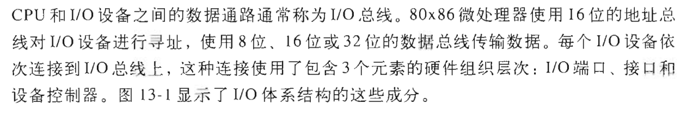
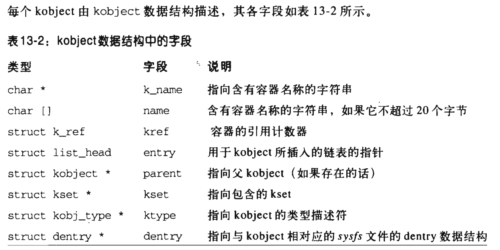
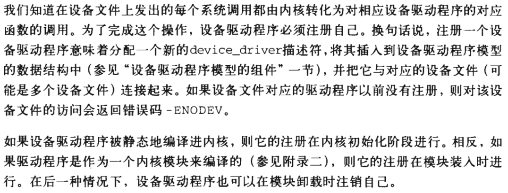
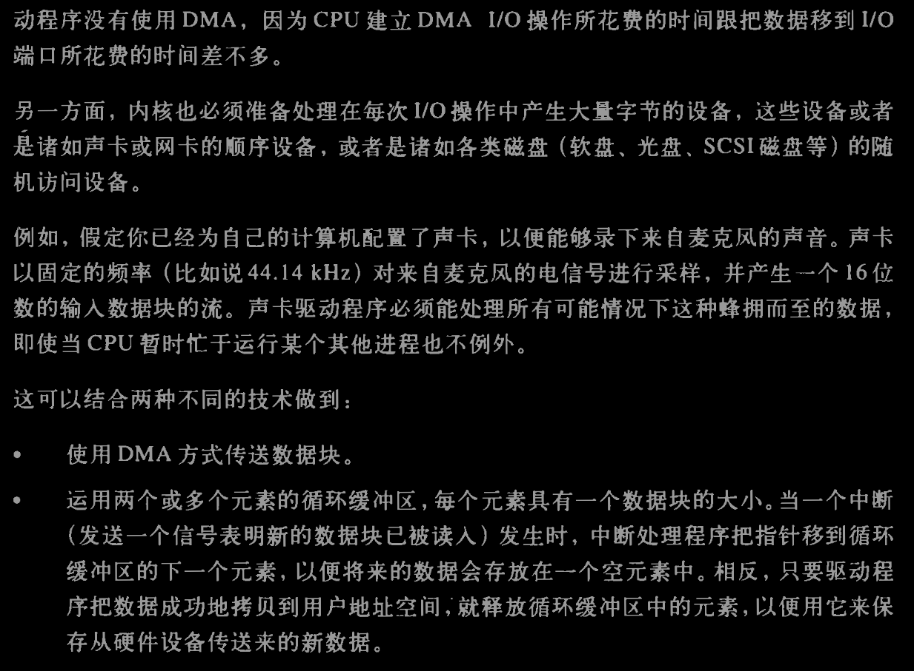

# 设备驱动程序代码占据内核总代码量的50%
# 十三章IO体系结构和设备驱动程序
## IO体系结构
- 计算机中同时存在几种不同的总线，他们被称为桥的硬件连接在一起
- 任何io设备仅能连接一条总线 
- 
- 
- 体系结构中三个主要的元素：io端口 io接口 设备控制器
### io端口
- 每个连接到io总线上的设备都有自己的io地址集，称之为io端口，***即io端口本质上是地址集合***
- ibm pc体系中io地址空间共提供65536个8位io端口
- ***存在专用汇编语句对io端口进行读写 in ins out outs***
- 执行此类指令时，cpu使用地址总线选择请求的io端口，使用数据总线在cpu寄存器和端口之间传送数据
- ***io端口可以被映射到物理空间，故处理器和io设备间的通讯可以使用内存操作汇编指令***
- io端口会被组织成一组专用寄存器 控制寄存器 状态寄存器 输入寄存器 输出寄存器
- 可以将同一个io端口用作不同目的
- 
- 
- 
- 访问io端口
  - in ins out outs可以访问io端口，且内核提供辅助函数简化访问
  - 
  - 
- 分配io端口
  - ***内核中使用 资源 来记录分配给每个硬件的io端口***
  - ***资源对应结构体 resource，资源被互斥地分配给设备驱动程序 ***
  - 一个资源表示io端口地址的一个范围，资源对应信息保存在resource数据结构中
  - 同种资源结构体通过其中保存的指针信息形成树形结构
  - 表示io端口地址范围的所有资源形成的树形结构的根节点为ioport_resource
  - 
  - 
  - 
  - 可以调用下述函数，从而在io端口资源树中插入新的资源数据结构体（即为执行设备分配新的资源）
    - 
    - ***当前分配给io设备的所有io地址的树都可以从/proc/ioports文件中获得***
### io接口
- 是一种处于io端口和设备控制器之间的硬件电路
- 翻译器作用，将io端口中的值转换为设备所需的命令和数据，同时检测设备状态，更新io端口的状态寄存器
- 该电路通过irq线连接到可编程中断控制器上，可以代表相应设备发起中断请求
- 
- 两种io接口类型：专用io接口 通用io接口
  - 
  - 
- 专用io接口
  - 
- 通用io接口
  - 
  - 
### 设备控制器
- 复杂的设备需要设备控制器进行驱动，主要功能为  
  - 
  - 将从io接口收到的高级命令转换为适当电信号，使得对应设备执行功能
  - 根据收到的设备电信号，修改io接口的状态寄存器

## 设备驱动程序模型
- pci总线对计算机外围硬件设备的内部设计提出要求，不同的硬件设备需要满足一些相同的功能，例如
  - 电源管理
  - 即插即用
  - 热插拔
  - 
- linux内核对系统中所有总线、设备、设备驱动程序提供了统一的视图，即统一的数据结构和辅助函数，该框架即为设备驱动程序模型
### sysfs文件系统
- 位于/sys目录下，与/proc类似，用于在用户模式下提供访问内核数据结构的一种文件系统
- sys还提供内核数据结构的附加信息，目标是提供设备驱动程序模型组件间的层次关系
- /sys目录结构如下
  - 
- /sys目录下各个子目录之间的关系可能存在符号链接的指向关系，/sys文件系统下普通文件主要作用是表示驱动程序和设备的属性
  - 
### kobject
- 是设备驱动程序模型的核心，与sysfs文件系统自然绑定，每个kobject对应sysfs文件系统的一个目录
  - 
- kobject被嵌入 容器 这一更大的对象中
  - 
### kobject kset subsystem
- kobject数据结构
  - 
  - 
- kset是同类型的kobject的集合体
  - 
  - 
- subsystem结构
  - 
  - 
- 设备驱动程序模型的层次
  - 
### 注册kobject kset subsystem
- 通过注册kobject kset subsystem，让对应节点出现在sysfs子树中
- sysfs文件系统中上层目录是已经注册的subsystem 
- kobject目录中的文件中包含属性数据
- 
- 

## 设备驱动程序模型的组件
- 相关组件包括总线、设备、设备驱动器等，每个组件有对应的结构体表示
### 设备
- 由device结构体（对象）进行表示
- 
- 
- 
- 
- 
### 驱动程序
- 驱动程序由device_driver对象（结构体）描述
- 
- 
- 
### 总线
- 总线由bus_type结构体（对象）描述
- 
- 
### 类
- 由class对象（结构体）描述
- 
- 
  

## 设备文件
- linux中一切皆文件，故可以将io设备当作设备文件这种特殊文件进行处理（注意网络设备例外，不对应文件）
  - 
- 两类设备文件：块设备、字符设备
  - 
- 设备文件 主设备号 次设备号
  - 设备文件对应的索引节点中指向磁盘上数据块的指针为空，索引节点中必须包含硬件设备的一个标识符，从而对应字符设备或块设备
  - 
- 创建设备文件 mknod函数，一般插入设备和驱动的内核模块后，均需要使用该mknod函数创建设备对应的设备文件，从而方便用户空间操作该设备文件
  - 
  - 
- 设备文件通常与硬件设备或硬件设备的某一物理或逻辑分区相对应，部分设备文件不与任何实际设备对应
- 设备文件名（路径）无关紧要，可以随意指定并创建
- 
### 设备文件用户态处理
- 早期主设备号 次设备号长度受限，导致设备号不够用了
  - 
  - 
- 现在主设备号编码长度为12位 次设备号编码长度为20位，实现相关宏可以将两个设备号组合或者拆分
  - 
### 动态分配设备号
- 每个设备驱动程序均会在注册阶段指定其将要处理的设备号范围
- 新的硬件设备驱动程序不需要从官方注册表中分配设备号，可以使用当前系统中空闲的设备号，此时无法永久创建设备文件，只能在设备驱动程序初始化一个主设备号和次设备号时才能创建
- 将驱动程序使用的主设备号和次设备号输出到用户空间
  - 即/sys/class子目录下的dev属性中存放主设备号和次设备号
- 
### 动态创建设备文件
- 操作系统初始化完毕后才会创建设备文件，初始状态下/dev目录为空，系统启动时udev工具扫描/sys/class子目录寻找dev文件并在/dev目录下创建设备文件
- 
- 
### 设备文件的VFS处理
- vfs在操作设备文件时，会将对和设备文件的每个系统调用转换为设备相关的函数调用，从而对硬件进行操作
- 在设备文件上所有发出的任何系统调用都将激活设备驱动程序的函数而不是基本文件系统的函数
- 
- 

## 设备驱动程序
- 设备驱动程序用于响应控制程序的编程接口，此类编程接口即vfs的规范函数集合(open read lseek ioctl等)，即针对设备文件使用此类函数，会调用对应的设备驱动程序
- 设备驱动程序中根据对用户态程序的支持水平不同，以及对来自硬件的数据的缓冲策略不同，导致设备驱动程序具有不同的内部结构，例如直接内存访问、字符设备缓冲策略等
- 使用设备驱动程序之前需要注册、初始化相关操作
- 
### 注册设备驱动程序
- 针对设备文件的系统调用会转换为对相应设备驱动程序对应函数的调用
- 注册一个设备驱动程序 即分配一个新的device_driver结构体，并将其插入设备驱动程序模型的数据结构中，并将其与指定设备文件或多个设备文件关联起来
- ***设备驱动程序被编译进内核中，则其注册在内核初始化阶段完成***
- ***驱动程序作为内核模块编译，则在模块装入时进行注册，在模块卸载时注销***
- 
- 
### 初始化设备驱动程序
- 设备驱动程序注册后，用户态程序通过相应的设备文件使用它
- 初始化设备驱动程序往往发生在设备被实际使用前的最后一刻，因为初始化驱动程序意味着分配系统资源，相关资源被分配后其他驱动程序就不可用了
- 
### 监控io操作
- io操作持续时间受多因素影响，进行io操作的驱动程序需要确定io操作何时被发起、终止、超时
- 监控io操作是否结束可以使用两种技术 轮询模式和中断模式
- 
- 轮询模式
  - cpu重复检查设备的状态寄存器，直到寄存器的值表明io操作已经完成
  - 若io操作时间较长，则该模式低效，因为cpu会浪费机器周期等待io操作完成
  - 
- 中断模式
  - io控制器通过irq线发出io操作结束的信号
  - 即设备主动发出中断信号以表示io操作完成，对应的驱动程序中需要包括中断处理程序来处理设备发起的中断
  - 设备何时发起中断信号取决于io操作何时完成，该时间长短不确定
  - 上述说明使用中断模式通知io操作结束的设备中除了要实现io相关处理函数，还要实现中断处理函数
  - 
  - 
  - 
  - 
### 访问io共享存储器
- 什么是io共享存储器，这一点不清楚，故该节未看懂
### 直接内存访问（DMA）
- 之前的体系结构中，cpu是系统中唯一的总线控制器，要提取ram中的值，一定需要通过cpu驱动地址总线和数据总线
- 新的体系结构中（例如PCI等现代总线体系）只要有合适的电路，每个外围设备均可以控制总线收发数据
- DMA传输过程中数据传送不需要cpu参与，io设备和DMA电路直接驱动数据总线
- 目前pc中包括DMA电路，用于控制ram和io设备之间的数据传送，若DMA被cpu激活，则可以自行传递数据，数据传输完毕后，dma发起一个中断请求
- 磁盘驱动器等需要一次传输大量字节的设备常使用DMA，传输数量很少的数据时使用cpu效率更高
- ***设备驱动程序以两种方式使用DMA：同步DMA和异步DMA ***
  - ***同步DMA数据传送由进程触发（例如声卡），异步DMA数据传送由硬件设备触发（例如网卡）***
    - 
- DMA传送辅助函数
  - 使用DMA的设备驱动程序中，相关代码应该与体系结构和总线无关，使用内核提供的DMA辅助函数即可实现该目标
  - 
- 总线地址
  - 即除了cpu之外的硬件设备驱动总线时所使用的存储器地址
  - 其他存储器地址：逻辑地址 线性地址 物理地址
  - DMA传输过程中数据传送不需要cpu参与，io设备和DMA电路直接驱动数据总线
  - DMA传输过程中，需要将缓冲区总线地址写入DMA的适当io端口，或写入io设备适当io端口
  - 80x86体系中，总线地址和物理地址是一致的，其他体系结构中则不一定
  - 不同总线的总线地址长度不同，导致能寻址的地址范围不同
  - linux中dma_addr_t代表通用的总线地址 pci_set_dma_mask和dma_set_mask 两个辅助函数用于检查总线是否可以接收给定大小的总线地址
  - 
  - 
- 高速缓存的一致性
  - 执行DMA操作时，需要考虑硬件高速缓存的一致性问题
  - 部分体系结构中，硬件高速缓存和dma之间的一致性是由硬件维护的，故驱动程序无需考虑一致性问题
  - 什么是一致性问题：驱动程序将数据填充到内存缓冲区中，立刻命令硬件设备利用dma传送方式读取该数据，若在dma访问物理ram内存单元时，相应硬件高速缓存行内容还未写到ram中，此时硬件设备通过dma读取到的就是ram中的旧值，产生了不一致问题
  - 驱动程序可以使用两种方法处理dma缓冲区，即存在下述两种DMA映射类型
    - 一致性dma映射
    - 流式dma映射
  - 
  - 
- 一致性dma映射的辅助函数
  - 提供了相关辅助函数用于分配内存缓冲区和创建一致性DMA映射
  - 
  - pci_alloc_consistent dma_alloc_coherent
  - pci_free_consistent dma_free_coherent
- 流式dma映射的辅助函数
  - 提供相应api和同步方法用于保证数据一致性
  - 
  - 
## 内核支持的级别 
- 内核对硬件设备的支持可以分为几个不同的程度
  - 内核不支持的硬件设备：应用程序只能使用in out等汇编指令与设备的io端口进行交互
    - x window系统对图形显示的传统处理使用此种内核支持级别
  - 内核在最小程度上支持硬件设备：内核不识别硬件设备，但可以识别io接口
    - 用于处理连接到通用io接口上的外部硬件设备，内核通过提供设备文件（及其设备驱动程序）来处理io接口
    - 串口和并口使用此种支持级别
    - 设备与内核要频繁交换数据时不能使用该方法
  - 内核扩展支持设备：内核识别硬件设备，并处理io接口本身
    - 直接连接到io总线的任何硬件设备都要使用内核扩展支持级别
- 标准的文件相关系统调用（例如read write）并不总能让应用程序完全控制设备，通过ioctl系统调用，可以让应用程序自由调用设备所支持的特殊命令
- 
- 
- 

## 字符设备驱动程序
- 比块设备驱动程序简单
- cdev结构体内容
- 
- 
- 
### 分配设备号
- 内核使用散列表chrdevs记录目前已经分配了哪些字符设备号
- 两种方法为字符设备驱动程序分配一个范围内的设备号
  - 新的设备驱动程序使用register_chrdev_region函数和alloc_chrdev_region函数为驱动程序分配任意范围内的设备号
  - 方法二使用register_chrdev，分配一个固定的设备号范围
- 
- 
- register_chrdev_region函数和alloc_chrdev_region函数
  - 
  - 
- register_chrdev 函数
  - 
### 访问字符设备驱动程序
- 
- 
### 字符设备的缓冲策略
- 当设备处理大量数据时，可以采用两种缓冲策略
  - 使用dma方式传输数据块
  - 维护一个循环缓冲区，缓冲区中每个元素均有一个数据块大小，中断发生时会将数据存储在循环缓冲区中的空元素中，当缓冲区元素中的数据成功拷贝到用户空间，则释放该缓冲区中的元素
- 
- 
- 

# 十四章块设备驱动程序
- 暂略，我们的分析目标是网络设备驱动程序

# 附录：模块
- 当组件需要对内核中静态链接的某个数据结构或函数进行修改时，需要将该组件包含在内核中静态链接，不能编译为模块
- 内核要确保内核的其他部分可以访问该模块的全局符号，故需要解决模块间的引用关系
- 内核要记录模块的引用情况，故要实现引用计数器
## 模块许可证
- 内核树中不支持并维护，只有二进制格式的模块
## 模块的实现
- 每个模块系统都会分配如下数据区
  - 
- 模块对应结构体module
  - 
  - 
  - 
  - 
  - 
## 模块使用计数器
- module对象中的ref字段表示对模块的引用计数
- 
## 导出符号
- 通过insmod，模块完成载入后，模块中引用的全局内核符号需要被替换为合适的内存地址
- 内核使用专门的内核符号表保存模块访问的符号及其地址，即内核会自己导出符号，从而被使用该符号的模块所引用，只有被模块实际引用的符号才会被包含在上述表中
- 通过在内核中增加EXPORT_SYMBOL_GPL宏，可以让内核导出其中任意一个符号
- 已经链接的模块可以导出自己的符号供其他模块访问
- 
- 
## 模块依赖
- module对象中modules_which_use_me字段用于表示当前模块被哪些模块所引用
- 
## 模块的连接和取消
- 使用insmod载入模块的详细执行流程
- 
- 
- 
- 
- 
## 根据需要链接模块
- 模块可以在系统需要时自动链接，之后可以自动删除
- modprobe程序用于自动链接模块
- depmod命令用于生成模块的依赖关系
- 内核可以调用request_module函数用于自动链接一个模块
- 
- 
- 
- 
- 