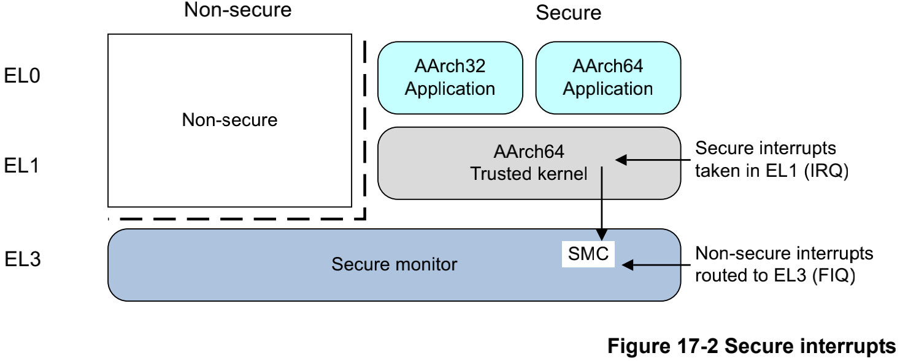

# 资料来源
- https://github.com/carloscn/blog/blob/master/optee_os/
- 也是通过阅读《手机安全和可信应用开发指南：TrustZone与OP-TEE技术详解》得到的笔记，其中部分内容直接摘抄自书籍，可以简单参考

- https://github.com/carloscn?tab=projects
  - tee linux内核等博客内容
  - 博客形式值得学习 直接通过issue方式提交博客文章
  - blog-master.zip 本地下载

# optee实现框架

# ARMv8中硬件架构体系下安全区域与非安全区域的区别

# armv7中安全世界与正常世界的切换
- 通过svc从ca进入ree或从ta进入tee，通过smc从安全世界或正常世界进入安全监控模式（Monitor）

# armv8中安全世界/正常世界切换到el3
- 注意均是通过smc命令进入监控模式，而正常世界接收并处理irq中断，安全世界接收fiq中断

# 必要/非必要 ARM安全扩展组件
- 必选组件：
  - AMBA3 AXI总线：安全机制基础设施。
  - ARMv8A Core El2：虚拟安全和非安全核。
  - TZASC(TrustZone Address Space Controller)：将内存分成多个区域，每个区域可以单独配置为安全或非安全区域。只能用于内存设备，不能用于块设备。
  - TZPC(TrustZone Protection Controller)：根据需要控制外设安全特性。
- 可选组件：
  - TZMA(TrusztZone Memory Adapter)：将片上RAM和ROM分成不同安全和非安全区域。
  - AXI-to-APB bridge：桥接APB总线，配合TZPC使APB总线外设支持TrustZone安全特性。

# tee能实现安全保护的根源
- 芯片级别的安全扩展组件会去校验CPU发送的访问请求的安全状态读写信号位（Non-secure bit，NS bit）是0还是1，以此来判定当前CPU发送的资源访问请求是安全请求还是非安全请求。
  - 而处于非安全状态的CPU将访问指令发送 到系统总线上时，其访问请求的安全状态读写信号位都会被强制设置成1，表示当前CPU的访问请求为非安全请求。
  - 而非安全请求试图去访问安全资源 时会被安全扩展组件认为是非法访问的，于是就禁止其访问安全资源，因此该CPU访问请求的返回结果要么是访问失败，要么就是返回无效结果，

# 配置arm芯片上的调试开关
- 调试和跟踪
  - 不同的用户有不同的调试需求，可以通过如下信号配置：
    - DBGEN：顶层调试总开关，控制所有状态调试。
    - SPIDEN：安全调试开关，控制安全状态调试。

- 三种使用场景：
  - 芯片开发人员：DBGEN=1和SPIDEN=1，完全外部调试功能。
  - OEM开发：DBGEN1但SPIDEN=0，仅可在非安全状态调试。
  - 产品发布：DBGEN0和SPIDEN=0，禁止安全和非安全调试。应用程序仍可调试。

# 环境搭建
- https://optee.readthedocs.io/en/latest/building/prerequisites.html

# optee启动过程中会使用到项目编译生成的二进制文件，针对此类启动用到的二进制文件，不同芯片厂有不同的文件格式，故存在不同的启动流程，根据optee qemu模拟过程中输出的启动日志，可以找到optee解析二进制文件，启动设备的流程

# armv7安全引导流程

# ARMv8安全引导过程 以及启动过程中各个镜像之间的跳转

# ATF启动的各个流程 一直到 optee镜像启动
- BootROM（EL3）: 加载ATF的bl1的二进制文件到flash（可能有对二进制格式的解析）、引导bl1
- ATF-bl1（EL3/S-EL1） : 初始化CPU、 设定异常向量、将bl2的镜像加载到安全RAM中，跳转到bl2
- ATF-bl2（EL3）: bl2镜像将为后续镜像的加载执行相关的初始化操作，主要是内存、MMU、串口以及EL3软件运行环境的设置，并且加载bl31/bl32/bl32的镜像到内存中。
- ATF-bl31（EL3）：在bl2中触发安全监控模式调用后会跳转到bl31中执行，bl31最主要的作用是建立EL3运行态的软件配置，在该阶段会完成各种类型的安全监控模式调用ID的注册和对应的ARM核状态的切换，bl31运行在EL3。
- ATF-bl32（S-EL1）：bl31中的runtime_svc_init函数会初始化OP-TEE对应的服务，通过调用该服务项的初始化函数来完成OP-TEE的启动。对于OP-TEE的服务项会通过DECLARE_RT_SVC宏在编译时被存放到rt_svc_des段中。该段中的init成员会被初始化成opteed_setup函数，由此开始进入到OP-TEE OS的启动。如图所示为ATF对于optee镜像启动的初始化过程
- 

# ca与ta进行交互
- 通过session进行通信，通过COMMAND确定执行对象，通过shared memory来进行大量的数据交换
- 

- ca与ta 建立来连接过程中各个api的对应关系
- 
（1）调用CA接口初始化context；
（2）打开session（此时CA已经向TA发送请求）
（3）初始化TEEC_PARAM_TYPES 初始化参数和缓存使用invokeCommand向TA发送命令；
（4）关闭session；
（5）释放资源，返回结果给REE。

# 两种smc指令 fast smc 和 std smc
- 关于fast smc和 std smc（参考资料：https://github.com/carloscn/blog/blob/master/optee_os/08_OPTEE-OS_%E7%B3%BB%E7%BB%9F%E9%9B%86%E6%88%90%E4%B9%8B%EF%BC%88%E5%85%AD%EF%BC%89TEE%E7%9A%84%E9%A9%B1%E5%8A%A8.md#user-content-fn-3-5157c3626c741a07d3c936e71e14f37e）
  - 在Two types of calls are defined:
  - Fast Calls used to execute atomic Secure operations. (原子的安全操作)
  - Standard Calls used to start pre-emptible Secure operations. （可抢占的安全操作）
  - 在OP-TEE驱动的挂载过程中会使用fast smc的方式从OP-TEE中获取到相关数据，从而实现版本相关检查

# TEE的安全基础-- TrustZone
- TrustZone提供了一些基础的安全能力，基于这些安全能力，上层可以构建不同的安全机制，比如说TEE、Secure Boot等。其中，将内存分为安全内存和非安全内存是TrustZone的一项重要特性，其主要目的包括：
  - 隔离敏感数据： TrustZone允许将敏感数据存储在安全内存中，而将非敏感数据存储在非安全内存中。这样，敏感数据在处理器的安全区域内受到保护，不容易被恶意软件或非授权的应用程序访问和泄露。
  - 执行安全代码： 安全内存还用于存储安全性相关的代码，如加密和认证算法，以及安全启动代码。这些代码在非安全内存中不可见，从而提供了一种方式来执行和保护安全关键操作。
  - 隔离不受信任的应用： 非安全内存用于存储不受信任的应用程序和操作系统组件。TrustZone通过硬件隔离确保这些应用程序和组件无法直接访问安全内存中的敏感数据或安全代码。
  - 防止侧信道攻击： 通过将安全内存隔离，TrustZone有助于防止侧信道攻击，如缓存侧信道攻击和时序侧信道攻击，因为非安全的应用程序无法直接观察或干扰安全内存中的操作。
  - 提供硬件支持： TrustZone利用ARM处理器的硬件支持，确保内存分区的强制执行。这是硬件级别的隔离，不容易被绕过。

# TrustZone的安全世界和非安全世界的切换
- ARMv8权限的分配划分为四个异常等级（Exception Level，EL）,分别是EL0、EL1、EL2和EL3。
  - 

- 异常等级只有在以下几种情况下才会变更
  - 产生异常
  - 从异常返回
  - 处理器复位
  - 在debug状态
  - 从debug状态返回

- 在ARMv8中，TrustZone把运行世界划分为了安全和非安全两个状态，结合ARMv8的异常等级来看的话，可以用下图来描述：
  - 

- 在EL0、EL1和EL2处理器可能是安全状态，也可能是非安全状态，状态的确定由SCR_EL3这个bit决定，我们可以用NS表示非安全状态(Non-Secure)，而安全状态则由S表示，比如：
  - NS.EL1：非安全状态的异常等级1
  - S.EL1：安全状态的异常等级

- ***SCR_EL3.NS是一个bit，这个bit只能由EL3来变更***因此，只要保证从非安全世界的EL1或者EL2进入EL3的方式安全，也就能保证安全世界是安全的，而不是非法进入的或者是非法篡改的。为简化介绍，我们这里不考虑hypervisor的机制，只看非安全世界只有一个Rich OS的情况。
  - 

- 从非安全世界进入安全世界的步骤可以拆分为三个步骤：
  - APP通过产生异常来进入更高等级的异常等级，产生的异常一般是FIQ或者是调用SMC产生异常，从而从EL1进入EL3
  - 进入EL3后，由运行在EL3的Firmware/Secure Monitor变更SCR_EL3.NS，从1到0
  - 从异常返回时，由于SCR_EL3.NS为0，因此返回的是安全世界的EL1

## 安全世界和非安全世界切换过程中的寄存器
- 在从非安全世界切换到非安全世界时，还涉及了寄存器的管理。对于通用寄存器以及大多数系统寄存器，不区分安全世界，只有一份，因此必须由软件去管理这些寄存器的备份和恢复，这不是由硬件去保证的。图中的EL3中的Secure Monitor就是负责在安全世界和非安全世界切换时来备份和恢复这些寄存器，他的动作主要有：

- 从非安全世界进入安全世界时
  - 变更SCR_EL3.NS为0
  - 保存非安全世界的寄存器状态
  - 恢复安全世界的寄存器状态

- 从安全世界进入非安全世界时，正好相反
  - 变更SCR_EL3.NS为1
  - 保存安全世界的寄存器状态
  - 恢复非安全世界的寄存器状态

- 有一小部分的寄存器由安全状态存储，也就是说系统中将存储两份这些寄存器的值，CPU自动使用属于当前状态的寄存器值。
  - 比如说ICC_BPR1_EL1，一个用于控制中断抢占的GIC寄存器。
  - 当系统寄存器被存储时，可以通过用(S)和(NS)来标识使用哪个寄存器，例如：ICC_BPR1_EL1(S) 和 ICC_BPR1_EL1(NS) 。

## 安全世界和非安全世界 内存映射
- 概要
  - 安全世界和非安全世界各自有 独立的虚拟地址映射为物理地址的机制
  - 安全世界和非安全世界 各自有独立的物理地址空间范围
  - 非安全世界的虚拟地址只能映射到非安全世界物理地址
  - 安全世界的虚拟地址能映射到安全世界或非安全的物理地址

- 对于安全世界和非安全世界，系统提供了两种不同的内存映射原理：
  - 

- 在获取虚拟内存地址时，根据地址的不同，分别从不同的内存映射机制进行地址映射：
  - NS.EL1: 0x7000 -- 映射到非安全世界的0x7000虚拟地址
  - S.EL1: 0x7000 -- 映射到安全世界的0x7000虚拟地址

- 安全世界和非安全世界有着两套独立的虚拟地址空间，相同的地址并不能跨世界访问，而只能访问当前状态下的虚拟地址。
- 虚拟地址隔离还不够，物理地址也要隔离。
- 在TrustZone的架构中，物理地址同样提供了两套物理地址空间：安全世界的和非安全的。
  - 当在非安全世界时，虚地址总是会映射到非安全世界的物理地址空间，这也就保证了处于非安全世界的软件只能访问非安全世界的资源，绝不可能访问安全世界的资源。
    - 
  - 当处于安全世界时，软件既可以访问安全世界的物理地址空间，也可以访问非安全世界的物理地址空间，这时候的NS bit的作用就是判断虚拟地址是映射到非安全世界的物理地址空间还是安全世界的物理地址空间
    - 

# 安全存储相关概念
- TEE的Secure Storage有两种实现方法：
  - 一种是基于REE的普通文件系统来实现，
  - 一种则是基于eMMC的RPMB(Replay Protected Memory Block)分区来实现。
  - 在OP-TEE的规范中，是可以同时使用REE的文件系统和eMMC的RPMB分区作为secure storage的物理存储介质的。
  - 使用REE的文件系统作为secure storage的存储介质，那么可以将TEE对该文件系统的访问简要概括为以下模型：
    - 
    - 当TEE侧的TA需要写入Secure Storage的数据时，
      - TA通过GP的Trusted Storage API去访问TEE的文件操作接口
      - TEE文件系统会使用密钥去加密要写入的数据
      - 通过REE的文件操作接口去对REE的文件系统进行写入
      - 读取过程则是一个相反的过程。

- 安全存储（GP Trusted Storage）要满足的要求，TEE的secure storage也应遵守下述要求。
  - Trusted storage可以由非安全资源实现，只要应用适当的密码学保护措施，密码学措施的强度应该至少和TEE的代码和数据具有相同强度
  - ***Trusted storage必须只允许被授权的TA访问和修改***
  - TA有能力隐藏用于加密数据的秘钥材料
  - 每个TA都有能力访问自己的存储空间，同时也能满足隔绝于其他TA的访问的需求

## 安全存储密钥管理
- TA是唯一有权限读写安全存储文件的对象
- TEE在写数据时需要将数据加密后再写入REE的文件系统中，而读取时需要将从REE文件系统读到的数据进行解密才能由TEE访问。
- Key manager在负责上述过程中数据的加解密和秘钥的管理。
- 在TEE中，Key manager主要管理三种密钥：
  - Secure Storage Key(SSK)
  - TA Storage Key(TSK)
  - File Encryption Key(FEK)
- TEE如何做到每个设备、每个TA、甚至每个文件都能独立安全存储，关键就在于这三个秘钥的生成和管理。

- SSK是设备唯一的秘钥，它在TEE启动过程中生成，并存储在安全内存中，因此能确保它的安全性。SSK用于生成TSK。SSK的生成可以用下面的公式来表达：
  - SSK = HMACSHA256 (HUK, Chip ID || “static string”)

- TSK是一个TA唯一的密钥，也就是说每个TA都有一个自己唯一的TSK，TSK的目的是用来保护FEK，这也就确保了每个TA都只能访问自己的数据，而无法跨域访问其他TA的数据。TSK的生成依赖于SSK和TA的识别码UUID
  - TSK = HMACSHA256 (SSK, TA_UUID)

- FEK：当一个新的TEE文件被创建时，Key manager就会立即生成一个FEK，FEK的生成是直接采用PRNG(Pesudo Random Number Generator)生成的。这个FEK会被存储在文件对应的meta文件中，以后就用来对该文件进行加解密，TEE的文件信息也会使用这个FEK加密存储在meta文件中。

## TEE的安全能力和FUSE的安全能力对比
- 参考资料：https://github.com/carloscn/blog/blob/master/optee_os/17_OPTEE-OS_%E5%BA%94%E7%94%A8%E4%B9%8B%EF%BC%88%E4%BA%8C%EF%BC%89%E5%AF%86%E7%A0%81%E5%AD%A6%E7%AE%97%E6%B3%95%E5%92%8C%E5%AE%89%E5%85%A8%E5%AD%98%E5%82%A8.md
- 两者理论上不是可以对比的对象， 因为各自负责的领域不同，FUSE一般用于一些不可变配置以及secure boot的公钥哈希存储等场景，TEE如其名，为系统提供可信的执行环境。但是，在数据的存储上，两者都有共同点：都能提供完整性数据的存储服务。

- FUSE提供的完整性数据存储更多的是对于不可变数据的存储，但是由于FUSE的容量限制，一般只存储对应的哈希值，比如：公钥哈希、证书哈希等。但是有一点需要注意，FUSE属于是一次性刷写设备（OTP，One Time Programmable device）,因此对于需要更新的数据，不应存储在FUSE。

- TEE的安全存储能力依赖于TrustZone技术，不仅可以提供完整性保护，同时提供了机密性数据的存储能力，相比于FUSE，TEE提供的完整性保护服务同时支持授权的更新行为。并且，所有支持TrustZone技术的芯片，都能支持secure storage的能力，相比之下，使用FUSE是严格依赖于芯片的FUSE容量，不同芯片的FUSE容量不一致，甚至有些芯片没有FUSE。

- 总结而言：
  - FUSE可以提供硬件级别的完整性保护，但因硬件性质，不可更新且空间小
  - TEE不仅可以提供完整性保护，还可以提供机密性保护。这个能力是由硬件机制TrustZone提供的，空间相比FUSE较大