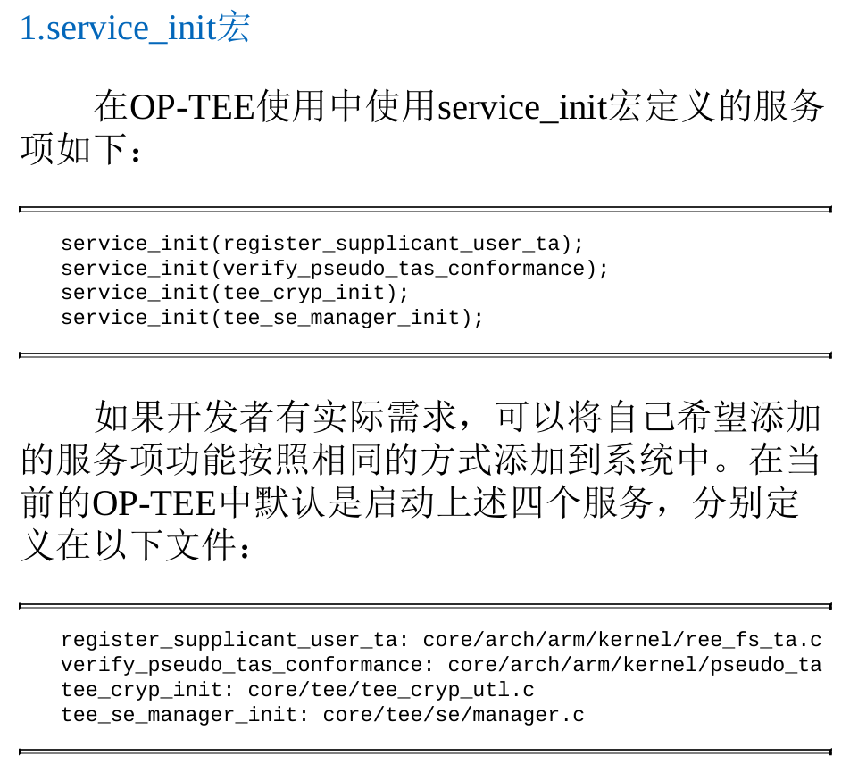
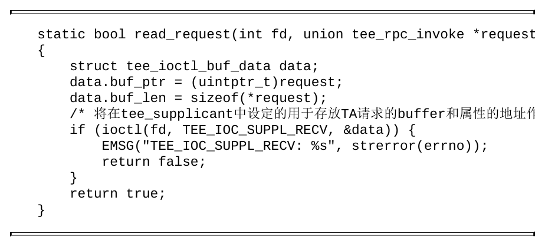
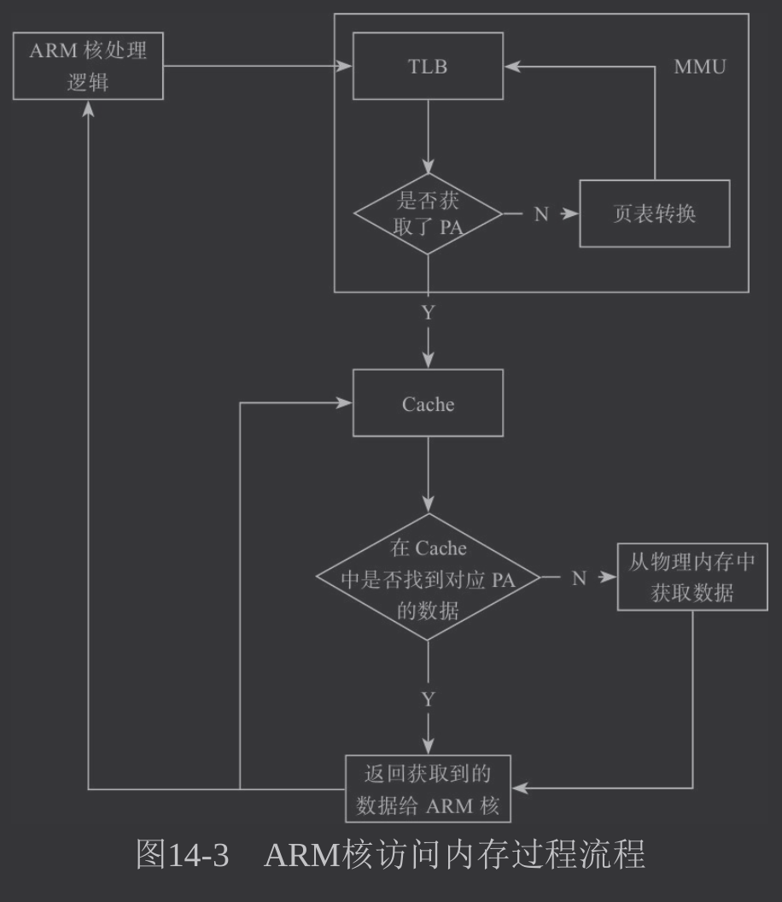
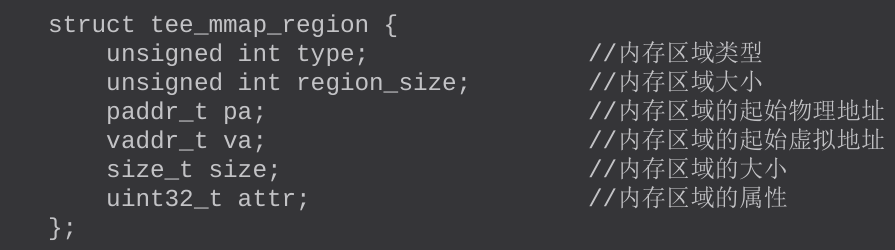

# readme
- 以《手机安全和可信应用开发指南：TrustZone与OP-TEE技术详解一书》为基础框架，补充其他资料，尽量完善知识架构
- 部分内容摘抄自原文，部分自己总结
- 根据章节内容分割，去学习源码
- 总结全书内容耗时较久，需要提升效率
- 部分内容结合下述资料进行补充
  - https://github.com/carloscn/blog/blob/master/optee_os/18_OPTEE-OS_%E5%BA%94%E7%94%A8%E4%B9%8B%EF%BC%88%E4%B8%89%EF%BC%89%E5%8F%AF%E4%BF%A1%E5%BA%94%E7%94%A8%E7%9A%84%E5%BC%80%E5%8F%91.md

# 前言
- 系统的安全是环环相扣的信任链，从设备开机的安全引导到安全操作系统的安全性验证，一直到软件开发者开发的软件安全性验证，每层相扣，而可信执行环境为可信应用提供了一个基础且可信任的执行环境。
- 生物识别算法中从摄像头获取图像到识别演算的整个过程都会在TEE中完成
- TEE环境的提供商也越来越多，从先前国外的Trustonic TEE、高通QSEE到现在国内的豆荚、华为、瓶钵等
- 本书的主要代码均引用自GitHub上OP-TEE开源项目的源代码（链接：https://github.com/OPTEE/optee_os）
- TEE也有详细的文档资料（https://github.com/OPTEE/optee_os/tree/master/documentation），

# 第1章　可信执行环境
- TEE的关键：在系统中提供一个相对可信赖的运行环境，使用户的关键数据或应用在这个相对可信赖的环境中使用和运行，以此保护用户的信息安全
- ARM从ARMv6的架构开始引入了TrustZone技术。
- TrustZone技术将中央处理器（Central Processing Unit，CPU）的工作状态分为了正常世界状态（Normal World Status，NWS）和安全世界状态（Secure World Status，SWS）。
- 支持TrustZone技术的芯片提供了对外围硬件资源的硬件级别的保护和安全隔离。当CPU处于正常世界状态时，任何应用都无法访问安全硬件设备，也无法访问属于安全世界状态下的内存、缓存（Cache）以及其他外围安全硬件设备
- 一般操作系统与应用程序运行在 ree中 可信操作系统以及应用运行在tee中
- 对CPU的工作状态区分之后，处于正常世界状态中的Linux即使被root也无法访问安全世界状态中的任何资源，包括操作安全设备、访问安全内存数据、获取缓存数据等。
- 因为CPU在访问安全设备或者安全内存地址空间时，芯片级别的安全扩展组件会去校验CPU发送的访问请求的安全状态读写信号位（Non-secure bit，NS bit）是0还是1，以此来判定当前CPU发送的资源访问请求是安全请求还是非安全请求。
  - 处于非安全状态的CPU将访问指令发送到系统总线上时，其访问请求的安全状态读写信号位都会被强制设置成1，表示当前CPU的访问请求为非安全请求。而非安全请求试图去访问安全资源时会被安全扩展组件认为是非法访问的，于是就禁止其访问安全资源，

- cpu访问安全设备或安全内存地址空间时，相关访问指令会被芯片的安全扩展组件验证，验证该访问指令的安全读写信号位是0或1，当cpu处于非安全状态时，其发送的指令该信号为为1，故无法通过安全扩展组件的验证

- 在真实环境中，可以将用户的敏感数据保存到TEE中，并由可信应用（Trusted Application，TA）使用重要算法和处理逻辑来完成对数据的处理。当需要使用用户的敏感数据做身份验证时，则通过在REE侧定义具体的请求编号（IDentity，ID）从TEE侧获取验证结果，tee对ree来说就是黑箱
  
## tee解决方案的组成
- 正常世界状态的客户端应用（Client Application，CA）
- 安全世界状态的可信应用（TA）
- 可信硬件驱动（Secure Driver，SD）
- 可信内核系统（Trusted Execution Environment Operation System，TEE OS）

- 使用ARM架构设计的不同CPU，TEE的配置完全不一样。国内外针对不同领域的CPU也具有不同的TEE解决方案。

- 遵循GP（Global Platform）去实现相同的teeos api，从而保证开发的ta可以运行在不同的teeos上

- GP规范规定了TEE解决方案的架构以及供TA开发使用的API原型，开发者可以使用这些规定的API开发实际的TA并能使其正常运行于不同的TEE解决方案中

## 手机制造商和芯片厂商和主流tee解决方案
- 

- 各家TEE解决方案的内部操作系统的逻辑会不一样，但都能提供GP规范规定的API，对于二级厂商或TA开发人员来说接口都是统一的。

- 华为海思的安全操作系统（Secure Operating System，Secure OS）是按照GP规范自主研发的TEE解决方案，其手机芯片和智能电视芯片都是使用这个TEE方案。

- 华为海思的TEE增加了权限校验功能（类似于白名单机制），即ca调用ta中的功能时，需要将调用该TA对应的CA接口的进程或者服务的相关信息提前注册到TEE后方能正常使用，否则会导致调用失败

- 大疆无人机已经使用TEE方案来保护无人机用户的私人数据、航拍数据以及关键的飞控算法。

# 第2章　ARM的TrustZone技术
- 为提高系统的安全性，ARM早在ARMv6架构中就引入了TrustZone技术[1]，且在ARMv7和ARMv8中得到增强

## soc硬件框架
- 一个完整的片上系统（System on Chip，SoC）由ARM核、系统总线、片上RAM、片上ROM以及其他外围设备组件构成。只有支持TrustZone技术的ARM核配合安全扩展组件，才能为整个系统提供芯片硬件级别的保护和隔离

- 支持TrustZone技术的ARM核在运行时将工作状态划分为两种：安全状态和非安全状态。
  - 当处理器核处于安全状态时只能运行TEE侧的代码，且具有REE侧地址空间的访问权限。
  - 当处理器核处于非安全状态时只能运行REE侧的代码，且只能通过事先定义好的客户端接口来获取TEE侧中特定的数据和调用特定的功能。

- 系统通过调用安全监控模式调用（secure monitor call，smc）指令实现ARM核的安全状态与非安全状态之间的切换。

- ARM核对系统资源的访问请求是否合法，则由SoC上的安全组件通过判定ARM核发送到 ***SoC系统总线*** 上的访问请求中的安全状态读写
信号位（Non-secure bit，NS bit）来决定。只有当ARM核处于安全状态（NS bit=0）时发送到系统总线上的读写操作才会被识别为安全读写操作，对应TEE侧的数据资源才能被访问
  - 安全组件 会判断 arm核 发送到 系统总线 的访问命令中的安全状态读写信号位 
    - 为0 即安全状态 运行tee

- SoC硬件框图
  - 

## ARMv7架构中使用了TrustZone技术的系统软件层面的框图
- 
- 分为8层特权级别，但总体可以分为 PL0 PL1 PL2
- PL0（USR）、PL1（FIQ/IRQ、SYS、ABT、SVC、UND和MON）、PL2（Hyp）
- ARMv7架构在原有七种模式(USR、FIQ、IRQ、SYS、ABT、SVC、UND)之上扩展出了Monitor模式和Hyp模式
- Hyp模式是ARM核用于实现虚拟化技术的一种模式。
- 系统只有在Monitor模式下才能实现安全状态和非安全状态的切换。
- 系统执行smc（安全监控模式调用）指令进入Monitor模式，通过判定系统SCR寄存器中对应的值来确定请求来源与发送目标中哪个是ree，哪个是tee
- ***注意ree进入tee需要用smc请求，而tee进入ree也需要smc请求***

## ARMv8架构的TrustZone技术
- 使用EL0～EL3来定义ARM核的运行等级，EL0～EL2等级分为安全态和非安全态。
- ARMv8架构与ARMv7架构中ARM核运行权限的对应关系
  - 
- ARMv7和ARMv8架构下特权等级和工作模式的对应关系
  - 

- ARMv8架构同样也是使用安全监控模式调用指令(smc指令)使处理器进入EL3，在EL3中运行的代码负责处理器安全状态和非安全状态的切换，其中关于TEE和REE切换的处理方式与ARMv7架构中Monitor模式下的处理方式类似

- 参考 ：https://github.com/carloscn/blog/blob/master/optee_os/17_OPTEE-OS_%E5%BA%94%E7%94%A8%E4%B9%8B%EF%BC%88%E4%BA%8C%EF%BC%89%E5%AF%86%E7%A0%81%E5%AD%A6%E7%AE%97%E6%B3%95%E5%92%8C%E5%AE%89%E5%85%A8%E5%AD%98%E5%82%A8.md

- armv8存在 EL0～EL3 四个运行等级，存在两种世界（安全世界非安全世界），存在四种程序（ca ta reeos teeos）这些概念的关系如下
  - 
  - REE OS: 在非安全 EL1 运行
  - TEE OS: 在安全 EL1 运行
  - CA: 在 REE 侧的用户空间运行，属于非安全 EL0
  - TA: 在 TEE OS 的用户空间运行，属于安全 EL0

- ARMv8 架构使用四个异常级别（EL）来定义处理器运行的特权等级，从 EL0 到 EL3，特权等级递增
- EL0 是最低的特权等级，用于运行用户应用程序，例如 Android 系统和 CA
- EL1 是比 EL0 更高的特权等级，用于运行操作系统内核，例如 Linux 内核和 TEE OS
- 安全世界和非安全世界都可以在 EL0 和 EL1 运行
- TEE OS 和 TA 运行在安全世界中，而 REE OS 和 CA 运行在非安全世界中


## ARM安全扩展组件
- TrustZone技术之所以能提高系统的安全性，是因为对外部资源和内存资源的硬件隔离。
  - 中断隔离、
  - 片上RAM和ROM的隔离、
  - 片外RAM和ROM的隔离、
  - 外围设备的硬件隔离、
  - 外部RAM和ROM的隔离等
  
- 为实现上述隔离，需要系统和处理器进行扩展，具体包括
  - 处理器虚拟化（分为安全态和非安全态）
  - 扩展总线，增加安全位读写信号线
  - 扩展内存管理单元（MMU）增加页表安全位置
  - 扩展缓存，增加安全位
  - 对其他外围组件进行了相应的扩展，提供安全操作权限控制和安全操作信号

### AXI总线上安全状态位的扩展
- ***总线上针对读和写信道各增加一个控制位，用于表示当前cpu处于安全世界或非安全世界***
- ARM对先进可扩展接口（Advanced eXtensible Interface，AXI）系统总线进行了扩展。在原有AXI总线基础上对每一个读写信道增加了一个额外的控制信号位，用来表示当前的读写操作是安全操作还是非安全操作，该信号位称为安全状态位（NS bit）或者非安全状态位（Non-Secure bit）。
  - 即安全状态位的实现是基于总线的扩展
- 安全读和安全写的两种信号位
  - AWPROT[1]：总线写事务——低位表示安全写事务操作，高位表示非安全写事务操作。
  - ARPROT[1]：总线读事务——低位（低电平）表示安全读事务操作，高位（高电平）表示非安全读事务操作。
- 主设备和从设备通讯时，必须将 PROT信号 发送到总线上，总设备或从设备必须解码该信号
- 所有的非安全主设备必须将安全状态位置成高位，从设备解析到该高位时，会触发一个错误操作，这样就能够保证非安全主设备无法访问到安全从设备。
- 至于上述错误如何处理就依赖于从设备的处理逻辑和总线的配置。通常这种非法操作最终将产生一个SLVERR（slave error）或者DECERR（decode error）4

### AXI-to-APB桥的作用
- TrustZone同样能够保护外围设备的安全，例如中断控制、时钟、I/O设备
- 实现的功能场景是 存在安全的中断控制器和安全时钟，而非安全的任务可以访问前两者从而提供可靠时钟和可靠的中断处理（比如在安全输入场景下）
- 外设总线（Advanced PeripheralBus，APB）
- APB通过AXI-to-APB桥连接到系统总线上。而APB总线并不具有安全状态位，
- APB与非安全外设相连，同时也连接AXI-to-APB桥，从而将非安全外设引入整个系统总线，为实现APB外设与TrustZone技术相兼容，APB-to-AXI桥将负责管理APB总线上设备的安全。APB-to-AXI桥会拒绝不匹配的安全事务设置，并且不会将该事务请求发送给外设 

### TrustZone地址空间控制组件
- TrustZone地址空间控制组件（TrustZone Address Space Controller，TZASC）
- TZAS是AXI总线上的一个主设备，TZASC能够将从设备全部的地址空间分割成一系列的不同地址范围。
- 在安全状态下，通过编程TZASC能够将这一系列分割后的地址区域设定成安全空间或者是非安全空间。被配置成安全属性的区域将会拒绝非安全的访问请求
- ARM的动态内存控制器（Dynamic Memory Controller，DMC）并不支持安全和非安全分区的功能。如果将DMC接到TZASC上，就能实现DRAM支持安全区域和非安全区域访问的功能。需要注意的是，TZASC组件只支持存储映射设备对安全和非安全区域的划分与扩展，但不支持对块设备（如EMMC、NAND flash等）的安全和非安全区域的划分与扩展
  - ***即该组件用于和arm原有的内存控制器结合，实现将内存划分为安全区和非安全区***
- 将该组件接入系统
- 


### TrustZone内存适配器组件
- TrustZone内存适配器组件（TrustZone MemoryAdapter，TZMA）
- 用于针对片上静态ram或rom进行安全/非安全区域的划分
  - 
- 当处理器核访问片上RAM或者ROM时，TZMA会判定访问请求的PROT信号是安全操作还是非安全操作，如果处理器发出的请求为非安全请求而该请求又尝试去访问安全区域时，TZMA就会认为该请求为非法请求。这样就能实现片上RAM和ROM的隔离

### TrustZone保护控制器组件（TrustZoneProtection Controller，TZPC）
- 该组件用来设定TZPCDECPROT信号和TZPCROSIZE等相关控制信号的。
  - TZPCDECPROT信号用来告知APB-to-AXI对应的外设是安全设备还是非安全设备 即该组件会与APB-to-AXI桥相连
    - TZPC包含三组通用寄存器TZPCDECPROT[2：0]，每组通用寄存器可以产生8种TZPCDECPROT信号，也就是TZPC最多可以将24个外设设定成安全外设
  - TZPCROSIZE信号用来控制TZMA对片上RAM或片上ROM安全区域大小的划分。
    - TZPC组件还包含一个TZPCROSIZE寄存器，该寄存器用来为TZMA提供分区大小信息

- 当上电初始化时，TZPC的TZPCDECPROT寄存器中的位会被清零，同时TZPCR0SIZE寄存器会被设置成0x200，表示接入到TZMA上的片上RAM或者ROM的安全区域大小为2MB。通过修改TZPC的寄存器配置的值可实现用户对资源的特定配置

- 

- TZPC组件主要有两个作用，
  - 一是为TZMA提供安全区域大小配置信号，用于TZMA来配置片上SRAM、ROM安全区域的大小，
  - 一个作用是接入到AXI-to-APB总线上，为外部设备提供安全信号，将某个外部设备配置成安全设备

### TrustZone中断控制器组件  用于实现在非安全状态下对安全中断的隔离
- 在支持TrustZone的SoC上，ARM添加了TrustZone中断控制器（TrustZone Interrupt Controller，TZIC）[1]。
- TZIC的作用是让处理器处于非安全态时无法捕获到安全中断。
- TZIC是第一级中断控制器，所有的中断源都需要接到TZIC上。
- TZIC根据配置来判定产生的中断类型，然后决定
  - 是将该中断信号先发送到非安全的向量中断控制器（Vector Interrupt Controller，VIC）后以nIRQ信号发送到处理器，
  - 还是以nTZICFIQ信号直接发送到处理器。
- 
- 通过对TZIC的相关寄存器进行编程，可对TZIC进行配置并设定每个接入到TZIC的中断源的中断类型。
- 在TZIC中用来设置中断源类型的寄存器为TZICIntSelect，
  - 如果TZICIntSelect中的某一位被设置成1，则该相应的中断源请求会被设置成快速中断请求（Fast Interrupt Request，FIQ）。
  - 如果某一位被设置成0，则该中断源的中断请求会被交给VIC进行处理。如果VIC的IntSelect将获取到的中断源设置成FIQ，那么该中断源会被再次反馈给TZIC进行处理

### Cache和MMU的扩展
- 在支持TrustZone的SoC上，会对MMU进行虚拟化，使得寄存器TTBR0、TTBR1、TTBCR在安全状态和非安全状态下是相互隔离的， 
  - ***因此两种状态下的虚拟地址转换表是独立的***
- 存放在MMU中的每一条页表描述符都会包含一个安全状态位，用以表示被映射的内存是属于安全内存还是非安全内存
- 虚拟化的MMU共享转换监测缓冲区（Translation Lookaside Buffer，TLB），同样TLB中的每一项也会打上安全状态位标记，只不过该标记是用来表示该条转换是正常世界状态转化的还是安全世界状态转化的
  - 即虚拟化mmu共享TLB
- Cache也同样进行了扩展，Cache中的每一项都会按照安全状态和非安全状态打上对应的标签，在不同的状态下，处理器只能使用对应状态下的Cache。

- ARM核支持TrustZone后，对MMU、TLB、Cache都做了相应的扩展
  - MMU的页表中增加了一个安全状态位用来表示该地址映射是安全内存还是非安全内存的映射。
  - 对TLB中的虚拟地址和物理地址部分也都做了扩展，虚拟地址部分增加了NSTID位，物理地址部分增加了安全状态位，用于表示该虚拟地址和物理地址是安全内存还是非安全内存。
  - 对Cache的扩展也增加了安全状态位，用于表示该条Cache是ARM核在安全世界状态时访问产生的还是在正常世界状态时访问产生的，

## TrustZone技术对资源隔离的实现
- ARM处理器核的虚拟化和资源隔离是TrustZone实现安全需求的根本。
- 即通过虚拟化，将物理核分为安全和非安全状态

### 针对中断源的隔离
- 通过TrustZone中断控制器组件 即TZIC实现
- 


### 片上RAM和片上ROM的隔离
- 用TZMA和TZPC组件实现
- TrustZone保护控制器组件（TrustZoneProtection Controller，TZPC）
- TrustZone内存适配器组件（TrustZone MemoryAdapter，TZMA）
- 当处理器核访问片上RAM或者ROM时，TZMA会判定访问请求的PROT信号是安全操作还是非安全操作，如果处理器发出的请求为非安全请求而该请求又尝试去访问安全区域时，TZMA就会认为该请求为非法请求。这样就能实现片上RAM和ROM的隔离
- 

### 片外DRAM的隔离
- 对片外RAM的隔离是通过TZASC组件实现的，
- TrustZone地址空间控制组件（TrustZone Address Space Controller，TZASC）
- ARM本身的DMC可以将DRAM分割成不同的区域，这些区域是没有安全和非安全分类。将DMC与TZASC相连后再挂到总线上，通过对TZASC组件进行编程可以将DRAM划分成安全区域和非安全区域
- ‘

### 外围设备的隔离
- AXI-to-APB桥+TZPC组件的TZPCDECROT的值(判断设备是安全/非安全设备)+PROT信号（用于判断处理器是否为安全/非安全状态） 来实现隔离，即判断对指定外设的访问是否有效
- 


## 总结：TrustZone对系统实现了硬件隔离，将系统资源划分成安全和非安全两种类型，同时在系统总线上增加安全读写信号位，通过读取安全读写信号位电平来确定当前处理器的工作状态，从而判断是否具有该资源的访问权限。因此，TrustZone从硬件级别实现了对系统资源的保护。

# 第3章 ARM可信固件
- 在armv8中被引入，armv7中不存在
- ARM可信任固件（ARM Trusted Firmware，ATF）是由ARM官方提供的底层固件

- ATF:统一了ARM底层接口标准，使得arm底层操作可以重用与移植，相关接口包括  
  - 电源状态控制接口（Power Status Control Interface，PSCI）、
  - 安全启动需求（Trusted Board Boot Requirements，TBBR）、
  - 安全世界状态（SWS）与正常世界状态（NWS）切换的安全监控模式调用（secure monitor call，smc）操作等

## ATF主要功能
- ATF的源代码共分为bl1、bl2、bl31、bl32、bl33部分，
  - 其中bl1、bl2、bl31部分属于固定的固件，
  - bl32和bl33分别用于加载TEE OS和REE侧的镜像

- ATF主要完成的功能
  - 初始化安全世界配置
  - 初始化通用中断寄存器
  - 初始安全扩展组件基本配置
  - 实现smc请求的处理逻辑
  - 实现可信启动，在引导启动过程中对镜像进行签名检查
  - 支持自有固件的引导启动
  - 
  - 

- 在ARMv8架构中，ARM引入ATF作为底层固件并开放了源码，并实现如下功能
  - 用于完成系统中BootLoader、Linux内核、TEE OS的加载和启动以及正常世界状态和安全世界状态的切换。

- ATF将整个启动过程划分成不同的启动阶段，由BLx来表示
  - 安全世界状态和正常世界状态之间的切换是由bl31来完成的
  - TEE OS的加载是由ATF中的bl32来完成的
  - ***在加载完TEE OS之后，TEE OS需要返回一个处理函数的接口结构体变量给bl31。当在REE侧触发安全监控模式调用指令时，bl31通过查询该结构体变量就可知需要将安全监控模式调用指令（smc）请求发送给TEE中的那个哪个接口并完成正常世界状态到安全世界状态的切换***

- 在ARMv8架构中，如果系统需要支持TEE，则几乎都必须使用由ARM提供的ATF作为底层固件。

## 总结 ATF类似的最底层的启动器，该固件甚至用于加载bootload

# 第4章 OP-TEE运行环境的搭建及编译
- 这部分结合大佬分享的笔记进行学习

## 获取OP-TEE代码并搭建运行环境
- 见书

## 运行CA和TA示例
- 其中提供了修改原项目中CA、TA端代码的方法
  - 使用git apply 命令，可以将补丁文件(.patch)合并到 现有的optee项目中，之后编译项目，则可以使用自己修改后的功能
- CA、TA代码修改完毕后，可以使用相关脚本单独编译CA和TA
  - 修改完成后运行build_ta_mytest_qemu.sh脚本就能单独编译CA和TA，
- 单独编译的CA TA加入到OP-TEE工程中，需要修改OP-TEE 项目中相关mk文件
  - 修改OP-TEE源代码中build目录下的qemu.mk文件和common.mk文件。
  
## OP-TEE源代码结构
- 见书

## OP-TEE编译
- 给出了各个编译目标的依赖关系
- 关于bios.bin镜像：teeos linux内核 rootfs均位于bios.bin镜像中
  - bios.bin镜像是启动时会被使用到的主要镜像文件，在执行make run-only指令使用QEMU方式启动OP-TEE时，会借助qemu-system-arm命令来启动OPTEE和Linux kernel，并挂载Linux的rootfs。在运行qemu-system-arm命令时，其中有一个参数为“bios”，该参数就是告诉QEMU使用该参数之后所带的bios.bin来启动整个系统。
  - bios.bin中会包含Linux kernel的镜像、OP-TEEOS的镜像以及rootfs。该镜像文件是在bios-qemu的目标中编译出来的。
  - Linux内核镜像文件会被放在bios.bin中名称为nsec_blob的section里
  - OP-TEE os image将会被放在bios.bin中名称为secure_blob的section里
  - rootfs image将会被放在bios.bin中名称为nsec_rootfs的section里
  - soc_term可执行文件用来实现Linux和OP-TEE的两个terminal输入和输出重定向到标准输入输出端口

# 第5章 QEMU运行OP-TEE的启动过程
- 使用QEMU的方式运行OP-TEE是通过在build目录下执行make run-only来启动的，启动过程主要是加载bios.bin文件，并从该镜像文件中分离出Linux内核镜像和OP-TEE镜像以及rootfs镜像，并将rootfs作为根文件系统挂到Linux系统中
## bios.bin的入口函数 
- bios.bin镜像文件的入口函数是在bios_qemu_tz_arm/bios/entry.S文件中定义的，该文件的入口函数为_start，
  - _start函数中第一条指令是跳转到rest函数中执行
  - reset函数
    - 设置中断向量表
    - 重新设置bios在ram中的地址
    - 复制bios.bin文件中的__text_start到__data_end到地址为0的起始RAM中
    - 跳转到上面重新定位的bios在RAM中的地址
    - 重新设定中断向量
    - 清空BSS段的数据
    - 设定堆栈空间
    - 获取main_init_sec函数地址
    - 跳转到main_init_sec函数中执行,加载OP-TEE OS、linux内核、rootfs
    - 获得OP-TEE OS的入口地址
    - 跳转到OP-TEE OS的启动地址执行
    - 设置Normal World的栈
    - 获取main_init_ns函数的地址
    - 跳转到main_init_ns函数,启动Linux内核

- main_init_sec函数是、用于加载optee、linux、rootfs镜像并获得相关入口地址信息，该函数执行完毕后，代码会进入optee的入口地址，并启动optee，之后main_init_ns函数会启动linux内核

- main_init_sec 和 main_init_ns定义在 bios_qemu_tz_arm/bios/main.c文件中
- 将各种镜像文件复制到RAM的操作都是通过解析bios.bin镜像的对应section来实现的，通过寻找特定的section来确定各镜像文件在bios.bin文件中的位置

## OP-TEE镜像的加载和启动
- main_init_sec函数用来将Linux内核镜像、OP-TEE OS镜像、rootfs镜像文件加载到RAM的对应位置，并且解析出OP-TEE OS的入口地址、Linux内核的加载地址、rootfs在RAM中的地址和其他相关信息

## Linux内核镜像的加载和启动
- entry.S文件通过调用main_init_ns函数来完成对Linux内核的启动

## rootfs的挂载
- main_init_se 中会将rootfs加载到ram中，linux内核加载后会将获取内存中的rootfs并挂载起来作为根文件系统使用

## OP-TEE驱动的启动
- 在OP-TEE工程中，OP-TEE在REE侧的驱动会被编译到Linux内核镜像中，Linux系统在启动的过程中会自动挂载OP-TEE的驱动，
- 驱动挂载过程中会创建/dev/tee0和/dev/teepriv0设备，
  - 其中/dev/tee0设备将会被REE侧的用户空间的库（libteec）使用，
  - /dev/teepriv0设备将会被系统中的常驻进程tee_supplicant使用，
    - 并且在OP-TEE驱动的挂载过程中会建立正常世界状态与安全世界状态之间的共享内存，用于OP-TEE驱动与OP-TEE之间的数据共享
    - 同时还会创建两个链表，
      - 用于保存来自OP-TEE的RPC请求
      - 用于保存发送RPC请求的处理结果给OP-TEE

## tee_supplicant的启动
- 是Linux系统中常驻进程
- 用于接收和处理来自OP-TEE的RPC请求，并将处理结果返回给OP-TEE。
- 自OP-TEE的RPC请求主要包括socket操作、REE侧文件系统操作、加载TA镜像文件、数据库操作、共享内存分配和注册操作等。
- 该进程的可执行文件则被保存在文件系统的bin目录下
- 该进程中会使用一个loop循环接收来自OP-TEE的远程过程调用（Remote Procedure Call，RPC）请求，且每次获取到来自OP-TEE的RPC请求后都会自动创建一个线程，用于接收OP-TEE驱动队列中来自OP-TEE的RPC请求，之所以这么做是因为时刻需要保证在REE侧有一个线程来接收OP-TEE的请求，实现RPC请求的并发处理


# 第6章 安全引导功能及ATF的启动过程
- 安全引导（Secure Boot）功能是指在系统的整个启动过程中，使用链式验证电子签名的方式来验证系统中重要镜像文件的可靠性，然后再加载镜像文件的引导过程。

- ***在ARMv8架构中ARM提供了ARM可信固件（ATF）。Bootloader、Linux内核、TEE OS的启动都由ATF来加载和引导。对于ARMv8，Bootloader、Linux内核和TEE OS镜像文件的验签工作都是在ATF中完成的***

## 安全引导作用
- 安全引导需要保护系统的 BootLoader镜像文件、TEE镜像文件、Linux内核镜像文件、Recover镜像文件以及在ARMv8中使用的ATF镜像文件文件、
- 如果BootLoader验证失败，则系统在进入BootLoader阶段之前就会挂死。

## 安全引导的原理
- 安全引导即通过链式验证签名的方式，在加载下一个阶段的镜像之前都会对需要被加载的镜像文件进行电子验签，只有验签操作通过后，该镜像才能被加载到内存中，然后系统才会跳转到下一个阶段继续执行

- 系统启动过程中的第一级验签操作是由ChipRom来完成的。只要芯片一出厂，用户就无法修改固化在芯片中的这部分代码，因此无法通过修改第一级验签结果来关闭安全引导功能。而且验签操作使用的RSA公钥或者哈希值将会被保存在OTP/efuse中

- OTP/efuse
  - OTP（One-Time Programmable）OTP存储器是一种只能编程一次的存储器类型。一旦数据被写入，就无法再更改。这种特性使其非常适合用于存储需要永久保存且不能被篡改的数据，如加密密钥和校验值。、
  - eFuse（电子熔丝）eFuse是一种通过电流熔断特定电路来存储数据的技术。与OTP类似，eFuse也用于存储不可变的数据，但其实现方式有所不同。

- 谷歌安全方案中，将电子签名和rsa公钥保存在证书中，先验证证书，之后取出电子签名和rsa公钥对镜像进行验签

- 其他厂商：将签名信息与需要被验签的镜像文件打包在一起，而RSA公钥则会被打包到执行验证操作的镜像文件中。

- 镜像实际可能以加密状态在设备中保存，启动过程中-》验证加密镜像合法性-》解密镜像文件-》将明文镜像加载到内存

### ARMv7安全引导的过程
- ARMv7架构并没有使用ATF，系统的启动流程与以前一样,使用BootLoader来引导Linux内核和TEE OS
- 

- 为防止通过替换ramdisk来修改根文件系统中的内容，一般将ramdisk与Linux内核打包在同一个镜像文件中，而且该镜像文件需要待验签通过后才可被使用

- ***签名信息：签名信息一般是对镜像文件的内容进行哈希计算获取摘要后再对该摘要使用RSA私钥进行电子签名来获得，验证时同样会计算需要被引导的镜像文件的摘要，然后使用该摘要、签名信息以及RSA公钥进行RSA算法的验证，即使用公钥解密签名，判断与计算得到的摘要是否相同***

### ARMv8安全引导的过程
- 提供了ATF，其负责对BootLoader、TEE镜像文件、Linux内核镜像文件、recovery镜像文件进行验签、引导、加载
- 。ChipRom只会去验证ATF中bl1的合法性，后续引导过程同样也是按照链式验签的方式进行，即bl1会负责验证bl2的签名并加载运行，以此类推
- 

- ATF源码https://github.com/linaro-swg/arm-trusted-firmware

- ARMv8架构中引入了ATF，同时在ATF中提供了安全引导的功能，BootLoader镜像、Linux内核、recovery镜像和TEE OS镜像文件的签名方式都由ATF决定。当然开发者也可以对ATF进行定制化，修改ATF中的验签过程

## ATF的启动过程
- - ATF的源代码共分为bl1、bl2、bl31、bl32、bl33部分，
  - 其中bl1、bl2、bl31部分属于固定的固件，
  - bl32和bl33分别用于加载TEE OS和REE侧的镜像
- 启动过程：本质上是ATF中代码执行流程在上述部分逐个跳转的过程

- armsv8中分 32位和64位模式，两种模式下atf启动流程有区别
  - 

- bl1跳转到bl2
  - 

- bl2跳转bl31执行
  - 
  - ***bl31为EL3的执行软件，其运行时的主要功能是对安全监控模式调用（smc）指令和中断处理，运行在ARM的Monitor模式中***
  - ***bl32一般为TEE OS镜像文件***
  - ***bl33为正常世界状态的镜像文件，例如uboot、EKD2等。当前该部分为BootLoader部分的镜像文件，再由BootLoader来启动Linux内核镜像。***

- bl31 跳转到到 bl32
  - 

- bl31 跳转到到 bl33
  - 

### ATF中bl1的启动
  - 系统上电之后首先会运行ChipRom，之后会跳转到ATF的bl1中继续执行。bl1主要初始化CPU、设定异常向量、将bl2的镜像加载到安全RAM中，然后跳转到bl2中开始运行。
  - bl1的入口函数是bl1_entrypoint。
    - AArch32的该函数定义在bl1/aarch32/bl1_entrypoint.S文件
    - AArch64的该函数定义在bl1/aarch64/bl1_entrypoint.S文件
  - bl1执行流程
    - 
    - bl1_entrypoint函数主要完成ARMv8架构中EL3执行环境的基础初始化、设定异常向量表、加载bl2的镜像文件到内存中并进行跳转到bl2继续执行
    - el3_entrypoint_common功能说明
      - 主要用来完成EL3运行环境的设置和异常向量表的注册
    - bl1_early_platform_setup函数
      - 完成CPU中ARM核的早期初始化，包括内存、页表、外部设备以及ARM核状态的设定
    - bl_main函数
      - bl_main函数主要完成bl2镜像文件的加载和bl2运行环境的配置，如果使能了安全引导功能，则还需要对bl2镜像文件执行验签操作。
    - bl1_prepare_next_image函数
      - 数用来获取bl2镜像的描述信息、bl2的入口地址信息、设定bl2的运行状态，以备跳转时使用

### ATF中bl2的启动
  - bl2镜像将为后续镜像的加载执行相关的初始化操作，主要是内存、MMU、串口以及EL3软件运行环境的设置，并且加载bl3x的镜像到内存中
  - 入口函数是bl2_entrypoint。
  - 执行流程
    - 
  - 各个函数实际功能 略

### ATF中bl31的启动
- 在bl2中触发安全监控模式调用后会跳转到bl31中执行，bl31最主要的作用是建立EL3运行态的软件配置，在该阶段会完成各种类型的安全监控模式调用ID的注册和对应的ARM核状态的切换，bl31运行在EL3。
- 执行流程
  - 
- 各个函数实际功能 略

- 在bl31_main中启动完TEE OS之后通过调用bl31_prepare_next_image_entry函数来获取下一个阶段需要被加载的镜像文件，即REE侧的镜像文件，并配置好REE侧镜像的运行环境。bl31_main执行完成之后会跳转到bl31_entrypoint中继续执行，计算出需要被加载的镜像文件的数据段大小和起始地址并清空BSS端中的数据，从EL3进入到EL1-NS开始执行REE侧的代码。

### ATF中bl32的启动
- 该过程中OP-TEE的镜像进行启动
- 

## 小结
- ATF作为最底层固件，OP-TEE OS、BootLoader、Linux内核的加载都是由ATF来完成的，而且ATF实现了安全引导的功能。
- ***bl31运行于EL3，待系统启动完成后，在REE侧或TEE侧触发的安全监控模式调用（smc）都会进入bl31中被处理。***
- OP-TEE启动完成后会返回一个包含用于处理各种类型的安全监控模式调用的函数指针结构体变量，该变量会被添加到bl31的handle中，用于处理REE侧触发的安全监控模式调用
- bl2启动时通过触发安全监控模式调用通知bl1将CPU控制权限交给bl31，bl31通过解析特定段中是否存在OP-TEE的入口函数指针来确定是否需要加载OP-TEE。
- OP-TEE启动后会触发安全监控模式调用重新进入到bl31中继续执行
- bl31通过查询链表的方式获取下一个需要被加载REE侧的镜像文件，并设定好REE侧运行时CPU的状态和运行环境，然后退出EL3进入REE侧镜像文件的启动，一般第一个REE侧镜像文件为BootLoader，BootLoader会加载Linux内核

- 上述安全引导启动过程在不同芯片厂商的实现可能不一样，
  - 笔者就曾经遇见过一款芯片，在其安全引导功能的实现中共使用了8个电子证书、9对RSA密钥对，该验证方案的过程和逻辑相当复杂
  - 于ARMv8中引入ATF，其已完成了大部分的验签功能的开发，芯片厂商只需进行相应的调整就能实现完整的安全引导功能

# 第7章 OP-TEE OS的启动过程
## OP-TEE OS的入口函数
- 在OPTEE中指定的入口函数是_start，
  - 对于ARM32位系统，该函数定义在optee_os/core/arch/arm/generic_entry_a32.S文件中，
  - 对于ARM64位系统而言，该函数定义在optee_os/core/arch/arm_generic_entry_a64.S文件中。

## OP-TEE的内核初始化过程
- _start会调用reset函数进入OP-TEE OS的启动过程，针对对称多处理器的情况，主核和从核使用不用的reset函数（reset_primary函数和reset_secondary）
- reset执行流程
  - 
- reset_primary函数的执行
  - 

- 参考：https://github.com/carloscn/blog/blob/master/optee_os/06_OPTEE-OS_%E7%B3%BB%E7%BB%9F%E9%9B%86%E6%88%90%E4%B9%8B%EF%BC%88%E5%9B%9B%EF%BC%89OPTEE%E9%95%9C%E5%83%8F%E5%90%AF%E5%8A%A8%E8%BF%87%E7%A8%8B.md

- reset_primary函数是OP-TEE对CPU主核进行初始化操作的函数
- 该函数会初始化系统的MMU，并调用generic_boot_init_primary函数完成OP-TEE运行环境的建立

- generic_boot_init_primary函数是OP-TEE建立系统运行环境的入口函数，该函数会进行建立线程运行空间、初始化OP-TEE内核组件等操作。

## OP-TEE服务项的启动
- OP-TEE服务项的启动分为：service_init以及service_init_late，需要被启动的服务项通过使用这两个宏，在编译时，相关服务的内容将会被保存到 initcall1和initcall2中。
- service_init 宏
  - 目前optee默认启动四个服务，开发者可以根据需求添加服务项
  - 
- service_init_late宏
  - OP-TEE中使用该宏来定义OP-TEE中使用的密钥管理操作，相关函数在optee启动时被调用，用于生成或读取optee使用到的key，此类key会在使用安全存储相关功能时用到

## OP-TEE驱动的挂载
- optee启动过程中会初始化和配置外围安全设备
- OP-TEE编译时通过使用driver_init宏和driver_init_late宏来实现将安全设备驱动编译到OPTEE OS镜像文件中，使用这两个宏定义设备驱动后，安全设备驱动的初始化操作将会被编译到OPTEE镜像文件的initcall3和initcall4段中

## ARM64位与ARM32位OP-TEE启动过程的差异
- 

# 第8章 OP-TEE在REE侧的上层软件
- OP-TEE在REE侧的上层软件包括libteec库和tee_supplicant
  - libteec库提供CA程序运行时的基本接口
  - tee_supplicant处理来自TEE侧的RPC请求

- OP-TEE的软件分为REE侧部分和TEE侧部分，分别包括CA、REE侧接口库（libteec）、常驻进程（tee_supplicant）、OP-TEE驱动、OP-TEE OS、TA等部分。
  - 

- 开发的关键是CA 和 TA

- 一次完整的功能调用
  - 起源于CA，TA实现具体功能并返回结果数据给CA。整个过程需要经过
    - OP-TEE的客户端接口
    - OP-TEE在Linux内核端的驱动
    - Monitor模式/EL3下安全监控模式调用（smc）的处理
    - OP-TEE OS的线程处理
    - OP-TEE中的TA程序运行
    - OP-TEE端底层库或者硬件资源支持等几个阶段。
    - 当TA执行完具体请求之后会按照原路径将数据返回给CA
  
- 不同厂商对具体API的具体实现不一样，但是其功能和对外接口都是遵循GP（Global Platform）的规范来进行封装。

## REE侧libteec库提供的接口
- libteec库的所有源代码存放在optee_client/libteec目录下，OP-TEE提供给Linux端使用的接口源代码的实现存放在optee_client/libteec/src/tee_client_api.c文件中。
- libteec库提供给上层用户使用的API一共有10个，都按照GP标准进行定义
  - TEEC_InitializeContext
    - 初始化一个TEEC_Context变量，该变量用于CA和TEE之间建立联系。
  - TEEC_FinalizeContext
    - 释放一个已经被初始化的类型为TEEC_Context的变量，关闭CA与TEE之间的连接
  - TEEC_OpenSession
    - 打开一个CA与对应TA之间的一个session，该session用于CA与对应TA之间的联系，CA需要连接的TA是由UUID指定的。
    - ca可以以不同的方式打开session，ta可以对此实施不同的权限检查
  - TEEC_CloseSession
    - 关闭已经被初始化的CA与对应TA之间的session，
  - TEEC_InvokeCommand
    - 通过cmd_id和打开的session来通知session对应的TA执行cmd_id指定的操作
  - TEEC_RequestCancellation
    - 取消某个CA与TA之间的操作，该接口只能由除执行TEEC_OpenSession和TEEC_InvokeCommand的线程之外的其他线程进行调用，而TA端或者TEE OS可以选择并不响应该请求。
  - TEEC_RegisterShareMemory
    - 注册一块在CA端的内存作为CA与TA之间的共享内存。
  - TEEC_RegisterShareMemoryFileDescriptor
    - 注册一个在CA与TA之间的共享文件，在CA端会将文件的描述符fd传递给OP-TEE，其内容被存放到shm中。
  - TEEC_AllocateSharedMemory
    - 分配一块共享内存，共享内存是由OP-TEE分配的，OP-TEE分配了共享内存之后将会返回该内存块的fd给CA，CA将fd映射到系统内存，然后将地址保存到shm中
  - TEEC_ReleaseSharedMemory
    - 释放已经被分配或者注册过的共享内存

## CA调用libteec库中接口的流程
- 需要先建立context，然后建立与需要调用的TA之间的session，再通过执行invoke操作向TA发送command ID来实现具体的操作需求，待TA中command ID的内容执行完成之后，如果后续也不需要再次调用TA时，可以通过close session和final context来释放资源
- 

- 参考https://github.com/carloscn/blog/blob/master/optee_os/07_OPTEE-OS_%E7%B3%BB%E7%BB%9F%E9%9B%86%E6%88%90%E4%B9%8B%EF%BC%88%E4%BA%94%EF%BC%89REE%E4%BE%A7%E4%B8%8A%E5%B1%82%E8%BD%AF%E4%BB%B6.md
- ca与ta 建立来连接过程中各个api的对应关系
- 
（1）调用CA接口初始化context；
（2）打开session（此时CA已经向TA发送请求）
（3）初始化TEEC_PARAM_TYPES 初始化参数和缓存使用invokeCommand向TA发送命令；
（4）关闭session；
（5）释放资源，返回结果给REE。

## REE侧的守护进程——tee_supplicant
-  tee_supplicant是常驻在Linux内核中的一个进程，主要作用是使OP-TEE能够通过tee_supplicant来访问REE侧的资源。例如加载存放在文件系统中的TA镜像到TEE中，对REE侧数据库的操作，对EMMC中RPMB分区的操作，提供socket通信等。

- tee_supplicant的入口函数存放在optee_client/tee-supplicant/src/tee_supplicant.c文件中。其入口函数为main

- tee_supplicant存放RPC请求的结构体类型为tee_rpc_invoke的结构体变量中
  - 
  - 

- tee_supplicant中的死循环 
  - tee_supplicant启动后最终会进入一个无限循环，调用process_one_request函数来监控、接收、处理、回复OP-TEE的请求
  - 

- tee_supplicant获取TA的RPC请求
  - tee_supplicant通过read_request接收来自TA端的请求。该函数会阻塞tee驱动层面
  - 
  - 在OP-TEE驱动中ioctl的TEE_IOC_SUPPL_RECV操作将会阻塞，直到接收到来自TA的请求

- 获取到来自TEE侧的RPC请求后，tee_supplicant会调用find_params函数来解析该RPC请求。

- 当解析完来自TA的RPC请求，获取到具体参数后，在process_one_request函数中会根据请求的功能ID来决定具体执行什么操作，可能的操作
  - 

- 当tee_supplicant解析出RPC请求的功能ID，并根据该ID找到对应的处理函数，完成TEE请求操作后，tee_supplicant通过调用write_response函数将处理结果和数据返回给TA。实际上就是通过ioctl调用驱动相关功能回应ta

## tee_supplicant 对 ta 的rpc请求的处理
- tee_supplicant获取到远程过程调用（Remote Procedure Call，RPC）请求后会解析出功能ID
- 然后根据该ID值来命中tee_supplicant提供的具体操作
- 当请求处理完成后会将处理结果和数据发送给OP-TEE驱动
- OP-TEE驱动最终会触发安全监控模式调用（smc）将数据传递给OP-TEE

- 其具体rpc请求可能是
  - 加载ta镜像：请求加载TA镜像的功能ID为RPC_CMD_LOAD_TA
  - 操作文件系统：当功能ID为RPC_CMD_FS时，tee_supplicant会根据TA请求调用tee_supp_fs_process函数来完成对文件系统的RPC请求
  - 操作emmc的rmpb分区：当功能ID为RPC_CMD_RPMB时，tee_supplicant会根据TA请求调用process_rpmb函数来完成对EMMC中rmpb分区的操作
  - 分配共享内存：当功能ID为RPC_CMD_SHM_ALLOC时，tee_supplicant会根据TA请求调用process_alloc函数来分配TA与tee_supplicant之间的共享内存
  - 释放共享内存：当功能ID为RPC_CMD_SHM_FREE时，tee_supplicant会根据TA请求调用process_free函数来释放TA与tee_supplicant之间的共享内存
  - 记录程序执行效率：当功能ID为RPC_CMD_GPROF时，tee_supplicant会根据TA请求调用gprof_process函数将某个特定的TA执行效率信息记录到文件系统中。
  - 操作网络套接字：当功能ID为OPTEE_MSG_RPC_CMD_SOCKET时，tee_supplicant会根据TA请求调用tee_socket_process函数来完成网络套接字（socket）的相关操作

- rpc请求的功能id及其对应的功能

# 第9章 REE侧OP-TEE的驱动
- ca调用库文件，通过驱动与ta交流
- ta通过驱动向用户态守护进程发送rpc请求，并通过驱动获得请求响应
- 驱动将需要传递的参数或结果保存到共享内存中，触发smc指令，进入el3执行
  - OP-TEE驱动通过解析传入的参数，重新组合数据，将需要被传入到TEE侧的数据载入到共享内存中，触发安全监控模式调用（smc）进入Monitor模式或EL3中将数据发送给TEE

## 驱动模块的编译和保存
- OP-TEE的驱动通过subsys_initcall和module_init宏来告知系统在初始化阶段的什么时候去加载OPTEE驱动，
  - subsys_initcall定义在linux/include/init.h文件中
  - 使用subsys_initcall宏定义的函数最终会被编译到.initcall4.init段中，Linux系统在启动时会执行initcallx.init段中的所有内容，而使用subsys_initcall宏定义段的执行优先级为4。

- 与之对比，使用module_init宏构造的函数将会在编译时被编译到initcall6.init段中，该段在Linux系统启动过程中的优先等级为6

- 在系统加载OP-TEE驱动时，
  - 首先会执行OP-TEE驱动中使用subsys_init定义的函数，
  - 然后再执行使用module_init定义的函数。
  - 在OP-TEE驱动源代码中，使用subsys_init定义的函数为tee_init，
  - 使用module_init定义的函数为optee_driver_init。

## REE侧OP-TEE驱动的加载
- tee_supplicant和libteec库中的接口最终都会通过系统调用的方式（ioctl等）陷入到Linux内核空间，然后Linux内核根据传递的参数找到OP-TEE驱动，并命中驱动的operation结构体中的具体处理函数来完成实际的操作。

- 对于OP-TEE驱动，一般会触发安全监控模式调用（smc），并带参数进入到ARM核的Monitor模式或EL3中，在Monitor模式或EL3中执行正常世界状态（NWS）与安全世界状态（SWS）之间的切换，待状态切换完成后，会将驱动端带入的参数传递给OP-TEE中的线程进行进一步的处理。

- OP-TEE驱动的源代码存放在linux/drivers/tee目录中

- OP-TEE驱动的加载过程分为两部分，第一部分是创建class和分配设备号，第二部分是probe过程。

- 两个Linux内核中加载驱动的宏：subsys_initcall和module_init。
  - OP-TEE驱动加载过程的第一部分是调用subsys_initcall宏来实现加载
  - 而第二部分则是调用module_init宏来实现。
  
- OP-TEE驱动会创建两个设备，分别为/dev/tee0和/dev/teepriv0，这两个设备分别被libteec库和tee_supplicant使用，用于实现各自的功能，

- 驱动与TEE侧之间的数据传递是通过共享内存的方式来完成的

- tee驱动初始化流程
  - 

### tee驱动初始化的详细流程
- ***设备号和class的初始化 ：tee_init函数***
  - tee_init函数（该函数通过subsys_initcall进行指定）中完成，主要完成class的创建和设备号的分配，分配好的设备号和class将会在驱动挂载过程中执行probe操作时被使用
  - 该函数定义在 linux/drivers/tee/tee_core.c
  - 

- ***optee_driver_init函数 （通过module_init函数指定***
  - linux/drivers/tee/optee/core.c中 
  - 其中调用  optee_probe 完成 optee驱动的probe操作，

- ***optee_probe***
  - optee_driver_init函数首先会通过设备树找到OP-TEE驱动的设备信息，然后将获取到的信息传递给optee_probe函数执行probe操作。probe操作主要完成版本的校验、获取OP-TEE驱动与TEE侧共享内存的配置、建立共享内存的地址映射、添加安全监控模式调用（smc）接口、分配/dev/tee0和/dev/teepriv0设备、建立RPC请求队列等操作

- ***获取切换到Monitor模式或EL3的接口 optee_smccc_smc函数*** 
  - ***正常世界状态与安全世界状态之间的切换是通过在Monitor模式或EL3下设定SCR寄存器中的安全状态位（NS bit）来实现的***
  - optee_smccc_smc函数 在optee驱动中 用于实现系统状态切换为安全监控模式，
    - 该函数以汇编的方式编写，函数中会调用smc指令，定义在linux/arch/arm/kernel/smccc-call.S文件中。如果是64位系统，则该函数定义在linux/arch/arm64/kernel/smccc-call.S目录中
  - OP-TEE驱动中通过调用get_invoke_func函数来获取optee_smccc_smc函数的指针
  ```c
  static optee_invoke_fn *get_invoke_func(struct device_node *np)
  {
      const char *method;
      /* 获取op-tee驱动在device tree中的节点中的method属性的值 */
      if (of_property_read_string(np, "method", &method)) {
          pr_warn("missing \"method\" property\n");
          return ERR_PTR(-ENXIO);
      }
      /* 判定op-tee驱动是触发了SMC操作还是HVC操作。如果是SMC操作,则进入Monitor模式或*/
      if (!strcmp("hvc", method))
          return optee_smccc_hvc;
      else if (!strcmp("smc", method))
          return optee_smccc_smc;
      pr_warn("invalid \"method\" property: %s\n", method);
      return ERR_PTR(-EINVAL);
  }
  ```
  - optee_smccc_smc 函数 调用 smc 指令，会使ARM核进入EL3或Monitor模式。
  - optee_smccc_hvc 函数 调用 hvc 指令，会使ARM核进入到EL2或者hyp模式，该模式主要用于使能虚拟系统

- ***驱动版本和API版本校验***
  - 通过 optee_msg_api_uid_is_optee_api 和 optee_msg_api_revision_is_compatible 函数实现
  - 用于检查驱动版本以及提供的api版本（具体检查对API的UID和版本信息）是否一致
  - 通过触发快速安全监控模式调用（fast smc）从OP-TEE中获取到版本信息来实现上述检查
  - fast smc与标准安全监控模式调用（std smc）的不同之处就在于第一个参数的BIT31的值不一样

- 关于fast smc和 std smc（参考资料：https://github.com/carloscn/blog/blob/master/optee_os/08_OPTEE-OS_%E7%B3%BB%E7%BB%9F%E9%9B%86%E6%88%90%E4%B9%8B%EF%BC%88%E5%85%AD%EF%BC%89TEE%E7%9A%84%E9%A9%B1%E5%8A%A8.md#user-content-fn-3-5157c3626c741a07d3c936e71e14f37e）
  - 在Two types of calls are defined:
  - Fast Calls used to execute atomic Secure operations. (原子的安全操作)
  - Standard Calls used to start pre-emptible Secure operations. （可抢占的安全操作）
  - 在OP-TEE驱动的挂载过程中会使用fast smc的方式从OP-TEE中获取到相关数据，从而实现版本相关检查


- ***判定OP-TEE是否预留共享内存空间***
  - 为了tee ree通讯，需要先分配共享内存
  - 通过获取安全世界状态（SWS）中的相关变量的值并判定该相关标识变量是否相等来判定安全世界状态是否预留有共享内存空间
  - 在OPTEE驱动端通过调用optee_msg_exchange_capabilities，根据返回值实现上述判断

- ***配置驱动与OP-TEE之间的共享内存***
  - OP-TEE驱动进行probe操作时，会调用到optee_config_shm_memremap函数来完成OP-TEE驱动和OP-TEE之间共享内存的配置。
  - 该函数定义在Linux/drivers/tee/optee/core.c文件中
  - optee启动过程中会预留作为共享内存的物理内存，即启动过程中调用的core_init_mmu_map函数
  - 驱动会利用该块共享内存建立共享内存池，方便驱动通过alloc完成共享内存分配
  - 调用tee_shm_pool_alloc_res_mem 可以实现共享内存池的建立

- ***分配和设置tee0和teepriv0的设备信息结构体变量***
  - 在OP-TEE驱动进行probe操作时会分配和设置两个tee_device结构体变量，分别用来表示被libteec库和tee_supplicant使用的设备。分别通过执行tee_device_alloc(&optee_desc，NULL，pool，optee)和tee_device_alloc(&optee_supp_desc，NULL，pool，optee)来实现
  - 当libteec库调用文件操作函数执行打开、关闭等操作/dev/tee0设备文件时，系统最终将调用到optee_desc中具体的函数来实现对应操作。
  - 当tee_supplicant调用文件操作函数执行打开、关闭等操作/dev/teepriv0设备文件时，系统最终将调用到optee_supp_desc中具体的函数来实现对应操作。
  - 调用tee_device_alloc函数 是可以实现上述函数的配置

- ***tee0和teepriv0设备的注册***
  - 对于被libteec库和tee_supplicant使用的设备，分别通过调用tee_device_register(optee->teedev)和tee_device_register(optee->supp_teedev)来实现。

- ***请求队列的初始化***
  - OP-TEE驱动在挂载时会建立两个类似于消息队列的队列，用于保存正常世界状态的请求数据和安全世界状态的请求。
  - optee_wait_queue_init用于初始化/dev/tee0设备使用的队列
  - optee_supp_init用于初始化/dev/teepriv0设备使用的队列。

- ***使能TEE中共享内存的缓存***
  - 在OP-TEE驱动的挂载过程中通过调用optee_enable_shm_cache函数来实现使能共享内存Cache的操作


### 总结optee驱动挂载
- 从OP-TEE驱动的挂载过程来看，OP-TEE驱动会分别针对libteec库和tee_supplicant建立不同的设备/dev/tee0和/dev/teepriv0。
- 同时为两个设备中的des配置各自独有的operation结构体变量
- 为两个设备建立独立的消息队列来存放正常世界状态与安全世界状态之间的请求，这样libteec库和tee_supplicant使用OP-TEE驱动时就能做到相对的独立。
- ***安全世界状态与OPTEE驱动之间使用共享内存进行数据交互。***
- ***用于作为共享内存的物理内存块在OP-TEE启动过程中进行MMU初始化时需要被预留出来，在OP-TEE驱动的挂载过程中需要将该内存块映射到系统内存中。***

## REE侧用户空间对驱动的调用过程
- 就是驱动处理用户态程序调用的一般流程
  - 用户空间对设备文件进行打开关闭读写 ioctl等操作
  - 通过触发systemcall从用户态进入内核
  - 调用驱动获得设备对应的file_operations变量，其中存储了文件操作对应处理函数，
  - 调用对应文件处理函数
-  

## OP-TEE驱动中重要的结构体变量
- libteec库和tee_supplicanty以及直接存储器存储（Direct Memory Access，DMA）操作使用驱动时会使用到四个结构体

- tee_fops : OP-TEE驱动的file_operations
- tee_driver_ops : OP-TEE驱动中/dev/tee0设备的tee_driver_ops结构体
- optee_supp_ops: OP-TEE驱动中/dev/teepriv0设备的tee_driver_ops结构体
- tee_shm_dma_buf_ops : OP-TEE驱动中共享驱动缓存操作的dma_buf_ops结构体

### OP-TEE驱动的file_operation结构体变量tee_fops
- linux/drivers/tee/tee_core.c文件中
- 包含了OP-TEE驱动文件的操作函数指针
- 

### tee0设备的tee_driver_ops结构体变量optee_ops
- 当用户空间调用libteec库中的接口时，操作的是OP-TEE驱动的/dev/tee0设备，
- optee_ops变量中存放的就是针对/dev/tee0设备的具体操作函数的指针。
- 用户调用libteec库接口时，首先会调用到tee_fops中的成员函数，tee_fops中的成员函数再去调用optee_ops中对应的成员函数来完成对/dev/tee0设备的实际操作
- linux/drivers/tee/optee/core.c文件中定义
- 

### teepriv0设备的操作结构体变量optee_supp_ops
- 用于完成/dev/teepriv0设备中相关处理函数，当tee_supplicant执行相关操作时，最终会调用到optee_supp_ops 中对应处理函数
- 

### 共享驱动缓存操作变量tee_shm_dma_buf_ops 
- OP-TEE驱动也支持其他设备访问OP-TEE驱动的共享缓存。该变量定义在linux/drivers/tee/tee_shm.c文件中，当需要分配dma缓存时就会调用该变量中对应的函数。
- 即分配dma缓存时会用到结构体中的函数
- 

## OP-TEE驱动与OP-TEE之间共享内存的注册和分配
- 当libteec库和tee_supplicant需要分配或注册与安全世界状态之间的共享内存时，可通过调用OPTEE驱动的ioctl方法来实现，ioctl函数将调用tee_ioctl_shm_alloc函数来实现具体的共享内存的分配、注册共享内存的操作
- 通过ioctl，调用驱动中的tee_ioctl_shm_alloc 函数，实现共享内存分配

- 共享内存的实现
  - optee启动，驱动和teeos共同创建一片共享内存池，
    - 该过程发生在驱动加载过程中，具体见- ***配置驱动与OP-TEE之间的共享内存***
  - ca调用libteec库 中的TEEC_AllocateSharedMemory 或 TEEC_RegisterSharedMemory实现共享内存的分配或注册 
  - 上述两函数执行时，驱动会从共享内存池中分配一块内存，讲该内存id值返回给libteec库
  - TEEC_AllocateSharedMemory 会对该共享内存id值进行mmap映射操作，并将所得的值赋给shm中的buffer成员
  - TEEC_RegisterSharedMemory，则会将共享内存id执行mmap操作后得到的值赋给shm中的shadow_buffer成员
  - ***libteec库中执行注册共享内存操作时，并不是将用户空间的内存直接共享给安全世界状态，而是将用户空间的内存与驱动中分配的一块共享内存进行shadow操作，使两者实现一个类似映射的关系***
- 关于上述映射的过程，来源于llm的解释
```
### 背景知识

在OP-TEE（Open Portable Trusted Execution Environment）中，安全世界（Secure World）和正常世界（Normal World）需要共享内存进行数据交换。为了确保这种数据交换的安全性和可靠性，内存分配和管理需要非常谨慎。

### 共享内存的分配与注册

在OP-TEE中，我们有两种主要操作：

1. **分配共享内存** (`TEEC_AllocateSharedMemory`): 由驱动分配一块新的共享内存，并将其映射到用户空间。
2. **注册共享内存** (`TEEC_RegisterSharedMemory`): 用户空间应用程序已经有一块内存，希望这块内存能被安全世界访问。

### 直接共享 vs Shadow操作

#### 直接共享

直接共享意味着用户空间的内存直接暴露给安全世界。这种方法虽然简单，但有一些问题：

1. **安全性**：直接共享用户空间内存容易引发安全问题，因为用户空间内存可能被恶意应用程序篡改，从而影响安全世界的操作。
2. **管理复杂性**：用户空间内存的管理和生命周期控制在应用程序手中，驱动和安全世界难以有效管理和控制这些内存。

#### Shadow操作

Shadow操作避免了上述问题。具体来说，shadow操作通过以下方式实现：

1. **分配内存**：驱动分配一块新的共享内存，这块内存是安全的，并且由驱动和安全世界管理。
2. **映射关系**：将用户空间的内存与驱动分配的这块共享内存建立一个映射关系。

这种方法的好处包括：

1. **安全管理**：共享内存的实际分配和管理由驱动控制，避免用户空间内存直接暴露给安全世界，从而提高了安全性。
2. **内存隔离**：用户空间的内存和共享内存是独立的，通过映射关系进行数据交换，确保两者在不同的地址空间中安全地进行操作。

### 具体解释代码中的“shadow操作”

在你的代码示例中，当`libteec`库需要注册共享内存时，实际上是通过以下步骤实现的：

1. **用户空间请求**：用户空间通过`TEEC_RegisterSharedMemory`函数发起请求。
2. **驱动分配内存**：
    ```c
    shm = tee_shm_alloc(ctx, data.size, TEE_SHM_MAPPED | TEE_SHM_DMA_BUF);
    ```
    这行代码从驱动的共享内存池中分配一块新的共享内存。
3. **映射关系**：
    - **用户空间内存**：用户空间已有一块内存。
    - **共享内存**：驱动分配了一块新的共享内存。
    - **映射操作**：将用户空间的内存和这块新分配的共享内存建立一个映射关系（即shadow操作）。

4. **返回共享内存ID**：
    ```c
    data.id = shm->id;
    ```
    将共享内存的ID返回给用户空间，这个ID可以用于后续的操作（如`mmap`等）。

5. **用户空间使用**：
    - 对于`TEEC_AllocateSharedMemory`，直接使用分配的共享内存。
    - 对于`TEEC_RegisterSharedMemory`，将用户空间的内存与分配的共享内存通过映射关系进行shadow操作，实现数据交换。

### 总结

通过shadow操作，用户空间的内存不会直接暴露给安全世界，而是通过驱动分配的一块共享内存进行映射和数据交换。这样确保了内存管理的安全性和有效性，同时简化了内存的管理和控制。

希望这对你理解“shadow操作”以及它在OP-TEE共享内存注册中的作用有帮助！
```

## libteec库中的接口在驱动中的实现
- 在libteec库中调用open函数打开/dev/tee0设备时，最终会调用到tee_fops中的open成员指定的函数指针——tee_open
- 对于设备级别（/dev/tee0和/dev/teepriv0），最终会调用到optee_open函数

- 当libteec库和tee_supplicant打开了对应的设备后，如果需要释放打开的设备，则可调用该设备的release操作来实现，在用户空间调用该操作后，最终会调用到OP-TEE驱动的release成员变量tee_release。，进一步会执行到/dev/tee0或/dev/teepriv0设备的release操作函数，即ctx->teedev->desc->ops->release(ctx)；将会执行optee_release函数，

- 在libteec库中获取OP-TEE的版本信息，会调用/dev/tee0的TEE_IOC_VERSION类型的ioctl操作，该操作最终会调用tee_ioctl_version函数来完成

- 当用户调用libteec库中的TEEC_OpenSession接口时会执行OP-TEE驱动中ioctl函数的TEE_IOC_OPEN_SESSION分支去执行tee_ioctl_open_session函数，该函数只会在打开/dev/tee0设备后才能被使用
  - 
  - 调用过程中使用optee_do_call_with_arg函数来完成驱动与OP-TEE之间的交互

- 当完成session的打开操作后，用户就可以调用TEEC_InvokeCommand接口来调用对应的TA中特定的操作了，TEEC_InvokeCommand函数最终会调用驱动的tee_ioctl_invoke函数来完成具体的操作

## tee_supplicant接口在驱动中的实现
### 驱动接收OP-TEE的RPC请求，并将其保存到请求队列中，待tee_supplicant处理
- 介绍了 tee_supplicant 如何从请求队列中接收到TEE的请求，并且处理完毕后将结果返回tee
- 当libteec库调用驱动来与OP-TEE进行数据的交互时，最终会调用optee_do_call_with_arg函数完成安全监控模式调用（smc）的操作，该函数中有一个无限循环，每次触发安全监控模式调用后会从安全世界状态（SWS）中返回的参数res.a0中获取到返回值，以此来判定当前从安全世界状态返回的数据是要执行RPC操作还是直接返回到CA。
- 如果是来自OP-TEE的RPC请求，则会将请求存放到请求队列req中，然后block住，
  - 即如果返回的res.a0参数是需要驱动进行RPC操作，则调用optee_handle_rpc函数将请求放入tee_supplicant的请求队列
- 直到tee_supplicant处理完请求并将req->c标记为完成状态后才会进入下一个loop，重新触发安全监控模式调用，调用到optee_do_call_with_arg函数，将处理结果返回给OP-TEE
- 
- 即上述过程中，请求队列中的rpc请求，是来源于ca调用rpc请求后返回的值

## tee_supplicant获取OP-TEE的RPC请求
- tee_supplicant调用read_request函数从驱动的请求队列中获取teeos的rpc请求
- 该函数最终调用到optee_supp_recv
- 取得rpc消息后，继续在tee_supplicant中执行，完成tee要求的操作

## OP-TEE的RPC请求的返回
- 当tee_supplicant执行完OP-TEE请求的操作后，会调用write_response函数将数据返回给OP-TEE。
- write_response函数最终会调用驱动的optee_supp_send函数。该函数主要是通过调用complete(&req->c)操作来完成对该请求的结构体成员c的置位，
- 通知optee_supp_thrd_req函数执行下一步操作，
- 返回到optee_do_call_with_arg函数中进入该函数中的下一轮loop循环中，安全监控模式调用将结果返回给OP-TEE


# 第10章 ARM核安全态和非安全态间的切换
## ARMv7基本知识
- armv7原本7种运行模式
- 为了支持trustzone，增加了monitor模式
- monitor模式下的程序实现了正常世界和安全世界切换

### armv7原7种与运行模式
- ·usr模式（用户模式）：正常程序运行时的模式；
- ·fiq模式（快速中断模式）：当配置有快速中断时，如果产生fiq事件，ARM核将会切换到该模式；
- ·irq模式（中断模式）：中断模式，一般用于通用中断处理，被ROS使用；
- ·svc模式（管理模式）：操作系统使用的保护模式；
- ·sys模式（系统模式）：运行具有特权的操作系统任务；
- ·abt模式（数据访问终止模式）：当数据或者指令预取值时终止则会进入该模式；
- ·und模式（未定义指令模式）：当未定义指令执行时则会进入该模式。

- 两种状态：正常世界和安全世界。
- 八种模式：每种状态下各有七种独立的模式，加上一个共享的Monitor模式。
- 正常世界和安全世界各自有七种模式，加上一个共享的Monitor模式，总共八种模式
- 由于正常世界和安全世界各自运行不同的操作系统和应用程序，并且它们需要不同的特权级别和保护机制，因此每种状态下都有独立的七种模式。这种设计确保了独立的上下文环境、堆栈指针和其他处理器状态，从而提供了更高的隔离性和安全性。
- ***当发生世界切换时（即从正常世界切换到安全世界或反之），处理器会进入Monitor模式，执行一些安全检查和状态保存/恢复操作，然后切换到目标世界的相应模式。***

### 安全状态位扩展
- 在支持TrustZone技术时，ARM在AXI系统总线上增加了一个安全状态位（NS bit）
- 安全配置寄存器（Secure Configuration Register，SCR）
- 安全状态位会被保存到scr寄存器的第0位。
  - 当安全状态位等于1时，处理器处于正常世界状态；
  - 当安全状态位等于0时，处理器处于安全世界状态

- 除了对总线进行扩展之外，ARM对MMU和Cache也同样进行了安全状态位的扩展
  - 对MMU的安全扩展用于判断mmu中物理地址映射后是安全地址还是非安全地址
  - 对cache的安全扩展用于判断该cache是属于安全态还是非安全态
  - 内存访问过程中，上述判断硬件级实施，软件无法控制

### 两个世界切换的关键寄存器
- 异常向量基地址寄存器 （Vector Base Address Register，VBAR）
  - 用于保存异常向量表的基地址，异常向量表中保存特定异常的处理函数
  - 中断也是一种异常，所有中断向量表是异常向量表的子集
  - 安全世界和正常世界有各自的异常向量表，有各自的异常向量表基地址寄存器

- Monitor模式的异常向量基地址寄存器（Monitor Vector Base Address Register，MVBAR）
  - 保存monitor模式下异常向量表的基地址

- 安全配置寄存器（Secure Configuration Register，SCR）
  - 安全状态位会被保存到scr寄存器的第0位。
  - 当安全状态位等于1时，处理器处于正常世界状态；
  - 当安全状态位等于0时，处理器处于安全世界状态
  - 

- 栈指针寄存器（Stack Pointer，SP） 
  - 指向栈

- 当前程序状态寄存器（Current Program Status Register，CPSR）
  - 存处理器运行时的各种标志位信息，包括标志域、状态域、扩展域和控制域。
  - CPSR寄存器结构
    - CPSR寄存器包含了多个域，用于表示处理器当前的状态，包括标志域（Flags field）、状态域（Status field）、扩展域（Extension field）和控制域（Control field）。其中，控制域的第0位（S-bit）用于指示当前处理器的安全状态。
    - 判断当前安全状态
    - S-bit（安全状态位）：CPSR寄存器中的第0位（位31）用于指示当前的安全状态。
    - 0 表示当前处于安全模式（Secure Mode）。
    - 1 表示当前处于非安全模式（Non-secure Mode）

- 程序保存状态寄存器（Saved Program Status Register，SPSR）
  - 特定异常中断发生时，该寄存器用于保存cpsr寄存器的值，异常中断退出后，用于恢复cpsr

- 链接寄存器（Link Register，LR）
  - 保存返回地址

### 切换安全模式的汇编指令
- smc指令，让处理器进入monitor模式
- 切换到monitor，会更新关键寄存器包括CPSR、SPSR、LR、SCR等
- smc执行后，产生异常，实现模式切换
- monitor切换完成后，去MVBAR寄存器中找到异常处理向量表的基地址，进而找到安全监控模式调用操作的异常处理函数
- ARMv8同样通过smc切换到EL3
- 在安全世界状态或者正常世界状态中执行smc，均会触发异常，使处理器进入monitor模式

### monitor 模式下对smc指令的处理
- 
- 上述图中有问题，上图画反了
  - scr.ns为0，表示从安全世界触发smc指令，调用smc_ret_to_nsec分支
  - scr.ns为1，表示从正常世界触发smc指令，调用smc_from_nsec分支
- 在OP-TEE中，Monitor模式的异常中断向量表定义在optee_os/core/arch/arm/sm/sm_a32.S文件中
- 当系统调用smc指令后，处理器将切换到Monitor模式，查找到异常中断向量表，并执行sm_smc_entry指令来对安全监控模式调用进行处理。该函数定义在optee_os/core/arch/arm/sm/sm_a32.S文

### 正常世界中触发smc指令，处理流程如下
- 当在正常世界状态（NWS）触发安全监控模式调用时，SCR寄存器中的安全状态位（NS bit）必定为1，处理器进入Monitor模式后，异常向量表中的sm_smc_entry处理函数会执行smc_from_nsec的分支，
- 
- 该分支中会将scr寄存器中安全状态位置为0，完成从正常世界到安全世界的转换
- 当正常世界状态中的安全监控模式调用被OPTEE处理完毕后，处理器将调用sm_ret_to_nsec函数重新回到正常世界状态，该函数中将scr寄存器中安全状态位置为1，将处理器状态切换回正常世界

### 安全世界中触发smc指令，处理流程如下
- 当安全监控模式调用是在安全世界状态中触发时，SCR寄存器中的安全状态位必定为0，处理器会执行异常向量表中的sm_smc_entry处理函数的smc_ret_to_nsec分支，正式进入对来自正常世界状态的安全监控模式调用的处理过程。
- 

### 从安全世界切换到正常世界
- 从安全世界状态切换到正常世界状态的方法也是通过修改SCR寄存器中的安全状态位来实现的。
- 切换前需要保存安全世界状态的上下文信息，并将当前处理器的上下文信息恢复成正常世界状态的上下文信息。
- 待正常世界状态上下文信息恢复之后，再修改SCR寄存器的安全状态位来实现切换。
- 保存安全世界状态的上下文信息和恢复正常世界状态的上下文信息的操作分别通过执行sm_save_modes_regs和sm_restore_modes_regs函数来实现

## ARMv8基本知识
- ARMv8使用ATF来完成正常世界状态与安全世界状态之间切换的过程
- ARMv8的切换过程与ARMv7大致一样，也是使用smc汇编指令来触发切换动作
- ***关于切换的软件则需要运行在EL3中，且该部分的具体切换过程是在ATF中的bl31中实现的***
- armv8中使用EL0 - EL3四个级别表示相关cpu的运行模式，可以与v7中8种处理器状态相对应
- 
- 
- 在ARMv8中使用ATF固件，
- EL3中的软件对应的是ATF中的bl31部分。
- 即关于安全世界状态与正常世界状态之间的切换和安全监控模式调用的处理都会在ATF的bl31中完成

- ***ARMv8中关于总线、MMU、Cache以及其他安全组件的扩展与ARMv7中的完全一样。***

### armv8寄存器资源
- ARMv8支持两种处理器模式，AArch32 和 AArch64
- 不同模式下只能运行对应指令集，
- A32/T32指令集和ARMv7架构下的指令集基本相同，A64中大多数指令同时支持32位和64位参数
- AArch32 和 AArch64 模式下能使用的寄存器不同 如下
  - 
- 安全世界状态与正常世界状态之间的切换过程中使用的关键寄存器与ARMv7中完全一致、

### armv8下调用smc指令
- ARMv8中smc指令的作用与ARMv7中完全一样，
- ***在ARMv8中，smc指令用来产生目标为EL3的异常（异常类型为：Synchronous），***
- ***只有EL1或更高的特权等级才能调用smc指令。即teeos或reeos才有权限调用smc指令***
- 任何需要交给OPTEE OS完成的任务都需要首先发送相应的安全监控模式调用（smc），ATF（EL3中的bl31固件）再根据该调用的来源、ID号等来决定交给OP-TEE OS中相应的处理函数。

- 触发安全监控模式调用的语法为
  - smc  #imm16  /* imm4 会被处理器忽略,一般设置为#0 */

- ARMV8中存在32 64两种smc调用规范，64位模式下，两种调用规范均可使用，32位模式下，只能使用smc32调用规范
  - 安全监控模式调用可以分为
    - SMC32调用规范（参数采用32位寄存器）
    - SMC64调用规范（参数采用64位寄存器）。
  - 这种模式独立于AArch32和AArch64模式。
    - 在AArch32模式下，ATF规定只能使用SMC32规范；
    - 在AArch64模式下，可以同时使用SMC32/64两种调用规范

  - 不同的调用规范有对应的传参规则，即armv8下smc指令的传参规则
      - 
  
- 两种规范中参数的位数不同，但ID号都是使用的32位。

- 为避免不同安全监控模式调用定义的冲突和混乱，ATF通过定义安全监控模式调用格式中不同域的含义来决定安全监控模式调用的类型、服务范围等
  - 在SMC32规范中[1]，针对TEE OS的快速安全监控模式调用（fast smc）的SMC ID范围为0xB2000000～0xBF00FFFF；针对TEE OS的标准安全监控模式调用（std smc）的SMC ID范围为0x02000000～0x1FFFFFFF。

## EL3的处理过程
- ATF即ARMV8平台上在EL3运行的代码
- 目前各个TEE厂商都是在ATF基础上做相应的定制。
- ATF中相关接口
  - ·Power State Coordination Interface（PSCI）：用于CPU电源管理。
  - .Trusted Board Boot Requirement：描述可信任的系统启动/加载镜像的流程。
  - ·SMC Calling Convention：定义Secure Monitor Call的请求格式。
- 所以这个应该算是处理器的基础代码了
- ***上述说明atf中包含smc指令触发时的处理逻辑代码，还包括teeos加载启动代码***

- 在ATF的bl31启动过程中，会调用函数el3_entrypoint_common来初始化异常向量寄存器（VBAR/MVBAR），其中设置异常向量表基地址，据此可以找到异常向量表，其中存放异常向量处理函数，

- 其中smc指令产生的异常属于Synchronous异常分别对应AArch64/32模式下的入口为sync_exception_aarch64/32，两者都调用同一个处理函数handle_sync_exception

### EL3中如何处理smc指令？
  - ARMv8调用smc指令产生安全监控模式调用后，ARM核会切换到EL3中
  - 读取MVBAR寄存器中的异常向量表的基地址，获取异常向量表的内容，并命中安全监控模式调用请求处理函数。
  - 对于AArch32和AArch64结构，安全监控模式调用的处理函数不同，但最终都会调用handle_sync_exception函数来对安全监控模式调用进行处理
  - handle_sync_exception函数后会对触发安全监控模式调用的世界进行判定，即从安全世界触发smc还是从正常世界触发smc？
  - 设定需要切换到的那个世界的状态并恢复对应的CPU上下文，
  - 再根据安全监控模式调用ID进入具体的分支，并将ARM核的运行模式切换成EL1或者EL0，（teeos/reeos运行在el1，ca/ta运行在el0）
  - 待安全监控模式调用处理完毕后会再次触发安全监控模式调用，触发异常重新进入EL3中继续运行余下流程 （？？？？）

- 
  - 从上述图片看，说明optee是运行在EL1级别的

### 安全世界状态中触发安全监控模式调用的处理过程
- 
- 
- 根据上图，不同厂商会在ATF中定制关于smc处理的执行逻辑


### 正常世界状态中触发安全监控模式调用的处理过程
- 
- 


### opteed_smc_handler函数 
- 该函数在EL3中
- 用于处理OP-TEE(即安全世界)的安全监控模式调用，也会处理非安全世界的smc调用
- 该函数在ATF启动时会被编译到rt_svc_descs段中
- 该函数中存在switch case可以对不同类型的smc调用类型进行处理
- from llm
```
在 ARMv8 架构中，无论是来自正常世界还是安全世界触发的安全监控模式调用（smc），进入 EL3 后都会调用到 opteed_smc_handler 函数。
opteed_smc_handler 函数的作用:

●判断调用来源: 该函数首先使用 is_caller_non_secure(flags) 函数判断当前 smc 调用是来自正常世界还是安全世界。
●保存和恢复上下文: 根据调用来源的不同，保存当前世界的运行上下文，并恢复目标世界的运行上下文。
●设置 OP-TEE 入口地址: 根据 SMC 类型，设置 EL3 跳转到 OP-TEE 中 optee_vectors 结构体变量中对应的处理函数的入口地址。
●处理 OP-TEE 返回: 处理 OP-TEE 返回的特定 SMC ID，例如TEESMC_OPTEED_RETURN_ENTRY_DONE 和 TEESMC_OPTEED_RETURN_CALL_DONE 等。

总结:
opteed_smc_handler 函数是 ARMv8 架构下 EL3 阶段处理 OP-TEE 产生的安全监控模式调用的核心函数，负责判断调用来源、保存和恢复上下文、设置 OP-TEE 入口地址以及处理 OP-TEE 返回等操作。
```

## 小结
- ARMv7架构中对安全监控模式调用的处理是在Monitor模式下进行的，Monitor模式具有独立的代码。
- ARMv8架构中，对安全监控模式调用的处理则是在ATF的bl31中实现的
- 在ATF中ARM为兼容不同厂商的TEE方案，提供了集成接口，只要按照一定规范就可以将TEE方案对安全监控模式调用的最终处理逻辑和接口添加到ATF的bl31中。
- 厂商可以在ATF的bl31中实现对smc指令最终处理逻辑，说明不同厂商的tee方案会修改atf固件


# 第11章 OP-TEE对安全监控模式调用的处理
- 意思是正常世界触发smc指令后，最终smc指令会触optee中对应处理接口，本章即分析optee中上述处理接口的处理过程

- ARM官方将安全监控模式调用的类型分为两个大类：
  - 快速安全监控模式调用（fastsmc）
  - 标准安全监控模式调用（std smc）
  - 使用不同的SMC ID来表示

- armvARMv7或者ARMv8中都使用smc汇编指令来使ARM核陷入Monitor模式或者EL3阶段

- Monitor模式或者EL3判定安全状态位（NSbit）后会设置对应的运行上下文，完成正常世界到安全世界的切换，然后退出Monitor模式或者EL3阶段

- 再跳转到OP-TEE中使用特定的处理接口作进一步处理
- ***根据上述说明 smc指令执行完毕后，程序进入Monitor模式或者EL3阶段，完成世界切换后，退出上述状态，到optee中继续执行，根据之前的资料，optee运行在EL1中***

## 线程向量表 thread_vector_table
- OPTEE系统中存在该表，表中元素是特定smc事件的处理函数
- armv7/8中 monitor 模式或EL3(即ATF中的bl31固件)可以获得该表，根据接收到的smc类型调用表中函数，完成对smc的最终处理
- EL3接收到FIQ或其他事件时，也会使用该表中的对应函数，进入optee的处理流程中

- 参考 https://github.com/carloscn/blog/blob/master/optee_os/10_OPTEE-OS_%E5%86%85%E6%A0%B8%E4%B9%8B%EF%BC%88%E4%BA%8C%EF%BC%89%E5%AF%B9%E5%AE%89%E5%85%A8%E7%9B%91%E6%8E%A7%E6%A8%A1%E5%BC%8F%E7%9A%84%E8%B0%83%E7%94%A8%E7%9A%84%E5%A4%84%E7%90%86.md

- 在OP-TEE中用于处理各种来自外部或者的monitor模式请求的入口函数都存放在OP-TEE的线程向量表thread_vector_table中。该项量的实现在optee_os/core/arch/arm/kernel/thread_a32.S文件中

- ***中断向量表和线程向量表之间的关系***
  - 线程向量表与OP-TEE的中断处理向量表thread_vect_table是不一样的。
  - thread_vector_table 属于线程级别，会被monitor模式或者其他中断处理函数调用到
  - thread_vect_table才是OP-TEE存放在VBAR寄存器中的中断向量表。
  - 当在secure world状态下产生了FIQ事件时，将会调用中断向量表thread_vect_table中的FIQ中断处理函数，然后才会调用到thread_vector_table中给的vector_fiq_entry来执行FIQ的后续处理

## ARMv7中Monitor模式对安全监控模式调用的处理
- ARMv7架构通过Monitor模式来实现正常世界状态到安全世界状态之间的切换，
- smc指令触发，进入monitor，通过MVBAR寄存器找到异常向量表基地址，找到针对smc的处理函数 sm_smc_entry 并执行
- 判断调用来安全世界还是非安全世界，若来自前者，则调用smc_from_nsec处理
- 根据不同的SMC ID来判定当前安全监控模式调用是快速安全监控模式调用（fast smc）还是标准安全监控模式调用（std smc），
- 然后通过查找线程向量表进入到fast smc和std smc的处理函数，
- 在各自的处理函数中最终会调用OP-TEE中的全局handler变量中对应的函数指针来实现对该安全监控模式调用的具体处理。
- 

## ARMv8中EL3处理安全监控模式调用的实现
- sm触发，进入EL3中的bl31挂进进行处理，bl31会保存当前上下文，恢复要切换到的arm核状态对应上下文
- 从EL3进入OP-TEE是通过调用OP-TEE在初始化阶段提供的线程向量表来实现的，即EL3在设定CPU运行上下文时会根据SMC ID来判定是进入到vector_std_smc_entry还是vector_fast_smc_entry
- 

## OP-TEE对快速安全监控模式调用（fast smc）的处理
- 快速安全监控模式调用（fast smc）一般会在 ***驱动挂载过程中，或需要获取OP-TEE OS版本信息、共享内存配置、Cache信息时被调用***
- ***OP-TEE不会使用建立线程的方式对fast smc进行处理，而是在OP-TEE的内核空间调用tee_entry_fast函数对安全监控模式调用（smc）进行处理***
- 通过再次产生安全监控模式调用（smc）的方式返回最终的处理结果
- 

- smc被处理完成后会重新触发安全监控模式调用
  - 对于ARMv7而言，触发该安全监控模式调用的作用是让ARM核重新进入Monitor模式，最终将结果返回给正常世界状态。

  - 对于ARMv8而言，触发该安全监控模式调用的作用是让ARM核重新进入EL3，即bl31中。
    - 在bl31中最终会调用opteed_smc_handler函数对该安全监控模式调用进行处理，根据该SMC的ID号进入TEESMC_OPTEED_RETURN_CALL_DONE分支，执行保存安全世界状态上下文、恢复正常世界状态上下文，并将返回的数据填充到正常世界状态上下文中，
    - 然后调用exit_el3退出EL3返回到正常世界状态中继续执行。

## OP-TEE对标准安全监控模式调用的处理
- 当OP-TEE驱动中触发标准安全监控模式调用（std smc）时，
  - ARMv7架构的ARM核会进入Monitor模式，然后使用线程向量表中的vector_std_smc_entry来处理该请求
  - ARMv8架构的核则进入EL3，处理过程最终同样也会调用OP-TEE中定义的线程向量表中的vector_std_smc_entry来对该请求进行处理。

- 在Monitor模式或EL3都是根据a0参数中的bit[31]来判定是快速安全监控模式调用（fastsmc）还是标准安全监控模式调用。
  - 如果bit[31]的值是0，则会进入标准安全监控模式调用的处理逻辑。

- AArch32和AArch64中vector_std_smc_entry的实现不一样，但都会调用thread_handler_std_smc函数来处理标准的安全监控模式调用。

- 

## OP-TEE对RPC请求返回操作的处理
- 远程处理请求（Remote Procedure Call，RPC）是指OP-TEE需要REE侧协助完成对REE侧资源进行操作的请求。当OP-TEE需要操作REE侧的资源时，OP-TEE会发送RPC类型的安全监控模式调用，REE侧收到来自OP-TEE的RPC请求后，REE侧根据RPC请求的ID进行处理并将处理结果返回给OP-TEE
- REE侧处理完成后，会将处理结果放在OP-TEE驱动设备teepriv0的返回队列中，***然后在驱动中触发安全监控模式调用将结果发送到OP-TEE中。OP-TEE驱动产生的安全监控模式调用请求是标准类型的SMC，最终在OP-TEE中会调用thread_resume_from_rpc函数对该请求进行处理。***
- OP-TEE在发送RPC请求时会带入发送该请求的线程的ID，该ID将会在接收RPC结果时被用于恢复该线程继续执行。
- 

## OP-TEE对libteec库触发的安全监控模式调用的处理（讲的比较清楚，需要看代码捋一下逻辑）
- libteec库提供给上层使用的所有接口被调用之后就有可能需要OP-TEE进行对应的操作。
- libteec库提供的接口会将请求发送给OP-TEE驱动，由tee0设备来发起标准的安全监控模式调用（std smc）
- 在ARMv7中，这些请求首先会被Monitor模式下的程序处理，在ARMv8中会被ATF中的bl31处理，
- 通过命中OP-TEE提供的异常向量表中对应的handler，进入OP-TEE的处理阶段。

- 由libteec库的调用触发的 ***标准安全监控模式调用*** OP-TEE最终会调用 ***thread_alloc_and_run***，创建一个线程来对该请求进行专门的处理。而且在处理过程中可能会产生OP-TEE与REE侧之间的RPC请求。

- 再次强调 fast smc不会让optee新建线程进行处理

- thread_alloc_and_run函数会创建新线程，并通过init_regs函数进行初始化以及线程上下文配置，之后调用thread_resume启动该线程

- init_regs的regs.pc中已经指定了该线程被恢复回来后pc指针的值为thread_std_smc_entry。当线程被恢复后就会去执行该函数，
- 在该函数中会调用在OP-TEE启动过程中初始化的全局handler指针函数来处理标准的安全监控模式调用（std smc），处理完成后该线程资源将会被释放，线程编号将会被重新设定成可用状态等待下次调用

- 在 __thread_std_smc_entry 函数中最终会调用thread_std_smc_handler_ptr来对请求进行正式的处理，而thread_std_smc_handler_ptr在OP-TEE启动的过程中执行init_handlers函数时被初始化为handlers->std_smc。handlers->std_smc的实现根据不同的板级可能有所不同，但一般会将该函数的名字设置成tee_entry_std

- 在tee_entry_std函数中会根据在OP-TEE中填入的cmd值执行不同的分类操作，主要包括打开TA与CA之间的session操作，关闭session操作，CA请求invoke操作，取消invoke操作中特定的cmd操作等，开发者也可以根据实际需求对该部分进行扩展，但是必须保证在REE侧和TEE侧的修改一致
  - 上述过程中，开发者可以通过修改此部分TEEOS源码，实现扩展的teeos命令的处理（不仅仅包括opensession closesession等）

- ***静态TA与动态TA***
- TEEOS在执行打开session的操作时，根据调用的TA是属于静态TA还是动态TA可能会触发RPC请求，
- 当TA image存放在文件系统中时（动态TA），在打开session时OP-TEE就会触发RPC请求，请求tee_supplicant从文件系统中读取TA image的内容，并将内容传递给OP-TEE，然后经过对image的校验判定完成TA image的加载操作后才执行open session查找并将该session添加到OP-TEE的全局session的队列中，以便在执行invoke时查询session队列找到对应的session。
- 当请求的ta是保存在文件系统中的动态ta时，ca发送到lib库发送到驱动中的请求首先会使teeos触发rpc请求，tee_supplicant接收到请求后从文件系统中加载TA镜像到teeos中，之后才能触发TA中的请求

# 第12章 OP-TEE对中断的处理
- ***在ARMv8架构系统中，OP-TEE运行于安全侧的EL1，bl31运行于EL3。***
- 系统运行过程中任何阶段都有可能会产生外部中断。
- 本章将主要介绍FIQ事件和IRQ事件在OP-TEE、ARMv7架构中的Monitor模式、ARMv8架构中的EL3的处理过程

## 系统处理中断处理
- 系统分为三种状态，安全世界（teeos） 正常世界（linux） monitor/EL3模式
- 三种状态均有独立的中断向量表和VBAR寄存器(针对正常世界或安全世界)/MVBAR寄存器 （针对monitor/EL3模式）
- 需要保证不同状态下中断向量表以及GIC（中断控制器相关寄存器）的正确配置，才能保证中断处理的正确性

- ARM的指导手册中建议
  - TEE侧会处理由中断引起的FIQ事件
  - Linux内核端将会处理中断引起的IRQ事件
  - 由于ATF的使用，Monitor状态或者EL3下中断的处理代码将会在ATF中实现
- 

- 参考资料 https://github.com/carloscn/blog/blob/master/optee_os/11_OPTEE-OS_%E5%86%85%E6%A0%B8%E4%B9%8B%EF%BC%88%E4%B8%89%EF%BC%89%E4%B8%AD%E6%96%AD%E4%B8%8E%E5%BC%82%E5%B8%B8%E7%9A%84%E5%A4%84%E7%90%86.md
```
系统中的中断主要被分为Native Interrupt和Foreign Interrupt事件，
FIQ会被TEE侧处理，IRQ会被REE侧处理，
如果在Monitor模式或EL3阶段产生了中断，则处于Monitor模式或者EL3的软件会使用MVBAR寄存器中保存的异常向量表中的处理函数对FIQ或者IRQ事件进行处理。
```

- 根据llm ,说明VBAR寄存器 中 保存的就是 中断向量表的基地址
  - 在ARM架构中，VBAR（Vector Base Address Register）寄存器用于存储中断向量表的基地址。中断向量表是一个包含中断处理程序入口地址的表，当系统发生中断时，处理器会根据中断类型从中断向量表中找到对应的处理程序入口地址，并跳转到该地址执行中断处理程序。
    - 具体来说，VBAR寄存器的作用如下：
      - 保存中断向量表的基地址：当系统发生中断时，处理器会根据中断类型和中断向量表基地址（存储在VBAR寄存器中）计算出中断处理程序的入口地址。这个过程通常是通过将中断类型编号乘以一个固定的偏移量，然后加上VBAR寄存器的值来得到的。
      - 切换中断向量表：在不同的运行模式（如安全世界、正常世界、EL3模式）下，可以通过修改VBAR寄存器的值来切换不同的中断向量表。这允许每个模式有自己独立的中断处理逻辑。
    - 在你的描述中：安全世界（TEEOS） 和 正常世界（Linux） 各自有独立的中断向量表和VBAR寄存器，这意味着它们在处理中断时会使用各自的中断处理程序。Monitor/EL3模式 则使用MVBAR寄存器（Monitor Vector Base Address Register），这个寄存器类似于VBAR寄存器，但专门用于Monitor/EL3模式。
  - 因此，VBAR寄存器在上述语境中是用于指向当前模式下使用的中断向量表的地址。确保不同状态下VBAR寄存器配置正确，才能保证系统在发生中断时能够跳转到正确的中断处理程序。


- 根据llm 中断向量表和异常向量表其实可以看做同一个概念
  - 中断向量表和异常向量表在ARM架构中通常指的是同一个概念，即用于存储处理器在发生中断或异常时需要跳转到的处理程序入口地址的表。它们的主要作用是指引处理器在发生各种中断或异常时，能够迅速找到对应的处理程序并执行。
  - 具体来说：
  - 1. **异常向量表（Exception Vector Table）**：
    - 包含处理各种异常（如复位、未定义指令、数据中止等）和中断（如IRQ、FIQ）的处理程序入口地址。
    - 在ARMv7和ARMv8架构中，异常向量表的地址由VBAR（Vector Base Address Register）寄存器指定。
    - 在不同的运行模式下（如安全世界、正常世界、EL3模式），可以有不同的异常向量表。
  - 1. **中断向量表（Interrupt Vector Table）**：
    - 通常是异常向量表的一部分，专门用于处理中断（如IRQ、FIQ）。
    - 在一些文档和上下文中，中断向量表和异常向量表可能会互换使用，但它们的基本功能是相同的，即提供处理器在发生中断或异常时的处理程序入口地址。
  - 在ARM架构中，不同的异常类型（包括中断）通常有固定的向量地址偏移量。例如，在ARMv8架构中，异常向量表中的每个条目对应一个特定的异常类型，处理器根据异常类型和VBAR寄存器的值计算出处理程序的入口地址。
  - 总结来说，中断向量表和异常向量表在很多情况下是同一个概念，它们都是用于存储处理器在发生中断或异常时需要跳转到的处理程序入口地址的表。不同的术语可能只是强调了表中不同条目的用途，但它们的基本功能是相同的。

## 中断控制器
- 中断控制器（General Interruption Controller，GIC）模块是CPU的外设之一，它的作用是接收来自其他外设的中断引脚输入，然后根据中断触发模式、中断类型优先级等设置来控制发送不同的中断信号到CPU
- 下述文章介绍了中断控制器如何工作

### GIC寄存器
- GIC模块中的寄存器主要分为
  - 中断控制分发寄存器（缩写为GICD）
  - CPU接口寄存器（缩写为GICC）两部分。

- GICD接收所有的中断源，然后根据中断的优先级来判定是否响应中断，以及是否将该中断信号转发到对应的CPU。
- GICC和各个ARM核相连。当收到来自GICD的中断信号时，由GICC来决定是否将中断请求发送给ARM核

- 支持安全扩展的GIC模块将中断分为了两组：Group0中断和Group1中断。
  - 对于ARMv7架构，
    - Group0为安全中断，
    - Group1为非安全中断。
  - 对于ARMv8架构，
    - Group0为安全中断且有最高的优先级，
    - 而Group1又分
      - 安全中断（Group1 Secure，G1S）
      - 非安全中断（Group1 NonSecure，G1NS）

- 当ARM核收到FIQ/IRQ信号后会进入哪种模式是由SCR寄存器来决定的。

- ARMv8架构中，OP-TEE根据中断要求触发的模式将中断类型分为三类分别由 安全世界 普通世界 EL3处理，即对应中断是想要让cpu处于对应模式
  - #define INTR_TYPE_S_EL1 0 // 该中断应该由Secure EL1处理，
  - #define INTR_TYPE_EL3 1 // 该中断应该由EL3处理
  - #define INTR_TYPE_NS 2 // 该中断应该由Normal World 处理

- 不同版本的GIC对于以上三种类型的中断将会产生不同的IRQ或FIQ事件，故需要先根据GIC版本来确定上述三种类型的中断所产生的是IRQ还是FIQ事件，然后再设定SCR寄存器中SCR.FIQ和SCR.IRQ位来决定该中断是否会触发ARM核进入EL3阶段。

### ARMv7 SCR寄存器的设定
- ARMv7架构中，SCR寄存器中的值是在optee_os/core/arch/arm/sm/sm_a32.S文件被设定
  
- 安全状态位会被保存到scr寄存器的第0位。
  - 当安全状态位等于1时，处理器处于正常世界状态；
  - 当安全状态位等于0时，处理器处于安全世界状态

### ARMv8 SCR寄存器的设定
- 首先ATF在bl31/interrupt_mgmt.h下分别定义了 ***Secure EL1***、 ***NonSecure*** 以及 ***EL3*** 模式下Group0和Group1中断的路由模式
  - 

- 为兼容GICv2和GICv3平台，在初始化CPU时将IRQ和FIQ位同时设置为1
- CPU初始化过程中会调用register_interrupt_type_handler来设定Secure EL1下的SCR寄存器

- register_interrupt_type_handler函数会调用set_routing_model来定义三种不同目标的中断在EL3和EL1的SCR寄存器的值

### GICv2架构
- GICv2设定Group0为安全中断，Group1为非安全中断。中断号属于哪个Group是由其在GICD_IGROUPRn寄存器中的值来决定的。
  - 当GIC接收到中断信号后，
    - 如果中断属于Group0则发送IRQ信号到目标CPU，
    - 中断属于Group1则发送FIQ信号到目标CPU

### GICv3架构
- GICv3对Group1的中断类型进行了进一步的细分。Group0中断和GICv2一样为安全中断（以下用G0S表示）且拥有最高的优先级，而Group1中断又分为Group1非安全中断（以下用G1NS表示）和Group1安全中断（以下用G1S表示）
- 在IRQ/FIQ都使能的情况下，属于Group0的中断始终会触发FIQ信号，而属于Group1的中断则根据CPU当前工作模式和中断类型（secure/non-secure）分别触发FIQ或者IRQ信号
  - 
- 通过表12-1可知，当处理器接收的中断类型（secure/non secure）和当前处理器工作模式（secure/non-secure）不一致时，GIC会发送FIQ中断信号否则会发出IRQ中断信号

## 异常向量表配置
- REE侧、TEE侧以及Monitor模式或EL3都可接收中断信号。
- 在系统中存在两个VBAR寄存器和一个MVBAR寄存器，
  - REE侧的VBAR寄存器中存放的是Linux内核的异常向量表基地
  - OP-TEE中的VBAR寄存器存放的是OP-TEE系统的中断向量表基地址
  - Monitor或者EL3的MVBAR存放的是Monitor模式或EL3运行时的中断向量表基地址

### ARMv7中Monitor模式的异常向量表
- 在OP-TEE初始化过程中会调用sm_init函数来初始化Monitor模式的配置，并将Monitor模式的中断向量表基地址（sm_vect_table）写入到MVBAR寄存器中

- sm_init函数中写入MVBAR寄存器中的值即是Monitor模式下的异常向量表的基地址——sm_vect_table，向量表内容如下
  - 

- 从异常向量表中可知，当在Monitor模式下接收到FIQ中断时，系统将会调用sm_fiq_entry函数对该FIQ中断进行处理。

### ARMv8中EL3阶段的异常向量表
- ***ARMv8使用ATF中的bl31作为EL3阶段的代码，其作用与ARMv7中Monitor模式下运行的代码作用一致***
- bl31通过调用el3_entrypoint_common函数来进行EL3运行环境的初始化，在初始化过程中会执行EL3阶段异常向量表的初始化
- EL3的异常向量表的基地址为runtime_exception_vectors
- 从异常向量表来看，ARMv8架构中不管是AArch32还是AArch64，当在EL3阶段产生了FIQ事件或者IRQ事件后，bl31将会调用handle_interrupt_exception宏来处理，该宏相关参数就是产生异常的标签

### OP-TEE异常向量的配置
- 在初始化阶段，OP-TEE异常向量的加载和配置会通过执行thread_init_vbar函数来实现，
- 从初始化起始到配置异常向量表的整个调用过程如下
  - 

### OP-TEE中对FIQ或IRQ事件 的处理流程
- 当系统处于OP-TEE中时，系统会到VBAR寄存器中获取OP-TEE的异常向量表基地址，然后根据异常类型获取到FIQ或IRQ事件的处理函数，并对不同的事件进行处理。针对不同的事件会调用线程向量表thread_vector_table变量中对应的处理函数来完成对该异常事件的处理。
- 所以上述过程中中涉及两个表 异常向量表 线程向量表，处理逻辑是
- 异常发生-》异常向量表处理函数-》线程向量表处理函数

- optee中接收到异常后，根据VBAR寄存器找到异常向量表，调用对应处理函数，针对optee根据异常事件为FIQ还是IRQ事件，相关的处理有所区别

- 即针对FIQ ,optee会调用线程向量表thread_vector_table变量中对应的处理函数来完成对该异常事件的处理

- from llm 读书
  - OP-TEE 对 FIQ 事件的处理会调用 optee 线程向量表 thread_vector_table 变量中对应的处理函数来处理。
    - 在 ARMv7 架构中，当发生 FIQ 事件时，系统会通过 thread_vector_table 向量表找到对应的 FIQ 事件处理函数 vector_fiq_entry 并调用该函数来处理 FIQ 事件。vector_fiq_entry 函数会调用 thread_nintr_handler_ptr 函数指针指向的函数来处理 FIQ 事件。thread_nintr_handler_ptr 函数指针在 OP-TEE 启动时会被初始化为 main_fiq 函数的地址。
    - 在 ARMv8 架构中，EL3 阶段接收到 FIQ 事件后，会调用 opteed_sel1_interrupt_handler 函数。opteed_sel1_interrupt_handler 函数会将 OP-TEE 中的 fiq_entry 函数的地址设置到 EL3 的寄存器中，然后切换到 OP-TEE 中执行 fiq_entry 函数来处理 FIQ 事件。fiq_entry 函数是 thread_vector_table 向量表中的一个成员。
  - 无论是 ARMv7 还是 ARMv8 架构，OP-TEE 中最终都是通过调用 main_fiq 函数来处理 FIQ 事件的。main_fiq 函数的具体实现会根据不同的板级需求以及 FIQ 事件类型进行编写和处理

## OP-TEE的线程向量表
- ***在OP-TEE中会定义一个用于保存各种事件处理函数的线程向量表，该线程向量表中的成员是OP-TEE对fast smc、std smc、FIQ事件、CPU关闭和打开以及系统关机和重启事件的处理函数***
- ARMv8架构中，该线程向量表的地址会被返回给bl31以备EL3接收到安全监控模式调用或FIQ事件时可使用该变量中的处理函数对请求和异常事件进行进一步的处理。
- 在ARMv7架构中，该变量会被Monitor模式下运行的程序使用，用于处理安全监控模式调用和FIQ事件

## 全局handle变量的初始化
- ARMv8架构中会将thread_vector_table（线程向量表）的地址返回给ATF的bl31，用于处理安全监控模式调用、FIQ事件以及CPU和系统的相关操作，
- 在ARMv7中则线程表会被Monitor模式的异常向量表使用（异常-》异常向量表-》线程向量表）
- thread_vector_table变量中的函数都是使用汇编来实现的
- 当异常事件发生时会调用各自对应的处理函数对事件进行处理，处理函数的名字类似于thread_xxx_xxx_handler_ptr。这些变量都是函数指针
- 在OP-TEE启动时，通过调用init_handlers函数来实现对这些全局函数指针变量进行赋值
- 全局变量初始化过程
  - 

## ARMv7 Monitor对FIQ事件的处理
- 当在Monitor模式下出现了FIQ事件时，系统会从MVBAR寄存器中获取到异常向量表的基地址，并查找到FIQ事件的处理函数——sm_fiq_entry。该函数即为Monitor模式下对FIQ事件的处理函数
- 

## ARMv8 EL3阶段对FIQ事件的处理
- ARMv8架构中通过查看EL3的异常向量可知，在EL3阶段是通过调用handle_interrupt_exception宏对FIQ事件进行处理的，最终该宏会将FIQ事件转发给OP-TEE，由OP-TEE来完成对FIQ事件的处理，并指定OP-TEE提供的线程向量表中的fiq_entry作为处理该事件的入口函数
  - 

- 即 FIQ发生-》异常向量表-》线程向量表

## OP-TEE对FIQ事件的处理
- OP-TEE启动时会调用thread_init_vbar函数来完成安全世界状态（SWS）的中断向量表的初始化，且在GIC中配置FIQ在安全世界状态时才有效
- 在安全世界状态中产生了FIQ事件时，CPU将直接通过VBAR寄存器查找到中断向量表的基地址，并命中FIQ的处理函数
- 

## OP-TEE对IRQ事件的处理
- IRQ事件的处理一般会用在REE侧。但当ARM核处于安全世界状态时，系统产生了IRQ事件，而该事件又不能被暴力的作为无用事件而轻易丢弃，系统还是需要响应并执行相关操作的
- 在系统初始化时，系统会调用thread_init_vbar函数来初始化安全世界状态的中断向量表并将中断向量的基地址保存到VBAR寄存器中
- 当系统在ARM核处于安全世界状态中产生IRQ事件时，系统通过VBAR寄存器获取到中断向量表的基地址，然后查找到IRQ对应的中断处理函数——thread_irq_handler，使用该函数处理IRQ事件
- 
- 

## 小结
- ARMv7架构中安全世界状态包含Monitor模式和OP-TEE
- ARMv8架构中安全世界状态则包含EL3阶段和OP-TEE。
- Monitor模式或EL3阶段对FIQ的处理都是通过调用OP-TEE在初始化时赋值的处理函数来实现的。
- 对于ARMv7，该处理函数的指针最终会被Monitor模式下运行的代码用来处理FIQ中断事件（即在monitor模式下完成FIQ中断处理）
- 对于ARMv8，该处理函数的地址会被返回给ATF的bl31，当在EL3中接收到FIQ事件时，EL3会使用该处理函数来处理该FIQ事件。

- FIQ的处理都是通过调用OP-TEE中的main_fiq函数来完成的，由于CPU和板级配置不同，该函数的实现也各不相同

- 在OP-TEE中接收到IRQ事件时，OP-TEE会将IRQ中断事件转发给Monitor模式或EL3进行处理，Monitor模式或者EL3最终会将IRQ事件发送到REE侧，REE侧处理完该IRQ事件后会触发安全监控模式调用恢复到安全世界状态中继续执行

# 第13章 OP-TEE对TA操作的各种实现
- OP-TEE中存在动态和静态两种TA
  - OP-TEE支持动态TA和静态TA。静态TA镜像将与OP-TEE镜像编译在同一个镜像文件中，因此静态TA镜像会存放在OP-TEE镜像的特定区段中，静态TA在OP-TEE启动时会被加载到属性为MEM_AREA_TA_RAM的安全内存中。
  - 动态TA则是将TA镜像文件保存到文件系统中，在 ***创建会话时***OP-TEE通过发送RPC请求将动态TA镜像加载到OP-TEE的安全内存中。

## 创建会话在OP-TEE中的实现
- ca与ta之间创建会话的过程
  - 在CA中通过调用libteec库文件中的TEEC_OpenSession函数来建议CA与特定TA之间的会话，
  - 该函数执行时会调用OP-TEE驱动中的optee_open_session函数发送标准安全监控模式调用（std smc）请求，通知OP-TEE开始执行创建会话的操作。
  - 该标准安全监控模式调用会被Monitor模式（ARMv7）或者EL3阶段（ARMv8）处理后转发给OP-TEE，OP-TEE调用entry_open_session函数来完成创建会话的操作。
  - REE(TEEC)-> Driver(open_session) -> OPTEE(entry_open_session) ->ARM(switch to EL3)
  - 

- 创建会话在OP-TEE中的操作（动态ta）
  - 根据TA对应的UUID值找到对应的TA镜像，读取TA镜像文件的头部数据，并将相关数据保存到tee_ta_ctx结构体变量中，
  - 然后将填充好的tee_ta_ctx结构体变量保存到tee_ctxes链表中，以便后期CA执行调用TA命令操作时可通过查找tee_ctxes链表来获取对应的会话。
  - 最后根据会话的内容进入到指定的TA，根据需要被调用的命令的ID执行特定的操作。关于TA镜像的加载过程将会在后续章节中详解介绍。

### 静态TA的创建会话操作
- 针对静态ta创建会话的的操作
  - 根据uuid，首先检查链表中是否存在已知的ta，如果没有则到teeos镜像中寻找静态ta，找到后添加对应数据结构到链表中
  - 

- optee中对静态TA的操作接口
  - OP-TEE对所有静态TA的操作接口都保存在pseudo_ta_ops变量中，该变量的enter_open_session成员的值为pseudo_ta_enter_open_session，该函数指针会检查具体TA中的相关函数是否有效并执行相应的操作

- 一个静态TA的ta_head数据中保存了该静态TA的UUID、name、flags，以及初始化该TA操作接口的函数指针

### 动态TA的创建会话操作
- 动态的TA镜像存放在REE侧的文件系统中。CA在执行动态TA的创建会话操作时，OP-TEE会根据UUID值借助RPC机制让tee_supplicant将动态TA镜像加载到OP-TEE的内存中，并获取加载到内存中的动态TA的相关信息，将这些信息填充到tee_ta_ctx结构体变量中，然后再将该变量添加到全局的tee_ctxes链表中，以便后续CA端调用该TA中的命令操作时，可直接根据会话ID值从链表中找到对应的会话

- 加载动态TA镜像到OP-TEE中是通过调用tee_ta_init_user_ta_session函数来实现的，该函数会调用ta_load函数发送RPC请求从REE侧的文件系统中加载动态TA镜像到OP-TEE中。在将TA镜像的内容写入到OP-TEE的内存中之前，OP-TEE会对该TA镜像中的内容进行电子验签，以确保该TA镜像的合法性。动态TA的创建会话操作整体过程如 
  - 

- 动态TA运行在OP-TEE的用户空间，创建会话操作最终会切换到用户态

- ***从OP-TEE的内核态切换到OP-TEE的用户态是通过调用__thread_enter_user_mode函数来实现的***

- ***从op-tee用户空间切换到内核空间，使用syscall_sys_return函数***
  - 

## 调用TA命令操作在OP-TEE中的实现
- REE侧的CA执行创建会话操作成功后，CA就可使用获取到的会话ID和命令ID调用TEEC_InvokeCommand接口来让TA执行特定的命令。
- 在CA中调用TEEC_InvokeCommand接口时，该函数会将会话ID、命令ID，以及需要传递给TA的参数信息通过ioctl的系统调用发送到OP-TEE的驱动中
- OP-TEE驱动会调用optee_invoke_func函数将需要传递给TA的参数信息保存在共享内存中，并触发安全监控模式调用（smc）切换到Monitor模式（ARMv7）或EL3（ARMv8）中进行安全世界状态的处理
- 调用TA命令触发的安全监控模式调用最终会被作为标准安全监控模式调用进行解析，并建立一个专门的线程进入thread_std_smc_entry函数去执行
- 线程运行到tee_entry_std函数时会对安全监控模式调用（smc）进行判定，并进入调用TA命令的分支
- 

### 静态TA的调用命令操作的实现
- 静态的TA运行于OP-TEE的内核空间。TEE通过从CA传来的会话ID获取需要被调用的静态TA的上下文，然后从上下文中获取该静态TA提供的invoke_command_entry_point接口。invoke_command_entry_point对应的函数会根据不同的命令ID执行相应的操作，并将执行结果返回给
CA。

- 参考 https://github.com/carloscn/blog/blob/master/optee_os/12_OPTEE-OS_%E5%86%85%E6%A0%B8%E4%B9%8B%EF%BC%88%E5%9B%9B%EF%BC%89%E5%AF%B9TA%E8%AF%B7%E6%B1%82%E7%9A%84%E5%A4%84%E7%90%86.md

- 灰色是entry_invoke_command的通用操作
  - 

### 动态TA的调用命令操作的实现
- 动态TA运行在OP-TEE的用户空间，OP-TEE通过从CA传来的会话ID找到对应动态TA，并获取该动态TA的运行上下文，然后调用sess->ctx->ops成员中的调用命令的方法，即user_ta_enter_invoke_cmd函数，user_ta_enter_invoke_cmd函数会执行运行空间的切换操作
- 当系统运行于OP-TEE的用户空间后，会调用用户空间的entry_invoke_command函数执行调用命令的操作
- OP-TEE调用用户空间的entry_invoke_command函数时，创建的线程就已进入到TA镜像的上下文中运行了，当调用TA_InvokeCommandEntryPoint函数时就会去执行TA镜像中定义的TA_InvokeCommandEntryPoint函数，该函数具体会执行什么操作就由具体的TA决定，一般是根据命令id执行定义好的操作
- 

## 关闭会话操作在OP-TEE中的实现
- ca调用libteec库中关闭会话的接口
- optee执行释放会话资源相关操作
  - 会执行t中的关闭会话的函数，用于释放资源，主要是调用tee_ta_close_session
  - 将会话数据结构从全局会话链表中删除
- 

### 静态TA的关闭会话操作
- 关闭与静态TA的会话操作时，OP-TEE会调用ctx->ops->enter_close_session来执行具体TA的关闭会话操作。其调用的是pseudo_ta_enter_close_session函数，该函数会调用具体静态TA提供的close_session_entry_ponit和destroy_entry_point指定的接口来释放掉该TA占用的系统资源。

### 动态TA的关闭会话操作
- 关闭动态TA的会话操作时，OP-TEE会调用ctx->ops->enter_close_session来执行具体TA的关闭会话操作，其调用的是user_ta_enter_close_session函数，该函数的执行过程中会切换到OP-TEE的用户空间，调用具体动态TA中的TA_CloseSessionEntryPoint函数，完成动态TA在用户空间资源的释放，其整体的调用流程类似于动态TA的创建会话操作。

# 第14章 OP-TEE的内存和缓存管理
- OP-TEE运行于安全内存中，REE侧无法访问到安全内存和安全缓存（Cache）中的任何数据

## 硬件支持实现安全内存和非安全内存
- 硬件分为安全世界和正常世界
- 数据主要来自硬件内存设备和cache
- arm使用TZASC实现正常世界无法访问硬件内存安全区域
  - 即TZASC用于实现对DRAM（物理内存）的安全保护
- Cache和mmu扩展保证正常世界无法获得cache中安全数据
  - 由于数据访问过程中，首先会尝试访问cache，若找到则直接使用，未找到才考虑去内存中取数据，故对cache的安全保护很有必要

## TZASC组件对内存区域的划分
- 内存区域的划分是在系统启动时通过配置TZASC组件（tzc_400/tzc_380）中的寄存器来实现的。在ATF中使用的是tzc_400，
  - 一般将区域0配置成安全内存区域，用于EL3程序的运行
  - 区域1配置成安全内存用于TEE OS和TA的运行
  - 其他区域配置成非安全区域用于REE侧程序的运行
- 可以进行修改，根据实际需求

## mmu扩展
- 支持TrustZone技术的ARM核对MMU进行了扩展
- MMU在安全世界状态和正常世界状态中具有各自独立的TTBR0、TTBR1和TTBCR，
- 确保正常世界状态和安全世界状态具有完全独立的MMU地址映射表。因此在正常世界状态和安全世界状态中，虚拟地址（Virtual Address，VA）到物理地址（Physical Address，PA）的转化是独立分开的
- MMU中的TLB是共用的，只不过对TLB中的每一项扩展了一个安全状态位（NS bit），用来表示该条转化曾经是正常世界状态触发的还是安全世界状态触发的
- cache有相同扩展，arm核产生访问内存请求，mmu将虚拟地址转为物理地址，将物理地址和标志位NSTID（表示当前arm核处于安全世界还是非安全世界）传给Cache，cache会根据该两者判断是否能将指定内存数据通过axi总线发送给arm核

## ARM核对内存的访问
- 支持TrustZone技术的ARM核在访问内存的过程中对安全世界状态和正常世界状态进行了不同的处理

### ARM核获取内存数据的过程
- 当ARM核需要从内存中获取数据时，将需要访问的内存的虚拟地址（VA）传递给MMU
- MMU会到TLB中查找是否存在该虚拟地址对应的物理地址（PA），
- 若没有对应的转换条目，MMU将会使用虚拟地址和页表进行虚拟地址到物理地址的转换操作，并将获取到的虚拟地址与物理地址的转换条目存放到TLB中以便下次再次访问时直接使用。
- 完成虚拟地址到物理地址的转换后，MMU会将物理地址发送到Cache中进行匹配操作。
- 如果Cache命中，Cache则会直接将命中的物理地址的数据返回给ARM核。
- 如果在Cache中并未命中，则会将请求发送到AXI总线上，从内存硬件中读取物理地址对应的数据，然后将数据返回给ARM核，并将结果同步到Cache中
- 

- 支持TrustZone技术的芯片中的Cache和TLB是共享的。正常世界状态只能访问非安全内存，安全世界状态是可以访问安全和非安全内存

- 所有的共享内存都属于非安全内存

### 获取缓存数据的过程
- 获取缓存数据的过程中涉及MMU TLB cache，为支持trustzone，arm对三者均进行了扩展
  - MMU的页表中增加了一个安全状态位用来表示该地址映射是安全内存还是非安全内存的映射。
  - TLB中的虚拟地址和物理地址部分也都做了扩展，虚拟地址部分增加了NSTID位，物理地址部分增加了安全状态位，用于表示该虚拟地址和物理地址是安全内存还是非安全内存。
  - 对Cache的扩展也增加了安全状态位，用于表示该条Cache是ARM核在安全世界状态时访问产生的还是在正常世界状态时访问产生的，

- 基于上述扩展，获取缓存的更详细过程如下
  - ARM核会将需要访问的虚拟地址和非安全页表ID（non-secure table Identifier，NSTID）发送给MMU
  - MMU查找TLB，如果命中则将命中的VA+NSTID对应的PA+NS传递给Cache
    - Cache根据物理地址和安全状态位在Cache条目中进行匹配操作。
      - 若在Cache中存在与PA+NS对应的条目，则将该条目中的数据返回给ARM核。 
  - MMU查找TLB，如果在TLB中并未找到与VA+NSTID对应的转换关系
    - 执行虚拟地址到物理地址的转换（pagetable walk），并将获取到的物理地址和虚拟地址作为一个新的条目同步到TLB中，如果当前ARM核处于正常世界状态，则新增该条目包含物理地址的安全状态位会被强制写成1。（表示物理内存来自正常世界）
    - 如果此时为安全世界，tlb未匹配到条目，则mmu执行虚拟地址到物理地址转换，缓存的信息同步到TLB中
      - 缓存到TLB中条目的物理地址部分的安全状态位是1还是0，则是由该内存是属于安全内存还是非安全内存决定的。
      - 虚拟地址部分的NSTID位标记该内存是安全内存还是非安全内存，
        - NSTID为1表示该内存为非安全内存，物理地址部分的安全状态位会被设置成1。
        - NSTID为0表示该内存为安全内存，则物理地址部分的安全状态位会被设置成0。
    - 完成同步操作后，将PA+NS位发送到Cache中，
      - 如果在整个Cache中命中该条目，则直接返回对应的数据给ARM核
    - 如果未命中则到内存设备中的物理地址位置去读取数据，并将数据返回给ARM核后同步到Cache中。

### 缓存和TLB中条目的一致性
- 支持TrustZone技术的芯片中的Cache和TLB是正常世界和安全世界共享的
- 正常世界只能访问非安全内存
- 安全世界可以访问安全内存和非安全内存
- 综上cache和tlb在协调安全世界/正常世界，访问安全内存/非安全内存时，就会出现一致性问题

- 正常世界较为简单，因为仅能访问非安全内存
  - 当ARM核处于正常世界状态时，***处理器在访问内存时会忽略掉安全状态位***，只会去查找TLB中虚拟地址部分的NSTID位为1的条目来获取对应的物理地址，
  - 然后使用得到的物理地址在Cache中查找安全状态位为1的条目。TLB中虚拟地址部分的NSTID位为1的所有条目对应的物理地址部分的安全状态位会被强制写成1

- 安全世界复杂些，因为能访问安全/非安全内存
  - 当ARM核处于安全世界状态时，ARM核在访问内存时并不会忽略掉安全状态位，
    - 当ARM核处于安全世界状态时会去查找TLB中虚拟地址部分的NSTID为0的所有条目，
    - 若匹配到条目，则会将对应条目中的物理地址和安全状态位部分传递给Cache，而传递的安全状态位可能为1也可能为0
      - 缓存在MMU的TLB中条目的NSTID位的值不是由产生该条目时ARM核的状态决定的，而是由该地址在MMU中是被配置成安全内存还是非安全内存决定的
      - ARM核处于安全世界状态时，访问安全内存时产生的虚拟地址与物理地址的转换条目缓存到TLB时，NSTID位为0且NS也为0，
      - 安全世界状态访问非安全内存时，产生的虚拟地址与物理地址的转换条目被缓存到TLB中时，NSTID位为1且NS也为1

## OP-TEE对内存区域的管理
- 支持TrustZone的ARM核对MMU进行了安全扩展，ARM核在安全世界状态和正常世界状态中具有各自的TTBR0、TTBR1、TTBCR
- 在OP-TEE中可以使用安全世界状态的TTBR0、TTBR1、TTBCR来建立OP-TEE的内存映射表
### 内存区域的类型
- OP-TEE会将内存划分成不同的区域，每个区域包含内存区域类型、物理地址、虚拟地址、大小、属性信息。
  - OP-TEE使用tee_mmap_region结构体类型的数组变量static_memory_map来表示，OP-TEE划分的内存区域将会被保存到static_memory_map数组
    - 

- 内存区域具有不同的类型，使用枚举类型变量teecore_memtypes 来表示
  - 

- 每种类型内存区域有不同的属性和作用
  - 

### 内存区域编译设置
- OP-TEE支持SRAM和DRAM。在OP-TEE编译时分别使用三个区段来保存每个内存区域的信息，并提供不同的宏接口将不同的内存区域的信息注册到不同的区段中
- 

- 用户可自定义新的区段

- OP-TEE通过两个struct memaccess_area变量来指定系统中的安全内存空间和非安全内存空间。
- 在建立MMU的内存映射表之前会对这两个区域范围进行检查，并检查各种类型的内存区域是否按照其配置的属性定义在安全内存还是非安全内存中

## MMU的初始化和映射页表
- OP-TEE使用MMU来管理内存空间，建立物理地址到虚拟地址的映射关系，其包括
  - 对物理内存空间的地址映射
  - 外部设备IO接口和寄存器的地址映射。
- 建立完整的地址映射关系后，OP-TEE就可直接使用虚拟地址来访问物理内存中的数据或对外部设备和寄存器进行读写操作

- mmu的功能，实现虚拟地址到 物理地址、外部设备io接口、外被设备寄存器的地址映射

### MMU初始化入口函数
- MMU的初始化入口函数是core_init_mmu_map
- 启动OP-TEE的过程中会调用该函数，
- 该函数主要完成各种内存区域物理地址与虚拟地址之间的映射关系的建立，并生成一级转换页表。在执行过程中还会对配置好的各种内存区域是否属于安全内存进行检查
  - OP-TEE通过调用init_mem_map函数来实现映射关系的建立
  - OP-TEE默认将这种物理地址到虚拟地址的映射关系设置成一一映射

### 通过物理地址到虚拟地址表的建立、MMU转换页表的创建、MMU寄存器配置，最终使能MMU
- 整体过程 建立映射->生成转换页表->将转换页表基地址写入MMU的TTBR0/TTBR1寄存器中,并配置MMU的TTBCR寄存器->使能MMU功能

- OPTEE通过调用init_mem_map函数来实现映射关系的建立

- 从各区段中读取定义的各类型的内存区域信息并建立其虚拟地址与物理地址之间的映射关系后，下一步就可使用整理后的static_memory_map数组中的信息生成转换页表
- 程序运行时物理地址转虚拟地址就是通过转换页表实现的。在OP-TEE中转换页表是通过调用core_init_mmu_tables函数使用static_memory_map数组中的元素来生成的，生成的虚拟地址与物理地址的转换页表将会被保存在特定的区域中，以备配置MMU时被使用

- MMU在使能之前需要将转换页表的基地址写入MMU的TTBR0/TTBR1寄存器中，并配置MMU的TTBCR寄存器。
  - MMU进行虚拟地址到物理地址转换时会从TTBRx寄存中获取到转换页表的基地址，然后使用需要转换的虚拟地址通过查表的方式获取到该虚拟地址对应的物理地址。
  - 对MMU寄存器的配置是在OP-TEE启动时通过调用core_init_mmu_regs函数来实现的，AArch32和AArch64的寄存器不同，但在配置MMU寄存器时其原理是一样的

- 待MMU的相关寄存器配置完成并使能MMU功能后，就可通过虚拟地址来访问物理地址中的数据。

## OP-TEE内存安全权限检查
- TZASC能够提供ARM核访问物理内存时的安全检查，在系统运行过程中OP-TEE也提供了对操作地址的安全检查的宏，用于检查访问的地址是否属于安全内存空间
  - 

### optee中检查某地址是否为安全内存地址
- OP-TEE中定义了两个struct memaccess_area类型的变量，分别为secure_only和nsec_shared。
  - secure_only规定了OP-TEE中安全内存的物理地址范
  - nsec_shared规定了OP-TEE中非安全内存的物理地址范围。

- 检查某个虚拟地址是否为安全地址
  - 将该地址通过mmu转为物理地址
  - 通过core_pbuf_is函数，检查物理地址是否位于特定内存范围

- 共享内存的安全权限检查
  - 分为两种共享内存
    - REE侧与OP-TEE之间的共享内存
    - OP-TEE内核空间与用户空间之间的共享内存
  - 安全权限检查是通过调用两个共享内存各自的match接口完成的。

- MMU完成arm核对内存区域的读写执行权限检查

## 系统的共享内存
- optee中存在两种共享内存
  - 共享内存分为REE侧与OP-TEE侧之间的共享内存
  - OP-TEE内核空间与用户空间之间的共享内存。

- REE侧与OP-TEE之间的共享内存属于非安全内存区域，
- OP-TEE内核空间与用户空间之间的共享内存属于安全内存区域

- OP-TEE在启动的过程通过调用default_mobj_init函数划分出上述两个共享内存区域并配置在OP-TEE中操作上述两个共享内存区域的操作接口

### OP-TEE驱动与OP-TEE之间的共享内存
- OP-TEE驱动与OP-TEE OS之间的共享内存属于非安全内存
- OP-TEE中的default_nsec_shm_paddr变量指向的地址就是OP-TEE驱动与OP-TEE之间的共享内存的起始地址
- 在OP-TEE启动过程中，default_mobj_init函数会设定该内存区域的属性并设定操作该区域的接口
- OP-TEE驱动会在加载的过程中通过发送命令为OPTEE_SMC_GET_SHM_CONFIG的快速安全监控模式调用（fast smc）请求获取default_nsec_shm_paddr和default_nsec_shm_size的值，然后使用该地址区域作为OP-TEE驱动的私有空间，用于OP-TEE区域与OP-TEE之间的数据交互。

### OP-TEE内核空间与用户空间之间的共享内存
- 内核空间与用户空间的共享内存在加载动态TA和动态TA与OP-TEE内核之间传递数据时被使用。
- tee_mm_sec_ddr.lo指定的地址区域是该共享内存区域的起始地址，属于安全内存。
- tee_mm_sec_ddr变量在OP-TEE启动时通过调teecore_init_ta_ram函数进行初始化
- 当CA调用动态TA时，OP-TEE最终会将动态TA加载到该区域，同时该TA也运行于该区域，即OP-TEE的用户空间。

## 数据访问后是否会保存在Cache中
- optee建立虚拟地址和物理地址映射关系时，会调用特定函数对各类型的内存区域进行配置，其中一个配置项就是：当从该内存区域获取数据后，是否将该数据同步到cache中
- 该函数配置每种类型内存区域的attr的值时，如果添加了标志cached，则表示该类型的内存区域的数据在被访问时需要将数据同步到Cache中，并在Cache保存的该条目中设定安全状态位的值，安全状态位的值由数据属于安全数据还是非安全数据决定。

# 第15章 OP-TEE中的线程管理
- OP-TEE中使用线程的方式来管理当前系统中需要运行的任务。当TA被调用时，OP-TEE都会使用一个线程空间来运行执行流程，待调用完成后，该线程的状态将会被重置，以备后续被再次调用

## OP-TEE中的线程
- OP-TEE中的每一个线程作为一个任务的运行载体。OP-TEE中定义了一个线程的数组线程数组中的每一个元素都表示一个单独的线程空间
  - struct thread_ctx threads[CFG_NUM_THREADS];
  - 感觉类似于rtos
- ***OP-TEE中并没有线程的创建一说，即线程不是动态分配、而是通过静态定义***
- 可通过修改CFG_NUM_THREADS来控制OP-TEE中支持的线程的最大个数。
- 当CA端触发了安全监控模式调用（smc）时，OP-TEE会从该数组中找寻到可用的线程元素作为一个任务
- 如果REE侧触发的安全监控模式调用（smc）是由RPC引起的，OP-TEE会直接使用参数中的线程ID值找到对应的线程上下文，然后执行恢复操作继续执行该线程，该线程ID的值是OP-TEE发起RPC请求时的线程ID
- 可通过修改CFG_NUM_THREADS来控制OP-TEE中支持的线程的最大个数。

- 多核情况下的optee线程
  - optee支持多核处理，每个核均可用于处理smc调用，上述optee线程数组在各个核之间共用
  - 存在一个数组数据结构
    - static struct thread_core_local thread_core_local[CFG_TEE_CORE_NB_CORE]
  - 每个thread_core_local数组元素表示一个核，元素中tmp_stack_va_end用于指定每个ARM核的栈空间，curr_thread用于表示当前核使用的是哪个线程空间

- ca触发smc执行ta中命令，则optee使用一个线程完成该处理
- ca调用动态ta，则线程最终会切换到用户空间，需要在此之前切换线程的栈空间


## 线程状态切换
- optee中线程有三种状态
  - free：可以被重新使用 即空闲态
  - suspend：不可被free 即挂起态
  - active：正在运行中   即运行态
  - 

- OP-TEE使用枚举变量thread_state来表示当前线程的状态

- 三种状态的切换关系
  - 线程状态的切换是通过设定线程的status成员变量来实现
  - 

### Free态到Active态的实现
- 所有线程默认是free状态，当ca调用ta，则optee调用thread_alloc_and_run函数将free状态线程转为active，用于处理请去

### Active态到Suspend态的实现
- 两种场景将线程从active转为suspend
  - 线程处理rpc请求时，需要将线程suspend挂起，之后触发rpc，等待rpc请求返回后，根据返回的id恢复被挂起的进程
  - optee处理fiq中断，该中断发生后，当前线程被挂起，使用其他线程处理中断，处理完毕后再返回到被挂起的线程中继续执行
- thread_state_suspend 函数用于实现某个进程的挂起，该函数执行完毕后，会触发安全世界到正常世界的切换（通过smc指令）

### Suspend态到Active态的实现
- thread_resume函数可将挂起的线程切换到运行状态，原理是恢复挂起前所有寄存器的值，将pc设置为对应程序入口
- optee接收rpc请求返回数据时调用上述函数，实现状态切换

### Active态到Free态的实现
- 线程执行完所有操作后会重置，释放资源，重新设置为free状态，以供其他任务使用
- 通过调用thread_state_free函数切换到free状态

## 线程运行时资源
- 线程运行过程中，optee给每个线程独立的内核空间栈和用户空间栈
- 例如执行动态ta时，线程会从optee内核态切换到用户态执行

### 线程数据结构体
- OP-TEE使用thread_ctx结构体变量来表示每个线程的基本信息
```c
struct thread_ctx {
struct thread_ctx_regs regs; //用于在线程挂起时保存线程运行时的所有寄存器的值，以备恢复
enum thread_state state; //用于标记线程的状态
vaddr_t stack_va_end; //线程的内核栈的栈底地址，线程切换到用户空间时需要重新设置栈空间
uint32_t hyp_clnt_id; //虚拟化时client端的调用ID（在OP-TEE中未使用）
uint32_t flags; //用于表示该线程是用于RPC请求还是中断的处理
struct core_mmu_user_map user_map; //保存该线程的用户空间的内存映射信息
bool have_user_map; //标记当前线程是否有用户空间的内容映射
#ifdef ARM64
vaddr_t kern_sp;
#endif
#ifdef CFG_WITH_VFP
struct thread_vfp_state vfp_state;
#endif
void *rpc_arg; //指向发送RPC请求时分配的共享内存的虚拟地址
uint64_t rpc_carg; //发送RPC请求时cookie的地址
struct mobj *rpc_mobj; //发送RPC请求时分配的共享内存空间信息
struct mutex_head mutexes; //线程中互斥体链表的头
struct thread_specific_data tsd; //线程的特定数据,包含session、ta_contex等信息
};
```

### optee分配的内核栈
- 如果OP-TEE不支持PAGER，则会建立三个栈空间，这三个栈空间的作用和说明
  - stack_tmp	ARMv7中Monitor模式程序运行时的栈空间
  - stack_abt	OP-TEE产生异常时的栈空间
  - stack_thread	OP-TEE中thread运行时的内核栈空间
- 
- 上述栈使用DECLARE_STACK 进行定义，编译时保存到.nozi_stack段
- 每个线程独立的内核栈空间均是从nozi_stack中划分出来的
- OP-TEE启动时会调用init_thread_stacks函数为OP-TEE支持的每个线程指定内核栈空间，并将该栈的地址赋值给线程结构体中的stack_va_end成员

### 线程运行于用户空间的资源 （堆/栈）
- ca触发smc，optee启动一个线程完成具体操作，若调用动态ta功能，则线程切换到OPTEE用户空间，调用对应ta接口
- OP-TEE使用user_ta_ctx结构体变量保存该上述调用在用户空间的所有信息，其中就包括了线程在用户空间运行时的栈信息（仅ca调用动态ta时才会创建此结构）
- optee中用户空间中使用的栈空间是从tee_mm_sec_ddr内存池中分配出来的，该内存池属于MEM_AREA_TA_RAM内存区域，该区域是由OP-TEE分配，用于运行TA镜像。
- optee中用户空间使用的堆空间是在user_ta_header.c文件中定义的ta_heap数组变量，其大小由TA_DATA_SIZE宏决定
  - ta_heap会被编译到TA镜像文件的BSS段中，加载TA镜像到OP-TEE的过程中会使用malloc_add_pool函数将ta_heap作为该TA的堆空间添加到内存池中，在TA中需要使用类似于malloc的函数分配一块内存空间时就会从该内存池中分配所需要的内存。

### tee_ta_session结构体用于表示会话的结构体
- ca与ta通讯需要创建会话，对应数据集结构为tee_ta_session
```c
struct tee_ta_session {
TAILQ_ENTRY(tee_ta_session) link;
TAILQ_ENTRY(tee_ta_session) link_tsd;
//TA的运行上下文,如果该TA为动态TA,则该值即是user_ta_ctx中的ctx成员
struct tee_ta_ctx *ctx;
TEE_Identity clnt_id; // CA调用的ID信息,包含CA调用是的login方式和UUID值
bool cancel; //表示需要取消调用TA命令
bool cancel_mask; //需要取消的调用TA命令对应命令ID的操作
TEE_Time cancel_time; //取消调用命令操作的时间
void *user_ctx; //用户空间的user_ta_contex
uint32_t ref_count; //记录当前该会话被引用的次数
struct condvar refc_cv; //等待ref_count变成0,即表示当前会话未被引用
struct condvar lock_cv;
int lock_thread; //记录当前那个thread获取了该会话的锁
bool unlink; //表示当前会话是否被锁定
#if defined(CFG_TA_GPROF_SUPPORT)
struct sample_buf *sbuf; /* Profiling data (PC sampling) */
#endif
};
```
- 当前系统中的所有会话结构体使用链表 tee_open_sessions 进行管理
- ca调用时，提供会话id，可以在链表中找到对应会话结构体，进行对应ta操作
- 每个tee_ta_session变量会包含指向TA运行上下文的指针，TA的运行上下文使用tee_ta_ctx结构体来表示
- 如果调用的是动态TA，还会使用到该TA的user_ta_ctx的内容
```c
struct tee_ta_ctx {
TEE_UUID uuid; //该TA的UUID
const struct tee_ta_ops *ops; //提供操作TA的接口函数
uint32_t flags; // ta_head中规定该TA的flag
TAILQ_ENTRY(tee_ta_ctx) link;
uint32_t panicked; // TA是否panic了,true表示该TA已经panic了
uint32_t panic_code; //用于处理TA panic请求的代码地址
uint32_t ref_count; // TA被引用的次数
bool busy; //当前会话是否正在被使用
struct condvar busy_cv; //cv值
};
```
- ca与ta会话创建完成->ca从tee_open_sessions链表中根据uuid的值找到对应会话，使用该会话内容操作ta


## 线程运行时资源的使用关系
- 下图描述了当上述资源在ca调用动态ta的过程中发挥什么作用
- 

- 在上述optee内核态切换到用户态的过程中，会经过如下过程
  - 使用thread_ctx实体中的stack_va_end作为该线程运行时的内核栈空间，
  - 通过UUID从tee_open_session链表中查找到需要被调用的TA的tee_ta_session实体。
  - 该实体会保存TA的操作上下文信息，该上下文信息是在CA调用创建会话操作时被分配和初始化的，保存在user_ta_ctx的tee_ta_ctx结构体成员中，
  - 通过tee_ta_ctx实体就能够找到在用户空间使用的user_ta_ctx的内容。
  - user_ta_ctx实体中会指定线程在用户空间使用的用户空间栈地址。从而实现将从内核态到用户态的切换

  - 上述三个结构体的关系
    - 

  - 整体过程：
    - 根据uuid从session链表中找到ta对应session的实体
    - 根据session实体找到ta的上下文结构体
    - ta上下文结构体中能找到ta用户空间上下文结构体，
    - 根据ta用户空间上下文结构体修改寄存器信息，从内核态切换到用户态

## OP-TEE中线程的调度
- OP-TEE支持SMP，但任何时候一个核上同时只会有一个线程在运行。
- CPU中的所有核共享OP-TEE的线程数组，即如果某个线程被一个核挂起了，待需要被恢复继续运行时，任何CPU的核都可以通过线程ID继续运行该线程
- optee线程调度不使用类linux的时间片轮转
- optee线程调度策略
  - 在OP-TEE中，一个线程分配到ARM核运行之后，其将独占该核的使用权。除非线程主动挂起或正常世界状态的中断触发状态切换。
  - 待线程执行完后会释放掉调用该线程时分配的资源，并将线程空间重置成Free状态，释放掉占使用的ARM核的控制权限。
  - 如果线程在执行过程中主动执行挂起操作，则线程会保存当前线程的资源，并将线程的状态设置成挂起态，然后通过指定当前ARM核的thread_core_local结构体变量中的curr_thread交出ARM核的控制权限。待线程被挂起后，若有实际需求时，CPU中的任何一个核都可以使用该线程的ID来唤醒该线程继续执行

## 线程的死锁
- 死锁即一个线程占用了资源A，同时需要获取到资源B之后才会释放资源A，而另一个线程占用了资源B，而且只有获取到资源A之后才会释放资源B
- 死锁一般出现在对互斥体或自旋锁的使用过程中，尤其是一个线程需要获取多个互斥体或者自旋锁的情况下。
- 有效地防止死锁现象的做法是，如果一个线程需要使用多个互斥体或者自旋锁来完成一些操作时，其他的线程在使用这些互斥体或者自旋锁时需要按照同样的顺序来获得
- 而且最好互斥体和自旋锁的锁住和解锁动作在同一个函数中完成。这点在编写TA程序使用互斥体或者自旋锁时需要格外注意

## 小结
- 当执行动态TA时，线程进入到用户空间之后会使用新的堆栈空间，在某种意义上可以理解成各个TA之间是相互隔离的。

# 第16章 OP-TEE的系统调用
- optee系统提供用户空间和内核空间
- TA程序、OP-TEE提供的一些外部库、各种算法的对外接口都存在于用户空间
- OP-TEE的线程管理、TA管理、内存管理等都运行于内核空间
- 用户空间通过optee系统调用访问内核空间资源
- OPTEE中存在 libutee.a库文件，文件中实现了各种加密解密算法，ta调用库中的接口实现加解密以及验签
- 若存在硬件级密码学引擎，则此类算法接口最终调用驱动，需要实现optee的系统调用

## OP-TEE系统调用的实现
- OP-TEE用户空间的接口一般定义成utee_xxx_xxx的形式，而其对应的系统调用则为syscall_xxx_xxx。两者是对应关系

### 系统调用的整体流程
- OP-TEE的系统调用是通过让ARM核进入svc模式（调用svc #0指令）来使系统陷入内核态中，然后根据系统调用ID来命中系统调用的内核实现
- 

- svc指令切换到optee内核空间-》根据系统调用id，找到对应处理函数执行-》完成后切换回用户空间

### 系统调用的定义
- 在OP-TEE中，所有的utee_xxx类的接口都使用UTEE_SYSCALL宏定义在utee_syscalls_asm.S文件，使用汇编实现

### 系统调用表tee_sv_syacall_table
- OP-TEE的内核空间中定义了一个系统调用的数组表——tee_svc_syscall_table，该数组中包含当前OP-TEE中支持的所有系统调用在内核空间的实现，该数组定义在optee_os/core/arch/arm/tee/arch_svc.c文件中

### 系统调用整体流程
- svc触发
  - 调用tee_svc_handler函数 
    - tee_svc_handler函数中根据scn值，从tee_sv_syacall_table 中找到对应处理函数
    - tee_svc_handler 中保存寄存器信息，待之后恢复
    - tee_svc_handler会调用tee_svc_do_call执行上述找到的函数


# 第17章 OP-TEE的IPC机制
- Linux具有多种方式能够实现进程或线程之间的通信和数据共享，例如：消息队列、信号量、共享内存等
- optee中，动态ta是运行在用户空间的线程，ipc机制用于实现
  - 线程间通讯
  - 线程与驱动通讯
  - 线程调用optee内核服务
- optee中通过提供给ta相关接口，从而实现上述目标，而不单独实现类似linux消息队列、信号量等机制

- optee的ipc是为了 用户空间线程 调用下述模块
  - 其他线程
  - 静态ta
  - 安全驱动

- 核心原理：利用系统调用访问其他线程或驱动
  - 动态ta线程调用其他线程：
    - 通过系统调用陷入到OP-TEE的内核态，然后执行类似CA调用TA的操作，建立会话并通过调用命令的方式让其他TA来完成相应的操作
  - 线程调用安全驱动/系统服务时：
    - 通过调用系统调用陷入到OP-TEE的内核态，然后调用服务或安全驱动提供给OP-TEE内核空间的接口来完成TA对安全驱动和服务的调用

## TA调用其他TA的实现
- 因为ta之间可以相互调用，所以大大扩展了攻击面
- 一个TA调用其他TA时，OP-TEE通过建立两者间的会话，并调用命令来实现，主要涉及三个接口，打开session 调用命令 关闭session
- 

### TEE_OpenTASession的实现
- 该实现与创建ca与ta之间的会话的过程大致类似，区别是
  - ca与ta之间创建会话需要通过触发smc实现
  - ta与ta之间创建会话通过optee系统调用（svc）实现
- 

### TEE_InvokeTACommand的实现
- 调用TEE_InvokeTACommands时带入命令ID的值就能调用TA中具体的命令，其过程与CA的命令调用操作几乎一致
- 

### TEE_CloseTASession的实现
- TEE_CloseTASession接口用于断开TA与其他TA之间的连接，其过程与CA的关闭会话操作几乎一致
- 

## ta调用系统服务和安全驱动的实现
- ta要实现具体功能（密码学操作、加载ta镜像、操作se模块等），需要调用安全驱动或系统底层资源，此类接口位于optee的内核空间，ta通过系统调用进入内核空间，调用特定接口

### OPTEE系统服务框架
- 
- optee使用系统服务统一管理各个功能模块
- optee启动过程中先初始化系统服务，后初始化安全驱动
- 安全驱动将操作接口注册到optee系统服务中
- ta只能用到optee提供的系统服务，部分系统服务可以不暴露给ta
- 三大重点系统服务
  - ·密码学操作的系统服务；
  - ·对SE功能模块进行操作的系统服务；
  - ·提供加载TA镜像操作的系统服务；

### ta调用系统服务接口
- ta通过系统调用进入内核，在内核中调用各系统服务接口
- 系统服务为OP-TEE用户态程序提供的接口定义在类似于tee_api_xxx.c的文件中，调用过程如下
  - 

## ta对密码学系统服务的调用实现
- TA需要实现计算摘要、产生随机数、加解密、签名验签等操作时就会调用到密码学系统服务提供的接口。
- OP-TEE的内核空间中有一个变量——crypto_ops，该变量中保存了各种密码学算法的调用接口

- 密码学服务的初始化
  - optee启动过程中调用crypto_ops.init指定的tee_ltc_init函数来初始化密码学系统服务，
  - 启动密码学系统服务时，会调用tee_ltc_reg_algs函数将对应算法的操作接口注册到相关变量，
    - 注册过程就是将具体密码学算法的operation变量保存到对应的数组变量元素中，
  - 初始化完成后，内核空间通过调用crypto_ops.xxx.xxx的方式可调用到各种密码学算法的具体实现。
    - 调用crypto_ops中的接口时，会根据需要被调用密码学算法的名称从数组变量中找到对应的元素，然后使用元素中保存的算法操作接口来完成密码学操作。
    - 若芯片集成了硬件加解密引擎，则该步骤中需要调用硬件cipher驱动提供的接口

- 
- 

## 对SE功能模块进行操作的系统服务
- optee中，SE模块通常指的是Secure Element（安全元件）模块。Secure Element是一种硬件或软件组件，专门用于存储和处理敏感数据，确保其安全性。它广泛应用于支付系统、身份验证、加密密钥管理等领域
- 在OP-TEE内核空间调用类似tee_se_reader_xxx的接口会调用到OP-TEE的SE系统服务，用于操作具体se模块
- 将optee内核中的tee_se_reader_xxx接口封装成系统调用，ta中调用封装的接口，实现ta对se模块的操作
- optee需要初始化se功能模块的系统服务，并挂载具体的se模块驱动
  
- se系统服务启动过程
  - optee启动过程中调用tee_se_manager_init函数初始化se系统服务
  - 挂载具体的se模块驱动，将se操作接口注册到上下文中
    - 
  - 调用tee_se_reader_xxx类接口操作SE模块时会获取SE系统服务的上下文——se_manager_ctx，然后根据实际操作需求调用pcsc_passthru_reader_ops变量中对应接口

## 加载TA镜像的系统服务
- ca调用libtee库中用于创建与动态ta会话的接口时，ree侧文件系统回加载动态ta镜像到optee中，该过程中使用对应系统服务提供的接口
- OP-TEE会使用tee_ta_init_user_ta_session函数来完成加载TA镜像并初始化会话的操作。
- optee加载TA镜像文件时，会使用user_ta_store变量中的接口发送RPC请求，通知tee_supplicant对REE侧文件系统中的TA镜像文件执行打开、读取、获取TA镜像文件大小、关闭TA镜像文件的操作
- user_ta_store变量在该系统服务启动时被赋值

## 总结
- ta之间有独立的运行空间
- ta之间的通讯使用的是optee的IPC机制
- 安全驱动或optee子系统将接口注册到optee系统服务
- optee系统服务通过接口变量暴露到optee内核空间
- ta从用户空间通过系统调用进入optee内核，调用上述接口


# 第18章 TA镜像的签名和加载
- 动态ta加载过程
  - ca调用libteec库接口，完成创建会话操作
  - optee发送rpc请求给tee_supplicant，将ree文件系统中的动态ta加载到optee用户空间
- 上述加载过程中会对te镜像进行验签
- 编译ta镜像的过程中会对ta镜像做签名
## TA镜像文件的编译和签名
- ta镜像可以在源码工程中被单独编译（前提是optee工程被完整编译过）编译生成原始ta镜像
- 使用签名脚本对原始ta镜像签名，生成.ta，即可以被加载到optee的镜像文件

- TA镜像文件的编译
  - 对某个TA源代码目录中的Makefile文件执行make指令可触发编译生成TA镜像文件的操作

- 对TA镜像文件的签名
  - 对原始TA镜像文件的签名操作是使用optee_os/scripts/sign.py文件来实现
  - 使用的私钥是optee_os/keys目录下的RSA2048密钥（default_ta.pem）
    - ta正式发布前，需要使用oem厂商自有私钥替换该密钥
  
- 签名后的ta镜像
  - 

- TA镜像文件的ta_head段中的内容将会在创建会话操作时被使用，主要告知系统如何调用TA镜像中的创建会话、调用命令、关闭会话等操作

## TA镜像的加载
- 动态ta加载过程
  - ca调用libteec库接口，完成创建会话操作
  - optee发送rpc请求给tee_supplicant，根据uuid定位对应ta镜像传递到optee
  - optee验证接收到的数据，若验证通过，则将数据内容保存到optee用户空间
- 

### ree获得ta镜像内容
- OP-TEE通过调用rpc_load函数发送PRC请求，通知tee_supplicant加载动态ta
- 函数会触发两次RPC请求，第一次RPC请求用于获取TA镜像文件的大小，第二次RPC请求是将TA镜像文件加载到OP-TEE的共享内存中
- 第二次rpc前，optee会在用户空间分配与ta镜像文件大小相等的共享内存区域，用于用于存放ta镜像内容

### 加载TA镜像的RPC请求
- 加载TA过程中ta_open函数会调用rpc_load函数，该函数会调用thread_rpc_cmd来发送OPTEE_MSG_RPC_CMD_LOAD_TA的RPC请求

### RPC请求的发送
- 通过smc命令，切换到ree中，以此实现rpc请求发送
- 执行smc前，会保存当前线程上下文并挂起线程
- ree处理完毕rpc请求，会通过std smc回到optee，optee会进入thread_resume_from_rpc恢复被挂起的线程，开始执行恢复线程后该线程的入口函数thread_rpc_return
- 一次完整rpcs请求处理完毕

### 读取TA镜像文件内容到共享内存
- rpc_load函数发起第二次RPC请求时才会将TA镜像文件的内容读取到OP-TEE提供的共享内存中
- 共享内存的分配是在rpc_load函数中调thread_rpc_alloc_payload函数来实现的。
- 分配的共享内存的地址将会被保存到ta_handle变量的nw_ta成员中，读取到的TA镜像文件的内容将会被加载到OP-TEE用户空间TA运行的内存中

## TA镜像合法性的验证
- 在共享内存中，optee检查TA镜像文件中的哈希（hash）值、magic值、flag值等是否一致，并对镜像文件中的电子签名部分做验证
- 

### 上述过程中公钥的产生和获取
- 编译整个工程时会生成一个ta_pub_key.c文件，该文件中存放的是RSA公钥，用于验证TA镜像文件合法性。该文件是在编译gensrcs-y目标中的ta_pub_key成员时生成的

### TA镜像文件合法性的检查
- 调用check_shdr实现，该函数除了会对TA镜像文件中的签名信息进行验签操作外，还会校验TA镜像文件的shdr部分
- 校验TA镜像签名时使用的RSA公钥是由ta_public_key.c文件中的ta_pub_key_exponent和ta_pub_key_modulus变量的值组成。

## 加载TA镜像到OP-TEE的用户空间
- 验签通过，optee将 共享内存 中的ta内容复制到 optee用户空间ta内存区域，初始化运行时上下文，通过load_elf函数实现
- 
- ta原始文件是elf格式，解析该elf文件，具体过程如下
  - 获取该ELF文件中哪些段在运行时是必需的、需要保存在什么位置
  - 决定用户空间中该TA运行时需要的内存大小和堆栈空间大小。
  - 解析完后再将ELF格式的必要段的内容复制到为该TA分配的OP-TEE用户空间内存中

## TA运行上下文的初始化
- TA镜像的内容从共享内存复制到OP-TEE用户空间内存区域后会返回到ta_load函数继续执行，执行初始化该TA运行上下文的操作，并将该上下文添加到OP-TEE的TA运行上下文队列中
- ta_load执行完毕后，完成ta镜像加载到optee中

## 小结
- OP-TEE通过发送RPC请求通知REE侧的tee_supplicant将文件系统中的TA镜像文件加载到OP-TEE分配的共享内存中
- 对共享内存中的数据进行合法性检查，并将必要段的内容复制到分配的OP-TEE用户空间

# 第19章 OP-TEE中的密码学算法
- 根据之前的学习，optee密码学算法实现在optee内核，如果使用了硬件安全引擎，则需要调用对应硬件驱动接口实施加解密操作
  
## 算法使用示例
- git clone https://gitHub.com/shuaifengyun/basicAlg_use.git

## OP-TEE中的SHA算法
- SHA算法主要包括SHA1、SHA256、SHA244、SHA384、SHA512。OP-TEE使用同一套接口来实现这些算法，只是在调用各接口函数时输入的参数有所不同

### TA中使用SHA算法的实现
- GP规范中一次完整摘要计算所需函数，下述函数通过系统调用陷入optee内核，调用密码学系统服务提供的接口完成摘要计算
  - TEE_AllocateOperation
    - 分配一个算法操作句柄，规范当前是计算摘要还是加解密验签
    - 算法id+模式作为参数
  - TEE_DigestUpdate
    - 用于将需要计算摘要的数据填充到操作句柄的数据区域中
  - TEE_DigestDoFinal
    - 触发最终的计算摘要操作

- 上述接口的函数原型
  - TEE_Result TEE_AllocateOperation(TEE_OperationHandle *operation, uint32_t algorithm, nt32_t mode,uint32_t maxKeySize)
    - 分配一个进行密码操作的操作句柄，并设定算法类型和模式。
  - void TEE_DigestUpdate(TEE_OperationHandle operation，const void *chunk,int32_t chunkSize)
    - 将需要进行摘要计算的数据添加到密码学操作句柄的数据区域中
  - TEE_Result TEE_DigestDoFinal(TEE_OperationHandle operation, const void *chunk, uint32_t chunkLen, void *hash, uint32_t *hashLen)
    - 对已经填入的数据进行哈希计算得到数据的摘要

## OP-TEE中的AES算法
- AES算法是对称加解密算法，使用时需要利用AES密钥和初始化向量IV来加解密数据。解密操作时必须使用相同的AES密钥和IV值
- gp规范中，完成一次ase计算，需要依次调用如下函数
  - TEE_AllocateOperation
  - TEE_AllocateTransientObject
  - TEE_InitRefAttribute
  - TEE_PopulateTransientObject
  - TEE_SetOperationKey
  - TEE_CipherInit
  - TEE_CipherUpdate
  - TEE_CipherDoFinal

- 上述接口对应功能
  - 

- 上述函数原型
  - TEE_Result TEE_AllocateTransientObject(TEE_ObjectType objectType, uint32_t maxKeySize, TEE_ObjectHandle *object)
    - 分配一个未初始化的临时object空间。
  - void TEE_InitRefAttribute(TEE_Attribute *attr, uint32_t attributeID, const void *buffer, nt32_t length)
    - 使用buffer中的数据初始化某个属性变量。
  - TEE_Result TEE_PopulateTransientObject(TEE_ObjectHandle object,const TEE_Attribute *ttrs, uint32_t attrCount)
    - 将属性变量赋值到object中。
  - TEE_Result TEE_SetOperationKey(TEE_OperationHandle operation,TEE_ObjectHandle key)
    - 将存放密钥的object中的相关内容保存到操作句柄中
  - void TEE_CipherInit(TEE_OperationHandle operation, const void *IV, uint32_t IVLen)
    - 使用初始化向量初始化对称加密操作。
  - TEE_Result TEE_CipherUpdate(TEE_OperationHandle operation, const void *srcData, uint32_t srcLen, void *destData, uint32_t *destLen)
    - 开始使用AES算法解密或者解密数据
  - TEE_Result TEE_CipherDoFinal(TEE_OperationHandle operation,const void *srcData, uint32_t srcLen,void *destData, uint32_t *destLen)
    - 完成加解密操作

## OP-TEE中的RSA算法
- RSA算法是非对称算法，RSA算法支持加密、解密、签名、验签操作，执行上述操作时需要使用RSA私钥或者RSA公钥
  - 加密和验签时使用公钥
  - 解密和签名时使用私钥
- gp规范中定义了一类用于teei使用ras的api接口，一次ras运算需要如下函数调用
  - TEE_AllocateOperation
  - TEE_AllocateTransientObject
  - TEE_PopulateTransientObject
  - TEE_SetOperationKey
  - TEE_AsymmetricEncrypt
  - TEE_AsymmetricDecrypt
  - TEE_AsymmetricSignDigest
  - TEE_AsymmetricVerifyDigest

- 接口作用  
  - 

- 函数原型
  - 前四个与aes相同
  - TEE_Result TEE_AsymmetricEncrypt(TEE_OperationHandle operation, const TEE_Attribute *params, uint32_t paramCount, const void *srcData,uint32_t srcLen, void *destData, uint32_t *destLen)
    - 执行非对称算法的加密操作。
  - TEE_Result TEE_AsymmetricDecrypt(TEE_OperationHandle operation, const TEE_Attribute *params, uint32_t paramCount, const void *srcData,uint32_t srcLen, void *destData,uint32_t *destLen)
    - 执行非对称算法的解密操作。
  - TEE_Result TEE_AsymmetricSignDigest(TEE_OperationHandle operation, const TEE_Attribute *params,uint32_t paramCount, const void *digest, uint32_t digestLen, void *signature,uint32_t *signatureLen)
    - 执行非对称算法的签名操作。
  - TEE_ResultTEE_AsymmetricVerifyDigest(TEE_OperationHandle operation,const TEE_Attribute *params,uint32_t paramCount, const void *digest,uint32_t digestLen, const void *signature,uint32_t signatureLen)
    - 执行非对称算法的验签操作

## 总结
- 使用各种算法的共同点是首先分配操作句柄，使用object来建立密钥处理句柄，将使用的密钥保存在object中，而object会通过Populate的方式传递到操作句柄中

# 第20章 OP-TEE的安全存储
- optee提供功能，用于存储敏感数据、密钥等信息，optee会对保存的数据加密
- 用户调用GP标准中安全存储相关接口，即可使用对应功能，对私有数据进行保护
- 要被保护的数据被OP-TEE加密后会被保存到REE侧的文件系统、EMMC的RPMB分区或数据库中，具体哪个位置取决于芯片提供商
- 全存储功能可提供一个安全的存储环境，安全文件中数据的加解密过程都在OP-TEE中完成，且加解密密钥的生成也是在OP-TEE中进行的，这样就能保证数据的安全性
- 不同的ta使用安全存储功能时生成不同的加密密钥，更新安全文件时重新使用随机生成的初始化向量IV值
- ree侧使用类似文件映射表的方式保存安全文件
- 创建安全文件时会创建一个dirf.db文件，该文件保存了安全存储功能文管理的所有安全件的信息，且该文件中的所有数据也是被加密保存的，加密该文件使用的密钥是在创建该文件时通过随机数的方式生成。

参考资料:https://github.com/carloscn/blog/blob/master/optee_os/17_OPTEE-OS_%E5%BA%94%E7%94%A8%E4%B9%8B%EF%BC%88%E4%BA%8C%EF%BC%89%E5%AF%86%E7%A0%81%E5%AD%A6%E7%AE%97%E6%B3%95%E5%92%8C%E5%AE%89%E5%85%A8%E5%AD%98%E5%82%A8.md

- TEE的Secure Storage有两种实现方法：
  - 一种是基于REE的普通文件系统来实现，
  - 一种则是基于eMMC的RPMB(Replay Protected Memory Block)分区来实现。
  - 在OP-TEE的规范中，是可以同时使用REE的文件系统和eMMC的RPMB分区作为secure storage的物理存储介质的。
  - 使用REE的文件系统作为secure storage的存储介质，那么可以将TEE对该文件系统的访问简要概括为以下模型：
    - 
    - 当TEE侧的TA需要写入Secure Storage的数据时，
      - TA通过GP的Trusted Storage API去访问TEE的文件操作接口
      - TEE文件系统会使用密钥去加密要写入的数据
      - 通过REE的文件操作接口去对REE的文件系统进行写入
      - 读取过程则是一个相反的过程。

- 安全存储（GP Trusted Storage）要满足的要求，TEE的secure storage也应遵守下述要求。
  - Trusted storage可以由非安全资源实现，只要应用适当的密码学保护措施，密码学措施的强度应该至少和TEE的代码和数据具有相同强度
  - ***Trusted storage必须只允许被授权的TA访问和修改***
  - TA有能力隐藏用于加密数据的秘钥材料
  - 每个TA都有能力访问自己的存储空间，同时也能满足隔绝于其他TA的访问的需求

## 安全存储使用示例
- 通过操作PersistentObject 实现安全存储功能
  - 将需要被保存的数据填充到PersistentObject的相应位置，并调用对应的接口就能实现对安全文件的创建、打开、读取、写入、重命名、删除等操作

- 示例代码：https://github.com/shuaifengyun/secStor_test.git

## 安全存储功能使用的密钥
- OP-TEE中使用安全存储功能保存的数据都是使用AES算法进行加密的
- 加密后的文件被保存在文件系统或RPMB分区
- 使用AES算法进行数据加密或解密时需提供密钥和初始化向量IV值。
- 每个TA在使用安全存储功能保存数据时都会生成一个随机数作为IV值，并使用FEK的值作为AES的密钥
- FEK的值是OP-TEE对相关数据执行HMAC操作后生成的
- FEK值的生成涉及SSK和TSK
  - 安全存储密钥（Secure Storage Key，SSK）
  - 可信应用的存储密钥（Trusted Applicant
Storage Key，TSK）
  - 文件加密密钥（File Encryption Key，FEK）
- 原文之后的部分用于介绍上述密钥使用和生成的过程

- 参考资料：https://github.com/carloscn/blog/blob/master/optee_os/17_OPTEE-OS_%E5%BA%94%E7%94%A8%E4%B9%8B%EF%BC%88%E4%BA%8C%EF%BC%89%E5%AF%86%E7%A0%81%E5%AD%A6%E7%AE%97%E6%B3%95%E5%92%8C%E5%AE%89%E5%85%A8%E5%AD%98%E5%82%A8.md
  - TA是唯一有权限读写安全存储文件的对象
  - TEE在写数据时需要将数据加密后再写入REE的文件系统中，而读取时需要将从REE文件系统读到的数据进行解密才能由TEE访问。
  - Key manager在负责上述过程中数据的加解密和秘钥的管理。
  - 在TEE中，Key manager主要管理三种密钥：
    - Secure Storage Key(SSK)
    - TA Storage Key(TSK)
    - File Encryption Key(FEK)
  - TEE如何做到每个设备、每个TA、甚至每个文件都能独立安全存储，关键就在于这三个秘钥的生成和管理。

  - HUK 硬件唯一密钥 （HUK）

  - SSK是设备唯一的秘钥，它在TEE启动过程中生成，并存储在安全内存中，因此能确保它的安全性。SSK用于生成TSK。SSK的生成可以用下面的公式来表达：
    - SSK = HMACSHA256 (HUK, Chip ID || “static string”)
      - HUK 硬件唯一密钥 （HUK） 和芯片 ID 的函数取决于平台实现。

  - TSK是一个TA唯一的密钥，也就是说每个TA都有一个自己唯一的TSK，TSK的目的是用来保护FEK，这也就确保了每个TA都只能访问自己的数据，而无法跨域访问其他TA的数据。TSK的生成依赖于SSK和TA的识别码UUID
    - TSK = HMACSHA256 (SSK, TA_UUID)

  - FEK：当一个新的TEE文件被创建时，Key manager就会立即生成一个FEK，FEK的生成是直接采用PRNG(Pesudo Random Number Generator)生成的。这个FEK会被存储在文件对应的meta文件中，以后就用来对该文件进行加解密，TEE的文件信息也会使用这个FEK加密存储在meta文件中。

## 安全文件、dirf.db文件的数据格式和操作过程
- 安全存储功能中需要被保存的数据会被加密保存到文件系统或RPMB分区中。当选择将数据保存到文件系统中时，默认情况下，加密后的数据会被保存在/data/tee目录中。安全存储功能使用二叉树的方式来保存加密后的文件。

- 当第一次使用安全存储功能创建用于保存敏感数据的安全文件时，OP-TEE将会在/data/tee目录中生成两个文件：dirf.db文件和以数字命名的文件。
  - dirf.db文件保存的是整个安全存储功能管理的所有文件的目录信息和节点信息。当用户使用某个已经存在的安全文件时，OP-TEE首先会读取dirf.db文件中的相关内容，然后根据需要操作的安全文件名字的哈希值在dirf.db文件中找到对应的文件编号，最终按照这个编号实现对文件的打开、关闭、写入、读出、重命名、裁剪等操作。
  - 保存在/data/tee目录以数字命名的文件是被安全存储保护的用户文件。该文件保存的是加密之后的用户数据，加密使用的密钥则是对应的FEK

- dirf.db文件与安全文件的格式相同，分为三个区域，分别保存文件头、结点、数据、文件内容
  - 

- 安全存储操作过程中的重要数据结构
  - 
  - tee_fs_htree_node_image：用于保存文件的节点信息，通过节点可找到对应文件的头部或数据块信息；
  - ·tee_fs_htree_image：用于保存安全文件的头部数据，从头部数据中可获取安全文件的加密密钥和加密头部时使用的IV值；
  - ·tee_fs_fd：安全存储操作时使用的重要结构体，存放对文件操作时使用的fd、dir、TA的UUID等信息

- 安全存储中的文件节点组成
  - 在安全存储中，dirf.db文件和安全文件都是使用二叉树的方式来保存文件编号或数据块。dirf.db文件的数据块区域保存的是dirfile_entry结构体变量（密文保存），dirf.db文件中的节点区域保存的是与保存的数据块相对应的节点信息

- 安全存储读写已经保存的文件的流程
  - 打开dirf.db文件，读取dirf.db文件中的数据区域。获取到安全存储中保存的所有文件的dirfile_entry信息
  - 对比dirfile_entry中uuid和obj_id与需要被操作的安全文件的uuid和obj_id是否匹配，如果匹配则获取对应的文件编号。该文件编号就是保存在/data/tee目录下需要被操作的安全文件。
  - 查询到安全文件的文件编号后，通过计算需要读取的数据在安全文件中的位置来确定块编号，然后通过该块对应的节点ID获得该块的IV值
  - 使用保存在安全文件头中的FEK和获得的块的IV值对块内容进行加/解密操作。最后将处理后的数据写入块中或返回给用户
  - 

## 安全存储文件的创建
- 使用安全存储时，首先要创建并初始化安全文件，如果此时/data/tee目录下没有dirf.db文件，则先创建该文件并初始化
  - OP-TEE在执行get_dirh函数时，get_dirh函数会判定在/data/tee目录下是否有dirf.db文件，如果没有则会先创建dirf.db文件
  - 

- 所有对/data/tee目录下文件的操作都是通过tee侧发送rpc通知tee_supplicant完成的

- 具体流程
  - ta调用gp接口通过系统调用陷入optee内核空间
  - optee内核组装参数，触发smc将rpc请求发送给tee_supplicant
  - tee_supplicant 解析参数，操作/data/tee目录下文件

- 

- 创建安全文件
  - 在TA中调用TEE_CreatePersistentObject接口时会创建安全文件。在创建安全文件时会初始化安全文件的数据区域（初始化数据已加密）
  - 

## 安全文件的打开操作 
- 使用安全存储功能时，在TA中调用TEE_OpenPersistentObject函数来打开某个特定的安全文件。该函数将会调用utee_storage_obj_open函数进入OP-TEE的内核空间执行打开操作
- 

- 打开dirf.db文件
  - 打开某个特定的安全文件之前，首先需要从dirf.db文件中找到该安全文件对应的文件编号。打开dirf.db文件是通过调用get_dirh函数来实现的
  - 

- 找到安全文件对应存储编号
  - 打开dirf.db文件并建立了文件节点树后，通过读取dirf.db文件的数据区域中安全文件对应的dirfile_entry来找到该安全文件的存储编号，上述过程通过tee_fs_dirfile_find函数实现
  - 

- 根据安全文件编号，打开该文件
  - 打开安全文件也是通过调用ree_fs_open_primitive函数来实现
  - 打开安全文件后，读取安全文件头部分，获取根节点信息，建立安全文件节点树，开始读写

## 安全文件的读写操作
- TA对安全文件进行读写操作是通过调用TEE_ReadObjectData和TEE_WriteObjectData函数来实现的。
- 这两个函数的执行最终会进入OP-TEE的内核空间中。在OP-TEE内核空间调用对应的读写接口syscall_storage_obj_read和syscall_storage_obj_write函数来完成对安全文件中数据的读写操作

- syscall_storage_obj_read
  - 获取ta的会话id和运行上下文，并检查权限
  - 调用ree_fs_read 实现读取数据操作

- syscall_storage_obj_write
  - 获取ta的会话id和运行上下文，并检查权限
  - 调用ree_fs_write函数实现写入

## 安全文件中数据的加解密
- 安全文件和dirf.db文件中数据主要分三部分tee_fs_htree_image、tee_fs_htree_node_image和数据区域块
  - tee_fs_htree_image主要保存加密头部的IV值、加密安全文件的FEK使用的enc_fek以及加密之后生成的tag、imeta及标记两个tee_fs_htree_image哪个为最新的counter值。
  - tee_fs_htree_node_image保存节点的哈希值、加密数据块区域使用的IV值、标记使用哪个data block的ver的flag值以及加密需要被保存的数据时生成的tag数据。
  - 数据块区域保存的是需要被保存的数据的密文数据

- tee_fs_htree_image区域中的数据是按照元数据方式经加密生成的
  - 

- 数据块区域和tee_fs_htree_node_image中的数据是按照数据块区域的加密策略经加密明文数据生成的
  - 


## TEE的安全能力和FUSE的安全能力对比
- 参考资料：https://github.com/carloscn/blog/blob/master/optee_os/17_OPTEE-OS_%E5%BA%94%E7%94%A8%E4%B9%8B%EF%BC%88%E4%BA%8C%EF%BC%89%E5%AF%86%E7%A0%81%E5%AD%A6%E7%AE%97%E6%B3%95%E5%92%8C%E5%AE%89%E5%85%A8%E5%AD%98%E5%82%A8.md
- 两者理论上不是可以对比的对象， 因为各自负责的领域不同，FUSE一般用于一些不可变配置以及secure boot的公钥哈希存储等场景，TEE如其名，为系统提供可信的执行环境。但是，在数据的存储上，两者都有共同点：都能提供完整性数据的存储服务。

- FUSE提供的完整性数据存储更多的是对于不可变数据的存储，但是由于FUSE的容量限制，一般只存储对应的哈希值，比如：公钥哈希、证书哈希等。但是有一点需要注意，FUSE属于是一次性刷写设备（OTP，One Time Programmable device）,因此对于需要更新的数据，不应存储在FUSE。

- TEE的安全存储能力依赖于TrustZone技术，不仅可以提供完整性保护，同时提供了机密性数据的存储能力，相比于FUSE，TEE提供的完整性保护服务同时支持授权的更新行为。并且，所有支持TrustZone技术的芯片，都能支持secure storage的能力，相比之下，使用FUSE是严格依赖于芯片的FUSE容量，不同芯片的FUSE容量不一致，甚至有些芯片没有FUSE。

- 总结而言：
  - FUSE可以提供硬件级别的完整性保护，但因硬件性质，不可更新且空间小
  - TEE不仅可以提供完整性保护，还可以提供机密性保护。这个能力是由硬件机制TrustZone提供的，空间相比FUSE较大

## 不同敏感数据的存储需求
- 非对称密钥：私钥要求机密性保护，公钥要求完整性保护
- 对称密钥：机密性保护
- 证书：完整性保护
- 隐私数据：机密性保护

# 小结
- 安全文件写入时，使用随机数重新生成加密使用的iv值
- 加密密钥在创建安全文件时随机数生成，并被加密保存到安全文件头部
- 故很难非法获取安全存储中保存的明文数据


# 第21章 可信应用及客户端应用的开发
- 可信应用：ta
- 客户端应用：ca

## TA及CA的基本概念
- GP规范定义了
  - ca调用ta的所有接口及相关结构体和变量类型
  - tee侧用用户空间的所有接口和相关结构体和变量类型
- 故只要tee提供商遵循规范，ca开发者按照gp规范即可开发运行在不同tee方案上的ca应用

## 关键概念
- tee上下文
  - 打开ca与ta会话前，必须获取tee上下文
  - 该值是打开REE侧的TEE驱动设备时返回的句柄
- session
  - CA与特定TA之间的抽象连接。
  - 调用TEEC_OpenSession函数后，TEE会将建立的会话内容返回给CA，一个会话包含TEE上下文和会话ID值。
- command
  - 通过命令id，ca指定ta中运行对应的操作
- 共享内存
  - 被用于CA与TEE之间进行数据交互
- Memory References
  - Memroy Reference是CA与TEE之间一段固定范围的共享内存，Memory Reference可指定一个完整的共享内存块，也可指定共享内存块中的特定区
- UUID
  - UUID是一个TA的身份标识ID。
  - 用于ca指定ta时使用

## GP标准
- GP标准的全称是GlobalPlatforms
- 定义了三个标准
  - 标准对TEE的框架和安全需求做出了明确的规定[1]，
  - 对REE侧提供的接口函数、数据类型和数据结构体也做出了明确的定义
  - 对TEE侧提供给TA开发者使用的接口函数、数据类型、数据结构体做出了明确的规定和定义

- 可到如下链接中自行查阅和下载：
  - https://www.globalplatform.org/mediaguidetee.asp

## GP标准对TA属性的定义
- TA的属性定义了该TA的运行方式、链接方式、堆栈大小、版本等
- TA属性都在TA源代码的user_ta_headr_defines.h文件中被定义
- 

## GP标准定义的接口
- 定义了ree侧提供给ca调用的接口
- 定义了tee侧提供给ta调用的接口
- GP官方网站中名称为TEE_Client_API_Specification-Vx.x_c.pdf的文档给出了这些接口的详细说明

### GP定义的客户端接口 给ree的ca使用
- 9个函数和1个宏
- 

### GP定义的内部接口 给tee的ta使用
- 即ta与optee内核实现通讯的接口
- GP定义的内部接口是供TEE侧的TA或其他功能模块使用
- 分为 
  - Framwork层API
  - 对数据和密钥操作的API
  - 密码学操作API
  - 时钟API
  - 大整数算法API

- Framwork层API是TEE用户空间实现对内存、TA属性等资源进行操作的API，即该层主要是ta和optee进行交互的各种接口
  - 
  - 

- 对数据和密钥操作的API：
  - 数据流的操作是以object的方式完成的
  - 对密钥的操作则是使用attr的方式来完成的
  - 使用安全存储、加解密等操作时使用该部分接口
  - 

- 密码学操作接口
  - optee 最重要的功能之一时提供密码学算法的实现，并确保这算法运行在安全环境中
  - 
  - 

- 时间操作接口
  - 适用于设置操作系统时间
  - 

- 大整数算法接口
  - 这部分的接口主要包括对大整数的初始化、加减乘除、转换、对比、获取具体的位、模幂运算等
  - 较多，详见文档
    - GlobalPlatform_Trusted_User_Interface_API_v1.0.pdf

## TA和CA的实现
- 首先要创建新的ca ta，需要在optee源代码中创建ca ta的目录结构
- 实现ca代码
  - 即只要依次调用gp规范中定义的接口，实现对ta的调用即可
    - TEEC_InitializeContext
    - TEEC_OpenSession
    - TEEC_PARAM_TYPES
    - TEEC_InvokeCommand
    - TEEC_CloseSession
    - TEEC_FinalizeContext

- TA代码的实现
  - 上述ca调用的接口在ta中必须给出相应的实现，特别是TA_InvokeCommand-EntryPoint函数的实现，用于定义各种命令id所对应的操作
  - ta属性的设置可以通过修改user_ta_head_defines.h文件来实现
- 可以修改相关宏定义，从而修改TA属性
  - TA_UUID：该TA的UUID值；
  - TA_FLAGS：TA的访问属性，具体内容请参阅21.3节和GP规范；
  - TA_STACK_SIZE：指定该TA运行时栈空间的大小；
  - TA_DATA_SIZE：指定该TA运行时堆空间的大；
  - TA_CURRENT_TA_EXT_PROPERTIES：该TA的扩展属性，主要包括TA名字、版本等。

## TA和CA的集成
- 编辑完TA和CA的源代码后，需修改源代码中的Makefile文件和OP-TEE工程源代码中对应的板级mk文件和common.mk文件，从而将ta、ca集成到optee项目中

## TA和CA的调试
- 分为应用层调试（ca、ta）、optee内核调试、驱动层调试
- 对于应用层的调试，最实用的方法就是在出错的地方添加打印信息，将错误时的数据打印出来然后结合实际的代码逻辑进行代码的调整和修改
- OP-TEE的内核层面的调试主要是各种密码学算法的报错调试。为确定在哪一步操作地方出现了错误，读者可以在代码中添加对应的打印信息，然后根据打印的信息进行对应的修改。
  - 关于AES和RSA算法，需要注意输入数据的长度对齐问题
- 驱动层面则需要接口J-TAG或者Trace32等工具来进行调试

## TA和CA的使用
- CA可被编译成库文件供上层使用也可编译成可执行文件作为服务或指令在REE侧被使用。
- 当CA被编译成库文件后，使用该库文件时需为使用者提供对应的头文件，并在头文件中暴露api原型，供上层调用，安卓中可以将ca实现的接口以JNI形式封装给app使用
- 当CA需要被编译成可执行文件时，需要添加main函数，在main函数中调用CA实现的接口来完成具体的操作。

# 第22章 安全驱动的开发
- 背景：支持trustzone的芯片可以将特定外设配置为安全设备，此时仅处于安全世界状态的arm核能访问该设备，此时需要在optee中使用该安全设备，则需要optee中集成对应驱动程序，之后ta和optee才能通过安全驱动提供的接口使用该设备

## 安全设备的硬件隔离
- 系统的外部设备一般是通过APB总线挂接到AXI总线上的，APB总线不支持ARM核对设备访问时进行安全检查的功能
- 如果要将某个外部设备配置成安全设备，则需在SOC中添加TZPC组件和AXI-to-APB桥
  - TZPC组件负责将某个特定外部设备配置成安全设备，并为该安全设备提供额外的安全信号
  - AXI-to-APB桥使用TZPC配置给该外部设备的安全信号来校验ARM核发送的访问请求中的安全状态位（NS bit）是否与之匹配
  - 如果TZPC给外部设备提供的信号为安全信号而ARM核的访问请求是在正常世界状态（NWS）发起的，则AXI-to-APB总线会判定访问失败，

- TZPC组件主要有两个作用，
  - 一是为TZMA提供安全区域大小配置信号，用于TZMA来配置片上SRAM、ROM安全区域的大小，
  - 一个作用是接入到AXI-to-APB总线上，为外部设备提供安全信号，将某个外部设备配置成安全设备

## OP-TEE中安全驱动的框架
- TA通过调用某个安全驱动的接口就可实现对特定安全设备的操作
- 安全驱动的框架如下图，具体而言，ta通过系统调用进入optee内核，此时可以通过系统服务调用到安全驱动，也可以直接调用到安全驱动
- 
- optee提供密码学算法，算法实现可以通过硬件引擎完成
  - 可以将硬件引擎驱动提供的接口统一到系统服务中，也可以由系统调用直接触发驱动接口

### 系统服务层
- 系统服务层在OP-TEE启动过程中由initcall段的代码进行初始化和启动
- 一个系统服务的初始化函数则是通过使用service_init宏来进行定义并在编译时链接到OP-TEE的镜像文件中
- 系统服务提供的结构体变量会包含用于实现具体功能的函数指针变量，这些函数指针变量指向的函数就是安全驱动提供给TA调用的操作接口。

### 驱动层
- OP-TEE启动过程中会执行各安全驱动的初始化，驱动的初始化函数是在OP-TEE执行initcall段中的内容时被调用
- 在编译optee时将driver_init宏传入的函数作为某个驱动的入口函数保存在镜像文件的initcall段中
- 安全驱动初始化过程中，可以将驱动提供的操作接口连接到系统服务中的操作接口变量中，也可以不，ta可以直接通过系统调用，调用安全驱动的接口操作安全设备

### 驱动文件在源代码中的位置
- 安全驱动需要被编译到OP-TEE镜像文件中，OP-TEE中有专门的目录来存放驱动和系统服务的源代码。
- OP-TEE中保存驱动和系统服务源代码的目录
  - 


## 安全驱动的开发过程和示例
- 在OP-TEE中，若需要使用系统服务的方式为上层TA提供操作接口，则一个完整的安全驱动需要实现
  - TA接口部分
  - 系统调用部分
  - 系统服务部分
  - 驱动实现部分

- 示例源码
  - https://GitHub.com/shuaifengyun/opentee_driver.git

### 驱动实现
- 开发一个安全驱动时，需要在optee_os/core/drivers目录中建立该安全驱动的源文件，在源文件中实现驱动的初始化函数、操作设备的接口函数（read、write、ioctl），具体的接口函数由开发者自行定义
- 安全驱动启动过程中初始化操作使用driver_init宏进行定义

- 源代码driver_test.c文件需放在optee_os/core/drivers目录中

- 头文件driver_test.h文件需保存到optee_os/core/inlcude/drivers目录中，该文件中包含驱动暴露的接口和结构体

### 添加系统服务
- 系统服务的添加不是必需的，添加目的是将安全驱动接口接入系统服务，并通过系统服务向外爆暴露该接口

- 系统服务的源代码为tee_test.c文件，需将该文件保存到optee_os/core/tee目录中，同时将tee_test.h文件保存到optee_os/core/include/tee目录中

- 在tee_test.c文件中使用service_init宏来定义该系统服务的初始化函数（tee_test_init）

### 添加系统调用
- ta通过系统调用操作安全驱动提供的操作接口
- 需要在optee中增加该驱动对应的系统调用，包括用户空间
接口的定义和内核空间接口的定义

- 修改用户空间代码
- 修改optee内核空间代码

### 测试ta和ca

## 安全驱动示例的测试

# 第23章 终端密钥在线下发系统
- 终端设备与服务器通讯，需要加密
- tee可以构建终端密钥在线下发系统，保证密钥安全分发到终端设备，后期使用该密钥可以建立终端与服务器的密文通信

- 核心原理
  - 将下发的密文密钥包发送到op-tee中，optee解密并保存密钥，从而保证下发密钥的安全性
  - 使用该密钥进行加解密操作如果也放在optee中，则可以保证密钥任何时候不暴露在ree侧
  - 

- 过程
  - 密钥在线下发系统在REE侧会运行一个常驻进程用于接收服务器端发送的密文密钥数据包
  - 该进程在接收到数据包后直接调用下发系统的CA接口，将数据发送给OP-TEE中密钥下发系统的TA
  - TA会按照约定的数据格式和密钥解析并解密下发的数据包，从而获得明文的密钥
  - 然后TA调用OP-TEE的安全存储功能保存该密钥，在使用时同样也通过该TA来获取该密钥

- 示例代码
  - https://GitHub.com/shuaifengyun/save_key.git


# 第24章 基于OP-TEE的在线支付系统
- 在线支付服务
  - 终端设备提供 支付凭据 给 支付服务提供商的服务器
  - 支付服务提供商的服务器 根据 支付凭证 完成与 银行 间的账务清算

- 关键：如何保证支付凭证安全可信发送到支付服务器并通过验证
  
- 整体框架
  - 

- tee在上述过程中，用于完成支付凭据的组包和加解密，具体是由ta或tee内核负责实现，具体方法需要支付厂商和终端厂商协商

- 终端与支付服务器交互的两种方式，区别是终端设备中是否预置密钥
  - 预置密钥组包方式
  - 非预置密钥组包方式

## 可信通信通道建立+支付通讯过程
- 即保证终端与支付服务器间的通讯安全可靠，终端发出的支付凭据只有支付服务器可以解析

- 可信通信通道仿照ssl协议进行建立
  - 

- 建立过程
  - 终端给服务器发送随机数A
  - 服务端认证请求，若通过，则发送随机数B
  - 终端接收并认证，若通过，则发送随机数c
  - 握手完成，终端和服务器端使用相同算法结合三随机数生成通讯加密密钥

- 在线支付程序安装或注册时，支付服务器将rsa密钥的公钥发给终端，保存到tee中，上述建立可信信道过程中，终端使用该公钥加密握手数据

- 三次握手具体的加密逻辑
  - 握手过程中，终端和服务器端将rsa公钥发送给彼此，用于加密握手数据
  - 每次握手发送给对方一个随机数
  - 三次握手完成后，终端和服务器使用三个随机数，使用PBKDF2算法生成后期交互所用的aes加密密钥
  
- 第一次握手
  - 在支付应用程序安装到终端设备或者用户登录时，支付服务器会向终端设备下发一把RSA公钥。为方便后续说明，将该RSA公钥称为RSA_PUBLIC_SERVER。终端设备发起第一次握手请求时，在TA中就会使用该公钥加密握手请求数据，加密过程均在ta中进行，请求明文数据如下，其中包括了设备自己的rsa公钥
  - 
  - 服务器接收到数据包后使用rsa私钥解密，获取到其中设备的rsa公钥，该公钥被用于加密第二次握手
- 第二次握手
  - 使用设备端的ras公钥加密，服务器端使用自己的rsa私钥对密文数据签名，保存到电子签名区域
  - 终端收到后会使用服务器端公钥进行验签，使用自己的rsa私钥解密数据，获得其中随机数，并保存到optee
  - 
- 第三次握手
  - 终端使用自己的rsa私钥签名数据包，使用服务端rsa公钥加密明文数据(其中包括第三个随机数)
  - 使用接收到的三个随机数 经 PBKDF2算法 生成AES密钥，保存到optee中，供之后通讯使用
  - 将第三次握手数据包发送给服务端，服务端相同的方法生成aes密钥并保存，通信信道建立完毕
  - 

- 发送支付凭据
  - 使用握手生成的aes密钥进行加密，使用设备终端rsa私钥签名，数据包生成，加密、签名过程在tee中实现，服务器接收到后会验签，
  - 

- 支付反馈
  - aes加密，服务端rsa私钥签名
  - 

## 数据交互协议
- 即终端和服务端交互时网络数据的结构
- 一般分为
  - 数据头区域
    - 
  - 数据区域
    - 
  - 电子签名区域
    - 
- 前两者发送前要加密，传输过程中以密文形式存在

- 一个完整的交互式数据包包含上述三个部分
  - 
  - 一般握手完成后，使用对称加密算法对数据头区和数据区进行加密

## 示例的集成
- 数据据的组包、加密、签名操作都放在TA中来实现，REE侧只负责数据的接收和发送
  - 
- 示例代码
  - https://GitHub.com/shuaifengyun/onLinePay.git

## 组包操作嵌入内核
- 可以将上述整个过程打包嵌入optee内核，原本在ta中实现的逻辑，现在实现在optee内核中，需要ta调用系统调用触发
- 

# 第25章 TEE可信应用的使用领域
- 在线支付
- 数据版权保护
- 身份验证
- 其他