# 代码审计常用思路
(1) 接口排查(“正向追踪”)：先找出从外部接口接收的参数，并跟踪其传递过程，观察是否有参数校验不严的变量传入高危方法中，或者在传递的过程中是否有 代码逻辑漏洞(为了提高排查的全面性，代码审计人员可以向研发人员索要接口清 单)。
(2) 危险方法溯源(“逆向追踪”)：检查敏感方法的参数，并查看参数的传递与处理，判断变量是否可控并且已经过严格的过滤。 
(3) 功能点定向审计：根据经验判断该类应用通常会在哪些功能中出现漏洞，直接审计该类功能的代码。 
(4) 第三方组件、中间件版本比对：检查Web应用所使用的第三方组件或中间件的版本是否受到已知漏洞的影响。 
(5) 补丁比对：通过对补丁做比对，反推漏洞出处。 
(6) “黑盒测试” + “白盒测试”：我认为“白盒测试少直觉，黑盒测试难入微”。虽然代码审计的过程须以“白盒测试”为主，但是在过程中辅以“黑盒测试”将有 助于快速定位到接口或做更全面的分析判断。交互式应用安全测试技术IAST就结合 了 “黑盒测试”与“白盒测试”的特点。 
(7) “代码静态扫描工具” + “人工研判”：对于某些漏洞，使用代码静态扫描工具代替人工漏洞挖掘可以显著提高审计工作的效率。然而，代码静态扫描工具也存 在“误报率高”等缺陷，具体使用时往往需要进一步研判。 
(8 )开发框架安全审计：审计Web应用所使用的开发框架是否存在自身安全性问题，或者由于用户使用不当而引发的安全风险。

# 远程调试
- IntelliJ IDEA可以在无源代码的情况下进行远程调试，只需将程序的class文件或Jar包添加进项目依赖即可对一些未开源的Java程序或大型中间件进行远程调试。 本节将以Webshell管理工具冰蝎为例介绍如何对Jar包进行远程调试，并以Vulhub 中的CVE-2017-10271和CVE-2017-12615漏洞环境为例介绍如何使用IntelliJ IDEA 配合Docker对Weblogic和Tomcat此类大型中间件进行远程调试
- p24
- 可以使用VMware虚拟机来搭建环境进行远程调试，只需在虚拟机中安装需被调试的应用（例如Weblogic或Tomcat）,再按照前面两节所介绍的步骤修改相应的配置文件和设定IDEA远程调试参数，即可使用IDEA调试VMware虚拟机中的程序。

# 相关工具
- Ysoserial >-款开源的Java反序列化测试工具，内部集成有多种利用链，可以
快速生成用于攻击的代码，也可以将新公开的反序列化漏洞利用方式自行加入 Ysoserial中
- Marshalsec是一款开源的Java反序列化测试工具，不仅可以生成各类反序列化利用链，还可以快速启动恶意的RMI服务等
- MySQL监视工具 p51
- 文件对比软件 p55
- 反编译工具 p56
- java代码静态扫描工具 p58

# 测试案例
- p134 一个实际白盒测试的案例

# 基础知识
- HTTP 有 8 种请求方法，分别为 GET、POST、HEAD、OPTIONS、PUT、DELETE、TRACE以及CONNECT方法
- wbe服务器与servlet容器
  - 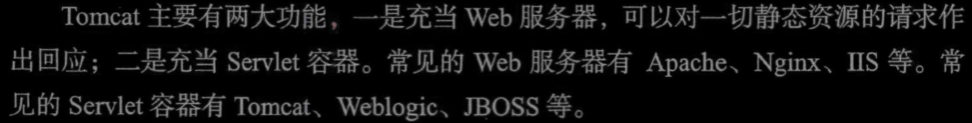
- 类加载初始化的过程中（即创建类对象的过程中）类中的构造函数以及静态代码块（由static标记）会自动执行，这形成了一个利用思路，即让java程序加载恶意类，从而实现命令执行
- sql查询中order by后面的参数无法使用预编译进行赋值，若未进行参数过滤，可能导致sql注入
- java中的命令执行函数
  - 其中使用最频繁的是 java.lang.Runtime.exec() 和 java.lang.ProcessBuilder.start(),
- Java是强类型语言，Integer id需要id是数字，不能是字符串，所以该id字段无法触发sql注入
# java审计trick
- IDEA中使用find in path功能搜索url最低目录，可以用于搜索指定接口
- web.xml可以作为javaee工程的特征
- java工程项目中 WEB-INF/web.xml 是一个特征
- 定位到处理指定请求的类后，可以在jar包中搜索该类，从而定位该类所在的jar包
- java项目中寻找漏洞触发点
  - 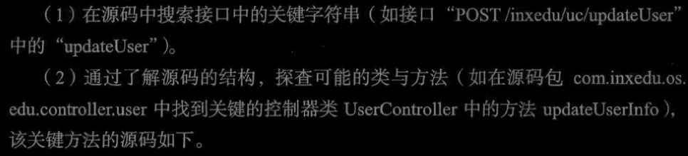
- 在源码中找到实现抽象类的代码，可以在源码中搜索implements 类名 p161，从而查找实现该抽象类的子类
- web.xml中存在java服务监听端口的信息
- xss漏洞挖掘思路
  - 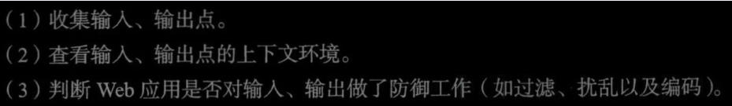
- 存储型xss挖掘思路以及案例  p206
  - 
- 当项目使用Maven作为项目管理工具，则在审计第三方组件的漏洞时，首先需要翻阅pom.xml文件，该文件中记录着这个项目使用的第三方组件及其版本号。该文件也是maven的而核心文件
- Java是静态语言，在编译期已经将各种属性和参数的类型确定好，而且Java可以执行命令的函数只有两个：一个是Runtime类的exec方法，另一个是ProcessBuilder的star方法。看过Runtime 类源码的读者应该都清楚Runtime类的exec方法其实还是通过调用ProcessBuilder 的star方法来实现执行系统命令的效果，因此我们可以先全局搜索代码中是否调用了Runtime类的exec方法或者 ProcessBuilder 的 star 方法。(即搜索 Runtime 类或ProcessBuilder类，再确定其是否调用指定函数)
- 搜索反射机制特征，确定是否存在利用反射实现rce可能
  - 通过反射我们可以使Java实现一种动态语言的效果，即可以在运行期通过传递参数的形式调用或者实例化任何类，以及调用类或者实例对象中的任何方法和属性。分析Java所有的RCE漏洞底层原理，发现几乎都离不开反射，所以全局搜索用到了反射。

# CSRF
- CSRF（Cross Site Request Forgery,跨站点请求伪造）是目前出现次数比较多的漏洞，该漏洞能够使攻击者盗用被或击者的身份信息，去执行相关敏感操作。实际上这种方式是攻击者通过一些钓鱼等手段欺骗用户去访问一个自己曾经认证过的网 站，然后执行一些操作（如后台管理、发消息、添加关注甚至是转账等行为）。由于浏览器曾经认证过，因此被访问的网站会认为是真正的用户操作而去运行。简而言之,CSRF漏洞的工作原理是攻击者盗用了用户的身份，以用户的名义发送恶意请求。 图6-1所示为CSRF漏洞的攻击原理。
- 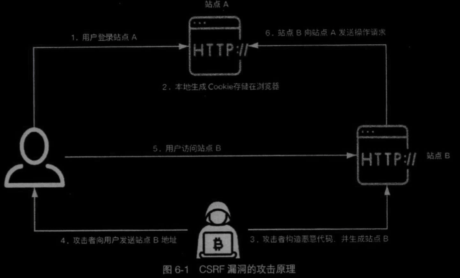
- 从图6-1中可以看到，一次完整的CSRF攻击需要具备以下两个条件。 
  - 用户已经登录某站点，并且在浏览器中存储了登录后的Cookie信息。
  - 在不注销某站点的情况下，去访问攻击者构造的站点。 
- 总的来说，CSRF漏洞攻击是一种比较简单的攻击，利用Web的隐式身份验证机制来达到攻击者的攻击目的
- 通备来说，检测CSRF漏洞是一项比较烦琐的工作，最简单的方法就是抓取一个正常请求的GET/POST数据包，删除Referer字段后再重新提交，如果该提交操作有 效，那么基本上可以确定该操作存在CSRF漏洞。
- CSRF漏洞一般不需要通过代码审计来发掘，业内已经有一些专门针对CSRF漏洞进行检测的工具,如CSRFTester、 CSRF Request Builder等。
- 核心思想可以理解为攻击者窃取到受害者针对某网站认证后的合法请求a，并尝试重新发送该请求a到该网站从而以受害者身份触发相应功能，所以网站为防御此类攻击，可以让每次的请求中均携带一个不同的id值并每次验证该id值，从而保证同一请求仅能起效一次，无法通过重复发送触发功能，在此基础上也可以检测请求的referer，从而判断请求的来源，确定请求发送者的身份
- csrf三种防御思路
  - STP（ Synchronizer Token Pattern,令牌同步模式），这种防御机制是当用户发送请求时，服务器端应用将token嵌入HTML表格中，并发送给客户端。客户端提交 HTML表格，会将令牌发送到服务端，令牌的验证是由服务端实行的。令牌可以通 过任何方式生成，只要确保其随机性和唯一性。这样就能够确保攻击者发送请求的 时候，由于没有该令牌而无法通过验证。上述第二个实例中，该源程序采用的就是 这种机制来防御CSRF攻击，但是该源程序未保证token的唯一性，从而导致其 CSRF防御机制如同虚设。 
  - 检查Referer字段。HTTP头中有一个Referer字段，这个字段用以标明请求来源于哪个地址。在处理敏感数据请求时，一般情况下，Referer字段应该与请求地址 位于同一域名下。而如果是CSRF攻击传递来的请求，Referer字段会是包含恶意攻 击载荷的地址（如图6-1中的站点B）.通过这种判断能够识别出CSRF攻击。这种 防御手段的关键点在于如何建立合适的校验机制。在第一个实例中，如果我们建立 一个白名单来替换判断Referer的开头字符检测，就可以阻止攻击者绕过Referer的判断
  - 添加校验token。CSRF的本质是攻击者通过欺骗用户去访问自己设置的地址，所以如果在所有用户进行敏感操作时，要求用户浏览器提供未保存在Cookie中且攻 击者无法伪造的数据作为校验，那么攻击者就无法再进行CSRF攻击。这种方式通 常是在请求时增加一个加密的字符串token,当客户端提交请求时，这个字符串token 也被一并提交上去以供校验。当用户进行正常的访问时，客户端的浏览器能够正确 得到并传回这个字符串tokeno而通过CSRF攻击的方式，攻击者无法事先获取到该 token值，服务端就会因为校验token的值为空或者错误，拒绝这个可疑请求，从而达到防范CSRF攻击的目的

# SSRF
- Java中的SSRF利用是有局限性的，在实际场 景中，一般利用http/https协议来探测端口、暴力穷举等，还可以利用file协议读取/ 下载任意文件。
- SSRF漏洞出现的场景有很多，如在线翻译、转码服务、图片收藏/下载、信息采集、邮件系统或者从远程服务器请求资源等。通常我们可以通过浏览器查看源代 码查找是否在本地进行了请求，也可以使用DNSLog等工具进行测试网页是否被访 问。但对于代码审计人员来说，通常可以从一些http请求函数入手，表6-1中是在 审计SSRF漏洞时需要关注的一些敏感函数。
- 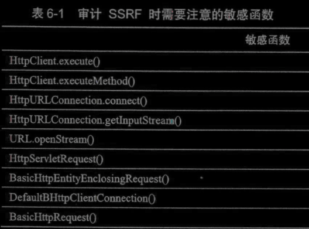
- 除表6-1中列举的部分敏感函数外，还有很多需要关注的类，如HttpClient类、URL类等。根据实际场景的不同，这些类中的一些方法同样可能存在着SSRF漏洞。 此外，还有一些封装后的类同样需要留意，如封装HttpClient后的Request类。审计 此漏洞时，首先应该确定被审计的源程序有哪些功能，通常情况下从其他服务器应 用获取数据的功能出现的概率较大，确定好功能后再审计对应功能的源代码能使漏 洞挖掘事半功倍
- SSRF漏洞修复方式
  - 统一错误信息，避免用户根据错误信息来判断远端服务器的端口状态。 
  - 限制请求的端口为http的常用端口，比如80、443、8080、8090等。
  - 禁用不需要的协议，仅仅允许http和https请求。
  - 根据业务需求，判定所需的域名是否是常用的几个，若是，则将这几个特定 的域名加入白名单，并拒绝白名单域名之外的请求。
  - 根据请求来源，判定请求地址是否是固定请求来源，若是，则将这几个特定 的域名/IP添加到白名单，并拒绝白名单域名/IP之外的请求。
  - 若业务需求和请求来源并不固定，则可以自己编写一个ssrfCheck函数，检测特定的域名、判断是否是内网IP、判断是否为http/https协议等
# url跳转漏洞
- 审计人员审计此类漏洞时，需要关注被审计程序业务含有跳转功能的区域，并对该区域进行详细审计，此外还需要关注与此类漏洞相关的常见参数名、常见函数 等，如表6-2和表6-3所示
- 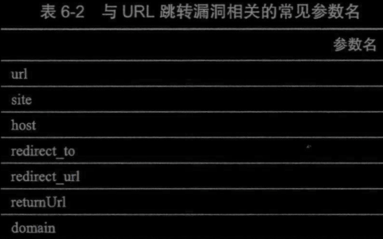
- 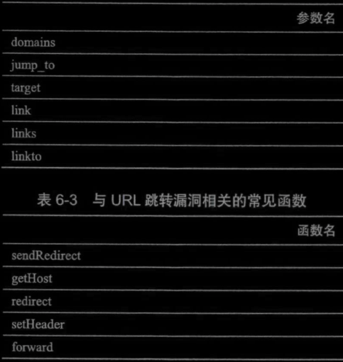
- 修复思路
  - 跳转时设置二次提醒，而非直接跳转
  - 若跳转的URL事先是可以确定的，那么设置好白名单，并且采用全匹配的 方式去检索关键字/域名；也可以先配置好相关参数，只需传对应URL的索 引即可通过索引找到对应的具体URL,然后再进行跳转。
  - 若事先无法确定跳转的URL,且并不是由用户通过参数传入的，那么可以首 先生成跳转链接，然后进行签名，只有通过验证签名才能进行跳转。
  - 若跳转的URL事先无法确定，并且是由用户通过参数传人的，则必须在跳转 时对传人的URL进行详细校验，包括但不局限于：是否是白名单内的URL, 是否包含有相关特殊字符,是否处理好不规则协议、不规则地址的请求等方式

# 文件操作漏洞
- Java中的File类就是对这些存储于磁盘 上文件的虚拟映射。与我们在本地计算机上操作文件类似
## 文件包含
- 对于Java的本地文件包含来说， 造成的危害只有文件读取或下载，一般情况下不会造成命令执行或代码执行。因为 一般情况下Java中对于文件的包含并不是将非JSP文件当成Java代码去执行。
## 文件上传
- 常用的检测后缀名的方法lastIndexOf(".")
- 该方法从后往前定位第一个.之后的字符串
- 注意后缀名也要判断大小写，否则可以通过修改后缀名为JSP等格式绕过此类限制
- 文件上传相关函数或类
  - 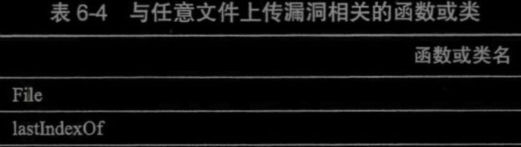
  - 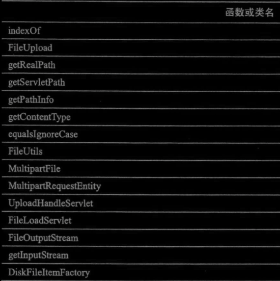
## 文件下载
- 在文件上传中我们通常用到的是FileOutputStream,而在文件下载中，我们用到的通常是FilelnputStream。
- 防御文件下载漏洞
  - 我们可以将下载文件的路径和名称存储在数据库中或者对应编号，当有用户请求下载时，直接接受其传入的编号或名称，然后调用对应的文件下载即可。
  - 在生成File文件类之前，开发者 应该对用户传入的下载路径进行校验，判断该路径是否位于指定目录下，以及是否 允许下载或读取
## 文件写入
- HTTP的PUT请求，错误页面自定义功能（即指定错误html页面的内容）均可能触发该漏洞
- 防护方法
  - 首先，就是要保证接收的路径不被用户控制，而且要对写入的内容进行校验
  - 其次，文件写入漏洞一般利用的是源程序本身自带的功能，因此审计者对于此类型的漏洞进行审计时, 要格外关注源程序是否具有写入文件的站点功能。
  - 此外HTTP清求中的PUT方法也可以创建并写入文件，需要进行关注
## 文件解压
- 由文件解压导致的漏洞五花八门，利用的效果也各有不同，如路径遍历、文件覆盖、拒绝服务、文件写入等
- 例如解压函数中未对ZIP压缩包中的文件
名进行参数校验就进行文件的写入。这样的代码写法会引发目录穿越漏洞，即通过将压缩包中的文件名设置为../../test.hrml，从而实现路径穿越，将该文件解压到其他位置
- p282中存在构造此类压缩包以及jsp shell页面的方法
- 防护方法
  - 针对此类漏洞的防护，要增加解压ZIP包算法的防护逻辑，如使代码在解压每个条目之前对其文件名进行校验。如果某个条目校验未通过(预设解压路径与实际 解压路径不一致)，那么整个解压过程将会被终止。

# web后门漏洞
- 即webshell，java中可以特指JSP webshell
- 函数调用后门
  - 直接函数调用
  - 反射方法调用
- JDK特性
- 通过java表达式实现后门

# 逻辑漏洞
- 辑漏洞出现较为频繁的地方一般是登录验证逻辑、验证码校验逻辑、密码找回逻辑、权限校验逻辑以及支付逻辑等常见的业务逻辑
## 登录逻辑漏洞示例
- 登录过程中返回用户名不存在或密码误信息，导致攻击者可以通过爆破判断定用户名是否存在
- 用户密码输入多次则锁定，攻击者通多次输入错误密码，从而锁定管理员号，导致管理员无法正常登录
- 登录时的验证码不变，验证码没有一完整的服务请求，只有当用户刷新URL才改变；拦截登录时验证码的刷新请求可 以使第一次验证码不会失效，从而过验证码的限制
- 使用短信验证码登录的站点，当验证信验证码时返回state的成功值success,失败值是false,然后客户端根state的值来确定下一步的动作。这样我们可以通过修改响应包，绕过短信验证
- 有的时候在短信验证码处随便输入验数字会返回验证码错误，但是当 我们验证码置空提交请求时，服务端却不验，从而通过置空绕过登录验证
## 密码找回、密码修改逻辑漏洞
- 验证码有效时间过长，导致不失效可被爆破。 
- 验证码找回界面未作校验，导致可以跳步找回，即直接访问密码修改界面页面。 
- 未对找回密码的每一步做限制，如找回需要3个步骤，第一步确认要找回的 账号，第二步做验证，第三步修改密码。在第三步修改密码时，存在账号参数，因此可以尝试修改其他用户账号，达到修改任意账户密码的目的。
- 有些密码找回时未做验证码功能，因而可能导致账号枚举。
## 支付购买功能可能出现的逻辑漏洞
- 未对价格进行二次验证，导致攻击者可以抓包修改价格参数后提交，实现修改商品价格的逻辑漏洞。
- 存在两个订单，一个订单1元，另一个订单1 000元，对于1元订单进行支付，支付后返回时存在token,将这个token保存，然后再将订单号替换成贵的订单，这样就可能完成两个订单的同时支付。
- 没有对购买数量进行负数限制，这样就会导致有一个负数的需支付金额，若支付成功，则可能购买了一个负数数量的产品，也有可能返还相应的积分/金币到用户的账户上。
- 请求重放，当支付成功时，重放其中请求，可能导致本来购买的一件商品数量变成重放请求的次数，但价格只是支付一件商品的价格，更甚者多次下订单，会出现0元订单情况。

# 前端配置不当漏洞
- CORS策略
  - 相关http头部及其含义
  - 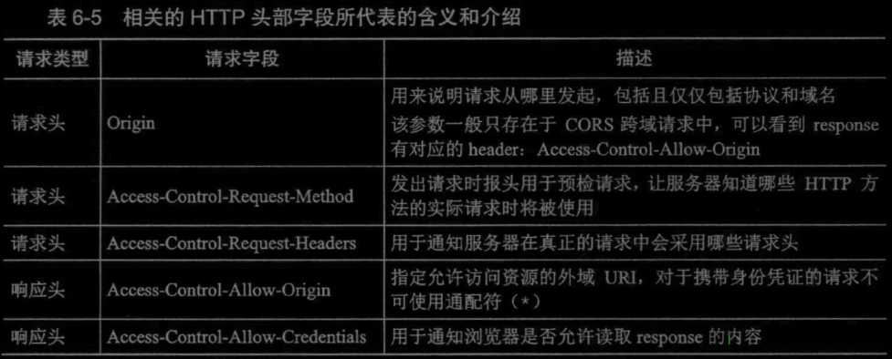
- CSP策略   
- 不仅仅是由于前端配置不当才会产生漏洞，后端配置不当而产生的漏洞也有很多，如crossdomam.xml配置不当漏洞、Spring Boot Actuator配置不当漏洞、Nginx 配置不当漏洞等。配置不当会使攻击者有机可乘，因此对于审计者来说，在审计源代码时也应关注源码中的配置问题

# 拒绝服务攻击漏洞
## ReDoS（Regular expression Denial of Service,正则表达式拒绝服务）
- 漏洞实际上是开发人员使用了正则表达式对用户输入进行有效性校验，但是当编写的正则表达式存在缺陷时，攻击者可以构造特殊字符来大量消耗服务器的系统资源， 造成服务器的服务中断或堵塞
- 正则表达式相关函数
  - 审计的函数点不应该局限于matcher。、compile。、regex。、 splitO以及replaceAllO等函数，能够利用正则表达式处理字符串的方法都需要关注。
## 由解压功能导致的拒绝服务漏洞
- 攻击者可以利用该漏洞，构造具备“压缩包炸弹”功能的ZIP文件。解压程序在对“压缩包炸弹”进行解压缩时，可能感到负担，进而崩溃。同时，服务器的硬盘空间可能被写满，致使正常工作受影响。
- 当解压方法未对ZIP压缩包中的文件总大小进行限制就进行文件的写入。这样的代码写法会引发“由压缩包炸弹造成的拒绝服务攻击”
- 通过python脚本创建压缩包炸弹 p321
  - python3 zipbomb —mode=quoted_overlap —num-files=25O —compressed-size= 21179 > zbsm.zip
  - 生成的恶意文件zbsm.zip只有42KB,但是实际解压出的文件总大小约为5.08GB,

# 点击劫持漏洞
- 点击劫持是一种视觉上的欺骗手段，攻击者利用iframe元素制作 了一个透明的、不可见的页面，然后将其覆盖在另一个网页上，最终诱使用户在该 网页上进行操作。当用户在不知情的情况下单击攻击者精心构造的页面时
- 审计思路
  - 对于审计者来说，最直观的审计方法就是直接使用i住ame引用，观测该站点能否访问，其次就是通过审计配置设置来确定源程序是否设定了相关策略，具体如下。
    - 设置 Meta 标签方法，如设置 <meta http-equiv="X-FRAME-OPTIONS" content="DENY">；
    - 设置 Apache 主机方法，如设置 Header always append X-Frame-Options SAMEORIGIN; 
    - 设置 Nginx 主机方法，如设置 add_header X-Frame-Options "SAMEORIGIN"; o •设置.htaccess 文件方法，如设置 Header append X-FRAME-OPTIONS "SAMEORIGIN”;
    - 设置合适的 CSP 策略，如设置 Content-Security-Policy: frame-ancestors 'self；o除上述5个设置项外,还有很多方法，有兴趣的读者可以参考OWASP Cheat Sheet Serieso

# HTTP参数污染漏洞 p328
- 简单来说，HTTP参数污染(HTTP Parameter Pollution, HPP )就是为一个参数赋予两个或两个以上的值。由于现行的HTTP标准并未具体说明在遇到多个输入值 为相同的参数赋值时应如何处理，并且不同站点对此类问题做出的处理方式不同， 因此会造成参数解析错误。
- 主要思想是在url传递参数的过程中将同一个参数重复设置，此时根据web服务处理机制以及java程序参数检测逻辑的不同，可能导致参数的正常值被用户设置到异常值所覆盖，从而导致漏洞
- HPP漏洞的产生，一方面因为Web服务器处理机制的不同，具体服务器的处理
机制如表
- 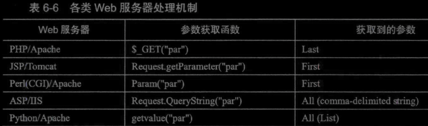
- HPP漏洞的产生原因来自源程序中的参数逻辑检测，如果在源程序中对参数的逻辑检测存在缺陷，同样会产生HPP漏洞

# SSM框架审计
- 无论是审计一个普通项目或者是Tomcat所加载的项目，通常都从web-xml配置文件开始入手 Servlet 3.0以上版本提供一些新注解来达到与配置web.xml 相同的效果。但是在实际项目中主流的配置方法仍然 是 web.xml
## web.xml文件的主要工作包括以下几个部分。
- web.xml 启动 Spring 容器。
- DispathcherServlet的声明，DispathcherServlet将用户的请求转发Spring MVC中，交由Spring MVC的Controller进行更多处理。具体来说是<servlet><servlet>和<servlet-mapping></servlet-mapping>数据构位于web.xml中，用于定义指定路径的请求由哪个类进行处理
- 其余工作是session过期、字符串编码等
### web.xml的<filter>标签
- 该标签用于配置servlet中的过滤器，包括<filter></filter>以及<filter-mapping></filter-mapping>标签对，用于将过滤器类与被过滤的url对应起来
- <filter-mapping></filter-mapping>标签下存在<dispatcher></dispatcher>，用于指定何时触发过滤器 p352
- 在审计代码时，这也是需要注意的一个点，因为开发人员的错误配置有可能导致本应该经过过滤器的请求却被直接放行，从而使项目中的过滤器失效
- Filter接口中有3个方法，这里进行简单介绍。 
  - init方法：在创建完过滤器对象之后被调用。只执行一次。 
  - doFilter方法：执行过滤任务方法。执行多次。
  - destroy方法：Web服务器停止或者Web应用重新加载，销毁过滤器对象
- Filter链中的各个Filter的拦截顺序与它们在web.xml文件中的映射顺序一
致，在上一个Filter.doFilter方法中调用FilterChain.doFilter方法将激活下一个 Filter 的 doFilter 方法，最后一个 Filter.doFilter 方法中调用的 FilterChain.doFilter 方法将激活目标Servlet的service方法。只要Filter链中任意一个Filter没有调用FilterChain.doFUter方法，则目标
Servlet的service方法就都不会被执行
## Spring 核心配置文件 applicationContext.xml
- applicationContext.xml中包含3个配置文件,它们是Spring用来整合Spring MVC和MyBaits的配置文件，文件中的内容都可以直接写入applicationContext.xml中，因为applicationContext.xml是Spring的核心配置文件，例如生成Bean,配置连接池，生成sqlSessionFactoryo但是为了便于理解，这些配置分别写在3个配置文件中，由applicationContext.xml将3个xml进行关联
- 三个配置文件为spring-dao.xml spring-service.xml spring-mvc.xml
## Spring-mvc.xml配置文件
- 数据经由 DispatcherServlet 派发至 Spring-mvc.xml 的 Controller层，我们先看 Spring-mvc.xml配置文件
- 对应control层
## spring-service.xml配置文件
- 这里我们就要从Spring MVC的部分过渡到Spring的部分，所谓的过渡就是我们从Spring MVC的Controller层去调用Service层，而Service层就是我们使用Spring 进行loC控制和AOP编程的地方
  对应于service层
## pom.xml 
- 该配置文件将MyBatis与Spring关联起来，用于数据从Spring过渡到MyBatis
- 即对应DAO层
- 该配置文件中加载MyBatis本身以及mybatis-spring，后者的配置文件为spriiig-dao.xml，该文件用于整合Spring和MyBatis的配置文件。
- 之后的部分为看懂
## 以上过程的总结
- 整体过程是Spring MVC（控制层）->Spring（service层）->MyBatis（DAO层）->执行sql语句进行数据库操作
- SSM框架有3种配置方式，即全局采用xml配置文件的形式，全局采取注解的
配置方式，或者注解与xml配置文件配合使用的方式，不同模块间数据调用关系依赖于xml配置文件以及注解确定，审计过程中可以重点关注此类配置
## SSM框架审计思路总结 p359

# SSH框架审计
- SSH框架即Spring MVC、Spring和MyBatis
## 查看web.xml文件
- 其中包括applicationContext.xml配置文件的路径（即Spring的核心配置文件）
## 查看applicationContext.xml配置文件
- 其中包括hibernate的总配置文件，以及一个hibernate的映射文件
- 该配置文件中的一些信息涉及到spring依赖注入等技术，对于确定解析请求过程中实际使用到的类具有重要作用
## Struts2的核心配置文件struts2.xml
- 该配置文件中配置了 Sturts2中最核心的部分，即所谓的Actiono
- 这里配置的每一个Action都有其对应的请求URI和处理该请求的Class,以及所对应的方法。我们先从allBook这个action开始讲解,该功能用于首页所有书籍的展示
- 每个action标签中还会有一些result子标签，该标签有两个属性，分别是name name属性的主要作用是匹配返回的字符串，并选择与之对应的页属性和type属性。 面。这里当QueryAllBookAction执行完成后，如果返回的字符串是success,则返回 queryBookBylD.jsp；如果返回的字符串是false,则返回error.jsp。
- result中还有一个常用属性是type。type属性的值代表去往JSP页面是通过转发还是通过重定向。转发和重定向这两种方式的区别为，转发是服务端自己的行为，在转发的过程中携带Controller层执行后的返回结果;而重定向则需要客户端的参与, 通过300状态码让客户端对指定页面重新发起请求。
## 一个具体的审计过程 p368
## 上述分析过程中主要在xml文件中寻找数据在不同组件间传输的依据，故重点关注xml等配置文件，也可以通过全局搜索函数名的方式确定处理指定请求的函数
## 使用filter或预编译从而防御sql注入
## 针对Hibernat实现的HQL数据查询语言，也可以实现sql注入，但是存在一些限制，同时也可以使用预编译方法以及添加过滤器的方法实现sql注入的防御 p373

# spring boot框架审计
- 从文件结构中可以发现，以往我们在审计过程中最先注意到的web.xml文件在Spring Boot中被 取消，那么审计如何开始呢？ Spring Boot开发的项 目都有一个主配置类，通常放置于包的最外层，当前项目的主配置类是SpringbootdemoApplication 类
- 查看配置文件application.properties
- spring boot自动装配
  - Spring Boot项目的主配置类SpringbootdemoApplication有一个注解为
©SpringBootApplication,当一个类上存在该注解时，该类才是Spring Boot的主配置类。当Spring Boot程序执行时，扫描到该注解后，会对该类当前所在目录以及所有 子目录进行扫描,这也是为什么SpringbootdemoApplication这个主配置类一定要写在 包中所有类的最外面，因此省略了之前在SSH以及SSM中的种种XML配置。讲到 这里,相信读者应该意识到我们在SSH项目以及SSM项目中通过XML配置的信息, 在这里都要改为使用注解来进行配置。
- 分析析发现Spring Boot的执行流程和SSM的大致相同，差别只是Spring Boot构建的Web 项目中缺少很多配置文件。很多时候通过注解规定数据流的方向。

# 开发框架使用不当范例（struts2远程代码执行） p377
- 没有太理解

# jspxcms审计
## 了解目录结构
## 了解项目功能
## 第三方组件漏洞审查
- 当项目使用Maven作为项目管理工具，则在审计第三方组件的漏洞时，首先需要翻阅pom.xml文件，该文件中记录着这个项目使用的第三方组件及其版本号。该文件也是maven的而核心文件
## sql审计
- 全局搜索query，定位sql语句，发现使用占位符构造sql语句，不会产生sql注入
- 功能点审计，审计多个有数据库操作的功能点，发现数据库操作均使用占位符构造sql语句，故不存在sql注入问题
## xss审计
- 针对网站评论功能进行xss审计
- 抓取提交评论的数据包，代码中搜索接口（find in path），找到实现该接口的类
- 输入过程未经有效校验，但xss并不发挥作用，推测输出点对输出内容进行了转义
- 分析输出，确定了使用模板引擎Freemarker，搜索该项目资料，发现一模板文件中进行了输出转义。从而阻止xss漏洞
- 分析其他模板文件中未对输出进行转义，在源码中搜索该模板文件名，并上溯分析，发现用户可控的输入点，定位到存储型xss漏洞，后续分析发现该漏洞最新版本中已经被修复
## ssrf审计
- 可能出现SSRF漏洞点的站点功能。 
  - 内容管理中的文档属性。 
  - 文件管理中的上传文件。（例如从远端上传文件）
  - 模块组件功能中的采集管理。
  - 插件功能中的广告管理。
- 搜索敏感函数进行分析，搜索HttpURLConnection类，发现了远程加载图片的相关功能中url可以用户指定，但必须为http协议，此时该漏洞可以用于内网探测，向上追溯触发该代码的功能点
  - 该漏洞中可以构造存在xss内容的图片，通过用户指定url将该图片下载到网站，访问该图片时触发xss漏洞
- 文章采集功能中，通过指定url，将远程文章的html页面获取到本地，该过程未限制url类型，导致ssrf漏洞，黑盒测试确定后，再确定该功能对应的源码，尝试进行分析
## RCE审计
- 针对第三方组件的rce审计，确定第三方组件存在rce后，确定是否存在该rce相关依赖
- 最终发现结合多个组件的代码，网站存在反序列化rce漏洞
- 分析java自身代码是否可能存在RCE
  - Java是静态语言，在编译期已经将各种属性和参数的类型确定好，而且Java可以执行命令的函数只有两个：一个是Runtime类的exec方法，另一个是ProcessBuilder的star方法。
  - 看过Runtime 类源码的读者应该都清楚Runtime类的exec方法其实还是通过调用ProcessBuilder 的star方法来实现执行系统命令的效果，
  - 因此我们可以先全局搜索代码中是否调用了 Runtime 类的 exec 方法或者 ProcessBuilder 的 star 方法。
- 搜索反射机制特征，确定是否存在利用反射实现rce可能
  - 通过反射我们可以使Java实现一种动态语言的效果，即可以在运行期通过传递参数的形式调用或者实例化任何类，以及调用类或者实例对象中的任何方法和属性。分析Java所有的RCE漏洞底层原理，发现几乎都离不开反射，所以全局搜索用到了反射。
  - 搜索使用到反射并可以执行函数的类，回溯分析该类的指定方法如何被调用，从而确定该反射是否会触发rce
  - 搜索反射时需要重点关注method.invoke方法
- RCE审计总结
  - 首先查看程序中是否了引用包含有已知RCE漏洞的第三方库
  - 如果没有，则需要着重审计项目中有无可造成命令执行的函数和类，如Runtime、ProcessBuilder等。
  - 其次就是反射需要重点关注method.invoke方法，以及前文中没有提及的反序列化漏洞。
  - 挖掘反序列化漏洞时，除了查看有没有引用 含有已知反序列化的第三方库以外，还要注意项目本身有无调用反序列化的点，如 JDK自带的反序列化方法readobject。本项目中的反序列化行为是通过调用了 Jackson 这个第三方库来进行的，同样需要注意JDK自带的反序列化方法readObjecto

# 注意
- 反序列化后面的几个漏洞未分析清楚，需要一定的java基础后再分析