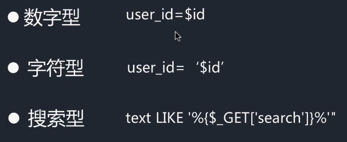
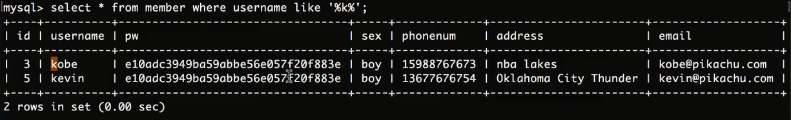
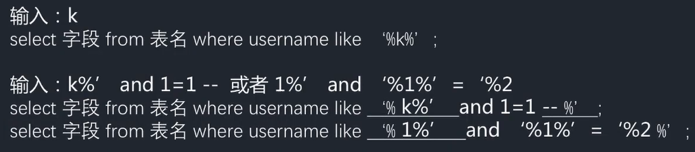
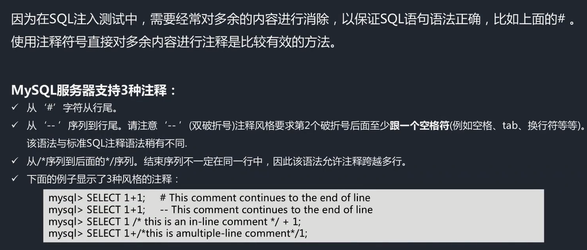
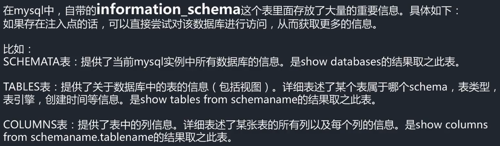

# sql注入漏洞注入点分类

- 分类依据是相关数据是以数字型变量、字符型变量或是搜索类变量（及使用到sql中的搜索相关功能）拼接到sql语句中
- 分类的主要目标是设法构造相应的闭合，从而成功执行sql语句
- sql语句中使用like语法进行模糊匹配，其会使用到%符号作为占位符，所以利用时需要闭合%
  - 
  - 
- php中字符串可以使用单引号或双引号包裹，所以在尝试闭合时，可以尝试分别使用单、双引号进行闭合
# 手动测试相关输入点是否存在注入
- 例如字符型的输入点中
  - 通过输入'查看返回是否报错
  - 通过输入'and 1=1#或"and 1=1#输出正常，输入'and 1=2#或"and 1=2#输出错误，说明存在漏洞（#表示注释，将后面的单引号或双引号闭合掉）
- 在http header的sql注入漏洞中，可以通过将http头的相关字段赋值为'发送给数据端，如果报错，说明服务端将http头中的字段带入到sql操作中，从而产生sql注入漏洞，cookie中的字段也可能被用于sql语句拼接，所以也可以cookie字段赋值为'，从而测试sql注入漏洞是否存在
# MySQL支持的注释格式

# MySQL中部分自带的表中存在关键信息

# 存在sql注入后，从数据库中提取数据的方法
- 使用or 1=1输出所有数据
- 使用union联合查询，执行自己的sql语句
  - union查询中，union后面的select语句所查询的字段数必须与union之前的select相同，可以通过order by语句确定一条sql语句查询的字段数
