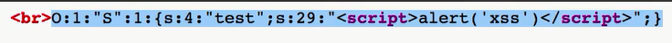

# 关键函数
- serialize()
- unserialize()
# 漏洞原理关键
- 关键在于php对象序列化后的字符串，反序列化可以将此类字符串还原为php对象，php类中存在相关魔法函数，会在类对象被创建或销毁等时间点上自动执行，若用户输入可以作为字符串被反序列化函数执行，则用户可以指定被还原的类对象以及其魔法函数，从而执行任意php代码，也可以在php对象中包含js代码，从而执行任意js代码
- 下属包含js代码的字符串当被反序列化时，即可实现js弹窗
  - 